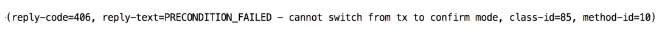
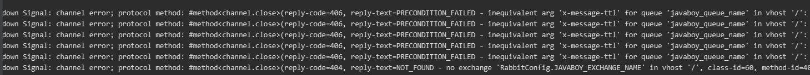
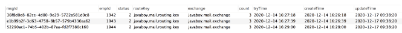

### 消息发送可靠性

确保消息发送的可靠性，主要从两方面去确认：  
1 **消息成功到达 Exchange**  
2 **消息成功到达 Queue**  
如果这两步中任一步骤出现问题，那么消息就没有成功送达，此时我们可能要通过重试等方式去重新发送消息，多次重试之后，如果消息还是不能到达，则可能就需要人工介入了。  

确保消息发送成功，需要做好三件事：  
1 **确认消息到达 Exchange**。  
2 **确认消息到达 Queue**。  
3 **开启定时任务，定时投递那些发送失败的消息**。  
#### 如何确保消息成功到达 RabbitMQ？RabbitMQ 给出了两种方案：  
1 **开启事务机制**  
2 **发送方确认机制**  
这是两种不同的方案，不可以同时开启，只能选择其中之一，如果两者同时开启，则会报如下错误：


#### 开启事务

首先需要先提供一个事务管理器，如下：

```java
/**
 * 开启事务模式
 * @return
 */
@Bean
RabbitTransactionManager transactionManager(ConnectionFactory connectionFactory) {
    return new RabbitTransactionManager(connectionFactory);
}

@Bean
RabbitTemplate rabbitTemplate(ConnectionFactory connectionFactory) {
    RabbitTemplate rabbitTemplate = new RabbitTemplate(connectionFactory);
    //开启事务模式
    rabbitTemplate.setChannelTransacted(true);
    return rabbitTemplate;
}
```

首先需要先提供一个事务管理器，如下：

```java
/* 
 * 开启事务模式之后，RabbitMQ 生产者发送消息会多出四个步骤
 * 1. 客户端发请求，将通信信道设置为事务模式
 * 2。 服务端给出答复，同意将通信信道设置为事务模式
 * 3。 发送消息（本来就有的）
 * 4。 提交事务
 * 5。 服务端给出答复，确认事务提交。
 * 事务模式的效率有点低，并非是一个最佳解决方案
 */
@Service
public class MsgService {
    @Autowired
    RabbitTemplate rabbitTemplate;

    @Transactional(rollbackFor = Exception.class)
    public void send() {
        // 发送消息的方法上添加 @Transactional 注解标记事务。
        // 调用 setChannelTransacted 方法设置为 true 开启事务模式。
        rabbitTemplate.setChannelTransacted(true);
        rabbitTemplate.convertAndSend(RabbitConfig.JAVABOY_MSG_EXCHANGE_NAME, RabbitConfig.JAVABOY_MSG_QUEUE_NAME, "hello javaboy!");
        int i = 1 / 0;
    }
}
```

#### 发送方确认

##### 单挑消息处理

配置文件

```properties
spring.rabbitmq.host=42.193.160.246
spring.rabbitmq.username=guest
spring.rabbitmq.password=guest
spring.rabbitmq.virtual-host=/
spring.rabbitmq.port=5672

# 开启发送确认机制，将来消息到达交换机之后会有一个确认的回调
# 这里有三个可选的值
#none：表示禁用发布确认模式，默认即此。
#correlated：表示成功发布消息到交换器后会触发的回调方法。
#simple：类似 correlated，并且支持 waitForConfirms() 和 waitForConfirmsOrDie() 方法的调用。
spring.rabbitmq.publisher-confirm-type=correlated
# 消息到达队列的回调（消息如果没有成功到达队列，会触发回调方法）
spring.rabbitmq.publisher-returns=true
# 自带重试机制
# 如果发送方一开始就连不上 MQ，那么 Spring Boot 中也有相应的重试机制，但是这个重试机制就和 MQ 本身没有关系了，这是利用 Spring 中的 retry 机制来完成的
spring.rabbitmq.template.retry.enabled=true
# 重试起始间隔时间
spring.rabbitmq.template.retry.initial-interval=1000ms
# 最大重试次数
spring.rabbitmq.template.retry.max-attempts=6
# 间隔时间乘数
spring.rabbitmq.template.retry.multiplier=1.2
# 最大重试间隔时间
spring.rabbitmq.listener.direct.retry.max-interval=10000ms
```

接下来我们要开启两个监听，

```java
@Configuration
public class RabbitConfig implements RabbitTemplate.ConfirmCallback, RabbitTemplate.ReturnsCallback {
    public static final String JAVABOY_EXCHANGE_NAME = "javaboy_exchange_name";
    public static final String JAVABOY_QUEUE_NAME = "javaboy_queue_name";

    private static final Logger logger = LoggerFactory.getLogger(RabbitConfig.class);

    @Autowired
    RabbitTemplate rabbitTemplate;

    @PostConstruct
    public void initRabbitTemplate() {
        rabbitTemplate.setReturnsCallback(this);
        rabbitTemplate.setConfirmCallback(this);
    }

    @Bean
    Binding msgBinding() {
        return BindingBuilder.bind(msgQueue())
                .to(directExchange())
                .with(JAVABOY_QUEUE_NAME);
    }

    @Bean
    DirectExchange directExchange() {
        return new DirectExchange(JAVABOY_EXCHANGE_NAME, true, false);
    }

    @Bean
    Queue msgQueue() {
        return new Queue(JAVABOY_QUEUE_NAME, true, false, false);
    }

    /**
     * 消息到达交换机的回调
     *
     * @param correlationData
     * @param ack
     * @param cause
     */
    @Override
    public void confirm(CorrelationData correlationData, boolean ack, String cause) {
        if (ack) {
            //消息成功到达交换机
            logger.info("{} 消息成功到达交换机", correlationData.getId());
        } else {
            logger.error("{} 消息未到达交换机，{}", correlationData.getId(), cause);
        }
    }

    /**
     * 消息没有到达队列的回调，消息路由到队列失败时被调用
     *
     * @param returned
     */
    @Override
    public void returnedMessage(ReturnedMessage returned) {
        logger.error("{} 消息未成功到达队列", returned.getMessage().getMessageProperties().getMessageId());
    }
}
```

测试：

```java
@RestController
public class HelloController {
    @Autowired
    RabbitTemplate rabbitTemplate;

    @GetMapping("/send")
    public void hello() {
        // 1 发送消息到一个不存在的交换机中，存在的队列，（不会路由到队列）
        // 输出：bc7ef958-231c-4313-b772-be2c588a6c9b 消息未到达交换机，
        rabbitTemplate.convertAndSend("RabbitConfig.JAVABOY_EXCHANGE_NAME", RabbitConfig.JAVABOY_QUEUE_NAME, "hello javaboy!", new CorrelationData(UUID.randomUUID().toString()));
        // 2 发送消息到存在的交换机，不存在的队列（会到达交换机，不会路由到队列）
        // 输出： null 消息未成功到达队列；
        // 67a8df97-1eed-4eb0-ab5b-ef7fac35b53e 消息成功到达交换机
        rabbitTemplate.convertAndSend(RabbitConfig.JAVABOY_EXCHANGE_NAME, "RabbitConfig.JAVABOY_QUEUE_NAME", "hello javaboy!", new CorrelationData(UUID.randomUUID().toString()));

        // 3 发送消息到存在的交换机和队列中
        rabbitTemplate.convertAndSend(RabbitConfig.JAVABOY_EXCHANGE_NAME, RabbitConfig.JAVABOY_QUEUE_NAME, "hello javaboy!", new CorrelationData(UUID.randomUUID().toString()));
    }
}
```

##### 消息批量处理

如果是消息批量处理，那么发送成功的回调监听是一样的，这里不再赘述。这就是 publisher-confirm 模式。相比于事务，这种模式下的消息吞吐量会得到极大的提升。

#### 失败重试

##### 自带重试机制
```properties
# 自带重试机制
# 如果发送方一开始就连不上 MQ，那么 Spring Boot 中也有相应的重试机制，但是这个重试机制就和 MQ 本身没有关系了，这是利用 Spring 中的 retry 机制来完成的
spring.rabbitmq.template.retry.enabled=true
# 重试起始间隔时间
spring.rabbitmq.template.retry.initial-interval=1000ms
# 最大重试次数
spring.rabbitmq.template.retry.max-attempts=6
# 间隔时间乘数
spring.rabbitmq.template.retry.multiplier=1.2
# 最大重试间隔时间
spring.rabbitmq.listener.direct.retry.max-interval=10000ms
```
输出：



##### 业务重试
业务重试主要是针对消息没有到达交换器的情况。  
如果消息没有成功到达交换器，根据我们第二小节的讲解，此时就会触发消息发送失败回调，在这个回调中，我们就可以做文章了！   
思路：  
1 首先创建一张表，用来记录发送到中间件上的消息，像下面这样：
  
每次发送消息的时候，就往数据库中添加一条记录。这里的字段都很好理解，有三个我额外说下：

- status：表示消息的状态，有三个取值，0，1，2 分别表示消息发送中、消息发送成功以及消息发送失败。
- tryTime：表示消息的第一次重试时间（消息发出去之后，在 tryTime 这个时间点还未显示发送成功，此时就可以开始重试了）。
- count：表示消息重试次数。
2 在消息发送的时候，我们就往该表中保存一条消息发送记录，并设置状态 status 为 0，tryTime 为 1 分钟之后。  
3 在 confirm 回调方法中，如果收到消息发送成功的回调，就将该条消息的 status 设置为1（在消息发送时为消息设置 msgId，在消息发送成功回调时，通过 msgId 来唯一锁定该条消息）。  
4 另外开启一个定时任务，定时任务每隔 10s 就去数据库中捞一次消息，专门去捞那些 status 为 0 并且已经过了 tryTime 时间记录，把这些消息拎出来后，首先判断其重试次数是否已超过 3 次，如果超过 3 次，则修改该条消息的 status 为 2，表示这条消息发送失败，并且不再重试。对于重试次数没有超过 3 次的记录，则重新去发送消息，并且为其 count 的值+1。  

当然这种思路有两个弊端：

2 去数据库走一遭，可能拖慢 MQ 的 Qos，不过有的时候我们并不需要 MQ 有很高的 Qos，所以这个应用时要看具体情况。  
3  按照上面的思路，可能会出现同一条消息重复发送的情况，不过这都不是事，我们在消息消费时，解决好幂等性问题就行了。  
当然，大家也要注意，消息是否要确保 100% 发送成功，也要看具体情况。  

### 消息消费可靠性

#### 两种消费不同思路：  
推（push）：MQ 主动将消息**推送**给消费者，**这种方式需要消费者设置一个缓冲区去缓存消息，对于消费者而言，内存中总是有一堆需要处理的消息，
所以这种方式的效率比较高，这也是目前大多数应用采用的消费方式**。
通过 @RabbitListener 注解去标记消费者。
```java
@Component
public class ConsumerDemo {
    @RabbitListener(queues = RabbitConfig.JAVABOY_QUEUE_NAME)
    public void handle(String msg) {
        System.out.println("msg = " + msg);
    }
}
```

拉（pull）：消费者主动从 MQ 拉取消息，**这种方式效率并不是很高，不过有的时候如果服务端需要批量拉取消息**，倒是可以采用这种方式。
```java
class A {
    @Test
    public void test01() throws UnsupportedEncodingException {
        Object o = rabbitTemplate.receiveAndConvert(RabbitConfig.JAVABOY_QUEUE_NAME);
        System.out.println("o = " + new String(((byte[]) o),"UTF-8"));
    }
}
```
（1）调用 receiveAndConvert 方法，方法参数为队列名称，方法执行完成后，会从 MQ 上拉取一条消息下来，如果该方法返回值为 null，表示该队列上没有消息了。
receiveAndConvert 方法有一个重载方法，可以在重载方法中传入一个等待超时时间，例如 3 秒。此时，假设队列中没有消息了，则 receiveAndConvert 方法会阻塞 3 秒，
3 秒内如果队列中有了新消息就返回，3 秒后如果队列中还是没有新消息，就返回 null，这个等待超时时间要是不设置的话，默认为 0。

***如果需要从消息队列中持续获得消息，就可以使用推模式；如果只是单纯的消费一条消息，则使用拉模式即可。切忌将拉模式放到一个死循环中，变相的订阅消息，这会严重影响 RabbitMQ 的性能***。  

#### 确保消息消费成功的两种思路
为了保证消息能够可靠的到达消息消费者，RabbitMQ 中提供了消息消费确认机制。当消费者去消费消息的时候，可以通过指定 autoAck 参数来表示消息消费的确认方式。    
- 当 autoAck 为 false 的时候，此时即使消费者已经收到消息了，RabbitMQ 也不会立马将消息移除，而是等待消费者显式的回复确认信号后，才会将消息打上删除标记，然后再删除。
- 当 autoAck 为 true 的时候，此时消息消费者就会自动把发送出去的消息设置为确认，然后将消息移除（从内存或者磁盘中），即使这些消息并没有到达消费者。  
.jpg)  
如上图所示，在 RabbitMQ 的 web 管理页面:  
- Ready 表示待消费的消息数量。  
- Unacked 表示已经发送给消费者但是还没收到消费者 ack 的消息数量。  

当我们将 autoAck 设置为 false 的时候，对于 RabbitMQ 而言，消费分成了两个部分：
- 待消费的消息  
- 已经投递给消费者，但是还没有被消费者确认的消息  

换句话说，当设置 autoAck 为 false 的时候，消费者就变得非常从容了，它将有足够的时间去处理这条消息，当消息正常处理完成后，再手动 ack，
此时 RabbitMQ 才会认为这条消息消费成功了。如果 RabbitMQ 一直没有收到客户端的反馈，并且此时客户端也已经断开连接了，那么 RabbitMQ 就会将刚刚的消息重新放回队列中，等待下一次被消费。

##### 消息拒绝  
```java
@Component
public class ConsumerDemo {
    @RabbitListener(queues = RabbitConfig.JAVABOY_QUEUE_NAME)
    public void handle(Channel channel, Message message) {
        //获取消息编号
        long deliveryTag = message.getMessageProperties().getDeliveryTag();
        try {
            //拒绝消息
            channel.basicReject(deliveryTag, true);
        } catch (IOException e) {
            e.printStackTrace();
        }
    }
}
```
调用 basicReject 方法时，第二个参数是 requeue，即是否重新入队。如果第二个参数为 true，则这条被拒绝的消息会重新进入到消息队列中，等待下一次被消费；如果第二个参数为 false，则这条被拒绝的消息就会被丢掉，不会有新的消费者去消费它了。

需要注意的是，basicReject 方法一次只能拒绝一条消息。  
##### 消息确认 
###### 自动确认 
在spring boot中，默认情况下，消息消费就是自动确认的。
```java
@Configuration
public class MsgReceiver {

    @RabbitListener(queues = RabbitConfig.JAVABOY_QUEUE_NAME)
    public void handleMsg(String msg) {
        System.out.println("msg = " + msg);
        int i = 1 / 0;
    }
}
```
通过 `@Componet` 注解将当前类注入到 Spring 容器中，然后通过 @RabbitListener 注解来标记一个消息消费方法，默认情况下，消息消费方法自带事务，即如果该方法在执行过程中抛出异常，那么被消费的消息会重新回到队列中等待下一次被消费，如果该方法正常执行完没有抛出异常，则这条消息就算是被消费了。
###### 手动确认
###### 推模式手动确认
先关闭自动确认，配置表示将消息的确认模式改为手动确认。
`spring.rabbitmq.listener.simple.acknowledge-mode=manual`  
```java
public class MsgReceiver {

    private static final Logger logger = LoggerFactory.getLogger(MsgReceiver.class);

    @RabbitListener(queues = RabbitConfig.JAVABOY_QUEUE_NAME)
    public void handleMsg(Message message, Channel channel) {
        //获取消息的一个标记
        long deliveryTag = message.getMessageProperties().getDeliveryTag();
        try {
            // 消费消息的代码
            //开始消息的消费
            byte[] body = message.getBody();
            String s = new String(body);
            logger.info("handleMsg,{}", s);
            int i = 1 / 0;
            //消费完成后，手动ack
            //第一个参数是消息的标记，第二个参数如果为 false，表示仅仅确认当前消息，如果为 true，表示之前所有的消息都确认消费成功
            channel.basicAck(deliveryTag, false);
        } catch (Exception e) {
            // 消费失败，执行basicNack方法
            //手动 nack，告诉 mq 这条消息消费失败
            try {
                channel.basicNack(deliveryTag, false, true);
            } catch (IOException ex) {
                ex.printStackTrace();
            }
        }
    }
}
```
- basicAck：这个是手动确认消息已经成功消费，该方法有两个参数：第一个参数表示消息的 id；第二个参数 multiple 如果为 false，表示仅确认当前消息消费成功，如果为 true，则表示当前消息之前所有未被当前消费者确认的消息都消费成功。
- basicNack：这个是告诉 RabbitMQ 当前消息未被成功消费，该方法有三个参数：第一个参数表示消息的 id；第二个参数 multiple 如果为 false，表示仅拒绝当前消息的消费，如果为 true，则表示拒绝当前消息之前所有未被当前消费者确认的消息；第三个参数 requeue 含义和前面所说的一样，被拒绝的消息是否重新入队。  

###### 拉模式手动确认
拉模式手动 ack 比较麻烦一些，在 Spring 中封装的 RabbitTemplate 中并未找到对应的方法，所以我们得用原生的办法，如下：
```java
class A {
    public void receive2() {
        Channel channel = rabbitTemplate.getConnectionFactory().createConnection().createChannel(false);
        long deliveryTag = 0L;
        try {
            GetResponse getResponse = channel.basicGet(RabbitConfig.JAVABOY_QUEUE_NAME, false);
            deliveryTag = getResponse.getEnvelope().getDeliveryTag();
            System.out.println("o = " + new String((getResponse.getBody()), "UTF-8"));
            channel.basicAck(deliveryTag, false);
        } catch (IOException e) {
            try {
                channel.basicNack(deliveryTag, false, true);
            } catch (IOException ex) {
                ex.printStackTrace();
            }
        }
    }
}
```

#### 幂等性问题 
> 消费者在消费完一条消息后，向 RabbitMQ 发送一个 ack 确认，此时由于网络断开或者其他原因导致 RabbitMQ 并没有收到这个 ack，那么此时 RabbitMQ 并不会将该条消息删除，当重新建立起连接后，消费者还是会再次收到该条消息，这就造成了消息的重复消费。同时，由于类似的原因，消息在发送的时候，同一条消息也可能会发送两次（参见四种策略确保 RabbitMQ 消息发送可靠性！你用哪种？）。种种原因导致我们在消费消息时，一定要处理好幂等性问题   

幂等性问题的处理倒也不难，基本上都是从业务上来处理。采用 Redis，在消费者消费消息之前，现将消息的 id 放到 Redis 中，存储方式如下：  
- id-0（正在执行任务）  
- id-1（执行任务成功）  

如果 ack 失败，在 RabbitMQ 将消息交给其他的消费者时，先执行 setnx，如果 key 已经存在（说明之前有人消费过该消息），获取他的值，如果是 0，当前消费者就什么都不做，如果是 1，直接 ack。  

极端情况：第一个消费者在执行业务时，出现了死锁，在 setnx 的基础上，再给 key 设置一个生存时间。生产者，发送消息时，指定 messageId。  

松哥在 vhr 项目中也处理了消息幂等性问题，感兴趣的小伙伴可以查看 vhr 源码（https://github.com/lenve/vhr），代码在 mailserver 中。  