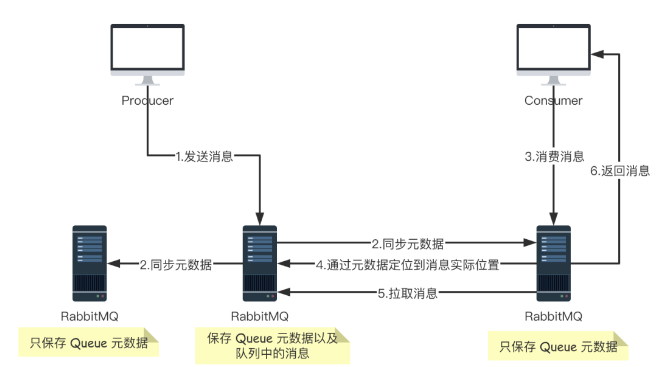
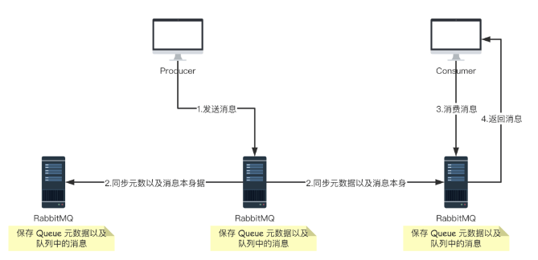

##  RabbitMQ 集群搭建

单个的 RabbitMQ 肯定无法实现高可用，要想高可用，还得上集群。

今天松哥就来和大家聊一聊 RabbitMQ 集群的搭建。

### 两种模式

说到集群，小伙伴们可能第一个问题是，如果我有一个 RabbitMQ 集群，那么是不是我的消息集群中的每一个实例都保存一份呢？

这其实就涉及到 RabbitMQ 集群的两种模式：

- 普通集群
- 镜像集群

#### 普通集群

**普通集群模式，就是将 RabbitMQ 部署到多台服务器上，每个服务器启动一个 RabbitMQ 实例，多个实例之间进行消息通信**。

**此时我们创建的队列 Queue，它的元数据（主要就是 Queue 的一些配置信息）会在所有的 RabbitMQ 实例中进行同步，但是队列中的消息只会存在于一个 RabbitMQ 实例上，而不会同步到其他队列**。

当我们消费消息的时候，如果连接到了另外一个实例，那么那个实例会通过元数据定位到 Queue 所在的位置，然后访问 Queue 所在的实例，拉取数据过来发送给消费者。

**这种集群可以提高 RabbitMQ 的消息吞吐能力，但是无法保证高可用，因为一旦一个 RabbitMQ 实例挂了，消息就没法访问了，如果消息队列做了持久化，那么等 RabbitMQ 实例恢复后，就可以继续访问了；如果消息队列没做持久化，那么消息就丢了**。

大致的流程图如下图：

#### 镜像集群

它和普通集群最大的区别在于 **Queue 数据和原数据不再是单独存储在一台机器上，而是同时存储在多台机器上**。也就是说**每个 RabbitMQ 实例都有一份镜像数据（副本数据）**。**每次写入消息的时候都会自动把数据同步到多台实例上去，这样一旦其中一台机器发生故障，其他机器还有一份副本数据可以继续提供服务，也就实现了高可用**。

### 节点类型

RabbitMQ 中的节点类型有两种：

- RAM node：内存节点将所有的队列、交换机、绑定、用户、权限和 vhost 的元数据定义存储在内存中，好处是可以使得交换机和队列声明等操作速度更快。
- Disk node：将元数据存储在磁盘中，单节点系统只允许磁盘类型的节点，防止重启 RabbitMQ 的时候，丢失系统的配置信息

**RabbitMQ 要求在集群中至少有一个磁盘节点，所有其他节点可以是内存节点，当节点加入或者离开集群时，必须要将该变更通知到至少一个磁盘节点**。**如果集群中唯一的一个磁盘节点崩溃的话，集群仍然可以保持运行，但是无法进行其他操作（增删改查），直到节点恢复**。为了确保集群信息的可靠性，或者在不确定使用磁盘节点还是内存节点的时候，建议直接用磁盘节点。

