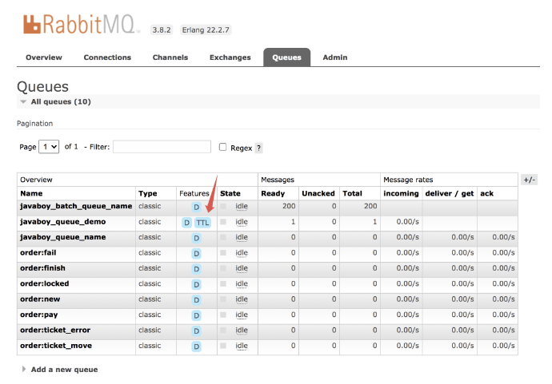
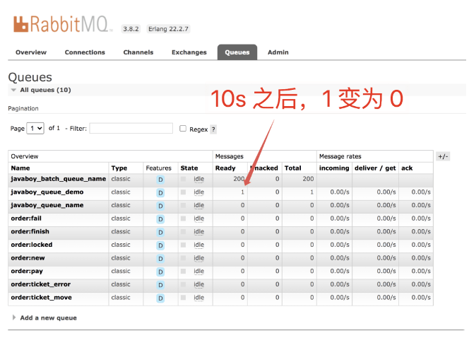
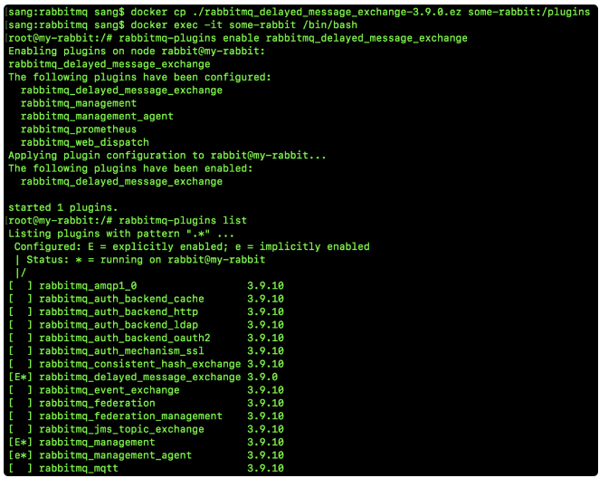
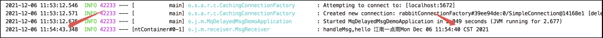

RabbitMQ 中的消息长期未被消费会过期吗？用过 RabbitMQ 的小伙伴可能都有这样的疑问，松哥来和大家捋一捋这个问题。

### 5.1 默认情况

首先我们来看看默认情况。

默认情况下，消息是不会过期的，也就是我们平日里在消息发送时，如果不设置任何消息过期的相关参数，那么消息是不会过期的，即使消息没被消费掉，也会一直存储在队列中。

这种情况具体代码就不用我再演示了吧，松哥之前的文章凡是涉及到 RabbitMQ 的，基本上都是这样的。

### 5.2 TTL

TTL（Time-To-Live），消息存活的时间，即消息的有效期。如果我们希望消息能够有一个存活时间，那么我们可以通过设置 TTL 来实现这一需求。如果消息的存活时间超过了 TTL 并且还没有被消息，此时消息就会变成`死信`，关于`死信`以及`死信队列`，松哥后面再和大家介绍。

TTL 的设置有两种不同的方式：

1. 在声明队列的时候，我们可以在队列属性中设置消息的有效期，这样所有进入该队列的消息都会有一个相同的有效期。
2. 在发送消息的时候设置消息的有效期，这样不同的消息就具有不同的有效期。

那如果两个都设置了呢？

**以时间短的为准。**

当我们设置了消息有效期后，消息过期了就会被从队列中删除了（进入到死信队列，后文一样，不再标注），但是两种方式对应的删除时机有一些差异：

1. 对于第一种方式，当消息队列设置过期时间的时候，那么消息过期了就会被删除，因为消息进入 RabbitMQ 后是存在一个消息队列中，队列的头部是最早要过期的消息，所以 RabbitMQ 只需要一个定时任务，从头部开始扫描是否有过期消息，有的话就直接删除。
2. 对于第二种方式，当消息过期后并不会立马被删除，而是当消息要投递给消费者的时候才会去删除，因为第二种方式，每条消息的过期时间都不一样，想要知道哪条消息过期，必须要遍历队列中的所有消息才能实现，当消息比较多时这样就比较耗费性能，因此对于第二种方式，当消息要投递给消费者的时候才去删除。

介绍完 TTL 之后，接下来我们来看看具体用法。

**接下来所有代码松哥都以 Spring Boot 中封装的 AMPQ 为例来讲解。**

配置还是一样的配置。

#### 队列过期

消息队列配置类：

```java
@Configuration
public class QueueTtlRabbitConfig {
    public static final String JAVABOY_QUEUES_DELAY_QUEUE_NAME = "javaboy_queues_delay_queue_name";
    public static final String JAVABOY_QUEUES_DELAY_EXCHANGE_NAME = "javaboy_queues_delay_exchange_name";

    @Bean
    Queue messageDelayQueueInQueue() {
        Map<String, Object> args = new HashMap<>();
        //给消息队列设置过期时间，该队列中的消息如果10s之内没人消费，则过期
        args.put("x-message-ttl", 10000);
        return new Queue(JAVABOY_QUEUES_DELAY_QUEUE_NAME, true, false, false, args);
    }

    @Bean
    DirectExchange messageDelayExchangeInQueue() {
        return new DirectExchange(JAVABOY_QUEUES_DELAY_EXCHANGE_NAME, true, false);
    }

    @Bean
    Binding messageDelayQueueBindingInQueue() {
        return BindingBuilder.bind(messageDelayQueueInQueue())
                .to(messageDelayExchangeInQueue())
                .with(JAVABOY_QUEUES_DELAY_QUEUE_NAME);
    }
}
```

调用端：

```java
@RestController
@RequestMapping("/queue")
public class QueueTtlController {
    @Autowired
    RabbitTemplate rabbitTemplate;

    @GetMapping("/send")
    public void helloQueue() {
        rabbitTemplate.convertAndSend(QueueTtlRabbitConfig.JAVABOY_QUEUES_DELAY_EXCHANGE_NAME, QueueTtlRabbitConfig.JAVABOY_QUEUES_DELAY_QUEUE_NAME, "hello 江南一点雨");
    }
}
```

启动项目，发送一条消息进行测试。查看 RabbitMQ 管理页面，如下：



可以看到，消息队列的 Features 属性为 D 和 TTL，D 表示消息队列中消息持久化，TTL 则表示消息会过期。

10s 之后刷新页面，发现消息数量已经恢复为 0。

这就是给消息队列设置消息过期时间，一旦设置了，所有进入到该队列的消息都有一个过期时间了。

#### 消息过期

配置类：

```java
@Configuration
public class MessageTtlRabbitConfig {
    public static final String JAVABOY_MESSSAGE_DELAY_QUEUE_NAME = "javaboy_messsage_delay_queue_name";
    public static final String JAVABOY_MESSSAGE_DELAY_EXCHANGE_NAME = "javaboy_messsage_delay_exchange_name";

    @Bean
    Queue messageDelayQueueInMsg() {
        return new Queue(JAVABOY_MESSSAGE_DELAY_QUEUE_NAME, true, false, false);
    }

    @Bean
    DirectExchange messageDelayExchangeInMsg() {
        return new DirectExchange(JAVABOY_MESSSAGE_DELAY_EXCHANGE_NAME, true, false);
    }

    @Bean
    Binding messageDelayQueueBindingInMsg() {
        return BindingBuilder.bind(messageDelayQueueInMsg())
                .to(messageDelayExchangeInMsg())
                .with(JAVABOY_MESSSAGE_DELAY_QUEUE_NAME);
    }
}
```

调用端

```java
@RestController
@RequestMapping("/msg")
public class MessageTtlController {
    @Autowired
    RabbitTemplate rabbitTemplate;

    @GetMapping("/send")
    public void helloMsg() {
        Message msg = MessageBuilder.withBody("hello javaboy!".getBytes())
                //设置过期时间为10s，消息到达 RabbitMQ 10s 之内，如果没有人消费，则消息会过期
                .setExpiration("10000")
                .build();
        rabbitTemplate.send(MessageTtlRabbitConfig.JAVABOY_MESSSAGE_DELAY_EXCHANGE_NAME, MessageTtlRabbitConfig.JAVABOY_MESSSAGE_DELAY_QUEUE_NAME, msg);
    }
}
```

接下来我们启动项目，进行消息发送测试。当消息发送成功之后，由于没有消费者，所以这条消息并不会被消费。打开 RabbitMQ 管理页面，点击到 Queues 选项卡，10s 之后，我们会发现消息已经不见了：



#### 特殊情况 ttl 为 0

还有一种特殊情况，就是将消息的过期时间 TTL 设置为 0，这表示如果消息不能立马消费则会被立即丢掉，这个特性可以部分替代 RabbitMQ3.0 以前支持的 immediate 参数，之所以所部分代替，是因为 immediate 参数在投递失败会有 basic.return 方法将消息体返回（这个功能可以利用死信队列来实现）。

### 死信队列

死信交换机，Dead-Letter-Exchange 即 DLX。

死信交换机用来接收死信消息（Dead Message）的，那什么是死信消息呢？一般消息变成死信消息有如下几种情况：

- **消息被拒绝(Basic.Reject/Basic.Nack) ，井且设置requeue 参数为false**
- **消息过期**
- **队列达到最大长度**

**当消息在一个队列中变成了死信消息后，此时就会被发送到 DLX，绑定 DLX 的消息队列则称为死信队列**。

DLX 本质上也是一个普普通通的交换机，**我们可以为任意队列指定 DLX，当该队列中存在死信时，RabbitMQ 就会自动的将这个死信发布到 DLX 上去，进而被路由到另一个绑定了 DLX 的队列上**（即死信队列）。

#### 实践

首先我们来创建一个死信交换机，接着创建一个死信队列，再将死信交换机和死信队列绑定到一起：

```java
/**
 * 死信交换机，Dead-Letter-Exchange 即 DLX。
 * <p>
 * 死信交换机用来接收死信消息（Dead Message）的，那什么是死信消息呢？一般消息变成死信消息有如下几种情况：
 * 1 消息被拒绝(Basic.Reject/Basic.Nack) ，井且设置requeue 参数为false
 * 2 消息过期
 * 3 队列达到最大长度
 * 当消息在一个队列中变成了死信消息后，此时就会被发送到 DLX，绑定 DLX 的消息队列则称为死信队列。
 * <p>
 * DLX 本质上也是一个普普通通的交换机，我们可以为任意队列指定 DLX，当该队列中存在死信时，RabbitMQ 就会自动的将这个死信发布到 DLX 上去，进而被路由到另一个绑定了 DLX 的队列上（即死信队列）。
 * @author vin
 */
@Configuration
public class DLXConfig {
    public static final String DLX_EXCHANGE_NAME = "dlx_exchange_name";
    public static final String DLX_QUEUE_NAME = "dlx_queue_name";
    public static final String DLX_ROUTING_KEY = "dlx_queue_name";

    /**
     * 配置死信交换机
     *
     * @return
     */
    @Bean
    DirectExchange dlxDirectExchange() {
        return new DirectExchange(DLX_EXCHANGE_NAME, true, false);
    }

    /**
     * 配置死信队列
     *
     * @return
     */
    @Bean
    Queue dlxQueue() {
        return new Queue(DLX_QUEUE_NAME);
    }

    /**
     * 绑定死信队列和死信交换机
     *
     * @return
     */
    @Bean
    Binding dlxBinding() {
        return BindingBuilder.bind(dlxQueue())
                .to(dlxDirectExchange())
                .with(DLX_ROUTING_KEY);
    }
}
```

接下来配置消息队列：

```java
@Configuration
public class RabbitConfig {
    public static final String MSG_EXCHANGE_NAME = "msg_exchange_name";
    public static final String MSG_QUEUE_NAME = "msg_queue_name";

    @Bean
    DirectExchange msgDirectExchange() {
        return new DirectExchange(MSG_EXCHANGE_NAME, true, false);
    }

    @Bean
    Queue msgQueue() {
        Map<String, Object> args = new HashMap<>();
        //设置消息过期时间，消息过期之后吧，立马就会进入到死信队列中
        args.put("x-message-ttl", 0);
        //指定死信队列的交换机
        args.put("x-dead-letter-exchange", DLXConfig.DLX_EXCHANGE_NAME);
        //指定死信队列路由的 key
        args.put("x-dead-letter-routing-key", DLXConfig.DLX_ROUTING_KEY);
        return new Queue(MSG_QUEUE_NAME, true, false, false, args);
    }

    @Bean
    Binding msgBinding() {
        return BindingBuilder.bind(msgQueue())
                .to(msgDirectExchange())
                .with(MSG_QUEUE_NAME);
    }
}
```

就两个参数：

- x-dead-letter-exchange：配置死信交换机。
- x-dead-letter-routing-key：配置死信 `routing_key`。

这就配置好了。

将来发送到这个消息队列上的消息，如果发生了 nack、reject 或者过期等问题，就会被发送到 DLX 上，进而进入到与 DLX 绑定的消息队列上。

死信消息队列的消费和普通消息队列的消费并无二致：

```java
@Component
public class DlxConsumer {
    @RabbitListener(queues = DLXConfig.DLX_QUEUE_NAME)
    public void dlxHandle(String msg) {
        System.out.println("dlx msg = " + msg + "------->" + Thread.currentThread().getName());
        // dlx msg = hello javaboy------->org.springframework.amqp.rabbit.RabbitListenerEndpointContainer#0-1
    }
}
```

### 实现延迟队列

我们开发中有的时候也会遇到类似的需求，例如：

- 在电商项目中，当我们下单之后，一般需要 20 分钟之内或者 30 分钟之内付款，否则订单就会进入异常处理逻辑中，被取消，那么进入到异常处理逻辑中，就可以当成是一个延迟队列。
- 我买了一个智能砂锅，可以用来煮粥，上班前把素材都放到锅里，然后设置几点几分开始煮粥，这样下班后就可以喝到香喷喷的粥了，那么这个煮粥的指令也可以看成是一个延迟任务，放到一个延迟队列中，时间到了再执行。
- 公司的会议预定系统，在会议预定成功后，会在会议开始前半小时通知所有预定该会议的用户。
- 安全工单超过 24 小时未处理，则自动拉企业微信群提醒相关责任人。
- 用户下单外卖以后，距离超时时间还有 10 分钟时提醒外卖小哥即将超时。
- ...

很多场景下我们都需要延迟队列。

整体上来说，在 RabbitMQ 上实现定时任务有两种方式：

- 利用 RabbitMQ 自带的消息过期和私信队列机制，实现定时任务。
- 使用 RabbitMQ 的 rabbitmq_delayed_message_exchange 插件来实现定时任务，这种方案较简单。

两种用法我们分别来看。

#### 6.1 用插件

##### 6.1.1 安装插件

首先我们需要下载 rabbitmq_delayed_message_exchange 插件，这是一个 GitHub 上的开源项目，我们直接下载即可：

- https://github.com/rabbitmq/rabbitmq-delayed-message-exchange/releases

选择适合自己的版本，我这里选择最新的 3.9.0 版。

下载完成后在命令行执行如下命令将下载文件拷贝到 Docker 容器中去：

```sh
docker cp ./rabbitmq_delayed_message_exchange-3.9.0.ez some-rabbit:/plugins
```

这里第一个参数是宿主机上的文件地址，第二个参数是拷贝到容器的位置。

接下来再执行如下命令进入到 RabbitMQ 容器中：

```sh
docker exec -it some-rabbit /bin/bash
```

进入到容器之后，执行如下命令启用插件：

```sh
rabbitmq-plugins enable rabbitmq_delayed_message_exchange
```

启用成功之后，还可以通过如下命令查看所有安装的插件，看看是否有我们刚刚安装过的插件，如下：

```sh
rabbitmq-plugins list
```

命令的完整执行过程如下图



OK，配置完成之后，接下来我们执行 `exit` 命令退出 RabbitMQ 容器。然后开始编码。

##### 6.1.2 消息收发

配置类和其他的一样，主要的rabbitconfig配置如下：

```java
@Configuration
public class RabbitConfig {
    public static final String QUEUE_NAME = "javaboy_delay_queue";
    public static final String EXCHANGE_NAME = "javaboy_delay_exchange";
    public static final String EXCHANGE_TYPE = "x-delayed-message";

    @Bean
    Queue queue() {
        return new Queue(QUEUE_NAME, true, false, false);
    }

    @Bean
    CustomExchange customExchange() {
        Map<String, Object> args = new HashMap<>();
        args.put("x-delayed-type", "direct");
        return new CustomExchange(EXCHANGE_NAME, EXCHANGE_TYPE, true, false,args);
    }
    
    @Bean
    Binding binding() {
        return BindingBuilder.bind(queue())
                .to(customExchange()).with(QUEUE_NAME).noargs();
    }
}
```

这里主要是交换机的定义有所不同，小伙伴们需要注意。

这里我们使用的交换机是 CustomExchange，这是一个 Spring 中提供的交换机，创建 CustomExchange 时有五个参数，含义分别如下：

- 交换机名称。
- 交换机类型，这个地方是固定的。
- 交换机是否持久化。
- 如果没有队列绑定到交换机，交换机是否删除。
- 其他参数。

最后一个 args 参数中，指定了交换机消息分发的类型，这个类型就是大家熟知的 direct、fanout、topic 以及 header 几种，用了哪种类型，将来交换机分发消息就按哪种方式来。

接下来我们再创建一个消息消费者：

```java
@Component
public class MsgReceiver {
    private static final Logger logger = LoggerFactory.getLogger(MsgReceiver.class);
    @RabbitListener(queues = RabbitConfig.QUEUE_NAME)
    public void handleMsg(String msg) {
        logger.info("handleMsg,{}",msg);
    }
}
```

测试类测试：

```java
@SpringBootTest
class MqDelayedMsgDemoApplicationTests {

    @Autowired
    RabbitTemplate rabbitTemplate;
    @Test
    void contextLoads() throws UnsupportedEncodingException {
        Message msg = MessageBuilder.withBody(("hello 江南一点雨"+new Date()).getBytes("UTF-8")).setHeader("x-delay", 3000).build();
        rabbitTemplate.convertAndSend(RabbitConfig.EXCHANGE_NAME, RabbitConfig.QUEUE_NAME, msg);
    }

}
```

在消息头中设置消息的延迟时间。

好啦，接下来启动 Spring Boot 项目，然后运行单元测试方法发送消息，最终的控制台打印日志如下：



#### 6.2 DLX 实现延迟队列

配置类

```java
/**
 * @author vin
 * 假如一条消息需要延迟 30 分钟执行，我们就设置这条消息的有效期为 30 分钟，同时为这条消息配置死信交换机和死信 routing_key，
 * 并且不为这个消息队列设置消费者，那么 30 分钟后，这条消息由于没有被消费者消费而进入死信队列，
 * 此时我们有一个消费者就在“蹲点”这个死信队列，消息一进入死信队列，就立马被消费了。
 */
@Configuration
public class RabbitConfig {
    public static final String JAVA_BOY_QUEUE_NAME = "javaboy_queue_name";
    public static final String JAVA_BOY_EXCHANGE_NAME = "javaboy_exchange_name";
    /**
     * 死信队列
     */
    public static final String DELAY_EXCHANGE_NAME = "delay_exchange_name";
    public static final String DELAY_QUEUE_NAME = "delay_queue_name";

    @Bean
    Binding msgBinding() {
        return BindingBuilder.bind(msgQueue())
                .to(msgExchange())
                .with(JAVA_BOY_QUEUE_NAME);
    }

    @Bean
    DirectExchange msgExchange() {
        return new DirectExchange(JAVA_BOY_EXCHANGE_NAME, true, false);
    }

    @Bean
    Queue msgQueue() {
        Map<String, Object> args = new HashMap<>();
        // 消息过期时间，毫秒
        args.put("x-message-ttl", 10000);
        // 设置死信交换机
        args.put("x-dead-letter-exchange", DELAY_EXCHANGE_NAME);
        // 设置死信 routing-key
        args.put("x-dead-letter-routing-key", DELAY_QUEUE_NAME);
        return new Queue(JAVA_BOY_QUEUE_NAME, true, false, false, args);
    }

    /**
     * 绑定死信队列和死信交换机
     *
     * @return
     */
    @Bean
    Binding dlxBinding() {
        return BindingBuilder.bind(dlxQueue())
                .to(dlxExchange())
                .with(DELAY_QUEUE_NAME);
    }

    /**
     * 死信交换机
     */
    @Bean
    DirectExchange dlxExchange() {
        return new DirectExchange(DELAY_EXCHANGE_NAME, true, false);
    }

    /**
     * 死信队列
     */
    @Bean
    Queue dlxQueue() {
        return new Queue(DELAY_QUEUE_NAME, true, false, false);
    }
}
```

这段配置代码虽然略长，不过原理其实简单。

- 配置可以分为两组，第一组配置死信队列，第二组配置普通队列。每一组都由消息队列、消息交换机以及 Binding 三者组成。
- 配置消息队列时，为消息队列指定死信队列，不熟悉的小伙伴可以翻一下上篇文章，传送门：[RabbitMQ 中的消息会过期吗？](https://mp.weixin.qq.com/s?__biz=MzI1NDY0MTkzNQ==&mid=2247494827&idx=1&sn=c7e6d24cc9ce7d21f3f450a41b565ddf&scene=21#wechat_redirect)。
- 配置队列中的消息过期时间时，默认的时间单位时毫秒。

生产者：

```java
@RestController
public class HelloController {
    @Autowired
    RabbitTemplate rabbitTemplate;

    @GetMapping("/send")
    public void hello() {
        Message msg = MessageBuilder.withBody(("hello javaboy" + new Date()).getBytes()).build();
        rabbitTemplate.send(RabbitConfig.JAVA_BOY_EXCHANGE_NAME, RabbitConfig.JAVA_BOY_QUEUE_NAME, msg);
    }
}
```

消费者

```java
@Component
public class MsgReceiver {
    private static final Logger logger = LoggerFactory.getLogger(MsgReceiver.class);

    @RabbitListener(queues = RabbitConfig.DELAY_QUEUE_NAME)
    public void handleMsg(String msg) {
        System.out.println("handle message: " + msg);
        logger.info("handleMsg,{}", msg);
    }
}
```