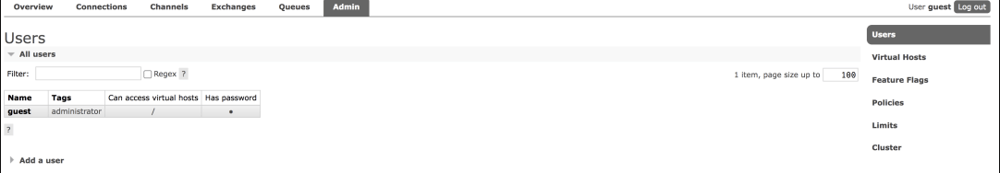
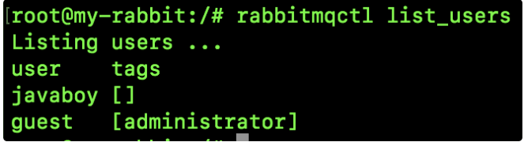

验证成功和验证失败的情况分别如下：当我们第一次安装好一个 RabbitMQ 之后，我们可能都会通过 Web 页面去管理这个 RabbitMQ，默认情况下，我们第一次使用的默认用户是 guest。

登录成功后，在 admin 选项卡可以查看所有用户：



可以看到，每个用户都有一个 `Can access virtual hosts` 属性，这个属性是啥意思呢？

#### 多租户

我们安装一个 RabbitMQ 服务器，每一个 RabbitMQ 服务器都能创建出许多虚拟的消息服务器，这些虚拟的消息服务器就是我们所说的虚拟主机（virtual host），一般简称为 vhost。

本质上，每一个 vhost 都是一个独立的小型 RabbitMQ 服务器，这个 vhost 中会有自己的消息队列、消息交换机以及相应的绑定关系等等，并且拥有自己独立的权限，不同的 vhost 中的队列和交换机不能互相绑定，这样技能保证运行安全又能避免命名冲突。

我们并不需要特别的去看待 vhost，他就跟普通的物理 RabbitMQ 一样，不同的 vhost 能够提供逻辑上的分离，确保不同的应用消息队列能够安全独立运行。

要我来说，我们该怎么看待 vhost 和 RabbitMQ 的关系呢？RabbitMQ 相当于一个 Excel 文件，而 vhost 则是 Excel 文件中的一个个 sheet，我们所有的操作都是在某一个 sheet 上进行操作。

本质上来说，vhost 算是 AMQP 协议中的概念。

#### 命令行创建 vhost

先来看看如何通过命令行创建 vhost。

因为松哥这里的 RabbitMQ 是用 docker 安装的，所以我们首先进入到 docker 容器中：

```sh
docker exec -it some-rabbit /bin/bash
```

然后执行如下命令创建一个名为 `/myvh` 的 vhost：

```sh
rabbitmqctl add_vhost myvh
```

最终执行结果如下：


然后通过如下命令可以查看已有的 vhost：

```sh
rabbitmqctl list_vhosts
```


当然这个命令也可以添加两个选项 name 和 tracing，name 表示 vhost 的名称，tracing 则表示是否使用了 tracing 功能（tracing 可以帮助追踪 RabbitMQ 中消息的流入流出情况），如下图：


可以通过如下命令删除一个 vhost：

```sh
rabbitmqctl delete_vhost myvh
```


当删除一个 vhost 的时候，与这个 vhost 相关的消息队列、交换机以及绑定关系等，统统都会被删除。

给一个用户设置 vhost：

```sh
rabbitmqctl set_permissions -p myvh guest ".*" ".*" ".*"
```


前面参数都好说，最后面三个 `".*"` 含义分别如下：

- 用户在所有资源上都拥有可配置权限（创建/删除消息队列、创建/删除交换机等）。
- 用户在所有资源上都拥有写权限（发消息）。
- 用户在所有资源上都拥有读权限（消息消费，清空队列等）。

禁止一个用户访问某个 vhost：

```sh
rabbitmqctl clear_permissions -p myvh guest
```


#### 管理页面创建 vhost

在 admin 选项卡中，点击右边的 Virtual Hosts，如下：


然后点击下边的 Add a new virtual host ，可以添加一个新的 vhost：


进入到某一个 vhost 之后，可以修改其权限以及删除一个 vhost，如下图：


#### 用户管理

因为 vhost 通常跟用户一起出现，所以这里我也顺便说下 user 的相关操作。

添加一个用户名为 javaboy，密码为 123 的用户，方式如下：

```sh
rabbitmqctl add_user javaboy 123
```


通过如下命令可以修改用户密码（将 javaboy 的密码改为 123456）：

```sh
rabbitmqctl change_password javaboy 123456
```


通过如下命令可以验证用户密码：

```sh
rabbitmqctl authenticate_user javaboy 123456
```

验证成功和验证失败的情况分别如下：


通过如下命令可以查看当前的所有用户：



给用户设置角色的命令如下（给 javaboy 设置 administrator 角色）：

```sh
rabbitmqctl set_user_tags javaboy administrator
```


最后，删除一个用户的命令如下：

```sh
rabbitmqctl delete_user javaboy
```


[关于 RabbitMQ，应该没有比这更详细的教程了！ (qq.com)](https://mp.weixin.qq.com/s/YPmW9_d4YdcjShqf255g7g)

