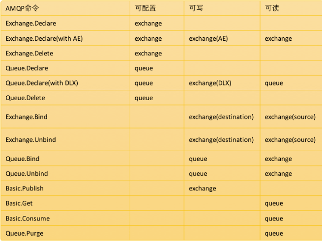
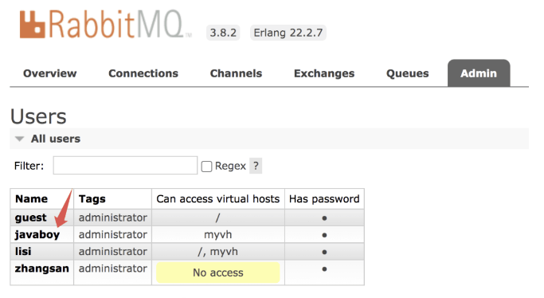

### 12.1 RabbitMQ 权限系统介绍

RabbitMQ 是从 1.6 这个版本开始实现了一套 ACL 风格的权限系统，可能有小伙伴还不知道什么是 ACL 风格的权限系统，可以看看松哥之前发的这两篇文章：

- [Spring Security 中如何细化权限粒度？](https://mp.weixin.qq.com/s?__biz=MzI1NDY0MTkzNQ==&mid=2247490109&idx=1&sn=b94d1e156152a8fb50855d2fa660bb5a&scene=21#wechat_redirect)
- [一个案例演示 Spring Security 中粒度超细的权限控制！](https://mp.weixin.qq.com/s?__biz=MzI1NDY0MTkzNQ==&mid=2247490119&idx=1&sn=2fdb7b8bfda08969c8442d83b38b9945&scene=21#wechat_redirect)

在这套 ACL 风格的权限管理系统中，允许非常多细粒度的权限控制，可以为不同用户分别设置读、写以及配置等权限。

这里涉及到三种不同的权限：

- 读：和消息消费有关的所有操作，包括清除整个队列的消息。
- 写：发布消息。
- 配置：消息队列、交换机等的创建和删除。

这是 RabbitMQ 权限系统的一个简单介绍。

### 12.2 操作和权限的对应关系

接下来，下图展示了操作和权限的对应关系



### 12.3 权限操作命令

RabbitMQ 中权限操作命令格式如下：

```sh
rabbitmqctl set_permissions [-p vhosts] {user} {conf} {write} {read}
```

这里有几个参数：

- [-p vhost]：授予用户访问权限的 vhost 名称，如果不写默认为 `/`。
- user：用户名。
- conf：用户在哪些资源上拥有可配置权限（支持正则表达式）。
- write：用户在哪些资源上拥有写权限（支持正则表达式）。
- read：用户在哪些资源上拥有读权限（支持正则表达式）。

至于可配置权限能干嘛，写权限能干嘛，读权限能干嘛，大家可以参考第二小节，这里不再赘述。

松哥来举一个简单的例子。

假设我们有一个名为 `zhangsan` 的用户，我们希望该用户在 myvh 虚拟主机下具备所有权限，那么我们的操作命令如下：

```sh
rabbitmqctl set_permissions -p myvh zhangsan ".*" ".*" ".*"
```

执行结果如下


接下来执行如下命令可以验证授权是否成功：

```sh
rabbitmqctl -p myvh list_permissions
```


可以看到，张三的权限已经赋值到位。

在上面的授权命令中，我们用的都是 `".*"`，松哥再额外说下这个通配符：

- `".*"`：这个表示匹配所有的交换机和队列。
- `"javaboy-.*"`：这个表示匹配名字以 `javaboy-` 开头的交换机和队列。
- `""`：这个表示不匹配任何队列与交换机（如果想撤销用户的权限可以使用这个）。

我们可以使用如下命令来移除某一个用户在某一个 vhost 上的权限，例如移除 zhangsan 在 myvh 上的所有权限，如下：

```
rabbitmqctl clear_permissions -p myvh zhangsan
```

执行完成后，我们可以通过 `rabbitmqctl -p myvh list_permissions` 命令来查看执行结果是否生效，最终执行效果如下：


如果一个用户在多个 vhost 上都有对应的权限，按照上面的 `rabbitmqctl -p myvh list_permissions` 命令只能查看一个 vhost 上的权限，此时我们可以通过如下命令来查看 `lisi` 在所有 vhost 上的权限：

```sh
rabbitmqctl list_user_permissions lisi
```


### 12.4 Web 管理页面操作

当然，如果你不想敲命令，也可以通过 Web 管理端去操作权限。

在 Admin 选项卡，点击用户名称，就可以给用户设置权限了，如下：




可以设置权限，也可以清除权限。

当然，在网页上还有一个 Topic Permissions，这是 RabbitMQ3.7 开始的一个新功能，可以针对某一个 `topic exchange` 设置权限，主要针对 STOMP 或者 MQTT 协议，我们日常 Java 开发用上这个配置的机会很少。如果用户不设置的话，相应的 `topic exchange` 也总是有权限的。

