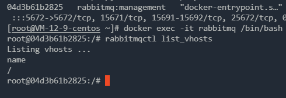
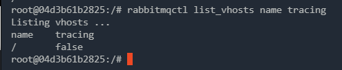
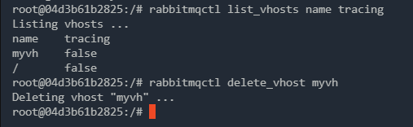

####  理解 VirtualHost

##### 多租户

RabbitMQ 中有一个概念叫做多租户，怎么理解呢？

我们安装一个 RabbitMQ 服务器，**每一个 RabbitMQ 服务器都能创建出许多虚拟的消息服务器，这些虚拟的消息服务器就是我们所说的虚拟主机（virtual host），一般简称为 vhost**。

**本质上，每一个 vhost 都是一个独立的小型 RabbitMQ 服务器，这个 vhost 中会有自己的消息队列、消息交换机以及相应的绑定关系等等，并且拥有自己独立的权限，不同的 vhost 中的队列和交换机不能互相绑定，这样技能保证运行安全又能避免命名冲突**。

我们并不需要特别的去看待 vhost，他就跟普通的物理 RabbitMQ 一样，**不同的 vhost 能够提供逻辑上的分离，确保不同的应用消息队列能够安全独立运行**。

要我来说，我们该怎么看待 vhost 和 RabbitMQ 的关系呢？**RabbitMQ 相当于一个 Excel 文件，而 vhost 则是 Excel 文件中的一个个 sheet，我们所有的操作都是在某一个 sheet 上进行操作**。

> 本质上来说，vhost 算是 AMQP 协议中的概念。

##### 命令行创建 vhost

进入docker中，创建：

```shell
docker exec -it some-rabbit /bin/bash
rabbitmqctl add_vhost myvh
```

查看已有的 vhost：

```shell
rabbitmqctl list_vhosts
```



当然这个命令也可以添加两个选项 name 和 tracing，name 表示 vhost 的名称，tracing 则表示是否使用了 tracing 功能（tracing 可以帮助追踪 RabbitMQ 中消息的流入流出情况），如下图



删除一个vhost：

```shell
rabbitmqctl delete_vhost myvh
```



当删除一个 vhost 的时候，与这个 vhost 相关的消息队列、交换机以及绑定关系等，统统都会被删除。

给一个用户设置 vhost：

```shell
rabbitmqctl set_permissions -p myvh guest ".*" ".*" ".*"
```

最后面三个 `".*"` 含义分别如下：

- 用户在所有资源上都拥有可配置权限（创建/删除消息队列、创建/删除交换机等）。
- 用户在所有资源上都拥有写权限（发消息）。
- 用户在所有资源上都拥有读权限（消息消费，清空队列等）

禁止一个用户访问某个 vhost：

```sh
rabbitmqctl clear_permissions -p myvh guest
```