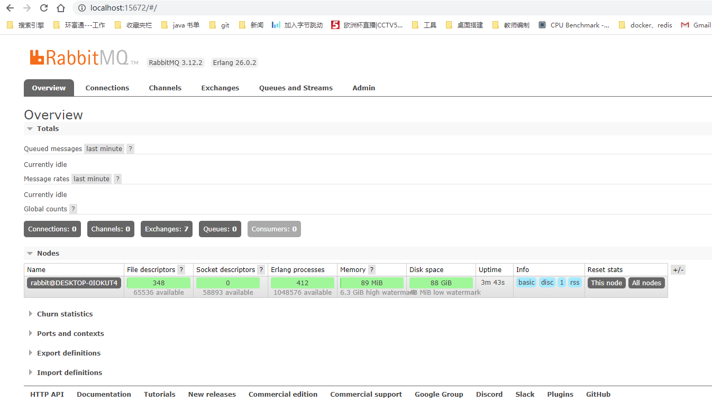

https://blog.csdn.net/qq_39915083/article/details/107034747

安装erlang和rabbitmq成功之后，到rabbitmq的安装目录下的sbin目录下执行命令：

```sh
rabbitmqctl status	//查看当前状态
rabbitmq-plugins enable rabbitmq_management	//开启Web插件
rabbitmq-server start	//启动服务
rabbitmq-server stop	//停止服务
rabbitmq-server restart	//重启服务

```

其他几条命令

```sh
net start RabbitMQ  启动
net stop RabbitMQ  停止
```


可以到服务win10的服务页面查看rabbitmq是否开启了。

然后执行 rabbitmq-plugins enable rabbitmq_management 命令开启Web插件。 开启Web插件方便在浏览器端管理RabbitMQ。 启动成功，登陆RabbitMQ，首先浏览器访问 http:localhost:15672，RabbitMQ启动成功后，默认有一个 guest 用户，此用户账号密码都是 guest。



##### 各个端口通信的作用


后端连接使用5672这个端口，控制台15672

##### 端口访问

节点绑定到端口（开放服务器TCP套接字），以接受客户端和CLI工具连接。其他进程和工具，例如SELinux，可能会阻止RabbitMQ绑定到端口。发生这种情况时，该节点将无法启动。

CLI工具，客户端库和RabbitMQ节点也可以打开连接（客户端TCP套接字）。防火墙可以防止节点和CLI工具相互通信。确保可以访问以下端口：

4369：epmd，RabbitMQ节点和CLI工具使用的对等发现服务

5672、5671：由不带TLS和带TLS的AMQP 0-9-1和1.0客户端使用

25672：用于节点间和CLI工具通信（分发服务器端口），并从动态范围分配（默认情况下限制为单个端口，计算为AMQP端口+ 20000）。除非确实需要这些端口上的外部连接（例如，群集使用联合身份验证或在子网外部的计算机上使用CLI工具），否则这些端口不应公开。有关详细信息，请参见网络指南。

35672-35682：由CLI工具（Erlang分发客户端端口）用于与节点进行通信，并从动态范围分配（通过服务器分发端口+ 10010计算为服务器分发端口+ 10000）。有关详细信息，请参见网络指南。

15672：HTTP API客户端，管理UI和Rabbitmqadmin （仅在启用管理插件的情况下）

61613、61614：不带TLS和带TLS的STOMP客户端（仅在启用STOMP插件的情况下）

1883、8883 ：（不带和带有TLS的MQTT客户端，如果启用了MQTT插件

15674：STOMP-over-WebSockets客户端（仅在启用了Web STOMP插件的情况下）

15675：MQTT-over-WebSockets客户端（仅在启用Web MQTT插件的情况下）

15692：Prometheus指标（仅在启用Prometheus插件的情况下）

#### 问题：

##### RabbitMQ ERROR could not bind to distribution port 25672, it is in use by another node rabbit@DESK

https://blog.csdn.net/drhrht/article/details/124327190

右键此电脑，管理，服务和应用程序，服务，在列表中找到RabbitMQ，右键，属性，把启动类型改为手动，再点击停止此服务。最后，重新执行命令rabbitmq-server，不再报错，正常启动。问题就解决啦 顺带一提，启动成功后，如果想在命令行界面停止rabbitmq的话，可以Ctrl+C，输入y，再回车，就可以关闭rabbitmq了。