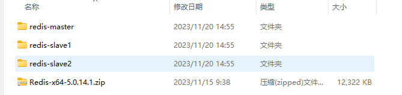

博客：[Redis高可用架构之一主二从三哨兵模式搭建_redis搭建一主两从三哨兵集群_大脸Uncle的博客-CSDN博客](https://blog.csdn.net/Tianuncle123/article/details/131539831)

#### 下载

redis下载路径

https://download.redis.io/releases/

复制三分出来分别配置其中的配置文件。




#### 配置一主二从

##### 端口规划

| 节点   | IP        | 端口 | 从属关系 |
| ------ | --------- | ---- | -------- |
| Master | 127.0.0.1 | 6380 | 主服务器 |
| Slave1 | 127.0.0.1 | 6381 | 从服务器 |
| Slave2 | 127.0.0.1 | 6382 | 从服务器 |

##### 编写配置文件

在Redis核心配置文件Redis.windows.conf中修改公用参数

```properties
#通过本机客户端访问redis服务，如果需要其它设备进行访问，可设置为0.0.0.0
bind 127.0.0.1
#如果以后台的方式运行，我们就需要指定一个pid文件
pidfile ""
#RDB文件保存的位置
dir ./rdb
#保护模式
protected-mode no
#后台运行
daemonize yes
#从服务器连接主服务器
masterauth vin123456
#设置从服务器只读
replica-read-only yes
#Redis服务器连接密码，没有可注释
requirepass vin123456
```

Master重要参数

```properties
#服务运行占用的端口号,从服务器分别设置为6280、6382
port 6381
```

Slave1重要参数

```properties
#服务运行占用的端口号,从服务器分别设置为6281、6382
port 6380
#设置主从关系，5.0版本前为:slaveof
replicaof 127.0.0.1 6381
```

Slave1重要参数

```properties
#服务运行占用的端口号,从服务器分别设置为6281、6382
port 6382
#设置主从关系，5.0版本前为:slaveof
replicaof 127.0.0.1 6381
```

##### 启动三台Redis服务器，测试主从关系

分别进入redis-server.exe所在目录，cmd

```shell
D:\dev\redis\redis-master>redis-server.exe redis.windows.conf 
```

启动后连接客户端，每个客户端都查看一下

```shell
D:\dev\redis\redis-master>redis-cli.exe -h 127.0.0.1 -p 6380
127.0.0.1:6380> auth vin123456
OK
127.0.0.1:6380> info replication
# Replication
role:slave
master_host:127.0.0.1
master_port:6381
master_link_status:down
master_last_io_seconds_ago:-1
master_sync_in_progress:0
slave_repl_offset:252
master_link_down_since_seconds:250
slave_priority:100
slave_read_only:1
connected_slaves:0
master_replid:7a06e73f83922d81356ccd832c24259a99103b2d
master_replid2:0000000000000000000000000000000000000000
master_repl_offset:252
second_repl_offset:-1
repl_backlog_active:1
repl_backlog_size:1048576
repl_backlog_first_byte_offset:1
repl_backlog_histlen:252
```

##### 测试数据的主从复制

```shell
#Master节点
D:\dev\redis\redis-slave1>redis-cli.exe -h 127.0.0.1 -p 6381
127.0.0.1:6381> auth vin123456
OK
127.0.0.1:6381> get num
(nil)
127.0.0.1:6381> set num 10
OK

#Slave1节点
D:\dev\redis\redis-master>redis-cli.exe -h 127.0.0.1 -p 6380
127.0.0.1:6380> auth auth vin123456
OK
127.0.0.1:6380> get num
(nil)
127.0.0.1:6380> get num
"10"

#Slave2节点
D:\dev\redis\redis-slave1>redis-cli.exe -h 127.0.0.1 -p 6382
127.0.0.1:6382> auth auth vin123456
OK
127.0.0.1:6382> get num
(nil)
127.0.0.1:6382> get num
"10"
```

完成以上操作，一主二从关系就以成功搭建，并实现了数据主从复制。

#### 配置三哨兵 sentinel

注意我上面启动之后的主库是 6381 端口，不是6380端口，所以和博客会有点不一样。

##### 端口

三个哨兵端口分别为

| 节点      | IP        | 端口  | 从属关系 |
| --------- | --------- | ----- | -------- |
| Sentinel1 | 127.0.0.1 | 26380 | 无       |
| Sentinel2 | 127.0.0.1 | 26381 | 无       |
| Sentinel3 | 127.0.0.1 | 26382 | 无       |

##### 配置文件

配置文件example，sentinel.conf，可以到tar的压缩包中去获取

```properties
# Example sentinel.conf

# *** IMPORTANT ***
#
# By default Sentinel will not be reachable from interfaces different than
# localhost, either use the 'bind' directive to bind to a list of network
# interfaces, or disable protected mode with "protected-mode no" by
# adding it to this configuration file.
#
# Before doing that MAKE SURE the instance is protected from the outside
# world via firewalling or other means.
#
# For example you may use one of the following:
#
# bind 127.0.0.1 192.168.1.1
#
# protected-mode no

# port <sentinel-port>
# The port that this sentinel instance will run on
port 26379

# By default Redis Sentinel does not run as a daemon. Use 'yes' if you need it.
# Note that Redis will write a pid file in /var/run/redis-sentinel.pid when
# daemonized.
daemonize no

# When running daemonized, Redis Sentinel writes a pid file in
# /var/run/redis-sentinel.pid by default. You can specify a custom pid file
# location here.
pidfile /var/run/redis-sentinel.pid

# Specify the log file name. Also the empty string can be used to force
# Sentinel to log on the standard output. Note that if you use standard
# output for logging but daemonize, logs will be sent to /dev/null
logfile ""

# sentinel announce-ip <ip>
# sentinel announce-port <port>
#
# The above two configuration directives are useful in environments where,
# because of NAT, Sentinel is reachable from outside via a non-local address.
#
# When announce-ip is provided, the Sentinel will claim the specified IP address
# in HELLO messages used to gossip its presence, instead of auto-detecting the
# local address as it usually does.
#
# Similarly when announce-port is provided and is valid and non-zero, Sentinel
# will announce the specified TCP port.
#
# The two options don't need to be used together, if only announce-ip is
# provided, the Sentinel will announce the specified IP and the server port
# as specified by the "port" option. If only announce-port is provided, the
# Sentinel will announce the auto-detected local IP and the specified port.
#
# Example:
#
# sentinel announce-ip 1.2.3.4

# dir <working-directory>
# Every long running process should have a well-defined working directory.
# For Redis Sentinel to chdir to /tmp at startup is the simplest thing
# for the process to don't interfere with administrative tasks such as
# unmounting filesystems.
dir /tmp

# sentinel monitor <master-name> <ip> <redis-port> <quorum>
#
# Tells Sentinel to monitor this master, and to consider it in O_DOWN
# (Objectively Down) state only if at least <quorum> sentinels agree.
#
# Note that whatever is the ODOWN quorum, a Sentinel will require to
# be elected by the majority of the known Sentinels in order to
# start a failover, so no failover can be performed in minority.
#
# Replicas are auto-discovered, so you don't need to specify replicas in
# any way. Sentinel itself will rewrite this configuration file adding
# the replicas using additional configuration options.
# Also note that the configuration file is rewritten when a
# replica is promoted to master.
#
# Note: master name should not include special characters or spaces.
# The valid charset is A-z 0-9 and the three characters ".-_".
sentinel monitor mymaster 127.0.0.1 6379 2

# sentinel auth-pass <master-name> <password>
#
# Set the password to use to authenticate with the master and replicas.
# Useful if there is a password set in the Redis instances to monitor.
#
# Note that the master password is also used for replicas, so it is not
# possible to set a different password in masters and replicas instances
# if you want to be able to monitor these instances with Sentinel.
#
# However you can have Redis instances without the authentication enabled
# mixed with Redis instances requiring the authentication (as long as the
# password set is the same for all the instances requiring the password) as
# the AUTH command will have no effect in Redis instances with authentication
# switched off.
#
# Example:
#
# sentinel auth-pass mymaster MySUPER--secret-0123passw0rd

# sentinel down-after-milliseconds <master-name> <milliseconds>
#
# Number of milliseconds the master (or any attached replica or sentinel) should
# be unreachable (as in, not acceptable reply to PING, continuously, for the
# specified period) in order to consider it in S_DOWN state (Subjectively
# Down).
#
# Default is 30 seconds.
sentinel down-after-milliseconds mymaster 30000

# sentinel parallel-syncs <master-name> <numreplicas>
#
# How many replicas we can reconfigure to point to the new replica simultaneously
# during the failover. Use a low number if you use the replicas to serve query
# to avoid that all the replicas will be unreachable at about the same
# time while performing the synchronization with the master.
sentinel parallel-syncs mymaster 1

# sentinel failover-timeout <master-name> <milliseconds>
#
# Specifies the failover timeout in milliseconds. It is used in many ways:
#
# - The time needed to re-start a failover after a previous failover was
#   already tried against the same master by a given Sentinel, is two
#   times the failover timeout.
#
# - The time needed for a replica replicating to a wrong master according
#   to a Sentinel current configuration, to be forced to replicate
#   with the right master, is exactly the failover timeout (counting since
#   the moment a Sentinel detected the misconfiguration).
#
# - The time needed to cancel a failover that is already in progress but
#   did not produced any configuration change (SLAVEOF NO ONE yet not
#   acknowledged by the promoted replica).
#
# - The maximum time a failover in progress waits for all the replicas to be
#   reconfigured as replicas of the new master. However even after this time
#   the replicas will be reconfigured by the Sentinels anyway, but not with
#   the exact parallel-syncs progression as specified.
#
# Default is 3 minutes.
sentinel failover-timeout mymaster 180000

# SCRIPTS EXECUTION
#
# sentinel notification-script and sentinel reconfig-script are used in order
# to configure scripts that are called to notify the system administrator
# or to reconfigure clients after a failover. The scripts are executed
# with the following rules for error handling:
#
# If script exits with "1" the execution is retried later (up to a maximum
# number of times currently set to 10).
#
# If script exits with "2" (or an higher value) the script execution is
# not retried.
#
# If script terminates because it receives a signal the behavior is the same
# as exit code 1.
#
# A script has a maximum running time of 60 seconds. After this limit is
# reached the script is terminated with a SIGKILL and the execution retried.

# NOTIFICATION SCRIPT
#
# sentinel notification-script <master-name> <script-path>
# 
# Call the specified notification script for any sentinel event that is
# generated in the WARNING level (for instance -sdown, -odown, and so forth).
# This script should notify the system administrator via email, SMS, or any
# other messaging system, that there is something wrong with the monitored
# Redis systems.
#
# The script is called with just two arguments: the first is the event type
# and the second the event description.
#
# The script must exist and be executable in order for sentinel to start if
# this option is provided.
#
# Example:
#
# sentinel notification-script mymaster /var/redis/notify.sh

# CLIENTS RECONFIGURATION SCRIPT
#
# sentinel client-reconfig-script <master-name> <script-path>
#
# When the master changed because of a failover a script can be called in
# order to perform application-specific tasks to notify the clients that the
# configuration has changed and the master is at a different address.
# 
# The following arguments are passed to the script:
#
# <master-name> <role> <state> <from-ip> <from-port> <to-ip> <to-port>
#
# <state> is currently always "failover"
# <role> is either "leader" or "observer"
# 
# The arguments from-ip, from-port, to-ip, to-port are used to communicate
# the old address of the master and the new address of the elected replica
# (now a master).
#
# This script should be resistant to multiple invocations.
#
# Example:
#
# sentinel client-reconfig-script mymaster /var/redis/reconfig.sh

# SECURITY
#
# By default SENTINEL SET will not be able to change the notification-script
# and client-reconfig-script at runtime. This avoids a trivial security issue
# where clients can set the script to anything and trigger a failover in order
# to get the program executed.

sentinel deny-scripts-reconfig yes

# REDIS COMMANDS RENAMING
#
# Sometimes the Redis server has certain commands, that are needed for Sentinel
# to work correctly, renamed to unguessable strings. This is often the case
# of CONFIG and SLAVEOF in the context of providers that provide Redis as
# a service, and don't want the customers to reconfigure the instances outside
# of the administration console.
#
# In such case it is possible to tell Sentinel to use different command names
# instead of the normal ones. For example if the master "mymaster", and the
# associated replicas, have "CONFIG" all renamed to "GUESSME", I could use:
#
# SENTINEL rename-command mymaster CONFIG GUESSME
#
# After such configuration is set, every time Sentinel would use CONFIG it will
# use GUESSME instead. Note that there is no actual need to respect the command
# case, so writing "config guessme" is the same in the example above.
#
# SENTINEL SET can also be used in order to perform this configuration at runtime.
#
# In order to set a command back to its original name (undo the renaming), it
# is possible to just rename a command to itsef:
#
# SENTINEL rename-command mymaster CONFIG CONFIG

```

##### 编写三个哨兵的配置文件

修改这些配置，如果主库变了的话，需要改成对应的主库地址和端口。

```properties
#哨兵运行的端口号
port 26380

#后台运行，指定redis是否要用守护线程的方式启动
daemonize yes

#保护模式，保护你的redis实例，防止被访问和利用，可允许外部访问
protected-mode no

#Redis工作目录，RDB文件存储的位置
dir ""

#禁止修改脚本
sentinel deny-scripts-reconfig yes

# 配置监听的主服务器，mymaster代表服务器的名称，127.0.0.1代表监控的主服务器，6380代表端⼝，2代表只有两个或两个以上的哨兵认为主服务器不可⽤的时候，才会进⾏failover操作。
sentinel monitor mymaster 127.0.0.1 6380 2

#从库访问主库的密码认证，要保持一致
sentinel auth-pass mymaster 111111

#超过指定等待时间后主节点尚未对哨兵做出回应，哨兵将认为主节点已宕机，默认30 s
sentinel down-after-milliseconds mymaster 5000

#故障转移超时时间，如果该时间内没完成failover操作，则认为本次failover失败，默认180 s
sentinel failover-timeout mymaster 30000
```

##### 启动效果

分别进入redis-server.exe所在目录，cmd：

`redis-server.exe sentinel.conf --sentinel`

###### 哨兵1启动成功

哨兵1控制台：

```shell
D:\dev\redis\redis-master>redis-server.exe sentinel.conf --sentinel
[24844] 20 Nov 15:40:47.741 # oO0OoO0OoO0Oo Redis is starting oO0OoO0OoO0Oo
[24844] 20 Nov 15:40:47.742 # Redis version=5.0.14.1, bits=64, commit=ec77f72d, modified=0, pid=24844, just started
[24844] 20 Nov 15:40:47.742 # Configuration loaded
[24844] 20 Nov 15:40:47.742 # Windows does not support daemonize. Start Redis as service
                _._
           _.-``__ ''-._
      _.-``    `.  `_.  ''-._           Redis 5.0.14.1 (ec77f72d/0) 64 bit
  .-`` .-```.  ```\/    _.,_ ''-._
 (    '      ,       .-`  | `,    )     Running in sentinel mode
 |`-._`-...-` __...-.``-._|'` _.-'|     Port: 26380
 |    `-._   `._    /     _.-'    |     PID: 24844
  `-._    `-._  `-./  _.-'    _.-'
 |`-._`-._    `-.__.-'    _.-'_.-'|
 |    `-._`-._        _.-'_.-'    |           http://redis.io
  `-._    `-._`-.__.-'_.-'    _.-'
 |`-._`-._    `-.__.-'    _.-'_.-'|
 |    `-._`-._        _.-'_.-'    |
  `-._    `-._`-.__.-'_.-'    _.-'
      `-._    `-.__.-'    _.-'
          `-._        _.-'
              `-.__.-'

[24844] 20 Nov 15:40:47.745 # Sentinel ID is f6524cdcdc4cf26c5abf39771ce676d31fba9ca5
[24844] 20 Nov 15:40:47.745 # +monitor master mymaster 127.0.0.1 6381 quorum 2
[24844] 20 Nov 15:40:47.747 * +slave slave 127.0.0.1:6382 127.0.0.1 6382 @ mymaster 127.0.0.1 6381
[24844] 20 Nov 15:40:47.747 * +slave slave 127.0.0.1:6380 127.0.0.1 6380 @ mymaster 127.0.0.1 6381
[24844] 20 Nov 15:41:01.342 * +sentinel sentinel ede07382801e018131d3c31b64c69e710620ef21 127.0.0.1 26381 @ mymaster 127.0.0.1 6381
[24844] 20 Nov 15:41:11.315 * +sentinel sentinel 3d403cb889bf98c81a888e05d9e5f752504b688b 127.0.0.1 26382 @ mymaster 127.0.0.1 6381
```

输出讲解：

```shell
##哨兵ID
Sentinel ID is 56686714ba3fd341877f6c91a2e97fda732d671f

##声明哨兵监控的主数据库名称及其 ip地址， 端口号等
+monitor master mymaster 127.0.0.1 6381 quorum 2

##发现了6380、6382从数据库，从属于6381主库
+slave slave 127.0.0.1:6382 127.0.0.1 6382 @ mymaster 127.0.0.1 6381
+slave slave 127.0.0.1:6380 127.0.0.1 6380 @ mymaster 127.0.0.1 6381

##声明26381、26382两个哨兵正在监控6380主服务器
+sentinel sentinel ede07382801e018131d3c31b64c69e710620ef21 127.0.0.1 26381 @ mymaster 127.0.0.1 6381
+sentinel sentinel 3d403cb889bf98c81a888e05d9e5f752504b688b 127.0.0.1 26382 @ mymaster 127.0.0.1 6381
```

###### 哨兵2启动成功


输出和哨兵一是差不多的，只是每个sentinel的id会有差别。

###### 哨兵3启动成功


完成以上操作，三哨兵已经成功搭建了。

#### redis 高可用测试

##### （一）模拟主库宕机，查看新Master的产生情况

###### Sentinel1控制台

id为 f6524cdcdc4cf26c5abf39771ce676d31fba9ca5。


输出：

```shell
[24844] 20 Nov 15:41:01.342 * +sentinel sentinel ede07382801e018131d3c31b64c69e710620ef21 127.0.0.1 26381 @ mymaster 127.0.0.1 6381
[24844] 20 Nov 15:41:11.315 * +sentinel sentinel 3d403cb889bf98c81a888e05d9e5f752504b688b 127.0.0.1 26382 @ mymaster 127.0.0.1 6381
[24844] 20 Nov 16:03:13.674 # +sdown master mymaster 127.0.0.1 6381
[24844] 20 Nov 16:03:13.803 # +new-epoch 1
[24844] 20 Nov 16:03:13.805 # +vote-for-leader 3d403cb889bf98c81a888e05d9e5f752504b688b 1
[24844] 20 Nov 16:03:14.345 # +config-update-from sentinel 3d403cb889bf98c81a888e05d9e5f752504b688b 127.0.0.1 26382 @ mymaster 127.0.0.1 6381
[24844] 20 Nov 16:03:14.346 # +switch-master mymaster 127.0.0.1 6381 127.0.0.1 6380
[24844] 20 Nov 16:03:14.346 * +slave slave 127.0.0.1:6382 127.0.0.1 6382 @ mymaster 127.0.0.1 6380
[24844] 20 Nov 16:03:14.346 * +slave slave 127.0.0.1:6381 127.0.0.1 6381 @ mymaster 127.0.0.1 6380
[24844] 20 Nov 16:04:04.421 # +sdown slave 127.0.0.1:6381 127.0.0.1 6381 @ mymaster 127.0.0.1 6380
```

**输出讲解**

```shell
## sentinel1主观认为主库宕机
+sdown master mymaster 127.0.0.1 6381
## 集群版本号变为1，集群版本由哨兵控制
+new-epoch 1
## sentinel1投票给sentinel3
+vote-for-leader 3d403cb889bf98c81a888e05d9e5f752504b688b 1

##半数哨兵主观认为主库宕机，转变为客观认为主库宕机
+odown master mymaster 127.0.0.1 6380 #quorum 3/2
##下次故障转移将会在Wed Jul  5 11:38:42 2023后才会执行，跟前面日期比对相差6分钟，在上次故障转移发生后的6分钟内，再次出现节点故障，在6分钟内哨兵不会执行故障转移，会在6分钟后执行；
Next failover delay: I will not start a failover before Wed Jul  5 11:38:42 2023
## 更新sentinel1哨兵配置文件
+config-update-from sentinel 3d403cb889bf98c81a888e05d9e5f752504b688b 127.0.0.1 26382 @ mymaster 127.0.0.1 6381
##宣布选举出6382为新的主库
+switch-master mymaster 127.0.0.1 6381 127.0.0.1 6381

##新发现6381、6380两个从库，从属于6380主库
+slave slave 127.0.0.1:6382 127.0.0.1 6382 @ mymaster 127.0.0.1 6380
+slave slave 127.0.0.1:6381 127.0.0.1 6381 @ mymaster 127.0.0.1 6380

##新发现一个6381从库宕机，从属于6380
+sdown slave 127.0.0.1:6381 127.0.0.1 6381 @ mymaster 127.0.0.1 6380
```

###### sentinel 2控制台

id  ede07382801e018131d3c31b64c69e710620ef21。


###### sentinel 3控制台

id为 3d403cb889bf98c81a888e05d9e5f752504b688b，相比之下这个多了其他的信息。


输出

```shell
[25212] 20 Nov 15:41:09.285 # Sentinel ID is 3d403cb889bf98c81a888e05d9e5f752504b688b
[25212] 20 Nov 15:41:09.285 # +monitor master mymaster 127.0.0.1 6381 quorum 2
[25212] 20 Nov 15:41:09.286 * +slave slave 127.0.0.1:6382 127.0.0.1 6382 @ mymaster 127.0.0.1 6381
[25212] 20 Nov 15:41:09.287 * +slave slave 127.0.0.1:6380 127.0.0.1 6380 @ mymaster 127.0.0.1 6381
[25212] 20 Nov 15:41:09.451 * +sentinel sentinel ede07382801e018131d3c31b64c69e710620ef21 127.0.0.1 26381 @ mymaster 127.0.0.1 6381
[25212] 20 Nov 15:41:10.203 * +sentinel sentinel f6524cdcdc4cf26c5abf39771ce676d31fba9ca5 127.0.0.1 26380 @ mymaster 127.0.0.1 6381
[25212] 20 Nov 16:03:13.720 # +sdown master mymaster 127.0.0.1 6381
[25212] 20 Nov 16:03:13.798 # +odown master mymaster 127.0.0.1 6381 #quorum 2/2
[25212] 20 Nov 16:03:13.798 # +new-epoch 1
[25212] 20 Nov 16:03:13.798 # +try-failover master mymaster 127.0.0.1 6381
[25212] 20 Nov 16:03:13.801 # +vote-for-leader 3d403cb889bf98c81a888e05d9e5f752504b688b 1
[25212] 20 Nov 16:03:13.806 # ede07382801e018131d3c31b64c69e710620ef21 voted for 3d403cb889bf98c81a888e05d9e5f752504b688b 1
[25212] 20 Nov 16:03:13.806 # f6524cdcdc4cf26c5abf39771ce676d31fba9ca5 voted for 3d403cb889bf98c81a888e05d9e5f752504b688b 1
[25212] 20 Nov 16:03:13.877 # +elected-leader master mymaster 127.0.0.1 6381
[25212] 20 Nov 16:03:13.877 # +failover-state-select-slave master mymaster 127.0.0.1 6381
[25212] 20 Nov 16:03:13.938 # +selected-slave slave 127.0.0.1:6380 127.0.0.1 6380 @ mymaster 127.0.0.1 6381
[25212] 20 Nov 16:03:13.938 * +failover-state-send-slaveof-noone slave 127.0.0.1:6380 127.0.0.1 6380 @ mymaster 127.0.0.1 6381
[25212] 20 Nov 16:03:14.017 * +failover-state-wait-promotion slave 127.0.0.1:6380 127.0.0.1 6380 @ mymaster 127.0.0.1 6381
[25212] 20 Nov 16:03:14.253 # +promoted-slave slave 127.0.0.1:6380 127.0.0.1 6380 @ mymaster 127.0.0.1 6381
[25212] 20 Nov 16:03:14.253 # +failover-state-reconf-slaves master mymaster 127.0.0.1 6381
[25212] 20 Nov 16:03:14.345 * +slave-reconf-sent slave 127.0.0.1:6382 127.0.0.1 6382 @ mymaster 127.0.0.1 6381
[25212] 20 Nov 16:03:14.972 # -odown master mymaster 127.0.0.1 6381
[25212] 20 Nov 16:03:15.281 * +slave-reconf-inprog slave 127.0.0.1:6382 127.0.0.1 6382 @ mymaster 127.0.0.1 6381
[25212] 20 Nov 16:03:15.281 * +slave-reconf-done slave 127.0.0.1:6382 127.0.0.1 6382 @ mymaster 127.0.0.1 6381
[25212] 20 Nov 16:03:15.342 # +failover-end master mymaster 127.0.0.1 6381
[25212] 20 Nov 16:03:15.342 # +switch-master mymaster 127.0.0.1 6381 127.0.0.1 6380
[25212] 20 Nov 16:03:15.343 * +slave slave 127.0.0.1:6382 127.0.0.1 6382 @ mymaster 127.0.0.1 6380
[25212] 20 Nov 16:03:15.343 * +slave slave 127.0.0.1:6381 127.0.0.1 6381 @ mymaster 127.0.0.1 6380
[25212] 20 Nov 16:04:05.428 # +sdown slave 127.0.0.1:6381 127.0.0.1 6381 @ mymaster 127.0.0.1 6380
```

输出信息讲解：

```shell
##Sentinel3主观发现6381主库宕机
+sdown master mymaster 127.0.0.1 6381

##已满2个哨兵主观认为主库宕机，转变为客观认为主库宕机
+odown master mymaster 127.0.0.1 6381 #quorum 2/2

##集群版本变为1
+new-epoch 1

##准备进行故障转移
+try-failover master mymaster 127.0.0.1 6381

##Sentinel3投票给Sentinel3
+vote-for-leader 3d403cb889bf98c81a888e05d9e5f752504b688b 1

##收到Sentinel1、Sentinel2各选举的一票
ede07382801e018131d3c31b64c69e710620ef21 voted for 3d403cb889bf98c81a888e05d9e5f752504b688b 1
f6524cdcdc4cf26c5abf39771ce676d31fba9ca5 voted for 3d403cb889bf98c81a888e05d9e5f752504b688b 1

##赢得指定纪元的选举，可以进行故障迁移操作了
+elected-leader master mymaster 127.0.0.1 6381

##故障转移操作现在处于等待状态，哨兵正在寻找可以升级为主服务器的从服务器
+failover-state-select-slave master mymaster 127.0.0.1 6381

##找到合适的从库6380，可升级为主库
+selected-slave slave 127.0.0.1:6380 127.0.0.1 6380 @ mymaster 127.0.0.1 6381

##正在将指定的从服务器升级为主服务器，等待升级功能完成
+failover-state-send-slaveof-noone slave 127.0.0.1:6380 127.0.0.1 6380 @ mymaster 127.0.0.1 6381

##等待其它的哨兵确认主从关系
 +failover-state-wait-promotion slave 127.0.0.1:6380 127.0.0.1 6380 @ mymaster 127.0.0.1 6381

##全部确认成功
+promoted-slave slave 127.0.0.1:6380 127.0.0.1 6380 @ mymaster 127.0.0.1 6381

## 开始对集群中的所有slave做reconf更新配置文件操作
+failover-state-reconf-slaves master mymaster 127.0.0.1 6381

##向指定的slave发送"slaveof"指令，令其跟随新的master。
+slave-reconf-sent slave 127.0.0.1:6382 127.0.0.1 6382 @ mymaster 127.0.0.1 6381

##主观销毁一个宕机的主库
-odown master mymaster 127.0.0.1 6381

##目标slave正在执行'slaveof'操作，如果期间接收到了新的"slave-reconf-sent"命令，则在会在当前操作执行完毕后，再次执行slaveof
+slave-reconf-inprog slave 127.0.0.1:6382 127.0.0.1 6382 @ mymaster 127.0.0.1 6381

##目标slave配置信息更新完毕，leader可以对下一个slave开始reconfig操作了。
+slave-reconf-done slave 127.0.0.1:6382 127.0.0.1 6382 @ mymaster 127.0.0.1 6381

##本次故障转移完毕
+failover-end master mymaster 127.0.0.1 6381

##故障转移完毕后，各个sentinel开始监控新的master。
+switch-master mymaster 127.0.0.1 6381 127.0.0.1 6380

##发现6381、6382两个从库，从属于6380主库
+slave slave 127.0.0.1:6382 127.0.0.1 6382 @ mymaster 127.0.0.1 6380
+slave slave 127.0.0.1:6381 127.0.0.1 6381 @ mymaster 127.0.0.1 6380

##发现一个6380从库宕机，该从库从属于6382主库
+sdown slave 127.0.0.1:6381 127.0.0.1 6381 @ mymaster 127.0.0.1 6380
```

通过观察可以发现三哨兵协调工作，完成了故障转移，选举出了新的主库，实现了Redis服务的高可用。

##### （二）主库恢复工作，查看服务器间主从关系变化

###### 查看哨兵控制台变化

sentinel 1控制台

```shell
[24844] 20 Nov 16:27:36.347 # -sdown slave 127.0.0.1:6381 127.0.0.1 6381 @ mymaster 127.0.0.1 6380
```

最后一句解释

```shell
##主观销毁一个宕机的从属于6380主库的从库
-sdown slave 127.0.0.1:6381 127.0.0.1 6381 @ mymaster 127.0.0.1 6380
```

sentinel 2控制台

```shell
[23240] 20 Nov 16:27:35.878 # -sdown slave 127.0.0.1:6381 127.0.0.1 6381 @ mymaster 127.0.0.1 6380
[23240] 20 Nov 16:27:45.820 * +convert-to-slave slave 127.0.0.1:6381 127.0.0.1 6381 @ mymaster 127.0.0.1 6380

##主观销毁一个宕机的从属于6380主库的从库
-sdown slave 127.0.0.1:6381 127.0.0.1 6381 @ mymaster 127.0.0.1 6380

##切换从节点，6381主库由主节点变为从节点
+convert-to-slave slave 127.0.0.1:6381 127.0.0.1 6381 @ mymaster 127.0.0.1 6380
```

sentinel3 控制台

```shell
[25212] 20 Nov 16:27:37.046 # -sdown slave 127.0.0.1:6381 127.0.0.1 6381 @ mymaster 127.0.0.1 6380
##主观销毁一个宕机的从属于6381主库的从库
-sdown slave 127.0.0.1:6381 127.0.0.1 6381 @ mymaster 127.0.0.1 6380
```

###### 查看redis服务端打印信息

原master控制台（6381）


slave1控制台（6380）

16:27分更新了输出

```shell
[5852] 20 Nov 16:03:14.035 # CONFIG REWRITE executed with success.
[5852] 20 Nov 16:03:15.066 * Replica 127.0.0.1:6382 asks for synchronization
[5852] 20 Nov 16:03:15.066 * Partial resynchronization request from 127.0.0.1:6382 accepted. Sending 422 bytes of backlog starting from offset 254670.
[5852] 20 Nov 16:27:45.911 * Replica 127.0.0.1:6381 asks for synchronization
[5852] 20 Nov 16:27:45.911 * Partial resynchronization not accepted: Replication ID mismatch (Replica asked for '1bffddc14cc941a3d4b1c54d9840a844f37ed49a', my replication IDs are '902b1c8504dc869478fb4aa0e915a9e16bada445' and '20795940751f6b3d84dd4665c1cb5d8e57d3e8df')
[5852] 20 Nov 16:27:45.912 * Starting BGSAVE for SYNC with target: disk
[5852] 20 Nov 16:27:45.954 * Background saving started by pid 26384
[5852] 20 Nov 16:27:46.070 # fork operation complete
[5852] 20 Nov 16:27:46.079 * Background saving terminated with success
[5852] 20 Nov 16:27:46.081 * Synchronization with replica 127.0.0.1:6381 succeeded
```

slave2控制台（6382）：无变化

###### 查看客户端打印信息

6380 客户端

```shell
127.0.0.1:6380> info replication
# Replication
role:master
connected_slaves:2
slave0:ip=127.0.0.1,port=6382,state=online,offset=636628,lag=0
slave1:ip=127.0.0.1,port=6381,state=online,offset=636495,lag=1
master_replid:902b1c8504dc869478fb4aa0e915a9e16bada445
master_replid2:20795940751f6b3d84dd4665c1cb5d8e57d3e8df
master_repl_offset:636628
second_repl_offset:254670
repl_backlog_active:1
repl_backlog_size:1048576
repl_backlog_first_byte_offset:1
repl_backlog_histlen:636628
127.0.0.1:6380>
```

6381 客户端

```shell
127.0.0.1:6381> info replication
# Replication
role:slave
master_host:127.0.0.1
master_port:6380
master_link_status:up
master_last_io_seconds_ago:0
master_sync_in_progress:0
slave_repl_offset:648283
slave_priority:100
slave_read_only:1
connected_slaves:0
master_replid:902b1c8504dc869478fb4aa0e915a9e16bada445
master_replid2:0000000000000000000000000000000000000000
master_repl_offset:648283
second_repl_offset:-1
repl_backlog_active:1
repl_backlog_size:1048576
repl_backlog_first_byte_offset:544381
repl_backlog_histlen:103903
127.0.0.1:6381> 
```

6382 客户端

```shell
127.0.0.1:6382> info replication
# Replication
role:slave
master_host:127.0.0.1
master_port:6380
master_link_status:up
master_last_io_seconds_ago:0
master_sync_in_progress:0
slave_repl_offset:660323
slave_priority:100
slave_read_only:1
connected_slaves:0
master_replid:902b1c8504dc869478fb4aa0e915a9e16bada445
master_replid2:20795940751f6b3d84dd4665c1cb5d8e57d3e8df
master_repl_offset:660323
second_repl_offset:254670
repl_backlog_active:1
repl_backlog_size:1048576
repl_backlog_first_byte_offset:1
repl_backlog_histlen:660323
127.0.0.1:6382> 
```

###### 查看哨兵配置文件变化

sentinel1

```properties
port 26380
sentinel monitor mymaster 127.0.0.1 6380 2
dir "D:\\dev\\redis\\redis-master\\tmp"
sentinel myid f6524cdcdc4cf26c5abf39771ce676d31fba9ca5
# Generated by CONFIG REWRITE
protected-mode no
sentinel config-epoch mymaster 1
sentinel leader-epoch mymaster 1
sentinel known-replica mymaster 127.0.0.1 6382
sentinel known-replica mymaster 127.0.0.1 6381
sentinel known-sentinel mymaster 127.0.0.1 26381 ede07382801e018131d3c31b64c69e710620ef21
sentinel known-sentinel mymaster 127.0.0.1 26382 3d403cb889bf98c81a888e05d9e5f752504b688b
sentinel current-epoch 1
```

sentinel 2

```properties
port 26381
sentinel monitor mymaster 127.0.0.1 6380 2
dir "D:\\dev\\redis\\redis-slave1\\tmp"
sentinel myid ede07382801e018131d3c31b64c69e710620ef21
# Generated by CONFIG REWRITE
protected-mode no
sentinel config-epoch mymaster 1
sentinel leader-epoch mymaster 1
sentinel known-replica mymaster 127.0.0.1 6382
sentinel known-replica mymaster 127.0.0.1 6381
sentinel known-sentinel mymaster 127.0.0.1 26380 f6524cdcdc4cf26c5abf39771ce676d31fba9ca5
sentinel known-sentinel mymaster 127.0.0.1 26382 3d403cb889bf98c81a888e05d9e5f752504b688b
sentinel current-epoch 1
```

sentinel 3

```properties
port 26382
sentinel monitor mymaster 127.0.0.1 6380 2
dir "D:\\dev\\redis\\redis-slave2\\tmp"
sentinel myid 3d403cb889bf98c81a888e05d9e5f752504b688b
# Generated by CONFIG REWRITE
protected-mode no
sentinel config-epoch mymaster 1
sentinel leader-epoch mymaster 1
sentinel known-replica mymaster 127.0.0.1 6381
sentinel known-replica mymaster 127.0.0.1 6382
sentinel known-sentinel mymaster 127.0.0.1 26380 f6524cdcdc4cf26c5abf39771ce676d31fba9ca5
sentinel known-sentinel mymaster 127.0.0.1 26381 ede07382801e018131d3c31b64c69e710620ef21
sentinel current-epoch 1
```


