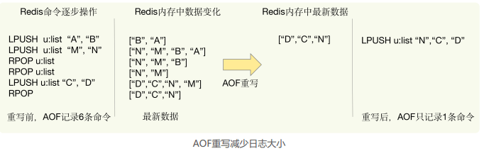

### 04 | AOF 日志：宕机了，Redis 如何避免数据丢失

Redis 的普遍使用的一个业务场景就是缓存应用。但是这里也有个绝对不能忽视的问题：**一旦服务器宕机，内存中的数据将全部丢失**。

针对这个，很容易想到的一个解决方案是：从后端数据库回复这些数据。但是这种方式存在两个问题：一是，**需要频繁访问数据库，会给数据库带来巨大的压力**；二是，**这些数据是从慢速数据库中读取出来的**，性能肯定比不上从 Redis 中读取，导致使用这些数据的应用程序响应变慢。

所以，对 Redis 来说，实现数据的持久化是至关重要的。目前，Redis 的持久化主要有两大机制，即 **AOF 日志和 RDB 快照**。  

#### AOF 日志

AOF 是写后日志，意思是 **Redis 是先执行命令，把数据写入内存，然后才记录日志**。

为什么要先执行命令再写日志呢？我们先来看看  AOF 记录了什么。

传统数据库的日志，例如 redo log（重做日志），记录的是修改后的数据，而 **AOF 里记录的是 Redis 收到的每一条命令，这些命令是以文本形式保存的**。  

我们以 Redis 收到“set testkey testvalue”命令后记录的日志为例，看看 AOF 日志的内容。其中，“*3”表示当前命令有三个部分，每部分都是由“$+数字”开头，后面紧跟着具体的命令、键或值。这里，“数字”表示这部分中的命令、键或值一共有多少字节。例如，“$3 set”表示这部分有 3 个字节，也就是“set”命令。

但是，**为了避免额外的检查开销，Redis 在向 AOF 里面记录日志的时候，并不会先去对这些命令进行语法检查**。所以，**如果先记日志再执行命令的话，日志中就有可能记录了错误的命令**，Redis 在使用日志恢复数据时，就可能会出错。

所以，Redis 使用写后日志的一大好处是，可以**避免记录错误命令的情况**。

##### AOF 的风险

首先，**如果刚执行完一个命令，还没有来得及记日志就宕机了，那么这个命令和相应的数据就有丢失的风险**。如果此时 Redis 是用作缓存，还可以从后端数据库重新读入数据进行恢复，但是，如果Redis 是直接用作数据库的话，此时，因为命令没有记入日志，所以就无法用日志进行恢复了。

其次，**AOF 虽然避免了对当前命令的阻塞，但可能会给下一个操作带来阻塞风险**。这是因为，AOF 日志也是在主线程中执行的，如果在把日志文件写入磁盘时，磁盘写压力大，就会导致写盘很慢，进而导致后续的操作也无法执行了。

这两个风险都是和 AOF 写回磁盘的时机相关的。

##### AOF 的三种写回策略

- **Always**，**同步写回**：每个写命令执行完，立马同步地将日志写回磁盘；
- **Everysec**，**每秒写回**：每个写命令执行完，只是先把日志写到 AOF 文件的内存缓冲区，每隔一秒把缓冲区中的内容写入磁盘；
- **No**，**操作系统控制的写回**：每个写命令执行完，只是先把日志写到 AOF 文件的内存缓冲区，由操作系统决定何时将缓冲区内容写回磁盘

针对避免主线程阻塞和减少数据丢失问题，这三种写回策略都无法做到两全其美。我们来分析下其中的原因。

- “同步写回”可以做到基本不丢数据，但是它在每一个写命令后都有一个慢速的落盘操作，不可避免地会影响主线程性能；
- 虽然“操作系统控制的写回”在写完缓冲区后，就可以继续执行后续的命令，但是落盘的时机已经不在 Redis 手中了，只要 AOF 记录没有写回磁盘，一旦宕机对应的数据就丢失了；
- “每秒写回”采用一秒写回一次的频率，避免了“同步写回”的性能开销，虽然减少了对系统性能的影响，但是如果发生宕机，上一秒内未落盘的命令操作仍然会丢失。所以，这只能算是，在避免影响主线程性能和避免数据丢失两者间取了个折中。

总结一下：**想要获得高性能，就选择 No 策略**；**如果想要得到高可靠性保证，就选择Always 策略**；**如果允许数据有一点丢失，又希望性能别受太大影响的话，那么就选择Everysec 策略**。

**三种写回策略体现了系统设计种的一个重要原则， 即 trade-off，或者称为“取舍”，指的就是在性能和可靠性保证之间做取舍**。我认为，这是做系统设计和开发的一个关键哲学，我也非常希望，你能充分地理解这个原则，并在日常开发中加以应用。 

 但是，按照系统的性能需求选定了写回策略，并不是“高枕无忧”了。

毕竟，AOF 是以文件的形式在记录接收到的所有写命令。随着**接收的写命令越来越多，AOF 文件会越来越大**。这也就意味着，我们**一定要小心 AOF 文件过大带来的性能问题**  。

##### 文件过大的性能问题

1. 文件系统本身对文件大小有限制，无法保存过大的文件；
2. 如果文件太大，之后再往里面追加命令记录的话，效率也会变低；
3. 如果发生宕机，AOF 中记录的命令要一个个被重新执行，用于故障恢复，如果日志文件太大，整个恢复过程就会非常缓慢，这就会影响到 Redis 的正常使用。

##### 解决文件过大的问题：AOF 重写机制

简单来说，**AOF 重写机制就是在重写时，Redis 根据数据库的现状创建一个新的 AOF 文件**，也就是说，**读取数据库中的所有键值对，然后对每一个键值对用一条命令记录它的写入**。根据键值对记录命令，用来缩写AOF文件大小。

**为什么重写机制可以把日志文件变小呢**? 实际上，重写机制具有“多变一”功能。所谓的“多变一”，也就是说，**旧日志文件中的多条命令，在重写后的新日志中变成了一条命令**。  

我们知道，AOF 文件是以追加的方式，逐一记录接收到的写命令的。**当一个键值对被多条写命令反复修改时，AOF 文件会记录相应的多条命令**。但是，**在重写的时候，是根据这个键值对当前的最新状态，为它生成对应的写入命令**。这样一来，一个键值对在重写日志中只用一条命令就行了，而且，在日志恢复时，只用执行这条命令，就可以直接完成这个键值对的写入了。  

下面这张图就是一个例子：  

不过，虽然 AOF 重写后，日志文件会缩小，但是，要把**整个数据库的最新数据的操作日志都写回磁盘，仍然是一个非常耗时的过程**。这时，我们就要继续关注另一个问题了：**重写会不会阻塞主线程**？  

##### AOF 重写会阻塞吗?  

和 **AOF 日志由主线程写回**不同，**重写过程是由后台线程 bgrewriteaof 来完成的**，这也是**为了避免阻塞主线程，导致数据库性能下降**。

重写过程总结为：“**一个拷贝，两处日志**”。

“一个拷贝”就是指，每次执行重写时，**主线程 fork 出后台的 bgrewriteaof 子进程**。此时，**fork 会把主线程的内存拷贝一份给 bgrewriteaof 子进程，这里面就包含了数据库的最新数据**。然后，**bgrewriteaof 子进程就可以在不影响主线程的情况下，逐一把拷贝的数据写成操作，记入重写日志**。  

**两处日志**

因为主线程未阻塞，仍然可以处理新来的操作。此时，**如果有写操作**，**第一处日志就是指正在使用的 AOF 日志，Redis 会把这个操作写到它的缓冲区**。这样一来，即使宕机了，这个 AOF 日志的操作仍然是齐全的，可以用于恢复。  

而**第二处日志，就是指新的 AOF 重写日志**。**这个操作也会被写到重写日志的缓冲区**。这样，重写日志也不会丢失最新的操作。等到拷贝数据的所有操作记录重写完成后，重写日志记录的这些最新操作也会写入新的 AOF 文件，以保证数据库最新状态的记录。此时，我们就可以用新的 AOF 文件替代旧文件了。  

总结来说，**每次 AOF 重写时，Redis 会先执行一个内存拷贝，用于重写；然后，使用两个日志保证在重写过程中，新写入的数据不会丢失**。而且，**因为 Redis 采用额外的线程进行数据重写，所以，这个过程并不会阻塞主线程**。