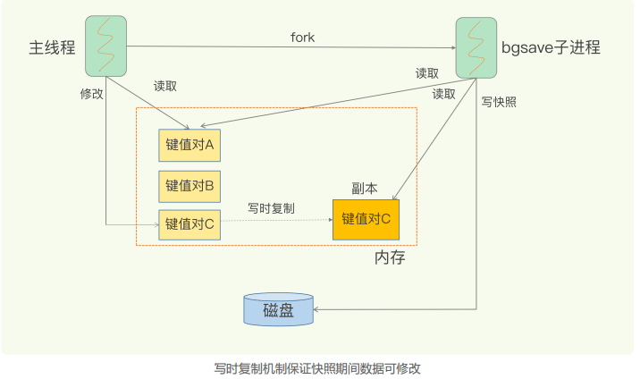
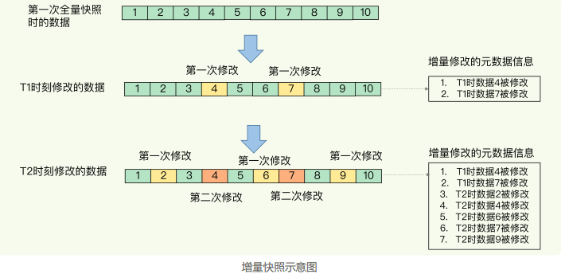
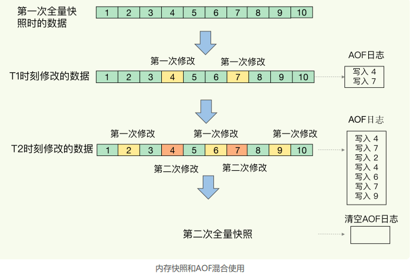

### 05 | 内存快照 RDB：宕机后，Redis 如何实现快速恢复

Redis 避免数据丢失的 AOF 方法，这个方法的好处是**每次执行只需要记录操作的命令，需要持久化的数据量不大**。一般而言，只要采用的不是 always 的持久化策略，就不会对性能造成太大的影响。

但是，也正因为记录的是操作命令，而不是实际的数据，所以，用 AOF 方法进行故障恢复的时候，需要逐一把操作日志都执行一遍。**如果操作日志非常多，Redis 就会恢复得很缓慢，影响到正常使用**。这当然不是理想的结果。那么，还有没有既可以保证可靠性，还能在宕机时实现快速恢复的其他方法呢？

另一种持久化方法：**内存快照**。**所谓内存快照，就是指内存中的数据在某一个时刻的状态记录**。这就类似于照片，当你给朋友拍照时，一张照片就能把朋友一瞬间的形象完全记下来。  

对 Redis 来说，它实现类似照片记录效果的方式，就是**把某一时刻的状态以文件的形式写到磁盘上，也就是快照**。这样一来，**即使宕机，快照文件也不会丢失，数据的可靠性也就得到了保证**。这个快照文件就称为 RDB 文件，其中，**RDB 就是 Redis DataBase 的缩写**。  

和 AOF 相比，RDB 记录的是某一时刻的数据，并不是操作，所以，**在做数据恢复时，我们可以直接把 RDB 文件读入内存，很快地完成恢复**。听起来好像很不错，但内存快照也并不是最优选项。为什么这么说呢？  

#### RDB 的两个关键问题

##### 1 对哪些数据做快照？

这关系到快照的执行效率的问题；

**Redis 的数据都在内存中，为了提供所有数据的可靠性保证，它执行的是全量快照，也就是说，把内存中的所有数据都记录到磁盘中**，这就类似于给 100 个人拍合影，把每一个人都拍进照片里。这样做的好处是，一次性记录了所有数据，一个都不少。  

当你给一个人拍照时，只用协调一个人就够了，但是，拍 100 人的大合影，却需要协调100 个人的位置、状态，等等，这当然会更费时费力。同样，**给内存的全量数据做快照，把它们全部写入磁盘也会花费很多时间**。而且，**全量数据越多，RDB 文件就越大，往磁盘上写数据的时间开销就越大**。

对于 Redis 而言，它的单线程模型就决定了，我们要尽量避免所有会阻塞主线程的操作，  所以，针对任何操作，都要提问”**它会阻塞主线程吗**？“

###### 生成 RDB 文件的命令

Redis 提供了两个命令来生成 RDB 文件，分别是 save 和 bgsave。  

- **save：在主线程中执行，会导致阻塞**；
- **bgsave：创建一个子进程，专门用于写入 RDB 文件，避免了主线程的阻塞**，这也是 Redis RDB 文件生成的默认配置。  

我们可以通过 bgsave 来执行全量快照，这既提供了数据的可靠性保证，也避免了对 Redis 的性能影响。  

##### 2 做快照时，数据还能被增删改吗？

这关系到Redis 是否被阻塞，能否同时正常处理请求。

在给别人拍照时，一旦对方动了，那么这张照片就拍糊了，我们就需要重拍，所以我们当然希望对方保持不动。对于内存快照而言，我们也不希望数据“动”。

举个例子。我们在时刻 t 给内存做快照，假设内存数据量是 4GB，磁盘的写入带宽是0.2GB/s，简单来说，至少需要 20s（4/0.2 = 20）才能做完。如果在时刻 t+5s 时，一个还没有被写入磁盘的内存数据 A，被修改成了 A’，那么就会破坏快照的完整性，因为A’不是时刻 t 时的状态。因此，和拍照类似，我们在做快照时也不希望数据“动”，也就是不能被修改。  

但是，**如果快照执行期间数据不能被修改，是会有潜在问题的**。对于刚刚的例子来说，在做快照的 20s 时间里，如果这 4GB 的数据都不能被修改，**Redis 就不能处理对这些数据的写操作，那无疑就会给业务服务造成巨大的影响**。

你可能会想到，**可以用 bgsave 避免阻塞**啊。这里我就要说到一个常见的误区了，**避免阻塞和正常处理写操作并不是一回事**。此时，主线程的确没有阻塞，可以正常接收请求，但是，为了保证快照完整性，**它只能处理读操作，因为不能修改正在执行快照的数据**。

所以，redis 这时候就会借助操作系统提供的 **写时复制技术（Copy-On-Write）**，在执行快照的同时，正常处理写操作。

简单来说，**bgsave 子进程是由主线程 fork 生成的，可以共享主线程的所有内存数据**。**bgsave 子进程运行后，开始读取主线程的内存数据，并把它们写入 RDB 文件**。

此时，如果主线程对这些数据也都是读操作（例如图中的键值对 A），那么，主线程和bgsave 子进程相互不影响。但是，**如果主线程要修改一块数据（例如图中的键值对 C），那么，这块数据就会被复制一份，生成该数据的副本**。然后，**bgsave 子进程会把这个副本数据写入 RDB 文件，而在这个过程中，主线程仍然可以直接修改原来的数据**。  

这既保证了快照的完整性，也允许主线程同时对数据进行修改，避免了对正常业务的影响。

#### 多久做一次快照，可以每秒做一次吗？

对于快照来说，所谓“连拍”就是指连续地做快照。这样一来，快照的间隔时间变得很短，即使某一时刻发生宕机了，因为上一时刻快照刚执行，丢失的数据也不会太多。但是，**这其中的快照间隔时间就很关键了**。

但是，并不是间隔时间越短越好，虽然 bgsave 执行时不会阻塞主线程，但是，**如果频繁地执行全量快照，也会带来两方面开销**。

##### 频繁快照的开销

一方面，频繁将全量数据写入磁盘，**会给磁盘带来很大压力**，多个快照竞争有限的磁盘带宽，前一个快照还没有做完，后一个又开始做了，容易造成恶性循环。

另一方面，bgsave 子进程需要通过 fork 操作从主线程创建出来。虽然，子进程在创建后不会再阻塞主线程，但是，**fork 这个创建过程本身会阻塞主线程，而且主线程的内存越大，阻塞时间越长**。**如果频繁 fork 出 bgsave 子进程，这就会频繁阻塞主线程了**。 

此时，我们可以做**增量快照**，所谓增量快照，就是指，做了一次全量快照后，后续的快照只对修改的数据进行快照记录，这样可以避免每次全量快照的开销。

在第一次做完全量快照后，T1 和 T2 时刻如果再做快照，我们只需要将被修改的数据写入快照文件就行。但是，**这么做的前提是，我们需要记住哪些数据被修改了**。你可不要小瞧**这个“记住”功能，它需要我们使用额外的元数据信息去记录哪些数据被修改了，这会带来额外的空间开销问题**。  

如果我们对每一个键值对的修改，都做个记录，那么，如果有 1 万个被修改的键值对，我们就需要有 1 万条额外的记录。而且，有的时候，键值对非常小，比如只有 32 字节，而记录它被修改的元数据信息，可能就需要 8 字节，这样的话，为了“记住”修改，引入的额外空间开销比较大。这对于内存资源宝贵的 Redis 来说，有些得不偿失。

和AOF相比，快照的恢复速度快，但是，快照的频率不好把握，如果如果频率太低，两次快照间一旦宕机，就可能有比较多的数据丢失。如果频率太高，又会产生额外开销，那么，还有什么方法既能利用 RDB 的快速恢复，又能以较小的开销做到尽量少丢数据呢？

**Redis 4.0 中提出了一个混合使用 AOF 日志和内存快照的方法**。简单来说，**内存快照以一定的频率执行，在两次快照之间，使用 AOF 日志记录这期间的所有命令操作**。

如下图所示，T1 和 T2 时刻的修改，用 AOF 日志记录，等到第二次做全量快照时，就可以清空 AOF 日志，因为此时的修改都已经记录到快照中了，恢复时就不再用日志了。  

#### 小结

关于 AOF 和 RDB 的选择问题，我想再给你提三点建议：  

- 数据不能丢失时，内存快照和 AOF 的混合使用是一个很好的选择；
- 如果允许分钟级别的数据丢失，可以只使用 RDB；
- 如果只用 AOF，优先使用 everysec 的配置选项，因为它在可靠性和性能之间取了一个
  平衡 。