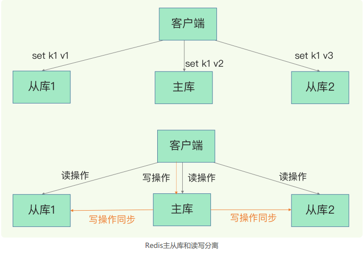

### 06 | 数据同步：主从库如何实现数据一致  

先前学习了 AOF 和 RDB，如果 redis  发生宕机，它们可以分别通过回放日志和重新读入 RDB 文件的方式恢复数据，从而保证尽量少丢失数据，提升可靠性。

但是，即使有这两种方法，也依然有服务不可用的问题。比如说，我们**在实际使用时只运行了一个 Redis 实例**，那么，**如果这个实例宕机了，它在恢复期间，是无法服务新来的数据存取请求的**。  

那我们总提到的 Redis 的高可靠性，指的是什么？

**高考可靠性：一是数据尽量少丢失；二是服务尽量少中断**。AOF 保证了前者，而对于后者，Redis 的做法就是**增加副本冗余量**，将一份数据同时保存在多个实例上。即使有一个实例出现了故障，需要过一段时间才能恢复，其他实例也可以对外提供服务，不会影响业务使用。  

多实例保存同一份数据，听起来好像很不错，但是，我们必须要考虑一个问题：**这么多副本，它们之间的数据如何保持一致呢**？**数据读写操作可以发给所有的实例吗**？

#### 主从库模式

对于此，Redis 提供了**主从库模式**，以保证数据副本的一致，主从库之间采用的是读写分离的模式。

**读操作**：主库、从库都可以接受；

**写操作**：首先到主库执行，然后，主库将写操作同步给从库。

为什么采用读写分离呢？

例如，上面对k1的三次修改，每次都发送到不同的实例上执行，那么这个数据在这三个实例上的副本就不一致了。读取数据的时候，就可能读取到旧值。

**如果我们非要保持这个数据在三个实例上一致，就要涉及到加锁、实例间协商是否完成修改等一系列操作，但这会带来巨额的开销，当然是不太能接受的**。

而主从模式一旦采用了读写分离，所有数据的修改只会在主库上进行，不用协调三个实例。主库有了最新的数据后，会同步给从库，这样，主从库的数据就是一致的。

那如何完成主从库同步呢？

#### 主从库同步的原理

当我们启动多个 Redis 实例的时候，它们之间可以通过 replicaof（Redis 5.0 之前使用 slaveof）命令形成主库和从库的关系。

例如，现在有实例 1（ip：172.16.19.3）和实例 2（ip：172.16.19.5），我们在实例 2 上执行以下这个命令后，实例 2 就变成了实例 1 的从库，并从实例 1 上复制数据：  

`replicaof 172.16.19.3 6379  `

按照三个阶段完成数据的第一次同步。