### 02 | 数据结构：快速的Redis有哪些慢操作？  

为什么Reis会这么快？它接收到一个键值对操作后，能以**微秒级别**的速度找到数据，并快速完成操作。  

一方面，这是因为它是内存数据库，所有操作都在内存上完成，内存的访问速度本身就很快。另一方面，这要归功于它的数据结构。这是因为，键值对是按一定的数据结构来组织的，**操作键值对最终就是对数据结构进行增删改查操作**，所以高效的数据结构是 Redis 快速处理数据的基础。  

#### 数据类型和数据结构对应关系

简单来说redis有主要这些数据类型：String（字符串）、List（列表）、Hash（哈希）、Set（集合）和 Sorted Set（有序集合）。这些数据类型的底层数据结构一共有6种，分别是简单动态字符串、双向链表、压缩列表、哈希表、跳表和整数数组 。对应关系如下：

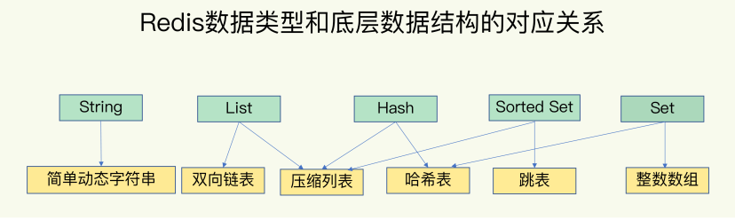

List、Hash、Set 和 Sorted Set  这四种称为**集合类型**， **一个键对应了一个集合的数据**。

#### 键和值本身之间用什么结构组织

这些数据结构都是值的底层实现，**键和值本身之间用什么结构组织**？

为了实现从键到值的快速访问，**Redis 使用了一个哈希表来保存所有键值对**。

一个哈希表，其实就是一个数组，**数组的每个元素称为一个哈希桶**。所以，我们常说，**一个哈希表是由多个哈希桶组成的，每个哈希桶中保存了键值对数据**。  

哈希桶中的元素都是指向他们的指针，分别指向了实际的key和value值。在下图中，可以看到，哈希桶中的 entry 元素中保存了 * key和 * value指针，分别指向了实际的键和值，这样一来，即使值是一个集合，也可以通过 * value指针被查找到。

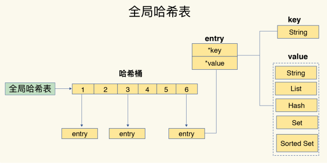

因为这个哈希表保存了所有的键值对，所以，我也把它称为**全局哈希表**。哈希表的最大好处很明显，就是让我们可以**用 O(1) 的时间复杂度来快速查找到键值对**——我们只需要计算键的哈希值，就可以知道它所对应的哈希桶位置，然后就可以访问相应的 entry 元素。

但是，**当往 Redis 中写入大量数据后**，就可能发现操作有时候突然变慢了。这是因为 **哈希表的冲突问题 和 rehash 可能带来的操作阻塞**。

#### 为什么hash表操作变慢了 

当你往哈希表中写入更多数据时，哈希冲突是不可避免的问题。  

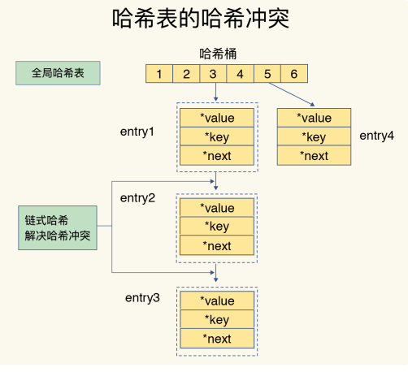

如果哈希表里写入的数据越来越多，哈希冲突可能也会越来越多，这就会导致**某些哈希冲突链**
**过长，进而导致这个链上的元素查找耗时长，效率降低**。对于追求“快”的 Redis 来说，这是不太能接受的。  

所以，**Redis 会对哈希表做 rehash 操作**。**rehash 也就是增加现有的哈希桶数量，让逐渐**
**增多的 entry 元素能在更多的桶之间分散保存，减少单个桶中的元素数量，从而减少单个**
**桶中的冲突**。

##### **rehash 过程**

为了使 rehash 操作更高效，Redis 默认使用了两个全局哈希表：哈希表 1 和哈希表 2。一开始，当你刚插入数据时，默认使用哈希表 1，此时的哈希表 2 并没有被分配空间。随着数据逐步增多，Redis 开始执行 rehash，这个过程分为三步：  

1. 给哈希表 2 分配更大的空间，例如是当前哈希表 1 大小的两倍；
2. 把哈希表 1 中的数据重新映射并拷贝到哈希表 2 中；
3. 释放哈希表 1 的空间。  

哈希表1留着下一次扩容备用。这个过程看似简单，但是**第二步涉及大量的数据拷贝**，**如果一次性把哈希表 1 中的数据都迁移完，会造成 Redis 线程阻塞，无法服务其他请求**。此时，Redis 就无法快速访问数据了。  

##### 渐进式 rehash

简单来说就是在第二步拷贝数据时，Redis 仍然正常处理客户端请求，**每处理一个请求时，从哈希表 1 中的第一个索引位置开始，顺带着将这个索引位置上的所有 entries 拷贝到哈希表 2 中；等处理下一个请求时，再顺带拷贝哈希表 1 中的下一个索引位置的entries**。如下图所示：

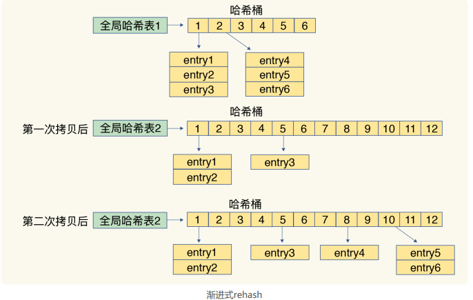

这样就巧妙地把一次性大量拷贝的开销，分摊到了多次处理请求的过程中，避免了耗时操
作，保证了数据的快速访问。

#### 集合数据操作效率

和 String 类型不同，一个集合类型的值，第一步是通过全局哈希表找到对应的哈希桶位置，第二步是在集合中再增删改查。那么，集合的操作效率和哪些因素相关呢？  

（1）**与集合的底层数据结构有关**。例如，使用哈希表实现的集合要比使用链表实现的集合访问效率更高。

（2）**操作效率和这些操作本身的执行特点有关**。比如读写一个元素的操作比读写所有元素的效率高。

##### 底层数据结构

###### 压缩列表

**压缩列表**实际上**类似于一个数组，数组中的每一个元素都对应保存一个数据**。和数组不同的是，**压缩列表在表头有三个字段 zlbytes、zltail 和 zllen，分别表示列表长度、列表尾的偏移量和列表中的 entry 个数**；**压缩列表在表尾还有一个 zlend，表示列表结束**。

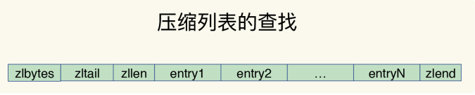

在压缩列表中，如果我们要**查找定位第一个元素和最后一个元素**，可以通过表头三个字段的长度直接定位，**复杂度是 O(1)**。而**查找其他元素时**，就没有这么高效了，只能逐个查找，此时的**复杂度就是 O(N)** 了。

###### 跳表

有序链表只能逐一查找元素，导致操作起来非常缓慢，于是就出现了跳表。具体来说，**跳表在链表的基础上，增加了多级索引，通过索引位置的几个跳转，实现数据的快速定位**，如下图所示：  

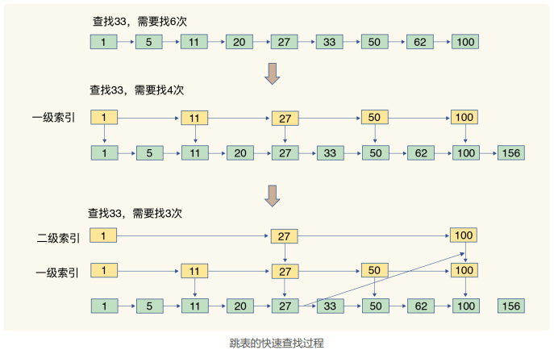

如果我们要查找33，需要从头开始遍历链表，查找6次。此时，复杂度为 O(N)，查找效率很低。

为了提高查询速度，我们增加了**一级索引**：**从第一个元素开始，每两个元素选一个出来作为索引**。这些索引再通过指针指向原始的链表。此时，我们只需要查找4次就可以找到元素 33 了。

如果我们还想再快，可以增加**二级索引**：从**一级索引**中，再抽取部分元素作为二级索引。例如，从一级索引中抽取 1、27、100 作为二级索引，二级索引指向一级索引。这样，我们只需要 3 次查找，就能定位到元素 33 了。

**当数据量很大时，跳表的查找复杂度就是 O(logN**)。  

时间复杂度如下：

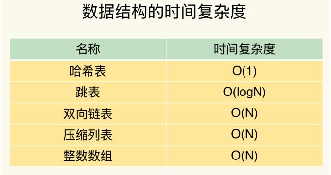

##### 不同操作的复杂度

集合类型的操作类型很多，有读写单个集合元素的，例如 HGET、HSET，也有操作多个元素的，例如 SADD，还有对整个集合进行遍历操作的，例如 SMEMBERS。这么多操作，它们的复杂度也各不相同。而复杂度的高低又是我们选择集合类型的重要依据。

四句口诀：

**单元素操作是基础**；
**范围操作非常耗时**；
**统计操作通常高效**；
**例外情况只有几个**。  

**单元素操作，是指每一种集合类型对单个数据实现的增删改查操作**，例如，Hash 类型的 HGET、HSET 和 HDEL，复杂度 O(1)，Set 类型的 SADD、SREM、SRANDMEMBER，复杂度O(1) 等。这些操作的复杂度由集合采用的数据结构决定。

集合类型支持同时对多个元素进行增删改查，例如 Hash类型的 HMGET 和 HMSET，Set 类型的 SADD 也支持同时增加多个元素。此时，这些操作的复杂度，就是由单个元素操作复杂度和元素个数决定的。例如，HMSET 增加 M 个元素时，复杂度就从 O(1) 变成 O(M) 了。

**范围操作，是指集合类型中的遍历操作，可以返回集合中的所有数据**。比如 Hash类型的 HGETALL 和 Set 类型的 SMEMBERS，或者返回一个范围内的部分数据，比如 List类型的 LRANGE 和 ZSet 类型的 ZRANGE。这类操作的复杂度一般是 O(N)，比较耗时，我们应该尽量避免。

**Redis 从2.8版本提供了 SCAN 系列操作**（包括 HSCAN，SSCAN 和ZSCAN），这类操作实现了渐进式遍历，每次只返回有限数量的数据。这样一来，相比于HGETALL、SMEMBERS 这类操作来说，就避免了一次性返回所有元素而导致的 Redis 阻塞。  

**统计操作，是指集合类型对集合中所有元素个数的记录**，例如 LLEN 和 SCARD。这类操作复杂度只有 O(1)，这是因为**当集合类型采用压缩列表、双向链表、整数数组这些数据结构时，这些结构中专门记录了元素的个数统计**，因此可以高效地完成相关操作。

**例外情况，是指某些数据结构的特殊记录**，例如压缩列表和双向链表都会记录表头和表尾的偏移量。这样一来，对于 List 类型的 LPOP、RPOP、LPUSH、RPUSH 这四个操作来说，它们是在列表的头尾增删元素，这就可以通过偏移量直接定位，所以它们的复杂度也只有 O(1)，可以实现快速操作。

#### 使用建议

集合类型的范围操作，因为要遍历底层数据结构，复杂度通常是 O(N)。建议这里用**其他命令来替代**，例如可以用 SCAN 来替代，避免在 Redis 内部产生费时的全集合遍历操作。

对于复杂度较高的 List 类型，它的两种底层实现结构：双向链表和压缩列表的操作复杂度都是 O(N)。  因此，建议**因地制宜地使用 List  类型**。例如，既然它的 POP/PUSH 效率很高，那么就将它主要用于 FIFO 队列场景，而不是作为一个可以随机读写的集合。

### 03 | 为什么单线程的 Redis 能这么快

为什么单线程的 Redis 能那么快？  

首先，我们通常说，**Redis 是单线程，主要是指 Redis 的网络 IO 和键值对读写是由一个线程来完成的**，这也是 Redis 对外提供键值存储服务的主要流程。**但 Redis 的其他功能，比如持久化、异步删除、集群数据同步等，其实是由额外的线程执行的**。  

所以，严格来说，Redis 并不是单线程，但是我们一般把 Redis 称为单线程高性能。需要弄明白这个问题，我们要搞懂 **Redis 的单线程设计机制以及多路复用机制**。

#### Redis 为什么用单线程

##### 多线程的问题

我们经常会听到一种说法：“使用多线程，可以增加系统吞吐率，或是可以增加系统扩展性。”的确，**对于一个多线程的系统来说，在有合理的资源分配的情况下，可以增加系统中处理请求操作的资源实体，进而提升系统能够同时处理的请求数**，即吞吐率。

但是，通常情况下，在我们采用多线程后，**如果没有良好的系统设计**，实际得到的结果，其实是右图所展示的那样。我们刚开始增加线程数时，系统吞吐率会增加，但是，再进一步增加线程时，系统吞吐率就增长迟缓了，有时甚至还会出现下降的情况。

  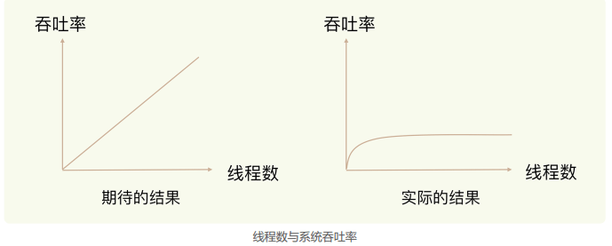

为什么会出现这种情况呢？一个关键的瓶颈在于，**系统中通常会存在被多线程同时访问的共享资源**，比如一个共享的数据结构。**当有多个线程要修改这个共享资源时，为了保证共享资源的正确性，就需要有额外的机制进行保证，而这个额外的机制，就会带来额外的开销**。  

**多线程编程模式面临的共享资源并发控制问题**。

并发访问控制以及采用多线程开发一般会引入同步原语来保护共享资源的并发访问，这也会降低系统代码的易调试性和可维护性。为了避免这些问题，Redis 直接采用了单线程模式。

#### 单线程 Redis 为什么这么快

通常来说，单线程的处理能力要比多线程差很多，但是 Redis 却能使用单线程模型达到每秒数十万级别的处理能力，这是为什么呢？其实，这是 Redis 多方面设计选择的一个综合结果。  

一方面，**Redis 的大部分操作在内存上完成，再加上它采用了高效的数据结构**，例如哈希表和跳表，这是它实现高性能的一个重要原因。

另一方面，就是 **Redis 采用了多路复用机制，使其在网络 IO 操作中能并发处理大量的客户端请求，实现高吞吐率**。  

##### 基本 IO 模型与阻塞点

以 Get 请求为例，SimpleKV 为了处理一个 Get 请求，需要监听客户端请求（bind/listen），和客户端建立连接（accept），从 socket 中读取请求（recv），解析客户端发送请求（parse），根据请求类型读取键值数据（get），最后给客户端返回结果，即向 socket 中写回数据（send）。  

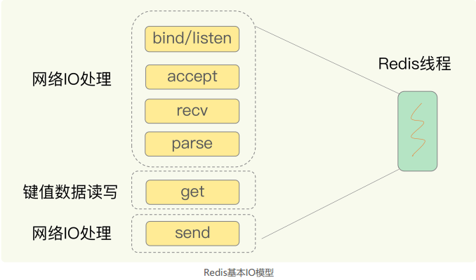

但是这里的网络IO操作有潜在的阻塞点，分别时 accept() 和 recv()。当 Redis监听到一个客户端有连接请求，但一直未能成功建立起连接时，会阻塞在 accept() 函数这里，导致其他客户端无法和 Redis 建立连接。类似的，当 Redis 通过 recv() 从一个客户端读取数据时，如果数据一直没有到达，Redis 也会一直阻塞在 recv()。

这就导致 Redis 整个线程阻塞，无法处理其他客户端请求，效率很低。不过，幸运的是，**socket 网络模型本身支持非阻塞模式**。

#####  非阻塞模式

**在 socket 模型中，不同操作调用后会返回不同的套接字类型**。**socket() 方法会返回主动套接字**，然后**调用 listen() 方法，将主动套接字转化为监听套接字**，此时，可以监听来自客户端的连接请求。最后，**调用 accept() 方法接收到达的客户端连接，并返回已连接套接字**。

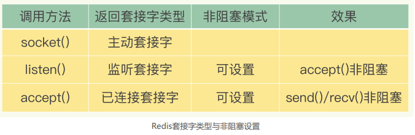

针对监听套接字，我们可以设置非阻塞模式：**当 Redis 调用 accept() 但一直未有连接请求到达时，Redis 线程可以返回处理其他操作，而不用一直等待**。但是，你要注意的是，**调用 accept() 时，已经存在监听套接字**了。

虽然 Redis 线程可以不用继续等待，但是总得有机制继续在监听套接字上等待后续连接请求，并在有请求时通知 Redis。  

类似的，我们也可以针对已连接套接字设置非阻塞模式：Redis 调用 recv() 后，如果已连接套接字上一直没有数据到达，Redis 线程同样可以返回处理其他操作。我们也需要有机制继续监听该已连接套接字，并在有数据达到时通知 Redis。

这样才能保证 Redis 线程，既不会像基本 IO 模型中一直在阻塞点等待，也不会导致 Redis无法处理实际到达的连接请求或数据。

至此，Linux 中的 IO 多路复用机制就要登场了。

##### 基于多路复用的高性能I/O模型

**Linux 中的 IO 多路复用机制是指一个线程处理多个 IO 流，就是我们经常听到的select/epoll 机制**。简单来说，**在 Redis 只运行单线程的情况下，该机制允许内核中，同时存在多个监听套接字和已连接套接字**。内核会一直监听这些套接字上的连接请求或数据请求。一旦有请求到达，就会交给 Redis 线程处理，这就实现了一个 Redis 线程处理多个IO 流的效果。

下图就是基于多路复用的 Redis IO 模型。图中的多个 FD 就是刚才所说的多个套接字。**Redis 网络框架调用 epoll 机制，让内核监听这些套接字**。此时，**Redis 线程不会阻塞在某一个特定的监听或已连接套接字上**，也就是说，不会阻塞在某一个特定的客户端请求处理上。正因为此，Redis 可以同时和多个客户端连接并处理请求，从而提升并发性。

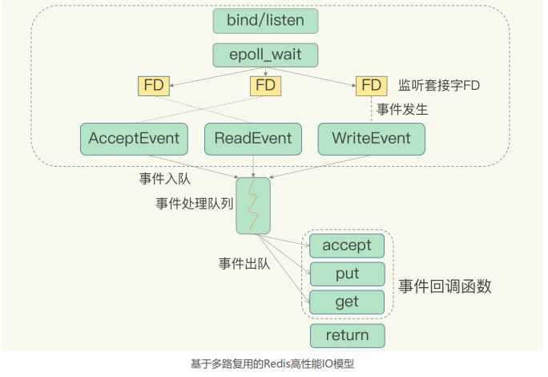

**为了在请求到达时能通知到 Redis 线程，select/epoll 提供了基于事件的回调机制，即针对不同事件的发生，调用相应的处理函数**。

回调机制，**select/epoll 一旦监测到 FD 上有请求到达时，就会触发相应的事件**。  

**这些事件会被放进一个事件队列，Redis 单线程对该事件队列不断进行处理**。这样一来，Redis 无需一直轮询是否有请求实际发生，这就可以避免造成 CPU 资源浪费。同时，Redis 在对事件队列中的事件进行处理时，会调用相应的处理函数，这就实现了基于事件的回调。因为 Redis 一直在对事件队列进行处理，所以能及时响应客户端请求，提升Redis 的响应性能。

例如，两个请求，连接请求和读数据请求。这两个请求分别对应 Accept 事件和 Read 事件，Redis 分别对这两个事件注册 accept 和get 回调函数。当 Linux 内核监听到有连接请求或读数据请求时，就会触发 Accept 事件和 Read 事件，此时，内核就会回调 Redis 相应的 accept 和 get 函数进行处理。  

不过，需要注意的是，即使你的应用场景中部署了不同的操作系统，多路复用机制也是适用的。因为这个机制的实现有很多种，既有**基于 Linux 系统下的 select 和 epoll 实现**，也有**基于 FreeBSD 的 kqueue 实现**，以及**基于 Solaris 的 evport 实现**，这样，你可以根据Redis 实际运行的操作系统，选择相应的多路复用实现。  

### 04 | AOF 日志：宕机了，Redis 如何避免数据丢失

Redis 的普遍使用的一个业务场景就是缓存应用。但是这里也有个绝对不能忽视的问题：**一旦服务器宕机，内存中的数据将全部丢失**。

针对这个，很容易想到的一个解决方案是：从后端数据库回复这些数据。但是这种方式存在两个问题：一是，**需要频繁访问数据库，会给数据库带来巨大的压力**；二是，**这些数据是从慢速数据库中读取出来的**，性能肯定比不上从 Redis 中读取，导致使用这些数据的应用程序响应变慢。

所以，对 Redis 来说，实现数据的持久化是至关重要的。目前，Redis 的持久化主要有两大机制，即 **AOF 日志和 RDB 快照**。  

#### AOF 日志

AOF 是写后日志，意思是 **Redis 是先执行命令，把数据写入内存，然后才记录日志**。

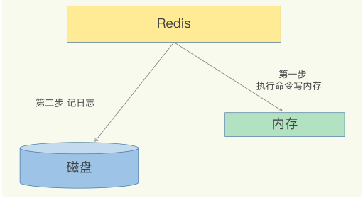

为什么要先执行命令再写日志呢？我们先来看看  AOF 记录了什么。

传统数据库的日志，例如 redo log（重做日志），记录的是修改后的数据，而 **AOF 里记录的是 Redis 收到的每一条命令，这些命令是以文本形式保存的**。  

我们以 Redis 收到“set testkey testvalue”命令后记录的日志为例，看看 AOF 日志的内容。其中，“*3”表示当前命令有三个部分，每部分都是由“$+数字”开头，后面紧跟着具体的命令、键或值。这里，“数字”表示这部分中的命令、键或值一共有多少字节。例如，“$3 set”表示这部分有 3 个字节，也就是“set”命令。

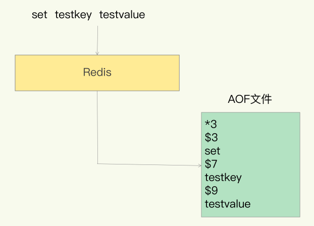

但是，**为了避免额外的检查开销，Redis 在向 AOF 里面记录日志的时候，并不会先去对这些命令进行语法检查**。所以，**如果先记日志再执行命令的话，日志中就有可能记录了错误的命令**，Redis 在使用日志恢复数据时，就可能会出错。

所以，Redis 使用写后日志的一大好处是，可以**避免记录错误命令的情况**。

##### AOF 的风险

首先，**如果刚执行完一个命令，还没有来得及记日志就宕机了，那么这个命令和相应的数据就有丢失的风险**。如果此时 Redis 是用作缓存，还可以从后端数据库重新读入数据进行恢复，但是，如果Redis 是直接用作数据库的话，此时，因为命令没有记入日志，所以就无法用日志进行恢复了。

其次，**AOF 虽然避免了对当前命令的阻塞，但可能会给下一个操作带来阻塞风险**。这是因为，AOF 日志也是在主线程中执行的，如果在把日志文件写入磁盘时，磁盘写压力大，就会导致写盘很慢，进而导致后续的操作也无法执行了。

这两个风险都是和 AOF 写回磁盘的时机相关的。

##### AOF 的三种写回策略

- **Always**，**同步写回**：每个写命令执行完，立马同步地将日志写回磁盘；
- **Everysec**，**每秒写回**：每个写命令执行完，只是先把日志写到 AOF 文件的内存缓冲区，每隔一秒把缓冲区中的内容写入磁盘；
- **No**，**操作系统控制的写回**：每个写命令执行完，只是先把日志写到 AOF 文件的内存缓冲区，由操作系统决定何时将缓冲区内容写回磁盘

针对避免主线程阻塞和减少数据丢失问题，这三种写回策略都无法做到两全其美。我们来分析下其中的原因。

- “同步写回”可以做到基本不丢数据，但是它在每一个写命令后都有一个慢速的落盘操作，不可避免地会影响主线程性能；
- 虽然“操作系统控制的写回”在写完缓冲区后，就可以继续执行后续的命令，但是落盘的时机已经不在 Redis 手中了，只要 AOF 记录没有写回磁盘，一旦宕机对应的数据就丢失了；
- “每秒写回”采用一秒写回一次的频率，避免了“同步写回”的性能开销，虽然减少了对系统性能的影响，但是如果发生宕机，上一秒内未落盘的命令操作仍然会丢失。所以，这只能算是，在避免影响主线程性能和避免数据丢失两者间取了个折中。

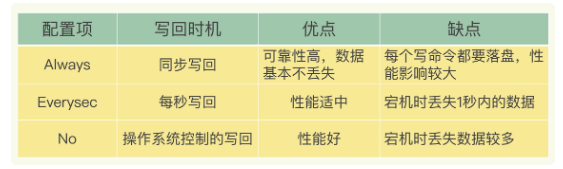

总结一下：**想要获得高性能，就选择 No 策略**；**如果想要得到高可靠性保证，就选择Always 策略**；**如果允许数据有一点丢失，又希望性能别受太大影响的话，那么就选择Everysec 策略**。

**三种写回策略体现了系统设计种的一个重要原则， 即 trade-off，或者称为“取舍”，指的就是在性能和可靠性保证之间做取舍**。我认为，这是做系统设计和开发的一个关键哲学，我也非常希望，你能充分地理解这个原则，并在日常开发中加以应用。 

 但是，按照系统的性能需求选定了写回策略，并不是“高枕无忧”了。

毕竟，AOF 是以文件的形式在记录接收到的所有写命令。随着**接收的写命令越来越多，AOF 文件会越来越大**。这也就意味着，我们**一定要小心 AOF 文件过大带来的性能问题**  。

##### 文件过大的性能问题

1. 文件系统本身对文件大小有限制，无法保存过大的文件；
2. 如果文件太大，之后再往里面追加命令记录的话，效率也会变低；
3. 如果发生宕机，AOF 中记录的命令要一个个被重新执行，用于故障恢复，如果日志文件太大，整个恢复过程就会非常缓慢，这就会影响到 Redis 的正常使用。

##### 解决文件过大的问题：AOF 重写机制

简单来说，**AOF 重写机制就是在重写时，Redis 根据数据库的现状创建一个新的 AOF 文件**，也就是说，**读取数据库中的所有键值对，然后对每一个键值对用一条命令记录它的写入**。根据键值对记录命令，用来缩写AOF文件大小。

**为什么重写机制可以把日志文件变小呢**? 实际上，重写机制具有“多变一”功能。所谓的“多变一”，也就是说，**旧日志文件中的多条命令，在重写后的新日志中变成了一条命令**。  

我们知道，AOF 文件是以追加的方式，逐一记录接收到的写命令的。**当一个键值对被多条写命令反复修改时，AOF 文件会记录相应的多条命令**。但是，**在重写的时候，是根据这个键值对当前的最新状态，为它生成对应的写入命令**。这样一来，一个键值对在重写日志中只用一条命令就行了，而且，在日志恢复时，只用执行这条命令，就可以直接完成这个键值对的写入了。  

下面这张图就是一个例子：  

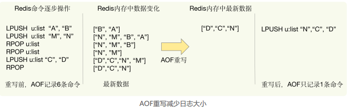

不过，虽然 AOF 重写后，日志文件会缩小，但是，要把**整个数据库的最新数据的操作日志都写回磁盘，仍然是一个非常耗时的过程**。这时，我们就要继续关注另一个问题了：**重写会不会阻塞主线程**？  

##### AOF 重写会阻塞吗?  

和 **AOF 日志由主线程写回**不同，**重写过程是由后台线程 bgrewriteaof 来完成的**，这也是**为了避免阻塞主线程，导致数据库性能下降**。

重写过程总结为：“**一个拷贝，两处日志**”。

“一个拷贝”就是指，每次执行重写时，**主线程 fork 出后台的 bgrewriteaof 子进程**。此时，**fork 会把主线程的内存拷贝一份给 bgrewriteaof 子进程，这里面就包含了数据库的最新数据**。然后，**bgrewriteaof 子进程就可以在不影响主线程的情况下，逐一把拷贝的数据写成操作，记入重写日志**。  

**两处日志**

因为主线程未阻塞，仍然可以处理新来的操作。此时，**如果有写操作**，**第一处日志就是指正在使用的 AOF 日志，Redis 会把这个操作写到它的缓冲区**。这样一来，即使宕机了，这个 AOF 日志的操作仍然是齐全的，可以用于恢复。  

而**第二处日志，就是指新的 AOF 重写日志**。**这个操作也会被写到重写日志的缓冲区**。这样，重写日志也不会丢失最新的操作。等到拷贝数据的所有操作记录重写完成后，重写日志记录的这些最新操作也会写入新的 AOF 文件，以保证数据库最新状态的记录。此时，我们就可以用新的 AOF 文件替代旧文件了。  

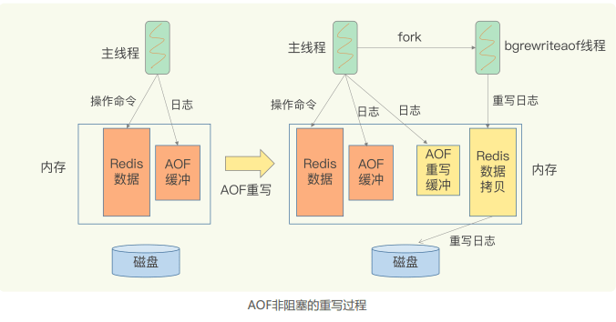

总结来说，**每次 AOF 重写时，Redis 会先执行一个内存拷贝，用于重写；然后，使用两个日志保证在重写过程中，新写入的数据不会丢失**。而且，**因为 Redis 采用额外的线程进行数据重写，所以，这个过程并不会阻塞主线程**。

### 05 | 内存快照 RDB：宕机后，Redis 如何实现快速恢复

Redis 避免数据丢失的 AOF 方法，这个方法的好处是**每次执行只需要记录操作的命令，需要持久化的数据量不大**。一般而言，只要采用的不是 always 的持久化策略，就不会对性能造成太大的影响。

但是，也正因为记录的是操作命令，而不是实际的数据，所以，用 AOF 方法进行故障恢复的时候，需要逐一把操作日志都执行一遍。**如果操作日志非常多，Redis 就会恢复得很缓慢，影响到正常使用**。这当然不是理想的结果。那么，还有没有既可以保证可靠性，还能在宕机时实现快速恢复的其他方法呢？

另一种持久化方法：**内存快照**。**所谓内存快照，就是指内存中的数据在某一个时刻的状态记录**。这就类似于照片，当你给朋友拍照时，一张照片就能把朋友一瞬间的形象完全记下来。  

对 Redis 来说，它实现类似照片记录效果的方式，就是**把某一时刻的状态以文件的形式写到磁盘上，也就是快照**。这样一来，**即使宕机，快照文件也不会丢失，数据的可靠性也就得到了保证**。这个快照文件就称为 RDB 文件，其中，**RDB 就是 Redis DataBase 的缩写**。  

和 AOF 相比，RDB 记录的是某一时刻的数据，并不是操作，所以，**在做数据恢复时，我们可以直接把 RDB 文件读入内存，很快地完成恢复**。听起来好像很不错，但内存快照也并不是最优选项。为什么这么说呢？  

#### RDB 的两个关键问题

##### 1 对哪些数据做快照？

这关系到快照的执行效率的问题；

**Redis 的数据都在内存中，为了提供所有数据的可靠性保证，它执行的是全量快照，也就是说，把内存中的所有数据都记录到磁盘中**，这就类似于给 100 个人拍合影，把每一个人都拍进照片里。这样做的好处是，一次性记录了所有数据，一个都不少。  

当你给一个人拍照时，只用协调一个人就够了，但是，拍 100 人的大合影，却需要协调100 个人的位置、状态，等等，这当然会更费时费力。同样，**给内存的全量数据做快照，把它们全部写入磁盘也会花费很多时间**。而且，**全量数据越多，RDB 文件就越大，往磁盘上写数据的时间开销就越大**。

对于 Redis 而言，它的单线程模型就决定了，我们要尽量避免所有会阻塞主线程的操作，  所以，针对任何操作，都要提问”**它会阻塞主线程吗**？“

###### 生成 RDB 文件的命令

Redis 提供了两个命令来生成 RDB 文件，分别是 save 和 bgsave。  

- **save：在主线程中执行，会导致阻塞**；
- **bgsave：创建一个子进程，专门用于写入 RDB 文件，避免了主线程的阻塞**，这也是 Redis RDB 文件生成的默认配置。  

我们可以通过 bgsave 来执行全量快照，这既提供了数据的可靠性保证，也避免了对 Redis 的性能影响。  

##### 2 做快照时，数据还能被增删改吗？

这关系到Redis 是否被阻塞，能否同时正常处理请求。

在给别人拍照时，一旦对方动了，那么这张照片就拍糊了，我们就需要重拍，所以我们当然希望对方保持不动。对于内存快照而言，我们也不希望数据“动”。

举个例子。我们在时刻 t 给内存做快照，假设内存数据量是 4GB，磁盘的写入带宽是0.2GB/s，简单来说，至少需要 20s（4/0.2 = 20）才能做完。如果在时刻 t+5s 时，一个还没有被写入磁盘的内存数据 A，被修改成了 A’，那么就会破坏快照的完整性，因为A’不是时刻 t 时的状态。因此，和拍照类似，我们在做快照时也不希望数据“动”，也就是不能被修改。  

但是，**如果快照执行期间数据不能被修改，是会有潜在问题的**。对于刚刚的例子来说，在做快照的 20s 时间里，如果这 4GB 的数据都不能被修改，**Redis 就不能处理对这些数据的写操作，那无疑就会给业务服务造成巨大的影响**。

你可能会想到，**可以用 bgsave 避免阻塞**啊。这里我就要说到一个常见的误区了，**避免阻塞和正常处理写操作并不是一回事**。此时，主线程的确没有阻塞，可以正常接收请求，但是，为了保证快照完整性，**它只能处理读操作，因为不能修改正在执行快照的数据**。

所以，redis 这时候就会借助操作系统提供的 **写时复制技术（Copy-On-Write）**，在执行快照的同时，正常处理写操作。

简单来说，**bgsave 子进程是由主线程 fork 生成的，可以共享主线程的所有内存数据**。**bgsave 子进程运行后，开始读取主线程的内存数据，并把它们写入 RDB 文件**。

此时，如果主线程对这些数据也都是读操作（例如图中的键值对 A），那么，主线程和bgsave 子进程相互不影响。但是，**如果主线程要修改一块数据（例如图中的键值对 C），那么，这块数据就会被复制一份，生成该数据的副本**。然后，**bgsave 子进程会把这个副本数据写入 RDB 文件，而在这个过程中，主线程仍然可以直接修改原来的数据**。  

这既保证了快照的完整性，也允许主线程同时对数据进行修改，避免了对正常业务的影响。

#### 多久做一次快照，可以每秒做一次吗？

对于快照来说，所谓“连拍”就是指连续地做快照。这样一来，快照的间隔时间变得很短，即使某一时刻发生宕机了，因为上一时刻快照刚执行，丢失的数据也不会太多。但是，**这其中的快照间隔时间就很关键了**。

但是，并不是间隔时间越短越好，虽然 bgsave 执行时不会阻塞主线程，但是，**如果频繁地执行全量快照，也会带来两方面开销**。

##### 频繁快照的开销

一方面，频繁将全量数据写入磁盘，**会给磁盘带来很大压力**，多个快照竞争有限的磁盘带宽，前一个快照还没有做完，后一个又开始做了，容易造成恶性循环。

另一方面，bgsave 子进程需要通过 fork 操作从主线程创建出来。虽然，子进程在创建后不会再阻塞主线程，但是，**fork 这个创建过程本身会阻塞主线程，而且主线程的内存越大，阻塞时间越长**。**如果频繁 fork 出 bgsave 子进程，这就会频繁阻塞主线程了**。 

此时，我们可以做**增量快照**，所谓增量快照，就是指，做了一次全量快照后，后续的快照只对修改的数据进行快照记录，这样可以避免每次全量快照的开销。

在第一次做完全量快照后，T1 和 T2 时刻如果再做快照，我们只需要将被修改的数据写入快照文件就行。但是，**这么做的前提是，我们需要记住哪些数据被修改了**。你可不要小瞧**这个“记住”功能，它需要我们使用额外的元数据信息去记录哪些数据被修改了，这会带来额外的空间开销问题**。  

如果我们对每一个键值对的修改，都做个记录，那么，如果有 1 万个被修改的键值对，我们就需要有 1 万条额外的记录。而且，有的时候，键值对非常小，比如只有 32 字节，而记录它被修改的元数据信息，可能就需要 8 字节，这样的话，为了“记住”修改，引入的额外空间开销比较大。这对于内存资源宝贵的 Redis 来说，有些得不偿失。

和AOF相比，快照的恢复速度快，但是，快照的频率不好把握，如果如果频率太低，两次快照间一旦宕机，就可能有比较多的数据丢失。如果频率太高，又会产生额外开销，那么，还有什么方法既能利用 RDB 的快速恢复，又能以较小的开销做到尽量少丢数据呢？

**Redis 4.0 中提出了一个混合使用 AOF 日志和内存快照的方法**。简单来说，**内存快照以一定的频率执行，在两次快照之间，使用 AOF 日志记录这期间的所有命令操作**。

如下图所示，T1 和 T2 时刻的修改，用 AOF 日志记录，等到第二次做全量快照时，就可以清空 AOF 日志，因为此时的修改都已经记录到快照中了，恢复时就不再用日志了。  

#### 小结

关于 AOF 和 RDB 的选择问题，我想再给你提三点建议：  

- 数据不能丢失时，内存快照和 AOF 的混合使用是一个很好的选择；
- 如果允许分钟级别的数据丢失，可以只使用 RDB；
- 如果只用 AOF，优先使用 everysec 的配置选项，因为它在可靠性和性能之间取了一个
  平衡 。

