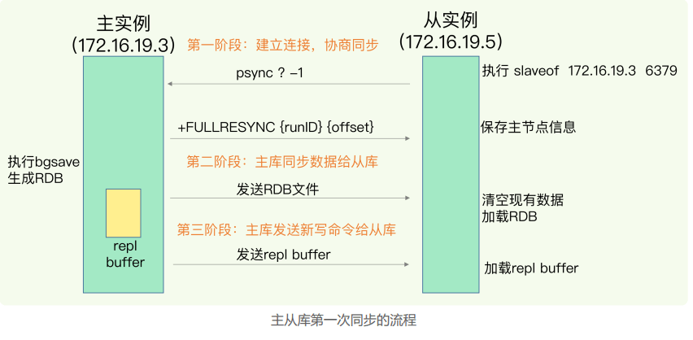
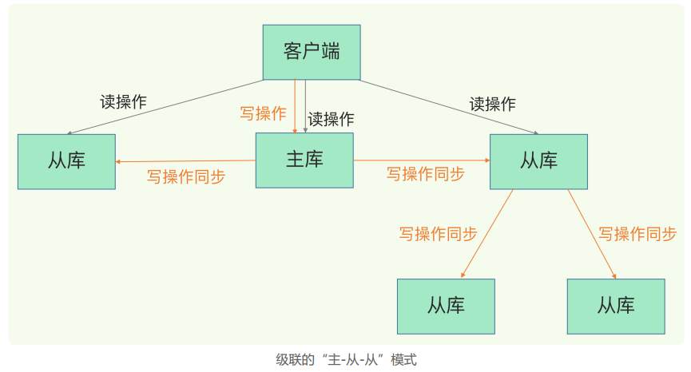
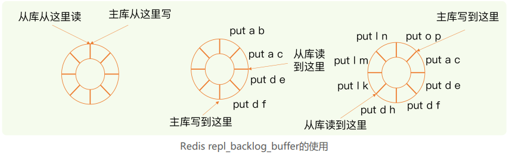
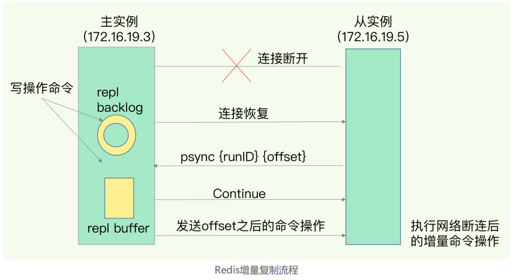

### 06 | 数据同步：主从库如何实现数据一致  

先前学习了 AOF 和 RDB，如果 redis  发生宕机，它们可以分别通过回放日志和重新读入 RDB 文件的方式恢复数据，从而保证尽量少丢失数据，提升可靠性。

但是，即使有这两种方法，也依然有服务不可用的问题。比如说，我们**在实际使用时只运行了一个 Redis 实例**，那么，**如果这个实例宕机了，它在恢复期间，是无法服务新来的数据存取请求的**。  

那我们总提到的 Redis 的高可靠性，指的是什么？

**高考可靠性：一是数据尽量少丢失；二是服务尽量少中断**。AOF 保证了前者，而对于后者，Redis 的做法就是**增加副本冗余量**，将一份数据同时保存在多个实例上。即使有一个实例出现了故障，需要过一段时间才能恢复，其他实例也可以对外提供服务，不会影响业务使用。  

多实例保存同一份数据，听起来好像很不错，但是，我们必须要考虑一个问题：**这么多副本，它们之间的数据如何保持一致呢**？**数据读写操作可以发给所有的实例吗**？

#### 主从库模式

对于此，Redis 提供了**主从库模式**，以保证数据副本的一致，主从库之间采用的是读写分离的模式。

**读操作**：主库、从库都可以接受；

**写操作**：首先到主库执行，然后，主库将写操作同步给从库。

为什么采用读写分离呢？

例如，上面对k1的三次修改，每次都发送到不同的实例上执行，那么这个数据在这三个实例上的副本就不一致了。读取数据的时候，就可能读取到旧值。

**如果我们非要保持这个数据在三个实例上一致，就要涉及到加锁、实例间协商是否完成修改等一系列操作，但这会带来巨额的开销，当然是不太能接受的**。

而主从模式一旦采用了读写分离，所有数据的修改只会在主库上进行，不用协调三个实例。主库有了最新的数据后，会同步给从库，这样，主从库的数据就是一致的。

那如何完成主从库同步呢？

#### 主从库同步的原理

当我们启动多个 Redis 实例的时候，它们之间可以通过 replicaof（Redis 5.0 之前使用 slaveof）命令形成主库和从库的关系。

例如，现在有实例 1（ip：172.16.19.3）和实例 2（ip：172.16.19.5），我们在实例 2 上执行以下这个命令后，实例 2 就变成了实例 1 的从库，并从实例 1 上复制数据：  

`replicaof 172.16.19.3 6379  `

按照三个阶段完成数据的第一次同步。

（1）**第一阶段**是**主从库间建立连接、协商同步的过程，主要是为全量复制做准备**。在这一步，**从库和主库建立起连接，并告诉主库即将进行同步，主库确认回复后，主从库间就可以开始同步了**。  

具体来说，**从库给主库发送 psync 命令，表示要进行数据同步**，**主库根据这个命令的参数来启动复制**。psync 命令包含了**主库的 runID 和复制进度 offset** 两个参数。

**runID，是每个 Redis 实例启动时都会自动生成的一个随机 ID，用来唯一标记这个实例**。当从库和主库第一次复制时，因为不知道主库的 runID，所以将 runID 设为 "?"，offset，此时设置为 -1，表示第一次复制。

  **主库收到 psync 命令后，会用 FULLRESYNC 响应命令**带上两个参数：**主库 runID 和主库目前的复制进度 offset，返回给从库**。**从库收到响应后，会记录下这两个参数**。  

这里需要注意的是：**FULLRESYNC 响应表示第一次复制采用的全量复制，也就是说，主库会把当前所有的数据都复制给从库**。第一次是全量复制。

（2）在第二阶段，**主库将所有数据同步给从库**。**从库收到数据后，在本地完成数据加载**。这个过程**依赖于内存快照生成的 RDB 文件**。

具体的过程是：主库执行 bgsave 命令，生成 RDB 文件，接着文件发送给从库。从库收到 RDB 文件后，会先清空当前数据库，然后加载 RDB 文件。这是因为**从库在通过 replicaof 命令开始和主库同步前，可能保存了其他数据**。为了避免之前数据的影响，从库需要先把当前数据库清空。 

 **在主库将数据同步给从库的过程中，主库不会被阻塞，仍然可以正常接收请求**。否则，Redis 的服务就被中断了。但是，这些请求中的写操作并没有记录到刚刚生成的 RDB 文件中。**为了保证主从库的数据一致性**，**主库会在内存中用专门的 replication buffer，记录RDB 文件生成后收到的所有写操作**。  

（3）第三阶段，**主库会把第二阶段执行过程中新收到的写命令，再发送给从库**。具体的操作是，**当主库完成 RDB 文件发送后，就会把此时 replication buffer 中的修改操作发给从库，从库再重新执行这些操作**。这样一来，主从库就实现同步了。  

#### 主从级联模式分担全量复制时的主库压力

一次全量复制中，对于主库来说，需要完成**两个耗时的操作**：**生成 RDB 文件和传输 RDB 文**件。

**如果从库数量很多，而且都要和主库进行全量复制的话，就会导致主库忙于 fork 子进程生成 RDB 文件，进行数据全量同步**。**fork 这个操作会阻塞主线程处理正常请求，从而导致主库响应应用程序的请求速度变慢**。此外，**传输 RDB 文件也会占用主库的网络带宽，同样会给主库的资源使用带来压力**。  

如何分担主库压力呢？其实是有的，这就是 **“主-从-从” 模式**。

上面主从模式中，所有的从库都是和主库连接，全量复制也是和主库进行的。现在我们可以通过**“主 - 从 - 从”模式将主库生成 RDB 和传输 RDB 的压力，以级联的方式分散到从库上**。

原理：简单来说，我们在部署主从集群的时候，可以手动选择一个从库（比如选择内存资源配置较高的从库），用于级联其他的从库。然后，我们可以再选择一些从库（例如三分之一的从库），在这些从库上执行如下命令，让它们和刚才所选的从库，建立起主从关系。这样一来，这些从库就会知道，在进行同步时，不用再和主库进行交互了，只要和级联的从库进行写操作同步就行了，这就可以减轻主库上的压力。 

**一旦主从库完成了全量复制，它们之间就会一直维护一个网络连接**，主库会通过这个连接将后续陆续收到的命令操作再同步给从库，这个过程也称为**基于长连接的命令传播**，**可以避免频繁建立连接的开销**。

  但是这个过程中存在风险点，最常见的就是**网络断连或阻塞**。如果网络断连，主从库之间就无法进行命令传播了，从库的数据也就没办法和主库保持一致了，客户端就可能读到旧数据。

#### 主从网络断连怎么办

**在 Redis 2.8 之前**，如果主从库在命令传播时出现了网络闪断，那么，**从库就会和主库重新进行一次全量复制，开销非常大**。

 **从 Redis 2.8 开始**，网络断了之后，**主从库会采用增量复制的方式继续同步**。  **增量复制只会把主从库网络断连期间主库收到的命令，同步给从库**。  

增量复制时，主从如何保持同步呢？依赖于 repl_backlog_buffer 这个缓冲区。**当主从库断连后，主库会把断连期间收到的写操作命令，写入 replication buffer，同时也会把这些操作命令也写入 repl_backlog_buffer 这个缓冲区**。 **repl_backlog_buffer 是一个环形缓冲区，主库会记录自己写到的位置，从库则会记录自己已经读到的位置**。

刚开始时，主库和从库的写读位置在一起，这算是它们的起始位置。随着主库不断接收新的写操作，它在缓冲区中的写位置会逐步偏离起始位置，我们通常用偏移量来衡量这个偏移距离的大小，对**主库**来说，对应的偏移量就是 **master_repl_offset**。主库接收的新写操作越多，这个值就会越大。

同样，**从库**在复制完写操作命令后，它在缓冲区中的读位置也开始逐步偏移刚才的起始位置，此时，从库已复制的偏移量 **slave_repl_offset** 也在不断增加。

正常情况下，这两个偏移量基本相等。 

主从库的连接恢复之后，从库首先会给主库发送 psync 命令，并把自己当前的 slave_repl_offset 发给主库，主库会判断自己的 master_repl_offset 和 slave_repl_offset之间的差距。

在网络断连阶段，主库可能会收到新的写操作命令，所以，一般来说，master_repl_offset 会大于slave_repl_offset。此时，主库只用把 master_repl_offset 和 slave_repl_offset之间的命令操作同步给从库就行。

增量复制的流程如下图： 

**因为 repl_backlog_buffer 是一个环形缓冲区，所以在缓冲区写满后，主库会继续写入，此时，就会覆盖掉之前写入的操作**。**如果从库的读取速度比较慢，就有可能导致从库还未读取的操作被主库新写的操作覆盖了，这会导致主从库间的数据不一致**。

一般而言，我们可以调整 **repl_back_size** 这个参数。这个参数和所需的缓冲空间大小有关。缓冲空间的计算公式是：**缓冲空间大小 = 主库写入命令速度 * 操作大小 - 主从库间网络传输命令速度 * 操作大小**。在实际应用中，考虑到可能存在一些突发的请求压力，我们通常需要把这个缓冲空间扩大一倍，即 repl_backlog_size = 缓冲空间大小 * 2，这也就是 repl_backlog_size 的最终值。 

这样一来，增量复制时主从库的数据不一致风险就降低了。不过，如果并发请求量非常大，连两倍的缓冲空间都存不下新操作请求的话，此时，主从库数据仍然可能不一致。  针对这种情况，一方面，你可以根据 Redis 所在服务器的内存资源再适当增加repl_backlog_size 值，比如说设置成缓冲空间大小的 4 倍，另一方面，你可以考虑使用切片集群来分担单个主库的请求压力。

  

  