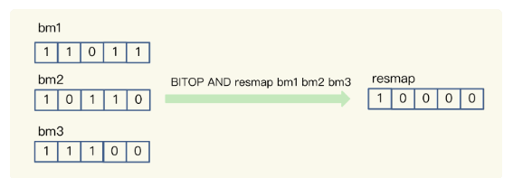

### 极客时间《Redis 核心技术与实战》笔记二

#### redis 数据类型和底层数据结构对应关系 

**String（字符串）、List（列表）、Hash（哈希）、Set（集合）和 Sorted Set（有序集合）**，简单来说，底层数据结构一共有 6 种，分别是简单动态字符串、双向链表、压缩列表、哈希表、跳表和整数数组。它们和数据类型的对应关系如下图所示：


可以看到，String 类型的底层实现只有一种数据结构，也就是简单动态字符串。而 List、Hash、Set 和 Sorted Set 这四种数据类型，都有两种底层实现结构。通常情况下，我们会把这四种类型称为集合类型，它们的特点是一个键对应了一个集合的数据。


#### 哨兵选择 Leader


#### 12|有一亿个keys要统计，应该用哪种集合？

##### **聚合统计**

场景：在移动应用中，需要统计每天的新增用户数和第二天的留存用户数。

方案：要完成这个统计任务，我们可以用一个集合记录所有登录过 App 的用户 ID，同时，用另一个集合记录每一天登录过 App 的用户 ID。

**Set** 的差集、并集和交集的计算复杂度较高，在数据量较大的情况下，如果直接执行这些计算，会导致 Redis 实例阻塞。所以，我给你分享一个小建议：**你可以从主从集群中选择一个从库，让它专门负责聚合计算，或者是把数据读取到客户端，在客户端来完成聚合统计**。

##### **排序统计**

场景：在电商网站的商品评论中，需要统计评论列表中的最新评论；

在 Redis 常用的 4 个集合类型中（List、Hash、Set、Sorted Set），List 和 Sorted Set 就属于有序集合。

最新评论列表包含了所有评论中的最新留言，这就要求集合类型能对元素保序，也就是说，集合中的元素可以按序排列，这种对元素保序的集合类型叫作有序集合。

**List 是按照元素进入 List 的顺序进行排序的，而 Sorted Set 可以根据元素的权重来排序，我们可以自己来决定每个元素的权重值**。

**使用 List 会有问题**，List 是通过元素在 List 中的位置来排序的，当有一个新元素插入时，原先的元素在 List 中的位置都后移了一位，比如说原来在第 1 位的元素现在排在了第 2 位。所以，对比新元素插入前后，List 相同位置上的元素就会发生变化，用 LRANGE 读取时，就会读到旧元素。

和 List 相比，**Sorted Set** 就不存在这个问题，因为它是根据元素的实际权重来排序和获取数据的。

我们可以按评论时间的先后给每条评论设置一个权重值，然后再把评论保存到 Sorted Set 中。Sorted Set 的 ZRANGEBYSCORE 命令就可以按权重排序后返回元素。这样的话，即使集合中的元素频繁更新，Sorted Set 也能通过 ZRANGEBYSCORE 命令准确地获取到按序排列的数据。

假设越新的评论权重越大，目前最新评论的权重是 N，我们执行下面的命令时，就可以获得最新的 10 条评论。

`ZRANGEBYSCORE comments N-9 N`

##### 二值状态统计

场景：在签到打卡中，需要统计一个月内连续打卡的用户数；

这里的二值状态就是指集合元素的取值就只有 0 和 1 两种。在签到打卡的场景中，我们只用记录签到（1）或未签到（0），所以它就是非常典型的二值状态。

在签到统计时，每个用户一天的签到用 1 个 bit 位就能表示，一个月（假设是 31 天）的签到情况用 31 个 bit 位就可以，而一年的签到也只需要用 365 个 bit 位，根本不用太复杂的集合类型。这个时候，我们就可以选择 **Bitmap**。这是 Redis 提供的扩展数据类型。

假设我们要统计 ID 3000 的用户在 2020 年 8 月份的签到情况，就可以按照下面的步骤进行操作。

第一步，执行下面的命令，记录该用户 8 月 3 号已签到. `SETBIT uid:sign:3000:202008 2 1 `

第二步，检查该用户 8 月 3 日是否签到,`GETBIT uid:sign:3000:202008 2 `

第三步，统计该用户在 8 月份的签到次数, `BITCOUNT uid:sign:3000:202008`

如果记录了 1 亿个用户 10 天的签到情况，你有办法统计出这 10 天连续签到的用户总数吗？

Bitmap 支持用 BITOP 命令对多个 Bitmap 按位做“与”“或”“异或”的操作，操作的结果会保存到一个新的 Bitmap 中。我以按位“与”操作为例来具体解释一下。从下图中，可以看到，三个 Bitmap bm1、bm2 和 bm3，对应 bit 位做“与”操作，结果保存到了一个新的 Bitmap 中（示例中，这个结果 Bitmap 的 key 被设为“resmap”）。



在统计 1 亿个用户连续 10 天的签到情况时，你可以把每天的日期作为 key，每个 key 对应一个 1 亿位的 Bitmap，每一个 bit 对应一个用户当天的签到情况。

接下来，我们对 10 个 Bitmap 做“与”操作，得到的结果也是一个 Bitmap。在这个 Bitmap 中，只有 10 天都签到的用户对应的 bit 位上的值才会是 1。最后，我们可以用 BITCOUNT 统计下 Bitmap 中的 1 的个数，这就是连续签到 10 天的用户总数。

##### 基数统计

场景：在网页访问记录中，需要统计独立访客（Unique Visitor，UV）量。

基数统计就是指统计一个集合中不重复的元素个数。对应到我们刚才介绍的场景中，就是统计网页的 UV。

**在 Redis 的集合类型中，Set 类型默认支持去重，所以看到有去重需求时，我们可能第一时间就会想到用 Set 类型**。

我们来结合一个例子看一看用 Set 的情况。有一个用户 user1 访问 page1 时，你把这个信息加到 Set 中：`SADD page1:uv user1` 

对于一个搞大促的电商网站而言，这样的页面可能有成千上万个，**如果每个页面都用这样的一个 Set，就会消耗很大的内存空间**。

但是，和 Set 类型相似，当页面很多时，Hash 类型也会消耗很大的内存空间。那么，有什么办法既能完成统计，还能节省内存吗？

**HyperLogLog 是一种用于统计基数的数据集合类型，它的最大优势就在于，当集合元素数量非常多时，它计算基数所需的空间总是固定的，而且还很小**。

在 Redis 中，每个 HyperLogLog 只需要花费 12 KB 内存，就可以计算接近 2^64 个元素的基数。

在统计 UV 时，你可以用 PFADD 命令（用于向 HyperLogLog 中添加新元素）把访问页面的每个用户都添加到 HyperLogLog 中。

`PFADD page1:uv user1 user2 user3 user4 user5`

接下来，就可以用 PFCOUNT 命令直接获得 page1 的 UV 值了，这个命令的作用就是返回 HyperLogLog 的统计结果。

`PFCOUNT page1:uv`

不过，有一点需要你注意一下，**HyperLogLog 的统计规则是基于概率完成的，所以它给出的统计结果是有一定误差的，标准误算率是 0.81%**。这也就意味着，你使用 HyperLogLog 统计的 UV 是 100 万，但实际的 UV 可能是 101 万。虽然误差率不算大，但是，如果你需要精确统计结果的话，最好还是继续用 Set 或 Hash 类型。

##### 总结


#### 14|如何在Redis中保存时间序列数据？

我们现在做互联网产品的时候，都有这么一个需求：记录用户在网站或者 App 上的点击行为数据，来分析用户行为。这里的数据一般包括用户 ID、行为类型（例如浏览、登录、下单等）、行为发生的时间戳：

`UserID, Type, TimeStamp`

这些与发生时间相关的一组数据，就是时间序列数据。这些数据的特点是没有严格的关系模型，记录的信息可以表示成键和值的关系（例如，一个设备 ID 对应一条记录），所以，并不需要专门用关系型数据库（例如 MySQL）来保存。而 Redis 的键值数据模型，正好可以满足这里的数据存取需求。Redis 基于自身数据结构以及扩展模块，提供了两种解决方案。

##### 时间序列数据的读写特点

在实际应用中，时间序列数据通常是持续高并发写入的，例如，需要连续记录数万个设备的实时状态值。同时，时间序列数据的写入主要就是插入新数据，而不是更新一个已存在的数据，也就是说，**一个时间序列数据被记录后通常就不会变了，因为它就代表了一个设备在某个时刻的状态值**（例如，一个设备在某个时刻的温度测量值，一旦记录下来，这个值本身就不会再变了）。

所以，**这种数据的写入特点很简单，就是插入数据快，这就要求我们选择的数据类型，在进行数据插入时，复杂度要低，尽量不要阻塞**。看到这儿，你可能第一时间会想到用 Redis 的 String、Hash 类型来保存，因为它们的插入复杂度都是 O(1)，是个不错的选择。但是，我在第 11 讲中说过，**String 类型在记录小数据时（例如刚才例子中的设备温度值），元数据的内存开销比较大，不太适合保存大量数据**。

那我们再看看，时间序列数据的“读”操作有什么特点。

我们在查询时间序列数据时，既有对单条记录的查询（例如查询某个设备在某一个时刻的运行状态信息，对应的就是这个设备的一条记录），也有对某个时间范围内的数据的查询（例如每天早上 8 点到 10 点的所有设备的状态信息）。

除此之外，还有一些更复杂的查询，比如对某个时间范围内的数据做聚合计算。这里的聚合计算，就是对符合查询条件的所有数据做计算，包括计算均值、最大 / 最小值、求和等。例如，我们要计算某个时间段内的设备压力的最大值，来判断是否有故障发生。

那用一个词概括时间序列数据的“读”，**就是查询模式多**。

弄清楚了时间序列数据的读写特点，接下来我们就看看如何在 Redis 中保存这些数据。我们来分析下：**针对时间序列数据的“写要快”，Redis 的高性能写特性直接就可以满足了；而针对“查询模式多”，也就是要支持单点查询、范围查询和聚合计算，Redis 提供了保存时间序列数据的两种方案，分别可以基于 Hash 和 Sorted Set 实现**，以及基于 **RedisTimeSeries** 模块实现。

##### 基于 Hash 和 Sorted Set 保存时间序列数据

Hash 和 Sorted Set 组合的方式有一个明显的好处：它们是 Redis 内在的数据类型，代码成熟和性能稳定。所以，基于这两个数据类型保存时间序列数据，系统稳定性是可以预期的。

不过，在前面学习的场景中，我们都是使用一个数据类型来存取数据，那么，**为什么保存时间序列数据，要同时使用这两种类型？这是我们要回答的第一个问题**。

关于 Hash 类型，我们都知道，它有一个特点是，可以实现对单键的快速查询。这就满足了时间序列数据的单键查询需求。我们可以把时间戳作为 Hash 集合的 key，把记录的设备状态值作为 Hash 集合的 value。

可以看下用 Hash 集合记录设备的温度值的示意图：


当我们想要查询某个时间点或者是多个时间点上的温度数据时，直接使用 HGET 命令或者 HMGET 命令，就可以分别获得 Hash 集合中的一个 key 和多个 key 的 value 值了。

举个例子。我们用 HGET 命令查询 202008030905 这个时刻的温度值，使用 HMGET 查询 202008030905、202008030907、202008030908 这三个时刻的温度值，如下所示：

```java
HGET device:temperature 202008030905
"25.1"

HMGET device:temperature 202008030905 202008030907 202008030908
1) "25.1"
2) "25.9"
3) "24.9"
```

你看，用 Hash 类型来实现单键的查询很简单。但是，Hash 类型有个短板：**它并不支持对数据进行范围查询**。

虽然时间序列数据是按时间递增顺序插入 Hash 集合中的，但 Hash 类型的底层结构是哈希表，并没有对数据进行有序索引。所以，如果要对 Hash 类型进行范围查询的话，就需要扫描 Hash 集合中的所有数据，再把这些数据取回到客户端进行排序，然后，才能在客户端得到所查询范围内的数据。显然，查询效率很低。

为了能同时支持按时间戳范围的查询，可以用 Sorted Set 来保存时间序列数据，因为它能够根据元素的权重分数来排序。我们可以把时间戳作为 Sorted Set 集合的元素分数，把时间点上记录的数据作为元素本身。

我还是以保存设备温度的时间序列数据为例，进行解释。下图显示了用 Sorted Set 集合保存的结果。


使用 Sorted Set 保存数据后，我们就可以使用 ZRANGEBYSCORE 命令，按照输入的最大时间戳和最小时间戳来查询这个时间范围内的温度值了。如下所示，我们来查询一下在 2020 年 8 月 3 日 9 点 7 分到 9 点 10 分间的所有温度值：

```java

ZRANGEBYSCORE device:temperature 202008030907 202008030910
1) "25.9"
2) "24.9"
3) "25.3"
4) "25.2"
```

现在我们知道了，同时使用 Hash 和 Sorted Set，可以满足单个时间点和一个时间范围内的数据查询需求了，但是我们又会面临一个新的问题，也就是我们要解答的第二个问题：**如何保证写入 Hash 和 Sorted Set 是一个原子性的操作呢？**

那 Redis 是怎么保证原子性操作的呢？这里就涉及到了 Redis 用来实现简单的事务的 MULTI 和 EXEC 命令。当多个命令及其参数本身无误时，MULTI 和 EXEC 命令可以保证执行这些命令时的原子性.

- MULTI 命令：表示一系列原子性操作的开始。收到这个命令后，Redis 就知道，接下来再收到的命令需要放到一个内部队列中，后续一起执行，保证原子性。
- EXEC 命令：表示一系列原子性操作的结束。一旦 Redis 收到了这个命令，就表示所有要保证原子性的命令操作都已经发送完成了。此时，Redis 开始执行刚才放到内部队列中的所有命令操作。

你可以看下下面这张示意图，命令 1 到命令 N 是在 MULTI 命令后、EXEC 命令前发送的，它们会被一起执行，保证原子性。


以保存设备状态信息的需求为例，我们执行下面的代码，把设备在 2020 年 8 月 3 日 9 时 5 分的温度，分别用 HSET 命令和 ZADD 命令写入 Hash 集合和 Sorted Set 集合。

```java

127.0.0.1:6379> MULTI
OK

127.0.0.1:6379> HSET device:temperature 202008030911 26.8
QUEUED

127.0.0.1:6379> ZADD device:temperature 202008030911 26.8
QUEUED

127.0.0.1:6379> EXEC
1) (integer) 1
2) (integer) 1
```

到这里，我们就解决了时间序列数据的单点查询、范围查询问题，并使用 MUTLI 和 EXEC 命令保证了 Redis 能原子性地把数据保存到 Hash 和 Sorted Set 中。接下来，**我们需要继续解决第三个问题：如何对时间序列数据进行聚合计算？**

聚合计算一般被用来周期性地统计时间窗口内的数据汇总状态，在实时监控与预警等场景下会频繁执行。

因为 Sorted Set 只支持范围查询，无法直接进行聚合计算，所以，我们只能先把时间范围内的数据取回到客户端，然后在客户端自行完成聚合计算。这个方法虽然能完成聚合计算，但是会带来一定的潜在风险，也就是**大量数据在 Redis 实例和客户端间频繁传输，这会和其他操作命令竞争网络资源，导致其他操作变慢**。

在我们这个物联网项目中，就需要每 3 分钟统计一下各个设备的温度状态，一旦设备温度超出了设定的阈值，就要进行报警。这是一个典型的聚合计算场景，我们可以来看看这个过程中的数据体量。

假设我们需要每 3 分钟计算一次的所有设备各指标的最大值，每个设备每 15 秒记录一个指标值，1 分钟就会记录 4 个值，3 分钟就会有 12 个值。我们要统计的设备指标数量有 33 个，所以，单个设备每 3 分钟记录的指标数据有将近 400 个（33 * 12 = 396），而设备总数量有 1 万台，这样一来，每 3 分钟就有将近 400 万条（396 * 1 万 = 396 万）数据需要在客户端和 Redis 实例间进行传输。

**为了避免客户端和 Redis 实例间频繁的大量数据传输，我们可以使用 RedisTimeSeries 来保存时间序列数据**。

RedisTimeSeries 支持直接在 Redis 实例上进行聚合计算。还是以刚才每 3 分钟算一次最大值为例。在 Redis 实例上直接聚合计算，那么，对于单个设备的一个指标值来说，每 3 分钟记录的 12 条数据可以聚合计算成一个值，单个设备每 3 分钟也就只有 33 个聚合值需要传输，1 万台设备也只有 33 万条数据。数据量大约是在客户端做聚合计算的十分之一，很显然，可以减少大量数据传输对 Redis 实例网络的性能影响。

所以，**如果我们只需要进行单个时间点查询或是对某个时间范围查询的话，适合使用 Hash 和 Sorted Set 的组合，它们都是 Redis 的内在数据结构，性能好，稳定性高**。但是，**如果我们需要进行大量的聚合计算，同时网络带宽条件不是太好时，Hash 和 Sorted Set 的组合就不太适合了**。此时，**使用 RedisTimeSeries 就更加合适一些**。

##### 基于 RedisTimeSeries 模块保存时间序列数据

**RedisTimeSeries 是 Redis 的一个扩展模块**。**它专门面向时间序列数据提供了数据类型和访问接口，并且支持在 Redis 实例上直接对数据进行按时间范围的聚合计算**。

因为 RedisTimeSeries 不属于 Redis 的内建功能模块，在使用时，我们需要先把它的源码单独编译成动态链接库 redistimeseries.so，再使用 loadmodule 命令进行加载，如下所示：

`loadmodule redistimeseries.so`

当用于时间序列数据存取时，RedisTimeSeries 的操作主要有 5 个：

- 用 TS.CREATE 命令创建时间序列数据集合；
- 用 TS.ADD 命令插入数据；
- 用 TS.GET 命令读取最新数据；
- 用 TS.MGET 命令按标签过滤查询数据集合；
- 用 TS.RANGE 支持聚合计算的范围查询。

###### 1 用 TS.CREATE 命令创建一个时间序列数据集合

在 TS.CREATE 命令中，我们需要设置时间序列数据集合的 key 和数据的过期时间（以毫秒为单位）。此外，我们还可以为数据集合设置标签，来表示数据集合的属性。

例如，我们执行下面的命令，创建一个 key 为 device:temperature、数据有效期为 600s 的时间序列数据集合。也就是说，这个集合中的数据创建了 600s 后，就会被自动删除。最后，我们给这个集合设置了一个标签属性{device_id:1}，表明这个数据集合中记录的是属于设备 ID 号为 1 的数据。

```java

TS.CREATE device:temperature RETENTION 600000 LABELS device_id 1
OK
```

###### 2 用 TS.ADD 命令插入数据，用 TS.GET 命令读取最新数据

我们可以用 TS.ADD 命令往时间序列集合中插入数据，包括时间戳和具体的数值，并使用 TS.GET 命令读取数据集合中的最新一条数据。

例如，我们执行下列 TS.ADD 命令时，就往 device:temperature 集合中插入了一条数据，记录的是设备在 2020 年 8 月 3 日 9 时 5 分的设备温度；再执行 TS.GET 命令时，就会把刚刚插入的最新数据读取出来。

```java

TS.ADD device:temperature 1596416700 25.1
1596416700

TS.GET device:temperature 
25.1
```

###### 3 用 TS.MGET 命令按标签过滤查询数据集合 

在保存多个设备的时间序列数据时，我们通常会把不同设备的数据保存到不同集合中。此时，我们就可以使用 TS.MGET 命令，按照标签查询部分集合中的最新数据。在使用 TS.CREATE 创建数据集合时，我们可以给集合设置标签属性。当我们进行查询时，就可以在查询条件中对集合标签属性进行匹配，最后的查询结果里只返回匹配上的集合中的最新数据。

举个例子。假设我们一共用 4 个集合为 4 个设备保存时间序列数据，设备的 ID 号是 1、2、3、4，我们在创建数据集合时，把 device_id 设置为每个集合的标签。此时，我们就可以使用下列 TS.MGET 命令，以及 FILTER 设置（这个配置项用来设置集合标签的过滤条件），查询 device_id 不等于 2 的所有其他设备的数据集合，并返回各自集合中的最新的一条数据.

```java

TS.MGET FILTER device_id!=2 
1) 1) "device:temperature:1"
   2) (empty list or set)
   3) 1) (integer) 1596417000
      2) "25.3"
2) 1) "device:temperature:3"
   2) (empty list or set)
   3) 1) (integer) 1596417000
      2) "29.5"
3) 1) "device:temperature:4"
   2) (empty list or set)
   3) 1) (integer) 1596417000
      2) "30.1"
```

###### 4 用 TS.RANGE 支持需要聚合计算的范围查询 

最后，在对时间序列数据进行聚合计算时，我们可以使用 TS.RANGE 命令指定要查询的数据的时间范围，同时用 AGGREGATION 参数指定要执行的聚合计算类型。RedisTimeSeries 支持的聚合计算类型很丰富，包括求均值（avg）、求最大 / 最小值（max/min），求和（sum）等。

例如，在执行下列命令时，我们就可以按照每 180s 的时间窗口，对 2020 年 8 月 3 日 9 时 5 分和 2020 年 8 月 3 日 9 时 12 分这段时间内的数据进行均值计算了。

```java

TS.RANGE device:temperature 1596416700 1596417120 AGGREGATION avg 180000
1) 1) (integer) 1596416700
   2) "25.6"
2) 1) (integer) 1596416880
   2) "25.8"
3) 1) (integer) 1596417060
   2) "26.1"
```

与使用 Hash 和 Sorted Set 来保存时间序列数据相比，RedisTimeSeries 是专门为时间序列数据访问设计的扩展模块，能支持在 Redis 实例上直接进行聚合计算，以及按标签属性过滤查询数据集合，当我们需要频繁进行聚合计算，以及从大量集合中筛选出特定设备或用户的数据集合时，RedisTimeSeries 就可以发挥优势了。

##### 小结

在这节课，我们一起学习了如何用 Redis 保存时间序列数据。时间序列数据的写入特点是要能快速写入，而查询的特点有三个：

- 点查询，根据一个时间戳，查询相应时间的数据；
- 范围查询，查询起始和截止时间戳范围内的数据；
- 聚合计算，针对起始和截止时间戳范围内的所有数据进行计算，例如求最大 / 最小值，求均值等。

关于快速写入的要求，Redis 的高性能写特性足以应对了；而针对多样化的查询需求，Redis 提供了两种方案。

第一种：**组合使用 Redis 内置的 Hash 和 Sorted Set 类型，把数据同时保存在 Hash 集合和 Sorted Set 集合中**。这种方案既可以利用 Hash 类型实现对单键的快速查询，还能利用 Sorted Set 实现对范围查询的高效支持，一下子满足了时间序列数据的两大查询需求

第一种方案也有两个不足：一个是，**在执行聚合计算时，我们需要把数据读取到客户端再进行聚合，当有大量数据要聚合时，数据传输开销大**；另一个是，**所有的数据会在两个数据类型中各保存一份，内存开销不小**。不过，我们可以通过设置适当的数据过期时间，释放内存，减小内存压力。

我们学习的第二种实现方案是使用 RedisTimeSeries 模块。这是专门为存取时间序列数据而设计的扩展模块。和第一种方案相比，**RedisTimeSeries 能支持直接在 Redis 实例上进行多种数据聚合计算，避免了大量数据在实例和客户端间传输**。不过，**RedisTimeSeries 的底层数据结构使用了链表，它的范围查询的复杂度是 O(N) 级别的，同时，它的 TS.GET 查询只能返回最新的数据，没有办法像第一种方案的 Hash 类型一样，可以返回任一时间点的数据**。

所以，组合使用 Hash 和 Sorted Set，或者使用 RedisTimeSeries，在支持时间序列数据存取上各有优劣势。我给你的建议是：

- 如果你的部署环境中网络带宽高、Redis 实例内存大，可以优先考虑第一种方案；
- 如果你的部署环境中网络、内存资源有限，而且数据量大，聚合计算频繁，需要按数据集合属性查询，可以优先考虑第二种方案。

#### 15 | 消息队列的考验：Redis有哪些解决方案？

Redis 适合做消息队列吗？

其实，这个问题的背后，隐含着两方面的核心问题：

- **消息队列的消息存取需求是什么**？
- **Redis 如何实现消息队列的需求**？

##### 消息队列的消息存取需求 

在分布式系统中，当两个组件要基于消息队列进行通信时，一个组件会把要处理的数据以消息的形式传递给消息队列，然后，这个组件就可以继续执行其他操作了；远端的另一个组件从消息队列中把消息读取出来，再在本地进行处理。

**消息队列在存取消息时，必须要满足三个需求，分别是消息保序、处理重复的消息和保证消息可靠性**。

###### 需求一：消息保存

虽然消费者是异步处理消息，但是，消费者仍然需要按照生产者发送消息的顺序来处理消息，避免后发送的消息被先处理了。对于要求消息保序的场景来说，一旦出现这种消息被乱序处理的情况，就可能会导致业务逻辑被错误执行，从而给业务方造成损失。

我们来看一个更新商品库存的场景。假设生产者负责接收库存更新请求，消费者负责实际更新库存，现有库存量是 10。生产者先后发送了消息 1 和消息 2，消息 1 要把商品 X 的库存记录更新为 5，消息 2 是把商品 X 库存更新为 3。如果消息 1 和 2 在消息队列中无法保序，出现消息 2 早于消息 1 被处理的情况，那么，很显然，库存更新就出错了。这是业务应用无法接受的。

但是，我们还需要考虑这样一种情况：假如消费者收到了这样三条消息：消息 1 是扣减库存量 5，消息 2 是读取库存量，消息 3 是扣减库存量 2，此时，如果消费者先处理了消息 3（把库存量扣减 2），那么库存量就变成了 8。然后，消费者处理了消息 2，读取当前的库存量是 8，这就会出现库存量查询不正确的情况。从业务应用层面看，消息 1、2、3 应该是顺序执行的，所以，消息 2 查询到的应该是扣减了 5 以后的库存量，而不是扣减了 2 以后的库存量。所以，用库存扣除值作为消息的方案，在消息中同时包含读写操作的场景下，会带来数据读取错误的问题。而且，这个方案还会面临一个问题，那就是**重复消息处理**。

###### 需求二：重复消息处理

**消费者从消息队列读取消息时，有时会因为网络堵塞而出现消息重传的情况**。此时，消费者可能会收到多条重复的消息。对于重复的消息，消费者如果多次处理的话，就可能造成一个业务逻辑被多次执行，如果业务逻辑正好是要修改数据，那就会出现数据被多次修改的问题了。

还是以库存更新为例，假设消费者收到了一次消息 1，要扣减库存量 5，然后又收到了一次消息 1，那么，如果消费者无法识别这两条消息实际是一条相同消息的话，就会执行两次扣减库存量 5 的操作，此时，库存量就不对了。这当然也是无法接受的。

###### 需求三：消息可靠性保证

另外，消费者在处理消息的时候，还可能出现因为故障或宕机导致消息没有处理完成的情况。此时，消息队列需要能提供消息可靠性的保证，也就是说，当消费者重启后，可以重新读取消息再次进行处理，否则，就会出现消息漏处理的问题了。

**Redis 的 List 和 Streams 两种数据类型，就可以满足消息队列的这三个需求**。我们先来了解下基于 List 的消息队列实现方法。

##### 基于 List 的消息队列解决方案

**List 本身就是按先进先出的顺序对数据进行存取的，所以，如果使用 List 作为消息队列保存消息的话，就已经能满足消息保序的需求了**。

具体来说，生产者可以使用 LPUSH 命令把要发送的消息依次写入 List，而消费者则可以使用 RPOP 命令，从 List 的另一端按照消息的写入顺序，依次读取消息并进行处理。

如下图所示，生产者先用 LPUSH 写入了两条库存消息，分别是 5 和 3，表示要把库存更新为 5 和 3；消费者则用 RPOP 把两条消息依次读出，然后进行相应的处理。


不过，在消费者读取数据时，有一个潜在的性能风险点。

在生产者往 List 中写入数据时，List 并不会主动地通知消费者有新消息写入，如果消费者想要及时处理消息，就需要在程序中不停地调用 RPOP 命令（比如使用一个 while(1) 循环）。如果有新消息写入，RPOP 命令就会返回结果，否则，RPOP 命令返回空值，再继续循环。

所以，即使没有新消息写入 List，消费者也要不停地调用 RPOP 命令，这就会导致消费者程序的 CPU 一直消耗在执行 RPOP 命令上，带来不必要的性能损失。

为了解决这个问题，**Redis 提供了 BRPOP 命令**。**BRPOP 命令也称为阻塞式读取，客户端在没有读到队列数据时，自动阻塞，直到有新的数据写入队列，再开始读取新数据**。和消费者程序自己不停地调用 RPOP 命令相比，**这种方式能节省 CPU 开销**。

消息保序的问题解决了，接下来，我们还需要考虑解决重复消息处理的问题，这里其实有一个要求：**消费者程序本身能对重复消息进行判断**。

**一方面，消息队列要能给每一个消息提供全局唯一的 ID 号；另一方面，消费者程序要把已经处理过的消息的 ID 号记录下来**。

###### 幂等性

当收到一条消息后，消费者程序就可以对比收到的消息 ID 和记录的已处理过的消息 ID，来判断当前收到的消息有没有经过处理。如果已经处理过，那么，消费者程序就不再进行处理了。这种处理特性也称为幂等性，**幂等性就是指，对于同一条消息，消费者收到一次的处理结果和收到多次的处理结果是一致的**。

不过，List 本身是不会为每个消息生成 ID 号的，所以，**消息的全局唯一 ID 号就需要生产者程序在发送消息前自行生成**。生成之后，我们在用 LPUSH 命令把消息插入 List 时，需要在消息中包含这个全局唯一 ID。

例如，我们执行以下命令，就把一条全局 ID 为 101030001、库存量为 5 的消息插入了消息队列：

```java

LPUSH mq "101030001:stock:5"
(integer) 1
```

最后，我们再来看下，**List 类型是如何保证消息可靠性的**。

当消费者程序从 List 中读取一条消息后，List 就不会再留存这条消息了。所以，如果消费者程序在处理消息的过程出现了故障或宕机，就会导致消息没有处理完成，那么，消费者程序再次启动后，就没法再次从 List 中读取消息了。

**为了留存消息，List 类型提供了 BRPOPLPUSH 命令，这个命令的作用是让消费者程序从一个 List 中读取消息，同时，Redis 会把这个消息再插入到另一个 List（可以叫作备份 List）留存**。这样一来，如果消费者程序读了消息但没能正常处理，等它重启后，就可以从备份 List 中重新读取消息并进行处理了。

我画了一张示意图，展示了使用 BRPOPLPUSH 命令留存消息，以及消费者再次读取消息的过程，你可以看下。


生产者先用 LPUSH 把消息“5”“3”插入到消息队列 mq 中。消费者程序使用 BRPOPLPUSH 命令读取消息“5”，同时，消息“5”还会被 Redis 插入到 mqback 队列中。如果消费者程序处理消息“5”时宕机了，等它重启后，可以从 mqback 中再次读取消息“5”，继续处理。

好了，到这里，你可以看到，基于 List 类型，我们可以满足分布式组件对消息队列的三大需求。但是，在用 List 做消息队列时，我们还可能遇到过一个问题：**生产者消息发送很快，而消费者处理消息的速度比较慢，这就导致 List 中的消息越积越多，给 Redis 的内存带来很大压力**。

这个时候，我们希望**启动多个消费者程序组成一个消费组，一起分担处理 List 中的消息**。但是，**List 类型并不支持消费组的实现**。那么，还有没有更合适的解决方案呢？这就要说到 Redis 从 5.0 版本开始提供的 **Streams** 数据类型了。

和 List 相比，Streams 同样能够满足消息队列的三大需求。而且，**它还支持消费组形式的消息读取**。接下来，我们就来了解下 Streams 的使用方法。

##### 基于 Streams 的消息队列解决方案

**Streams 是 Redis 专门为消息队列设计的数据类型**，它提供了丰富的消息队列操作命令。

- XADD：插入消息，保证有序，可以自动生成全局唯一 ID；
- XREAD：用于读取消息，可以按 ID 读取数据；
- XREADGROUP：按消费组形式读取消息；
- XPENDING 和 XACK：XPENDING 命令可以用来查询每个消费组内所有消费者已读取但尚未确认的消息，而 XACK 命令用于向消息队列确认消息处理已完成。

XADD 命令可以往消息队列中插入新消息，消息的格式是键 - 值对形式。对于插入的每一条消息，Streams 可以自动为其生成一个全局唯一的 ID。

比如说，我们执行下面的命令，就可以**往名称为 mqstream 的消息队列中插入一条消息，消息的键是 repo，值是 5**。其中，**消息队列名称后面的 \*，表示让 Redis 为插入的数据自动生成一个全局唯一的 ID**，例如“1599203861727-0”。当然，**我们也可以不用\*，直接在消息队列名称后自行设定一个 ID 号，只要保证这个 ID 号是全局唯一的就行**。不过，相比自行设定 ID 号，**使用*会更加方便高效**。

```java
XADD mqstream * repo 5
"1599203861727-0"
```


可以看到，消息的全局唯一 ID 由两部分组成，第一部分“1599203861727”是数据插入时，以毫秒为单位计算的当前服务器时间，第二部分表示插入消息在当前毫秒内的消息序号，这是从 0 开始编号的。例如，“1599203861727-0”就表示在“1599203861727”毫秒内的第 1 条消息。

**当消费者需要读取消息时，可以直接使用 XREAD 命令从消息队列中读取**。XREAD 在读取消息时，可以指定一个消息 ID，并从这个消息 ID 的下一条消息开始进行读取。

例如，我们可以执行下面的命令，从 ID 号为 1599203861727-0 的消息开始，读取后续的所有消息（示例中一共 3 条）。

```java

XREAD BLOCK 100 STREAMS  mqstream 1599203861727-0
1) 1) "mqstream"
   2) 1) 1) "1599274912765-0"
         2) 1) "repo"
            2) "3"
      2) 1) "1599274925823-0"
         2) 1) "repo"
            2) "2"
      3) 1) "1599274927910-0"
         2) 1) "repo"
            2) "1"
```


另外，消费者也可以在调用 XRAED 时设定 block 配置项，实现类似于 BRPOP 的阻塞读取操作。当消息队列中没有消息时，一旦设置了 block 配置项，XREAD 就会阻塞，阻塞的时长可以在 block 配置项进行设置。

举个例子，我们来看一下下面的命令，其中，命令最后的“$”符号表示读取最新的消息，同时，我们设置了 block 10000 的配置项，10000 的单位是毫秒，表明 XREAD 在读取最新消息时，如果没有消息到来，XREAD 将阻塞 10000 毫秒（即 10 秒），然后再返回。下面命令中的 XREAD 执行后，消息队列 mqstream 中一直没有消息，所以，XREAD 在 10 秒后返回空值（nil）.

```java
XREAD block 10000 streams mqstream $
(nil)
(10.00s)
```

刚刚讲到的这些操作是 List 也支持的，接下来，我们再来学习下 Streams 特有的功能。

Streams 本身可以使用 XGROUP 创建消费组，创建消费组之后，Streams 可以使用 XREADGROUP 命令让消费组内的消费者读取消息。

例如，我们执行下面的命令，创建一个名为 group1 的消费组，这个消费组消费的消息队列是 mqstream。

```java
XGROUP create mqstream group1 0
OK
```

然后，我们再执行一段命令，让 group1 消费组里的消费者 consumer1 从 mqstream 中读取所有消息，其中，**命令最后的参数“>”，表示从第一条尚未被消费的消息开始读取**。因为在 consumer1 读取消息前，group1 中没有其他消费者读取过消息，所以，consumer1 就得到 mqstream 消息队列中的所有消息了（一共 4 条）。

```java
XREADGROUP group group1 consumer1 streams mqstream >
1) 1) "mqstream"
   2) 1) 1) "1599203861727-0"
         2) 1) "repo"
            2) "5"
      2) 1) "1599274912765-0"
         2) 1) "repo"
            2) "3"
      3) 1) "1599274925823-0"
         2) 1) "repo"
            2) "2"
      4) 1) "1599274927910-0"
         2) 1) "repo"
            2) "1"
```


需要注意的是，消息队列中的消息一旦被消费组里的一个消费者读取了，就不能再被该消费组内的其他消费者读取了。比如说，我们执行完刚才的 XREADGROUP 命令后，再执行下面的命令，让 group1 内的 consumer2 读取消息时，consumer2 读到的就是空值，因为消息已经被 consumer1 读取完了，如下所示：

```java
XREADGROUP group group1 consumer2  streams mqstream 0
1) 1) "mqstream"
   2) (empty list or set)
```


使用消费组的目的是让组内的多个消费者共同分担读取消息，所以，我们通常会让每个消费者读取部分消息，从而实现消息读取负载在多个消费者间是均衡分布的。例如，我们执行下列命令，让 group2 中的 consumer1、2、3 各自读取一条消息。这里需要在创建 group2才行。

```java
XREADGROUP group group2 consumer1 count 1 streams mqstream >
1) 1) "mqstream"
   2) 1) 1) "1599203861727-0"
         2) 1) "repo"
            2) "5"

XREADGROUP group group2 consumer2 count 1 streams mqstream >
1) 1) "mqstream"
   2) 1) 1) "1599274912765-0"
         2) 1) "repo"
            2) "3"

XREADGROUP group group2 consumer3 count 1 streams mqstream >
1) 1) "mqstream"
   2) 1) 1) "1599274925823-0"
         2) 1) "repo"
            2) "2"
```

为了保证消费者在发生故障或宕机再次重启后，仍然可以读取未处理完的消息，Streams 会自动使用内部队列（也称为 PENDING List）留存消费组里每个消费者读取的消息，直到消费者使用 XACK 命令通知 Streams“消息已经处理完成”。如果消费者没有成功处理消息，它就不会给 Streams 发送 XACK 命令，消息仍然会留存。此时，消费者可以在重启后，用 XPENDING 命令查看已读取、但尚未确认处理完成的消息。

例如，我们来查看一下 group2 中各个消费者已读取、但尚未确认的消息个数。其中，XPENDING 返回结果的第二、三行分别表示 group2 中所有消费者读取的消息最小 ID 和最大 ID。

```java
XPENDING mqstream group2
1) (integer) 3
2) "1599203861727-0"
3) "1599274925823-0"
4) 1) 1) "consumer1"
      2) "1"
   2) 1) "consumer2"
      2) "1"
   3) 1) "consumer3"
      2) "1"
```

如果我们还需要进一步查看某个消费者具体读取了哪些数据，可以执行下面的命令：

```java

XPENDING mqstream group2 - + 10 consumer2
1) 1) "1599274912765-0"
   2) "consumer2"
   3) (integer) 513336
   4) (integer) 1
```

可以看到，consumer2 已读取的消息的 ID 是 1599274912765-0。一旦消息 1599274912765-0 被 consumer2 处理了，consumer2 就可以使用 XACK 命令通知 Streams，然后这条消息就会被删除。当我们再使用 XPENDING 命令查看时，就可以看到，consumer2 已经没有已读取、但尚未确认处理的消息了。

```java
XACK mqstream group2 1599274912765-0
(integer) 1
XPENDING mqstream group2 - + 10 consumer2
(empty list or set)
```


现在，我们就知道了用 Streams 实现消息队列的方法，我还想再强调下，Streams 是 Redis 5.0 专门针对消息队列场景设计的数据类型，**如果你的 Redis 是 5.0 及 5.0 以后的版本，就可以考虑把 Streams 用作消息队列了**。

可以通过工具看到我本地最后添加的数据如下：我们插入的键值对是 repo : 5 `XADD mqstream * repo 5` ，**往名称为 mqstream 的消息队列中插入一条消息，消息的键是 repo，值是 5**。


##### 小结 

这节课，我们学习了分布式系统组件使用消息队列时的三大需求：消息保序、重复消息处理和消息可靠性保证，这三大需求可以进一步转换为对消息队列的三大要求：消息数据有序存取，消息数据具有全局唯一编号，以及消息数据在消费完成后被删除。


其实，关于 Redis 是否适合做消息队列，业界一直是有争论的。很多人认为，要使用消息队列，就应该采用 Kafka、RabbitMQ 这些专门面向消息队列场景的软件，而 Redis 更加适合做缓存。

所以，关于是否用 Redis 做消息队列的问题，不能一概而论，我们需要考虑业务层面的数据体量，以及对性能、可靠性、可扩展性的需求。**如果分布式系统中的组件消息通信量不大，那么，Redis 只需要使用有限的内存空间就能满足消息存储的需求，而且，Redis 的高性能特性能支持快速的消息读写，不失为消息队列的一个好的解决方案**。

