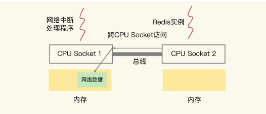

### 极客时间《Redis 核心技术与实战》笔记三-性能和内存 

**16-18讲**

---

### 16 | 异步机制：如何避免单线程模型的阻塞？

#### 影响 redis 性能的因素

影响 Redis 性能的 5 大方面的潜在因素，分别是：

###### **Redis 内部的阻塞式操作**；

###### **CPU 核和 NUMA 架构的影响**；

###### **Redis 关键系统配置**；

###### **Redis 内存碎片**；

###### **Redis 缓冲区**。

在第 3 讲中，我们学习过，Redis 的网络 IO 和键值对读写是由主线程完成的。那么，如果在主线程上执行的操作消耗的时间太长，就会引起主线程阻塞。但是，Redis 既有服务客户端请求的键值对增删改查操作，也有保证可靠性的持久化操作，还有进行主从复制时的数据同步操作，等等。操作这么多，究竟哪些会引起阻塞呢？

#### Redis 实例有哪些阻塞点？

Redis 实例在运行时，要和许多对象进行交互，这些不同的交互就会涉及不同的操作，下面我们来看看和 Redis 实例交互的对象，以及交互时会发生的操作。

- **客户端**：网络 IO，键值对增删改查操作，数据库操作；
- **磁盘**：生成 RDB 快照，记录 AOF 日志，AOF 日志重写；
- **主从节点**：主库生成、传输 RDB 文件，从库接收 RDB 文件、清空数据库、加载 RDB 文件；
- **切片集群实例**：向其他实例传输哈希槽信息，数据迁移。


接下来，我们来逐个分析下在这些交互对象中，有哪些操作会引起阻塞。

##### 1 和客户端交互时的阻塞点

网络 IO 有时候会比较慢，但是 Redis 使用了 IO 多路复用机制，避免了主线程一直处在等待网络连接或请求到来的状态，所以，网络 IO 不是导致 Redis 阻塞的因素。

**键值对的增删改查操作是 Redis 和客户端交互的主要部分，也是 Redis 主线程执行的主要任务**。所以，**复杂度高的增删改查操作肯定会阻塞 Redis**。

那么，怎么判断操作复杂度是不是高呢？这里有一个最基本的标准，就是**看操作的复杂度是否为 O(N)**。

###### 集合全量查询和聚合操作

**Redis 中涉及集合的操作复杂度通常为 O(N)**，我们要在使用时重视起来。例如**集合元素全量查询操作 HGETALL、SMEMBERS，以及集合的聚合统计操作**，例如求交、并和差集。这些操作可以作为 **Redis 的第一个阻塞点：集合全量查询和聚合操作**。

除此之外，**集合自身的删除操作同样也有潜在的阻塞风险**。你可能会认为，删除操作很简单，直接把数据删除就好了，为什么还会阻塞主线程呢？

其实，**删除操作的本质是要释放键值对占用的内存空间**。你可不要小瞧内存的释放过程。**释放内存只是第一步，为了更加高效地管理内存空间，在应用程序释放内存时，操作系统需要把释放掉的内存块插入一个空闲内存块的链表，以便后续进行管理和再分配**。这个过程本身需要一定时间，而且会阻塞当前释放内存的应用程序，所以，如果一下子释放了大量内存，空闲内存块链表操作时间就会增加，相应地就会造成 Redis 主线程的阻塞。

###### bigkey 删除

那么，什么时候会释放大量内存呢？**其实就是在删除大量键值对数据的时候，最典型的就是删除包含了大量元素的集合，也称为 bigkey 删除**。为了让你对 bigkey 的删除性能有一个直观的印象，我测试了不同元素数量的集合在进行删除操作时所消耗的时间，如下表所示：


从这张表里，我们可以得出三个结论:

1. 当元素数量从 10 万增加到 100 万时，4 大集合类型的删除时间的增长幅度从 5 倍上升到了近 20 倍。
2. 集合元素越大，删除所花费的时间就越长；
3. 当删除有 100 万个元素的集合时，最大的删除时间绝对值已经达到了 1.98s（Hash 类型）。Redis 的响应时间一般在微秒级别，所以，一个操作达到了近 2s，不可避免地会阻塞主线程。

经过刚刚的分析，很显然，**bigkey 删除操作就是 Redis 的第二个阻塞点**。删除操作对 Redis 实例性能的负面影响很大，而且在实际业务开发时容易被忽略，所以一定要重视它。

###### 清空数据库

既然频繁删除键值对都是潜在的阻塞点了，那么，在 Redis 的数据库级别操作中，清空数据库（例如 **FLUSHDB** 和 **FLUSHALL** 操作）必然也是一个潜在的阻塞风险，因为它涉及到删除和释放所有的键值对。所以，这就是 **Redis 的第三个阻塞点：清空数据库**。

##### 2 和磁盘交互时的阻塞点

我之所以把 Redis 与磁盘的交互单独列为一类，主要是**因为磁盘 IO 一般都是比较费时费力的**，需要重点关注。

幸运的是，Redis 开发者早已认识到磁盘 IO 会带来阻塞，所以就把 **Redis 进一步设计为采用子进程的方式生成 RDB 快照文件，以及执行 AOF 日志重写操作**。这样一来，这两个操作由子进程负责执行，慢速的磁盘 IO 就不会阻塞主线程了。

###### AOF 日志同步写

但是，Redis 直接记录 AOF 日志时，会根据不同的写回策略对数据做落盘保存。一个同步写磁盘的操作的耗时大约是 1～2ms，如果有大量的写操作需要记录在 AOF 日志中，并同步写回的话，就会阻塞主线程了。这就得到了 **Redis 的第四个阻塞点**了：**AOF 日志同步写**。

##### 3 主从节点交互时的阻塞点

在主从集群中，主库需要生成 RDB 文件，并传输给从库。主库在复制的过程中，创建和传输 RDB 文件都是由子进程来完成的，不会阻塞主线程。但是，**对于从库来说，它在接收了 RDB 文件后，需要使用 FLUSHDB 命令清空当前数据库**，这就正好撞上了刚才我们分析的**第三个阻塞点**。

###### 加载 RDB 文件

此外，从库在清空当前数据库后，还需要把 RDB 文件加载到内存，这个过程的快慢和 RDB 文件的大小密切相关，RDB 文件越大，加载过程越慢，所以，**加载 RDB 文件就成为了 Redis 的第五个阻塞点**。

##### 4 切片集群实例交互时的阻塞点

最后，当我们部署 Redis 切片集群时，每个 Redis 实例上分配的哈希槽信息需要在不同实例间进行传递，同时，当需要进行负载均衡或者有实例增删时，数据会在不同的实例间进行迁移。不过，哈希槽的信息量不大，而数据迁移是渐进式执行的，所以，一般来说，这两类操作对 Redis 主线程的阻塞风险不大。

不过，**如果你使用了 Redis Cluster 方案，而且同时正好迁移的是 bigkey 的话，就会造成主线程的阻塞，因为 Redis Cluster 使用了同步迁移**。

**当没有 bigkey 时，切片集群的各实例在进行交互时不会阻塞主线程**。

我们来总结下刚刚找到的五个阻塞点：

- **集合全量查询和聚合操作；**
- **bigkey 删除；**
- **清空数据库；**
- **AOF 日志同步写；**
- **从库加载 RDB 文件**。

如果在主线程中执行这些操作，必然会导致主线程长时间无法服务其他请求。为了避免阻塞式操作，Redis 提供了异步线程机制。所谓的异步线程机制，就是指，Redis 会启动一些子线程，然后把一些任务交给这些子线程，让它们在后台完成，而不再由主线程来执行这些任务。使用异步线程机制执行操作，可以避免阻塞主线程。

这五大阻塞式操作都可以被异步执行吗？

#### 哪些阻塞点可以异步执行？

在分析阻塞式操作的异步执行的可行性之前，我们先来了解下异步执行对操作的要求。如果一个操作能被异步执行，就意味着，它并不是 Redis 主线程的关键路径上的操作。我再解释下**关键路径上的操作是啥**。这就是说，**客户端把请求发送给 Redis 后，等着 Redis 返回数据结果的操作**。


主线程接收到操作 1 后，因为**操作 1 并不用给客户端返回具体的数据，所以，主线程可以把它交给后台子线程来完成**，同时只要给客户端返回一个“OK”结果就行。在子线程执行操作 1 的时候，客户端又向 Redis 实例发送了操作 2，而此时，**客户端是需要使用操作 2 返回的数据结果的，如果操作 2 不返回结果，那么，客户端将一直处于等待状态**。

在这个例子中，操作 1 就不算关键路径上的操作，因为它不用给客户端返回具体数据，所以可以由后台子线程异步执行。而操作 2 需要把结果返回给客户端，它就是关键路径上的操作，所以主线程必须立即把这个操作执行完。

对于 Redis 来说，**读操作是典型的关键路径操作**，**因为客户端发送了读操作之后，就会等待读取的数据返回，以便进行后续的数据处理**。而 **Redis 的第一个阻塞点“集合全量查询和聚合操作”都涉及到了读操作，所以，它们是不能进行异步操作了**。

我们再来看看删除操作。**删除操作并不需要给客户端返回具体的数据结果，所以不算是关键路径操作**。而我们**刚才总结的第二个阻塞点“bigkey 删除”，和第三个阻塞点“清空数据库”，都是对数据做删除，并不在关键路径上**。因此，**我们可以使用后台子线程来异步执行删除操作**。

对于第四个阻塞点“AOF 日志同步写”来说，**为了保证数据可靠性，Redis 实例需要保证 AOF 日志中的操作记录已经落盘，这个操作虽然需要实例等待，但它并不会返回具体的数据结果给实例**。所以，**我们也可以启动一个子线程来执行 AOF 日志的同步写，而不用让主线程等待 AOF 日志的写完成**。

最后，我们再来看下“**从库加载 RDB 文件**”这个阻塞点。从库要想对客户端提供数据存取服务，就必须把 RDB 文件加载完成。所以，**这个操作也属于关键路径上的操作，我们必须让从库的主线程来执行**。

对于 Redis 的五大阻塞点来说，**除了“集合全量查询和聚合操作”和“从库加载 RDB 文件”，其他三个阻塞点涉及的操作都不在关键路径上**，所以，**我们可以使用 Redis 的异步子线程机制来实现 bigkey 删除，清空数据库，以及 AOF 日志同步写**。

那么，Redis 实现的异步子线程机制具体是怎样执行的呢？

#### 异步的子线程机制

Redis 主线程启动后，会使用操作系统提供的 pthread_create 函数创建 3 个子线程，分别由它们负责 **AOF 日志写操作、键值对删除以及文件关闭的异步执行**。

主线程通过一个链表形式的任务队列和子线程进行交互。当收到键值对删除和清空数据库的操作时，主线程会把这个操作封装成一个任务，放入到任务队列中，然后给客户端返回一个完成信息，表明删除已经完成。

但实际上，这个时候删除还没有执行，等到后台子线程从任务队列中读取任务后，才开始实际删除键值对，并释放相应的内存空间。因此，我们把这种**异步删除也称为惰性删除（lazy free）**。此时，**删除或清空操作不会阻塞主线程，这就避免了对主线程的性能影响**。

和惰性删除类似，当 AOF 日志配置成 everysec 选项后，主线程会把 AOF 写日志操作封装成一个任务，也放到任务队列中。后台子线程读取任务后，开始自行写入 AOF 日志，这样主线程就不用一直等待 AOF 日志写完了。


这里有个地方需要你注意一下，异步的键值对删除和数据库清空操作是 Redis 4.0 后提供的功能，Redis 也提供了新的命令来执行这两个操作。

- 键值对删除：当你的集合类型中有大量元素（例如有百万级别或千万级别元素）需要删除时，我建议你使用 UNLINK 命令。
- 清空数据库：可以在 FLUSHDB 和 FLUSHALL 命令后加上 ASYNC 选项，这样就可以让后台子线程异步地清空数据库 `FLUSHDB ASYNC; FLUSHALL AYSNC`

#### 小结 

我们学习了 Redis 实例运行时的 4 大类交互对象：客户端、磁盘、主从库实例、切片集群实例。基于这 4 大类交互对象，我们梳理了会导致 Redis 性能受损的 5 大阻塞点，包括**集合全量查询和聚合操作、bigkey 删除、清空数据库、AOF 日志同步写，以及从库加载 RDB 文件**。

在这 5 大阻塞点中，**bigkey 删除、清空数据库、AOF 日志同步写不属于关键路径操作，可以使用异步子线程机制来完成**。**Redis 在运行时会创建三个子线程，主线程会通过一个任务队列和三个子线程进行交互**。子线程会根据任务的具体类型，来执行相应的异步操作。

不过，异步删除操作是 Redis 4.0 以后才有的功能，如果你使用的是 4.0 之前的版本，**当你遇到 bigkey 删除时**，我给你个小建议：**先使用集合类型提供的 SCAN 命令读取数据，然后再进行删除**。因为用 SCAN 命令可以每次只读取一部分数据并进行删除，这样可以避免一次性删除大量 key 给主线程带来的阻塞。

例如，对于 Hash 类型的 bigkey 删除，你可以使用 HSCAN 命令，每次从 Hash 集合中获取一部分键值对（例如 200 个），再使用 HDEL 删除这些键值对，这样就可以把删除压力分摊到多次操作中，那么，每次删除操作的耗时就不会太长，也就不会阻塞主线程了。

**集合全量查询和聚合操作、从库加载 RDB 文件是在关键路径上，无法使用异步操作来完成**。对于这两个阻塞点，我也给你两个小建议。

- 集合全量查询和聚合操作：可以使用 SCAN 命令，分批读取数据，再在客户端进行聚合计算；
- 从库加载 RDB 文件：把主库的数据量大小控制在 2~4GB 左右，以保证 RDB 文件能以较快的速度加载。


---

### 17 | CPU 结构影响 Redis 的性能 

很多人都认为 Redis 和 CPU 的关系很简单，就是 Redis 的线程在 CPU 上运行，CPU 快，Redis 处理请求的速度也很快。

这种认知其实是片面的。CPU 的多核架构以及多 CPU 架构，也会影响到 Redis 的性能。

#### 主流的 CPU 架构

##### CPU 架构对性能的影响

一个 CPU 处理器中一般有多个运行核心，我们把一个运行核心称为一个物理核，每个物理核都可以运行应用程序。每个物理核都拥有私有的一级缓存（Level 1 cache，简称 L1 cache），包括一级指令缓存和一级数据缓存，以及私有的二级缓存（Level 2 cache，简称 L2 cache）。


因为 L1 和 L2 缓存是每个物理核私有的，所以，当数据或指令保存在 L1、L2 缓存时，物理核访问它们的延迟不超过 10 纳秒，速度非常快。那么，如果 Redis 把要运行的指令或存取的数据保存在 L1 和 L2 缓存的话，就能高速地访问这些指令和数据。

但是，这些 L1 和 L2 缓存的大小受限于处理器的制造技术，一般只有 KB 级别，存不下太多的数据。如果 L1、L2 缓存中没有所需的数据，应用程序就需要访问内存来获取数据。而应用程序的访存延迟一般在百纳秒级别，是访问 L1、L2 缓存的延迟的近 10 倍，不可避免地会对性能造成影响。

所以，不同的物理核还会共享一个共同的三级缓存（Level 3 cache，简称为 L3 cache）。L3 缓存能够使用的存储资源比较多，所以一般比较大，能达到几 MB 到几十 MB，这就能让应用程序缓存更多的数据。当 L1、L2 缓存中没有数据缓存时，可以访问 L3，尽可能避免访问内存。

另外，现在主流的 CPU 处理器中，每个物理核通常都会运行两个超线程，也叫作逻辑核。同一个物理核的逻辑核会共享使用 L1、L2 缓存。


在主流的服务器上，一个 CPU 处理器会有 10 到 20 多个物理核。同时，为了提升服务器的处理能力，**服务器上通常还会有多个 CPU 处理器（也称为多 CPU Socket）**，每个处理器有自己的物理核（包括 L1、L2 缓存），L3 缓存，以及连接的内存，同时，**不同处理器间通过总线连接**。

下图显示的就是多 CPU Socket 的架构，图中有两个 Socket，每个 Socket 有两个物理核。


**在多 CPU 架构上，应用程序可以在不同的处理器上运行**。在刚才的图中，Redis 可以先在 Socket  1 上运行一段时间，然后再被调度到 Socket  2 上运行。

但是，有个地方需要你注意一下：**如果应用程序先在一个 Socket 上运行，并且把数据保存到了内存，然后被调度到另一个 Socket 上运行**，此时，应用程序再进行内存访问时，就需要访问之前 Socket 上连接的内存，这种访问属于**远端内存访问**。**和访问 Socket 直接连接的内存相比，远端内存访问会增加应用程序的延迟**。

**在多 CPU 架构下，一个应用程序访问所在 Socket 的本地内存和访问远端内存的延迟并不一致**，所以，我们也**把这个架构称为非统一内存访问架构**（Non-Uniform Memory Access，NUMA 架构）。

到这里，我们就知道了主流的 CPU 多核架构和多 CPU 架构，我们来简单总结下 **CPU 架构对应用程序运行的影响**。

- L1、L2 缓存中的指令和数据的访问速度很快，所以，充分利用 L1、L2 缓存，可以有效缩短应用程序的执行时间；
- 在 NUMA 架构下，如果应用程序从一个 Socket 上调度到另一个 Socket 上，就可能会出现远端内存访问的情况，这会直接增加应用程序的执行时间。

接下来，我们就先来了解下 CPU 多核是如何影响 Redis 性能的。

#### CPU 多核对 Redis 性能的影响 

**在一个 CPU 核上运行时，应用程序需要记录自身使用的软硬件资源信息（例如栈指针、CPU 核的寄存器值等），我们把这些信息称为运行时信息**。同时，**应用程序访问最频繁的指令和数据还会被缓存到 L1、L2 缓存上**，以便提升执行速度。

但是，**在多核 CPU 的场景下，一旦应用程序需要在一个新的 CPU 核上运行**，那么，**运行时信息就需要重新加载到新的 CPU 核上**。而且，**新的 CPU 核的 L1、L2 缓存也需要重新加载数据和指令，这会导致程序的运行时间增加**。

说到这儿，我想跟你分享一个我曾经在多核 CPU 环境下对 Redis 性能进行调优的案例。希望借助这个案例，帮你全方位地了解到多核 CPU 对 Redis 的性能的影响。

当时，我们的项目需求是要对 Redis 的 99% **尾延迟**进行优化，要求 GET 尾延迟小于 300 微秒，PUT 尾延迟小于 500 微秒。

可能有同学不太清楚 99% 尾延迟是啥，我先解释一下。**我们把所有请求的处理延迟从小到大排个序，99% 的请求延迟小于的值就是 99% 尾延迟**。比如说，我们有 1000 个请求，假设按请求延迟从小到大排序后，第 991 个请求的延迟实测值是 1ms，而前 990 个请求的延迟都小于 1ms，所以，这里的 99% 尾延迟就是 1ms。

刚开始的时候，我们使用 GET/PUT 复杂度为 O(1) 的 String 类型进行数据存取，同时关闭了 RDB 和 AOF，而且，Redis 实例中没有保存集合类型的其他数据，也就没有 bigkey 操作，避免了可能导致延迟增加的许多情况。

但是，即使这样，我们在一台有 24 个 CPU 核的服务器上运行 Redis 实例，GET 和 PUT 的 99% 尾延迟分别是 504 微秒和 1175 微秒，明显大于我们设定的目标。

后来，我们仔细检测了 Redis 实例运行时的服务器 CPU 的状态指标值，这才发现，CPU 的 **context switch** 次数比较多。

context switch 是指线程的**上下文切换**，这里的**上下文就是线程的运行时信息**。在 CPU 多核的环境中，一个线程先在一个 CPU 核上运行，之后又切换到另一个 CPU 核上运行，这时就会发生 context switch。

当 context switch 发生后，Redis 主线程的运行时信息需要被重新加载到另一个 CPU 核上，而且，此时，另一个 CPU 核上的 L1、L2 缓存中，并没有 Redis 实例之前运行时频繁访问的指令和数据，所以，这些指令和数据都需要重新从 L3 缓存，甚至是内存中加载。这个重新加载的过程是需要花费一定时间的。而且，Redis 实例需要等待这个重新加载的过程完成后，才能开始处理请求，所以，这也会导致一些请求的处理时间增加。

如果在 CPU 多核场景下，**Redis 实例被频繁调度到不同 CPU 核上运行的话，那么，对 Redis 实例的请求处理时间影响就更大了**。**每调度一次，一些请求就会受到运行时信息、指令和数据重新加载过程的影响，这就会导致某些请求的延迟明显高于其他请求**。分析到这里，我们就知道了刚刚的例子中 99% 尾延迟的值始终降不下来的原因。

所以，我们要避免 Redis 总是在不同 CPU 核上来回调度执行。于是，我们尝试着把 Redis 实例和 CPU 核绑定了，**让一个 Redis 实例固定运行在一个 CPU 核上**。我们可以使用 **taskset 命令**把一个程序绑定在一个核上运行。

比如说，我们执行下面的命令，就把 Redis 实例绑在了 0 号核上，其中，“-c”选项用于设置要绑定的核编号。

```java
taskset -c 0 ./redis-server
```

绑定以后，我们进行了测试。我们发现，Redis 实例的 GET 和 PUT 的 99% 尾延迟一下子就分别降到了 260 微秒和 482 微秒，达到了我们期望的目标。


可以看到，在 CPU 多核的环境下，通过绑定 Redis 实例和 CPU 核，可以有效降低 Redis 的尾延迟。当然，**绑核不仅对降低尾延迟有好处，同样也能降低平均延迟、提升吞吐率，进而提升 Redis 性能**。

接下来，我们再来看看多 CPU 架构，也就是 NUMA 架构，对 Redis 性能的影响。

#### CPU 的 NUMA 架构对 Redis 性能的影响

在实际应用 Redis 时，我经常看到一种做法，**为了提升 Redis 的网络性能，把操作系统的网络中断处理程序和 CPU 核绑定**。这个做法可以避免网络中断处理程序在不同核上来回调度执行，的确能有效提升 Redis 的网络处理性能。

>  网络中断处理程序：**当网卡接收到数据后，会触发网卡中断，用来通知操作系统内核进行数据处理**。因此，**操作系统内核中用来处理网卡中断事件，把数据从内核的缓冲区拷贝到应用程序缓冲区的程序**就是指网卡中断处理程序。

但是，网络中断程序是要和 Redis 实例进行网络数据交互的，一旦把网络中断程序绑核后，我们就需要注意 Redis 实例是绑在哪个核上了，这会关系到 Redis 访问网络数据的效率高低。

##### 网卡数据读写

我们先来看下 Redis 实例和网络中断程序的数据交互：**网络中断处理程序从网卡硬件中读取数据，并把数据写入到操作系统内核维护的一块内存缓冲区**。**内核会通过 epoll 机制触发事件，通知 Redis 实例，Redis 实例再把数据从内核的内存缓冲区拷贝到自己的内存空间**，如下图所示：


那么，在 CPU 的 NUMA 架构下，当网络中断处理程序、Redis 实例分别和 CPU 核绑定后，就会有一个潜在的风险：**如果网络中断处理程序和 Redis 实例各自所绑的 CPU 核不在同一个 CPU Socket 上，那么，Redis 实例读取网络数据时，就需要跨 CPU Socket 访问内存，这个过程会花费较多时间**。如下图所示：



可以看到，图中的网络中断处理程序被绑在了 CPU Socket 1 的某个核上，而 Redis 实例则被绑在了 CPU Socket  2 上。此时，网络中断处理程序读取到的网络数据，被保存在 CPU Socket  1 的本地内存中，当 Redis 实例要访问网络数据时，就需要 Socket 2 通过总线把内存访问命令发送到 Socket 1 上，进行远程访问，时间开销比较大。

我们曾经做过测试，**和访问 CPU Socket 本地内存相比，跨 CPU Socket 的内存访问延迟增加了 18%**，这自然会导致 Redis 处理请求的延迟增加

所以，**为了避免 Redis 跨 CPU Socket 访问网络数据，我们最好把网络中断程序和 Redis 实例绑在同一个 CPU Socket 上，这样一来，Redis 实例就可以直接从本地内存读取网络数据了**，如下图所示：


不过，需要注意的是，**在 CPU 的 NUMA 架构下，对 CPU 核的编号规则，并不是先把一个 CPU Socket 中的所有逻辑核编完，再对下一个 CPU Socket 中的逻辑核编码，而是先给每个 CPU Socket 中每个物理核的第一个逻辑核依次编号，再给每个 CPU Socket 中的物理核的第二个逻辑核依次编号**。

我给你举个例子。假设有 2 个 CPU Socket，每个 Socket 上有 6 个物理核，每个物理核又有 2 个逻辑核，总共 24 个逻辑核。我们可以执行 **lscpu 命令**，查看到这些核的编号：

```java

lscpu

Architecture: x86_64
...
NUMA node0 CPU(s): 0-5,12-17
NUMA node1 CPU(s): 6-11,18-23
...
```

可以看到，NUMA node0 的 CPU 核编号是 0 到 5、12 到 17。其中，0 到 5 是 node0 上的 6 个物理核中的第一个逻辑核的编号，12 到 17 是相应物理核中的第二个逻辑核编号。NUMA node1 的 CPU 核编号规则和 node0 一样。

所以，在绑核时，我们一定要注意，不能想当然地认为第一个 Socket 上的 12 个逻辑核的编号就是 0 到 11。否则，网络中断程序和 Redis 实例就可能绑在了不同的 CPU Socket 上。

所以，**你一定要注意 NUMA 架构下 CPU 核的编号方法，这样才不会绑错核**.

我们先简单地总结下刚刚学习的内容。

**在 CPU 多核的场景下，用 taskset 命令把 Redis 实例和一个核绑定，可以减少 Redis 实例在不同核上被来回调度执行的开销，避免较高的尾延迟**；

**在多 CPU 的 NUMA 架构下，如果你对网络中断程序做了绑核操作，建议你同时把 Redis 实例和网络中断程序绑在同一个 CPU Socket 的不同核上，这样可以避免 Redis 跨 Socket 访问内存中的网络数据的时间开销**。

不过，“硬币都是有两面的”，绑核也存在一定的风险。接下来，我们就来了解下它的潜在风险点和解决方案。

#### 绑核的风险和解决方案

Redis 除了主线程以外，还有用于 RDB 生成和 AOF 重写的子进程（可以回顾看下第 4 讲和第 5 讲）。此外，我们还在第 16 讲学习了 Redis 的后台线程。

**当我们把 Redis 实例绑到一个 CPU 逻辑核上时，就会导致子进程、后台线程和 Redis 主线程竞争 CPU 资源，一旦子进程或后台线程占用 CPU 时，主线程就会被阻塞，导致 Redis 请求延迟增加**。

针对这种情况，我来给你介绍两种解决方案，分别是**一个 Redis 实例对应绑一个物理核**和**优化 Redis 源码**。

##### 方案一：一个 Redis 实例对应绑一个物理核

在给 Redis 实例绑核时，我们不要把一个实例和一个逻辑核绑定，而要和一个物理核绑定，也就是说，把一个物理核的 2 个逻辑核都用上。

我们还是以刚才的 NUMA 架构为例，NUMA node0 的 CPU 核编号是 0 到 5、12 到 17。其中，编号 0 和 12、1 和 13、2 和 14 等都是表示一个物理核的 2 个逻辑核。所以，在绑核时，我们使用属于同一个物理核的 2 个逻辑核进行绑核操作。例如，我们执行下面的命令，就把 Redis 实例绑定到了逻辑核 0 和 12 上，而这两个核正好都属于物理核 1。

```java
taskset -c 0,12 ./redis-server
```

和只绑一个逻辑核相比，把 Redis 实例和物理核绑定，可以让主线程、子进程、后台线程共享使用 2 个逻辑核，可以在一定程度上缓解 CPU 资源竞争。但是，因为只用了 2 个逻辑核，它们相互之间的 CPU 竞争仍然还会存在。如果你还想进一步减少 CPU 竞争，我再给你介绍一种方案。

##### 方案二：优化 Redis 源码

这个方案就是**通过修改 Redis 源码，把子进程和后台线程绑到不同的 CPU 核上**。

接下来，我先介绍一下通用的做法，然后，再具体说说可以把这个做法对应到 Redis 的哪部分源码中。

通过编程实现绑核时，要用到操作系统提供的 1 个数据结构 cpu_set_t 和 3 个函数 CPU_ZERO、CPU_SET 和 sched_setaffinity，我先来解释下它们。

- cpu_set_t 数据结构：是一个位图，每一位用来表示服务器上的一个 CPU 逻辑核。
- CPU_ZERO 函数：以 cpu_set_t 结构的位图为输入参数，把位图中所有的位设置为 0。
- CPU_SET 函数：以 CPU 逻辑核编号和 cpu_set_t 位图为参数，把位图中和输入的逻辑核编号对应的位设置为 1。
- sched_setaffinity 函数：以进程 / 线程 ID 号和 cpu_set_t 为参数，检查 cpu_set_t 中哪一位为 1，就把输入的 ID 号所代表的进程 / 线程绑在对应的逻辑核上。

那么，怎么在编程时把这三个函数结合起来实现绑核呢？很简单，我们分四步走就行。

- 第一步：创建一个 cpu_set_t 结构的位图变量；
- 第二步：使用 CPU_ZERO 函数，把 cpu_set_t 结构的位图所有的位都设置为 0；
- 第三步：根据要绑定的逻辑核编号，使用 CPU_SET 函数，把 cpu_set_t 结构的位图相应位设置为 1；
- 第四步：使用 sched_setaffinity 函数，把程序绑定在 cpu_set_t 结构位图中为 1 的逻辑核上。

下面，我就具体介绍下，分别把后台线程、子进程绑到不同的核上的做法。

先说后台线程。为了让你更好地理解编程实现绑核，你可以看下这段示例代码，它实现了为线程绑核的操作：

```c
//线程函数
void worker(int bind_cpu){
    cpu_set_t cpuset;  //创建位图变量
    CPU_ZERO(&cpu_set); //位图变量所有位设置0
    CPU_SET(bind_cpu, &cpuset); //根据输入的bind_cpu编号，把位图对应为设置为1
    sched_setaffinity(0, sizeof(cpuset), &cpuset); //把程序绑定在cpu_set_t结构位图中为1的逻辑核

    //实际线程函数工作
}

int main(){
    pthread_t pthread1
    //把创建的pthread1绑在编号为3的逻辑核上
    pthread_create(&pthread1, NULL, (void *)worker, 3);
}
```

对于 Redis 来说，它是在 bio.c 文件中的 bioProcessBackgroundJobs 函数中创建了后台线程。bioProcessBackgroundJobs 函数类似于刚刚的例子中的 worker 函数，在这个函数中实现绑核四步操作，就可以把后台线程绑到和主线程不同的核上了。

和给线程绑核类似，当我们使用 fork 创建子进程时，也可以把刚刚说的四步操作实现在 fork 后的子进程代码中，示例代码如下：

```c

int main(){
   //用fork创建一个子进程
   pid_t p = fork();
   if(p < 0){
      printf(" fork error\n");
   }
   //子进程代码部分
   else if(!p){
      cpu_set_t cpuset;  //创建位图变量
      CPU_ZERO(&cpu_set); //位图变量所有位设置0
      CPU_SET(3, &cpuset); //把位图的第3位设置为1
      sched_setaffinity(0, sizeof(cpuset), &cpuset);  //把程序绑定在3号逻辑核
      //实际子进程工作
      exit(0);
   }
   ...
}
```

对于 Redis 来说，生成 RDB 和 AOF 日志重写的子进程分别是下面两个文件的函数中实现的。

- rdb.c 文件：rdbSaveBackground 函数；
- aof.c 文件：rewriteAppendOnlyFileBackground 函数。

这两个函数中都调用了 fork 创建子进程，所以，我们可以在子进程代码部分加上绑核的四步操作。使用源码优化方案，我们既可以实现 Redis 实例绑核，避免切换核带来的性能影响，还可以让子进程、后台线程和主线程不在同一个核上运行，避免了它们之间的 CPU 资源竞争。相比使用 taskset 绑核来说，这个方案可以进一步降低绑核的风险。

