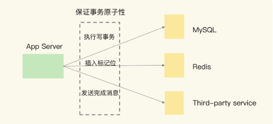
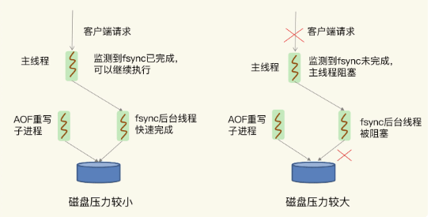

极客时间《Redis 核心技术与实战》笔记三-性能和内存 

18-19讲、

---

### 18 | 波动的响应延迟：如何应对变慢的Redis？（上）

在 Redis 的实际部署应用中，有一个非常严重的问题，那就是 Redis 突然变慢了。一旦出现这个问题，不仅会直接影响用户的使用体验，还可能会影响到“旁人”，也就是和 Redis 在同一个业务系统中的其他系统，比如说数据库。

举个小例子，在秒杀场景下，一旦 Redis 变慢了，大量的用户下单请求就会被拖慢，也就是说，用户提交了下单申请，却没有收到任何响应，这会给用户带来非常糟糕的使用体验，甚至可能会导致用户流失。

而且，在实际生产环境中，**Redis 往往是业务系统中的一个环节**（例如作为缓存或是作为数据库）。**一旦 Redis 上的请求延迟增加，就可能引起业务系统中的一串儿“连锁反应”**。

我借助一个包含了 Redis 的业务逻辑的小例子，简单地给你解释一下。

**应用服务器（App Server）要完成一个事务性操作**，包括在 MySQL 上执行一个写事务，在 Redis 上插入一个标记位，并通过一个第三方服务给用户发送一条完成消息。

这三个操作都需要保证事务原子性，所以，如果此时 Redis 的延迟增加，就会拖累 App Server 端整个事务的执行。这个事务一直完成不了，又会导致 MySQL 上写事务占用的资源无法释放，进而导致访问 MySQL 的其他请求被阻塞。很明显，Redis 变慢会带来严重的连锁反应。



我相信，不少人遇到过这个问题，那具体该怎么解决呢？

这个时候，切忌“病急乱投医”。如果没有一套行之有效的应对方案，大多数时候我们只能各种尝试，做无用功。**在前面的第 16 讲、第 17 讲中，我们学习了会导致 Redis 变慢的潜在阻塞点以及相应的解决方案，即异步线程机制和 CPU 绑核**。除此之外，还有一些因素会导致 Redis 变慢。

我会从问题认定、系统性排查和应对方案这 3 个方面给你具体讲解。

#### Redis 真的变慢了吗？

在实际解决问题之前，我们首先要弄清楚，如何判断 Redis 是不是真的变慢了。

一个最直接的方法，就是**查看 Redis 的响应延迟**。

大部分时候，Redis 延迟很低，但是在某些时刻，**有些 Redis 实例会出现很高的响应延迟，甚至能达到几秒到十几秒，不过持续时间不长，这也叫延迟“毛刺”**。当你发现 Redis 命令的执行时间突然就增长到了几秒，基本就可以认定 Redis 变慢了。

**这种方法是看 Redis 延迟的绝对值，但是，在不同的软硬件环境下，Redis 本身的绝对性能并不相同**。比如，在我的环境中，当延迟为 1ms 时，我判定 Redis 变慢了，但是你的硬件配置高，那么，在你的运行环境下，可能延迟是 0.2ms 的时候，你就可以认定 Redis 变慢了。

所以，这里我就要说第二个方法了，也就是**基于当前环境下的 Redis 基线性能做判断**。所谓的**基线性能**呢，**也就是一个系统在低压力、无干扰下的基本性能**，这个性能只由当前的软硬件配置决定。

你可能会问，具体怎么确定基线性能呢？有什么好方法吗？

实际上，**从 2.8.7 版本开始，redis-cli 命令提供了–intrinsic-latency 选项，可以用来监测和统计测试期间内的最大延迟**，**这个延迟可以作为 Redis 的基线性能**。其中，测试时长可以用–intrinsic-latency 选项的参数来指定。

举个例子，比如说，我们运行下面的命令，该命令会打印 120 秒内监测到的最大延迟。可以看到，这里的最大延迟是 119 微秒，也就是基线性能为 119 微秒。一般情况下，运行 120 秒就足够监测到最大延迟了，所以，我们可以把参数设置为 120。

```java

./redis-cli --intrinsic-latency 120
Max latency so far: 17 microseconds.
Max latency so far: 44 microseconds.
Max latency so far: 94 microseconds.
Max latency so far: 110 microseconds.
Max latency so far: 119 microseconds.

36481658 total runs (avg latency: 3.2893 microseconds / 3289.32 nanoseconds per run).
Worst run took 36x longer than the average latency.
```

需要注意的是，基线性能和当前的操作系统、硬件配置相关。因此，我们可以把它和 Redis 运行时的延迟结合起来，再进一步判断 Redis 性能是否变慢了。

**一般来说，你要把运行时延迟和基线性能进行对比，如果你观察到的 Redis 运行时延迟是其基线性能的 2 倍及以上，就可以认定 Redis 变慢了**。

判断基线性能这一点，对于在虚拟化环境下运行的 Redis 来说，非常重要。这是因为，在虚拟化环境（例如虚拟机或容器）中，由于增加了虚拟化软件层，与物理机相比，虚拟机或容器本身就会引入一定的性能开销，所以基线性能会高一些。下面的测试结果，显示的就是某一个虚拟机上运行 Redis 时测的基线性能。

```java

$ ./redis-cli --intrinsic-latency 120
Max latency so far: 692 microseconds.
Max latency so far: 915 microseconds.
Max latency so far: 2193 microseconds.
Max latency so far: 9343 microseconds.
Max latency so far: 9871 microseconds.
```

可以看到，由于虚拟化软件本身的开销，此时的基线性能已经达到了 9.871ms。如果该 Redis 实例的运行时延迟为 10ms，这并不能算作性能变慢，因为此时，运行时延迟只比基线性能增加了 1.3%。如果你不了解基线性能，一看到较高的运行时延迟，就很有可能误判 Redis 变慢了。

不过，**我们通常是通过客户端和网络访问 Redis 服务**，**为了避免网络对基线性能的影响**，**刚刚说的这个命令需要在服务器端直接运行，这也就是说，我们只考虑服务器端软硬件环境的影响**。

如果你想了解**网络对 Redis 性能的影响**，一个简单的方法是用 **iPerf** 这样的工具，测量从 Redis 客户端到服务器端的网络延迟。如果这个延迟有几十毫秒甚至是几百毫秒，就说明，Redis 运行的网络环境中很可能有大流量的其他应用程序在运行，导致网络拥塞了。这个时候，你就需要协调网络运维，调整网络的流量分配了。

#### 如何应对 Redis 变慢？

经过了上一步之后，你已经能够确定 Redis 是否变慢了。一旦发现变慢了，接下来，就要开始查找原因并解决这个问题了，这其实是一个很有意思的诊断过程。

下面这张图你应该有印象，这是我们在第一节课画的 **Redis 架构图**。你可以重点关注下我在图上新增的**红色模块，也就是 Redis 自身的操作特性、文件系统和操作系统**，它们是影响 Redis 性能的三大要素。


接下来，我将从这三大要素入手，结合实际的应用场景，依次给你介绍从不同要素出发排查和解决问题的实践经验。这节课我先给你介绍 **Redis 的自身操作特性的影响**。

##### Redis 自身操作特性的影响

首先，我们来学习下 Redis 提供的键值对命令操作对延迟性能的影响。我重点介绍两类关键操作：**慢查询命令和过期 key 操作**。

###### 1 慢查询命令

**慢查询命令，就是指在 Redis 中执行速度慢的命令，这会导致 Redis 延迟增加**。Redis 提供的命令操作很多，并不是所有命令都慢，这和命令操作的复杂度有关。所以，我们必须要知道 Redis 的不同命令的复杂度。

比如说，Value 类型为 String 时，GET/SET 操作主要就是操作 Redis 的哈希表索引。这个操作复杂度基本是固定的，即 O(1)。但是，当 Value 类型为 Set 时，SORT、SUNION/SMEMBERS 操作复杂度分别为 O(N+M*log(M)) 和 O(N)。其中，N 为 Set 中的元素个数，M 为 SORT 操作返回的元素个数。这个复杂度就增加了很多。[Redis 官方文档](https://redis.io/commands/)中对每个命令的复杂度都有介绍，当你需要了解某个命令的复杂度时，可以直接查询。

那该怎么应对这个问题呢？在这儿，我就要给你排查建议和解决方法了，这也是今天的第一个方法。

当你发现 Redis 性能变慢时，**可以通过 Redis 日志，或者是 latency monitor 工具，查询变慢的请求**，根据请求对应的具体命令以及官方文档，确认下是否采用了复杂度高的慢查询命令。

如果的确有大量的慢查询命令，有两种处理方式：

1. **用其他高效命令代替**。比如说，如果你需要返回一个 SET 中的所有成员时，不要使用 SMEMBERS 命令，而是要使用 SSCAN 多次迭代返回，避免一次返回大量数据，造成线程阻塞。
2. **当你需要执行排序、交集、并集操作时，可以在客户端完成，而不要用 SORT、SUNION、SINTER 这些命令，以免拖慢 Redis 实例**。

当然，**如果业务逻辑就是要求使用慢查询命令，那你得考虑采用性能更好的 CPU**，更快地完成查询命令，避免慢查询的影响。

还有一个比较容易忽略的慢查询命令，就是 KEYS。它用于返回和输入模式匹配的所有 key，例如，以下命令返回所有包含“name”字符串的 keys。

```java
redis> KEYS *name*
1) "lastname"
2) "firstname"
```

**因为 KEYS 命令需要遍历存储的键值对，所以操作延时高**。如果你不了解它的实现而使用了它，就会导致 Redis 性能变慢。所以，**KEYS 命令一般不被建议用于生产环境中**。

###### 2 过期 key 操作

接下来，我们来看过期 **key 的自动删除机制**。**它是 Redis 用来回收内存空间的常用机制，应用广泛，本身就会引起 Redis 操作阻塞，导致性能变慢**，所以，你必须要知道该机制对性能的影响。

Redis 键值对的 key 可以设置过期时间。**默认情况下，Redis 每 100 毫秒会删除一些过期 key**，具体的算法如下：

1. **采样 ACTIVE_EXPIRE_CYCLE_LOOKUPS_PER_LOOP 个数的 key，并将其中过期的 key 全部删除**；
2. **如果超过 25% 的 key 过期了，则重复删除的过程，直到过期 key 的比例降至 25% 以下**。

**ACTIVE_EXPIRE_CYCLE_LOOKUPS_PER_LOOP 是 Redis 的一个参数，默认是 20，那么，一秒内基本有 200 个过期 key 会被删除**。这一策略对清除过期 key、释放内存空间很有帮助。如果每秒钟删除 200 个过期 key，并不会对 Redis 造成太大影响。

但是，如果触发了上面这个算法的第二条，**Redis 就会一直删除以释放内存空间**。注意，**删除操作是阻塞的（Redis 4.0 后可以用异步线程机制来减少阻塞影响）**。所以，一**旦该条件触发，Redis 的线程就会一直执行删除，这样一来，就没办法正常服务其他的键值操作了，就会进一步引起其他键值操作的延迟增加，Redis 就会变慢**。

那么，算法的第二条是怎么被触发的呢？其中一个重要来源，就是**频繁使用带有相同时间参数的 EXPIREAT 命令设置过期 key**，这就会导致，**在同一秒内有大量的 key 同时过期**。

现在，我就要给出第二条排查建议和解决方法了。

**你要检查业务代码在使用 EXPIREAT 命令设置 key 过期时间时，是否使用了相同的 UNIX 时间戳，有没有使用 EXPIRE 命令给批量的 key 设置相同的过期秒数**。因为，这都会造成大量 key 在同一时间过期，导致性能变慢。

遇到这种情况时，千万不要嫌麻烦，你首先要根据实际业务的使用需求，决定 EXPIREAT 和 EXPIRE 的过期时间参数。其次，如果一批 key 的确是同时过期，你还可以在 EXPIREAT 和 EXPIRE 的过期时间参数上，加上一个一定大小范围内的随机数，这样，既保证了 key 在一个邻近时间范围内被删除，又避免了同时过期造成的压力。

#### 小结 

这节课，我首先给你介绍了 Redis 性能变慢带来的重要影响，希望你能充分重视这个问题。我重点介绍了**判断 Redis 变慢的方法，一个是看响应延迟，一个是看基线性能**。同时，我还给了你两种**排查和解决 Redis 变慢这个问题的方法**：

1. 从慢查询命令开始排查，并且根据业务需求替换慢查询命令；
2. 排查过期 key 的时间设置，并根据实际使用需求，设置不同的过期时间。

当然，要真正把 Redis 用好，除了要了解 Redis 本身的原理，还要了解和 Redis 交互的各底层系统的关键机制，包括操作系统和文件系统。**通常情况下，一些难以排查的问题是 Redis 的用法或设置和底层系统的工作机制不协调导致的**。

##### 问题 

这节课，我提到了 KEYS 命令，因为它的复杂度很高，容易引起 Redis 线程操作阻塞，不适用于生产环境。但是，KEYS 命令本身提供的功能是上层业务应用经常需要的，即返回与输入模式匹配的 keys。

请思考一下，在 Redis 中，还有哪些其他命令可以代替 KEYS 命令，实现同样的功能呢？这些命令的复杂度会导致 Redis 变慢吗？

##### 答案 


---

### 19 | 波动的响应延迟：如何应对变慢的Redis？（下）

上节课，我介绍了**判断 Redis 变慢的两种方法**，分别是**响应延迟**和**基线性能**。除此之外，我还给你分享了从 Redis 的自身命令操作层面排查和解决问题的两种方案。

但是，如果在排查时，你发现 Redis 没有执行大量的慢查询命令，也没有同时删除大量过期 keys，那么，我们是不是就束手无策了呢？

Redis 会持久化保存数据到磁盘，这个过程要依赖文件系统来完成，所以，文件系统将数据写回磁盘的机制，会直接影响到 Redis 持久化的效率。而且，在持久化的过程中，Redis 也还在接收其他请求，**持久化的效率高低又会影响到 Redis 处理请求的性能**。

另一方面，**Redis 是内存数据库，内存操作非常频繁，所以，操作系统的内存机制会直接影响到 Redis 的处理效率**。比如说，如果 Redis 的内存不够用了，操作系统会启动 swap 机制，这就会直接拖慢 Redis。


##### 文件系统的影响：AOF 模式

你可能会问，Redis 是个内存数据库，为什么它的性能还和文件系统有关呢？

我在前面讲过，为了保证数据可靠性，Redis 会采用 AOF 日志或 RDB 快照。其中，**AOF 日志提供了三种日志写回策略：no、everysec、always**。这**三种写回策略依赖文件系统的两个系统调用完成**，也就是 **write 和 fsync**。

**write 只要把日志记录写到内核缓冲区，就可以返回了**，并不需要等待日志实际写回到磁盘；而 **fsync 需要把日志记录写回到磁盘后才能返回**，时间较长。下面这张表展示了三种写回策略所执行的系统调用。

**当写回策略配置为 everysec 和 always 时，Redis 需要调用 fsync 把日志写回磁盘**。但是，这两种写回策略的具体执行情况还不太一样。

##### everysec 和 always 写回策略的区别

在使用 **everysec** 时，Redis 允许丢失一秒的操作记录，所以，Redis 主线程并不需要确保每个操作记录日志都写回磁盘。而且，fsync 的执行时间很长，如果是在 Redis 主线程中执行 fsync，就容易阻塞主线程。所以，**当写回策略配置为 everysec 时，Redis 会使用后台的子线程异步完成 fsync 的操作**。

而对于 **always** 策略来说，Redis 需要确保每个操作记录日志都写回磁盘，如果用后台子线程异步完成，主线程就无法及时地知道每个操作是否已经完成了，这就不符合 always 策略的要求了。所以，**always 策略并不使用后台子线程来执行**。

另外，**在使用 AOF 日志时，为了避免日志文件不断增大，Redis 会执行 AOF 重写，生成体量缩小的新的 AOF 日志文件**。AOF 重写本身需要的时间很长，也容易阻塞 Redis 主线程，所以，Redis 使用子进程来进行 AOF 重写。

但是，这里有一个潜在的风险点：AOF 重写会对磁盘进行大量 IO 操作，同时，fsync 又需要等到数据写到磁盘后才能返回，所以，当 AOF 重写的压力比较大时，就会导致 fsync 被阻塞。虽然 fsync 是由后台子线程负责执行的，但是，主线程会监控 fsync 的执行进度。

当主线程使用后台子线程执行了一次 fsync，需要再次把新接收的操作记录写回磁盘时，如果主线程发现上一次的 fsync 还没有执行完，那么它就会阻塞。所以，如果后台子线程执行的 fsync 频繁阻塞的话（比如 AOF 重写占用了大量的磁盘 IO 带宽），主线程也会阻塞，导致 Redis 性能变慢。

为了帮助你理解，我再画一张图来展示下在磁盘压力小和压力大的时候，fsync 后台子线程和主线程受到的影响。



好了，说到这里，你已经了解了，**由于 fsync 后台子线程和 AOF 重写子进程的存在，主 IO 线程一般不会被阻塞**。但是，**如果在重写日志时，AOF 重写子进程的写入量比较大，fsync 线程也会被阻塞，进而阻塞主线程，导致延迟增加**。现在，我来给出排查和解决建议。

首先，你可以检查下 Redis 配置文件中的 appendfsync 配置项，该配置项的取值表明了 Redis 实例使用的是哪种 AOF 日志写回策略，如下所示：


如果 AOF 写回策略使用了 everysec 或 always 配置，请先确认下业务方对数据可靠性的要求，明确是否需要每一秒或每一个操作都记日志。有的业务方不了解 Redis AOF 机制，很可能就直接使用数据可靠性最高等级的 always 配置了。其实，在有些场景中（例如 Redis 用于缓存），数据丢了还可以从后端数据库中获取，并不需要很高的数据可靠性。

如果业务应用对延迟非常敏感，但同时允许一定量的数据丢失，那么，可以把配置项 no-appendfsync-on-rewrite 设置为 yes，如下所示：

```java
no-appendfsync-on-rewrite yes
```

这个配置项设置为 yes 时，表示在 AOF 重写时，不进行 fsync 操作。也就是说，Redis 实例把写命令写到内存后，不调用后台线程进行 fsync 操作，就可以直接返回了。当然，如果此时实例发生宕机，就会导致数据丢失。反之，如果这个配置项设置为 no（也是默认配置），在 AOF 重写时，Redis 实例仍然会调用后台线程进行 fsync 操作，这就会给实例带来阻塞。

**如果的确需要高性能，同时也需要高可靠数据保证，我建议你考虑采用高速的固态硬盘作为 AOF 日志的写入设备**。

高速固态盘的带宽和并发度比传统的机械硬盘的要高出 10 倍及以上。在 AOF 重写和 fsync 后台线程同时执行时，固态硬盘可以提供较为充足的磁盘 IO 资源，让 AOF 重写和 fsync 后台线程的磁盘 IO 资源竞争减少，从而降低对 Redis 的性能影响

##### 操作系统的影响：swap

如果 Redis 的 AOF 日志配置只是 no，或者就没有采用 AOF 模式，那么，还会有什么问题导致性能变慢吗？

接下来，我就再说一个潜在的瓶颈：**操作系统的内存 swap**。

**内存 swap 是操作系统里将内存数据在内存和磁盘间来回换换入和换出的机制**，涉及到磁盘的读写，所以，一旦触发 swap，无论是被换入数据的进程，还是被换出数据的进程，其性能都会受到慢速磁盘读写的影响。

Redis 是内存数据库，内存使用量大，如果没有控制好内存的使用量，或者和其他内存需求大的应用一起运行了，就可能受到 swap 的影响，而导致性能变慢。

这一点对于 Redis 内存数据库而言，显得更为重要：正常情况下，Redis 的操作是直接通过访问内存就能完成，一旦 swap 被触发了，Redis 的请求操作需要等到磁盘数据读写完成才行。而且，和我刚才说的 AOF 日志文件读写使用 fsync 线程不同，**swap 触发后影响的是 Redis 主 IO 线程，这会极大地增加 Redis 的响应时间**。

说到这儿，我想给你分享一个我曾经遇到过的因为 swap 而导致性能降低的例子。在正常情况下，我们运行的一个实例完成 5000 万个 GET 请求时需要 300s，但是，有一次，这个实例完成 5000 万 GET 请求，花了将近 4 个小时的时间。经过问题复现，我们发现，当时 Redis 处理请求用了近 4 小时的情况下，该实例所在的机器已经发生了 swap。从 300s 到 4 个小时，延迟增加了将近 48 倍，可以看到 swap 对性能造成的严重影响。那么，什么时候会触发 swap 呢？

那么，什么时候会触发 swap 呢？

通常，**触发 swap 的原因主要是物理机器内存不足**，对于 Redis 而言，有两种常见的情况：

- Redis 实例自身使用了大量的内存，导致物理机器的可用内存不足；
- 和 Redis 实例在同一台机器上运行的其他进程，在进行大量的文件读写操作。文件读写本身会占用系统内存，这会导致分配给 Redis 实例的内存量变少，进而触发 Redis 发生 swap。

针对这个问题，我也给你提供一个解决思路：**增加机器的内存或者使用 Redis 集群**。

操作系统本身会在后台记录每个进程的 swap 使用情况，即有多少数据量发生了 swap。你可以先通过下面的命令查看 Redis 的进程号，这里是 5332。

```java
$ redis-cli info | grep process_id
process_id: 5332
```

然后，进入 Redis 所在机器的 /proc 目录下的该进程目录中：

```java

$cat smaps | egrep '^(Swap|Size)'
Size: 584 kB
Swap: 0 kB
Size: 4 kB
Swap: 4 kB
Size: 4 kB
Swap: 0 kB
Size: 462044 kB
Swap: 462008 kB
Size: 21392 kB
Swap: 0 kB
```

每一行 Size 表示的是 Redis 实例所用的一块内存大小，而 Size 下方的 Swap 和它相对应，表示这块 Size 大小的内存区域有多少已经被换出到磁盘上了。如果这两个值相等，就表示这块内存区域已经完全被换出到磁盘了。

作为内存数据库，Redis 本身会使用很多大小不一的内存块，所以，你可以看到有很多 Size 行，有的很小，就是 4KB，而有的很大，例如 462044KB。**不同内存块被换出到磁盘上的大小也不一样**，例如刚刚的结果中的第一个 4KB 内存块，它下方的 Swap 也是 4KB，这表示这个内存块已经被换出了；另外，462044KB 这个内存块也被换出了 462008KB，差不多有 462MB。

这里有个重要的地方，我得提醒你一下，**当出现百 MB，甚至 GB 级别的 swap 大小时，就表明，此时，Redis 实例的内存压力很大，很有可能会变慢**。所以，**swap 的大小是排查 Redis 性能变慢是否由 swap 引起的重要指标**。

一旦发生内存 swap，最直接的解决方法就是**增加机器内存**。如果该实例在一个 Redis 切片集群中，可以增加 Redis 集群的实例个数，来分摊每个实例服务的数据量，进而减少每个实例所需的内存量。

当然，如果 Redis 实例和其他操作大量文件的程序（例如数据分析程序）共享机器，你可以将 Redis 实例迁移到单独的机器上运行，以满足它的内存需求量。如果该实例正好是 Redis 主从集群中的主库，而从库的内存很大，也可以考虑进行主从切换，把大内存的从库变成主库，由它来处理客户端请求。

##### 操作系统的影响：内存大页

除了内存 swap，还有一个和内存相关的因素，即**内存大页机制（Transparent Huge Page, THP），也会影响 Redis 性能**。

Linux 内核从 2.6.38 开始支持内存大页机制，该机制支持 2MB 大小的内存页分配，而常规的内存页分配是按 4KB 的粒度来执行的。

很多人都觉得：“Redis 是内存数据库，内存大页不正好可以满足 Redis 的需求吗？而且在分配相同的内存量时，内存大页还能减少分配次数，不也是对 Redis 友好吗?”

其实，系统的设计通常是一个取舍过程，我们称之为 trade-off。很多机制通常都是优势和劣势并存的。Redis 使用内存大页就是一个典型的例子。

虽然内存大页可以给 Redis 带来内存分配方面的收益，但是，不要忘了，Redis 为了提供数据可靠性保证，需要将数据做持久化保存。这个写入过程由额外的线程执行，所以，此时，Redis 主线程仍然可以接收客户端写请求。客户端的写请求可能会修改正在进行持久化的数据。在这一过程中，Redis 就会采用写时复制机制，也就是说，一旦有数据要被修改，Redis 并不会直接修改内存中的数据，而是将这些数据拷贝一份，然后再进行修改。

如果采用了内存大页，那么，即使客户端请求只修改 100B 的数据，Redis 也需要拷贝 2MB 的大页。相反，如果是常规内存页机制，只用拷贝 4KB。两者相比，你可以看到，**当客户端请求修改或新写入数据较多时，内存大页机制将导致大量的拷贝，这就会影响 Redis 正常的访存操作，最终导致性能变慢**。

那该怎么办呢？很简单，**关闭内存大页**，就行了。

首先，我们要先排查下内存大页。方法是：在 Redis 实例运行的机器上执行如下命令:

```java
cat /sys/kernel/mm/transparent_hugepage/enabled
```

如果执行结果是 always，就表明内存大页机制被启动了；如果是 never，就表示，内存大页机制被禁止。

在实际生产环境中部署时，我建议你不要使用内存大页机制，操作也很简单，只需要执行下面的命令就可以了：

```java
echo never /sys/kernel/mm/transparent_hugepage/enabled
```

##### 小结 

##### 9个redis性能变慢的检查点 ！！！！

1. 获取 Redis 实例在当前环境下的基线性能。
2. 是否用了慢查询命令？如果是的话，就使用其他命令替代慢查询命令，或者把聚合计算命令放在客户端做。
3. 是否对过期 key 设置了相同的过期时间？对于批量删除的 key，可以在每个 key 的过期时间上加一个随机数，避免同时删除。
4. 是否存在 bigkey？ 对于 bigkey 的删除操作，如果你的 Redis 是 4.0 及以上的版本，可以直接利用异步线程机制减少主线程阻塞；如果是 Redis 4.0 以前的版本，可以使用 SCAN 命令迭代删除；对于 bigkey 的集合查询和聚合操作，可以使用 SCAN 命令在客户端完成。
5. Redis AOF 配置级别是什么？业务层面是否的确需要这一可靠性级别？如果我们需要高性能，同时也允许数据丢失，可以将配置项 no-appendfsync-on-rewrite 设置为 yes，避免 AOF 重写和 fsync 竞争磁盘 IO 资源，导致 Redis 延迟增加。当然， 如果既需要高性能又需要高可靠性，最好使用高速固态盘作为 AOF 日志的写入盘。
6. Redis 实例的内存使用是否过大？发生 swap 了吗？如果是的话，就增加机器内存，或者是使用 Redis 集群，分摊单机 Redis 的键值对数量和内存压力。同时，要避免出现 Redis 和其他内存需求大的应用共享机器的情况。
7. 在 Redis 实例的运行环境中，是否启用了透明大页机制？如果是的话，直接关闭内存大页机制就行了。
8. 是否运行了 Redis 主从集群？如果是的话，把主库实例的数据量大小控制在 2~4GB，以免主从复制时，从库因加载大的 RDB 文件而阻塞。
9. 是否使用了多核 CPU 或 NUMA 架构的机器运行 Redis 实例？使用多核 CPU 时，可以给 Redis 实例绑定物理核；使用 NUMA 架构时，注意把 Redis 实例和网络中断处理程序运行在同一个 CPU Socket 上。

如果你遇到了一些特殊情况，也不要慌，我再给你分享一个小技巧：仔细检查下有没有恼人的“邻居”，具体点说，就是 Redis 所在的机器上有没有一些其他占内存、磁盘 IO 和网络 IO 的程序，比如说数据库程序或者数据采集程序。如果有的话，我建议你将这些程序迁移到其他机器上运行。