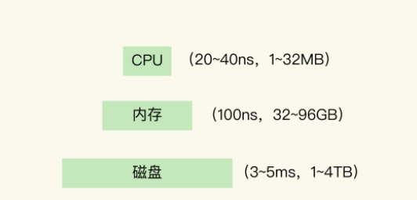
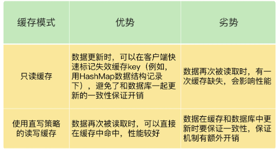
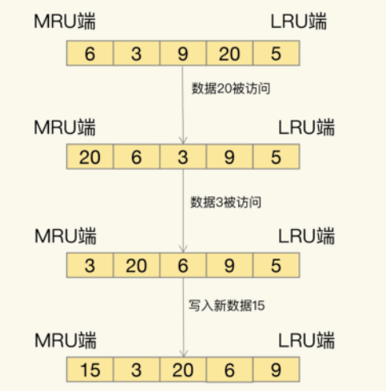

### 极客时间《Redis 核心技术与实战》笔记四-缓存

**23-28讲**

---

### 23 | 旁路缓存：Redis是如何工作的？

我们知道，Redis 提供了高性能的数据存取功能，所以广泛应用在缓存场景中，既能有效地提升业务应用的响应速度，还可以避免把高并发大压力的请求发送到数据库层。

但是，如果 Redis 做缓存时出现了问题，比如说缓存失效，那么，大量请求就会直接积压到数据库层，必然会给数据库带来巨大的压力，很可能会导致数据库宕机或是故障，那么，业务应用就没有办法存取数据、响应用户请求了。这种生产事故，肯定不是我们希望看到的。

正因为 Redis 用作缓存的普遍性以及它在业务应用中的重要作用，所以，我们需要系统地掌握缓存的一系列内容，包括**工作原理、替换策略、异常处理和扩展机制**。具体来说，我们需要解决四个关键问题：

- **Redis 缓存具体是怎么工作的？**
- **Redis 缓存如果满了，该怎么办？**
- **为什么会有缓存一致性、缓存穿透、缓存雪崩、缓存击穿等异常，该如何应对**？
- **Redis 的内存毕竟有限，如果用快速的固态硬盘来保存数据，可以增加缓存的数据量，那么，Redis 缓存可以使用快速固态硬盘吗**？

#### 缓存的特征

要想弄明白 Redis 为什么适合用作缓存，我们得清楚缓存都有什么特征。

首先，你要知道，一个系统中的不同层之间的访问速度不一样，所以我们才需要缓存，这样就可以把一些需要频繁访问的数据放在缓存中，以加快它们的访问速度。



从图上可以看到，CPU、内存和磁盘这三层的访问速度从几十 ns 到 100ns，再到几 ms，性能的差异很大。想象一下，如果每次 CPU 处理数据时，都要从 ms 级别的慢速磁盘中读取数据，然后再进行处理，那么，CPU 只能等磁盘的数据传输完成。这样一来，高速的 CPU 就被慢速的磁盘拖累了，整个计算机系统的运行速度会变得非常慢。

所以，计算机系统中，默认有两种缓存：

- CPU 里面的末级缓存，即 LLC，用来缓存内存中的数据，避免每次从内存中存取数据；
- 内存中的高速页缓存，即 page cache，用来缓存磁盘中的数据，避免每次从磁盘中存取数据。


跟内存相比，LLC 的访问速度更快，而跟磁盘相比，内存的访问是更快的。所以，我们可以看出来缓存的**第一个特征：在一个层次化的系统中，缓存一定是一个快速子系统，数据存在缓存中时，能避免每次从慢速子系统中存取数据**。对应到互联网应用来说，Redis 就是快速子系统，而数据库就是慢速子系统了。

我们再看一下刚才的计算机分层结构。LLC 的大小是 MB 级别，page cache 的大小是 GB 级别，而磁盘的大小是 TB 级别。这其实包含了缓存的**第二个特征：缓存系统的容量大小总是小于后端慢速系统的，我们不可能把所有数据都放在缓存系统中**。

这个很有意思，它表明，缓存的容量终究是有限的，缓存中的数据量也是有限的，肯定是没法时刻都满足访问需求的。所以，缓存和后端慢速系统之间，必然存在数据写回和再读取的交互过程。简单来说，**缓存中的数据需要按一定规则淘汰出去，写回后端系统，而新的数据又要从后端系统中读取进来，写入缓存**。

说到这儿，你肯定会想到，**Redis 本身是支持按一定规则淘汰数据的，相当于实现了缓存的数据淘汰，其实，这也是 Redis 适合用作缓存的一个重要原因**。

#### Redis 缓存处理请求的两种情况 

把 Redis 用作缓存时，我们会把 Redis 部署在数据库的前端，业务应用在访问数据时，会先查询 Redis 中是否保存了相应的数据。此时，根据数据是否存在缓存中，会有两种情况。

- **缓存命中**：Redis 中有相应数据，就直接读取 Redis，性能非常快。
- **缓存缺失**：Redis 中没有保存相应数据，就从后端数据库中读取数据，性能就会变慢。而且，**一旦发生缓存缺失，为了让后续请求能从缓存中读取到数据，我们需要把缺失的数据写入 Redis，这个过程叫作缓存更新**。缓存更新操作会涉及到保证缓存和数据库之间的数据一致性问题。


使用 Redis 缓存时，我们基本有三个操作：

- **应用读取数据时，需要先读取 Redis**；
- **发生缓存缺失时，需要从数据库读取数据**；
- **发生缓存缺失时，还需要更新缓存**。

#### Redis 作为旁路缓存的使用操作

Redis 是一个独立的系统软件，和业务应用程序是两个软件，当我们部署了 Redis 实例后，它只会被动地等待客户端发送请求，然后再进行处理。所以，**如果应用程序想要使用 Redis 缓存，我们就要在程序中增加相应的缓存操作代码**。所以，我们也把 **Redis 称为旁路缓存**，也就是说，**读取缓存、读取数据库和更新缓存的操作都需要在应用程序中来完成**。

这和我刚才讲的计算机系统中的 LLC 和 page cache 不一样。你可以回想下，平时在开发程序时，我们是没有专门在代码中显式地创建 LLC 或 page cache 的实例的，也没有显式调用过它们的 GET 接口。这是因为，我们在构建计算机硬件系统时，已经把 LLC 和 page cache 放在了应用程序的数据访问路径上，应用程序访问数据时直接就能用上缓存。

那么，使用 Redis 缓存时，具体来说，我们需要在应用程序中增加三方面的代码：

- 当应用程序需要读取数据时，我们需要在代码中显式调用 Redis 的 GET 操作接口，进行查询；
- 如果缓存缺失了，应用程序需要再和数据库连接，从数据库中读取数据；
- 当缓存中的数据需要更新时，我们也需要在应用程序中显式地调用 SET 操作接口，把更新的数据写入缓存。

那么，代码应该怎么加呢？我给你展示一段 Web 应用中使用 Redis 缓存的伪代码示例。

```java
String cacheKey = “productid_11010003”;
String cacheValue = redisCache.get(cacheKey)；
//缓存命中
if ( cacheValue != NULL)
   return cacheValue;
//缓存缺失
else
   cacheValue = getProductFromDB();
   redisCache.put(cacheValue)  //缓存更新
```

可以看到，为了使用缓存，Web 应用程序需要有一个表示缓存系统的实例对象 redisCache，还需要主动调用 Redis 的 GET 接口，并且要处理缓存命中和缓存缺失时的逻辑，例如在缓存缺失时，需要更新缓存。

通过在应用程序中加入 Redis 的操作代码，我们可以让应用程序使用 Redis 缓存数据了。不过，除了从 Redis 缓存中查询、读取数据以外，应用程序还可能会对数据进行修改，这时，我们既可以在缓存中修改，也可以在后端数据库中进行修改，我们该怎么选择呢？

其实，这就涉及到了 Redis 缓存的两种类型：**只读缓存和读写缓存**。**只读缓存能加速读请求，而读写缓存可以同时加速读写请求**。而且，**读写缓存又有两种数据写回策略，可以让我们根据业务需求，在保证性能和保证数据可靠性之间进行选择**。所以，接下来，我们来具体了解下 Redis 的缓存类型和相应的写回策略。

#### 缓存的类型

##### 只读缓存

**当 Redis 用作只读缓存时，应用要读取数据的话，会先调用 Redis GET 接口，查询数据是否存在**。而**所有的数据写请求，会直接发往后端的数据库，在数据库中增删改**。对于删改的数据来说，如果 Redis 已经缓存了相应的数据，应用需要把这些缓存的数据删除，Redis 中就没有这些数据了。

**当应用再次读取这些数据时，会发生缓存缺失，应用会把这些数据从数据库中读出来，并写到缓存中**。这样一来，这些数据后续再被读取时，就可以直接从缓存中获取了，能起到加速访问的效果。

我给你举个例子。假设业务应用要修改数据 A，此时，数据 A 在 Redis 中也缓存了，那么，应用会先直接在数据库里修改 A，并把 Redis 中的 A 删除。等到应用需要读取数据 A 时，会发生缓存缺失，此时，应用从数据库中读取 A，并写入 Redis，以便后续请求从缓存中直接读取，如下图所示：


只读缓存直接在数据库中更新数据的好处是，**所有最新的数据都在数据库中**，而数据库是提供数据可靠性保障的，这些数据不会有丢失的风险。当我们需要**缓存图片、短视频这些用户只读的数据时**，就可以使用只读缓存这个类型了。

##### 读写缓存

对于读写缓存来说，**除了读请求会发送到缓存进行处理（直接在缓存中查询数据是否存在)，所有的写请求也会发送到缓存，在缓存中直接对数据进行增删改操作**。此时，得益于 Redis 的高性能访问特性，数据的增删改操作可以在缓存中快速完成，处理结果也会快速返回给业务应用，这就可以提升业务应用的响应速度。

但是，和只读缓存不一样的是，在使用读写缓存时，最新的数据是在 Redis 中，而 Redis 是内存数据库，一旦出现掉电或宕机，内存中的数据就会丢失。这也就是说，应用的最新数据可能会丢失，给应用业务带来风险。

所以，**根据业务应用对数据可靠性和缓存性能的不同要求**，我们会有**同步直写和异步写回**两种策略。其中，**同步直写策略优先保证数据可靠性，而异步写回策略优先提供快速响应**。学习了解这两种策略，可以帮助我们根据业务需求，做出正确的设计选择。

###### 同步直写

**同步直写**是指，**写请求发给缓存的同时，也会发给后端数据库进行处理，等到缓存和数据库都写完数据，才给客户端返回**。这样，即使缓存宕机或发生故障，最新的数据仍然保存在数据库中，这就提供了数据可靠性保证。

不过，**同步直写会降低缓存的访问性能**。这是因为缓存中处理写请求的速度是很快的，而数据库处理写请求的速度较慢。即使缓存很快地处理了写请求，也需要等待数据库处理完所有的写请求，才能给应用返回结果，这就增加了缓存的响应延迟。

###### 异步写回

而**异步写回策略，则是优先考虑了响应延迟**。此时，**所有写请求都先在缓存中处理。等到这些增改的数据要被从缓存中淘汰出来时，缓存将它们写回后端数据库**。这样一来，处理这些数据的操作是在缓存中进行的，很快就能完成。只不过，**如果发生了掉电，而它们还没有被写回数据库，就会有丢失的风险了**。


关于是选择只读缓存，还是读写缓存，主要看我们对写请求是否有加速的需求。

- 如果需要对写请求进行加速，我们选择读写缓存；
- 如果写请求很少，或者是只需要提升读请求的响应速度的话，我们选择只读缓存。

举个例子，在商品大促的场景中，商品的库存信息会一直被修改。如果每次修改都需到数据库中处理，就会拖慢整个应用，此时，我们通常会选择读写缓存的模式。而在短视频 App 的场景中，虽然视频的属性有很多，但是，一般确定后，修改并不频繁，此时，在数据库中进行修改对缓存影响不大，所以只读缓存模式是一个合适的选择。

##### 问题 

Redis 只读缓存和使用直写策略的读写缓存，这两种缓存都会把数据同步写到后端数据库中，你觉得，它们有什么区别吗？

答案：主要的区别在于，当有缓存数据被修改时，在只读缓存中，业务应用会直接修改数据库，并把缓存中的数据标记为无效；而在读写缓存中，业务应用需要同时修改缓存和数据库。



### 24 | 替换策略：缓存满了怎么办？

Redis 缓存使用内存来保存数据，避免业务应用从后端数据库中读取数据，可以提升应用的响应速度。那么，**如果我们把所有要访问的数据都放入缓存，是不是一个很好的设计选择呢？其实，这样做的性价比反而不高**。

为了保证较高的性价比，缓存的空间容量必然要小于后端数据库的数据总量。不过，内存大小毕竟有限，**随着要缓存的数据量越来越大，有限的缓存空间不可避免地会被写满**。此时，该怎么办呢？

解决这个问题就涉及到缓存系统的一个重要机制，即**缓存数据的淘汰机制**。简单来说，数据淘汰机制包括两步：第一，**根据一定的策略，筛选出对应用访问来说“不重要”的数据**；**第二，将这些数据从缓存中删除，为新来的数据腾出空间**。

了解了数据淘汰机制和相应策略，我们才可以选择合理的 Redis 配置，提高缓存命中率，提升应用的访问性能。

#### 设置多大的缓存容量合适？

缓存容量设置得是否合理，会直接影响到使用缓存的性价比。我们通常希望**以最小的代价去获得最大的收益**，所以，把昂贵的内存资源用在关键地方就非常重要了。

就像我刚才说的，实际应用中的数据访问是具有局部性的。下面有一张图，图里有红、蓝两条线，显示了不同比例数据贡献的访问量情况。**蓝线代表了“八二原理”表示的数据局部性**，而**红线则表示在当前应用负载下，数据局部性的变化**。

我们先看看**蓝线**。**它表示的就是“八二原理”，有 20% 的数据贡献了 80% 的访问了，而剩余的数据虽然体量很大，但只贡献了 20% 的访问量**。这 80% 的数据在访问量上就形成了一条长长的尾巴，我们也称为“**长尾效应**”


所以，如果按照“八二原理”来设置缓存空间容量，也就是把缓存空间容量设置为总数据量的 20% 的话，就有可能拦截到 80% 的访问。

为什么说是“有可能”呢？这是因为，“八二原理”是对大量实际应用的数据访问情况做了统计后，得出的一个统计学意义上的数据量和访问量的比例。具体到某一个应用来说，数据访问的规律会和具体的业务场景有关。对于最常被访问的 20% 的数据来说，它们贡献的访问量，既有可能超过 80%，也有可能不到 80%。

我们再通过一个电商商品的场景，来说明下“有可能”这件事儿。一方面，在商品促销时，热门商品的信息可能只占到总商品数据信息量的 5%，而这些商品信息承载的可能是超过 90% 的访问请求。这时，我们只要缓存这 5% 的数据，就能获得很好的性能收益。另一方面，如果业务应用要对所有商品信息进行查询统计，这时候，即使按照“八二原理”缓存了 20% 的商品数据，也不能获得很好的访问性能，因为 80% 的数据仍然需要从后端数据库中获取。

接下来，我们再看看数据访问局部性示意图中的**红线**。近年来，有些研究人员专门对互联网应用（例如视频播放网站）中，用户请求访问内容的分布情况做过分析，得到了这张图中的红线。

在这条红线上，80% 的数据贡献的访问量，超过了传统的长尾效应中 80% 数据能贡献的访问量。原因在于，用户的个性化需求越来越多，在一个业务应用中，不同用户访问的内容可能差别很大，所以，用户请求的数据和它们贡献的访问量比例，不再具备长尾效应中的“八二原理”分布特征了。也就是说，20% 的数据可能贡献不了 80% 的访问，而剩余的 80% 数据反而贡献了更多的访问量，我们称之为**重尾效应**。

这其实也是我一直在和你分享的经验，系统的设计选择是一个权衡的过程：大容量缓存是能带来性能加速的收益，但是成本也会更高，而小容量缓存不一定就起不到加速访问的效果。一般来说，**我会建议把缓存容量设置为总数据量的 15% 到 30%，兼顾访问性能和内存空间开销**。

对于 Redis 来说，一旦确定了缓存最大容量，比如 4GB，你就可以使用下面这个命令来设定缓存的大小了：

```java
CONFIG SET maxmemory 4gb
```

不过，**缓存被写满是不可避免的**。即使你精挑细选，确定了缓存容量，还是要面对缓存写满时的替换操作。缓存替换需要解决两个问题：**决定淘汰哪些数据，如何处理那些被淘汰的数据**。

#### Redis 缓存有哪些淘汰策略？

Redis 4.0 之前一共实现了 6 种内存淘汰策略，在 4.0 之后，又增加了 2 种策略。我们可以按照是否会进行数据淘汰把它们分成两类：

- 不进行数据淘汰的策略，只有 **noeviction** 这一种。
- 会进行数据淘汰的 7 种其他策略。

会进行淘汰的 7 种策略，我们可以再进一步根据淘汰候选数据集的范围把它们分成两类：

- **在设置了过期时间的数据中进行淘汰**，包括 **volatile-random、volatile-ttl、volatile-lru、volatile-lfu**（Redis  4.0 后新增）四种。
- **在所有数据范围内进行淘汰**，包括 **allkeys-lru、allkeys-random、allkeys-lfu**（Redis 4.0 后新增）三种。

如图：


**默认情况下，Redis 在使用的内存空间超过 maxmemory 值时，并不会淘汰数据，也就是设定的 noeviction 策略**。**对应到 Redis 缓存，也就是指，一旦缓存被写满了，再有写请求来时，Redis 不再提供服务，而是直接返回错误**。Redis 用作缓存时，实际的数据集通常都是大于缓存容量的，总会有新的数据要写入缓存，这个策略本身不淘汰数据，也就不会腾出新的缓存空间，我们不把它用在 Redis 缓存中。

我们再分析下 **volatile-random、volatile-ttl、volatile-lru 和 volatile-lfu** 这四种淘汰策略。它们筛选的候选数据范围，**被限制在已经设置了过期时间的键值对上**。也正因为此，**即使缓存没有写满，这些数据如果过期了，也会被删除**。

例如，我们使用 EXPIRE 命令对一批键值对设置了过期时间后，**无论是这些键值对的过期时间是快到了，还是 Redis 的内存使用量达到了 maxmemory 阈值**，**Redis 都会进一步按照 volatile-ttl、volatile-random、volatile-lru、volatile-lfu 这四种策略的具体筛选规则进行淘汰**。

- **volatile-ttl 在筛选时，会针对设置了过期时间的键值对，根据过期时间的先后进行删除，越早过期的越先被删除**。
- **volatile-random 就像它的名称一样，在设置了过期时间的键值对中，进行随机删除**。
- **volatile-lru 会使用 LRU 算法筛选设置了过期时间的键值对**。**LRU(Least Recently Used 最近最少使用)**
- **volatile-lfu 会使用 LFU 算法选择设置了过期时间的键值对**。**LFU(Least Frequently Used 最不经常使用)**

volatile-lfu 使用了 LFU 算法，**它是在 LRU 算法的基础上，同时考虑了数据的访问时效性和数据的访问次数**，可以看作是对淘汰策略的优化。

[Redis精通系列——LFU算法详述(Least Frequently Used - 最不经常使用)](https://blog.csdn.net/qq_41125219/article/details/120445829)  

**allkeys-lru、allkeys-random、allkeys-lfu 这三种淘汰策略的备选淘汰数据范围，就扩大到了所有键值对，无论这些键值对是否设置了过期时间**。它们筛选数据进行淘汰的规则是：

- **allkeys-random 策略，从所有键值对中随机选择并删除数据**；
- **allkeys-lru 策略，使用 LRU 算法在所有数据中进行筛选**。
- **allkeys-lfu 策略，使用 LFU 算法在所有数据中进行筛选**。

这也就是说，**如果一个键值对被删除策略选中了，即使它的过期时间还没到，也需要被删除**。当然，**如果它的过期时间到了但未被策略选中，同样也会被删除**。

接下来，我们就看看 volatile-lru 和 allkeys-lru 策略都用到的 LRU 算法吧。LRU 算法工作机制并不复杂，我们一起学习下。

LRU 算法的全称是 Least Recently Used，从名字上就可以看出，这是**按照最近最少使用的原则来筛选数据**，**最不常用的数据会被筛选出来，而最近频繁使用的数据会留在缓存中**。

那具体是怎么筛选的呢？LRU 会把所有的数据组织成一个链表，链表的头和尾分别表示 MRU 端和 LRU 端，分别代表最近最常使用的数据和最近最不常用的数据。我们看一个例子。



我们现在有数据 6、3、9、20、5。如果数据 20 和 3 被先后访问，它们都会从现有的链表位置移到 MRU 端，而链表中在它们之前的数据则相应地往后移一位。因为，LRU 算法选择删除数据时，都是从 LRU 端开始，所以把刚刚被访问的数据移到 MRU 端，就可以让它们尽可能地留在缓存中。

如果有一个新数据 15 要被写入缓存，但此时已经没有缓存空间了，也就是链表没有空余位置了，那么，LRU 算法做两件事：

1. 数据 15 是刚被访问的，所以它会被放到 MRU 端；
2. 算法把 LRU 端的数据 5 从缓存中删除，相应的链表中就没有数据 5 的记录了。

不过，**LRU 算法在实际实现时，需要用链表管理所有的缓存数据，这会带来额外的空间开销**。而且，当有数据被访问时，需要在链表上把该数据移动到 MRU 端，**如果有大量数据被访问，就会带来很多链表移动操作，会很耗时，进而会降低 Redis 缓存性能**。

所以，**在 Redis 中，LRU 算法被做了简化，以减轻数据淘汰对缓存性能的影响**。具体来说，**Redis 默认会记录每个数据的最近一次访问的时间戳（由键值对数据结构 RedisObject 中的 lru 字段记录）。然后，Redis 在决定淘汰的数据时，第一次会随机选出 N 个数据，把它们作为一个候选集合。接下来，Redis 会比较这 N 个数据的 lru 字段，把 lru 字段值最小的数据从缓存中淘汰出去。**

Redis 提供了一个配置参数 maxmemory-samples，这个参数就是 Redis 选出的数据个数 N。例如，我们执行如下命令，可以让 Redis 选出 100 个数据作为候选数据集：

`CONFIG SET maxmemory-samples 100`

当需要再次淘汰数据时，**Redis 需要挑选数据进入第一次淘汰时创建的候选集合**。这儿的挑选标准是：**能进入候选集合的数据的 lru 字段值必须小于候选集合中最小的 lru 值**。当有新数据进入候选数据集后，如果候选数据集中的数据个数达到了 maxmemory-samples，Redis 就把候选数据集中 lru 字段值最小的数据淘汰出去。

这样一来，**Redis 缓存不用为所有的数据维护一个大链表，也不用在每次数据访问时都移动链表项，提升了缓存的性能**。

##### 三个建议

- **优先使用 allkeys-lru 策略**。这样，可以充分利用 LRU 这一经典缓存算法的优势，把最近最常访问的数据留在缓存中，提升应用的访问性能。如果你的业务数据中有明显的冷热数据区分，我建议你使用 allkeys-lru 策略。
- **如果业务应用中的数据访问频率相差不大，没有明显的冷热数据区分**，建议使用 allkeys-random 策略，随机选择淘汰的数据就行。
- **如果你的业务中有置顶的需求**，比如置顶新闻、置顶视频，那么，可以使用 volatile-lru 策略，同时不给这些置顶数据设置过期时间。这样一来，这些需要置顶的数据一直不会被删除，而其他数据会在过期时根据 LRU 规则进行筛选。

一旦被淘汰的数据被选定后，Redis 怎么处理这些数据呢？这就要说到缓存替换时的具体操作了。

#### 如何处理被淘汰的数据？

一般来说，一旦被淘汰的数据选定后，如果这个数据是**干净数据**，那么我们就直接删除；如果这个数据是**脏数据**，我们需要把它写回数据库，如下图所示：


那怎么判断一个数据到底是干净的还是脏的呢？

**干净数据和脏数据的区别就在于，和最初从后端数据库里读取时的值相比，有没有被修改过**。**干净数据一直没有被修改**，所以后端数据库里的数据也是最新值。在替换时，它可以被直接删除。

而**脏数据就是曾经被修改过的，已经和后端数据库中保存的数据不一致了**。此时，如果不把脏数据写回到数据库中，这个数据的最新值就丢失了，就会影响应用的正常使用。

这么一来，缓存替换既腾出了缓存空间，用来缓存新的数据，同时，将脏数据写回数据库，也保证了最新数据不会丢失。

**不过，对于 Redis 来说，它决定了被淘汰的数据后，会把它们删除。即使淘汰的数据是脏数据，Redis 也不会把它们写回数据库。所以，我们在使用 Redis 缓存时，如果数据被修改了，需要在数据修改时就将它写回数据库。否则，这个脏数据被淘汰时，会被 Redis 删除，而数据库里也没有最新的数据了。**

##### 问题 

Redis 缓存在处理脏数据时，不仅会修改数据，还会把它写回数据库，Redis 缓存在处理脏数据时，不仅会修改数据，还会把它写回数据库只读缓存，以及读写缓存中的两种写回策略，请你思考下，Redis 缓存对应哪一种或哪几种模式？

只读缓存：

读写缓存：