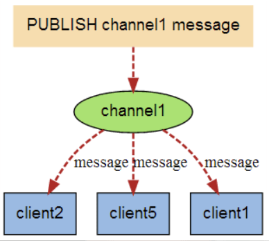
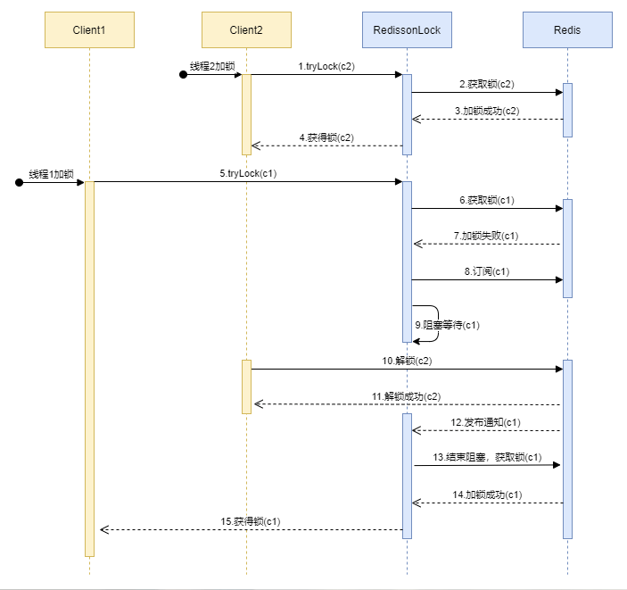

[Redisson源码解读-分布式锁](https://www.javaedit.com/archives/164)

[（Redis篇）超细Redisson分布式Lock锁源码分析](https://juejin.cn/post/7086405088608157726)

[Redis分布式锁-这一篇全了解(Redission实现分布式锁完美方案)](https://blog.csdn.net/asd051377305/article/details/108384490)

https://cloud.tencent.com/developer/article/2107355

#### 分布式锁对比


### Redis 订阅/发布机制

Redisson中用到了Redis的订阅/发布机制，下面简单介绍下。

简单来说就是如果client2 、 client5 和 client1 订阅了 channel1，当有消息发布到 channel1 的时候，client2 、 client5 和 client1 都会收到这个消息。



[菜鸟教程-Redis发布订阅](https://www.runoob.com/redis/redis-pub-sub.html)

### 在分析源码之前我们先思考我们自己去实现一把redis分布式锁会有哪些问题？

一般而言我们常用的redis实现锁命令就是setnx，那么当使用setnx去打标记加锁之后如果系统突然挂了，这把锁是不是变成了死锁？加上超时时间的化，这个超时时间设置多久合适？设置太短，出现A业务还没跑完，锁自己释放了，这时候又来一个线程去执行B业务进行了加锁操作，同一时刻A业务执行完了去释放了B业务的锁，这时候B业务执行途中是没有锁的是不是又会发生线程安全问题？如果在加锁之前给每个线程搞一个uuid，然后释放锁的时候去判断uuid是否相同也无法完全避免刚刚的问题发生，因为释放锁和判断uuid不是一个原子操作。带着这些问题去redisson lock当中寻找答案。

### Redisson

官网提供的案例 [8. 分布式锁和同步器 · redisson/redisson Wiki (github.com)](https://github.com/redisson/redisson/wiki/8.-分布式锁和同步器)

版本：3.4.1

```xml
<dependency>
    <groupId>org.redisson</groupId>
    <artifactId>redisson</artifactId>
    <version>3.4.1</version>
</dependency>
```

#### 可重入锁（Reentrant Lock）

基于Redis的Redisson分布式可重入锁[`RLock`](http://static.javadoc.io/org.redisson/redisson/3.10.0/org/redisson/api/RLock.html) Java对象实现了`java.util.concurrent.locks.Lock`接口。同时还提供了[异步（Async）](http://static.javadoc.io/org.redisson/redisson/3.10.0/org/redisson/api/RLockAsync.html)、[反射式（Reactive）](http://static.javadoc.io/org.redisson/redisson/3.10.0/org/redisson/api/RLockReactive.html)和[RxJava2标准](http://static.javadoc.io/org.redisson/redisson/3.10.0/org/redisson/api/RLockRx.html)的接口。

```java
RLock lock = redisson.getLock("anyLock");
// 最常见的使用方法
lock.lock();
```

大家都知道，如果负责储存这个分布式锁的Redisson节点宕机以后，而且这个锁正好处于锁住的状态时，这个锁会出现锁死的状态。为了避免这种情况的发生，Redisson内部提供了一个监控锁的看门狗，它的作用是在Redisson实例被关闭前，不断的延长锁的有效期。默认情况下，看门狗的检查锁的超时时间是30秒钟，也可以通过修改[Config.lockWatchdogTimeout](https://github.com/redisson/redisson/wiki/2.-配置方法#lockwatchdogtimeout监控锁的看门狗超时单位毫秒)来另行指定。

另外Redisson还通过加锁的方法提供了`leaseTime`的参数来指定加锁的时间。超过这个时间后锁便自动解开了。

```java
// 加锁以后10秒钟自动解锁
// 无需调用unlock方法手动解锁
lock.lock(10, TimeUnit.SECONDS);

// 尝试加锁，最多等待100秒，上锁以后10秒自动解锁
boolean res = lock.tryLock(100, 10, TimeUnit.SECONDS);
if (res) {
   try {
     ...
   } finally {
       lock.unlock();
   }
}
```

Redisson同时还为分布式锁提供了异步执行的相关方法：

```
RLock lock = redisson.getLock("anyLock");
lock.lockAsync();
lock.lockAsync(10, TimeUnit.SECONDS);
Future<Boolean> res = lock.tryLockAsync(100, 10, TimeUnit.SECONDS);
```

`RLock`对象完全符合Java的Lock规范。也就是说只有拥有锁的进程才能解锁，其他进程解锁则会抛出`IllegalMonitorStateException`错误。但是如果遇到需要其他进程也能解锁的情况，请使用[分布式信号量`Semaphore`](https://github.com/redisson/redisson/wiki/8.-分布式锁和同步器#86-信号量semaphore) 对象.

#### 加锁

创建 Redisson

```java
String redisMasterURL = "127.0.0.1:26380";
String redisSlaveURL = "127.0.0.1:26380";
String redisPass = "vin123456";
String redisMasterName = "mymaster";
Config redissonConfig = new Config();
redissonConfig.useSentinelServers().addSentinelAddress(redisMasterURL, redisSlaveURL, "127.0.0.1:26382").setMasterName(
    redisMasterName).setPassword(redisPass);
// 创建redisson 类位置：org.redisson.Redisson#create(org.redisson.config.Config)
LockerUtil.redisson = Redisson.create(redissonConfig);
public static RedissonClient create(Config config) {
    Redisson redisson = new Redisson(config);
    if (config.isRedissonReferenceEnabled()) {
        redisson.enableRedissonReferenceSupport();
    }
    return redisson;
}
```

`RLock lock = redisson.getLock("anyLock");`针对这个代码 org.redisson.Redisson#getLock

```java
public class Redisson implements RedissonClient {
    static {
        RedissonObjectFactory.warmUp();
        RedissonReference.warmUp();
    }
    
    protected final QueueTransferService queueTransferService = new QueueTransferService();
    protected final EvictionScheduler evictionScheduler;
    protected final ConnectionManager connectionManager;
    
    protected final ConcurrentMap<Class<?>, Class<?>> liveObjectClassCache = PlatformDependent.newConcurrentHashMap();
    protected final CodecProvider codecProvider;
    protected final ResolverProvider resolverProvider;
    protected final Config config;
    protected final SemaphorePubSub semaphorePubSub = new SemaphorePubSub();

    protected final UUID id = UUID.randomUUID();// 随机id，唯一性
	// 构造方法
    protected Redisson(Config config) {
        this.config = config;
        Config configCopy = new Config(config);
        
        connectionManager = ConfigSupport.createConnectionManager(configCopy);
        evictionScheduler = new EvictionScheduler(connectionManager.getCommandExecutor());
        codecProvider = config.getCodecProvider();
        resolverProvider = config.getResolverProvider();
    }
    // 这里的 connectionManager.getCommandExecutor() 是我们构造 Redisson创建的
    public RLock getLock(String name) {
        return new RedissonLock(connectionManager.getCommandExecutor(), name, id);
    }
    protected RedissonLock(CommandExecutor commandExecutor, String name, UUID id) {
        super(commandExecutor, name);
        this.commandExecutor = commandExecutor;
        this.id = id;
    }
}
```

用时序图表示加锁和订阅过程。时序图中括号后面的c1、c2代表client1，client2。



当线程2获取了锁但还没释放锁时，如果线程1去获取锁，会阻塞等待，直到线程2解锁，通过Redis的发布订阅机制唤醒线程1,再次去获取锁。

加锁方法是 lock.tryLock(100, 10, TimeUnit.SECONDS)，对应着就是`RedissonLock#tryLock`

```java
/**
 * 获取锁
 * @param waitTime  尝试获取锁的最大等待时间，超过这个值，则认为获取锁失败
 * @param leaseTime 锁的持有时间,超过这个时间锁会自动失效（值应设置为大于业务处理的时间，确保在锁有效期内业务能处理完）
 * @param unit 时间单位
 * @return 获取锁成功返回true，失败返回false
 */
public boolean tryLock(long waitTime, long leaseTime, TimeUnit unit) throws InterruptedException {
    long time = unit.toMillis(waitTime);
    long current = System.currentTimeMillis();// 当前时间
    long threadId = Thread.currentThread().getId();// 当前线程id

    // 尝试加锁，加锁成功返回null，失败返回锁的剩余超时时间
    Long ttl = tryAcquire(waitTime, leaseTime, unit, threadId);
    // 获取锁成功
    if (ttl == null) {
        return true;
    }

    // time小于0代表此时已经超过获取锁的等待时间，直接返回false
    time -= System.currentTimeMillis() - current;
    if (time <= 0) {
        // 
        acquireFailed(threadId);
        return false;
    }

    current = System.currentTimeMillis();
    final RFuture<RedissonLockEntry> subscribeFuture = subscribe(threadId);
    if (!await(subscribeFuture, time, TimeUnit.MILLISECONDS)) {
        if (!subscribeFuture.cancel(false)) {
            subscribeFuture.addListener(new FutureListener<RedissonLockEntry>() {
                @Override
                public void operationComplete(Future<RedissonLockEntry> future) throws Exception {
                    if (subscribeFuture.isSuccess()) {
                         // 出现异常，取消订阅
                        unsubscribe(subscribeFuture, threadId);
                    }
                }
            });
        }
        acquireFailed(threadId);
        return false;
    }

    try {
         // 判断是否超时（超过了waitTime）
        time -= (System.currentTimeMillis() - current);
        if (time <= 0) {
            acquireFailed(threadId);
            return false;
        }

        while (true) {
            // 再次获取锁，成功则返回
            long currentTime = System.currentTimeMillis();
            ttl = tryAcquire(leaseTime, unit, threadId);
            // lock acquired
            if (ttl == null) {
                return true;
            }

            time -= (System.currentTimeMillis() - currentTime);
            if (time <= 0) {
                acquireFailed(threadId);
                return false;
            }

            // waiting for message
            // 阻塞等待信号量唤醒或者超时，接收到订阅时唤醒
            // 使用的是Semaphore#tryAcquire()
            currentTime = System.currentTimeMillis();
            if (ttl >= 0 && ttl < time) {
                getEntry(threadId).getLatch().tryAcquire(ttl, TimeUnit.MILLISECONDS);
            } else {
                getEntry(threadId).getLatch().tryAcquire(time, TimeUnit.MILLISECONDS);
            }

            time -= (System.currentTimeMillis() - currentTime);
            if (time <= 0) {
                acquireFailed(threadId);
                return false;
            }
        }
    } finally {
         // 因为是同步操作，所以无论加锁成功或失败，都取消订阅
        unsubscribe(subscribeFuture, threadId);
    }
    //        return get(tryLockAsync(waitTime, leaseTime, unit));
}
```

##### 加锁失败订阅 subscribe(threadId);

这里有一个 **subscribe(threadId);** 的一个方法。先看一下之前RedissonLock构造方法的父类调用，观察这个name，这个name就是我们一开始getLock的时候传递进去的：anyLock

```java
abstract class RedissonExpirable extends RedissonObject implements RExpirable {

    RedissonExpirable(CommandAsyncExecutor connectionManager, String name) {
        super(connectionManager, name);
    }
}
// 父类
public abstract class RedissonObject implements RObject {

    protected final CommandAsyncExecutor commandExecutor;
    private final String name;
    protected final Codec codec;

    public RedissonObject(Codec codec, CommandAsyncExecutor commandExecutor, String name) {
        this.codec = codec;
        this.name = name;
        this.commandExecutor = commandExecutor;
    }

    public RedissonObject(CommandAsyncExecutor commandExecutor, String name) {
        this(commandExecutor.getConnectionManager().getCodec(), commandExecutor, name);
    }
    ...
}
```

然后看一下这个订阅方法：org.redisson.RedissonLock#subscribe

```java
protected RFuture<RedissonLockEntry> subscribe(long threadId) {
    return PUBSUB.subscribe(getEntryName(), getChannelName(), commandExecutor.getConnectionManager());
}
// id 是我们上面的uuid，getName()则是我们上面获取锁的那个name：anyLock
protected String getEntryName() {
    return id + ":" + getName();
}
```

看一下加锁的整体逻辑：

1. 尝试加锁，成功直接返回true
2. 判断超时
3. 订阅
4. 判断超时
5. 循环 （ 尝试获取锁 → 判断超时 → 阻塞等待 ）

##### 加锁核心方法 tryAcquire(long leaseTime, TimeUnit unit, long threadId)

先看一下加锁的方法：**org.redisson.RedissonLock#tryAcquire**

```java
private Long tryAcquire(long leaseTime, TimeUnit unit, long threadId) {
    return get(tryAcquireAsync(leaseTime, unit, threadId));
}
private <T> RFuture<Long> tryAcquireAsync(long leaseTime, TimeUnit unit, final long threadId) {
    if (leaseTime != -1) {// 这里我们前面传递的是10
        // 调用 lua 脚本，尝试加锁
        return tryLockInnerAsync(leaseTime, unit, threadId, RedisCommands.EVAL_LONG);
    }
    // 如果没有设置leaseTime，就使用默认的internalLockLeaseTime（默认30秒），LOCK_EXPIRATION_INTERVAL_SECONDS = 30
    RFuture<Long> ttlRemainingFuture = tryLockInnerAsync(LOCK_EXPIRATION_INTERVAL_SECONDS, TimeUnit.SECONDS, threadId, RedisCommands.EVAL_LONG);
    ttlRemainingFuture.addListener(new FutureListener<Long>() {
        @Override
        public void operationComplete(Future<Long> future) throws Exception {
            // 只有io完成才返回true，这里如果没有完成则是false，也就是加锁失败的话返回，成功则继续。这里的 future 是 RedissonPromise 类；具体可以查看 tryLockInnerAsync方法调用后返回的 future
            if (!future.isSuccess()) {
                return;
            }

            Long ttlRemaining = future.getNow();
            // lock acquired 
            // 如果ttlRemaining为空，也就是tryLockInnerAsync方法中的lua执行结果返回空，证明获取锁成功，启动看门狗，定时给锁续期，防止业务逻辑未执行完成锁就过期了！！！
            if (ttlRemaining == null) {
                scheduleExpirationRenewal(threadId);
            }
        }
    });
    return ttlRemainingFuture;
}
```

在`tryAcquireAsync`方法中，主要分为两段逻辑：

1. 调用lua脚本加锁：tryLockInnerAsync
2. 看门狗：scheduleExpirationRenewal

##### lua脚本

```java
<T> RFuture<T> tryLockInnerAsync(long leaseTime, TimeUnit unit, long threadId, RedisStrictCommand<T> command) {
        internalLockLeaseTime = unit.toMillis(leaseTime);

        return commandExecutor.evalWriteAsync(getName(), LongCodec.INSTANCE, command,
                  "if (redis.call('exists', KEYS[1]) == 0) then " +
                      "redis.call('hset', KEYS[1], ARGV[2], 1); " +
                      "redis.call('pexpire', KEYS[1], ARGV[1]); " +
                      "return nil; " +
                  "end; " +
                  "if (redis.call('hexists', KEYS[1], ARGV[2]) == 1) then " +
                      "redis.call('hincrby', KEYS[1], ARGV[2], 1); " +
                      "redis.call('pexpire', KEYS[1], ARGV[1]); " +
                      "return nil; " +
                  "end; " +
                  "return redis.call('pttl', KEYS[1]);",
                    Collections.<Object>singletonList(getName()), internalLockLeaseTime, getLockName(threadId));
}
String getLockName(long threadId) {
    return id + ":" + threadId;
}
```

###### 脚本分析

redis.call('exists', KEYS[1]) == 0)

'exists'是具体的某个方法也就是对应的redis原生命令，KEY[1]呢是从Collections.singletonList(getName())这个集合中取值，getName()是一开始创建锁的key值，那么我们就得出第一个命令(redis.call('exists', KEYS[1]) == 0) 的含义是判断这个key存不存在redis中。ARGV[1]对应 internalLockLeaseTime 代表超时时间，ARGV[2]对应 getLockName(threadId) 含义是uuid拼接线程id后的字符串。那么第一个if分支的lua脚本含义就是判断key是否存在redis中，如果不存在我就设置这个key为hash并且参数为一个uuid+线程id，然后又将这个key设置了一个过期时间返回null，接下来我们先走返回null 设置成功的代码逻辑。

**Redisson使用了 Hash 结构来表示一个锁**，这样 Hash 里面的 key 为线程id，value 为锁的次数。这样巧妙地解决了可重入锁的问题。hash的名称为锁的名称也就是创建锁的key值。

下面我们来分析下这段 lua 脚本的逻辑（下面说的threadId都是指变量，不是说key就叫’threadId’）：

1. 如果锁（hash结构）不存在，则创建，并添加一个键值对 （threadId : 1），并设置锁的过期时间
2. 如果锁存在，则将键值对 threadId 对应的值 + 1，并设置锁的过期时间
3. 如果不符合1,2点，则返回锁的剩余过期时间

查看一下各个参数是什么意思，KEYS[1]，KEYS[2]，ARGV[2] 等。继续深入这个方法调用：传入的此时的key=anyLock，script=lua脚本，keys=["anyLock"]，params = internalLockLeaseTime, id + ":" + threadId。

```java
public <T, R> RFuture<R> evalWriteAsync(String key, Codec codec, RedisCommand<T> evalCommandType, String script, List<Object> keys, Object ... params) {
    NodeSource source = getNodeSource(key);
    return evalAsync(source, false, codec, evalCommandType, script, keys, params);
}
// org.redisson.command.CommandAsyncService#evalAsync
private <T, R> RFuture<R> evalAsync(NodeSource nodeSource, boolean readOnlyMode, Codec codec, RedisCommand<T> evalCommandType, String script, List<Object> keys, Object ... params) {
    /* 返回的是 public <R> RPromise<R> newPromise() {
        return new RedissonPromise<R>();
    }*/
    RPromise<R> mainPromise = connectionManager.newPromise();
    // 此时我们的大小是 2 + 1 + 2 = 4
    List<Object> args = new ArrayList<Object>(2 + keys.size() + params.length);
    args.add(script); // arg[0]
    args.add(keys.size()); // arg[1]
    args.addAll(keys); // arg[2] = anyLock
    args.addAll(Arrays.asList(params)); // arg[3] = internalLockLeaseTime arg[4]=id + ":" + threadId
    async(readOnlyMode, nodeSource, codec, evalCommandType, args.toArray(), mainPromise, 0);
    return mainPromise;
}
```

##### 枷锁成功-续命

tryLockInnerAsync()返回值是一个future任务，下面是调用了一个监听器，也就是说他监听tryLockInnerAsync()这个异步任务，执行完成就会去回调operationComplete()方法，这个方法内逻辑首先是判断这个任务执行是否成功，然后**又调了一个getNow()，这个就是取这个任务的返回值，刚刚我们分析那段lua语义也得到设置成功返回是null，也就走到了scheduleExpirationRenewal()这个锁续命逻辑，给我们刚刚设置的30秒到期时间去定时续命**。

###### 看门狗

试想一个场景：程序执行需要10秒，程序执行完成才去解锁，而锁的存活时间只有5秒，也就是程序执行到一半的时候锁就可以被其他程序获取了，这显然不合适。那么怎么解决呢？

1. 方式一：锁永远存在，直到解锁。不设置存活时间。

   这种方法的弊端在于，如果程序没解锁就挂了，锁就成了死锁

2. 方式二：依然设置锁存活时间，但是监控程序的执行，如果程序还没有执行完成，则定期给锁续期。

方式二就是Redisson的看门狗机制。**看门狗只有在没有显示指定锁的持有时间（leaseTime）时才会生效**。

```java
// RedissonLock#tryAcquireAsync
// RedissonBaseLock#scheduleExpirationRenewal
private void scheduleExpirationRenewal(final long threadId) {
    if (expirationRenewalMap.containsKey(getEntryName())) {
        return;
    }

    Timeout task = commandExecutor.getConnectionManager().newTimeout(new TimerTask() {
        @Override
        public void run(Timeout timeout) throws Exception {
            
            RFuture<Boolean> future = commandExecutor.evalWriteAsync(getName(), LongCodec.INSTANCE, RedisCommands.EVAL_BOOLEAN,
                    "if (redis.call('hexists', KEYS[1], ARGV[2]) == 1) then " +
                        "redis.call('pexpire', KEYS[1], ARGV[1]); " +
                        "return 1; " +
                    "end; " +
                    "return 0;",
                      Collections.<Object>singletonList(getName()), internalLockLeaseTime, getLockName(threadId));
            
            future.addListener(new FutureListener<Boolean>() {
                @Override
                public void operationComplete(Future<Boolean> future) throws Exception {
                    expirationRenewalMap.remove(getEntryName());
                    if (!future.isSuccess()) {
                        log.error("Can't update lock " + getName() + " expiration", future.cause());
                        return;
                    }
                    
                    if (future.getNow()) {
                        // reschedule itself
                        scheduleExpirationRenewal(threadId);
                    }
                }
            });
        }
    }, internalLockLeaseTime / 3, TimeUnit.MILLISECONDS);

    if (expirationRenewalMap.putIfAbsent(getEntryName(), task) != null) {
        task.cancel();
    }
}
```

我们直接看他的主干线逻辑，new TimerTask()这里是又搞了一个任务，他有两个参数internalLockLeaseTime / 3 和TimeUnit.MILLISECONDS， 代表10秒之后去执行这个任务（回顾--- **当前方法是监听设置锁成功后执行的 那么也就是说，我当前的new TimerTask()任务是会在设置成功后10秒执行，这个key的过期时间还剩下20秒**），然后去执行了一段lua脚本，大致意思就是去判断这个key是否还存在，存在的话去设置新的过期时间，返回值是1(redis 1 0 返回到代码中对应是boolean)。下面又一个addListener监听器去监听future任务，看到当续命成功时又去递归调用 scheduleExpirationRenewal()方法，通过递归的方式来达到类似定时任务的效果。
到这里加锁成功的核心逻辑也就读完了，在回去看一下加锁失败的逻辑。

##### lua脚本加锁失败

```java
<T> RFuture<T> tryLockInnerAsync(long leaseTime, TimeUnit unit, long threadId, RedisStrictCommand<T> command) {
    internalLockLeaseTime = unit.toMillis(leaseTime);

    return commandExecutor.evalWriteAsync(getName(), LongCodec.INSTANCE, command,
              "if (redis.call('exists', KEYS[1]) == 0) then " +
                  "redis.call('hset', KEYS[1], ARGV[2], 1); " +
                  "redis.call('pexpire', KEYS[1], ARGV[1]); " +
                  "return nil; " +
              "end; " +
              "if (redis.call('hexists', KEYS[1], ARGV[2]) == 1) then " +
                  "redis.call('hincrby', KEYS[1], ARGV[2], 1); " +
                  "redis.call('pexpire', KEYS[1], ARGV[1]); " +
                  "return nil; " +
              "end; " +
              "return redis.call('pttl', KEYS[1]);",
                Collections.<Object>singletonList(getName()), internalLockLeaseTime, getLockName(threadId));
}
```

也就是执行return redis.call('pttl', KEYS[1]); 这里是返回了这把锁的剩余过期时间，继续回到 lockInterruptibly()方法

