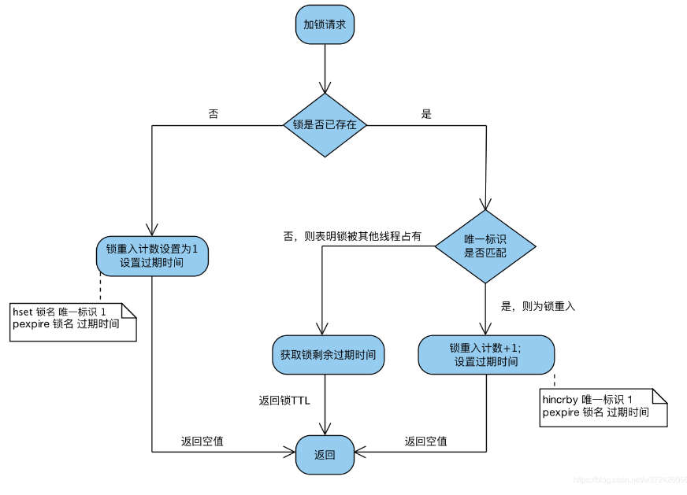
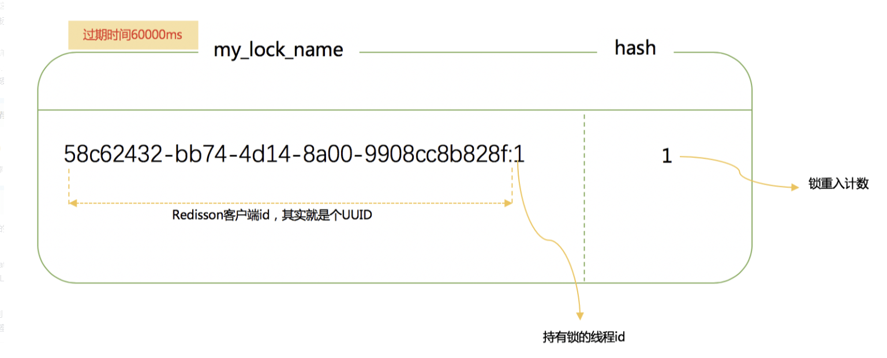
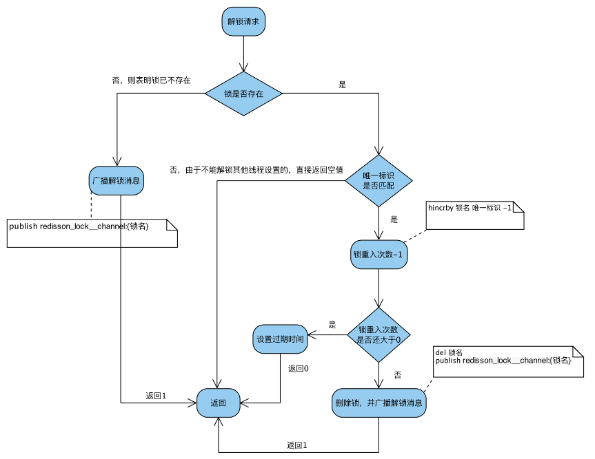

[Redisson源码解读-分布式锁](https://www.javaedit.com/archives/164)

[（Redis篇）超细Redisson分布式Lock锁源码分析](https://juejin.cn/post/7086405088608157726)

[Redis分布式锁-这一篇全了解(Redission实现分布式锁完美方案)](https://blog.csdn.net/asd051377305/article/details/108384490)

https://cloud.tencent.com/developer/article/2107355

### 分布式锁对比

| 分类                              | 方案                                                         | 实现原理                                                     | 优点                                                         | 缺点                                                         |
| --------------------------------- | ------------------------------------------------------------ | ------------------------------------------------------------ | ------------------------------------------------------------ | ------------------------------------------------------------ |
| 基于数据库                        | 基于mysql 表唯一索引                                         | 1.表增加唯一索引 2.加锁：执行insert语句，若报错，则表明加锁失败 3.解锁：执行delete语句 | 完全利用DB现有能力，实现简单                                 | 1.锁无超时自动失效机制，有死锁风险 2.不支持锁重入，不支持阻塞等待 3.操作数据库开销大，性能不高 |
| 基于MongoDB findAndModify原子操作 | 1.加锁：执行findAndModify原子命令查找document，若不存在则新增 2.解锁：删除document | 实现也很容易，较基于MySQL唯一索引的方案，性能要好很多        | 1.大部分公司数据库用MySQL，可能缺乏相应的MongoDB运维、开发人员 2.锁无超时自动失效机制 |                                                              |
| 基于分布式协调系统                | 基于ZooKeeper                                                | 1.加锁：在/lock目录下创建临时有序节点，判断创建的节点序号是否最小。若是，则表示获取到锁；否，则则watch /lock目录下序号比自身小的前一个节点 2.解锁：删除节点 | 1.由zk保障系统高可用 2.Curator框架已原生支持系列分布式锁命令，使用简单 | 需单独维护一套zk集群，维保成本高                             |
| 基于缓存                          | 基于redis命令                                                | 1. 加锁：执行setnx，若成功再执行expire添加过期时间 2. 解锁：执行delete命令 | 实现简单，相比数据库和分布式系统的实现，该方案最轻，性能最好 | 1.setnx和expire分2步执行，非原子操作；若setnx执行成功，但expire执行失败，就可能出现死锁 2.delete命令存在误删除非当前线程持有的锁的可能 3.不支持阻塞等待、不可重入 |
| 基于缓存                          | 基于redis Lua脚本能力                                        | 1. 加锁：执行SET lock_name random_value EX seconds NX 命令  2. 解锁：执行Lua脚本，释放锁时验证random_value  -- ARGV[1]为random_value, KEYS[1]为lock_nameif redis.call("get", KEYS[1]) == ARGV[1] then  return redis.call("del",KEYS[1])else  return 0end | 同上；实现逻辑上也更严谨，除了单点问题，生产环境采用用这种方案，问题也不大。 | 不支持锁重入，不支持阻塞等待                                 |

首先，为了确保分布式锁可用，我们至少要确保锁的实现同时满足以下四个条件：

1. 互斥性。在任意时刻，只有一个客户端能持有锁。
2. 不会发生死锁。即使有一个客户端在持有锁的期间崩溃而没有主动解锁，也能保证后续其他客户端能加锁。
3. 解铃还须系铃人。加锁和解锁必须是同一个客户端，客户端自己不能把别人加的锁给解了，即不能误解锁。
4. 具有容错性。只要大多数Redis节点正常运行，客户端就能够获取和释放锁。

Redisson 这个框架重度依赖了Lua脚本和Netty，代码很牛逼，各种Future及FutureListener的异步、同步操作转换。

### Redis 订阅/发布机制

Redisson中用到了Redis的订阅/发布机制，下面简单介绍下。

简单来说就是如果client2 、 client5 和 client1 订阅了 channel1，当有消息发布到 channel1 的时候，client2 、 client5 和 client1 都会收到这个消息。


[菜鸟教程-Redis发布订阅](https://www.runoob.com/redis/redis-pub-sub.html)

### 在分析源码之前我们先思考我们自己去实现一把redis分布式锁会有哪些问题？

一般而言我们常用的redis实现锁命令就是setnx，那么当使用setnx去打标记加锁之后如果系统突然挂了，这把锁是不是变成了死锁？加上超时时间的化，这个超时时间设置多久合适？设置太短，出现A业务还没跑完，锁自己释放了，这时候又来一个线程去执行B业务进行了加锁操作，同一时刻A业务执行完了去释放了B业务的锁，这时候B业务执行途中是没有锁的是不是又会发生线程安全问题？如果在加锁之前给每个线程搞一个uuid，然后释放锁的时候去判断uuid是否相同也无法完全避免刚刚的问题发生，因为释放锁和判断uuid不是一个原子操作。带着这些问题去redisson lock当中寻找答案。

### Redisson

官网提供的案例 [8. 分布式锁和同步器 · redisson/redisson Wiki (github.com)](https://github.com/redisson/redisson/wiki/8.-分布式锁和同步器)

版本：3.4.1

```xml
<dependency>
    <groupId>org.redisson</groupId>
    <artifactId>redisson</artifactId>
    <version>3.4.1</version>
</dependency>
```

#### 可重入锁（Reentrant Lock）

基于Redis的Redisson分布式可重入锁[`RLock`](http://static.javadoc.io/org.redisson/redisson/3.10.0/org/redisson/api/RLock.html) Java对象实现了`java.util.concurrent.locks.Lock`接口。同时还提供了[异步（Async）](http://static.javadoc.io/org.redisson/redisson/3.10.0/org/redisson/api/RLockAsync.html)、[反射式（Reactive）](http://static.javadoc.io/org.redisson/redisson/3.10.0/org/redisson/api/RLockReactive.html)和[RxJava2标准](http://static.javadoc.io/org.redisson/redisson/3.10.0/org/redisson/api/RLockRx.html)的接口。

```java
RLock lock = redisson.getLock("anyLock");
// 最常见的使用方法
lock.lock();
```

大家都知道，如果负责储存这个分布式锁的Redisson节点宕机以后，而且这个锁正好处于锁住的状态时，这个锁会出现锁死的状态。为了避免这种情况的发生，Redisson内部提供了一个监控锁的看门狗，它的作用是在Redisson实例被关闭前，不断的延长锁的有效期。默认情况下，看门狗的检查锁的超时时间是30秒钟，也可以通过修改[Config.lockWatchdogTimeout](https://github.com/redisson/redisson/wiki/2.-配置方法#lockwatchdogtimeout监控锁的看门狗超时单位毫秒)来另行指定。

另外Redisson还通过加锁的方法提供了`leaseTime`的参数来指定加锁的时间。超过这个时间后锁便自动解开了。

```java
// 加锁以后10秒钟自动解锁
// 无需调用unlock方法手动解锁
lock.lock(10, TimeUnit.SECONDS);

// 尝试加锁，最多等待100秒，上锁以后10秒自动解锁
boolean res = lock.tryLock(100, 10, TimeUnit.SECONDS);
if (res) {
   try {
     ...
   } finally {
       lock.unlock();
   }
}
```

Redisson同时还为分布式锁提供了异步执行的相关方法：

```
RLock lock = redisson.getLock("anyLock");
lock.lockAsync();
lock.lockAsync(10, TimeUnit.SECONDS);
Future<Boolean> res = lock.tryLockAsync(100, 10, TimeUnit.SECONDS);
```

`RLock`对象完全符合Java的Lock规范。也就是说只有拥有锁的进程才能解锁，其他进程解锁则会抛出`IllegalMonitorStateException`错误。但是如果遇到需要其他进程也能解锁的情况，请使用[分布式信号量`Semaphore`](https://github.com/redisson/redisson/wiki/8.-分布式锁和同步器#86-信号量semaphore) 对象.

#### 加锁

创建 Redisson

```java
String redisMasterURL = "127.0.0.1:26380";
String redisSlaveURL = "127.0.0.1:26380";
String redisPass = "vin123456";
String redisMasterName = "mymaster";
Config redissonConfig = new Config();
redissonConfig.useSentinelServers().addSentinelAddress(redisMasterURL, redisSlaveURL, "127.0.0.1:26382").setMasterName(
    redisMasterName).setPassword(redisPass);
// 创建redisson 类位置：org.redisson.Redisson#create(org.redisson.config.Config)
LockerUtil.redisson = Redisson.create(redissonConfig);
public static RedissonClient create(Config config) {
    Redisson redisson = new Redisson(config);
    if (config.isRedissonReferenceEnabled()) {
        redisson.enableRedissonReferenceSupport();
    }
    return redisson;
}
```

`RLock lock = redisson.getLock("anyLock");`针对这个代码 org.redisson.Redisson#getLock

```java
public class Redisson implements RedissonClient {
    static {
        RedissonObjectFactory.warmUp();
        RedissonReference.warmUp();
    }
    
    protected final QueueTransferService queueTransferService = new QueueTransferService();
    protected final EvictionScheduler evictionScheduler;
    protected final ConnectionManager connectionManager;
    
    protected final ConcurrentMap<Class<?>, Class<?>> liveObjectClassCache = PlatformDependent.newConcurrentHashMap();
    protected final CodecProvider codecProvider;
    protected final ResolverProvider resolverProvider;
    protected final Config config;
    protected final SemaphorePubSub semaphorePubSub = new SemaphorePubSub();

    protected final UUID id = UUID.randomUUID();// 随机id，唯一性
	// 构造方法
    protected Redisson(Config config) {
        this.config = config;
        Config configCopy = new Config(config);
        
        connectionManager = ConfigSupport.createConnectionManager(configCopy);
        evictionScheduler = new EvictionScheduler(connectionManager.getCommandExecutor());
        codecProvider = config.getCodecProvider();
        resolverProvider = config.getResolverProvider();
    }
    // 这里的 connectionManager.getCommandExecutor() 是我们构造 Redisson创建的
    public RLock getLock(String name) {
        return new RedissonLock(connectionManager.getCommandExecutor(), name, id);
    }
    protected RedissonLock(CommandExecutor commandExecutor, String name, UUID id) {
        super(commandExecutor, name);
        this.commandExecutor = commandExecutor;
        this.id = id;
    }
}
```

用时序图表示加锁和订阅过程。时序图中括号后面的c1、c2代表client1，client2。


当线程2获取了锁但还没释放锁时，如果线程1去获取锁，会阻塞等待，直到线程2解锁，通过Redis的发布订阅机制唤醒线程1,再次去获取锁。

加锁方法是 lock.tryLock(100, 10, TimeUnit.SECONDS)，对应着就是`RedissonLock#tryLock`

```java
/**
 * 获取锁
 * @param waitTime  尝试获取锁的最大等待时间，超过这个值，则认为获取锁失败
 * @param leaseTime 锁的持有时间,超过这个时间锁会自动失效（值应设置为大于业务处理的时间，确保在锁有效期内业务能处理完）
 * @param unit 时间单位
 * @return 获取锁成功返回true，失败返回false
 */
public boolean tryLock(long waitTime, long leaseTime, TimeUnit unit) throws InterruptedException {
    long time = unit.toMillis(waitTime);
    long current = System.currentTimeMillis();// 当前时间
    long threadId = Thread.currentThread().getId();// 当前线程id

    // 尝试加锁，加锁成功返回null，失败返回锁的剩余超时时间
    Long ttl = tryAcquire(waitTime, leaseTime, unit, threadId);
    // 获取锁成功
    if (ttl == null) {
        return true;
    }

    // time小于0代表此时已经超过获取锁的等待时间，直接返回false
    time -= System.currentTimeMillis() - current;
    if (time <= 0) {
        // 
        acquireFailed(threadId);
        return false;
    }

    current = System.currentTimeMillis();
    final RFuture<RedissonLockEntry> subscribeFuture = subscribe(threadId);
    if (!await(subscribeFuture, time, TimeUnit.MILLISECONDS)) {
        if (!subscribeFuture.cancel(false)) {
            subscribeFuture.addListener(new FutureListener<RedissonLockEntry>() {
                @Override
                public void operationComplete(Future<RedissonLockEntry> future) throws Exception {
                    if (subscribeFuture.isSuccess()) {
                         // 出现异常，取消订阅
                        unsubscribe(subscribeFuture, threadId);
                    }
                }
            });
        }
        acquireFailed(threadId);
        return false;
    }

    try {
         // 判断是否超时（超过了waitTime）
        time -= (System.currentTimeMillis() - current);
        if (time <= 0) {
            acquireFailed(threadId);
            return false;
        }

        while (true) {
            // 再次获取锁，成功则返回
            long currentTime = System.currentTimeMillis();
            ttl = tryAcquire(leaseTime, unit, threadId);
            // lock acquired
            if (ttl == null) {
                return true;
            }

            time -= (System.currentTimeMillis() - currentTime);
            if (time <= 0) {
                acquireFailed(threadId);
                return false;
            }

            // waiting for message
            // 阻塞等待信号量唤醒或者超时，接收到订阅时唤醒
            // 使用的是Semaphore#tryAcquire()
            currentTime = System.currentTimeMillis();
            if (ttl >= 0 && ttl < time) {
                getEntry(threadId).getLatch().tryAcquire(ttl, TimeUnit.MILLISECONDS);
            } else {
                getEntry(threadId).getLatch().tryAcquire(time, TimeUnit.MILLISECONDS);
            }

            time -= (System.currentTimeMillis() - currentTime);
            if (time <= 0) {
                acquireFailed(threadId);
                return false;
            }
        }
    } finally {
         // 因为是同步操作，所以无论加锁成功或失败，都取消订阅
        unsubscribe(subscribeFuture, threadId);
    }
    //        return get(tryLockAsync(waitTime, leaseTime, unit));
}
```

看一下加锁的整体逻辑：

1. 尝试加锁，成功直接返回true
2. 判断超时
3. 订阅
4. 判断超时
5. 循环 （ 尝试获取锁 → 判断超时 → 阻塞等待 ）

**核心方法 tryAcquire(long leaseTime, TimeUnit unit, long threadId)**

先看一下加锁的方法：**org.redisson.RedissonLock#tryAcquire**

```java
private Long tryAcquire(long leaseTime, TimeUnit unit, long threadId) {
    return get(tryAcquireAsync(leaseTime, unit, threadId));
}
private <T> RFuture<Long> tryAcquireAsync(long leaseTime, TimeUnit unit, final long threadId) {
    if (leaseTime != -1) {// 这里我们前面传递的是10
        // 调用 lua 脚本，尝试加锁
        return tryLockInnerAsync(leaseTime, unit, threadId, RedisCommands.EVAL_LONG);
    }
    // 如果没有设置leaseTime，就使用默认的internalLockLeaseTime（默认30秒），LOCK_EXPIRATION_INTERVAL_SECONDS = 30
    RFuture<Long> ttlRemainingFuture = tryLockInnerAsync(LOCK_EXPIRATION_INTERVAL_SECONDS, TimeUnit.SECONDS, threadId, RedisCommands.EVAL_LONG);
    ttlRemainingFuture.addListener(new FutureListener<Long>() {
        @Override
        public void operationComplete(Future<Long> future) throws Exception {
            // 只有io完成才返回true，这里如果没有完成则是false，也就是加锁失败的话返回，成功则继续。这里的 future 是 RedissonPromise 类；具体可以查看 tryLockInnerAsync方法调用后返回的 future
            if (!future.isSuccess()) {
                return;
            }

            Long ttlRemaining = future.getNow();
            // lock acquired 
            // 如果ttlRemaining为空，也就是tryLockInnerAsync方法中的lua执行结果返回空，证明获取锁成功，启动看门狗，定时给锁续期，防止业务逻辑未执行完成锁就过期了！！！
            if (ttlRemaining == null) {
                scheduleExpirationRenewal(threadId);
            }
        }
    });
    return ttlRemainingFuture;
}
```

在`tryAcquireAsync`方法中，主要分为两段逻辑：

1. 调用lua脚本加锁：tryLockInnerAsync
2. 看门狗：scheduleExpirationRenewal

##### lua脚本

```java
<T> RFuture<T> tryLockInnerAsync(long leaseTime, TimeUnit unit, long threadId, RedisStrictCommand<T> command) {
        internalLockLeaseTime = unit.toMillis(leaseTime);

        return commandExecutor.evalWriteAsync(getName(), LongCodec.INSTANCE, command,
                  "if (redis.call('exists', KEYS[1]) == 0) then " +
                      "redis.call('hset', KEYS[1], ARGV[2], 1); " +
                      "redis.call('pexpire', KEYS[1], ARGV[1]); " +
                      "return nil; " +
                  "end; " +
                  "if (redis.call('hexists', KEYS[1], ARGV[2]) == 1) then " +
                      "redis.call('hincrby', KEYS[1], ARGV[2], 1); " +
                      "redis.call('pexpire', KEYS[1], ARGV[1]); " +
                      "return nil; " +
                  "end; " +
                  "return redis.call('pttl', KEYS[1]);",
                    Collections.<Object>singletonList(getName()), internalLockLeaseTime, getLockName(threadId));
}
String getLockName(long threadId) {
    return id + ":" + threadId;
}
```

###### 脚本入参

| 参数    | 示例值                                 | 含义                                                         |
| ------- | -------------------------------------- | ------------------------------------------------------------ |
| KEY个数 | 1                                      | KEY个数                                                      |
| KEYS[1] | my_first_lock_name                     | 锁名                                                         |
| ARGV[1] | 60000                                  | 持有锁的有效时间：**毫秒**                                   |
| ARGV[2] | 58c62432-bb74-4d14-8a00-9908cc8b828f:1 | **唯一标识**：获取锁时set的唯一值，实现上为redisson客户端**ID(UUID)+线程ID** |

###### 脚本内容

```java
-- 若锁不存在：则新增锁，并设置锁重入计数为1、设置锁过期时间
if (redis.call('exists', KEYS[1]) == 0) then
    redis.call('hset', KEYS[1], ARGV[2], 1);
    redis.call('pexpire', KEYS[1], ARGV[1]);
    return nil;
end;
 
-- 若锁存在，且唯一标识也匹配：则表明当前加锁请求为锁重入请求，故锁重入计数+1，并再次设置锁过期时间
if (redis.call('hexists', KEYS[1], ARGV[2]) == 1) then
    redis.call('hincrby', KEYS[1], ARGV[2], 1);
    redis.call('pexpire', KEYS[1], ARGV[1]);
    return nil;
end;
 
-- 若锁存在，但唯一标识不匹配：表明锁是被其他线程占用，当前线程无权解他人的锁，直接返回锁剩余过期时间
return redis.call('pttl', KEYS[1]);
```

###### 脚本解读



`redis.call('exists', KEYS[1]) == 0)`，'exists'是具体的某个方法也就是对应的redis原生命令，KEY[1]呢是从Collections.singletonList(getName())这个集合中取值，getName()是一开始创建锁的key值，那么我们就得出第一个命令(redis.call('exists', KEYS[1]) == 0) 的含义是判断这个key存不存在redis中。ARGV[1]对应 internalLockLeaseTime 代表超时时间，ARGV[2]对应 getLockName(threadId) 含义是uuid拼接线程id后的字符串。那么第一个if分支的lua脚本含义就是判断key是否存在redis中，如果不存在我就设置这个key为hash并且参数为一个uuid+线程id，然后又将这个key设置了一个过期时间返回null，接下来我们先走返回null 设置成功的代码逻辑。

**Redisson使用了 Hash 结构来表示一个锁**，**这样 Hash 里面的 key 为线程id，value 为锁的次数**。这样巧妙地解决了可重入锁的问题。hash的名称为锁的名称也就是创建锁的key值。

下面我们来分析下这段 lua 脚本的逻辑（下面说的threadId都是指变量，不是说key就叫’threadId’）：

1. 如果锁（hash结构）不存在，则创建，并添加一个键值对 （threadId : 1），并设置锁的过期时间
2. 如果锁存在，则将键值对 threadId 对应的值 + 1，并设置锁的过期时间
3. 如果不符合1,2点，则返回锁的剩余过期时间

查看一下各个参数是什么意思，KEYS[1]，KEYS[2]，ARGV[2] 等。继续深入这个方法调用：传入的此时的key=anyLock，script=lua脚本，keys=["anyLock"]，params = internalLockLeaseTime, id + ":" + threadId。

```java
public <T, R> RFuture<R> evalWriteAsync(String key, Codec codec, RedisCommand<T> evalCommandType, String script, List<Object> keys, Object ... params) {
    NodeSource source = getNodeSource(key);
    return evalAsync(source, false, codec, evalCommandType, script, keys, params);
}
// org.redisson.command.CommandAsyncService#evalAsync
private <T, R> RFuture<R> evalAsync(NodeSource nodeSource, boolean readOnlyMode, Codec codec, RedisCommand<T> evalCommandType, String script, List<Object> keys, Object ... params) {
    /* 返回的是 public <R> RPromise<R> newPromise() {
        return new RedissonPromise<R>();
    }*/
    RPromise<R> mainPromise = connectionManager.newPromise();
    // 此时我们的大小是 2 + 1 + 2 = 4
    List<Object> args = new ArrayList<Object>(2 + keys.size() + params.length);
    args.add(script); // arg[0]
    args.add(keys.size()); // arg[1]
    args.addAll(keys); // arg[2] = anyLock
    args.addAll(Arrays.asList(params)); // arg[3] = internalLockLeaseTime arg[4]=id + ":" + threadId
    async(readOnlyMode, nodeSource, codec, evalCommandType, args.toArray(), mainPromise, 0);
    return mainPromise;
}
```

##### 加锁成功-续命

tryLockInnerAsync()返回值是一个future任务，下面是调用了一个监听器，也就是说他监听tryLockInnerAsync()这个异步任务，执行完成就会去回调operationComplete()方法，这个方法内逻辑首先是判断这个任务执行是否成功，然后**又调了一个getNow()，这个就是取这个任务的返回值，刚刚我们分析那段lua语义也得到设置成功返回是null，也就走到了scheduleExpirationRenewal()这个锁续命逻辑，给我们刚刚设置的30秒到期时间去定时续命**。

###### 看门狗

试想一个场景：程序执行需要10秒，程序执行完成才去解锁，而锁的存活时间只有5秒，也就是程序执行到一半的时候锁就可以被其他程序获取了，这显然不合适。那么怎么解决呢？

1. 方式一：锁永远存在，直到解锁。不设置存活时间。

   这种方法的弊端在于，如果程序没解锁就挂了，锁就成了死锁

2. 方式二：依然设置锁存活时间，但是监控程序的执行，如果程序还没有执行完成，则定期给锁续期。

方式二就是Redisson的看门狗机制。**看门狗只有在没有显示指定锁的持有时间（leaseTime）时才会生效**。

```java
// RedissonLock#tryAcquireAsync
// RedissonBaseLock#scheduleExpirationRenewal
private void scheduleExpirationRenewal(final long threadId) {
    if (expirationRenewalMap.containsKey(getEntryName())) {
        return;
    }
	// 创建延迟任务
    Timeout task = commandExecutor.getConnectionManager().newTimeout(new TimerTask() {
        @Override
        public void run(Timeout timeout) throws Exception {
            // 真正的续期，调用 LUA 脚本续期
            RFuture<Boolean> future = commandExecutor.evalWriteAsync(getName(), LongCodec.INSTANCE, RedisCommands.EVAL_BOOLEAN,
                    "if (redis.call('hexists', KEYS[1], ARGV[2]) == 1) then " +
                        "redis.call('pexpire', KEYS[1], ARGV[1]); " +
                        "return 1; " +
                    "end; " +
                    "return 0;",
                      Collections.<Object>singletonList(getName()), internalLockLeaseTime, getLockName(threadId));
            
            future.addListener(new FutureListener<Boolean>() {
                @Override
                public void operationComplete(Future<Boolean> future) throws Exception {
                    expirationRenewalMap.remove(getEntryName());
                    if (!future.isSuccess()) {
                        log.error("Can't update lock " + getName() + " expiration", future.cause());
                        return;
                    }
                    
                    if (future.getNow()) {
                        // reschedule itself
                        scheduleExpirationRenewal(threadId);
                    }
                }
            });
        }
    }, internalLockLeaseTime / 3, TimeUnit.MILLISECONDS);

    if (expirationRenewalMap.putIfAbsent(getEntryName(), task) != null) {
        task.cancel();
    }
}
```

这里还有一个小的点，就是续期的时间是 1/3 为什么呢？保证在下次续期的时候锁不过期，如果是 1/2 可能在下次定时任务执行的时候 key 已经过期，如果小于 1/3 会导致频繁续期，任务代价/收益比不高。

首先，会先判断在expirationRenewalMap中是否存在了entryName，这是个map结构，主要还是判断在这个服务实例中的加锁客户端的锁key是否存在，如果已经存在了，就直接返回；第一次加锁，肯定是不存在的，接下来就是搞了一个TimeTask，延迟internalLockLeaseTime/3之后执行，这里就用到了文章一开始就提到奇妙的变量，算下来就是大约10秒钟执行一次，调用了一个异步执行的方法。

我们直接看他的主干线逻辑，new TimerTask()这里是又搞了一个任务，他有两个参数internalLockLeaseTime / 3 和TimeUnit.MILLISECONDS， 代表10秒之后去执行这个任务（回顾--- **当前方法是监听设置锁成功后执行的 那么也就是说，我当前的new TimerTask()任务是会在设置成功后10秒执行，这个key的过期时间还剩下20秒**），然后去执行了一段lua脚本，大致意思就是去判断这个key是否还存在，存在的话去设置新的过期时间，返回值是1(redis 1 0 返回到代码中对应是boolean)。下面又一个addListener监听器去监听future任务，看到当续命成功时又去递归调用 scheduleExpirationRenewal()方法，通过递归的方式来达到类似定时任务的效果。
到这里加锁成功的核心逻辑也就读完了，在回去看一下加锁失败的逻辑。

##### lua脚本加锁失败

```java
<T> RFuture<T> tryLockInnerAsync(long leaseTime, TimeUnit unit, long threadId, RedisStrictCommand<T> command) {
    internalLockLeaseTime = unit.toMillis(leaseTime);

    return commandExecutor.evalWriteAsync(getName(), LongCodec.INSTANCE, command,
              "if (redis.call('exists', KEYS[1]) == 0) then " +
                  "redis.call('hset', KEYS[1], ARGV[2], 1); " +
                  "redis.call('pexpire', KEYS[1], ARGV[1]); " +
                  "return nil; " +
              "end; " +
              "if (redis.call('hexists', KEYS[1], ARGV[2]) == 1) then " +
                  "redis.call('hincrby', KEYS[1], ARGV[2], 1); " +
                  "redis.call('pexpire', KEYS[1], ARGV[1]); " +
                  "return nil; " +
              "end; " +
              "return redis.call('pttl', KEYS[1]);",
                Collections.<Object>singletonList(getName()), internalLockLeaseTime, getLockName(threadId));
}
```

也就是执行return redis.call('pttl', KEYS[1]); 这里是返回了这把锁的剩余过期时间，继续回到 lockInterruptibly()方法。这个方法其实是lock调用后的方法，和tryLock的主要核心逻辑差不多。

```java
public void lock() {
    try {
        lockInterruptibly();
    } catch (InterruptedException e) {
        Thread.currentThread().interrupt();
    }
}
public void lockInterruptibly() throws InterruptedException {
    lockInterruptibly(-1, null);
}
public void lockInterruptibly(long leaseTime, TimeUnit unit) throws InterruptedException {
    long threadId = Thread.currentThread().getId();
    Long ttl = tryAcquire(leaseTime, unit, threadId);
    // lock acquired
    if (ttl == null) {
        return;
    }

    RFuture<RedissonLockEntry> future = subscribe(threadId);
    commandExecutor.syncSubscription(future);

    try {
        while (true) {
            ttl = tryAcquire(leaseTime, unit, threadId);
            // lock acquired
            if (ttl == null) {
                break;
            }

            // waiting for message
            if (ttl >= 0) {
                getEntry(threadId).getLatch().tryAcquire(ttl, TimeUnit.MILLISECONDS);
            } else {
                getEntry(threadId).getLatch().acquire();
            }
        }
    } finally {
        unsubscribe(future, threadId);
    }
    //        get(lockAsync(leaseTime, unit));
}

protected RedissonLockEntry getEntry(long threadId) {
    return PUBSUB.getEntry(getEntryName());
}
```

我们先看这个while(true)，首先又去尝试获取了一次锁，成功则返回，失败的话，又去尝试加锁刷新这个ttl的时间，分析ttl >= 0的逻辑，getLatch()这个返回值。getEntry 调用的 getEntryName()，就是 id + ":" + getName()，这个name则是我们传递的 anyLock。

```java
// org.redisson.RedissonLockEntry#getLatch
public Semaphore getLatch() {
    return latch;
}
```

是一个Semaphore 信号量，获取这个信号量后调用了tryAcquire()方法 传参是刚刚的ttl，意思就是等待ttl秒获取许可，假设现在ttl是10秒，这个方法就会阻塞在这里等待10s之后去循环这个while继续尝试加锁。

既然有阻塞就会有唤醒，什么情况下会去唤醒。在去假设一种场景，假如ttl返回还有20s，持有锁的线程现在unlock掉了，等待获取锁的线程这时候应该是立刻感知去尝试加锁而不是在继续等待20s，那么应该就是在unlock的时候会去唤醒。

类似的，我们trylock加锁失败，回到后续逻辑；

```java
public boolean tryLock(long waitTime, long leaseTime, TimeUnit unit) throws InterruptedException {
    long time = unit.toMillis(waitTime);
    long current = System.currentTimeMillis();// 当前时间
    long threadId = Thread.currentThread().getId();// 当前线程id

    // 尝试加锁，加锁成功返回null，失败返回锁的剩余超时时间
    Long ttl = tryAcquire(waitTime, leaseTime, unit, threadId);
    // 获取锁成功
    if (ttl == null) {
        return true;
    }

    // time小于0代表此时已经超过获取锁的等待时间，直接返回false
    time -= System.currentTimeMillis() - current;
    if (time <= 0) {
        // 
        acquireFailed(threadId);
        return false;
    }

    /**
     * 4.订阅锁释放事件，并通过await方法阻塞等待锁释放，有效的解决了无效的锁申请浪费资源的问题：
     * 基于信息量，当锁被其它资源占用时，当前线程通过 Redis 的 channel 订阅锁的释放事件，一旦锁释放会发消息通知待等待的线程进行竞争
     * 当 this.await返回false，说明等待时间已经超出获取锁最大等待时间，取消订阅并返回获取锁失败
     * 当 this.await返回true，进入循环尝试获取锁
	 */
    current = System.currentTimeMillis();
    final RFuture<RedissonLockEntry> subscribeFuture = subscribe(threadId);
    //await 方法内部是用CountDownLatch来实现阻塞，获取subscribe异步执行的结果（应用了Netty 的 Future）
    if (!await(subscribeFuture, time, TimeUnit.MILLISECONDS)) {
        if (!subscribeFuture.cancel(false)) {
            subscribeFuture.addListener(new FutureListener<RedissonLockEntry>() {
                @Override
                public void operationComplete(Future<RedissonLockEntry> future) throws Exception {
                    if (subscribeFuture.isSuccess()) {
                         // 出现异常，取消订阅
                        unsubscribe(subscribeFuture, threadId);
                    }
                }
            });
        }
        acquireFailed(threadId);
        return false;
    }

    try {
         // 判断是否超时（超过了waitTime）
        time -= (System.currentTimeMillis() - current);
        if (time <= 0) {
            acquireFailed(threadId);
            return false;
        }

        while (true) {
            // 再次获取锁，成功则返回
            long currentTime = System.currentTimeMillis();
            ttl = tryAcquire(leaseTime, unit, threadId);
            // lock acquired
            if (ttl == null) {
                return true;
            }

            time -= (System.currentTimeMillis() - currentTime);
            if (time <= 0) {
                acquireFailed(threadId);
                return false;
            }

            // waiting for message
            // 阻塞等待信号量唤醒或者超时，接收到订阅时唤醒
            // 使用的是Semaphore#tryAcquire()
            // 【核心点3】根据锁TTL，调整阻塞等待时长；
                // 注意：这里实现非常巧妙，1、latch其实是个信号量Semaphore，调用其tryAcquire方法会让当前线程阻塞一段时间，避免了在while循环中频繁请求获取锁；
               //2、该Semaphore的release方法，会在订阅解锁消息的监听器消息处理方法org.redisson.pubsub.LockPubSub#onMessage调用；当其他线程释放了占用的锁，会广播解锁消息，监听器接收解锁消息，并释放信号量，最终会唤醒阻塞在这里的线程。
              
            currentTime = System.currentTimeMillis();
            if (ttl >= 0 && ttl < time) {
                getEntry(threadId).getLatch().tryAcquire(ttl, TimeUnit.MILLISECONDS);
            } else {
                getEntry(threadId).getLatch().tryAcquire(time, TimeUnit.MILLISECONDS);
            }

            time -= (System.currentTimeMillis() - currentTime);
            if (time <= 0) {
                acquireFailed(threadId);
                return false;
            }
        }
    } finally {
         // 因为是同步操作，所以无论加锁成功或失败，都取消订阅
        unsubscribe(subscribeFuture, threadId);
    }
    //        return get(tryLockAsync(waitTime, leaseTime, unit));
}
```

subscribe()是一个订阅功能，给当前加锁失败的线程去订阅一个channel，有订阅肯定有通知稍后去讲通知在哪里,以及通知的作用。

##### 加锁失败订阅

这里有一个 **subscribe(threadId);** 的一个方法。先看一下之前RedissonLock构造方法的父类调用，观察这个name，这个name就是我们一开始getLock的时候传递进去的：anyLock

```java
abstract class RedissonExpirable extends RedissonObject implements RExpirable {

    RedissonExpirable(CommandAsyncExecutor connectionManager, String name) {
        super(connectionManager, name);
    }
}
// 父类
public abstract class RedissonObject implements RObject {

    protected final CommandAsyncExecutor commandExecutor;
    private final String name;
    protected final Codec codec;

    public RedissonObject(Codec codec, CommandAsyncExecutor commandExecutor, String name) {
        this.codec = codec;
        this.name = name;
        this.commandExecutor = commandExecutor;
    }

    public RedissonObject(CommandAsyncExecutor commandExecutor, String name) {
        this(commandExecutor.getConnectionManager().getCodec(), commandExecutor, name);
    }
    ...
}
```

然后看一下这个订阅方法：org.redisson.RedissonLock#subscribe

```java
protected RFuture<RedissonLockEntry> subscribe(long threadId) {
    return PUBSUB.subscribe(getEntryName(), getChannelName(), commandExecutor.getConnectionManager());
}
// id 是我们上面的uuid，getName()则是我们上面获取锁的那个name：anyLock
protected String getEntryName() {
    return id + ":" + getName();
}
// 组合成一个特殊的形式
String getChannelName() {
    return prefixName("redisson_lock__channel", getName());
}
protected String prefixName(String prefix, String name) {
    if (name.contains("{")) {
        return prefix + ":" + name;
    }
    return prefix + ":{" + name + "}";
}
```

###### 订阅源码

```java
public RFuture<E> subscribe(final String entryName, final String channelName, final ConnectionManager connectionManager) {
    final AtomicReference<Runnable> listenerHolder = new AtomicReference<Runnable>();
    final AsyncSemaphore semaphore = connectionManager.getSemaphore(channelName);
    final RPromise<E> newPromise = new PromiseDelegator<E>(connectionManager.<E>newPromise()) {
        @Override
        public boolean cancel(boolean mayInterruptIfRunning) {
            return semaphore.remove(listenerHolder.get());
        }
    };

    Runnable listener = new Runnable() {

        @Override
        public void run() {
            E entry = entries.get(entryName);
            if (entry != null) {
                entry.aquire();
                semaphore.release();
                entry.getPromise().addListener(new TransferListener<E>(newPromise));
                return;
            }
            
            E value = createEntry(newPromise);
            value.aquire();
            
            E oldValue = entries.putIfAbsent(entryName, value);
            if (oldValue != null) {
                oldValue.aquire();
                semaphore.release();
                oldValue.getPromise().addListener(new TransferListener<E>(newPromise));
                return;
            }
            // 创建一个监听器
            RedisPubSubListener<Object> listener = createListener(channelName, value);
            connectionManager.subscribe(LongCodec.INSTANCE, channelName, semaphore, listener);
        }
    };
    semaphore.acquire(listener);
    listenerHolder.set(listener);
    
    return newPromise;
}
```

在这个创建监听器代码中就设置了解锁后，取消订阅的通知方法：PublishSubscribe.this.onMessage(value, (Long)message); 方法被子类 LockPubSub 实现了。

```java
private RedisPubSubListener<Object> createListener(final String channelName, final E value) {
    RedisPubSubListener<Object> listener = new BaseRedisPubSubListener() {

        @Override
        public void onMessage(String channel, Object message) {
            if (!channelName.equals(channel)) {
                return;
            }
			// 
            PublishSubscribe.this.onMessage(value, (Long)message);
        }

        @Override
        public boolean onStatus(PubSubType type, String channel) {
            if (!channelName.equals(channel)) {
                return false;
            }

            if (type == PubSubType.SUBSCRIBE) {
                value.getPromise().trySuccess(value);
                return true;
            }
            return false;
        }

    };
    return listener;
}
```

##### 加锁过程小结

1、锁其实也是一种资源，各线程争抢锁操作对应到redisson中就是争抢着去创建一个hash结构，谁先创建就代表谁获得锁；hash的名称为锁名，hash里面内容仅包含一条键值对，键为redisson客户端唯一标识+持有锁线程id，值为锁重入计数；给hash设置的过期时间就是锁的过期时间。放个图直观感受下：



2、加锁流程核心就3步 
Step1：尝试获取锁，这一步是通过执行加锁Lua脚本来做； 
Step2：若第一步未获取到锁，则去订阅解锁消息，当获取锁到剩余过期时间后，调用信号量方法阻塞住，直到被唤醒或等待超时 
Step3：一旦持有锁的线程释放了锁，就会广播解锁消息。于是，第二步中的解锁消息的监听器会释放信号量，获取锁被阻塞的那些线程就会被唤醒，并重新尝试获取锁。

#### 解锁

```java
public void unlock() {
        Boolean opStatus = get(unlockInnerAsync(Thread.currentThread().getId()));
        if (opStatus == null) {
            throw new IllegalMonitorStateException("attempt to unlock lock, not locked by current thread by node id: "
                    + id + " thread-id: " + Thread.currentThread().getId());
        }
    // 撤销锁续期
        if (opStatus) {
            cancelExpirationRenewal();
        }

//        Future<Void> future = unlockAsync();
//        future.awaitUninterruptibly();
//        if (future.isSuccess()) {
//            return;
//        }
//        if (future.cause() instanceof IllegalMonitorStateException) {
//            throw (IllegalMonitorStateException)future.cause();
//        }
//        throw commandExecutor.convertException(future);
    }
```

我们分析它的核心代码：unlockInnerAsync(Thread.currentThread().getId())

```java
protected RFuture<Boolean> unlockInnerAsync(long threadId) {
    return commandExecutor.evalWriteAsync(getName(), LongCodec.INSTANCE, RedisCommands.EVAL_BOOLEAN,
            "if (redis.call('exists', KEYS[1]) == 0) then " +
                "redis.call('publish', KEYS[2], ARGV[1]); " +
                "return 1; " +
            "end;" +
            "if (redis.call('hexists', KEYS[1], ARGV[3]) == 0) then " +
                "return nil;" +
            "end; " +
            "local counter = redis.call('hincrby', KEYS[1], ARGV[3], -1); " +
            "if (counter > 0) then " +
                "redis.call('pexpire', KEYS[1], ARGV[2]); " +
                "return 0; " +
            "else " +
                "redis.call('del', KEYS[1]); " +
                "redis.call('publish', KEYS[2], ARGV[1]); " +
                "return 1; "+
            "end; " +
            "return nil;",
            Arrays.<Object>asList(getName(), getChannelName()), LockPubSub.unlockMessage, internalLockLeaseTime, getLockName(threadId));

}
```

##### lua 脚本

###### 脚本入参

| 参数    | 示例值                                      | 含义                          |
| ------- | ------------------------------------------- | ----------------------------- |
| KEY个数 | 2                                           | KEY个数                       |
| KEYS[1] | my_first_lock_name                          | 锁名                          |
| KEYS[2] | redisson_lock__channel:{my_first_lock_name} | **解锁消息PubSub频道**        |
| ARGV[1] | 0                                           | **redisson定义0表示解锁消息** |
| ARGV[2] | 30000                                       | 设置锁的过期时间；默认值30秒  |
| ARGV[3] | 58c62432-bb74-4d14-8a00-9908cc8b828f:1      | 唯一标识；同加锁流程          |

###### 脚本内容

```java
-- 若锁不存在：则直接广播解锁消息，并返回1
if (redis.call('exists', KEYS[1]) == 0) then
    redis.call('publish', KEYS[2], ARGV[1]);
    return 1; 
end;
 
-- 若锁存在，但唯一标识不匹配：则表明锁被其他线程占用，当前线程不允许解锁其他线程持有的锁
if (redis.call('hexists', KEYS[1], ARGV[3]) == 0) then
    return nil;
end; 
 
-- 若锁存在，且唯一标识匹配：则先将锁重入计数减1
local counter = redis.call('hincrby', KEYS[1], ARGV[3], -1); 
if (counter > 0) then 
    -- 锁重入计数减1后还大于0：表明当前线程持有的锁还有重入，不能进行锁删除操作，但可以友好地帮忙设置下过期时期
    redis.call('pexpire', KEYS[1], ARGV[2]); 
    return 0; 
else 
    -- 锁重入计数已为0：间接表明锁已释放了。直接删除掉锁，并广播解锁消息，去唤醒那些争抢过锁但还处于阻塞中的线程
    redis.call('del', KEYS[1]); 
    redis.call('publish', KEYS[2], ARGV[1]); 
    return 1;
end;
 
return nil;
```

###### 脚本解读



##### 解锁发布通知，其他线程获取锁

继续分析lua语义，有一个redis.call('publish', KEYS[2], ARGV[1])的命令， 调用了redis的publish指令，在lock的时候未获取锁的线程有订阅一个频道，这个指令呢就是去给这个频道发送消息，告诉订阅频道的线程我现在释放锁了，我们再去找一下消费消息的源码。 在LockPubSub.class下有个onMessage，这里可以看上面订阅时候的代码逻辑，而且在解锁的调用上传递了这个参数 **LockPubSub.unlockMessage**。

```java
public class LockPubSub extends PublishSubscribe<RedissonLockEntry> {

    public static final Long unlockMessage = 0L;

    @Override
    protected RedissonLockEntry createEntry(RPromise<RedissonLockEntry> newPromise) {
        return new RedissonLockEntry(newPromise);
    }

    @Override
    protected void onMessage(RedissonLockEntry value, Long message) {
        if (message.equals(unlockMessage)) {
            value.getLatch().release();

            while (true) {
                Runnable runnableToExecute = null;
                synchronized (value) {
                    Runnable runnable = value.getListeners().poll();
                    if (runnable != null) {
                        if (value.getLatch().tryAcquire()) {
                            runnableToExecute = runnable;
                        } else {
                            value.addListener(runnable);
                        }
                    }
                }
                
                if (runnableToExecute != null) {
                    runnableToExecute.run();
                } else {
                    return;
                }
            }
        }
    }

}
```

**value.getLatch().release();** 是不是获取信号量并且释放许可,lock中的tryAcquire()就会得到释放再次循环尝试加锁，这样就很好的形成了闭环。
