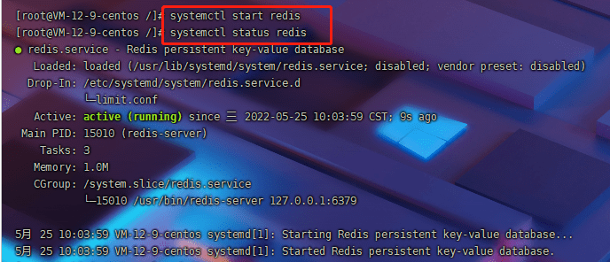
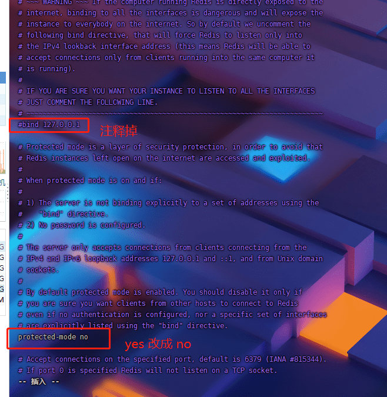
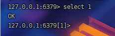

#### yum 安装 redis

原文链接：https://blog.csdn.net/luChenH/article/details/89947971

##### 1 安装 redis 数据库

`yum install redis`


###### 安装最新版本的redis,

如果要安装最新的redis，需要安装Remi的软件源，官网地址：http://rpms.famillecollet.com/

```java
yum install -y http://rpms.famillecollet.com/enterprise/remi-release-7.rpm
yum --enablerepo=remi install redis
```


##### 2 下载fedora的epel仓库

`yum install epel-release`


##### 3 启动redis服务

`systemctl start redis`

打开redis命令:service redis start

关闭redis命令:service redis stop

设为开机启动:chkconfig redis on

设为开机关闭:chkconfig redis off

##### 4 查看redis状态

`systemctl status redis`



 **停止服务**

`systemctl stop redis `

**重启服务**

`systemctl restart redis`

##### 5 查看 redis 进程 

`ps -ef |grep redis`


##### 6 设置开机自启动

`systemctl enable redis`

##### 7 开放端口 

linux 操作防火墙: [linux开放防火墙端口](https://blog.csdn.net/luChenH/article/details/106329236) 

`firewall-cmd --zone=public --add-port=80/tcp --permanent`
`firewall-cmd --zone=public --add-port=6379/tcp --permanent`
注意：80端口是必须要开放的

**重启防火墙**：

`systemctl restart firewalld`

##### 8 查看端口  

`netstat -lnp|grep 6379`


##### 9 设置redis 远程连接和密码

编辑配置文件；

`vi /etc/redis.conf`



修改端口则是在下面


修改密码：我修改成了123456


保存并退出，esc , : ,wq

##### 10 重启redis

`systemctl restart redis` 

##### 11 进入redis 

`redis-cli -h 127.0.0.1 -p 6379`


输入用户名和密码 `auth 111111`  返回 ok

输入 info


##### 12 获取当前的db数  

`config get databases`


##### 13 切换指定 db 




#### redis 自动启动 

https://www.cnblogs.com/zerotomax/p/7468833.html 

要先让redis服务自动启动的话，首先需要在/etc/init.d目录下创建redis的启动脚本。

将redis安装目录下的utils/redis_init_script复制到/etc/init.d目录下，命名为redis（名字简单，使用方便）


继续编辑启动文件，修改其中指定的pid和配置文件。

```xml
PIDFILE=/var/run/redis_${REDISPORT}.pid
CONF="/etc/redis/${REDISPORT}.conf"
修改为
PIDFILE=/var/redis/run/redis_${REDISPORT}.pid
CONF="/etc/redis/redis.conf"
```

首先创建存放pid的目录为/var/redis/run　　

```xml
{root@localhost var]# pwd
/var
[root@localhost var]# mkdir redis
[root@localhost var]# cd redis
[root@localhost redis]# mkdir run
[root@localhost redis]#
```

接下来，我们需要把配置文件复制一份到/etc/redis这个目录下面去:

```xml
[root@localhost etc]# mkdir redis
[root@localhost etc]# cd redis
[root@localhost redis]# ll
总用量 0
[root@localhost redis]# cp /usr/local/redis/redis.conf ./
[root@localhost redis]# ll
总用量 60
-rw-r--r--. 1 root root 57765 9月   3 13:12 redis.conf
[root@localhost redis]# pwd
/etc/redis
[root@localhost redis]#
```

　修改配置文件中的pid为前面配置的pid。

```xml
pidfile /var/run/redis_6379.pid
修改为
pidfile /var/redis/run/redis_6379.pid
```

至此为止，我们已经可以通过**service redis start/stop**来启动和关闭redis服务了。

最后只需要通过chkconfig redis on命令来设置开机启动即可。

如果提示redis 服务不支持 chkconfig的话，只需要在/etc/init.d/redis这个启动脚本的第二行后面加上下面的内容即可。

```xml
# chkconfig:2345 90 10
#
# description:Redis is a persistent key-value database
```

```xml
[root@localhost ~]# chkconfig redis on
redis 服务不支持 chkconfig
[root@localhost ~]# vi /etc/init.d/redis
[root@localhost ~]# chkconfig redis on
[root@localhost ~]#
```


#### 使用 Another Redis Desktop Manager 连接 redis 

下载链接：https://github.com/qishibo/AnotherRedisDesktopManager 


#### docker 安装和配置redis

```sh
docker run \
-p 6379:6379 \  docker与宿主机的端口映射
--name redis \  启动命名redis容器的名字
-v /docker/redis/redis.conf:/etc/redis/redis.conf \  挂载redis.conf文件
-v /docker/redis/data:/data \  挂在redis的持久化数据
--restart=always \  设置redis容器随docker启动而自启动
-d redis:7.0.4 redis-server /etc/redis/redis.conf \  指定redis在docker中的配置文件路径，-d后台启动redis
```

获取配置文件：

` wget http://download.redis.io/redis-stable/redis.conf  ` 下载到本地，然后进行修改为我们所需要的配置。

- 将appendonly持久化设置为yes
- 如果要设置requirepass密码（我设置成了654321）
- 想外部访问首先将“bind”一行注释。 `bind 127.0.0.1 -::1`
- 最后启动时使用 -p 7963:7963

### redis 哨兵命令

https://www.cnblogs.com/janehoo/p/6122958.html

#### 基本命令

##### 1 获取sentinel的状态

- info
  查看sentinel的状态
- sentinel masters
  获取sentinel中监控的所有master的节点
- sentinel master <master-name>
  获取master-name节点redis的状态信息
- sentinel slaves <master-name>
  获取master-name节点下所有的slaves的状态信息。
- SENTINEL get-master-addr-by-name
  通过sentinel中的节点名获取其ip地址

##### 2 添加或删除监控节点

- sentinel monitor <name> <ip> <port> <qrirum>

  > name: sentinel中节点的名字
  > port ip : 被监控的redis master实例
  > quorum : failover时，需要的法定人数。 

- sentinel reset

  重置redis name匹配制定的状态，包括正在failover的master。
  该操作会删除该节点上的slave信息、已经发现和关联的sentinel节点信息。
  sentinel将会重新发现sentinel和redis slave节点。

- sentinel remove <master-name>

  删除master节点，sentinel不再监控该节点。

- manual failover

##### 3 sentinel failover <master-name>

强制redis mater进行failover操作。

#### 主观下线（Subjectively Down）和 客观下线（Objectively Down）

SDOWM: Objectively Down, 单个sentinel节点在down-after-milliseconds时间内没有收到redis masterping的有效回复，这个redis master进入SDOWN主观下线状态。

ODOWN: Objectively Down, 接收多个（>=quorum) sentinel节点的SDOWN的确认，这个redis master进入O_DOWN客观下线状态。O_DOWN将会触发sentinel leader执行fail-over。

#### sentinel fail-over参数

- down-after-milliseconds
  sentinel在down-after-milliseconds时间内没有收到ping的有效回复，那么认为objectively down。
  sentinel set test01 down-after-milliseconds 30000 # 判断节点subjective down的时间，将触发fail-over。

- failover-timeout
  sentinel set test01 failover-timeout 60000 # 重新对该master执行failover的时间间隔

If a Sentinel voted another Sentinel for the failover of a given master, it will wait some time to try to failover the same master again.This delay is the failover-timeout you can configure in sentinel.conf. This means that Sentinels will not try to failover the same master at the same time, the first to ask to be authorized will try, if it fails another will try after some time, and so forth.

#### 4 sentinel状态监测

- redis的监测
  sentinel会每隔1s向redis master/slave发送一个ping命令。

- 和其他sentinel的发现
  redis通过每隔2s进行PUB/SUB redis master/slave中__sentinel:hello channel中的数据，来发现新的sentinel节点和slaves节点。

- redis slaves更新
  A Sentinel sends INFO commands to the masters and slaves every ten seconds in order to take a fresh list of connected slaves, the state of the master, and so forth.

#### 5 sentinel quorum

可以通过sentinel monitor命令、sentinel set、或者在启动sentinel的时候在配置文件中设置某个master的进行failover的投票的法定人数。

实际上，也就是确认objectively down的法定人数，如果超有大于等于quorum个sentinel确认某个redis master出现SDOWN，那么redis maser进入ODOWN的状态。

在这之后，sentinel leader将会执行failover过程。

法定人数合理的设置：不能小于sentinel总节点数（N）的一半。即，floor(n/2) + 1 <= quorum <= N