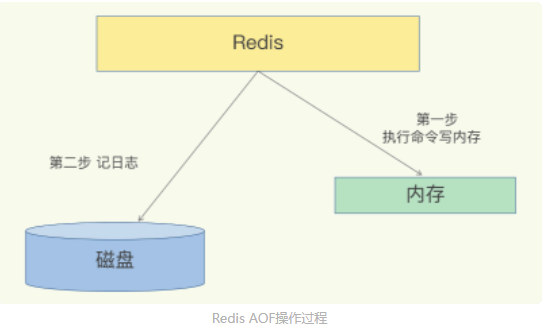
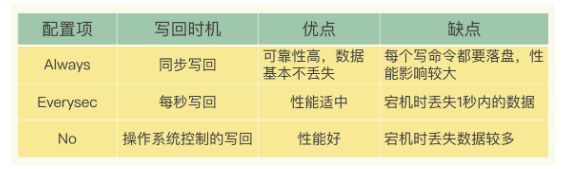

### 极客时间《Redis 核心技术与实战》课后思考与问题。

##### 整数数组和压缩列表在查找时间复杂度方面并没有很大的优势，那为什么 Redis 还会把它们作为底层数据结构呢？

1、内存利用率，数组和压缩列表都是非常紧凑的数据结构，它比链表占用的内存要更少。Redis是内存数据库，大量数据存到内存中，此时需要做尽可能的优化，提高内存的利用率。

 2、数组对CPU高速缓存支持更友好，所以Redis在设计时，集合数据元素较少情况下，默认采用内存紧凑排列的方式存储，同时利用CPU高速缓存不会降低访问速度。当数据元素超过设定阈值后，避免查询时间复杂度太高，转为哈希和跳表数据结构存储，保证查询效率。

##### 为什么单线程的 Redis 能那么快？

我们通常说，Redis 是单线程，**主要是指 Redis 的网络 IO 和键值对读写是由一个线程来完成的，这也是 Redis 对外提供键值存储服务的主要流程**。但 **Redis 的其他功能，比如持久化、异步删除、集群数据同步等，其实是由额外的线程执行的**。

所以，严格来说，Redis 并不是单线程，但是我们一般把 Redis 称为单线程高性能，这样显得“酷”些。接下来，我也会把 Redis 称为单线程模式。

原因：一方面，**Redis 的大部分操作在内存上完成，再加上它采用了高效的数据结构**，例如哈希表和跳表，这是它实现高性能的一个重要原因。另一方面，**就是 Redis 采用了多路复用机制，使其在网络 IO 操作中能并发处理大量的客户端请求，实现高吞吐率**。

##### Redis 当作缓存使用，宕机问题

缓存应用场景，因为它把后端数据库中的数据存储在内存中，然后直接从内存中读取数据，响应速度会非常快，**一旦服务器宕机，内存中的数据将全部丢失**。

宕机后如何解决？从后端数据库恢复这些数据，但是这个方式存在两个问题：一是，需要频繁访问数据库，会给数据库带来巨大的压力；二是，这些数据是从慢速数据库中读取出来的，性能肯定比不上从 Redis 中读取，导致使用这些数据的应用程序响应变慢。实现数据的持久化，需要避免从后端数据库中进行恢复。

Redis 的持久化主要有两大机制，即 **AOF（Append Only File）日志和 RDB（ Redis DataBase） 快照**。

如果先记日志再执行命令的话，日志中就有可能记录了错误的命令，Redis 在使用日志恢复数据时，就可能会出错。而写后日志这种方式，就是先让系统执行命令，只有命令能执行成功，才会被记录到日志中，否则，系统就会直接向客户端报错。

所以，Redis 使用写后日志这一方式的一大好处是，**可以避免出现记录错误命令的情况**。AOF 还有一个好处：它是在命令执行后才记录日志，**所以不会阻塞当前的写操作**。

潜在风险：

首先，**如果刚执行完一个命令，还没有来得及记日志就宕机了，那么这个命令和相应的数据就有丢失的风险**。如果此时 Redis 是用作缓存，还可以从后端数据库重新读入数据进行恢复，但是，如果 Redis 是直接用作数据库的话，此时，因为命令没有记入日志，所以就无法用日志进行恢复了。

其次，**AOF 虽然避免了对当前命令的阻塞，但可能会给下一个操作带来阻塞风险**。这是因为，AOF 日志也是在主线程中执行的，如果在把日志文件写入磁盘时，磁盘写压力大，就会导致写盘很慢，进而导致后续的操作也无法执行了。

**这两个风险都是和 AOF 写回磁盘的时机相关的**。

###### 三种写回策略

- **Always**，**同步写回**：每个写命令执行完，立马同步地将日志写回磁盘；
- **Everysec**，**每秒写回**：每个写命令执行完，只是先把日志写到 AOF 文件的内存缓冲区，每隔一秒把缓冲区中的内容写入磁盘；
- **No**，**操作系统控制的写回**：每个写命令执行完，只是先把日志写到 AOF 文件的内存缓冲区，由操作系统决定何时将缓冲区内容写回磁盘

针对避免主线程阻塞和减少数据丢失问题，这三种写回策略都无法做到两全其美。我们来分析下其中的原因。

- “同步写回”可以做到基本不丢数据，但是它在每一个写命令后都有一个慢速的落盘操作，不可避免地会影响主线程性能；
- 虽然“操作系统控制的写回”在写完缓冲区后，就可以继续执行后续的命令，但是落盘的时机已经不在 Redis 手中了，只要 AOF 记录没有写回磁盘，一旦宕机对应的数据就丢失了；
- “每秒写回”采用一秒写回一次的频率，避免了“同步写回”的性能开销，虽然减少了对系统性能的影响，但是如果发生宕机，上一秒内未落盘的命令操作仍然会丢失。所以，这只能算是，在避免影响主线程性能和避免数据丢失两者间取了个折中。

