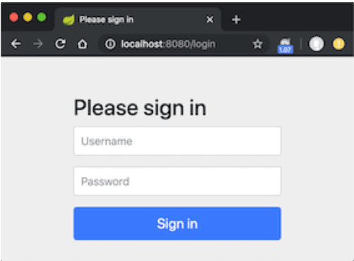

### JWT 使用

系统登录需要使用token和设置token的过期时间，所以使用了jwt来作为token生成。

```java
package com.etwealth.hsicms.security.config;

import io.jsonwebtoken.Claims;
import io.jsonwebtoken.Jwts;
import io.jsonwebtoken.SignatureAlgorithm;
import io.jsonwebtoken.io.Decoders;
import io.jsonwebtoken.security.Keys;
import org.springframework.beans.factory.annotation.Value;
import org.springframework.security.core.userdetails.UserDetails;
import org.springframework.stereotype.Service;

import java.security.Key;
import java.util.Date;
import java.util.HashMap;
import java.util.Map;
import java.util.function.Function;

@Service
public class JwtService {

    private static final String SECRET_KEY = "28472B4B6250655368566D597133743677397A244326462948404D635166546A";
    @Value("${app.token.timeout:30}")
    private Integer timeout;

    public String extractUsername(String token) {
        return extractClaim(token,Claims::getSubject);
    }

    public <T> T extractClaim(String token, Function<Claims,T> claimsResolver){
        final Claims claims = extractAllClaims(token);
        return claimsResolver.apply(claims);
    }

    public String generateToken(UserDetails userDetails){
        return generateToken(new HashMap<>(),userDetails);
    }

    public String generateToken(
            Map<String,Object> extraClaims,
            UserDetails userDetails
    ){
        return Jwts
                .builder()
                .setClaims(extraClaims)
                .setSubject(userDetails.getUsername())
                .setIssuedAt(new Date(System.currentTimeMillis()))
                .setExpiration(new Date(System.currentTimeMillis() + 1000L * 60 * timeout))
                .signWith(getSignInKey(), SignatureAlgorithm.HS256)
                .compact();
    }

    public boolean isTokenValid(String token, UserDetails userDetails){
        final String username = extractUsername(token);
        return (username.equals(userDetails.getUsername())) && !isTokenExpired(token);
    }

    private boolean isTokenExpired(String token) {
        return extractExpiration(token).before(new Date());
    }

    private Date extractExpiration(String token) {
        return extractClaim(token,Claims::getExpiration);
    }

    private Claims extractAllClaims(String token){
        return Jwts
                .parserBuilder()
                .setSigningKey(getSignInKey())
                .build()
                .parseClaimsJws(token)
                .getBody();
    }

    private Key getSignInKey() {
        byte[] keyBytes = Decoders.BASE64.decode(SECRET_KEY);
        return Keys.hmacShaKeyFor(keyBytes);
    }
}
```

#### JWT 验证

```java
@Component
@RequiredArgsConstructor
public class JwtAuthenticationFilter extends OncePerRequestFilter {
    private final JwtService jwtService;
    private final UserDetailsService userDetailsService;

    @Override
    protected void doFilterInternal(
            @NonNull HttpServletRequest request,
            @NonNull HttpServletResponse response,
            @NonNull FilterChain filterChain
    ) throws ServletException, IOException {
        final String authHeader = request.getHeader("Authorization");
        final String jwt;
        final String userEmail;
        if (authHeader == null || !authHeader.startsWith("Bearer ")) {
            filterChain.doFilter(request, response);
            return;
        }
        jwt = authHeader.substring(7);
        userEmail = jwtService.extractUsername(jwt);

        if (userEmail != null && SecurityContextHolder.getContext().getAuthentication() == null) {
            UserDetails userDetails = this.userDetailsService.loadUserByUsername(userEmail);
            if (jwtService.isTokenValid(jwt, userDetails)) {
                UsernamePasswordAuthenticationToken authToken = new UsernamePasswordAuthenticationToken(
                        userDetails,
                        null,
                        userDetails.getAuthorities()
                );
                authToken.setDetails(
                        new WebAuthenticationDetailsSource().buildDetails(request)
                );
                SecurityContextHolder.getContext().setAuthentication(authToken);
            }
        }
        filterChain.doFilter(request, response);
    }
}
```

当通过 `filterChain.doFilter(request, response);` 代码后，也就是是说Bearer为null了，会走到这个类的 commence 方法。

> https://blog.csdn.net/hou_ge/article/details/120435303
>
> AuthenticationEntryPoint 接口介绍：被ExceptionTranslationFilter用来作为认证方案的入口，即当用户请求处理过程中遇见认证异常时，被异常处理器（ExceptionTranslationFilter）用来开启特定的认证流程。
>
> 在AuthenticationEntryPoint 接口中，只有一个commence()方法，用来开启认证方案。其中，request是遇到了认证异常的用户请求，response 是将要返回给用户的响应，authException 请求过程中遇见的认证异常。 AuthenticationEntryPoint 实现类，可以修改响应头属性信息或开启新的认证流程。

###### `JwtAuthenticationEntryPoint`

```java
@Component
public class JwtAuthenticationEntryPoint implements AuthenticationEntryPoint {
    @Override
    public void commence(HttpServletRequest request, HttpServletResponse response, AuthenticationException authException) throws IOException, ServletException {

        /*if(request.getRequestURI().contains("/web")){
            response.sendRedirect("/hsicms/web/login");
            return;
        }*/

        response.setCharacterEncoding("UTF-8");
        response.setContentType("application/json");
        BadTokenResponse badTokenResponse = new BadTokenResponse();
        badTokenResponse.setReturnCode(ErrorCode.SessionExpired);
        badTokenResponse.setRespMsg("invalid token or token expired");
        ObjectMapper mapper = new ObjectMapper();
        mapper.setSerializationInclusion(JsonInclude.Include.NON_DEFAULT);
        response.getWriter().println(mapper.writeValueAsString(badTokenResponse));
        response.getWriter().flush();


    }
}
```

###### `SecurityConfiguration` 

```java
import lombok.RequiredArgsConstructor;
import org.springframework.context.annotation.Bean;
import org.springframework.context.annotation.Configuration;
import org.springframework.security.authentication.AuthenticationProvider;
import org.springframework.security.config.Customizer;
import org.springframework.security.config.annotation.web.builders.HttpSecurity;
import org.springframework.security.config.annotation.web.configuration.EnableWebSecurity;
import org.springframework.security.config.http.SessionCreationPolicy;
import org.springframework.security.web.SecurityFilterChain;
import org.springframework.security.web.authentication.UsernamePasswordAuthenticationFilter;

@Configuration
@EnableWebSecurity
@RequiredArgsConstructor
public class SecurityConfiguration {
    private final JwtAuthenticationFilter jwtAuthFilter;
    private final AuthenticationProvider authenticationProvider;

    private final String[] AUTH_WHITELIST = {
            "/web/**",
            "/api/auth/**",
            "/loginUser/login"
    };

    private final JwtAuthenticationEntryPoint jwtAuthenticationEntryPoint;

    /* SecurityFilterChain 解释
     * Defines a filter chain which is capable of being matched against an
 * {@code HttpServletRequest}. in order to decide whether it applies to that request.
 * <p>
 * Used to configure a {@code FilterChainProxy}.
    */
    @Bean
    public SecurityFilterChain securityFilterChain(HttpSecurity http) throws Exception {
        http
                .csrf()
                .disable()
                .exceptionHandling()
                .authenticationEntryPoint(jwtAuthenticationEntryPoint)
                .and()
                .authorizeHttpRequests()
                .requestMatchers(AUTH_WHITELIST)
                .permitAll()
                .anyRequest()
                .authenticated()
                .and()
                .sessionManagement()
                .sessionCreationPolicy(SessionCreationPolicy.ALWAYS)


                .and().formLogin().loginPage("/web/login")
                .usernameParameter("userID")
                .passwordParameter("dPassword")
                .loginProcessingUrl("/loginUser/login")
                .defaultSuccessUrl("/web/backOffice",true)


                .and()
                .rememberMe(Customizer.withDefaults())
                .authenticationProvider(authenticationProvider)
                .addFilterBefore(jwtAuthFilter, UsernamePasswordAuthenticationFilter.class);


                
        return http.build();
    }
}
```

### spring security

博客 https://www.cnblogs.com/demingblog/p/10874753.html 摘抄。

#### 简单案例

##### 一个不受保护的例子

假设我们现在创建好了一个`springboot`的web应用：

```java
@Controller
public class AppController {

    @RequestMapping("/hello")
    @ResponseBody
    String home() {
        return "Hello ,spring security!";
    }
}
```

我们启动应用，假设端口是8080，那么当我们在浏览器访问`http://localhost:8080/hello`的时候可以在浏览器看到`Hello ,spring security!`。

##### 加入 spring security 保护应用

此时，/hello 是可以自由访问的。假设我们需要具体有某个角色的用户才能访问的时候，我们可以引入spring security来进行保护。加入如下依赖，并重启应用。

```xml
<dependency>
    <groupId>org.springframework.boot</groupId>
    <artifactId>spring-boot-starter-security</artifactId>
</dependency>
```

再次访问`/hello`，我们可以得到一个页面，如下：



说明spring security 已经起作用了，我们需要登陆才能访问。

```html
<html><head><title>Login Page</title></head><body onload='document.f.username.focus();'>
<h3>Login with Username and Password</h3><form name='f' action='/login' method='POST'>
<table>
	<tr><td>User:</td><td><input type='text' name='username' value=''></td></tr>
	<tr><td>Password:</td><td><input type='password' name='password'/></td></tr>
	<tr><td colspan='2'><input name="submit" type="submit" value="Login"/></td></tr>
	<input name="_csrf" type="hidden" value="635780a5-6853-4fcd-ba14-77db85dbd8bd" />
</table>
</form></body></html>
```

上面的html中有个form ，其中`action="/login"`，这个`/login`依然是`spring security`提供的。form表单提交了三个数据：

- username 用户名
- password 密码
- _csrf CSRF保护方面的内容，暂时先不展开解释

为了登录系统，我们需要知道用户名密码，spring security 默认的用户名是user，spring security启动的时候会生成默认密码（在启动日志中可以看到）。本例，我们指定一个用户名密码，在配置文件中加入如下内容：

默认的登陆用户是`user`默认的登陆密码我们可以去控制台看下日志。会看到如下信息：

```tex
2021-01-19 22:29:59.325  INFO 83794 --- [           main] .s.s.UserDetailsServiceAutoConfiguration : 

Using generated security password: cc7d4605-75db-49aa-aa9a-b95953b5c1e8

2021-01-19 22:29:59.424  INFO 83794 --- [           main] o.s.s.web.DefaultSecurityFilterChain     : 
```

我们在登陆，输入`user`和密码`cc7d4605-75db-49aa-aa9a-b95953b5c1e8`。可以登录成功，并能访问/hello的内容。

##### 自定义 security 配置

上面我们看到默认情况下，spring为我们提供了一个「httpBasic」模式的简单登陆页面，并在控制台输出了密码（这个密码每次启动都是不一样的）。如果我们想用自己的定义的账号密码，则需要改配置。如下：

我们新建一个类`SecurityConfiguration`,并加入一些代码，如下所示：

```java
@Configuration
@EnableWebSecurity
public class SecurityConfiguration extends WebSecurityConfigurerAdapter {

	@Override
	protected void configure(HttpSecurity http) throws Exception {
		http
				.authorizeRequests()
				.anyRequest().authenticated()
				.and()
				.formLogin().and()
				.httpBasic();
	}
  
   @Override
    protected void configure(AuthenticationManagerBuilder auth) throws Exception {
      auth.
        inMemoryAuthentication()
        .withUser("spring")
        .password("{noop}123456").roles("USER");

    }
}
```

上面的配置其实和默认情况的配置几乎一样，只是这里定义了一个用户`spring`，和密码`123456` 。（说明：密码前面的**{noop}表示的是指定的PasswordEncoder**）此时我们启动项目，便可以使用spring这个用户及123456密码登录了。

##### 角色-资源 访问控制

通常情况下，我们需要实现“特定资源只能由特定角色访问”的功能。假设我们的系统有如下两个角色：

- ADMIN 可以访问所有资源
- USER 只能访问特定资源

现在我们给系统增加“/product” 代表商品信息方面的资源（USER可以访问）；增加"/admin"代码管理员方面的资源（USER不能访问）。代码如下：

```java
@Controller
@RequestMapping("/product")
public class ProductTestController {

	@RequestMapping("/info")
	@ResponseBody
	public String productInfo(){
		return " some product info ";
	}
}
-------------------------------------------
@Controller
@RequestMapping("/admin")
public class AdminTestController {

	@RequestMapping("/home")
	@ResponseBody
	public String productInfo(){
		return " admin home page ";
	}
}
```

现在我们希望实现：admin可以访问所有页面，而普通用户只能方法/product页面。配置如下

```java
@Configuration
@EnableWebSecurity
public class SecurityConfiguration extends WebSecurityConfigurerAdapter {

    @Override
    protected void configure(HttpSecurity http) throws Exception {
        http
                .authorizeRequests()
                    .antMatchers("/product/**").hasRole("USER")
                    .antMatchers("/admin/**").hasRole("ADMIN")
                .anyRequest().authenticated()
                .and()
                .formLogin().and()
                .httpBasic();
     }

    @Override
    protected void configure(AuthenticationManagerBuilder auth) throws Exception {
        auth
            .inMemoryAuthentication()
            .withUser("admin").password("{noop}adminpass").roles("ADMIN", "USER") 
            .and()
            .withUser("spring").password("{noop}123456").roles("USER");

     }
}
```

这里，我们增加了 管理员（admin，密码adminpass），以及普通用户（spring,密码123456）

同时，我们增加了链接对应的角色配置。上面的配置，我们可以知道：

- 使用 USER角色的用户登录，只能访问/product/**
- 使用 ADMIN角色的用户登录，可以访问所有。

下面来验证一下普通用户登录，重启项目，在浏览器中输入：http://localhost:8080/admin/home。同样，我们会到达登录页面，我们输入用户名`spring`,密码也为`123456` 结果错误页面了，拒绝访问了，信息为：

```lua
There was an unexpected error (type=Forbidden, status=403).
Forbidden
```

我们把浏览器中的uri修改成：`/product/info`，结果访问成功。可以看到`some product info`。说明 spring这个USER角色只能访问 product/** ,这个结果与我们预期一致。

再来验证一下管理员用户登录，重启浏览器之后，输入http://localhost:8080/admin/home。在登录页面中输入用户名admin，密码adminpass，提交之后，可以看到`admin home page `,说明访问管理员资源了。我们再将浏览器uri修改成`/product/info`,刷新之后，也能看到`some product info`,说明 ADMIN角色的用户可以访问所有资源，这个也和我们的预期一致。

##### 获取当前登录用户信息

```java
@RequestMapping("/info")
@ResponseBody
public String productInfo(){
    String currentUser = "";
    Object principl = SecurityContextHolder.getContext().getAuthentication().getPrincipal();
    if(principl instanceof UserDetails) {
        currentUser = ((UserDetails)principl).getUsername();
    }else {
        currentUser = principl.toString();
    }
    return " some product info,currentUser is: "+currentUser;
}
```

这里，我们通过`SecurityContextHolder`来获取了用户信息，并拼接成字符串输出。重启项目，在浏览器访问http://localhost:8080/product/info. 使用 admin的身份登录，可以看到浏览器显示`some product info,currentUser is: admin`。

##### 项目中使用的自定义配置

项目中使用的配置有点不一样，但是实际上都是同一个类`HttpSercurity`配置的一些配置。

其中一个配置类：

```java
@Configuration
@RequiredArgsConstructor
public class ApplicationConfig {

    private final LoginUserRepository loginUserRepository;

    @Value("${upload.get.folderPath}")
    private String uploadFolderPath;

    @Bean
    public UserDetailsService userDetailsService() {
        return username -> loginUserRepository.findById(new LoginUserKey(username))
                .orElseThrow(() -> new UsernameNotFoundException("User not found"));
    }

    @Bean
    public AuthenticationProvider authenticationProvider() {
        DaoAuthenticationProvider authProvider = new DaoAuthenticationProvider();
        authProvider.setUserDetailsService(userDetailsService());
        authProvider.setPasswordEncoder(passwordEncoder());
        authProvider.setHideUserNotFoundExceptions(false);
        return authProvider;
    }

    @Bean
    public AuthenticationManager authenticationManager(AuthenticationConfiguration config) throws Exception {
        return config.getAuthenticationManager();
    }

    @Bean
    public PasswordEncoder passwordEncoder() {
        return new BCryptPasswordEncoder();
    }

    public String getUploadFolderPath() throws UnsupportedEncodingException {
        return URLDecoder.decode(uploadFolderPath, "UTF-8");
    }
}
```

上面配置了 `PasswordEncoder` 、 `AuthenticationManager`、`AuthenticationProvider`、`UserDetailsService` 这些 bean，会在下面的这个配置类里面用上。

```java
@Configuration
@EnableWebSecurity
@RequiredArgsConstructor
public class SecurityConfiguration {
    private final JwtAuthenticationFilter jwtAuthFilter;
    private final AuthenticationProvider authenticationProvider;

    private final String[] AUTH_WHITELIST = {
            "/web/**",
            "/api/auth/**",
            "/loginUser/login"
    };

    private final JwtAuthenticationEntryPoint jwtAuthenticationEntryPoint;

    @Bean
    public SecurityFilterChain securityFilterChain(HttpSecurity http) throws Exception {
        http
                .csrf()
                .disable()
                .exceptionHandling()
                .authenticationEntryPoint(jwtAuthenticationEntryPoint)
                .and()
                .authorizeHttpRequests()
                .requestMatchers(AUTH_WHITELIST)
                .permitAll()
                .anyRequest()
                .authenticated()
                .and()
                .sessionManagement()
                .sessionCreationPolicy(SessionCreationPolicy.ALWAYS)


                .and().formLogin().loginPage("/web/login")
                .usernameParameter("userID")
                .passwordParameter("dPassword")
                .loginProcessingUrl("/loginUser/login")
                .defaultSuccessUrl("/web/backOffice",true)


                .and()
                .rememberMe(Customizer.withDefaults())
                .authenticationProvider(authenticationProvider)
                .addFilterBefore(jwtAuthFilter, UsernamePasswordAuthenticationFilter.class);


                
        return http.build();
    }
}
```

`JwtAuthenticationFilter` 类，用来验证jwt的token

```java
@Component
@RequiredArgsConstructor
public class JwtAuthenticationFilter extends OncePerRequestFilter {
    private final JwtService jwtService;
    private final UserDetailsService userDetailsService;

    @Override
    protected void doFilterInternal(
            @NonNull HttpServletRequest request,
            @NonNull HttpServletResponse response,
            @NonNull FilterChain filterChain
    ) throws ServletException, IOException {
        final String authHeader = request.getHeader("Authorization");
        final String jwt;
        final String userEmail;
        if (authHeader == null || !authHeader.startsWith("Bearer ")) {
            filterChain.doFilter(request, response);
            return;
        }
        jwt = authHeader.substring(7);
        userEmail = jwtService.extractUsername(jwt);

        if (userEmail != null && SecurityContextHolder.getContext().getAuthentication() == null) {
            UserDetails userDetails = this.userDetailsService.loadUserByUsername(userEmail);
            if (jwtService.isTokenValid(jwt, userDetails)) {
                UsernamePasswordAuthenticationToken authToken = new UsernamePasswordAuthenticationToken(
                        userDetails,
                        null,
                        userDetails.getAuthorities()
                );
                authToken.setDetails(
                        new WebAuthenticationDetailsSource().buildDetails(request)
                );
                SecurityContextHolder.getContext().setAuthentication(authToken);
            }
        }
        filterChain.doFilter(request, response);
    }
}
```

#### 核心组件

##### SecurityContext

安全上下文，用户通过Spring Security 的校验之后，验证信息存储在SecurityContext中，SecurityContext的接口定义如下：

```java
public interface SecurityContext extends Serializable {

   /**
    * Obtains the currently authenticated principal, or an authentication request token.
    * @return the <code>Authentication</code> or <code>null</code> if no authentication
    * information is available
    */
   Authentication getAuthentication();

   /**
    * Changes the currently authenticated principal, or removes the authentication
    * information.
    * @param authentication the new <code>Authentication</code> token, or
    * <code>null</code> if no further authentication information should be stored
    */
   void setAuthentication(Authentication authentication);
}
```

可以看到`SecurityContext`接口只定义了两个方法，实际上其主要作用就是获取`Authentication`对象。

##### SecurityContextHolder

```java
/**
 * Associates a given {@link SecurityContext} with the current execution thread.
 * <p>
 * This class provides a series of static methods that delegate to an instance of
 * {@link org.springframework.security.core.context.SecurityContextHolderStrategy}. The
 * purpose of the class is to provide a convenient way to specify the strategy that should
 * be used for a given JVM. This is a JVM-wide setting, since everything in this class is
 * <code>static</code> to facilitate ease of use in calling code.
 * <p>
 * To specify which strategy should be used, you must provide a mode setting. A mode
 * setting is one of the three valid <code>MODE_</code> settings defined as
 * <code>static final</code> fields, or a fully qualified classname to a concrete
 * implementation of
 * {@link org.springframework.security.core.context.SecurityContextHolderStrategy} that
 * provides a public no-argument constructor.
 * <p>
 * There are two ways to specify the desired strategy mode <code>String</code>. The first
 * is to specify it via the system property keyed on {@link #SYSTEM_PROPERTY}. The second
 * is to call {@link #setStrategyName(String)} before using the class. If neither approach
 * is used, the class will default to using {@link #MODE_THREADLOCAL}, which is backwards
 * compatible, has fewer JVM incompatibilities and is appropriate on servers (whereas
 * {@link #MODE_GLOBAL} is definitely inappropriate for server use).
 *
 * @author Ben Alex
 * @author Rob Winch
 *
 */
public class SecurityContextHolder {
    public static final String MODE_THREADLOCAL = "MODE_THREADLOCAL";

	public static final String MODE_INHERITABLETHREADLOCAL = "MODE_INHERITABLETHREADLOCAL";

	public static final String MODE_GLOBAL = "MODE_GLOBAL";

	private static final String MODE_PRE_INITIALIZED = "MODE_PRE_INITIALIZED";
    ...
}
```

SecurityContextHolder看名知义，是一个holder,用来hold住SecurityContext实例的。在典型的web应用程序中，用户登录一次，然后由其会话ID标识。服务器缓存持续时间会话的主体信息。在Spring Security中，在请求之间存储`SecurityContext`的责任落在`SecurityContextPersistenceFilter`上，默认情况下，该上下文将上下文存储为HTTP请求之间的`HttpSession`属性。它会为每个请求恢复上下文`SecurityContextHolder`，并且最重要的是，在请求完成时清除`SecurityContextHolder`。SecurityContextHolder是一个类，他的功能方法都是静态的（static）。

SecurityContextHolder可以设置指定JVM策略（SecurityContext的存储策略），这个策略有三种：

- MODE_THREADLOCAL：SecurityContext 存储在线程中。
- MODE_INHERITABLETHREADLOCAL：SecurityContext 存储在线程中，但子线程可以获取到父线程中的 SecurityContext。
- MODE_GLOBAL：SecurityContext 在所有线程中都相同。

SecurityContextHolder默认使用MODE_THREADLOCAL模式，即存储在当前线程中。在spring security应用中，我们通常能看到类似如下的代码：

` SecurityContextHolder.getContext().setAuthentication(token);`

其作用就是存储当前认证信息。

##### Authentication

authentication 直译过来是“认证”的意思，在Spring Security 中Authentication用来表示当前用户是谁，一般来讲你可以理解为authentication就是一组用户名密码信息。Authentication也是一个接口，其定义如下：

```java
/**
 * Represents the token for an authentication request or for an authenticated principal
 * once the request has been processed by the
 * {@link AuthenticationManager#authenticate(Authentication)} method.
 * <p>
 * Once the request has been authenticated, the <tt>Authentication</tt> will usually be
 * stored in a thread-local <tt>SecurityContext</tt> managed by the
 * {@link SecurityContextHolder} by the authentication mechanism which is being used. An
 * explicit authentication can be achieved, without using one of Spring Security's
 * authentication mechanisms, by creating an <tt>Authentication</tt> instance and using
 * the code:
 *
 * <pre>
 * SecurityContext context = SecurityContextHolder.createEmptyContext();
 * context.setAuthentication(anAuthentication);
 * SecurityContextHolder.setContext(context);
 * </pre>
 *
 * Note that unless the <tt>Authentication</tt> has the <tt>authenticated</tt> property
 * set to <tt>true</tt>, it will still be authenticated by any security interceptor (for
 * method or web invocations) which encounters it.
 * <p>
 * In most cases, the framework transparently takes care of managing the security context
 * and authentication objects for you.
 *
 * @author Ben Alex
 */
public interface Authentication extends Principal, Serializable {

	Collection<? extends GrantedAuthority> getAuthorities();
	Object getCredentials();
	Object getDetails();
	Object getPrincipal();
	boolean isAuthenticated();
	void setAuthenticated(boolean isAuthenticated) throws IllegalArgumentException;
}
```

- `getAuthorities`: 获取用户权限，一般情况下获取到的是用户的角色信息。
- `getCredentials`: 获取证明用户认证的信息，通常情况下获取到的是密码等信息。
- `getDetails`: 获取用户的额外信息，（这部分信息可以是我们的用户表中的信息）
- `getPrincipal`: 获取用户身份信息，在未认证的情况下获取到的是用户名，在已认证的情况下获取到的是 UserDetails (UserDetails也是一个接口，里边的方法有getUsername,getPassword等)。
- `isAuthenticated`: 获取当前 Authentication 是否已认证。
- `setAuthenticated`: 设置当前 Authentication 是否已认证（true or false）。

##### UserDetails

```java
public interface UserDetails extends Serializable {

	Collection<? extends GrantedAuthority> getAuthorities();
	String getPassword();
	String getUsername();
	boolean isAccountNonExpired();
	boolean isAccountNonLocked();
	boolean isCredentialsNonExpired();
	boolean isEnabled();
}
```

- `getAuthorites`：获取用户权限，本质上是用户的角色信息。
- `getPassword`: 获取密码。
- `getUserName`: 获取用户名。
- `isAccountNonExpired`: 账户是否过期。
- `isAccountNonLocked`: 账户是否被锁定。
- `isCredentialsNonExpired`: 密码是否过期。
- `isEnabled`: 账户是否可用。

##### UserDetailsService

提到了`UserDetails`就必须得提到`UserDetailsService`, UserDetailsService也是一个接口，且只有一个方法`loadUserByUsername`，他可以用来获取UserDetails。

通常在spring security应用中，我们会自定义一个CustomUserDetailsService来实现UserDetailsService接口，并实现其`public UserDetails loadUserByUsername(final String login);`方法。我们在实现`loadUserByUsername`方法的时候，就可以通过查询数据库（或者是缓存、或者是其他的存储形式）来获取用户信息，然后组装成一个`UserDetails`,(通常是一个`org.springframework.security.core.userdetails.User`，它继承自UserDetails) 并返回。

在实现`loadUserByUsername`方法的时候，如果我们通过查库没有查到相关记录，需要抛出一个异常来告诉spring security来“善后”。这个异常是`org.springframework.security.core.userdetails.UsernameNotFoundException`。

##### AuthenticationManager

AuthenticationManager 是一个接口，它只有一个方法，接收参数为`Authentication`，其定义如下：

```java
public interface AuthenticationManager {
    Authentication authenticate(Authentication authentication)
			throws AuthenticationException;
}
```

AuthenticationManager 的作用就是校验`Authentication`,如果验证失败会抛出`AuthenticationException `异常。`AuthenticationException`是一个抽象类，因此代码逻辑并不能实例化一个AuthenticationException异常并抛出，实际上抛出的异常通常是其实现类，如`DisabledException`,`LockedException`,`BadCredentialsException`等。`BadCredentialsException`可能会比较常见，即密码错误的时候。

#### spring security 一些工作原理

##### spring security 在web应用中是基于filter的

我们可以得知，**spring security 在web应用中是基于filter的**。filter我们就很熟了，在没有struts,没有spring mvc之前，我们就是通过一个个servlet,一个个filter来实现业务功能的，通常我们会有多个filter，他们按序执行，一个执行完之后，调用filterChain中的下一个doFilter。Spring Security 在 Filter 中创建 Authentication 对象，并调用 AuthenticationManager 进行校验。

spring security 维护了一个filter chain，chain中的每一个filter都具有特定的责任，并根据所需的服务在配置总添加。filter的顺序很重要，因为他们之间存在依赖关系。spring security中有如下filter(按顺序的):

- ChannelProcessingFilter,因为它可能需要重定向到不同的协议。
- SecurityContextPersistenceFilter，可以在web请求开头的`SecurityContextHolder`中设置`SecurityContext`，并且`SecurityContext`的任何更改都可以复制到`HttpSession`当web请求结束时（准备好与下一个web请求一起使用）。
- ConcurrentSessionFilter，
- 身份验证处理-UsernamePasswordAuthenticationFilter,CasAuthenticationFilter,BasicAuthenticationFilter等。以便`SecurityContextHolder`可以修改为包含有效的`Authentication`请求令牌
- SecurityContextHolderAwareRequestFilter
- JaasApiIntegrationFilter
- RememberMeAuthenticationFilter，记住我服务处理
- AnonymousAuthenticationFilter，匿名身份处理，更新`SecurityContextHolder`
- ExceptionTranslationFilter，获任何Spring Security异常，以便可以返回HTTP错误响应或启动适当的`AuthenticationEntryPoint`
- FilterSecurityInterceptor，用于保护web URI并在访问被拒绝时引发异常

这里我们列举了几乎所有的spring security filter。正是这些filter完成了spring security的各种功能。目前我们只是知道了有这些filter，并不清楚他们是怎么集成到应用中的。在继续深入了解之前，我们需要了解一下`DelegatingFilterProxy`。

##### DelegatingFilterProxy

`DelegatingFilterProxy`是一个特殊的filter，存在于spring-web模块中。`DelegatingFilterProxy`通过继承`GenericFilterBean `使得自己变为了一个Filter（因为GenericFilterBean implements Filter）。它是一个Filter，其命名却以`proxy`结尾。非常有意思，为了了解其功能，我们看一下它的使用配置：

```xml
<filter>
    <filter-name>myFilter</filter-name>
    <filter-class>org.springframework.web.filter.DelegatingFilterProxy</filter-class>
</filter>
<filter-mapping>
    <filter-name>myFilter</filter-name>
    <url-pattern>/*</url-pattern>
</filter-mapping>
```

这个配置是我们使用web.xml配置Filter时做法。但是与普通的Filter不同的是`DelegatingFilterProxy`并没有实际的过滤逻辑，他会尝试寻找`filter-name`节点所配置的`myFilter`，并将过滤行为委托给`myFilter`来处理。这种方式能够利用Spring丰富的依赖注入工具和生命周期接口，因此`DelegatingFilterProxy`提供了`web.xml`与应用程序上下文之间的链接。非常有意思，可以慢慢体会。

##### spring security入口——springSecurityFilterChain

spring security的入口filter就是springSecurityFilterChain。在没有spring boot之前，我们要使用spring security的话，通常在web.xml中添加如下配置：

```xml
   <filter>
       <filter-name>springSecurityFilterChain</filter-name>
       <filter-class>org.springframework.web.filter.DelegatingFilterProxy</filter-class>
   </filter>

   <filter-mapping>
       <filter-name>springSecurityFilterChain</filter-name>
       <url-pattern>/*</url-pattern>
   </filter-mapping>
```

看到没，这里配置的是`DelegatingFilterProxy`。有了上面的介绍之后，我们就知道，它实际上会去找到filter-name节点中的Filter——**springSecurityFilterChain**，并将实际的过滤工作交给`springSecurityFilterChain`处理。

在使用spring boot之后，这一xml配置被Java类配置给代替了。我们前面在代码种使用过`@EnableWebSecurity` 注解，通过跟踪源码可以发现`@EnableWebSecurity`会加载`WebSecurityConfiguration`类,而`WebSecurityConfiguration`类中就有创建`springSecurityFilterChain`这个Filter的代码：

```java
 @Bean(name = {"springSecurityFilterChain"})
    public Filter springSecurityFilterChain() throws Exception {
        boolean hasConfigurers = this.webSecurityConfigurers != null && !this.webSecurityConfigurers.isEmpty();
        if (!hasConfigurers) {
            WebSecurityConfigurerAdapter adapter = (WebSecurityConfigurerAdapter)this.objectObjectPostProcessor.postProcess(new WebSecurityConfigurerAdapter() {
            });
            this.webSecurity.apply(adapter);
        }

        return (Filter)this.webSecurity.build();
    }
```

这里，我们介绍了spring security的入口——springSecurityFilterChain，也介绍了它的两种配置形式。但是，springSecurityFilterChain是谁，怎么起作用的，我们还不清楚，下面继续看。

##### FilterChainProxy 和SecurityFilterChain

在spring的官方文档中，我们可以发现这么一句话：

> Spring Security’s web infrastructure should only be used by delegating to an instance of `FilterChainProxy`. The security filters should not be used by themselves.
>
> spring security 的web基础设施（上面介绍的那一堆filter）只能通过委托给`FilterChainProxy`实例的方式来使用。而不能直接使用那些安全filter。

这句话似乎透漏了一个信号，上面说的入口`springSecurityFilterChain`其实就是`FilterChainProxy `,如果不信，调试一下 代码也能发现，确实就是`FilterChainProxy`。它的全路径名称是`org.springframework.security.web.FilterChainProxy`。打开其源码，第一行注释是这样：

> Delegates {@code Filter} requests to a list of Spring-managed filter beans.

所以，没错了。它就是`DelegatingFilterProxy`要找的人，它就是`DelegatingFilterProxy`要委托过滤任务的人。下面贴出其部分代码：

```java
public class FilterChainProxy extends GenericFilterBean {
   
   private List<SecurityFilterChain> filterChains;// 

   public FilterChainProxy(SecurityFilterChain chain) {
      this(Arrays.asList(chain));
   }

   public FilterChainProxy(List<SecurityFilterChain> filterChains) {
      this.filterChains = filterChains;
   }

   public void doFilter(ServletRequest request, ServletResponse response,
         FilterChain chain) throws IOException, ServletException {
         doFilterInternal(request, response, chain);
   }

   private void doFilterInternal(ServletRequest request, ServletResponse response,
         FilterChain chain) throws IOException, ServletException {

      FirewalledRequest fwRequest = firewall
            .getFirewalledRequest((HttpServletRequest) request);
      HttpServletResponse fwResponse = firewall
            .getFirewalledResponse((HttpServletResponse) response);
		
      List<Filter> filters = getFilters(fwRequest);

      if (filters == null || filters.size() == 0) {
         fwRequest.reset();
         chain.doFilter(fwRequest, fwResponse);
         return;
      }

      VirtualFilterChain vfc = new VirtualFilterChain(fwRequest, chain, filters);
      vfc.doFilter(fwRequest, fwResponse);
   }

   private List<Filter> getFilters(HttpServletRequest request) {
      for (SecurityFilterChain chain : filterChains) {
         if (chain.matches(request)) {
            return chain.getFilters();
         }
      }
      return null;
   }

}
```

可以看到，里边有个`SecurityFilterChain`的集合。这个才是众多security filter藏身之处，doFilter的时候会从SecurityFilterChain取出第一个匹配的Filter集合并返回。

##### 小结

说到这里，可能有点模糊了。这里小结一下，梳理一下。

- spring security 的核心是基于filter
- 入口filter是springSecurityFilterChain(它会被DelegatingFilterProxy委托来执行过滤任务)
- springSecurityFilterChain实际上是`FilterChainProxy` （一个filter）
- `FilterChainProxy`里边有一个`SecurityFilterChain`集合，doFIlter的时候会从其中取。

到这里，思路清楚多了，现在还不知道`SecurityFilterChain`是怎么来的。下面介绍。

##### 再说SecurityFilterChain

前面我们介绍了springSecurityFilterChain，它是由xml配置的，或者是由`@EnableWebSecurity`注解的作用下初始化的（@Import({WebSecurityConfiguration.class））。具体是在WebSecurityConfiguration类中。上面我们贴过代码，你可以返回看，这里再次贴出删减版：

```java
   @Bean( name = {"springSecurityFilterChain"})
    public Filter springSecurityFilterChain() throws Exception {
        // 删除部分代码
        return (Filter)this.webSecurity.build();
    }
```

最后一行，发现`webSecurity.build()` 产生了`FilterChainProxy`。因此，推断SecurityFilterChain就是webSecurity里边弄的。贴出源码：

```java
public final class WebSecurity extends
      AbstractConfiguredSecurityBuilder<Filter, WebSecurity> implements
      SecurityBuilder<Filter>, ApplicationContextAware {
    
    @Override
	protected Filter performBuild() throws Exception {
		int chainSize = ignoredRequests.size() + securityFilterChainBuilders.size();
        // 我们要找的 securityFilterChains
		List<SecurityFilterChain> securityFilterChains = new ArrayList<SecurityFilterChain>(
				chainSize);
		for (RequestMatcher ignoredRequest : ignoredRequests) {
			securityFilterChains.add(new DefaultSecurityFilterChain(ignoredRequest));
		}
		for (SecurityBuilder<? extends SecurityFilterChain> securityFilterChainBuilder : securityFilterChainBuilders) {
			securityFilterChains.add(securityFilterChainBuilder.build());
		}
        // 创建 FilterChainProxy  ，传入securityFilterChains
		FilterChainProxy filterChainProxy = new FilterChainProxy(securityFilterChains);
		if (httpFirewall != null) {
			filterChainProxy.setFirewall(httpFirewall);
		}
		filterChainProxy.afterPropertiesSet();

		Filter result = filterChainProxy;
		postBuildAction.run();
		return result;
	}
}
```

至此，我们清楚了，spring security 是怎么在spring web应用中工作的了。具体的细节就是执行filter里的代码了，这里不再继续深入了。我们的目的是摸清楚他是怎么工作的，大致的脉路是怎样，目前整理的内容已经达到这个目的了。


### Spring Security 的一些实战

下面开始一些实战使用spring security 的实例。依然依托开篇的例子，并在此基础上调整。

#### 通过数据库查询,存储用户和角色实现安全认证

开篇的例子中，我们使用了内存用户角色来演示登录认证。但是实际项目我们肯定是通过数据库完成的。实际项目中，我们可能会有3张表：用户表，角色表，用户角色关联表。当然，不同的系统会有不同的设计，不一定非得是这样的三张表。本例演示的意义在于：如果我们想在已有项目中增加spring security的话，就需要调整登录了。主要是自定义`UserDetailsService`,此外，可能还需要处理密码的问题，因为spring并不知道我们怎么加密用户登录密码的。这时，我们可能需要自定义`PasswordEncoder`，下面也会提到。

#### 添加spring-data-jpa , 创建数据表，并添加数据

继续完善开篇的项目，现在给项目添加`spring-data-jpa`，并使用MySQL数据库。因此在POM文件中加入如下配置：

```xml
<dependency>
    <groupId>org.springframework.boot</groupId>
    <artifactId>spring-boot-starter-data-jpa</artifactId>
</dependency>
<dependency>
    <groupId>mysql</groupId>
    <artifactId>mysql-connector-java</artifactId>
</dependency>
```

在application.properties文件中加入数据库连接信息：

```xml
spring.datasource.url=jdbc:mysql://localhost:3306/yourDB?useUnicode=true&characterEncoding=UTF-8
spring.datasource.username=dbuser
spring.datasource.password=******
spring.datasource.driver-class-name=com.mysql.jdbc.Driver
```

这里，为了简单方便演示，我们只创建一张表，字段如下：

```java
@Entity
public class User implements java.io.Serializable{

	@Id
	@Column
	private Long id;
	@Column
	private String login;
	@Column
	private String password;
	@Column
	private String role;
    // 省略get set 等
}
```

然后我们添加2条数据，如下：

| id   | login  | password  | role       |
| ---- | ------ | --------- | ---------- |
| 1    | spring | 123456    | USER       |
| 2    | admin  | adminpass | ADMIN,USER |

密码这里都是使用了`NoOpPasswordEncoder` 需在`SecurityConfiguration`中加入配置，后面会贴。

#### 自定义UserDetailsService

前面我们提到过，UserDetailsService，spring security在认证过程中需要查找用户，会调用UserDetailsService的loadUserByUsername方法得到一个UserDetails，下面我们来实现他。代码如下：

```java
@Component("userDetailsService")
public class CustomUserDetailsService implements UserDetailsService {

    @Autowired
    UserRepository userRepository;

    private GrantedAuthority DEFAULT_ROLE = new SimpleGrantedAuthority("USER");

    @Override
    public UserDetails loadUserByUsername(String login) throws UsernameNotFoundException {
        // 1. 查询用户
        User userFromDatabase = userRepository.findOneByLogin(login);
        if (userFromDatabase == null) {
            //log.warn("User: {} not found", login);
            throw new UsernameNotFoundException("User " + login + " was not found in db");
        }
        // 2. 设置角色
        List<GrantedAuthority> grantedAuthorities = new ArrayList<>();
        String dbRole = userFromDatabase.getRole();
        if(StringUtils.isNullOrEmpty(dbRole)){
             grantedAuthorities.add(DEFAULT_ROLE);
        }else{
            String [] roles = dbRole.split(",");
            for (String r : roles){
                GrantedAuthority grantedAuthority = new SimpleGrantedAuthority(r);
                grantedAuthorities.add(grantedAuthority);
            }
        }

        return new org.springframework.security.core.userdetails.User(login,
                userFromDatabase.getPassword(), grantedAuthorities);
    }
}
```

这个方法做了2件事情，查询用户以及设置角色。现在我们来修改之前的`SecurityConfiguration`配置, 加入`CustomUserDetailsService`bean配置，如下：

```java
@Configuration
@EnableWebSecurity
public class SecurityConfiguration extends WebSecurityConfigurerAdapter {

    @Override
    protected void configure(HttpSecurity http) throws Exception {
        http
                .authorizeRequests()
                .antMatchers("/product/**").hasAuthority("USER")
                .antMatchers("/admin/**").hasAuthority("ADMIN")
                .anyRequest().authenticated()
                .and()
                .formLogin().and()
                .httpBasic();
     }

    @Override
    protected void configure(AuthenticationManagerBuilder auth) throws Exception {

        auth.userDetailsService(userDetailsService)// 设置自定义的userDetailsService
                .passwordEncoder(passwordEncoder());

     }

     @Autowired
     private UserDetailsService userDetailsService;

    @Bean
    public PasswordEncoder passwordEncoder() {
        //为了演示方便，我们使用NoOpPasswordEncoder（这个就是不加密）
        return NoOpPasswordEncoder.getInstance();
    }

}
```

#### 验证效果

上面我们自定义了`userDetailsService`,此时，spring security 在其作用流程中会调用，不出意外的话，重启系统，我们使用spring登录可以看到/product/info，但是不能看/admin/home。下面我们来重启项目验证一下。

先输入spring，以及错误密码，可以看到页面报错：`Bad credentials`。再输入spring ，以及正确密码123456，结果：`some product info,currentUser is: spring`

再将浏览器链接修改为/admin/home，结果显示：

```lua
There was an unexpected error (type=Forbidden, status=403).
Forbidden
```

这与我们的预期完全一致，至此，我们已经在项目中加入了spring security，并且能够通过查询数据库用户，角色信息交给spring security完成认证授权。（当然了，这里密码使用了明文，只是为了演示方便）

### spring security session 无状态

还记得我们开篇所举的例子吗？我们使用管理员账号密码登录之后，就可以访问/admin/home了，此时修改浏览器地址栏为/product/info之后刷新页面，仍然可以访问，说明认证状态被保持了；如果关闭浏览器重新输入/admin/home就会提示我们重新登录，这有点session的感觉。如果此时，我们将浏览器cookie禁用掉，你会发现登录之后自动跳转只会得到403，403是拒绝访问的意思，是没有权限的意思，说明这种情况下授权状态和session是挂钩的。即这时spring security使用了session。但是不是所有的系统都需要session，我们能让spring security不适用session吗？答案是可以！

使用spring security 我们可以准确控制session何时创建以及Spring Security如何与之交互：

- ***always*** – a session will always be created if one doesn’t already exist，没有session就创建。
- ***ifRequired*** – a session will be created only if required (**default**)，如果需要就创建（默认）。
- ***never*** – the framework will never create a session itself but it will use one if it already exists
- ***stateless*** – no session will be created or used by Spring Security 不创建不使用session

这里，我们要关注的是 stateless，通常称为**无状态**的。为啥要关注这个stateless无状态的情况的呢？因为目前，我们的应用基本都是前后端分离的应用。比方说，你的一套java api是给react前端、安卓端、IOS端 调用的。这个时候你还提什么session啊，这时候我们需要的是无状态，通常以一种token的方式来交互。

spring security 配置stateless 的方式如下，依然是修改我们之前定义的`SecurityConfiguration`:

```java
http
    .sessionManagement()
    .sessionCreationPolicy(SessionCreationPolicy.STATELESS)
```

### 前后端分离应用中自定义token整合spring security

上面我们提到了stateless，实际中我们的前后端分离项目都是无状态的，并没有登录状态保持，服务器通过客户端调用传递的token来识别调用者是谁。

通常我们的系统流程是这样的：

1. 客户端（react前端，IOS，安卓）调用“**登录接口**”获得一个包含token的响应（通常是个JSON，如 {"token":"abcd","expires":1234567890}）
2. 客户端获取数据，并携带 token参数。
3. 服务端根据token发现token过期/错误，返回"请登录"状态码
4. 服务器发现token正常，并解析出来是A，返回A的数据。
5. ……

如果我们想在spring security项目中使用自定义的token，那么我们需要思考下面的问题：

1. 怎么发token（即怎么登录？）
2. 发token怎么和spring security整合。
3. spring security怎么根据token得到授权认证信息。

下面从登录发token开始，这里需要使用到`UsernamePasswordAuthenticationToken`,以及`SecurityContextHolder`,代码如下：

```java
    @RequestMapping(value = "/authenticate",method = RequestMethod.POST)
    public Token authorize(@RequestParam String username, @RequestParam String password) {
        // 1 创建UsernamePasswordAuthenticationToken
        UsernamePasswordAuthenticationToken token 
                           = new UsernamePasswordAuthenticationToken(username, password);
        // 2 认证
        Authentication authentication = this.authenticationManager.authenticate(token);
        // 3 保存认证信息
        SecurityContextHolder.getContext().setAuthentication(authentication);
        // 4 加载UserDetails
        UserDetails details = this.userDetailsService.loadUserByUsername(username);
        // 5 生成自定义token
        return tokenProvider.createToken(details);
    }
    @Inject
    private AuthenticationManager authenticationManager;
```

上面代码中1,2,3,4步骤都是和spring security交互的。只有第5步是我们自己定义的，这里`tokenProvider`就是我们系统中token的生成方式（这个完全是个性化的，通常是个加密串，通常可能会包含用户信息，过期时间等）。其中的`Token`也是我们自定义的返回对象，其中包含token信息类似`{"token":"abcd","expires":1234567890}`.

我们的`tokenProvider`通常至少具有两个方法，即：生成token，验证token。大致如下：

```java
public class TokenProvider {

    private final String secretKey;
    private final int tokenValidity;

    public TokenProvider(String secretKey, int tokenValidity) {
        this.secretKey = secretKey;
        this.tokenValidity = tokenValidity;
    }
   // 生成token
    public Token createToken(UserDetails userDetails) {
        long expires = System.currentTimeMillis() + 1000L * tokenValidity;
        String token =  computeSignature(userDetails, expires);
        return new Token(token, expires);
    }
    // 验证token
   public boolean validateToken(String authToken, UserDetails userDetails) {
        check token
        return true or false;
    }
     // 从token中识别用户
    public String getUserNameFromToken(String authToken) {
        // ……
        return login;
    }
    public String computeSignature(UserDetails userDetails, long expires) {
        // 一些特有的信息组装 ,并结合某种加密活摘要算法
        return 例如 something+"|"+something2+MD5(s);
    }

}
```

至此，我们客户端可以通过调用`http://host/context/authenticate`来获得一个token了，类似这样的：`{"token":"abcd","expires":1234567890}`。那么下次请求的时候，我们带上 `token=abcd`这个参数（或者也可以是自定义的请求头中）如何在spring security中复原“session”呢。我们需要一个filter：

```java
public class MyTokenFilter extends GenericFilterBean {

    private final Logger log = LoggerFactory.getLogger(XAuthTokenFilter.class);

    private final static String XAUTH_TOKEN_HEADER_NAME = "my-auth-token";

    private UserDetailsService detailsService;

    private TokenProvider tokenProvider;
    public XAuthTokenFilter(UserDetailsService detailsService, TokenProvider tokenProvider) {
        this.detailsService = detailsService;
        this.tokenProvider = tokenProvider;
    }

    @Override
    public void doFilter(ServletRequest servletRequest, ServletResponse servletResponse, FilterChain filterChain) throws IOException, ServletException {
        try {
            HttpServletRequest httpServletRequest = (HttpServletRequest) servletRequest;
            String authToken = httpServletRequest.getHeader(XAUTH_TOKEN_HEADER_NAME);
            if (StringUtils.hasText(authToken)) {
               // 从自定义tokenProvider中解析用户
                String username = this.tokenProvider.getUserNameFromToken(authToken);
                // 这里仍然是调用我们自定义的UserDetailsService，查库，检查用户名是否存在，
                // 如果是伪造的token,可能DB中就找不到username这个人了，抛出异常，认证失败
                UserDetails details = this.detailsService.loadUserByUsername(username);
                if (this.tokenProvider.validateToken(authToken, details)) {
                    log.debug(" validateToken ok...");
                    UsernamePasswordAuthenticationToken token = new UsernamePasswordAuthenticationToken(details, details.getPassword(), details.getAuthorities());
                    // 这里还是上面见过的，存放认证信息，如果没有走这一步，下面的doFilter就会提示登录了
                    SecurityContextHolder.getContext().setAuthentication(token);
                }
            }
            // 调用后续的Filter,如果上面的代码逻辑未能复原“session”，SecurityContext中没有想过信息，后面的流程会检测出"需要登录"
            filterChain.doFilter(servletRequest, servletResponse);
        } catch (Exception ex) {
            throw new RuntimeException(ex);
        }
    }
}
```

目前为止，我们实现了自定义的token生成类，以及通过一个filter来拦截客户端请求，解析其中的token，复原无状态下的"session"，让当前请求处理线程中具有认证授权数据，后面的业务逻辑才能执行。下面，我们需要将自定义的内容整合到spring security中。

首先编写一个类，继承`SecurityConfigurerAdapter`:

```java
public class MyAuthTokenConfigurer extends SecurityConfigurerAdapter<DefaultSecurityFilterChain, HttpSecurity> {

    private TokenProvider tokenProvider;  // 我们之前自定义的 token功能类
    private UserDetailsService detailsService;// 也是我实现的UserDetailsService
    
    public MyAuthTokenConfigurer(UserDetailsService detailsService, TokenProvider tokenProvider) {
        this.detailsService = detailsService;
        this.tokenProvider = tokenProvider;
    }

    @Override
    public void configure(HttpSecurity http) throws Exception {
        MyAuthTokenFilter customFilter = new MyAuthTokenFilter(detailsService, tokenProvider);
        http.addFilterBefore(customFilter, UsernamePasswordAuthenticationFilter.class);
    }
}
```

在 `SecurityConfiguration`配置类中加入如下内容：

```java
    // 增加方法
    private MyAuthTokenConfigurer securityConfigurerAdapter() {
      return new MyAuthTokenConfigurer(userDetailsService, tokenProvider);
    }
    // 依赖注入
    @Inject
    private UserDetailsService userDetailsService;

    @Inject
    private TokenProvider tokenProvider;

     //方法修改 ， 增加securityConfigurerAdapter
     @Override
	protected void configure(HttpSecurity http) throws Exception {
		http
				.authorizeRequests()
				.anyRequest().authenticated()
                  // .... 其他配置
				.and()
                 .apply(securityConfigurerAdapter());// 这里增加securityConfigurerAdapter
				
	}
```

至此我们就完成了无状态应用中token认证结合spring security。

# 总结

本篇内容，我们通过一个小例子开始介绍了如何给web应用引入spring security保护；在展示了http-basic验证之后，我们使用了内存用户实验了“角色-资源”访问控制；然后我们介绍了spring security的一些核心概念；之后我们介绍了spring security 是通过filter的形式在web应用中发生作用的，并列举了filter列表，介绍了入口filter，介绍了springboot是如何载入spring security入口filter的。最后我们通过两个实战中的例子展示了spring security的使用。

spring security 功能也非常强大，但是还是挺复杂的，本篇内容如有差错还请指出。

示例代码：https://github.com/xudeming/spring-security-demo

参考文档：
[spring security 官方文档](https://docs.spring.io/spring-security/site/docs/4.2.1.RELEASE/reference/htmlsingle/#getting-started)
[spring-security-session](https://www.baeldung.com/spring-security-session)

