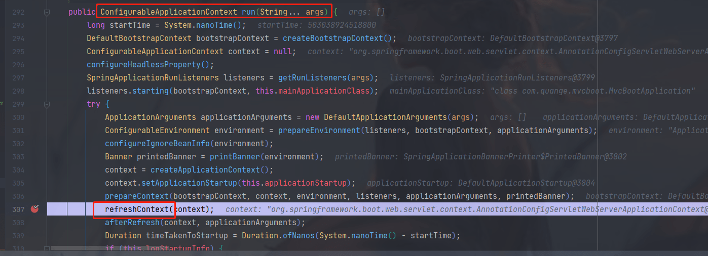

参考博客：

https://juejin.cn/post/6991320717459456008

##### 启动类代码

```java
@ServletComponentScan
@SpringBootApplication
public class MvcBootApplication {

    public static void main(String[] args) {
        SpringApplication.run(MvcBootApplication.class, args);
    }

}
```

##### controller 代码

```java
@RestController
public class HelloWorldController {

    @GetMapping("/")
    public String helloWorld(@RequestParam(value = "id") Integer id,
                             @RequestParam(value = "name") String name) {
        return "Hello world, id: " + id + " name: " + name;
    }

    @GetMapping("/test1")
    public String helloWorld1(@RequestParam(value = "id") Integer id) {
        return "Hello world:" + id;
    }

    @PostMapping("/test2")
    public String helloWorld2(@RequestBody User user) {
        return "Hello world:" + user.toString();
    }
}
```

##### filter代码

```java
import lombok.extern.slf4j.Slf4j;
import org.springframework.core.annotation.Order;

import javax.servlet.Filter;
import javax.servlet.FilterChain;
import javax.servlet.ServletException;
import javax.servlet.ServletRequest;
import javax.servlet.ServletResponse;
import javax.servlet.annotation.WebFilter;
import java.io.IOException;

@Slf4j
@Order(1)
@WebFilter(filterName = "MyFilter1", urlPatterns = "/test1")
public class MyFilter1 implements Filter {

    @Override
    public void doFilter(ServletRequest request, ServletResponse response, FilterChain chain) throws IOException, ServletException {
        log.info("My filter log 1");
        chain.doFilter(request, response);
    }
}
```


```java
import lombok.extern.slf4j.Slf4j;
import org.springframework.core.annotation.Order;

import javax.servlet.Filter;
import javax.servlet.FilterChain;
import javax.servlet.ServletException;
import javax.servlet.ServletRequest;
import javax.servlet.ServletResponse;
import javax.servlet.annotation.WebFilter;
import java.io.IOException;

@Slf4j
@Order(2)
@WebFilter(filterName = "MyFilter2", urlPatterns = "/test2")
public class MyFilter2 implements Filter {

    @Override
    public void doFilter(ServletRequest request, ServletResponse response, FilterChain chain) throws IOException, ServletException {
        log.info("My filter log 2");
        chain.doFilter(request, response);
    }
}
```

Vo

```java
@Data
public class User {
    private Integer id;
    private String name;
}
```

##### pom.xml

```xml
<dependency>
    <groupId>org.springframework.boot</groupId>
    <artifactId>spring-boot-starter-web</artifactId>
</dependency>
<dependency>
    <groupId>org.springframework.boot</groupId>
    <artifactId>spring-boot-starter-test</artifactId>
    <scope>test</scope>
</dependency>
<dependency>
    <groupId>org.projectlombok</groupId>
    <artifactId>lombok</artifactId>
    <optional>true</optional>
</dependency>
```

#### 请求结果

核心的代码如上，相关的请求Filter处理如下：

- / : 两个Filter都不触发

  > http://localhost:8081/filterTest/noFilter?id=1&name=lan
  >
  > 返回：Hello world, id: 1 name: lan

- /test1 : 触发MyFilter1

- /test2 : 触发MyFilter2

符合我们的使用预期，接下来我们到源码中探索：

- 1.Filter是如何初始化的
- 2.Filter是如何对应相关的URL请求的

如果加入了spring-security的依赖的话，首先需要登录，用户名默认是 user，密码会在控制台打印出来。

#### 源码分析

##### @ServletComponentScan

启动类上面加了一个这个注解，注解的作用是，启动扫描Servlet 组件，包括 WebFilter、WebServlet、WebListener，扫描仅在使用嵌入式web服务器时执行。可以看到这个注解有导入一个类。

```java
@Target(ElementType.TYPE)
@Retention(RetentionPolicy.RUNTIME)
@Documented
@Import(ServletComponentScanRegistrar.class)
public @interface ServletComponentScan {
}
```

ServletComponentScanRegistrar 这个类看代码应该是导入了这个bean：ServletComponentRegisteringPostProcessorBeanDefinition，bean的name则是servletComponentRegisteringPostProcessor

```java
class ServletComponentScanRegistrar implements ImportBeanDefinitionRegistrar {

   private static final String BEAN_NAME = "servletComponentRegisteringPostProcessor";
    
    @Override
	public void registerBeanDefinitions(AnnotationMetadata importingClassMetadata, BeanDefinitionRegistry registry) {
		Set<String> packagesToScan = getPackagesToScan(importingClassMetadata);
		if (registry.containsBeanDefinition(BEAN_NAME)) {
			updatePostProcessor(registry, packagesToScan);
		}
		else {
			addPostProcessor(registry, packagesToScan);
		}
	}
}
```

debug可以看到会走到这个方法：


##### 注解 @WebFilter

我们是使用了这个注解来实现的一个 `Filter` 的，进入源码中查看发现这个注解是 Tomcat 提供的，并且是在 `Servlet 3.0` 就已经有了。源码的注释是：

> 这个注解是用来申明一个 Servlet的 javax.servlet.Filter 的。这个注解将会在容器部署期间被处理，这个被找到的Filter类将会被创建，作为一个配置并且应用到 URL patterns、 javax.servlet.Filter 和 javax.servlet.DispatcherType 上。
>
> 被注解修饰的类，必须实现 Filter 接口

查看  `Filter` 接口，有三个方法，已经有的Filter：

* 1) **Authentication Filters** 

 * 2) Logging and Auditing Filters 
 * 3) Image conversion Filters
 * 4) Data compression Filters 
 * 5) Encryption Filters
 * 6) Tokenizing Filters 
 * 7) Filters that trigger resource access events 
 * 8) XSL/T filters
 * 9) Mime-type chain Filter

解释：过滤器在doFilter方法中执行过滤。每个Filter都可以访问FilterConfig的对象，
它可以获得其初始化参数，对ServletContext的引用，来进行使用。例如，它可以使用它来加载过滤任务所需的资源。

```java
/**
 * A filter is an object that performs filtering tasks on either the request to a resource (a servlet or static
 * content), or on the response from a resource, or both. <br>
 * <br>
 * Filters perform filtering in the <code>doFilter</code> method. Every Filter has access to a FilterConfig object from
 * which it can obtain its initialization parameters, a reference to the ServletContext which it can use, for example,
 * to load resources needed for filtering tasks.
 * <p>
 * Filters are configured in the deployment descriptor of a web application
 * <p>
 * @since Servlet 2.3
 */
public interface Filter {
        default void init(FilterConfig filterConfig) throws ServletException {
    }
        void doFilter(ServletRequest request, ServletResponse response, FilterChain chain)
            throws IOException, ServletException;
        default void destroy() {
    }
}
```

##### Filter 初始化

###### springboot 启动入口



继续往下走，可以看到这个applicationcontext对象是org.springframework.boot.web.servlet.context.AnnotationConfigServletWebServerApplicationContext@55fcecc2


继续往下调用则走到了 `ServletWebServerApplicationContext` 的 refresh() 方法中，这个方法调用的是父类的方法。

我们在下面这个位置打上断点，可以看到代码是会走到这里来的。这个方法遍历获得了系统内置的和我们自己定义的Filter。

org.springframework.boot.web.servlet.context.ServletWebServerApplicationContext#selfInitialize

```java
private void selfInitialize(ServletContext servletContext) throws ServletException {
   prepareWebApplicationContext(servletContext);
   registerApplicationScope(servletContext);
   WebApplicationContextUtils.registerEnvironmentBeans(getBeanFactory(), servletContext);
    // 得到所有的filter
   for (ServletContextInitializer beans : getServletContextInitializerBeans()) {
      beans.onStartup(servletContext);
   }
}
```


通过查看 `getServletContextInitializerBeans()` 这个方法，可以看到上面的图中有好一些的 `ServletContextInitializer` 类，而我们自己定义的 `MyFilter1` 和 `MyFilter2`就在这里面。

继续调用对应的onStartUp方法，我们定义的 MyFilter1，对应的 bean 是 `FilterRegistrationBean`，可以看到上面还有 `springSecurityFiterChain`，所代表的bean是一个代理类。进入到`FilterRegistrationBean`类的 onstartUp 方法中。


走到这个类 org.springframework.boot.web.servlet.DynamicRegistrationBean#register


随后到 org.springframework.boot.web.servlet.AbstractFilterRegistrationBean#configure 中配置了filter。

```java
protected void configure(FilterRegistration.Dynamic registration) {
   super.configure(registration);
   EnumSet<DispatcherType> dispatcherTypes = this.dispatcherTypes;
   if (dispatcherTypes == null) {
      T filter = getFilter();
      if (ClassUtils.isPresent("org.springframework.web.filter.OncePerRequestFilter",
            filter.getClass().getClassLoader()) && filter instanceof OncePerRequestFilter) {
         dispatcherTypes = EnumSet.allOf(DispatcherType.class);
      }
      else {
         dispatcherTypes = EnumSet.of(DispatcherType.REQUEST);
      }
   }
   Set<String> servletNames = new LinkedHashSet<>();
   for (ServletRegistrationBean<?> servletRegistrationBean : this.servletRegistrationBeans) {
      servletNames.add(servletRegistrationBean.getServletName());
   }
   servletNames.addAll(this.servletNames);
   if (servletNames.isEmpty() && this.urlPatterns.isEmpty()) {
       // 系统默认的都走的这部分处理，拦截路径默认都是：/**
      registration.addMappingForUrlPatterns(dispatcherTypes, this.matchAfter, DEFAULT_URL_MAPPINGS);
   }
   else {
      if (!servletNames.isEmpty()) {
         registration.addMappingForServletNames(dispatcherTypes, this.matchAfter,
               StringUtils.toStringArray(servletNames));
      }
       // 我们自定义的都都了这里，拦截路径就是我们配置的：/test1,/test2
      if (!this.urlPatterns.isEmpty()) {
         registration.addMappingForUrlPatterns(dispatcherTypes, this.matchAfter,
               StringUtils.toStringArray(this.urlPatterns));
      }
   }
}
```

具体的urlpattern如下所示


在上面的代码中，我们看到了拦截路径的配置有两个方式：

- servletNames
- urlPatterns

添加urlpattern

```java
public void addMappingForUrlPatterns(EnumSet<DispatcherType> dispatcherTypes, boolean isMatchAfter,
        String... urlPatterns) {

    FilterMap filterMap = new FilterMap();

    filterMap.setFilterName(filterDef.getFilterName());

    if (dispatcherTypes != null) {
        for (DispatcherType dispatcherType : dispatcherTypes) {
            filterMap.setDispatcher(dispatcherType.name());
        }
    }

    if (urlPatterns != null) {
        // % decoded (if necessary) using UTF-8
        for (String urlPattern : urlPatterns) {
            filterMap.addURLPattern(urlPattern);
        }

        if (isMatchAfter) {
            context.addFilterMap(filterMap);
        } else {
            context.addFilterMapBefore(filterMap);
        }
    }
    // else error?

}
```


上面的代码中，Filter添加有两处代码：一个是添加到Map中，一个是context中。

##### Filter  匹配添加

D:/maven/repository/org/apache/tomcat/embed/tomcat-embed-core/9.0.78/tomcat-embed-core-9.0.78-sources.jar!/org/apache/catalina/core/StandardWrapperValve.java:141 触发 createFilterChain 方法的调用。

下面的代码是核心的Filter匹配处理，但前面的触发调用目前暂时还没有梳理清楚。

```java
# ApplicationFilterFactory.java
public static ApplicationFilterChain createFilterChain(ServletRequest request,
        Wrapper wrapper, Servlet servlet) {
......
    // Acquire the filter mappings for this Context
    StandardContext context = (StandardContext) wrapper.getParent();
// 获取Filter，得到上面初始化的Filter
    FilterMap filterMaps[] = context.findFilterMaps();

    // If there are no filter mappings, we are done
    if ((filterMaps == null) || (filterMaps.length == 0)) {
        return filterChain;
    }

    // Acquire the information we will need to match filter mappings
    DispatcherType dispatcher =
            (DispatcherType) request.getAttribute(Globals.DISPATCHER_TYPE_ATTR);

// 请求的路径
    String requestPath = null;
    Object attribute = request.getAttribute(Globals.DISPATCHER_REQUEST_PATH_ATTR);
    if (attribute != null){
        requestPath = attribute.toString();
    }

    String servletName = wrapper.getName();

// 在这里就进行匹配了
    // Add the relevant path-mapped filters to this filter chain
    for (FilterMap filterMap : filterMaps) {
        if (!matchDispatcher(filterMap, dispatcher)) {
            continue;
        }
        if (!matchFiltersURL(filterMap, requestPath)) {
            continue;
        }
        ApplicationFilterConfig filterConfig = (ApplicationFilterConfig)
                context.findFilterConfig(filterMap.getFilterName());
        if (filterConfig == null) {
            // FIXME - log configuration problem
            continue;
        }
        filterChain.addFilter(filterConfig);
    }

    // Add filters that match on servlet name second
    for (FilterMap filterMap : filterMaps) {
        if (!matchDispatcher(filterMap, dispatcher)) {
            continue;
        }
        if (!matchFiltersServlet(filterMap, servletName)) {
            continue;
        }
        ApplicationFilterConfig filterConfig = (ApplicationFilterConfig)
                context.findFilterConfig(filterMap.getFilterName());
        if (filterConfig == null) {
            // FIXME - log configuration problem
            continue;
        }
        filterChain.addFilter(filterConfig);
    }

    // Return the completed filter chain
    return filterChain;
}

// 上面的触发调用后，就来到了下面的将Filter添加到列表中的相关diam
# ApplicationFilterChain.java
void addFilter(ApplicationFilterConfig filterConfig) {

    // Prevent the same filter being added multiple times
    for(ApplicationFilterConfig filter:filters) {
        if(filter==filterConfig) {
            return;
        }
    }

    if (n == filters.length) {
        ApplicationFilterConfig[] newFilters =
            new ApplicationFilterConfig[n + INCREMENT];
        System.arraycopy(filters, 0, newFilters, 0, n);
        filters = newFilters;
    }
    filters[n++] = filterConfig;

}
```
从调试的debug图中可以看到servlet 是DispatcherServlet，filter也是我们先前看到的所有filter。


最后返回的是我们匹配上的filter


上面的就是核心的Filter匹配添加的核心代码，值得注意的点有下面几个：

- 会被匹配添加两次
- 匹配有下面三种方式：
  - matchDispatcher(filterMap, dispatcher)
  - matchFiltersURL(filterMap, requestPath)
  - matchFiltersServlet(filterMap, servletName)

这里就有下面两点疑问了：

- 为啥需要将两次匹配分开：是为了前后Filter区分？
- 两次Filter循环匹配，好像就是匹配路径requestPath和匹配ServletName的区别，两者有何不同，为啥需要分开？

##### Filter触发

```java
# ApplicationFilterChain.java
public void doFilter(ServletRequest request, ServletResponse response)
    throws IOException, ServletException {

    if( Globals.IS_SECURITY_ENABLED ) {
        final ServletRequest req = request;
        final ServletResponse res = response;
        try {
            java.security.AccessController.doPrivileged(
                    (java.security.PrivilegedExceptionAction<Void>) () -> {
                        internalDoFilter(req,res);
                        return null;
                    }
            );
        } catch( PrivilegedActionException pe) {
	    ......
        }
    } else {
    // 调用触发
        internalDoFilter(request,response);
    }
}

private void internalDoFilter(ServletRequest request,
                              ServletResponse response)
    throws IOException, ServletException {

    // Call the next filter if there is one
    if (pos < n) {
        ApplicationFilterConfig filterConfig = filters[pos++];
        try {
	// 获取当前Filter
            Filter filter = filterConfig.getFilter();

            if (request.isAsyncSupported() && "false".equalsIgnoreCase(
                    filterConfig.getFilterDef().getAsyncSupported())) {
                request.setAttribute(Globals.ASYNC_SUPPORTED_ATTR, Boolean.FALSE);
            }
            if( Globals.IS_SECURITY_ENABLED ) {
                final ServletRequest req = request;
                final ServletResponse res = response;
                Principal principal =
                    ((HttpServletRequest) req).getUserPrincipal();

                Object[] args = new Object[]{req, res, this};
                SecurityUtil.doAsPrivilege ("doFilter", filter, classType, args, principal);
            } else {
	    // 调用触发
                filter.doFilter(request, response, this);
            }
        } catch (IOException | ServletException | RuntimeException e) {
	    ......
        }
        return;
    }

    // 下面的代码有疑似结束Filter，触发请求函数处理相关的代码。先打个标记，后面探索
    // We fell off the end of the chain -- call the servlet instance
......
}
```
可以从debug的截图中看到开始的filter，以及对应的一个调用栈。


当走完了这个filter之后，又会继续调用到doFilter中，随后又到 internalDoFilter中来。


最终这些调用的执行链会一个个返回。上面就是Filter调用触发的核心代码了，链式触发调用，在SpringCloudGateway和Netty中都有类型的相关代码，看着这种代码模式很经典啊。（职责链模式）

了解如何会执行到这个地方需要知道Tomcat的一些原理，博客：https://segmentfault.com/u/keguan/articles


#### 过滤器和拦截器的区别

https://www.cnblogs.com/Java-Starter/p/10444617.html

过滤器先于拦截器执行，后于拦截器执行结束。


##### 过滤器

**依赖于servlet容器**。在实现上基于函数回调，可以对几乎所有请求进行过滤，但是缺点是一个过滤器实例只能在容器初始化时调用一次。使用过滤器的目的是用来做一些过滤操作，获取我们想要获取的数据。

比如：在过滤器中修改字符编码；在过滤器中修改HttpServletRequest的一些参数，包括：过滤低俗文字、危险字符等。

##### 拦截器

**依赖于web框架，在SpringMVC中就是依赖于SpringMVC框架**。在实现上基于Java的反射机制，属于面向切面编程（AOP）的一种运用。由于拦截器是基于Web框架的调用。

因此可以使用spring的依赖注入（DI）进行一些业务操作，同时一个拦截器实例在一个controller生命周期之内可以多次调用。但是缺点是只能对controller请求进行拦截，对其他的一些比如直接访问静态资源的请求则没办法进行拦截处理。

#### 总结

总结：业务中尽量使用基于方法的拦截器，在进行一些需要统一处理的业务可以使用基于Servlet的过滤器。

Filter接口用来执行过滤任

CompositeFilter实现filter，用到了组合设计模式

抽象类GenericFilterBean实现Filter接口，负责解析web.xml的Filter的init-param中参数，是所有过滤器的父类。init方法解析web.xml的参数

抽象类OncePerRequestFilter继承GenericFilterBean，doFilter方法根据hasAlreadyFilteredAttribute判断是否执行过滤

CharacterEncodingFilter重写父类OncePerRequestFilter的doFilterInterval方法，调用FilterChain的doDilter方法执行过滤逻辑