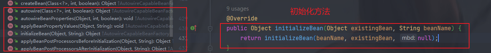

具体的手撸spring博客：[第01章：开篇介绍，我要带你撸 Spring 啦！ | 小傅哥 bugstack 虫洞栈](https://bugstack.cn/md/spring/develop-spring/2021-05-16-第1章：开篇介绍，手写Spring能给你带来什么？.html)

### 结构上的理解

### org.springframework.beans 包

#### BeanFactory

org.springframework.beans.**factory**.BeanFactory

访问spring bean容器的根接口。这是一个bean容器的基本的视图，进一步的接口提供了其特殊目的，如ListableBeanFactory和 org.springframework.beans.factory.config.ConfigurableBeanFactory 接口。可以观察到这个接口的方法主要是对bean容器的一个简单定义，对bean的获取的一些方法的定义。


并且还可以观察到有好几个接口继承了这个接口，这意味着，这些继承的接口拥有了这些功能，也就是获取bean的主要功能。


#### ListableBeanFactory

org.springframework.beans.**factory**.ListableBeanFactory，观察包名。

对于这个接口来说它继承了 BeanFactory，相当于拥有了 BeanFactory 的功能。

```java
public interface ListableBeanFactory extends BeanFactory {
    ...
}
```

这个接口扩展了BeanFactory功能，由可以枚举所有bean实例的bean工厂实现，而不是像客户端请求的那样逐个按名称进行bean查找。预加载所有bean定义(如基于xml的工厂)的BeanFactory实现可以实现这个接口。也就是说这个接口可以列举出bean的一个集合。如果这是一个{@link HierarchicalBeanFactory}，返回值将不考虑任何BeanFactory层次结构，而只与当前工厂中定义的bean相关，使用{@link BeanFactoryUtils} helper类也可以考虑祖先工厂中的bean。


可以看到这些方法返回的基本都是集合或者是数组。例如根据类型返回bean的一个map集合。例如一个接口Service 有多个实现类，service1和service2，此时 <T> Map<String, T> getBeansOfType(@Nullable Class<T> type) throws BeansException; 就应该返回对应的一个map：{service1: instance, service2BeanName: instance}。

#### AutowireCapableBeanFactory

org.springframework.beans**.factory.config**.AutowireCapableBeanFactory

可以看下这个接口定义了一些什么方法：这些方法是对于bean容器来说是很重要的，前面的接口只是提供了获取的一些功能，这里则是提供了**创建bean、自动注入、初始化以及应用bean的后置处理器**。

```java
public interface AutowireCapableBeanFactory extends BeanFactory 
```


#### HierarchicalBeanFactory

org.springframework.beans.**factory**.HierarchicalBeanFactory

继承BeanFactory，也就是在BeanFactory定义的功能的基础上增加了对parentFactory的支持。

可以在ConfigurableBeanFactory接口中找到允许以可配置方式设置父节点的bean工厂的相应setParentBeanFactory方法。

#### SingletonBeanRegistry

org.springframework.beans.**factory.config**.SingletonBeanRegistry

我们是一个容器，所以需要对bean进行一个注册，这个接口定义对单例的注册及获取。


对于这个接口有对应的一些子接口


##### ConfigurableBeanFactory

org.springframework.beans.factory.**config**.ConfigurableBeanFactory

```java
public interface ConfigurableBeanFactory extends HierarchicalBeanFactory, SingletonBeanRegistry {}
```

由大多数bean工厂实现的配置接口，提供配置Factory的各种方法。可以看到有查看spring源码遇到的一些方法：


##### DefaultSingletonBeanRegistry

org.springframework.beans**.factory.support**.DefaultSingletonBeanRegistry

对接口SingletonBeanRegistry各函数的实现。以及各种注册的bean的定义

```java
public class DefaultSingletonBeanRegistry extends SimpleAliasRegistry implements SingletonBeanRegistry {
    /** Maximum number of suppressed exceptions to preserve. */
	private static final int SUPPRESSED_EXCEPTIONS_LIMIT = 100;


	/** Cache of singleton objects: bean name to bean instance. */
	private final Map<String, Object> singletonObjects = new ConcurrentHashMap<>(256);

	/** Cache of singleton factories: bean name to ObjectFactory. */
	private final Map<String, ObjectFactory<?>> singletonFactories = new HashMap<>(16);

	/** Cache of early singleton objects: bean name to bean instance. */
	private final Map<String, Object> earlySingletonObjects = new ConcurrentHashMap<>(16);

	/** Set of registered singletons, containing the bean names in registration order. */
	private final Set<String> registeredSingletons = new LinkedHashSet<>(256);

	/** Names of beans that are currently in creation. */
	private final Set<String> singletonsCurrentlyInCreation =
			Collections.newSetFromMap(new ConcurrentHashMap<>(16));

	/** Names of beans currently excluded from in creation checks. */
	private final Set<String> inCreationCheckExclusions =
			Collections.newSetFromMap(new ConcurrentHashMap<>(16));
...
}
```

###### FactoryBeanRegistrySupport

**FactoryBeanRegistrySupport**：在 DefaultSingletonBeanRegistry 基础上增加了对 FactoryBean 的特殊处理功能。

```java
public abstract class FactoryBeanRegistrySupport extends DefaultSingletonBeanRegistry {}
```


#### AliasRegistry

```java
* Common interface for managing aliases. Serves as a super-interface for
* {@link org.springframework.beans.factory.support.BeanDefinitionRegistry}.
```

对于bean来说可以定义别名，这个就是别名的顶级接口


它有些子接口

##### BeanDefinitionRegistry

用于保存bean定义的注册中心的接口。对于这个接口来说，定义了关于BeanDefinition的一些增删改查的操作。通常由内部使用AbstractBeanDefinition层次结构的BeanFactories实现。

```java
public interface BeanDefinitionRegistry extends AliasRegistry {
```


#### AbstractBeanFactory

```java
public abstract class AbstractBeanFactory extends FactoryBeanRegistrySupport implements ConfigurableBeanFactory {}
```

综合 FactoryBeanRegistrySupport 和 ConfigurableBeanFactory 的功能。BeanFactory实现的抽象基类，提供了link org.springframework.beans.factory.config.ConfigurableBeanFactory 的全部功能。


#### AbstractAutowireCapableBeanFactory

org.springframework.beans.**factory.support**.AbstractAutowireCapableBeanFactory

AbstractBeanFactory 的子类，综合AbstractBeanFactory并对接口AutowireCapableBeanFactory进行实现。 

```java
public abstract class AbstractAutowireCapableBeanFactory extends AbstractBeanFactory
      implements AutowireCapableBeanFactory {
}
```

至此这个类基本上已经拥有了上面接口的所有功能了，同时自己还定义了一些自己的方法。比如下面这些方法：




#### ConfigurableListableBeanFactory

BeanFactory配置清单，**指定忽略类型及接口**等。

```java
public interface ConfigurableListableBeanFactory
      extends ListableBeanFactory, AutowireCapableBeanFactory, ConfigurableBeanFactory {}
```


#### DefaultListableBeanFactory

**DefaultListableBeanFactory**：综合上面所有功能，主要是对Bean注册后的处理。

```java
public class DefaultListableBeanFactory extends AbstractAutowireCapableBeanFactory
      implements ConfigurableListableBeanFactory, BeanDefinitionRegistry, Serializable {}
```

我们默认的加载bean的factory就是这个类了。

### bean的读取

XML配置文件的读取是Spring中重要的功能，因为Spring的大部分功能都是以配置作为切入点的，那么我们可以从XmlBeanDefinitionReader中梳理一下资源文件读取、解析及注册的大致脉络，首先我们看看各个类的功能。

#### BeanDefinitionReader

org.springframework.beans.**factory.support**.BeanDefinitionReader

**BeanDefinitionReader**：主要定义资源文件读取并转换为BeanDefinition的各个功能。


#### AbstractBeanDefinitionReader

org.springframework.beans**.factory.support**.AbstractBeanDefinitionReader

对EnvironmentCapable、BeanDefinitionReader类定义的功能进行实现。

```java
public abstract class AbstractBeanDefinitionReader implements BeanDefinitionReader, EnvironmentCapable {
    private final BeanDefinitionRegistry registry;

	@Nullable
	private ResourceLoader resourceLoader;

	@Nullable
	private ClassLoader beanClassLoader;

	private Environment environment;

	private BeanNameGenerator beanNameGenerator = DefaultBeanNameGenerator.INSTANCE;
}
```

#### ResourceLoader

org.springframework**.core.io**.ResourceLoader

**ResourceLoader**：定义资源加载器，主要应用于根据给定的资源文件地址返回对应的Resource。


#### DocumentLoader

org.springframework.beans**.factory.xml.**DocumentLoader

定义从资源文件加载到转换为Document的功能。

```java
	// Strategy interface for loading an XML {@link Document}.
    Document loadDocument(
    InputSource inputSource, EntityResolver entityResolver,
    ErrorHandler errorHandler, int validationMode, boolean namespaceAware)
    throws Exception;
```

#### DefaultDocumentLoader

```java
public class DefaultDocumentLoader implements DocumentLoader {
    
}
```

#### BeanDefinitionDocumentReader

定义读取Docuemnt并注册BeanDefinition功能。

```java
public interface BeanDefinitionDocumentReader {

   /**
    * Read bean definitions from the given DOM document and
    * register them with the registry in the given reader context.
    * @param doc the DOM document
    * @param readerContext the current context of the reader
    * (includes the target registry and the resource being parsed)
    * @throws BeanDefinitionStoreException in case of parsing errors
    */
   void registerBeanDefinitions(Document doc, XmlReaderContext readerContext)
         throws BeanDefinitionStoreException;

}
```

###### 实现类 DefaultBeanDefinitionDocumentReader


#### BeanDefinitionParserDelegate

org.springframework.**beans.factory.xml.**BeanDefinitionParserDelegate

定义读取Docuemnt并注册BeanDefinition功能。有一些默认的元素标签和定义了解析方法。


#### XmlBeanDefinitionReader

这个类中使用了这些属性，其中 DefaultBeanDefinitionDocumentReader 是重要的。

```java
private Class<? extends BeanDefinitionDocumentReader> documentReaderClass =
      DefaultBeanDefinitionDocumentReader.class;

private ProblemReporter problemReporter = new FailFastProblemReporter();

private ReaderEventListener eventListener = new EmptyReaderEventListener();

private SourceExtractor sourceExtractor = new NullSourceExtractor();

@Nullable
private NamespaceHandlerResolver namespaceHandlerResolver;

private DocumentLoader documentLoader = new DefaultDocumentLoader();

@Nullable
private EntityResolver entityResolver;

private ErrorHandler errorHandler = new SimpleSaxErrorHandler(logger);

private final XmlValidationModeDetector validationModeDetector = new XmlValidationModeDetector();
```

在这个类中可以观察到使用到了  BeanDefinitionParserDelegate类。


可以观察XmlBeanDefinitionReader类核心方法的使用：

```java
protected int doLoadBeanDefinitions(InputSource inputSource, Resource resource)
      throws BeanDefinitionStoreException {

   try {
      Document doc = doLoadDocument(inputSource, resource);
      int count = registerBeanDefinitions(doc, resource);
      if (logger.isDebugEnabled()) {
         logger.debug("Loaded " + count + " bean definitions from " + resource);
      }
      return count;
   }
   ...
}
```

在方法

```java
public int registerBeanDefinitions(Document doc, Resource resource) throws BeanDefinitionStoreException {
   BeanDefinitionDocumentReader documentReader = createBeanDefinitionDocumentReader();
   int countBefore = getRegistry().getBeanDefinitionCount();
   documentReader.registerBeanDefinitions(doc, createReaderContext(resource));
   return getRegistry().getBeanDefinitionCount() - countBefore;
}
// createBeanDefinitionDocumentReader
protected BeanDefinitionDocumentReader createBeanDefinitionDocumentReader() {
    return BeanUtils.instantiateClass(this.documentReaderClass);
}
// 这个 this.documentReaderClass = DefaultBeanDefinitionDocumentReader 所以后面的  DefaultBeanDefinitionDocumentReader 方法是这里面执行的。
```

具体位置 org.springframework.beans.factory.xml.DefaultBeanDefinitionDocumentReader#registerBeanDefinitions

```java
public void registerBeanDefinitions(Document doc, XmlReaderContext readerContext) {
   this.readerContext = readerContext;
   doRegisterBeanDefinitions(doc.getDocumentElement());
}
protected void doRegisterBeanDefinitions(Element root) {
		// Any nested <beans> elements will cause recursion in this method. In
		// order to propagate and preserve <beans> default-* attributes correctly,
		// keep track of the current (parent) delegate, which may be null. Create
		// the new (child) delegate with a reference to the parent for fallback purposes,
		// then ultimately reset this.delegate back to its original (parent) reference.
		// this behavior emulates a stack of delegates without actually necessitating one.
		BeanDefinitionParserDelegate parent = this.delegate;
		this.delegate = createDelegate(getReaderContext(), root, parent);
    ...
        // 模板方法
        preProcessXml(root);
		parseBeanDefinitions(root, this.delegate);
		postProcessXml(root);
}
// 创建了核心的代理解析类 BeanDefinitionParserDelegate
protected BeanDefinitionParserDelegate createDelegate(
			XmlReaderContext readerContext, Element root, @Nullable BeanDefinitionParserDelegate parentDelegate) {

		BeanDefinitionParserDelegate delegate = new BeanDefinitionParserDelegate(readerContext);
		delegate.initDefaults(root, parentDelegate);
		return delegate;
	}
```

### 对于资源文件


spring自己定义并抽象了一些Resource的接口，以及对资源加载的 ResouceLoader 接口。从类图中可以看出关系，并有一些实现类：文件（FileSystemResource）、Classpath资源（ClassPathResource）、URL资源（UrlResource）、InputStream资源（InputStreamResource）、Byte数组（ByteArrayResource）等。

对于文件的解析，跟接口是 Resource 作为参数的，面向接口编程。

```java
public int loadBeanDefinitions(Resource resource) throws BeanDefinitionStoreException {
   return loadBeanDefinitions(new EncodedResource(resource));
}
```

同时这个方法 int loadBeanDefinitions(Resource resource) throws BeanDefinitionStoreException;  是定义在 org.springframework.beans.factory.support.**BeanDefinitionReader**#loadBeanDefinitions(org.springframework.core.io.Resource) 中的。

### 对于应用上下文 Context

org.springframework.context 包

