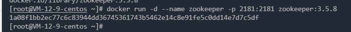
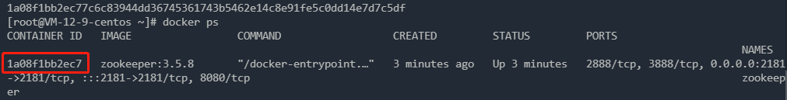
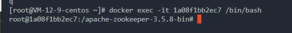
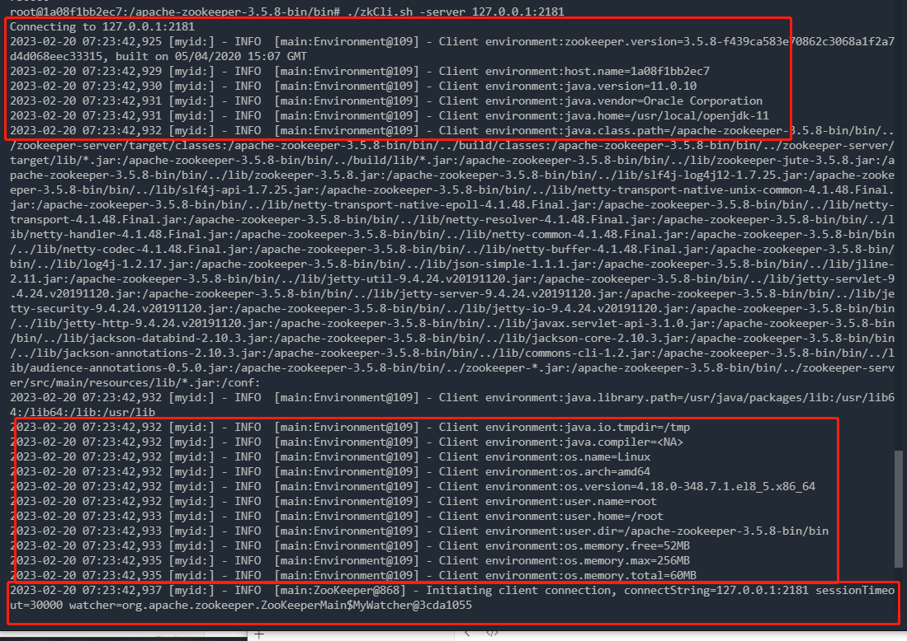

## ZooKeeper 安装和使用

### 1 使用docker安装zookeeper

#### 1.1 使用docker安装zookeeper

##### a 使用命令

```sh
docker pull zookeeper:3.5.8
```

##### b 运行 zookeeper

```sh
docker run -d --name zookeeper -p 2181:2181 zookeeper:3.5.8
```



#### 1.2 连接zookeeper服务

##### 1 进入zookeeper容器中

使用 `docker ps` 查看zookeeper容器的容器id，然后使用`docker exec -it ContainerId /bin/bash` 命令进入容器中。





##### 2 先进入bin目录，然后通过 `./zkCli.sh -server 127.0.0.1:2181` 命令连接 zookeeper 服务

 连接成功图示


