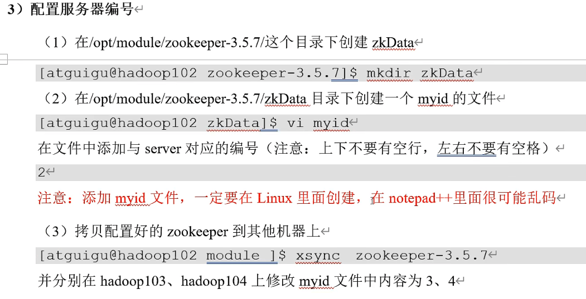
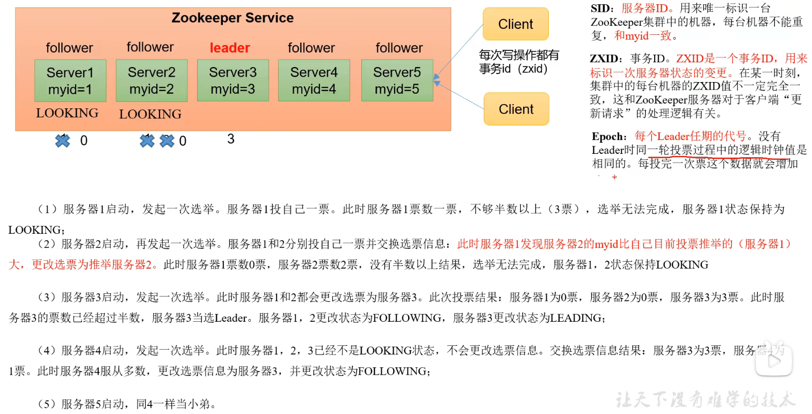

【【尚硅谷】大数据技术之Zookeeper 3.5.7版本教程】 https://www.bilibili.com/video/BV1to4y1C7gw/?share_source=copy_web&vd_source=3b1efacb505b91ba7db831546c052ed8

### 应用场景

#### 统一命名服务

在分布式环境下，经常需要对应用/服务进行统一命名，便于识别。例如：ip不容易记住，而域名容易记住。


#### 统一配置管理

（1）分布式环境下，配置文件同步非常常见。

- 一般要求一个集群中，所有节点的配置信息是一致的，比如Kafka集群。
- 对配置文件修改后，希望能快速同步到各个节点上。

（2）配置管理可交由zookeeper实现。

- 可将配置信息写入zookeeper上的一个znode，各个客户端服务器监听这个znode，一旦znode中的数据被修改，zookeeper将通知各个客户端服务器。


#### 统一集群管理 

（1）分布式环境中，实时掌握每个节点的状态是必要的，可根据节点实时状态做出一些调整。

（2）zookeeper可以实现实时监控节点状态变化

- 可将节点信息写入zookeeper上的一个znode，监听这个znode可获取它的实时状态变化。

  

  

#### 服务器动态上下线 


#### 软负载均衡


### 本地安装

需要先配置jdk

将zookeeper的tar包上传到指定目录，然后解压缩到指定目录

```sh
[root@192 software]# mkdir /opt/module
[root@192 software]# tar -xzvf apache-zookeeper-3.5.7-bin.tar.gz -C /opt/module
```

然后进入到目录中，将文件重命名并修改配置文件

```sh
[root@192 module]# mv apache-zookeeper-3.5.7-bin/ zookeeper-3.5.7
[root@192 module]# ll
total 0
drwxr-xr-x. 6 root root 134 Apr  4 21:15 zookeeper-3.5.7
[root@192 zookeeper-3.5.7]# cd conf/
[root@192 conf]# ls
configuration.xsl  log4j.properties  zoo_sample.cfg
[root@192 conf]# mv zoo_sample.cfg zoo.cfg
[root@192 conf]# vi zoo.cfg 
```

配置文件

```sh
# The number of milliseconds of each tick
tickTime=2000
# The number of ticks that the initial 
# synchronization phase can take
initLimit=10
# The number of ticks that can pass between 
# sending a request and getting an acknowledgement
syncLimit=5
# the directory where the snapshot is stored.
# do not use /tmp for storage, /tmp here is just 
# example sakes. 修改这里
dataDir=/opt/module/zookeeper-3.5.7/zkData
# the port at which the clients will connect
clientPort=2181
# the maximum number of client connections.
# increase this if you need to handle more clients
#maxClientCnxns=60
#
# Be sure to read the maintenance section of the 
# administrator guide before turning on autopurge.
#
# http://zookeeper.apache.org/doc/current/zookeeperAdmin.html#sc_maintenance
#
# The number of snapshots to retain in dataDir
#autopurge.snapRetainCount=3
# Purge task interval in hours
# Set to "0" to disable auto purge feature
#autopurge.purgeInterval=1
```

然后进入到bin目录启动zookeeper服务端

```sh
zkServer.sh start
```

##### 启动客户端

```sh
zkCli.sh
```

##### 查看是否启动成功

```sh
[root@localhost ~]# jps -l
15529 sun.tools.jps.Jps
15386 org.apache.zookeeper.ZooKeeperMain
11710 org.apache.zookeeper.server.quorum.QuorumPeerMain
```

##### 退出客户端

```sh
quit
```

##### 停止zookeeper

```sh
zkServer.sh stop
```

##### 查看状态

```sh
[root@localhost bin]# ./zkServer.sh status
ZooKeeper JMX enabled by default
Using config: /opt/module/zookeeper-3.5.7/bin/../conf/zoo.cfg
Client port found: 2181. Client address: localhost.
Mode: standalone
```

#### 配置参数

- tickTime：通信心跳时间，zookeeper服务器与客户端心跳时间，单位毫秒
- initLimit：LF初始通信时限。L：leader，F：follower。L和F初始连接时最多能容忍的最多心跳数。
- syncLimit：LF同步通信时限。通信时间如果超过了syncLimit，则认为follower宕机
- dataDir：保存zookeeper中的数据
- clientPort：2181，客户端连接端口，通常不做修改

### 集群配置

在不同的虚拟机中配置一个myid文件



配置文件中增加如下配置：


我本地是由于没有设置虚拟机的集群操作只能一个一个修改配置了。添加下面的配置，本地我是启动了3个虚拟机来进行一个集群的搭建。

```sh
#############cluster################
server.1=192.168.146.128:2888:3888
server.2=192.168.146.129:2888:3888
server.3=192.168.146.130:2888:3888
```

启动状态：

```sh
#192.168.146.130 机器
[root@localhost zookeeper-3.5.7]# bin/zkServer.sh start
ZooKeeper JMX enabled by default
Using config: /opt/module/zookeeper-3.5.7/bin/../conf/zoo.cfg
Starting zookeeper ... STARTED
[root@localhost zookeeper-3.5.7]# bin/zkServer.sh status
ZooKeeper JMX enabled by default
Using config: /opt/module/zookeeper-3.5.7/bin/../conf/zoo.cfg
Client port found: 2181. Client address: localhost.
Error contacting service. It is probably not running.

#192.168.146.129 机器
[root@192 zookeeper-3.5.7]# bin/zkServer.sh start
ZooKeeper JMX enabled by default
Using config: /opt/module/zookeeper-3.5.7/bin/../conf/zoo.cfg
Starting zookeeper ... STARTED
[root@192 zookeeper-3.5.7]# bin/zkServer.sh status
ZooKeeper JMX enabled by default
Using config: /opt/module/zookeeper-3.5.7/bin/../conf/zoo.cfg
Client port found: 2181. Client address: localhost.
Error contacting service. It is probably not running.

#192.168.146.128 机器 也一样
```

查看对应的日志信息，能看到是访问不到对应的地址。

```java
2023-04-05 07:22:00,344 [myid:1] - WARN  [WorkerSender[myid=1]:QuorumCnxManager@685] - Cannot open channel to 2 at election address /192.168.146.129:3888
java.net.NoRouteToHostException: No route to host (Host unreachable)
        at java.net.PlainSocketImpl.socketConnect(Native Method)
        at java.net.AbstractPlainSocketImpl.doConnect(AbstractPlainSocketImpl.java:350)
        at java.net.AbstractPlainSocketImpl.connectToAddress(AbstractPlainSocketImpl.java:206)
        at java.net.AbstractPlainSocketImpl.connect(AbstractPlainSocketImpl.java:188)
        at java.net.SocksSocketImpl.connect(SocksSocketImpl.java:392)
        at java.net.Socket.connect(Socket.java:589)
        at org.apache.zookeeper.server.quorum.QuorumCnxManager.connectOne(QuorumCnxManager.java:656)
        at org.apache.zookeeper.server.quorum.QuorumCnxManager.connectOne(QuorumCnxManager.java:713)
        at org.apache.zookeeper.server.quorum.QuorumCnxManager.toSend(QuorumCnxManager.java:626)
        at org.apache.zookeeper.server.quorum.FastLeaderElection$Messenger$WorkerSender.process(FastLeaderElection.java:477)
        at org.apache.zookeeper.server.quorum.FastLeaderElection$Messenger$WorkerSender.run(FastLeaderElection.java:456)
        at java.lang.Thread.run(Thread.java:748)
2023-04-05 07:22:00,347 [myid:1] - WARN  [WorkerSender[myid=1]:QuorumCnxManager@685] - Cannot open channel to 3 at election address /192.168.146.130:3888
java.net.NoRouteToHostException: No route to host (Host unreachable)
        at java.net.PlainSocketImpl.socketConnect(Native Method)
        at java.net.AbstractPlainSocketImpl.doConnect(AbstractPlainSocketImpl.java:350)
        at java.net.AbstractPlainSocketImpl.connectToAddress(AbstractPlainSocketImpl.java:206)
        at java.net.AbstractPlainSocketImpl.connect(AbstractPlainSocketImpl.java:188)
        at java.net.SocksSocketImpl.connect(SocksSocketImpl.java:392)
        at java.net.Socket.connect(Socket.java:589)
        at org.apache.zookeeper.server.quorum.QuorumCnxManager.connectOne(QuorumCnxManager.java:656)
        at org.apache.zookeeper.server.quorum.QuorumCnxManager.connectOne(QuorumCnxManager.java:713)
        at org.apache.zookeeper.server.quorum.QuorumCnxManager.toSend(QuorumCnxManager.java:626)
        at org.apache.zookeeper.server.quorum.FastLeaderElection$Messenger$WorkerSender.process(FastLeaderElection.java:477)
        at org.apache.zookeeper.server.quorum.FastLeaderElection$Messenger$WorkerSender.run(FastLeaderElection.java:456)
        at java.lang.Thread.run(Thread.java:748)
```

关闭防火墙后再启动试试：

`systemctl stop firewalld.service`：停止firewall

`systemctl disable firewalld.service`：禁止firewall开机启动

`firewall-cmd --state`：查看默认防火墙状态（关闭后显示notrunning，开启后显示running）

```sh
[root@localhost logs]# systemctl stop firewalld.service
[root@localhost logs]# systemctl disable firewalld.service
Removed symlink /etc/systemd/system/multi-user.target.wants/firewalld.service.
Removed symlink /etc/systemd/system/dbus-org.fedoraproject.FirewallD1.service.
[root@localhost logs]# firewall-cmd --state
```

再次查看状态，128机器上显示是 follower。

```sh
[root@localhost zookeeper-3.5.7]# bin/zkServer.sh status
ZooKeeper JMX enabled by default
Using config: /opt/module/zookeeper-3.5.7/bin/../conf/zoo.cfg
Client port found: 2181. Client address: localhost.
Mode: follower
```

129机器上显示是 leader。

```sh
[root@192 zookeeper-3.5.7]# bin/zkServer.sh status
ZooKeeper JMX enabled by default
Using config: /opt/module/zookeeper-3.5.7/bin/../conf/zoo.cfg
Client port found: 2181. Client address: localhost.
Mode: leader
```

130机器上显示 follower。

```sh
[root@localhost zookeeper-3.5.7]# bin/zkServer.sh status
ZooKeeper JMX enabled by default
Using config: /opt/module/zookeeper-3.5.7/bin/../conf/zoo.cfg
Client port found: 2181. Client address: localhost.
Mode: follower
```

### zookeeper选举机制

##### 节点状态

- LOOKING，竟选状态。
- FOLLOWING，随从状态，同步leader状态，参与投票。OBSERVING，观察状态,同步leader状态，不参与投票。
- LEADING，领导者状态。

#### 第一次启动



#### 非第一次启动


##### 崩溃选举

- 变更状态，leader故障后，follower进入looking状态
- 各节点投票，先投自己(zxld，sld)，再广播投票
- 接收到投票，对比zxld和sld，如果本节点小、则将票改为接收的投票信息，并记录投票信息，重新广播。否则本节点大、则可不做处理
- 统计本地投票信息，超过半数，则切换为leading状态并广播

### 启动停止脚本

```sh
#! /bin/bash

case $1 in
"start"){
    for i in 192.168.146.128 192.168.146.129 192.168.146.130 
    do
        echo ------------ zookeeper $i 启动 ---------------
    ssh $i "/opt/module/zookeeper-3.5.7/bin/zkServer.sh start"
    done
};;
"stop"){
    for i in 192.168.146.128 192.168.146.129 192.168.146.130 
    do
        echo ------------ zookeeper $i 停止 ---------------
    ssh $i "/opt/module/zookeeper-3.5.7/bin/zkServer.sh stop"
    done
};;
"status"){
    for i in 192.168.146.128 192.168.146.129 192.168.146.130 
    do
        echo ------------ zookeeper $i 状态 ---------------
    ssh $i "/opt/module/zookeeper-3.5.7/bin/zkServer.sh status"
    done
};;
esac
```

创建一个 vim zk.sh 文件，修改文件权限。[root@localhost bin]# chmod 777 zk.sh 


我没有配置集群，所以这里是本机的虚拟机的地址。查看各个zk的状态。


### 客户端命令

启动客户端，连接到本机服务器：

```sh
[root@192 bin]# ls
README.txt    zkCli.cmd  zkEnv.cmd  zkServer.cmd            zkServer.sh          zkTxnLogToolkit.sh
zkCleanup.sh  zkCli.sh   zkEnv.sh   zkServer-initialize.sh  zkTxnLogToolkit.cmd
[root@192 bin]# ./zkCli.sh 
```

- ls 命令

```sh
[zk: localhost:2181(CONNECTED) 1] ls /
[zookeeper]
[zk: localhost:2181(CONNECTED) 2] ls -s /
[zookeeper]cZxid = 0x0
ctime = Wed Dec 31 16:00:00 PST 1969
mZxid = 0x0
mtime = Wed Dec 31 16:00:00 PST 1969
pZxid = 0x0
cversion = -1
dataVersion = 0
aclVersion = 0
ephemeralOwner = 0x0
dataLength = 0
numChildren = 1

[zk: localhost:2181(CONNECTED) 3] 
```

- **cZxid：创建节点的事务 zxid**
- ctime：znode被创建的毫秒数（从1970年开始）
- mZxid：znode最后更新的 zxid
- mtime：znode最后修改的毫秒数
- pZxid：znode最后更新的子节点 zxid
- cversion：znode子节点变化好，znode子节点修改次数
- **dataVersion：znode数据变化号**
- aclVersion：znode 访问控制列表的变化号
- ephemeralOwner：如果是临时节点，这个是 znode 拥有者的 session id。如果不是临时节点，则是0
- **dataLength：znode 的数据长度**
- **numChildren：znode子节点数量**

### 节点类型

持久（Persistent）：客户端和服务器断开连接后，创建的节点不会删除。

短暂（Ephemeral）：客户端和服务器断开连接后，创建的节点自己删除。


1. 创建永久节点不带序号的，不使用参数

```sh
[zk: localhost:2181(CONNECTED) 5] create /sanguo "diaochan"
Created /sanguo
[zk: localhost:2181(CONNECTED) 6] ls /
[locks, sanguo, zookeeper]
[zk: localhost:2181(CONNECTED) 7] get /sanguo
diaochan
[zk: localhost:2181(CONNECTED) 9] create /sanguo/shuguo "liubei"
Created /sanguo/shuguo
[zk: localhost:2181(CONNECTED) 11] ls /
[locks, sanguo, zookeeper]
[zk: localhost:2181(CONNECTED) 12] get /sanguo/shuguo
liubei
[zk: localhost:2181(CONNECTED) 13] get -s /sanguo
diaochan
cZxid = 0x800000004
ctime = Sun Jul 23 01:13:49 PDT 2023
mZxid = 0x800000004
mtime = Sun Jul 23 01:13:49 PDT 2023
pZxid = 0x800000005
cversion = 1
dataVersion = 0
aclVersion = 0
ephemeralOwner = 0x0
dataLength = 8
numChildren = 1
[zk: localhost:2181(CONNECTED) 14] get -s /sanguo/shuguo
liubei
cZxid = 0x800000005
ctime = Sun Jul 23 01:14:45 PDT 2023
mZxid = 0x800000005
mtime = Sun Jul 23 01:14:45 PDT 2023
pZxid = 0x800000005
cversion = 0
dataVersion = 0
aclVersion = 0
ephemeralOwner = 0x0
dataLength = 6
numChildren = 0
```

2. 创建节点带序号的，使用 `-s` 参数

```sh
[zk: localhost:2181(CONNECTED) 23] create /sanguo/weiguo "caocao"
Created /sanguo/weiguo
[zk: localhost:2181(CONNECTED) 24] create -s /sanguo/weiguo/zhangliao "zhangliao"
Created /sanguo/weiguo/zhangliao0000000000
[zk: localhost:2181(CONNECTED) 25] ls /sanguo/
shuguo   weiguo   
[zk: localhost:2181(CONNECTED) 25] ls /sanguo/weiguo
[zhangliao0000000000]
```

还可以继续的创建带序号的相同值，而永久节点不带序号的不行。

```sh
[zk: localhost:2181(CONNECTED) 27] create -s /sanguo/weiguo/zhangliao "zhangliao"
Created /sanguo/weiguo/zhangliao0000000001
[zk: localhost:2181(CONNECTED) 29] ls /sanguo/weiguo
[zhangliao0000000000, zhangliao0000000001]
```

3. 创建临时节点，使用 `-e`参数

```sh
[zk: localhost:2181(CONNECTED) 32] create /sanguo/wuguo "sunquan"
Created /sanguo/wuguo
[zk: localhost:2181(CONNECTED) 33] create -e /sanguo/wuguo/zhouyu "zhouyu"
Created /sanguo/wuguo/zhouyu
[zk: localhost:2181(CONNECTED) 34] ls /sanguo
[shuguo, weiguo, wuguo]
[zk: localhost:2181(CONNECTED) 35] ls /sanguo/wuguo
[zhouyu]
[zk: localhost:2181(CONNECTED) 36] create -e -s /sanguo/wuguo/zhouyu22 "zhouyu"
Created /sanguo/wuguo/zhouyu220000000001
```

4. 修改节点数值

使用set命令

### 监听器原理


命令形式监听

上面的节点类型里面是在128的机器上面，现在是在129的机器上面进行操作，可以看到是能够获取到值的。

````sh
[zk: localhost:2181(CONNECTED) 0] get -s /sanguo
diaochan
cZxid = 0x800000004
ctime = Sun Jul 23 01:13:49 PDT 2023
mZxid = 0x800000004
mtime = Sun Jul 23 01:13:49 PDT 2023
pZxid = 0x80000000e
cversion = 7
dataVersion = 0
aclVersion = 0
ephemeralOwner = 0x0
dataLength = 8
numChildren = 3
[zk: localhost:2181(CONNECTED) 2] ls /sanguo
[shuguo, weiguo, wuguo]
````

#### 监听节点数据变化

监听，使用 `-w` 参数

```sh
[zk: localhost:2181(CONNECTED) 3] get -w /sanguo
diaochan
```

然后去到128的机器上操作

```sh
[zk: localhost:2181(CONNECTED) 4] set /sanguo "xishi"
```

再回到129机器上观察：

```sh
[zk: localhost:2181(CONNECTED) 4] 
WATCHER::

WatchedEvent state:SyncConnected type:NodeDataChanged path:/sanguo
```

再修改一次的话是没有这个事件触发的，所以是只能监听到一次，129的机器是没有出现上面的事件的。

```sh
[zk: localhost:2181(CONNECTED) 5] set /sanguo "xishi2"
```

**注册一次，只能监听一次，想再次监听，只能再次注册**。

#### 监听节点的子节点变化（路径变化）

使用 `ls -w /sanguo`

129机器上：

```sh
[zk: localhost:2181(CONNECTED) 4] ls -w /sanguo
[shuguo, weiguo, wuguo]
```

128机器上

```sh
[zk: localhost:2181(CONNECTED) 6] create /sanguo/jin "simayi"
Created /sanguo/jin
```

查看129机器

```sh
[zk: localhost:2181(CONNECTED) 5] 
WATCHER::

WatchedEvent state:SyncConnected type:NodeChildrenChanged path:/sanguo
```

同样，一次注册，只能监听一次， 多次监听需要多次注册。

### 节点删除与查看

##### 删除节点

```sh
[zk: localhost:2181(CONNECTED) 7] delete /sanguo/jin
[zk: localhost:2181(CONNECTED) 8] ls /sanguo
[shuguo, weiguo, wuguo]
```

##### 递归删除所有节点

```
deleteall /sanguo
```

##### 查看节点状态

stat /sanguo

```sh
[zk: localhost:2181(CONNECTED) 9] stat /sanguo
cZxid = 0x800000004
ctime = Sun Jul 23 01:13:49 PDT 2023
mZxid = 0x800000015
mtime = Sun Jul 23 01:36:30 PDT 2023
pZxid = 0x800000017
cversion = 9
dataVersion = 2
aclVersion = 0
ephemeralOwner = 0x0
dataLength = 6
numChildren = 3
```

### 写数据原理

#### 写入请求直接发送给 Leader


#### 写入请求发送个 Follower


5 这个 ack 意思：leader知道你写完了数据，然后返回一个信号，应答数超过了半数之后就会返回ack。随后，follower将ack返回给客户端。

然后leader通知另一个follower写数据，写完之后返回一个ack给leader。

### 服务器动态上下线


源代码：

服务端：

```java
package com.lanwq.zk.servicesmonitor;

import org.apache.zookeeper.CreateMode;
import org.apache.zookeeper.KeeperException;
import org.apache.zookeeper.WatchedEvent;
import org.apache.zookeeper.Watcher;
import org.apache.zookeeper.ZooDefs;
import org.apache.zookeeper.ZooKeeper;
import org.apache.zookeeper.data.Stat;

import java.io.IOException;

/**
 * @author Lan
 * @createTime 2023-07-23  17:18
 * 服务上下线，先到zk上创建一个节点 create /services
 **/
public class DistributeServer {
    private ZooKeeper zk;

    public static void main(String[] args) throws IOException, InterruptedException, KeeperException {
        DistributeServer server = new DistributeServer();
        // 1 创建连接
        server.getConnect();
        // 2 注册服务器到集群
        server.register("128");
        // 3 启动业务逻辑
        server.business();
    }

    private void business() throws InterruptedException {
        Thread.sleep(Integer.MAX_VALUE);
    }

    private void register(String hostName) throws InterruptedException, KeeperException {
		zk.create("/services/" + hostName, hostName.getBytes(), ZooDefs.Ids.OPEN_ACL_UNSAFE, CreateMode.EPHEMERAL_SEQUENTIAL);
        System.out.println("节点：" + hostName + " is online!");
    }

    public void getConnect() throws IOException {
        // 获取连接
        String address = "192.168.146.128:2181,192.168.146.129:2181,192.168.146.130:2181";
        zk = new ZooKeeper(address, 40000, new Watcher() {
            @Override
            public void process(WatchedEvent watchedEvent) {

            }
        });
    }
}
```

客户端

```java
package com.lanwq.zk.servicesmonitor;

import org.apache.zookeeper.KeeperException;
import org.apache.zookeeper.WatchedEvent;
import org.apache.zookeeper.Watcher;
import org.apache.zookeeper.ZooKeeper;
import org.apache.zookeeper.data.Stat;
import org.checkerframework.checker.units.qual.C;

import java.io.IOException;
import java.util.ArrayList;
import java.util.List;

/**
 * @author Lan
 * @createTime 2023-07-23  17:26
 **/
public class DistributeClient {
    private ZooKeeper zk;

    public static void main(String[] args) throws IOException, InterruptedException, KeeperException {
        DistributeClient client = new DistributeClient();
        // 1 获取zk连接
        client.getConnect();
        // 2 监听 services 下面的子节点增加和删除
        client.monitor();
        // 3 业务逻辑
        client.business();
    }

    private void monitor() throws InterruptedException, KeeperException {
        Stat exists = zk.exists("/services", false);
        if (exists == null) {
            System.out.println("/services 不存在！！！");
        }
        // true 走 process 方法里的
        List<String> children = zk.getChildren("/services", true);
        ArrayList<String> servers = new ArrayList<>();
        for (String child : children) {
            byte[] data = zk.getData("/services/" + child, false, null);
            servers.add(new String(data));
        }
        System.out.println("servers = " + servers);
    }

    private void business() throws InterruptedException {
        Thread.sleep(Integer.MAX_VALUE);
    }

    public void getConnect() throws IOException {
        // 获取连接
        String address = "192.168.146.128:2181,192.168.146.129:2181,192.168.146.130:2181";
        zk = new ZooKeeper(address, 60000, new Watcher() {
            @Override
            public void process(WatchedEvent watchedEvent) {
                try {
                    monitor();
                } catch (InterruptedException | KeeperException e) {
                    throw new RuntimeException(e);
                }
            }
        });
        System.out.println("连接成功");
    }
}
```

##### 先使用命令方式创建：

```sh
[zk: localhost:2181(CONNECTED) 3] create -e -s /services/128 "128jiedian"
Created /services/1280000000000
```

查看代码客户端：


在创建一个 ``

```sh
[zk: localhost:2181(CONNECTED) 4] create -e -s /services/129 "129jiedian"
Created /services/1290000000001
```

servers = [128jiedian, 129jiedian]

删除：

```sh
[zk: localhost:2181(CONNECTED) 5] delete /services/1290000000001
[zk: localhost:2181(CONNECTED) 6] ls /services
[1280000000000]
```

客户端打印：

```tex
servers = [128jiedian]
```

##### 使用代码方式创建节点

服务端启动后创建节点：

```java
server.register("node129");
```

客户端监听到：

```java
servers = [128jiedian, node129]
```

当断开连接后，这个节点就会被删除，然后客户端监听到：

```java
servers = [128jiedian]
```

### 企业面试真题

#### 选举机制


#### 生产集群安装多少ZK合适

**安装奇数台**。实际生产经验：

- 10台服务器：3台zk；
- 20台服务器：5台zk；
- 100台服务器：11台zk；
- 200台服务器：11台zk；

**服务器台数多：好处是可以提高可靠性，缺点是提高通信延迟**。

### 源码解析

#### 算法基础

**zookeeper是如何保持数据一致性的**？

##### 拜占庭将军问题

拜占庭将军是一个协议问题，拜占庭帝国军队的将军们必须全体一致的决定是否攻击某一支敌军。问题是这些将军在地理位置上是分隔开来的，并且将军中存在叛徒。叛徒可以人以行动以达到以下目标：**欺骗某些将军采取进攻行动；去程一个不是所有将军都同意的决定，如当将军们不希望进攻时促成进攻行动；或者迷惑某些将军，使他们无法做出决定**。如果叛徒达到了目的之一，则任何攻击行动的结果都是注定要失败的只有完全达成一致的努力才能获得胜利。


#### paxos 算法

一种基于消息传递且具有高度容错特性的**一致性算法**。

paxos算法解决的问题：**就是如何快速正确的在一个分布式系统中对某个数据值达成一致，并且保证不论发生任何异常，都不会破坏整个系统的一致性**。


##### 算法描述

- 在一个paxos系统中，首先将所有节点划分为Proposer（提议者）、Acceptor（接收者）、Learner（学习者），每个节点都可以身兼数职。


##### paxos算法流程

- Prepare 准备阶段
  - Proposer 向多个 Acceptor 发出 Propose 请求 Promise（承诺）
  - Acceptor  针对收到的 Propose 请求进行 Promise
- Accept 接受阶段
  - Proposer 收到多数 Acceptor 承诺的 Promise 后，向 Acceptor  发出 Propose 请求
  - Acceptor 针对收到的 Propose 请求进行 Accept 处理
- Learn 学习阶段：Proposer 将形成的决议发送给所有 learners

### 后续是源码分析-待看
