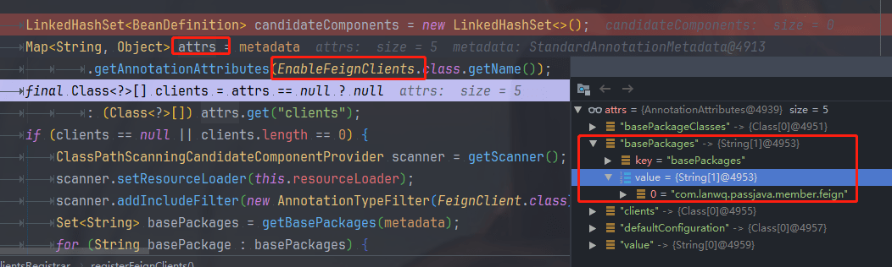
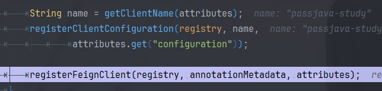
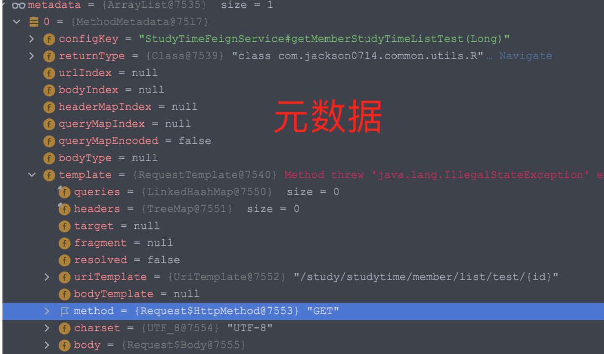

 学习参考博客：[02.Feign架构剖析 (passjava.cn)](http://www.passjava.cn/#/02.SpringCloud/03.Feign远程调用/02.Feign架构剖析)  

**第一步**：Member 服务需要定义一个 OpenFeign 接口：

```java
@FeignClient("passjava-study")
public interface StudyTimeFeignService {
    @RequestMapping("study/studytime/member/list/test/{id}")
    public R getMemberStudyTimeListTest(@PathVariable("id") Long id);
}
```

我们可以看到这个 interface 上添加了注解`@FeignClient`，而且括号里面**指定了服务名：passjava-study**。**显示声明**这个接口用来远程调用 `passjava-study`服务。

**第二步**：Member 启动类上添加 `@EnableFeignClients`注解开启远程调用服务，且需要开启服务发现。如下所示：

```java
@EnableFeignClients(basePackages = "com.lanwq.passjava.member.feign")
@EnableDiscoveryClient
@MapperScan("com.lanwq.passjava.member.dao")
@SpringBootApplication(scanBasePackages = {"com.lanwq.passjava"})
@Import({WebMvcConfig.class})
public class PassjavaMemberApplication {

    public static void main(String[] args) {
        SpringApplication.run(PassjavaMemberApplication.class, args);
    }

}
```

**第三步**：Study 服务定义一个方法，其方法路径和 Member 服务中的接口 URL 地址一致即可。

URL 地址："study/studytime/member/list/test/{id}"

```java
@RestController
@RequestMapping("study/studytime")
public class StudyTimeController {
    @RequestMapping("/member/list/test/{id}")
    public R memberStudyTimeTest(@PathVariable("id") Long id) {
       ... 
    }
}
```

**第四步**：Member 服务的 POM 文件中引入 OpenFeign 组件。

```java
<dependency>
    <groupId>org.springframework.cloud</groupId>
    <artifactId>spring-cloud-starter-openfeign</artifactId>
</dependency>
```

**第五步**：引入 studyTimeFeignService，Member 服务远程调用 Study 服务即可。

```java
Autowired
private StudyTimeFeignService studyTimeFeignService;

studyTimeFeignService.getMemberStudyTimeListTest(id);
```

通过上面的示例，我们知道，加了 @FeignClient 注解的接口后，我们就可以调用它定义的接口，然后就可以调用到远程服务了。

#### 1 核心流程 


- 1、在 Spring 项目启动阶段，服务 A 的OpenFeign 框架会发起一个主动的扫包流程。
- 2、从指定的目录下扫描并加载所有被 @FeignClient 注解修饰的接口，然后将这些接口转换成 Bean，统一交给 Spring 来管理。
- 3、这些接口会经过 MVC Contract 协议解析，将方法上的注解都解析出来，放到 MethodMetadata 元数据中。
- 4、基于上面加载的每一个 FeignClient 接口，会生成一个动态代理对象，指向了一个包含对应方法的 MethodHandler 的 HashMap。MethodHandler 对元数据有引用关系。生成的动态代理对象会被添加到 Spring 容器中，并注入到对应的服务里。
- 5、服务 A 调用接口，准备发起远程调用。
- 6、从动态代理对象 Proxy 中找到一个 MethodHandler 实例，生成 Request，包含有服务的请求 URL（不包含服务的 IP）。
- 7、经过负载均衡算法找到一个服务的 IP 地址，拼接出请求的 URL。
- 8、服务 B 处理服务 A 发起的远程调用请求，执行业务逻辑后，返回响应给服务 A。

#### 2 OpenFeign 包扫描原理

（1）开启注解：`@EnableFeignClients(basePackages = "com.lanwq.passjava.member.feign")`，并开启了OpenFeign 组件的加载，通过注解中的源码可以发现导入了一个类`FeignClientsRegistrar` 。

```java
// 启动类
@EnableFeignClients(basePackages = "com.lanwq.passjava.member.feign")
@EnableDiscoveryClient
@MapperScan("com.lanwq.passjava.member.dao")
@SpringBootApplication(scanBasePackages = {"com.lanwq.passjava"})
@Import({WebMvcConfig.class})
public class PassjavaMemberApplication {

    public static void main(String[] args) {
        SpringApplication.run(PassjavaMemberApplication.class, args);
    }

}

@Retention(RetentionPolicy.RUNTIME)
@Target(ElementType.TYPE)
@Documented
@Import(FeignClientsRegistrar.class)
public @interface EnableFeignClients {
...
}
```

（2）FeignClientsRegistrar 负责 Feign 接口的加载。启动springboot的时候会走到这里来。

```java
@Override
public void registerBeanDefinitions(AnnotationMetadata metadata,
      BeanDefinitionRegistry registry) {
   // 注册配置
   registerDefaultConfiguration(metadata, registry);
   // 注册 FeignClient
   registerFeignClients(metadata, registry);
}
```


根据启动的这个注解去注册相关的配置。

（3）registerFeignClients 会扫描指定包。

调用 find 方法来查找指定路径 basePackage 的所有带有 @FeignClients 注解的带有 @FeignClient 注解的类、接口。

```java
public void registerFeignClients(AnnotationMetadata metadata,
      BeanDefinitionRegistry registry) {

   LinkedHashSet<BeanDefinition> candidateComponents = new LinkedHashSet<>();
   Map<String, Object> attrs = metadata
         .getAnnotationAttributes(EnableFeignClients.class.getName());
   final Class<?>[] clients = attrs == null ? null
         : (Class<?>[]) attrs.get("clients");
   if (clients == null || clients.length == 0) {
      ClassPathScanningCandidateComponentProvider scanner = getScanner();
      scanner.setResourceLoader(this.resourceLoader);
      scanner.addIncludeFilter(new AnnotationTypeFilter(FeignClient.class));
      Set<String> basePackages = getBasePackages(metadata);
      for (String basePackage : basePackages) {
          // ******
         candidateComponents.addAll(scanner.findCandidateComponents(basePackage));
      }
   }
   ...
   
```

根据 EnableFeignClients 获取到的属性。这个注解在启动类上有`@EnableFeignClients`



根据这个basepackages去获取所有的package。


获取到指定的加了注解的类。

```java
@FeignClient("passjava-study")
public interface StudyTimeFeignService {
    @RequestMapping("study/smsstudytime/member/list/test/{id}")
    public R getMemberStudyTimeListTest(@PathVariable("id") Long id);
}
```

（4）只保留带有 @FeignClient 的接口。

```java
// 判断是否是带有注解的 Bean。
if (candidateComponent instanceof AnnotatedBeanDefinition) {
  // 判断是否是接口
   AnnotatedBeanDefinition beanDefinition = (AnnotatedBeanDefinition) candidateComponent;
   AnnotationMetadata annotationMetadata = beanDefinition.getMetadata();
  // @FeignClient 只能指定在接口上。
   Assert.isTrue(annotationMetadata.isInterface(),
         "@FeignClient can only be specified on an interface");
```

可以看到最后会获取到 `passjava-study`，这个服务的name，并将配置注册到springboot中。



#### 3 注册FeignClient到Spring的原理

registerFeignClient 方法中，当 FeignClient 扫描完后，就要为这些 FeignClient 接口生成一个动态代理对象。

```java
String className = annotationMetadata.getClassName();
Class clazz = ClassUtils.resolveClassName(className, null);
ConfigurableBeanFactory beanFactory = registry instanceof ConfigurableBeanFactory
    ? (ConfigurableBeanFactory) registry : null;
String contextId = getContextId(beanFactory, attributes);
String name = getName(attributes);
//******用来创建 FeignClient Bean
FeignClientFactoryBean factoryBean = new FeignClientFactoryBean();
factoryBean.setBeanFactory(beanFactory);
factoryBean.setName(name);
factoryBean.setContextId(contextId);
factoryBean.setType(clazz);
// 注册bean
BeanDefinitionBuilder definition = BeanDefinitionBuilder
      .genericBeanDefinition(clazz, () -> {
         factoryBean.setUrl(getUrl(beanFactory, attributes));
         factoryBean.setPath(getPath(beanFactory, attributes));
         factoryBean.setDecode404(Boolean
               .parseBoolean(String.valueOf(attributes.get("decode404"))));
         Object fallback = attributes.get("fallback");
         if (fallback != null) {
            factoryBean.setFallback(fallback instanceof Class
                  ? (Class<?>) fallback
                  : ClassUtils.resolveClassName(fallback.toString(), null));
         }
         Object fallbackFactory = attributes.get("fallbackFactory");
         if (fallbackFactory != null) {
            factoryBean.setFallbackFactory(fallbackFactory instanceof Class
                  ? (Class<?>) fallbackFactory
                  : ClassUtils.resolveClassName(fallbackFactory.toString(),
                        null));
         }
         return factoryBean.getObject();
      });
definition.setAutowireMode(AbstractBeanDefinition.AUTOWIRE_BY_TYPE);
definition.setLazyInit(true);
validate(attributes);


```

这个lambda表达式

```java
public static <T> BeanDefinitionBuilder genericBeanDefinition(Class<T> beanClass, Supplier<T> instanceSupplier) {
    BeanDefinitionBuilder builder = new BeanDefinitionBuilder(new GenericBeanDefinition());
    builder.beanDefinition.setBeanClass(beanClass);
    builder.beanDefinition.setInstanceSupplier(instanceSupplier);
    return builder;
}
```

步骤：

- 解析 `@FeignClient` 定义的属性。
- 将注解`@FeignClient` 的属性 + 接口 `StudyTimeFeignService`的信息构造成一个 StudyTimeFeignService 的 beanDefinition。
- 然后将 beanDefinition 转换成一个 holder，这个 holder 就是包含了 beanDefinition, alias, beanName 信息。
- 最后将这个 holder 注册到 Spring 容器中。

源码如下：

```java
AbstractBeanDefinition beanDefinition = definition.getBeanDefinition();
beanDefinition.setAttribute(FactoryBean.OBJECT_TYPE_ATTRIBUTE, className);
beanDefinition.setAttribute("feignClientsRegistrarFactoryBean", factoryBean);

// has a default, won't be null
boolean primary = (Boolean) attributes.get("primary");
beanDefinition.setPrimary(primary);

String[] qualifiers = getQualifiers(attributes);
if (ObjectUtils.isEmpty(qualifiers)) {
    qualifiers = new String[] { contextId + "FeignClient" };
}
BeanDefinitionHolder holder = new BeanDefinitionHolder(beanDefinition, className,
                                                       qualifiers);
BeanDefinitionReaderUtils.registerBeanDefinition(holder, registry);
```

上面我们已经知道 FeignClient 的接口是如何注册到 Spring 容器中了。后面服务要调用接口的时候，就可以直接用 FeignClient 的接口方法了，如下所示：

```java
@Autowired
private StudyTimeFeignService studyTimeFeignService;

// 省略部分代码
// 直接调用 
studyTimeFeignService.getMemberStudyTimeListTest(id);
```

#### 4 OpenFeign动态代理原理

在创建 FeignClient Bean 的过程中就会去生成动态代理对象。调用接口时，其实就是调用动态代理对象的方法来发起请求的。分析动态代理的入口方法为 getObject()。源码如下所示：

上面的 `factoryBean.getObject();` 会走到 `FeignClientFactoryBean` 中去获取

```java
@Override
public Object getObject() {
    return getTarget();
}
Targeter targeter = get(context, Targeter.class);
return (T) targeter.target(this, builder, context,
                           new HardCodedTarget<>(type, name, url));
```

get方法

```java
protected <T> T get(FeignContext context, Class<T> type) {
   T instance = context.getInstance(contextId, type);
   if (instance == null) {
      throw new IllegalStateException(
            "No bean found of type " + type + " for " + contextId);
   }
   return instance;
}
```

这个 target 会有两种实现类：


DefaultTargeter 和 HystrixTargeter。而不论是哪种 target，都需要去调用 Feign.java 的 builder 方法去构造一个 feign client。

在构造的过程中，依赖 ReflectiveFeign 去构造。源码如下：

```java
// 省略部分代码
public class ReflectiveFeign extends Feign {
  // 为 feign client 接口中的每个接口方法创建一个 methodHandler
    public <T> T newInstance(Target<T> target) {
    for(...) {
      methodToHandler.put(method, handler);
    }
    // 基于 JDK 动态代理的机制，创建了一个 passjava-study 接口的动态代理，所有对接口的调用都会被拦截，然后转交给 handler 的方法。
    InvocationHandler handler = factory.create(target, methodToHandler);
    T proxy = (T) Proxy.newProxyInstance(target.type().getClassLoader(),
          new Class<?>[] {target.type()}, handler);
}
```


>
> ReflectiveFeign 做的工作就是为带有 @FeignClient 注解的接口，创建出接口方法的动态代理对象。

比如示例代码中的接口 StudyTimeFeignService，会给这个接口中的方法 getMemberStudyTimeList 创建一个动态代理对象。

```java
@FeignClient("passjava-study")
public interface StudyTimeFeignService {
    @RequestMapping("study/studytime/member/list/test/{id}")
    public R getMemberStudyTimeList(@PathVariable("id") Long id);
}
```


创建动态代理的原理图如下所示：


- 解析 FeignClient 接口上各个方法级别的注解，比如远程接口的 URL、接口类型（Get、Post 等）、各个请求参数等。这里用到了 MVC Contract 协议解析，后面会讲到。
- 然后将解析到的数据封装成元数据，并为每一个方法生成一个对应的 MethodHandler 类作为方法级别的代理。相当于把服务的请求地址、接口类型等都帮我们封装好了。这些 MethodHandler 方法会放到一个 HashMap 中。
- 然后会生成一个 InvocationHandler 用来管理这个 hashMap，其中 Dispatch 指向这个 HashMap。
- 然后使用 Java 的 JDK 原生的动态代理，实现了 FeignClient 接口的动态代理 Proxy 对象。这个 Proxy 会添加到 Spring 容器中。
- 当要调用接口方法时，其实会调用动态代理 Proxy 对象的 methodHandler 来发送请求。

#### 5 解析 MVC 注解的原理

比如 @RequestMapping，@PathVariable，这些注解统称为 Spring MVC 注解。**但是由于 OpenFeign 是不理解这些注解的，所以需要进行一次解析**。


而解析的类就是 `SpringMvcContract` 类，调用 `parseAndValidateMetadata` 进行解析。解析完之后，就会生成元数据列表。源码如下所示：

```JAVA
List<MethodMetadata> metadata = contract.parseAndValidateMetadata(target.type());
```

类路径：

```java
https://github.com/spring-cloud/spring-cloud-openfeign/blob/main/spring-cloud-openfeign-core/src/main/java/org/springframework/cloud/openfeign/support/SpringMvcContract.java
```
元数据：MethodMetadata 内容。


- 方法的定义，如 StudyTimeFeignService 的 getMemberStudyTimeList 方法。
- 方法的参数类型，如 Long。
- 发送 HTTP 请求的地址，如 /study/studytime/member/list/test/{id}。

然后每个接口方法就会有对应的一个 MethodHandler，**它里面就包含了元数据**，当我们调用接口方法时，其实是调用动态代理对象的 MethodHandler 来发送远程调用请求的。


#### 6 OpenFeign 发送请求的原理

流程图：


还是在 ReflectivFeign 类中，有一个 invoke 方法，会执行一下代码：
```java
public Object invoke(Object proxy, Method method, Object[] args) throws Throwable {
    if ("equals".equals(method.getName())) {
        try {
            Object otherHandler =
                args.length > 0 && args[0] != null ? Proxy.getInvocationHandler(args[0]) : null;
            return equals(otherHandler);
        } catch (IllegalArgumentException e) {
            return false;
        }
    } else if ("hashCode".equals(method.getName())) {
        return hashCode();
    } else if ("toString".equals(method.getName())) {
        return toString();
    }
// *************
    return dispatch.get(method).invoke(args);
}
```

这个 dispatch 我们之前已经讲解过了，它指向了一个 HashMap，里面包含了 FeignClient 每个接口的 MethodHandler 类。

这行代码的意思就是根据 method 找到 MethodHandler，调用它的 invoke 方法，且传的参数就是我们接口中的定义的参数。

具体的方法是在这个类中调用的：SynchronousMethodHandler

```java
public Object invoke(Object[] argv) throws Throwable {
  RequestTemplate template = buildTemplateFromArgs.create(argv);
  ...
}
```

RequestTemplate 转换成 Request，它的值类似如下：

```http
GET http://passjava-study/study/list/test/1 HTTP/1.1
```

这不路径不就是我们要 study 服务的方法，这样就可以直接调用到 study 服了呀！

OpenFeign 帮我们组装好了发起远程调用的一切，我们只管调用就好了。

接着 MethodHandler 会执行以下方法，发起 HTTP 请求。

```java
response = client.execute(request, options);
```

**从上面的我们要调用的服务就是 passjava-study，但是这个服务的具体 IP 地址我们是不知道的，那 OpenFeign 是如何获取到 passjava-study 服务的 IP 地址的呢**？

回想下最开始我们提出的核心问题：**OpenFeign 是如何进行负载均衡的**？

我们是否可以联想到上一讲的 **Ribbon 负载均衡**，它不就是用来做 IP 地址选择的么？

那我们就来看下 OpenFeign 又是如何和 Ribbon 进行整合的。

#### 7 OpenFeign 如何与 Ribbon 整合的原理

为了验证 Ribbon 的负载均衡，我们需要启动两个 passjava-study 服务，这里我启动了两个服务，端口号分别为 12100 和 12200，IP 地址都是本机 IP：192.168.10.197


接着上面的源码继续看，client.execute() 方法其实会调用 LoadBalancerFeignClient 的 exceute 方法。

这个方法里面的执行流程如下图所示：


- 将服务名称 `passjava-study` 从 Request 的 URL 中删掉，剩下的如下所示：

```HTTP
GET http:///study/list/test/1 HTTP/1.1
```

- 根据服务名从缓存中找 FeignLoadBalancer，如果缓存中没有，则创建一个 FeignLoadBalancer。
- FeignLoadBalancer 会创建出一个 command，这个 command 会执行一个 sumbit 方法。
- submit 方法里面就会用 Ribbon 的负载均衡算法选择一个 server。源码如下：

```java
Server svc = lb.chooseServer(loadBalancerKey);
```

通过 debug 调试，我们可以看到两次请求的端口号不一样，一个是 12200，一个是 12100，说明确实进行了负载均衡。


- 然后将 IP 地址和之前剔除服务名称的 URL 进行拼接，生成最后的服务地址。
- 最后 FeignLoadBalancer 执行 execute 方法发送请求。

**那大家有没有疑问，Ribbon 是如何拿到服务地址列表的？**这个就是上一讲 Ribbon 架构里面的内容。（需要学习）。

Ribbon 的核心组件 ServerListUpdater，用来同步注册表的，它有一个实现类 PollingServerListUpdater ，专门用来做定时同步的。默认1s 后执行一个 Runnable 线程，后面就是每隔 30s 执行 Runnable 线程。这个 Runnable 线程就是去获取注册中心的注册表的。

#### 8 OpenFeign 处理响应的原理

当远程服务 passjava-study 处理完业务逻辑后，就会返回 reponse 给 passjava-member 服务了，这里还会对 reponse 进行一次解码操作。类：ResponseEntityDecoder ，将 Json 字符串转化为 Bean 对象。

```java
Object result = decode(response);
```