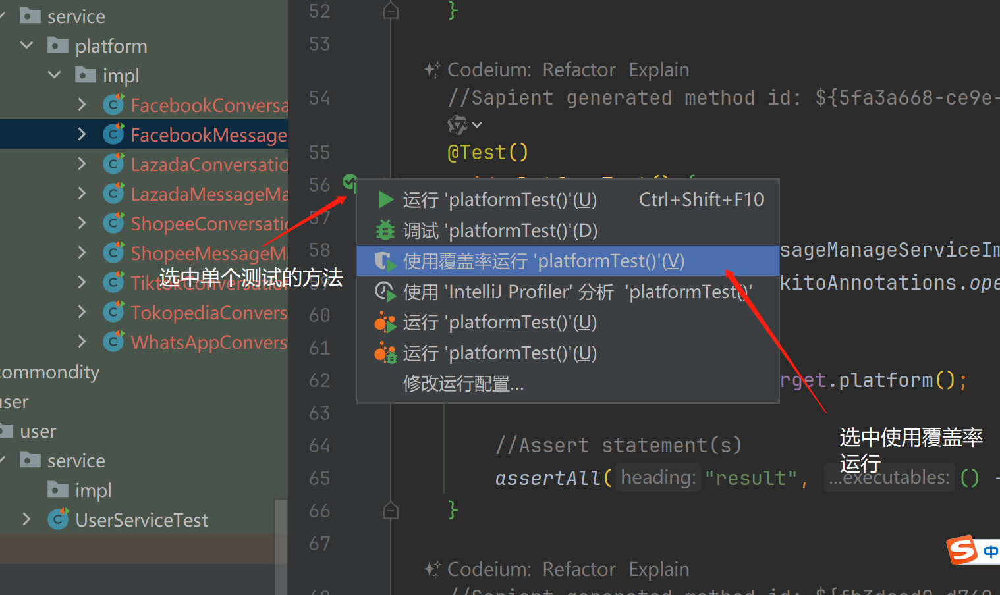
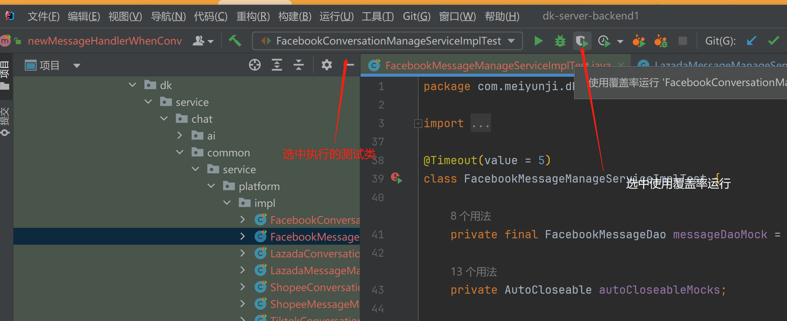
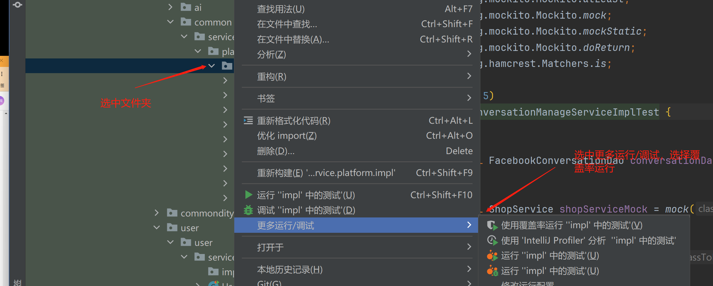
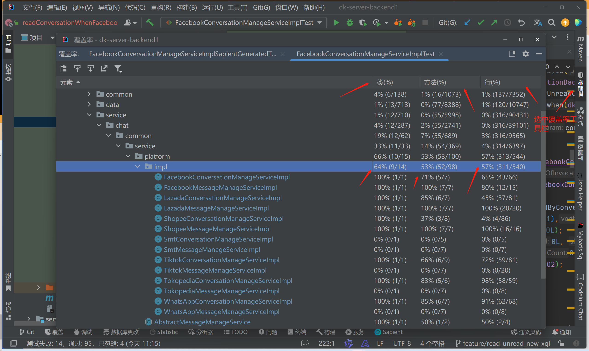
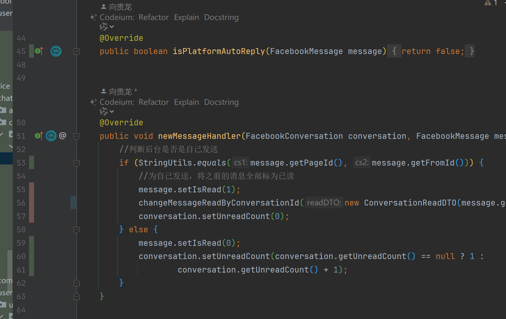
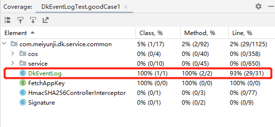
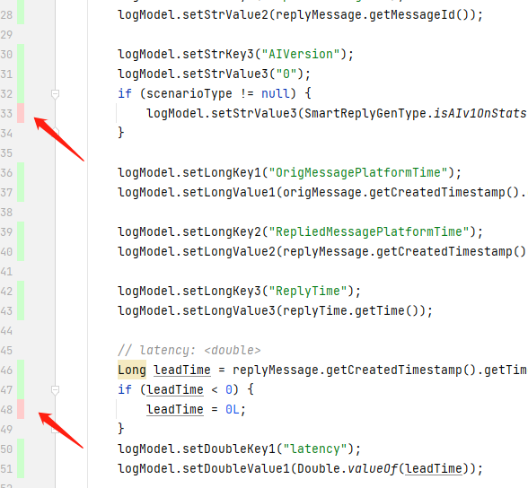
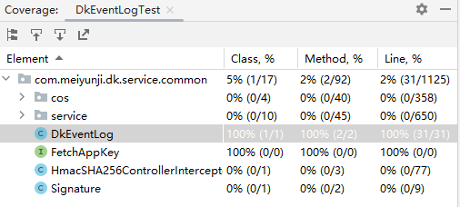

## 测试框架简介

### Junit

简介：JUnit框架是最流行的Java测试框架之一。它提供了一些功能，使编写测试变得容易，包括支持多个测试用例、断言和报告。JUnit也是多功能的，允许用各种语言编写测试

官网：https://junit.org/junit5/

关键代码：

```Java
import static org.junit.jupiter.api.Assertions.assertEquals;

import example.util.Calculator;

import org.junit.jupiter.api.Test;

class MyFirstJUnitJupiterTests {

    private final Calculator calculator = new Calculator();

    @Test//声明该方法为测试方法，可以单独运行这个测试方法
    void addition() {
        assertEquals(2, calculator.add(1, 1));//断言，如果断言失败，代表单元测试用例不通过
    }

}
```

常用注解：

| 注解        | 描述                                                         |
| ----------- | ------------------------------------------------------------ |
| @BeforeEach | 表示被注解的方法应该在当前类中的每个, , , 或方法之前执行； 类似于 JUnit 4 的. 此类方法是继承的，除非它们被覆盖或取代（即仅基于签名进行替换，而不考虑 Java 的可见性规则）。 @Test@RepeatedTest@ParameterizedTest@TestFactory@Before |
| @AfterEach  | 表示被注解的方法应该在当前类中的每个、、、 或方法之后执行； 类似于 JUnit 4 的. 此类方法是继承的，除非它们被覆盖或取代（即仅基于签名进行替换，而不考虑 Java 的可见性规则）。 @Test@RepeatedTest@ParameterizedTest@TestFactory@After |
| @BeforeAll  | 表示被注解的方法应该在当前类中的所有、、、方法之前执行； 类似于 JUnit 4 的. 此类方法是继承的，除非它们被隐藏、重写或取代（即，仅根据签名进行替换，而不考虑 Java 的可见性规则），而且必须如此，除非使用“每类”[测试实例生命周期。](https://junit.org/junit5/docs/current/user-guide/#writing-tests-test-instance-lifecycle) @Test@RepeatedTest@ParameterizedTest@TestFactory@BeforeClassstatic |
| @AfterAll   | 表示被注解的方法应该在当前类中的所有、、、方法之后执行； 类似于 JUnit 4 的. 此类方法是继承的，除非它们被隐藏、重写或取代（即，仅根据签名进行替换，而不考虑 Java 的可见性规则），而且必须如此，除非使用“每类”[测试实例生命周期。](https://junit.org/junit5/docs/current/user-guide/#writing-tests-test-instance-lifecycle) |
| @Disabled   | 用于[禁用](https://junit.org/junit5/docs/current/user-guide/#writing-tests-disabling)测试类或测试方法；类似于 JUnit 4 的@Ignore. 此类注释不会被继承。 |
| @Timeout    | 用于在测试、测试工厂、测试模板或生命周期方法的执行超过给定持续时间时失败。此类注释是继承的。 |
| @ExtendWith | 用于以[声明方式注册扩展](https://junit.org/junit5/docs/current/user-guide/#extensions-registration-declarative)。此类注释是继承的。 |

依赖：

```Java
                <dependency>
                        <groupId>org.junit.jupiter</groupId>
                        <artifactId>junit-jupiter</artifactId>
                        <scope>test</scope>
                </dependency>
```

### SpringBootTest

简介：模拟项目运行环境，按照真实程序流程执行，一般用于业务测试。

优点：完全模拟了运行环境，能产生真实的数据

缺点：会产生脏数据

官网：https://docs.spring.io/spring-boot/docs/2.3.0.RELEASE/reference/html/spring-boot-features.html#boot-features-testing

https://docs.spring.io/spring/docs/5.2.6.RELEASE/spring-framework-reference/testing.html#testing

关键代码：

```Java
package com.meiyunji.dk;

import com.meiyunji.dk.frontend.FrontendApplication;
import org.junit.jupiter.api.Test;
import org.springframework.beans.factory.annotation.Autowired;
import org.springframework.boot.test.context.SpringBootTest;
import org.springframework.kafka.core.KafkaTemplate;

/**
 * @author 向贵龙
 * @date 2023/10/18
 */
@SpringBootTest(classes = FrontendApplication.class)//声明springboot 环境
public class KafakaMessageTest {
    @Autowired
    private KafkaTemplate<String, String> kafkaTemplate;

    @Test
    void testLazadaMessageCallback() throws InterruptedException {
        String topic = "dk.lzd.msg.push-dev";
        long l = System.currentTimeMillis();
        for (int i = 0; i < 3; i++) {
            l++;
            String json = "{\n" +
                    "  \"seller_id\": 390518,\n" +
                    "  \"message_type\": 2,\n" +
                    "  \"timestamp\": "+l+",\n" +
                    "  \"site\": \"lazada_my\",\n" +
                    "  \"puid\": 864493160645001216,\n" +
                    "  \"dk_shopId\": 169127788700707,\n" +
                    "  \"data\": {\n" +
                    "    \"session_id\": \"1697081854\",\n" +
                    "    \"message_id\": \""+l+"\",\n" +
                    "    \"content\": \"{\\\"txt\\\":\\\"hello world!\\\"}\",\n" +
                    "    \"from_account_id\": \"149826\",\n" +
                    "    \"from_account_type\": 1,\n" +
                    "    \"send_time\": "+l+",\n" +
                    "    \"template_id\": 1,\n" +
                    "    \"to_account_id\": \"12345\",\n" +
                    "    \"to_account_type\": 1,\n" +
                    "    \"type\": 1,\n" +
                    "    \"site_id\": \"SG\",\n" +
                    "    \"process_msg\": \"\",\n" +
                    "    \"auto_reply\": false,\n" +
                    "    \"status\": 0\n" +
                    "  }\n" +
                    "}";

            kafkaTemplate.send(topic,json);
        }

    }
}
```

依赖：

```Java
<dependency>
    <groupId>org.springframework.boot</groupId>
    <artifactId>spring-boot-starter-test</artifactId>
    <scope>test</scope>
</dependency>
```

### MockTest

简介：构建一个虚拟环境，按照代码流程执行，一般用于功能测试。

优点：编写速度更快，不会对数据造成影响

缺点：私有方法难以测试

官网：https://site.mockito.org/

关键代码：

```Java
package com.meiyunji.dk.service.user.user.service;

import com.meiyunji.dk.common.utils.DateUtil;
import com.meiyunji.dk.data.user.goods.dao.UserExtraServiceDao;
import com.meiyunji.dk.data.user.goods.entity.UserExtraService;
import com.meiyunji.dk.data.user.shop.dao.ShopDao;
import com.meiyunji.dk.data.user.shop.entity.Shop;
import com.meiyunji.dk.service.user.user.service.impl.UserServiceImpl;
import org.junit.jupiter.api.BeforeEach;
import org.junit.jupiter.api.Test;
import org.mockito.InjectMocks;
import org.mockito.Mock;
import org.mockito.MockitoAnnotations;

import java.util.ArrayList;
import java.util.Date;
import java.util.List;

import static org.junit.jupiter.api.Assertions.assertEquals;
import static org.mockito.Mockito.*;

class UserServiceTest {
    @InjectMocks
    UserServiceImpl userService;


    @Mock
    ShopDao shopDao;

    @Mock
    UserExtraServiceDao userExtraServiceDao;


    @Mock
    UserConfigService userConfigService;

    @BeforeEach
    void setUp() {
        //初始化mock注解，也可以通过org.mockito.Mockito.*静态方法初始化对象 ，或者使用类注解@RunWith(MockitoJUnitRunner.class)
        MockitoAnnotations.openMocks(this);
    }

    private UserExtraService buildNotExpireTimeUserExtraService() {
        UserExtraService userExtraService = new UserExtraService();
        userExtraService.setExpireTime(DateUtil.addDay(new Date(), 1));
        return userExtraService;
    }

    List<Shop> buildSmtShop() {
        Shop shop = new Shop();
        shop.setIsExpireForPlatform(0);
        return new ArrayList<Shop>() {{
            add(shop);
        }};
    }

    @Test
    void getAiPermissionType() {
        doReturn(buildNotExpireTimeUserExtraService()).when(userExtraServiceDao).getByPuidOrderByExpireTime(any(), any());
        int type = userService.getAiPermissionType(1L);
        assertEquals(1, type);
        when(shopDao.getAllShopByPuidAndPlatform(any(), any())).thenReturn(buildSmtShop());
        type = userService.getAiPermissionType(1L);
        assertEquals(3, type);
        doReturn(null).when(userExtraServiceDao).getByPuidOrderByExpireTime(any(), any());
        when(shopDao.getAllShopByPuidAndPlatform(any(), any())).thenReturn(null);
        when(userConfigService.getFreeAi(any())).thenReturn(1);
        type = userService.getAiPermissionType(1L);
        assertEquals(4, type);
    }
}
```

`@Spy`注解用于**创建真实对象并监视该真实对象**。 间谍程序可以帮助调用对象的所有常规方法，同时仍可以跟踪每次交互，就像使用模拟一样。

`@Mock`注解用于创建和注入模拟实例。 我们不创建真实的对象，而是要求模拟为类创建一个模拟。

在模拟中，我们需要创建要测试的类的对象，然后插入其依赖项（*模拟*）以完全测试行为。 为此，我们使用`@InjectMock`注解。

依赖：

```Java
<dependency>
    <groupId>org.mockito</groupId>
    <artifactId>mockito-inline</artifactId>
    <scope>test</scope>
</dependency>
<!-- 用于单元测试中使用@Mock注解时使用@ExtendWith(MockitoExtension.class)-->
<dependency>
    <groupId>org.mockito</groupId>
    <artifactId>mockito-junit-jupiter</artifactId>
    <scope>test</scope>
</dependency>
```

## 测试的重要指标：覆盖率

### 在IDEA里查看覆盖率







### 查看运行覆盖率结果



双击进入类文件，绿色为覆盖代码，红色为未覆盖代码



## 实践分享

### 基于等价类划分提升覆盖率

多客的性能统计方法`logEventForAIReply`实现如下，该方法比较简单，仅有2个if语句：

```Java
public static void logEventForAIReply(AbstractMessage origMessage, AbstractMessage replyMessage, Integer scenarioType, Date replyTime, long consumingDuration) {
    DkEventLogModel logModel = new DkEventLogModel();
    logModel.setType(TrackingTypeEnum.AI.getCode());
    logModel.setPuid(String.valueOf(origMessage.getPuid()));
    logModel.setShopId(String.valueOf(origMessage.getShopId()));
    logModel.setPlatform(origMessage.getPlatform());
    logModel.setConversationId(origMessage.getConversationId());

    logModel.setStrKey1("OrigMessageId");
    logModel.setStrValue1(origMessage.getMessageId());

    logModel.setStrKey2("RepliedMessageId");
    logModel.setStrValue2(replyMessage.getMessageId());

    logModel.setStrKey3("AIVersion");
    logModel.setStrValue3("0");
    if (scenarioType != null) {
        logModel.setStrValue3(SmartReplyGenType.isAIv1OnStats(scenarioType) ? "1" : "2");
    }

    logModel.setLongKey1("OrigMessagePlatformTime");
    logModel.setLongValue1(origMessage.getCreatedTimestamp().getTime());

    logModel.setLongKey2("RepliedMessagePlatformTime");
    logModel.setLongValue2(replyMessage.getCreatedTimestamp().getTime());

    logModel.setLongKey3("ReplyTime");
    logModel.setLongValue3(replyTime.getTime());

    // latency: <double>
    Long leadTime = origMessage.getCreatedTimestamp().getTime() - replyTime.getTime();
    if (leadTime < 0) {
        leadTime = 0L;
    }
    logModel.setDoubleKey1("latency");
    logModel.setDoubleValue1(Double.valueOf(leadTime));

    logModel.setDoubleKey2("replyGenerationTime");
    logModel.setDoubleValue2(Double.valueOf(consumingDuration));

    eventLogLogger.info(JSONUtil.objectToJson(logModel));
}
```

设计单元测试用例`goodCase1()`

```Java
class DkEventLogTest {

    @Test
    void goodCase1() {
//        Logger logger = Mockito.mock(Logger.class);
//        Mockito.doAnswer(invocation -> {
//            // 获取传入的参数
//            String message = invocation.getArgument(0);
//            System.out.println(message);
//            // 在这里执行自定义的逻辑
//
//            return null; // 可能需要根据需要返回一些值
//        }).when(logger).info(Mockito.anyString());

        long puid = 1000;
        long shopId = 1001;
        String convId = "1";
        SmtMessage origMessage = new SmtMessage();
        origMessage.setPlatform("SMT");
        origMessage.setPuid(puid);
        origMessage.setShopId(shopId);
        origMessage.setMessageId("1");
        origMessage.setConversationId(convId);
        origMessage.setCreatedTimestamp(new Date());

        SmtMessage replyMessage = new SmtMessage();
        replyMessage.setPlatform("SMT");
        replyMessage.setPuid(puid);
        replyMessage.setShopId(shopId);
        replyMessage.setMessageId("2");
        replyMessage.setConversationId(convId);
        replyMessage.setCreatedTimestamp(DateUtil.addSecond(new Date(), 1000));

        Date replyTime = DateUtil.addSecond(new Date(), -3000);
        String log = DkEventLog.logEventForAIReply(origMessage, replyMessage, null, replyTime, 1000);

        DkEventLogModel logModel = JSONUtil.jsonToObject(log, DkEventLogModel.class);
        Assertions.assertEquals(logModel.getType(), TrackingTypeEnum.AI.getCode());
        Assertions.assertEquals(logModel.getPuid(), String.valueOf(puid));
        Assertions.assertEquals(logModel.getShopId(), String.valueOf(shopId));
        Assertions.assertEquals(logModel.getPlatform(), origMessage.getPlatform());
        Assertions.assertEquals(logModel.getConversationId(), convId);
        Assertions.assertEquals(logModel.getStrKey1(), "OrigMessageId");
        Assertions.assertEquals(logModel.getStrValue1(), origMessage.getMessageId());
        Assertions.assertEquals(logModel.getStrKey2(), "RepliedMessageId");
        Assertions.assertEquals(logModel.getStrValue2(), replyMessage.getMessageId());
        Assertions.assertEquals(logModel.getStrKey3(), "AIVersion");
        Assertions.assertEquals(logModel.getStrValue3(), "0");

        Assertions.assertEquals(logModel.getLongKey1(), "OrigMessagePlatformTime");
        Assertions.assertEquals(logModel.getLongValue1(), origMessage.getCreatedTimestamp().getTime());

        Assertions.assertEquals(logModel.getLongKey2(), "RepliedMessagePlatformTime");
        Assertions.assertEquals(logModel.getLongValue2(), replyMessage.getCreatedTimestamp().getTime());

        Assertions.assertEquals(logModel.getLongKey3(), "ReplyTime");
        Assertions.assertEquals(logModel.getLongValue3(), replyTime.getTime());

        // latency: <double>
        Long leadTime = replyMessage.getCreatedTimestamp().getTime() - replyTime.getTime();
        Assertions.assertEquals(logModel.getDoubleKey1(), "latency");
        Assertions.assertEquals(logModel.getDoubleValue1(), Double.valueOf(leadTime));
        
        Assertions.assertEquals(logModel.getDoubleKey2(), "replyGenerationTime");
        Assertions.assertEquals(logModel.getDoubleValue2(), Double.valueOf(1000));
    }
}
```

执行覆盖率测试后得到的效果如下：



点击后会看到没有覆盖到的代码（红色标记，if的分支逻辑）：



可以看到有2个分支没有覆盖到。基于等价类划分的方法，针对这2个分支，补充方法完全覆盖。

> **等价类划分**是一种黑盒测试方法，旨在通过选择代表整个数据集的适当子集来降低测试的数量和成本。这种方法能够发现更多的软件缺陷，并统计数据来改进和升级软件。它通过将输入和输出数据分成等效的类别集合来优化软件测试，可以有效地**减少****测试用例**的数量，提高测试效率。

注意：不能只追求覆盖率，同时要对对应逻辑增加assertion确保逻辑正确。

这里补充测试用例`goodCase2`

```Java
    @Test
    void goodCase2() {
//        Logger logger = Mockito.mock(Logger.class);
//        Mockito.doAnswer(invocation -> {
//            // 获取传入的参数
//            String message = invocation.getArgument(0);
//            System.out.println(message);
//            // 在这里执行自定义的逻辑
//
//            return null; // 可能需要根据需要返回一些值
//        }).when(logger).info(Mockito.anyString());

        long puid = 1000;
        long shopId = 1001;
        String convId = "1";
        SmtMessage origMessage = new SmtMessage();
        origMessage.setPlatform("SMT");
        origMessage.setPuid(puid);
        origMessage.setShopId(shopId);
        origMessage.setMessageId("1");
        origMessage.setConversationId(convId);
        origMessage.setCreatedTimestamp(new Date());

        SmtMessage replyMessage = new SmtMessage();
        replyMessage.setPlatform("SMT");
        replyMessage.setPuid(puid);
        replyMessage.setShopId(shopId);
        replyMessage.setMessageId("2");
        replyMessage.setConversationId(convId);
        replyMessage.setCreatedTimestamp(DateUtil.addSecond(new Date(), 1000));

        Date replyTime = DateUtil.addSecond(new Date(), 3000);
        String log = DkEventLog.logEventForAIReply(origMessage, replyMessage, 1, replyTime, 1000);
        DkEventLogModel logModel = JSONUtil.jsonToObject(log, DkEventLogModel.class);

        Long leadTime = 0L;
        Assertions.assertEquals(logModel.getStrValue3(), "1");
        Assertions.assertEquals(logModel.getDoubleValue1(), Double.valueOf(leadTime));
        Assertions.assertEquals(logModel.getDoubleValue2(), Double.valueOf(1000));
    }
```

最终效果如下



### 三元表达式拆箱问题

我们常用的三元表达 `x ? y : z` 存在隐式类型转换陷阱（俗称拆箱），尤其是当原生类型 Primitive Type 与对应的封装类型 Wrapper Type混合使用时，可能存在空指针求值而导致的空指针异常问题。

看如下多客的例子：

```Java
/**
 * 商品卡片消息，将是否预售订单状态赋值给消息。
 * @param message
 * @param shopeeProduct
 * @return
 */
public static Message assignPreOrder(Message message, ShopeeProduct shopeeProduct) {
    message.setIsPreOrder(shopeeProduct == null ? 0 : shopeeProduct.getIsPreOrder());
    return message;
}
```

对应的测试用例

```Java
@Test
void assignPreOrder_badcase1() {
    Message message = new Message();
    message.setIsPreOrder(null);
    ShopeeProduct product = new ShopeeProduct();
    product.setIsPreOrder(null);
    DkEventLog.assignPreOrder(message, product);
    Assertions.assertNull(message.getIsPreOrder());
}
```

 以上代码执行时会报空指针异常，因为`shopeeProduct.getIsPreOrder()`存在隐式类型转换。

### Mock everything

单元测试与常规测试的最大区别就是，单元测试的关注点是代码的实现过程，是为了确保方法正确而进行的测试。

> **单元测试**是对软件基本组成单元（函数、方法）进行的测试，其目的在于发现各模块内部可能存在的各种错误，主要是针对系统最基本的单元代码进行测试，

不只是验证函数的输入输出，还要对过程，对条件分支进行覆盖。

实际开发中，方法实现中对于外部的依赖，需要用较低成本（例如Mock）来实现。

假设要对多客的方法`getOpenStrategyByScenarioId(Long puid, Long shopId, String scenarioId)`补充单元测试：

```Java
/**
 * 基于策略ID获取策略列表
 * @param puid
 * @param shopId
 * @param scenarioId
 * @return
 */
@Override
public ResMsg getOpenStrategyByScenarioId(Long puid, Long shopId, String scenarioId) {
    ResMsg msg = new ResMsg();
    msg.setCode(Constant.SUCCESS);

    IntelligentShopGroup shopGroup = getShopGroupForAutoReply(puid, shopId);
    if (shopGroup == null) {
        return msg;
    }

    IntelligentScenario scenario = intelligentScenarioDao.getByScenarioId(puid, shopGroup.getId(), scenarioId);
    if (scenario == null) {
        return msg;
    }
    //查询是否存在策略信息
    List<IntelligentStrategy> strategyList = intelligentStrategyDao.getByScenarioId(puid,scenario.getSite(),scenario.getShopGroupId(),scenario.getScenarioId());
    if (!CollectionUtils.isEmpty(strategyList)) {
        Iterator<IntelligentStrategy> it = strategyList.iterator();
        while (it.hasNext()){
            IntelligentStrategy ele = it.next();
            if (ele == null || ele.getIsOpen() == null || ele.getIsOpen() == 0) {
                it.remove();
            }
        }
    }
    //返回结果
    msg.setData(strategyList);
    return msg;
}
```

对应的测试用例如下：

```Java
@Test
void getOpenStrategyByScenarioId_badCase1() {
    when(shopGroupRelationService.queryByCondition(any())).thenReturn(null);
    ResMsg res = intelligentRobotService.getOpenStrategyByScenarioId(1L, 1L, "a");
    assertEquals(res.getCode(), Constant.SUCCESS);

    List<IntelligentShopGroupRelation> list = new ArrayList<>();
    list.add(IntelligentShopGroupRelation.builder().build());
    when(shopGroupRelationService.queryByCondition(any())).thenReturn(list);
    IntelligentShopGroup shopGroup = new IntelligentShopGroup();
    shopGroup.setIsAutoReply(1);
    when(intelligentShopGroupDao.getById(any())).thenReturn(shopGroup);
    when(intelligentScenarioDao.getByScenarioId(any(),any(),any())).thenReturn(null);
    ResMsg res2 = intelligentRobotService.getOpenStrategyByScenarioId(1L, 1L, "a");
    assertEquals(res2.getCode(), Constant.SUCCESS);


    List<IntelligentShopGroupRelation> list1 = new ArrayList<>();
    list1.add(IntelligentShopGroupRelation.builder().build());
    when(shopGroupRelationService.queryByCondition(any())).thenReturn(list1);
    IntelligentShopGroup shopGroup1 = new IntelligentShopGroup();
    shopGroup1.setIsAutoReply(1);
    when(intelligentShopGroupDao.getById(any())).thenReturn(shopGroup1);

    when(intelligentScenarioDao.getByScenarioId(any(), any(), any())).thenReturn(new IntelligentScenario());
    List<IntelligentStrategy> list2 = new ArrayList<>();
    when(intelligentStrategyDao.getByScenarioId(any(),any(),any(),any())).thenReturn(list2);
    ResMsg res3 = intelligentRobotService.getOpenStrategyByScenarioId(1L, 1L, "a");
    assertEquals(res3.getCode(), Constant.SUCCESS);
    assertEquals(res3.getData(), list2);
}

@Test
void getOpenStrategyByScenarioId_goodCase1() {
    List<IntelligentShopGroupRelation> list = new ArrayList<>();
    list.add(IntelligentShopGroupRelation.builder().build());
    when(shopGroupRelationService.queryByCondition(any())).thenReturn(list);
    IntelligentShopGroup shopGroup = new IntelligentShopGroup();
    shopGroup.setIsAutoReply(1);
    when(intelligentShopGroupDao.getById(any())).thenReturn(shopGroup);

    when(intelligentScenarioDao.getByScenarioId(any(), any(), any())).thenReturn(new IntelligentScenario());
    List<IntelligentStrategy> list2 = new ArrayList<>();
    list2.add(null);
    when(intelligentStrategyDao.getByScenarioId(any(),any(),any(),any())).thenReturn(list2);
    ResMsg res = intelligentRobotService.getOpenStrategyByScenarioId(1L, 1L, "a");
    assertEquals(res.getCode(), Constant.SUCCESS);
    assertEquals(((List<IntelligentStrategy>)res.getData()).size(), 0);
}
@Test
void getOpenStrategyByScenarioId_goodCase2() {
    List<IntelligentShopGroupRelation> list = new ArrayList<>();
    list.add(IntelligentShopGroupRelation.builder().build());
    when(shopGroupRelationService.queryByCondition(any())).thenReturn(list);
    IntelligentShopGroup shopGroup = new IntelligentShopGroup();
    shopGroup.setIsAutoReply(1);
    when(intelligentShopGroupDao.getById(any())).thenReturn(shopGroup);

    when(intelligentScenarioDao.getByScenarioId(any(), any(), any())).thenReturn(new IntelligentScenario());
    List<IntelligentStrategy> list2 = new ArrayList<>();
    list2.add(null);

    IntelligentStrategy strategy1 = new IntelligentStrategy();
    strategy1.setIsOpen(null);
    list2.add(strategy1);

    IntelligentStrategy strategy2 = new IntelligentStrategy();
    strategy2.setIsOpen(0);
    list2.add(strategy2);

    when(intelligentStrategyDao.getByScenarioId(any(),any(),any(),any())).thenReturn(list2);
    ResMsg res = intelligentRobotService.getOpenStrategyByScenarioId(1L, 1L, "a");
    assertEquals(res.getCode(), Constant.SUCCESS);
    assertEquals(((List<IntelligentStrategy>)res.getData()).size(), 0);
}
@Test
void getOpenStrategyByScenarioId_goodCase3() {
    List<IntelligentShopGroupRelation> list = new ArrayList<>();
    list.add(IntelligentShopGroupRelation.builder().build());
    when(shopGroupRelationService.queryByCondition(any())).thenReturn(list);
    IntelligentShopGroup shopGroup = new IntelligentShopGroup();
    shopGroup.setIsAutoReply(1);
    when(intelligentShopGroupDao.getById(any())).thenReturn(shopGroup);

    when(intelligentScenarioDao.getByScenarioId(any(), any(), any())).thenReturn(new IntelligentScenario());
    List<IntelligentStrategy> list2 = new ArrayList<>();
    IntelligentStrategy strategy = new IntelligentStrategy();
    strategy.setIsOpen(1);
    list2.add(strategy);
    when(intelligentStrategyDao.getByScenarioId(any(),any(),any(),any())).thenReturn(list2);
    ResMsg res = intelligentRobotService.getOpenStrategyByScenarioId(1L, 1L, "a");
    assertEquals(res.getCode(), Constant.SUCCESS);
    assertEquals(((List<IntelligentStrategy>)res.getData()).size(), 1);
    assertEquals(((List<IntelligentStrategy>)res.getData()).get(0).getIsOpen(), 1);
}
```