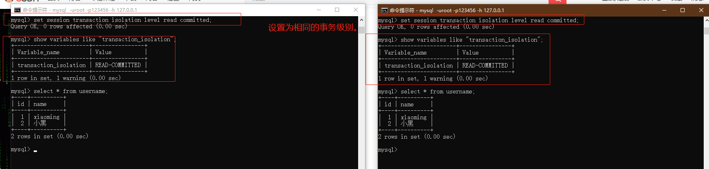

> 学习参考：极客时间---《MySQL实战45讲》

### 事务隔离：为什么你改了我还是看不见？  

简单来说，事务就是要保证一组数据库操作，要么全部成功，要么全部失败。在MySQL中，事务支持是在引擎层实现的。MySQL是一个支持多引擎的系统，但并不是所有的引擎都支持事务。比如 MySQL 原生的 MyISAM 引擎就不支持事务，这也是 MyISAM 被 InnoDB 取代的重要原因之一。  

下面以InnoDB为例，学习MySQL事务支持的特定实现。  

#### 隔离性与隔离级别  

提到事务，就会想到 ACID （Atomicity、Consistency、Isolation、Durability，即**原子性、一致性、隔离性、持久性**），今天我们就来说说其中 I，也就是“隔离性”。  

**当数据库上有多个事务同时执行的时候**（*前提*），就可能出现**脏读（dirty read）**、**不可重复读（non-repeatable read）**、**幻读（phantom read）**的问题，为了解决这些问题，就有了 “隔离级别”的概念。  

**在谈隔离级别之前，你首先要知道，你隔离得越严实，效率就会越低**。因此很多时候，我们都要在二者之间寻找一个平衡点。SQL 标准的事务隔离级别包括：**读未提交（read uncommitted）、读提交（read committed）、可重复读（repeatable read）和串行化（serializable ）**。  

- **读未提交**是指，一个事务还没提交时，它做的变更就能被别的事务看到。（脏读问题）
- **读提交**是指，一个事务提交之后，它做的变更才会被其他事务看到。（不可重复读问题）
- **可重复读**是指，一个事务执行过程中看到的数据，总是跟这个事务在启动时看到的数据是一致的。当然在可重复读隔离级别下，未提交变更对其他事务也是不可见的。（幻读问题）
- **串行化**，顾名思义是对于同一行记录，“写”会加“写锁”，“读”会加“读锁”。当出现读写锁冲突的时候，后访问的事务必须等前一个事务执行完成，才能继续执行。  （效率问题）

例如：假设表 T 中只有一列，其中一列的值为1，下面是按照时间顺序执行两个事务的行为。  

```mysql
create table T(c int) engine=InnoDB;
insert into T(c) values(1);
```


我们来看看在不同的隔离级别下，事务 A 会有哪些不同的返回结果，也就是图里面 V1、V2、V3 的返回值分别是什么。

- 若隔离级别是“读未提交”， 则 V1 的值就是 2。这时候事务 B 虽然还没有提交，但是结果已经被 A 看到了。因此，V2、V3 也都是 2。
- 若隔离级别是“读提交”，则 V1 是 1，V2 的值是 2。事务 B 的更新在提交后才能被 A 看到。所以， V3 的值也是 2。
- 若隔离级别是“可重复读”，则 V1、V2 是 1，V3 是 2。之所以 V2 还是 1，遵循的就是这个要求：事务在执行期间看到的数据前后必须是一致的。
- 若隔离级别是“串行化”，则在事务 B 执行“将 1 改成 2”的时候，会被锁住。直到事务 A 提交后，事务 B 才可以继续执行。所以从 A 的角度看， V1、V2 值是 1，V3 的值是 2。

**在实现上，数据库里面会创建一个视图，访问的时候以视图的逻辑结果为准**。 

（1）**在“可重复读”隔离级别下，这个视图是在事务启动时创建的，整个事务存在期间都用这个视图**。

（2）**在“读提交”隔离级别下，这个视图是在每个 SQL 语句开始执行的时候创建的**。

（3）这里需要注意的是，**“读未提交”隔离级别下直接返回记录上的最新值，没有视图概念**；

（4）而**“串行化”隔离级别下直接用加锁的方式来避免并行访问**。

Oracle数据库的默认隔离级别其实就是“读提交”，因此对于一些从Oracle迁移到MySQL的应用，为了保证数据库隔离级别的一致，一定要将MySQL的隔离级别设置为“读提交”。  

#### 配置和修改隔离级别  

```mysql
show variables like "transaction_isolation";
```

| Variable_name         | Value           |
| --------------------- | --------------- |
| transaction_isolation | REPEATABLE-READ |

总结来说，存在即合理，每个隔离级别都有自己的使用场景。

什么时候需要**可重复读**的场景呢？数据校对的案例：  

> 假设你在管理一个个人银行账户表。一个表存了每个月月底的余额，一个表存了账单明细。这时候你要做数据校对，也就是判断上个月的余额和当前余额的差额，是否与本月的账单明细一致。你一定希望在校对过程中，即使有用户发生了一笔新的交易，也不影响你的校对结果。
>
> 这时候使用“可重复读”隔离级别就很方便。事务启动时的视图可以认为是静态的，不受其他事务更新的影响。

#### 事务隔离的实现  

这里展开来说明“可重复读”。  在 MySQL 中，实际上每条记录在更新的时候都会同时记录一条回滚操作。记录上的最新值，通过回滚操作，都可以得到前一个状态的值。  

假设一个值从 1 被按顺序改成了 2、3、4，在**回滚日志**里面就会有类似下面的记录。  


当前值是 4，但是在查询这条记录的时候，不同时刻启动的事务会有不同的 read-view。如图中看到的，在视图 A、B、C 里面，这一个记录的值分别是 1、2、4，**同一条记录在系统中可以存在多个版本，就是数据库的多版本并发控制（MVCC）**。对于 read-view A，要得到 1，就必须将当前值依次执行图中所有的回滚操作得到。

同时你会发现，即使现在有另外一个事务正在将 4 改成 5，这个事务跟 read-view A、B、C 对应的事务是不会冲突的。

回滚日志什么时候删除呢？答案是，在不需要的时候删除。也就是说，系统会判断，当没有事务再需要用到这些回滚日志的时候，回滚日志会被删除。  

什么时候才不被需要呢？就是当系统里面没有比这个回滚日志更早的read-view的时候。？？

基于上面的说明，讨论下为什么建议尽量不要使用长事务。  

**长事务意味着系统里面会存在很老的事务视图**。由于这些事务随时可能访问数据库里面的任何数据，所以这个事务提交之前，数据库里面它可能用到的回滚记录都必须保留，**这就会导致大量占用存储空间**。

在 MySQL 5.5 及以前的版本，回滚日志是跟数据字典一起放在 ibdata 文件里的，即使长事务最终提交，回滚段被清理，文件也不会变小。我见过数据只有 20GB，而回滚段有 200GB 的库。最终只好为了清理回滚段，重建整个库（他见过，我没 :) ）。

**除了对回滚段的影响，长事务还占用锁资源，也可能拖垮整个库**，这个我们会在后面讲锁的时候展开。

#### 事务启动方式   

1. 显示启动事务语句，begin 或 start transaction。 配套的 提交语句是 commit，回滚语句是 rollback。 
2. set autocommit = 0，这个命令会将这个线程的自动提交关掉。意味着如果你只执行一个 select 语句，这个事务就启动了，而且并不会自动提交。这个事务持续存在直到你主动执行 commit 或 rollback 语句，或者断开连接。

**有些客户端连接框架会默认连接成功后先执行一个 set autocommit=0 的命令。这就导致接下来的查询都在事务中，如果是长连接，就导致了意外的长事务。**

因此，**我会建议你总是使用 set autocommit=1, 通过显式语句的方式来启动事务**。

有的开发同学会纠结“多一次交互”问题。对于一个需要频繁使用事务的业务，第二种方式每个事务在开始时都不需要主动执行一次“begin”，减少了语句的交互次数。如果有这种顾虑，建议使用 commit work and chain 语法。  

**在 autocommit 为 1 的情况下，用 begin 显式启动的事务，如果执行 commit 则提交事务。如果执行 commit work and chain，则是提交事务并自动启动下一个事务，这样也省去了再次执行 begin 语句的开销**。同时带来的好处是从程序开发的角度明确地知道每个语句是否处于事务中。  

你可以在 information_schema 库的 innodb_trx 这个表中查询长事务，比如下面这个语句，用于查找持续时间超过 60s 的事务。

```mysql
select * from information_schema.innodb_trx where TIME_TO_SEC(timediff(now(),trx_started))>60
```

#### 事务概览：

```mysql
-- 插入两条数据
INSERT INTO username(id, name) value (1, "xiaoming");
INSERT INTO username(id, name) value (2, "小黑");
SELECT * FROM username u WHERE u.id = 1;
-- 通过这个查询事务
show variables like '%tx_isolation%';
SELECT @@tx_isolation;
SHOW variables LIKE 'transaction_isolation';
-- 修改事务隔离级别
SET [SESSION | GLOBAL] TRANSACTION ISOLATION LEVEL {READ UNCOMMITTED | READ COMMITTED | REPEATABLE READ | SERIALIZABLE}
UPDATE 
-- 同一个窗口中测试不出来事务，同一个窗口应该是在一个事务中。
/*
 * sql标准的事务隔离级别
 * 读未提交（read uncommitted）：一个事务还没提交时，它做的变更就能被别的事务看到。（读取未提交的数据也被称为脏读）
 * 读提交（read committed）：一个事务提交之后，它做的变更才会被其他事务看到。
 * 可重复读（repeatedable read）：一个事务执行过程中看到的数据，总是跟这个事务在启动时
 * 看到的数据是一致的。当然在可重复读隔离级别下，未提交变更对其他事务也是不可见的。
 * 会导致一个问题（幻读：简单的说，幻读指当用户读取某一范围的数据行时，另一个事务又在该范围内插入了新行，当用户再读取该范围的数据行时，会发现有新的“幻影” 行）
 * 串行化（serializable）：顾名思义是对于同一行记录，“写”会加“写锁”，“读”会加“读锁”。
 * 当出现读写锁冲突的时候，后访问的事物必须等前一个事务执行完成，才能继续执行。
 * */
set session transaction isolation level read uncommitted;
-- 开启事务
begin;
commit;
rollback;

```

**事务**，参考 [博客](https://blog.csdn.net/Growing_hacker/article/details/109046082) 

##### 1、读未提交(read uncommitted)

**一个事务还没提交时，它做的变更就能被别的事务看到。会导致“脏读”**

设置各自窗口的事务为相同的读未提交：

```mysql
set session transaction isolation level read uncommitted;
show variables like "transaction_isolation";
```

开启两个窗口 A 和 B ，窗口  A 负责查询数据，窗口 B 负责更新数据。B客户端开启事务，B客户端执行修改操作后，不提交，随后回滚。


**此时客户端B事务 rollback，发生脏读现象。**  也就是上图中的 A 窗口，已经读了数据（小明121）出去了（后续的操作用了这个数据进行操作），实际的数据（“xiaoming”） B 窗口已经回滚了。


##### 2、读提交(read committed)  

**一个事务提交之后，它做的变更才会被其他事务看到。会导致不可重复读**。  

设置各自窗口的事务为相同的读未提交：

```mysql
set session transaction isolation level read committed;
show variables like "transaction_isolation";
```




B客户端开启事务，B客户端update数据前，A客户端查询数据结果，B客户端update数据后，A客户端查询数据结果，B客户端commit事务，A客户端查询数据结果。具体的情况如图：


**此时A客户端中，多次select结果不一样的现象称为不可重复读。**  

##### 3、可重复读（repeatable read）  

**一个事务执行过程中看到的数据，总是跟这个事务在启动时看到的数据是一致的。当然在可重复读隔离级别下，未提交变更对其他事务也是不可见的。会导致一个问题（幻读：简单的说，幻读指当用户读取某一范围的数据行时，另一个事务又在该范围内插入了新行，当用户再读取该范围的数据行时，会发现有新的“幻影” 行）**。  这里的例子有点不符合，具体的例子可以参考：[20幻读是什么，幻读有什么问题](./20幻读是什么，幻读有什么问题.md) 

设置各自窗口的事务为相同的 **可重复读**：

```mysql
set session transaction isolation level repeatable read;
show variables like "transaction_isolation";
```


执行：B客户端开启事务，**A客户端开启事务，A客户端查询数据**，B客户端update数据，A客户端查询数据，B客户端commit事务，A客户端查询数据；


**A事务中对数据查询的结果都一样，保证了数据的可重复读，但是出现事务查询的结果不是最新的表数据 “幻读”现象**。  


如上图， Session A 中的事务先根据条件 number > 0 这个条件查询表 hero ，得到了 name 列值为 '刘备' 的记录；之后 Session B 中提交了一个隐式事务，该事务向表 hero 中插入了一条新记录；之后Session A 中的事务再根据相同的条件 number > 0 查询表 hero ，得到的结果集中包含 Session B 中的事务新插入的那条记录，这种现象也被称之为 幻读。

##### 4、串行化（serializable）  

顾名思义是对于同一行记录，“写”会加“写锁”，“读”会加“读锁”。当出现读写锁冲突的时候，后访问的事物必须等前一个事务执行完成，才能继续执行。**会锁定对应的数据表格，因而会有效率的问题**。

设置各自窗口的事务为相同的 **串行化**：

```mysql
set session transaction isolation level serializable;
show variables like "transaction_isolation";
```

B客户端开启事务，执行update操作，不提交、不回滚事务；A客户端开启事务查询数据，发现等待。


提交事务之后就可以正常查询了。


#### 