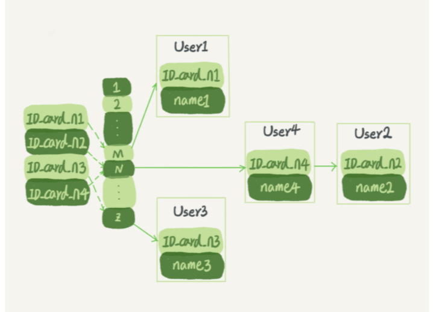

> 学习参考：极客时间---《MySQL实战45讲》

### 深入浅出索引（上）  

---

提到数据库索引，我们并不陌生，在日常工作中会经常接触到。比如某一个 SQL 查询比较慢，分析完原因之后，你可能就会说“给某个字段加个索引吧”之类的解决方案。但到底什么是索引，索引又是如何工作的呢？  

一句话简单来说，**索引的出现其实就是为了提高数据查询的效率，就像书的目录一样**。  一本500页的书，如果你想快速找到其中的某一个知识点，再不借助目录的情况下，那我估计你得找一会。同样对于数据库的表而言，**索引其实就是它的“目录”**。  

#### 索引的常见模型   

 索引的出现是为了提高查询效率，但是实现索引的方式却有很多种，所以这里也就引入了*索引模型*的概念。可以用于提高读写效率的数据结构很多，常见的比较简单的三种，它们分别是**哈希表、有序数组、搜索树**。  

##### 哈希表  

> 适用于只有等值查询的场景，例如， Memcached 及其他一些 NoSQL 引擎；不适用于范围查询

**哈希表是一种以键 - 值（key-value）存储数据的结构，我们只要输入待查找的值即 key，就可以找到其对应的值即 Value**。哈希的思路很简单，把值放在数组里，用一个哈希函数把 key 换算成一个确定的位置，然后把 value 放在数组的这个位置。

不可避免地，多个 key 值经过哈希函数的换算，会出现同一个值的情况。处理这种情况的一种方法是，拉出一个链表。

假设，你现在维护着一个身份证信息和姓名的表，需要根据身份证号查找对应的名字，这时对应的哈希索引的示意图如下所示：



​													哈希表示意图

图中，User2 和 User4 根据身份证号算出来的值都是 N，但没关系，后面还跟了一个链表。假设，这时候你要查 ID_card_n2 对应的名字是什么，处理步骤就是：首先，将 ID_card_n2 通过哈希函数算出 N；然后，按顺序遍历，找到 User2。

**需要注意的是，图中四个 ID_card_n 的值并不是递增的，这样做的好处是增加新的 User 时速度会很快，只需要往后追加。但缺点是，因为不是有序的，所以哈希索引做区间查询的速度是很慢的**。

你可以设想下，如果你现在要找身份证号在 [ID_card_X, ID_card_Y] 这个区间的所有用户，就必须全部扫描一遍了。

所以，**哈希表这种结构适用于只有等值查询的场景**，比如 Memcached 及其他一些 NoSQL 引擎。

---

##### 有序数组  

> 有序数组在**等值查询和范围查询场景**中的性能都非常优秀；不适用于频繁更新的场景；所以**有序数组索引只适用于静态存储引擎**

而**有序数组在等值查询和范围查询场景中的性能都非常优秀**。 还是上面的例子：使用有序数组来实现的话，示意图如下所示。  


​																	有序数组书意图

这里假设身份证号没有重复的，这个数组就是按照身份证号递增的顺序保存的。如果要查询 ID_card_n2对应的名字，用**二分法**就可以快速得到，这个时间复杂度是 O(log(N)) 。

同时很显然，这个索引结构支持范围查询。你要查身份证号在 [ID_card_X, ID_card_Y] 区间的 User，可以先用二分法找到 ID_card_X（如果不存在 ID_card_X，就找到大于 ID_card_X 的第一个 User），然后向右遍历，直到查到第一个大于 ID_card_Y 的身份证号，退出循环。  

**如果仅仅看查询效率，有序数组就是最好的数据结构了。但是，在需要更新数据的时候就麻烦了，你往中间插入一个记录就必须得挪动后面所有的记录，成本太高**。

所以，**有序数组索引只适用于静态存储引擎**，比如你要保存的是 2017 年某个城市的所有人口信息，这类不会再修改的数据。  

---

##### 二叉搜索树  

[「MySQL高级篇」MySQL索引原理，设计原则 - 掘金 (juejin.cn)](https://juejin.cn/post/7060427613742825502) 

二叉搜索树，还是上面的例子，如果是用这个数据结构来实现的话则是下面这种： 


二叉搜索树的特点是：**每个节点的左儿子小于父节点，父节点又小于右儿子**。这样如果你要查 ID_card_n2 的话，按照图中的搜索顺序就是按照 UserA -> UserC -> UserF -> User2 这个路径得到。这个时间复杂度是 O(log(N))。 此时这里的时间复杂度计算树的高度：h 。O(h) ，假设节点为N, 

```java
N = 2^h - 1;
2^h = n + 1;
h = log2 (n+1)  // 2 为底n+1的对数
```

当然为了维持O(log(N))的查询复杂度，你就需要保持这棵树是**平衡二叉树**（**它是一棵空树或它的左右两个子树的高度差的绝对值不超过1，并且左右两个子树都是一棵平衡二叉树**, [参考博客](https://www.cnblogs.com/zhangbaochong/p/5164994.html)），为了做这个保证，更新的时间复杂度也是 O(log(N))。


树可以有二叉，也可以有多叉。多叉树就是每个节点有多个儿子，儿子之间的大小保证从左到右递增。二叉树是搜索效率最高的，但是实际上大多数的数据库存储却并不适用二叉树。其原因是，索引不止存在内存中，还要写到磁盘上。  

想象以下一颗100万节点的平衡二叉树，树高20 。一次查询可能需要访问20个数据块。在机械硬盘时代，从磁盘随机读取一个数据块需要10 ms左右的寻址时间。也就是说，对于一个 100 万行的表，如果使用二叉树来存储，单独访问一个行可能需要 20 个 10 ms 的时间，这个查询可真够慢的。  

为了让一个查询尽量少地读取磁盘，就必须让**查询过程访问尽量少的数据块**。 那么，我们就不应该使用二叉树，而是要使用 “N” 叉树，这里，N ,取决于数据块的大小。  

>  以 InnoDB 的一个整数字段索引为例，这个 N 差不多是 1200。这棵树高是 4 的时候，就可以存 1200 的 3 次方个值，这已经 17 亿了。考虑到树根的数据块总是在内存中的，一个 10 亿行的表上一个整数字段的索引，查找一个值最多只需要访问 3 次磁盘。其实，树的第二层也有很大概率在内存中，那么访问磁盘的平均次数就更少了。

N 叉树由于在读写上的性能优点，以及适配磁盘的访问模式，已经被广泛应用在数据库引擎中了。

不管是哈希还是有序数组，或者N叉树，它们都是不断迭代、不断优化的产物或者解决方案。数据库技术发展到今天，跳表、LSM 树等数据结构也被用于引擎设计中，这里我就不再一一展开了。  

#### InnoDB 的索引模型  

在 InnoDB 中，表都是根据主键顺序以索引的形式存放的，这种存储方式的表称为索引组织表。又因为前面我们提到的，InnoDB 使用了 B+ 树索引模型，所以数据都是存储在 B+ 树中的。

**每一个索引在 InnoDB 里面对应一棵 B+ 树。**

[B树 B-树 B+树 B*树](https://cloud.tencent.com/developer/article/1021946)  

假设，我们有一个主键列为 ID 的表，表中有字段 k，并且在 k 上有索引。这个表的建表语句是：

```mysql
DROP TABLE t ;
CREATE TABLE T(
	id int PRIMARY KEY,
	k int NOT NULL,
	name varchar(16),
	INDEX (k)
)engine=InnoDB;
```

插入几条记录

 

表中 R1~R5 的 (ID,k) 值分别为 (100,1)、(200,2)、(300,3)、(500,5) 和 (600,6)，两棵树的示例示意图如下。


从图中不难看出，**根据叶子节点的内容，索引类型分为主键索引和非主键索引**。  

***

**主键索引的叶子节点村的是整行数据。在InnoDB里，主键索引页被称为聚簇索引（clustered index）。**  

**非主键索引的叶子节点内容是主键的值。在 InnoDB 里，非主键索引也被称为二级索引（secondary index）。**

根据上面的索引结构说明，我们来讨论一个问题：**基于主键索引和普通索引的查询有什么区别？**。  

- 如果语句是 select * from T where ID=500，**即主键查询方式，则只需要搜索 ID 这棵 B+ 树**；
- 如果语句是 select * from T where k=5，**即普通索引查询方式，则需要先搜索 k 索引树，得到 ID 的值为 500，再到 ID 索引树搜索一次。这个过程称为回表**。

也就是说，基于非主键索引的查询需要多扫描一棵索引树。因此，我们在应用中应该尽量使用主键查询。  

***

#### 索引维护  

B+ 树为了维护索引有序性，在插入新值的时候需要做必要的维护。以上面这个图为例，如果插入新的行 ID 值为 700，则只需要在 R5 的记录后面插入一个新记录。如果新插入的 ID 值为 400，就相对麻烦了，需要逻辑上挪动后面的数据，空出位置。

而**更糟的情况是，如果 R5 所在的数据页已经满了，根据 B+ 树的算法，这时候需要申请一个新的数据页，然后挪动部分数据过去。这个过程称为页分裂**。在这种情况下，性能自然会受影响。

除了性能外，页分裂操作还影响数据页的利用率。原本放在一个页的数据，现在分到两个页中，整体空间利用率降低大约 50%。

当然**有分裂就有合并**。当相邻两个页由于删除了数据，利用率很低之后，会将数据页做合并。合并的过程，可以认为是分裂过程的逆过程。

##### 什么时候适合用自增主键索引？  

基于上面的索引维护过程说明，我们来讨论一个案例：

> 你可能在一些建表规范里面见到过类似的描述，要求建表语句里一定要有自增主键。当然事无绝对，我们来分析一下哪些场景下应该使用自增主键，而哪些场景下不应该。

自增主键是指自增列上定义的主键，在建表语句中一般是这样定义：`NOT NULL PRIMARY KEY AUTO_INCREMENT`.   插入新记录的时候可以不指定ID的值，系统会获取当前ID最大值加1作为下一条记录的ID值。也就是说，自增主键的插入数据模式，正符合了我们前面提到的递增插入的场景。每次插入一条新记录，都是追加操作，都不涉及到挪动其他记录，也不会触发叶子节点的分裂。  

而有业务逻辑的字段做主键，则往往不容易保证有序插入，这样写数据成本相对较高。  

除了考虑性能外，我们还可以从存储空间的角度来看。假设你的表中确实有一个唯一字段，比如字符串类型的身份证号，那应该用身份证号做主键，还是用自增字段做主键呢？

由于每个非主键索引的叶子节点上都是主键的值。如果用身份证号做主键，那么每个二级索引的叶子节点占用约 20 个字节，而如果用整型做主键，则只要 4 个字节，如果是长整型（bigint）则是 8 个字节。

**显然，主键长度越小，普通索引的叶子节点就越小，普通索引占用的空间也就越小。**  

所以，从性能和存储空间方面考量，自增主键往往是更合理的选择。


有没有什么场景适合用业务字段直接做主键的呢？还是有的。比如，有些业务的场景需求是这样的：

1. **只有一个索引**；（这个表中就只有这一个索引）
2. **该索引必须是唯一索引**。

你一定看出来了，这就是典型的 KV 场景。

由于没有其他索引，所以也就不用考虑其他索引的叶子节点大小的问题。

这时候我们就要优先考虑上一段提到的“**尽量使用主键查询**”原则，直接将这个索引设置为主键，可以避免每次查询需要搜索两棵树。  

重建索引k，写法：

```mysql
alter table T drop index k;
alter table T add index(k);
```

重建主键索引，也可以这么写：

```mysql
alter table T drop primary key;
alter table T add primary key(id);
```

这两种有什么区别？

先弄清楚为什么要重建索引？索引可能因为删除，或者页分裂等原因，导致数据页有空洞，重建索引的过程会创建一个新的索引，把数据按顺序插入，这样页面的利用率最高，也就是索引更紧凑、更省空间。 

**重建索引k的做法是合理的，可以达到省空间的目的。但是，重建主键的过程不合理**。**不论是删除主键还是创建主键，都会将整个表重建**。所以连着执行这两个语句的话，第一个语句就白做了。这两个语句，你可以用这个语句代替 ： `alter table T engine=InnoDB`（这个语句在InnoDB里会触发mysql重建该表，并进行碎片处理）。


看到的一些讨论：

1. 每一个表是好几棵B+树，树的节点key值就是某一行的主键，value是该行的其他数据。新建索引就是新增一个B+树。

2. “N叉树”的N值在MySQL中是可以被人工调整的么？曾经面试被问到过这问题，当时就懵逼了. 解析：可以按照调整key的大小的思路来说，


#### 一些索引区别  

##### 聚簇索引和非聚簇索引  

- 聚簇索引：将数据存储与索引放到了一块，找到索引也就找到了数据
- 非聚簇索引：将数据存储于索引分开结构，索引结构的叶子节点指向了数据的对应行，myisam通过key_buffer把索引先缓存到内存中，当需要访问数据时（通过索引访问数据），在内存中直接搜索索引，然后通过索引找到磁盘相应数据，这也就是为什么索引不在key buffer命中时，速度慢的原因。

 博客：[聚簇索引与非聚簇索引（也叫二级索引）--最清楚的一篇讲解](https://cloud.tencent.com/developer/article/1541265)   