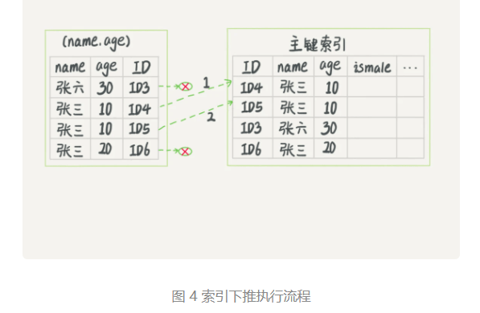

> 学习参考：极客时间---《MySQL实战45讲》

### 深入浅出索引（下） 

  在下面这个表 T 中，如果我执行 `select * from T where k between 3 and 5`，需要执行几次树的搜索操作，会扫描多少行？

这是这个表的索引结构


我们一起看看这条SQL查询语句的执行流程 `select * from T where k between 3 and 5`：

1. 在 k 索引树上找到 k=3 的记录，取得 ID = 300；
2. 再到 ID 索引树查到 ID=300 对应的 R3；
3. 在 k 索引树取下一个值 k=5，取得 ID=500；
4. 再回到 ID 索引树查到 ID=500 对应的 R4；
5. 在 k 索引树取下一个值 k=6，不满足条件，循环结束。

在这个过程中，**回到主键索引树搜索的过程，称为回表**。可以看到，这个查询过程读了 k 索引树的3条记录（步骤1、3和5），回表了两侧（步骤2和4）。 

在这个例子中，由于查询结果所需要的数据只在主键索引上有，所以不得不徽标。那么，有没有可能经过索引优化，**避免回表过程**呢？  

#### 覆盖索引   

如果执行的语句是 select ID from T where k between 3 and 5，这时只需要查 ID 的值，而 ID 的值已经在 k 索引树上了，因此可以直接提供查询结果，不需要回表。也就是说，在这个查询里面，**索引 k 已经“覆盖了”我们的查询需求，我们称为覆盖索引**。  

**由于覆盖索引可以减少树的搜索次数，显著提升查询性能，所以使用覆盖索引是一个常用的性能优化手段。**  但是：因为覆盖索引的目的就是”不回表“，所以只有索引包含了where条件部分和select返回部分的所有字段，才能实现这个目的。  所以，覆盖所以不能支付该要查询的列，同时必须要将where后面的查询条件都覆盖。  

需要注意的是，在引擎内部使用覆盖索引在索引 k 上其实读了三个记录，R3~R5（对应的索引 k 上的记录项），但是对于 MySQL 的 Server 层来说，它就是找引擎拿到了两条记录，因此 MySQL 认为扫描行数是 2。  

基于上面覆盖索引的说明，我们来讨论一个问题：**在一个市民信息表上，是否有必要将身份证号和名字建立联合索引？**

**联合索引**：比较简单的是单列索引（b+tree）。遇到多条件查询时，不可避免的会使用多列索引。联合索引又叫复合索引。 参考： [mysql联合索引详解](https://cloud.tencent.com/developer/news/44861)  

> （部分内容）b+tree结构如下：
>
> 
>
> 每一个磁盘块在mysql中是一个页，页大小是固定的，mysql innodb的默认的页大小是16k，每个索引会分配在页上的数量是由字段的大小决定。当字段值的长度越长，每一页上的数量就会越少，因此在一定数据量的情况下，索引的深度会越深，影响索引的查找效率。
>
> 对于**复合索引（多列b+tree，使用多列值组合而成的b+tree索引）**。**遵循最左侧原则，从左到右的使用索引中的字段，一个查询可以只使用索引中的一部份，但只能是最左侧部分**。例如索引是key index (a,b,c). 可以支持a  a,b a,b,c 3种组合进行查找，但不支持 b,c进行查找。当使用最左侧字段时，索引就十分有效。
>

假如市民表的定义是这样的：
```mysql
CREATE TABLE `tuser` (
  `id` int(11) NOT NULL,
  `id_card` varchar(32) DEFAULT NULL,
  `name` varchar(32) DEFAULT NULL,
  `age` int(11) DEFAULT NULL,
  `ismale` tinyint(1) DEFAULT NULL,
  PRIMARY KEY (`id`),
  KEY `id_card` (`id_card`),
  KEY `name_age` (`name`,`age`)
) ENGINE=InnoDB
```

我们知道，身份证号是市民的唯一标识。也就是说，**如果有根据身份证号查询市民信息的需求，我们只要在身份证号字段上建立索引就够了**。而**再建立一个（身份证号、姓名）的联合索引，是不是浪费空间**？  

如果现在有一个高频请求，要根据市民的身份证号查询他的姓名，这个联合索引就有意义了。它可以在这个高频请求上用到覆盖索引，不再需要回表查整行记录，减少语句的执行时间。  

**覆盖索引的第二个使用：在联合索引上使用，也可以避免回表。这个也可以应用到项目开发中。**   

#### 最左前缀原则  

看到这里你一定有一个疑问，如果为每一种查询都设计一个索引，索引是不是太多了。如果我现在要按照市民的身份证号去查他的家庭地址呢？虽然这个查询需求在业务中出现的概率不高，但总不能让它走全表扫描吧？反过来说，单独为一个不频繁的请求创建一个（身份证号，地址）的索引又感觉有点浪费。应该怎么做呢？

**B+ 树这种索引结构，可以利用索引的“最左前缀”，来定位记录。**

使用（name, age）这个联合索引来分析。  


可以看到，索引项是按照索引定义里面出现的字段顺序排序的。

一种情况（字段）：当你的逻辑需求是查到**所有名字是“张三”的人时**，**可以快速定位到 ID4** ,然后向后遍历得到所需要的结果（找到第一个之后循环向后遍历）。  

另一种情况（字符串部分）：**如果你要查的是所有名字第一个字是“张”的人，你的 SQL 语句的条件是"where name like ‘张 %’"。这时，你也能够用上这个索引**，查找到第一个符合条件的记录是 ID3，然后向后遍历，直到不满足条件为止。  

可以看到，不只是索引的全部定义，只要满足最左前缀，就可以利用索引来激素检索。这个最左前缀可以时联合索引的最左 N 个字段，也可以时字符串索引的最左 M 个字符。  

基于上面对最左前缀索引的说明，我们来讨论一个问题：**在建立联合索引的时候，如何安排索引内的字段顺序。**

这里我们的评估标准是，索引的复用能力。因为可以支持最左前缀，所以当已经有了 (a,b) 这个联合索引后，一般就不需要单独在 a 上建立索引了。**因此，第一原则是，如果通过调整顺序，可以少维护一个索引，那么这个顺序往往就是需要优先考虑采用的**。  

所以现在你知道了，这段开头的问题里，我们要为高频请求创建 (身份证号，姓名）这个联合索引，并用这个索引支持“根据身份证号查询地址”的需求。

那么，如果既有联合查询，又有基于 a、b 各自的查询呢？查询条件里面只有 b 的语句，是无法使用 (a,b) 这个联合索引的，这时候你不得不维护另外一个索引，也就是说你需要同时维护 (a,b)、(b) 这两个索引。

这时候，我们要**考虑的原则就是空间**了。比如上面这个市民表的情况，name 字段是比 age 字段大的 ，那我就建议你创建一个（name,age) 的联合索引和一个 (age) 的单字段索引。

#### 索引下推  

上面说到，**满足最左前缀原则的时候，最左前缀可以用于在索引中定位记录**。这时，你可能要问，**那些不符合最左前缀的部分**，会怎么样呢？  

我们还是以市民表的**联合索引（name, age）**为例。如果现在有一个需求：检索出表中“名字第一个字是张，而且年龄是 10 岁的所有男孩”。那么，SQL 语句是这么写的：

```mysql
mysql> select * from tuser where name like '张%' and age=10 and ismale=1;
```

这里就是满足最左前缀 `张%` 和不符合最左前缀的部分 `age = 10`，这个语句在搜索索引树的时候，只能用 “张”，找到第一个满足条件的记录 ID3 。当然，这还不错，总比全表扫描要好。  

然后呢？当然是判断其他条件是不是满足。

- 在 MySQL 5.6 之前，只能从 ID3 开始一个个回表。到主键索引上找出数据行，再对比字段值。
- 而 MySQL 5.6 引入的**索引下推优化（index condition pushdown)， 可以在索引遍历过程中，对索引中包含的字段先做判断，直接过滤掉不满足条件的记录，减少回表次数**。  

如下图，两个过程的执行流程图：  




图3和4这两个图里面，每一个虚线箭头表示回表一次。图 3 中，在 (name,age) 索引里面我特意去掉了 age 的值，这个过程 InnoDB 并不会去看 age 的值，只是按顺序把“name 第一个字是’张’”的记录一条条取出来回表。因此，需要回表 4 次。

图 4 跟图 3 的区别是，InnoDB 在 (name,age) 索引内部就判断了 age 是否等于 10，对于不等于 10 的记录，直接判断并跳过。在我们的这个例子中，只需要对 ID4、ID5 这两条记录回表取数据判断，就只需要回表 2 次。（直接在内部就过滤了不满足条件的记录了）

#### 问题  

实际上主键索引也是可以使用多个字段的。DBA 小吕在入职新公司的时候，就发现自己接手维护的库里面，有这么一个表，表结构定义类似这样的：

```mysql
CREATE TABLE `geek` (
  `a` int(11) NOT NULL,
  `b` int(11) NOT NULL,
  `c` int(11) NOT NULL,
  `d` int(11) NOT NULL,
  PRIMARY KEY (`a`,`b`),
  KEY `c` (`c`),
  KEY `ca` (`c`,`a`),
  KEY `cb` (`c`,`b`)
) ENGINE=InnoDB;
```

公司的同事告诉他说，由于历史原因，这个表需要 a、b 做联合主键，这个小吕理解了。但是，学过本章内容的小吕又纳闷了，既然主键包含了 a、b 这两个字段，那意味着单独在字段 c 上创建一个索引，就已经包含了三个字段了呀，为什么要创建“ca”“cb”这两个索引？

同事告诉他，是因为他们的业务里面有这样的两种语句：

```mysql 
select * from geek where c=N order by a limit 1;
select * from geek where c=N order by b limit 1;
```

我给你的问题是，这位同事的解释对吗，为了这两个查询模式，这两个索引是否都是必须的？为什么呢？

#### 回答 ：

> 参考理解见官网： https://dev.mysql.com/doc/refman/8.0/en/index-extensions.html 
>
> [`InnoDB`](https://dev.mysql.com/doc/refman/8.0/en/innodb-storage-engine.html) automatically extends each secondary index by appending the primary key columns to it.
>
> InnoDB 自动会继承扩展每个二级索引，通过将主键列附加到二级索引的列。
>
> 上面的 二级索引 c ，InnoDB内部会自动扩展这个索引，并作为列（c, a, b）。ca 会扩展成 (c, a, b)， cb 会扩展成 （c,  b, a)。所以 ca 可以去掉，cb 需要保留。  

主键 a,b 的聚簇索引组织顺序相当于 order by a, b，也就是先按照 a 排序，再按 b 排序， c 无序。

索引 c, a 的组织是先按 c 排序，再按 a 排序，同时记录主键。

```mysql
-c-|-a-|-主键部分b-(这里只有 b )
2 1 3
2 2 2 
3 1 2 
3 1 4
3 2 1
4 2 3
这个跟索引 c 的数据是一摸一样的。
```

索引 cb 的组织是先按 c 排序，然后再按 b 排序，同时记录主键

```mysql
-c-|-b-|-主键部分a-
2 2 2
2 3 1
3 1 2 
3 2 1
3 4 1
4 3 2
```

所以，结论是 ca 可以去掉，cb 需要保留。  

#### 其中一些评论：

（1）老师，有这么个问题
一张表两个字段id, uname,id主键，uname普通索引
SELECT * FROM test_like WHERE uname LIKE 'j'/ 'j%' / '%j'/ '%j%'
模糊查询like后面四种写法都可以用到uname的普通索引

添加一个age字段
like后面的'%j'/ '%j%' 这两种情况用不到索引
把select * 改为 select id / select uname / select id,uname
like后面'j'/ 'j%' / '%j'/ '%j%' 这四种情况又都可以用到uname普通索引

建立uname,age的联合索引
模糊查询还是 LIKE 'j'/ 'j%' / '%j'/ '%j%'四种情况
其中select id / select uname / select id,uname
会用到uname的普通索引
select * 会用到uname,age的组合索引

看到好些文章会说模糊查询时以%开头不会用到索引，实践后发现结论跟文章描述的有出入。
看了索引的这两节内容对上面的各种情况有的可以解释通了，有的仍然有些模糊，想问下老师上面这些情况使用索引时为什么是这样的？

回答：好问题，这个是关于“用索引” 和 “用索引快速定位记录”的区别。 简单回答：“用索引”有一种用法是 “顺序扫描索引”。 

（2）老师，下面两条语句有什么区别，为什么都提倡使用2:
1.select * from T where k in(1,2,3,4,5)
2.select * from T where k between 1 and 5

回答：第一个要树搜索5次；第二个搜索一次


