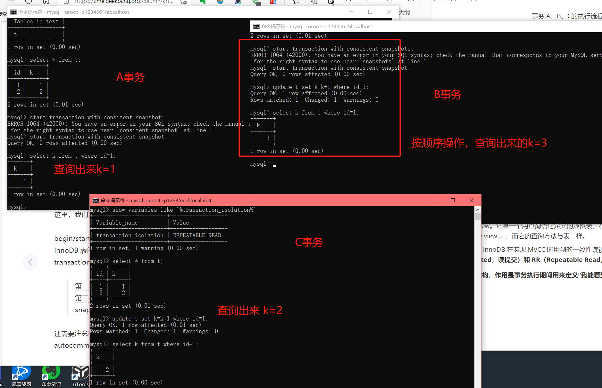
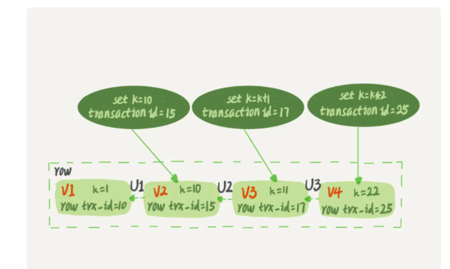
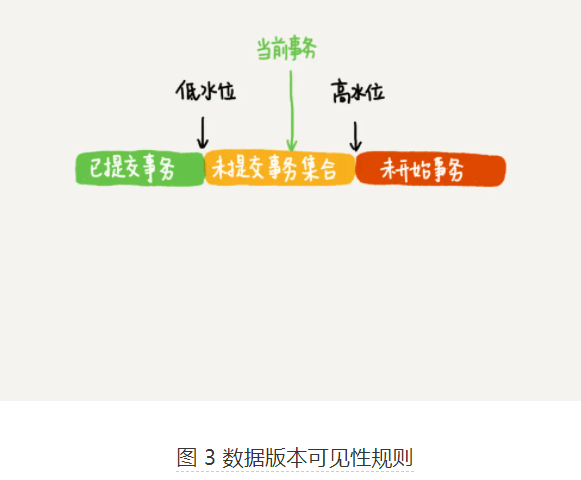

> 学习：极客时间---《MySQL实战45讲》

## 事务到底是隔离的还是不隔离的 

[上一篇](./07行锁功过：怎么减少行锁对性能的影响.md) 

在第三篇 [事务隔离](./03事务隔离.md) 中事务隔离级别时候提到过，**如果是可重复读隔离级别，事务 T 启动的时候会创建一个视图 read-view，之后事务 T 执行期间，即使有其他事务修改了数据，事务 T 看到的仍然跟在启动时看到的一样。也就是说，一个在可重复读隔离级别下执行的事务，好像与世无争，不受外界影响**。  

但是在 [上一篇](./07行锁功过：怎么减少行锁对性能的影响.md) 中讲行锁的时候又提到，一个事务要更新一行，如果刚好有另外一个事务拥有这一行的行锁，它又不能这么超然了，会被锁住，进入等待状态（是指A更新，B 查询然后更新么？）。**问题是，既然进入了等待状态，那么等到这个事务自己获取到行锁要更新数据的时候，它读到的值又是什么呢？**  

如下面例子：

```mysql
mysql> CREATE TABLE `t` (
  `id` int(11) NOT NULL,
  `k` int(11) DEFAULT NULL,
  PRIMARY KEY (`id`)
) ENGINE=InnoDB;
insert into t(id, k) values(1,1),(2,2);
```


 													图1，事务 A、B、C的执行流程 

**begin/start transaction 命令并不是一个事务的起点，在执行到它们之后的第一个操作 InnoDB 表的语句，事务才真正启动。**如果你想要马上启动一个事务，可以使用 `start transaction with consistent snapshot` 这个命令。

> 第一种启动方式，**一致性视图是在执行第一个快照读语句时创建的**；也就是执行第一个语句时创建的。
>
> 第二种启动方式，**一致性视图是在执行 start transaction with consistent snapshot 时创建的**。

没有特别说明都是默认`autocommit = 1`。  

在这个例子中，事务 C 没有显式地使用 begin/commit，表示这个 update 语句本身就是一个事务，语句完成的时候会自动提交。事务 B 在更新了行之后查询 ; 事务 A 在一个只读事务中查询，并且时间顺序上是在事务 B 的查询之后。

这时，如果我告诉你**事务 B 查到的 k 的值是 3，而事务 A 查到的 k 的值是 1，你是不是感觉有点晕**呢？（晕球了）  

> 自己理解：事务A的一致性视图执行第一句就有了，后面查询应该都是1，其他事务提交之后，查询应该也是1，出现幻读。事务B的一致性也是执行第一句就有了，这时应该也是 1，应该和A一样才对，更新完应该是2。事务C就正常更新为2了。



实际操作之后，查询到的值确实是上面说的那样。  

在MySQL里，有两个“视图”的概念：  

- 一个是 view。它是一个用查询语句定义的虚拟表，在调用的时候执行查询语句并生成结果。创建视图的语法是 create view … ，而它的查询方法与表一样。
- 另一个是 InnoDB 在实现 MVCC 时用到的一致性读视图，即 consistent read view，**用于支持 RC（Read Committed，读提交）和 RR（Repeatable Read，可重复读）隔离级别的实现**。

**视图，它没有物理结构，作用是事务执行期间用来定义“我能看到什么数据**。  

在第三篇文中，有涉及解释过 MVCC的实现逻辑。同一条记录在系统中可以存在多个版本，就是数据库的多版本并发控制（MVCC）。 

#### “快照”在MVCC里是怎么工作的？    

在可重复读隔离级别下，事务在启动的时候就“拍了个快照”。注意，**这个快照是基于整个数据库的**。  

这时，你会说这看上去不太现实啊。如果一个库有 100G，那么我启动一个事务，MySQL 就要拷贝 100G 的数据出来，这个过程得多慢啊。可是，我平时的事务执行起来很快啊。实际上，我们并不需要拷贝出这 100G 的数据。我们先来看看这个快照是怎么实现的。  

InnoDB里面每个事务有一个唯一的事务ID，叫作 **transaction id**。**它是在事务开始的时候向 InnoDB 的事务系统申请的，是按申请顺序严格递增的**。  

而**每行数据也都是有多个版本的**。**每次事务更新数据的时候，都会生成一个新的数据版本，并且把 transaction id 赋值给这个数据版本的事务 ID，记为 row trx_id。同时，旧的数据版本要保留，并且在新的数据版本中，能够有信息可以直接拿到它。** 每个数据版本都有一个事务id，记作 row trx_id。

**也就是说，数据表中的一行记录，其实可能有多个版本 (row)，每个版本有自己的 row trx_id**。  

如下图所示，就是一个记录被多个事务连续更新后的状态。  



​														图2 ，行状态变更图   

图中虚线框里时同一行数据的 4 个版本，当前最新版本是V4，k的值是22，它是被transaction id = 25的事务更新的，因此它的 row trx_id 也是25.  

你可能会问，前面的文章不是说，**语句更新会生成 undo log（回滚日志）吗？那么，undo log 在哪呢？**   

实际上，**图 2 中的三个虚线箭头，就是 undo log；而 V1、V2、V3 并不是物理上真实存在的，而是每次需要的时候根据当前版本和 undo log 计算出来的。比如，需要 V2 的时候，就是通过 V4 依次执行 U3、U2 算出来。  **是通过计算得到的，根据 undo log。  

明白了多版本和row trx_id的概念后，我们再来想一下，InnoDB 是怎么定义那个”100G“的快照了。  

按照可重复读的定义，**一个事务启动的时候，能够看到所有已经提交的事务结果**。**但是之后，这个事务执行期间，其他事务的更新对它不可见**。也就是说，开启事务之后，可重复读的隔离级别下，查询到的一直是开始时候那个结果。  

因此，一个事务只需要在启动的时候声明说，”以我启动的时刻为准，如果一个数据版本是在我启动之前生成的，就认；如果是我启动之后才生成的，我就不认，我必须要找到它的上一个版本“。（为啥要找上一个版本？）

当然，如果”上一个版本“也不可见，那就得继续往前找。还有，如果是整个事务自己更新的数据，它自己还是要认的。  

在实现上，InnoDB为每个事务构造了一个数组，用来保存这个事务启动瞬间，当前正在活跃的所有事务ID,”活跃“指的就是，启动了还没有提交。  

**数组里面事务 ID 的最小值记为低水位**，**当前系统里面已经创建过的事务 ID 的最大值加 1 记为高水位**。（一个是数组里面，一个是当前系统里面已经创建过的事务ID).  

**这个视图数组和高水位，就组成了当前事务的一致性视图（read-view）**。

而**数据版本的可见性规则，就是基于数据的 row trx_id 和这个一致性视图的对比结果得到的**。

这个视图数组把所有的row trx_id分成了几种不同的情况。  



这样，对于当前事务的启动瞬间来说，一个数据版本的 row trx_id，有以下几种可能：

1. 如果落在绿色部分，表示这个版本是已提交的事务或者是当前事务自己生成的，这个数据是可见的；
2. 如果落在红色部分，表示这个版本是由将来启动的事务生成的，是肯定不可见的；
3. 如果落在黄色部分，那就包括两种情况
   - a.  若 row trx_id 在数组中，表示这个版本是由还没提交的事务生成的，不可见；
   - b.  若 row trx_id 不在数组中，表示这个版本是已经提交了的事务生成的，可见。  

比如，对于图2中的数据来说，如果有一个事务，它的低水位是18，那么访问它这一行数据时，就会从V4通过U3计算出V3，所以在它看来，这一行的值是11。   

> 黄色区间是包含了已经提交的事务的，已经提交的事务的id可以比最低水位大，但小于最高水位。比如，有5，6，7，8，9这5个事务，9是当前事务，5，6，8是正在执行中的事务，7是已经提交的事务id。那么当前视图数组是[5 6 8 9]，最低水位是5，最高水位是10。事务7落在落在黄色区间，不在数组中，但已提交，所以也可见。这个评论很说明问题，其他都讲的模棱两可。  


