> 学习：极客时间---《MySQL实战45讲》

## 事务到底是隔离的还是不隔离的 

[上一篇](./07行锁功过：怎么减少行锁对性能的影响.md) 

在第三篇 [事务隔离](./03事务隔离.md) 中事务隔离级别时候提到过，**如果是可重复读隔离级别，事务 T 启动的时候会创建一个视图 read-view，之后事务 T 执行期间，即使有其他事务修改了数据，事务 T 看到的仍然跟在启动时看到的一样。也就是说，一个在可重复读隔离级别下执行的事务，好像与世无争，不受外界影响**。  

但是在 [上一篇](./07行锁功过：怎么减少行锁对性能的影响.md) 中讲行锁的时候又提到，一个事务要更新一行，如果刚好有另外一个事务拥有这一行的行锁，它又不能这么超然了，会被锁住，进入等待状态（是指A更新，B 查询然后更新么？）。**问题是，既然进入了等待状态，那么等到这个事务自己获取到行锁要更新数据的时候，它读到的值又是什么呢？**  

如下面例子：

```mysql
mysql> CREATE TABLE `t` (
  `id` int(11) NOT NULL,
  `k` int(11) DEFAULT NULL,
  PRIMARY KEY (`id`)
) ENGINE=InnoDB;
insert into t(id, k) values(1,1),(2,2);
```

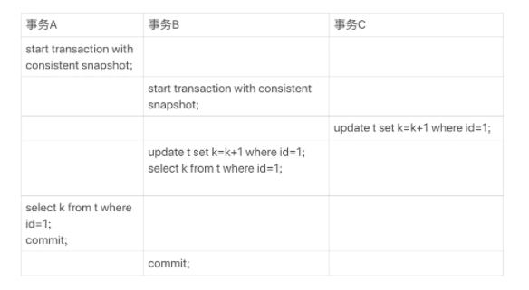

事务 A、B、C的执行流程 

**begin/start transaction 命令并不是一个事务的起点，在执行到它们之后的第一个操作 InnoDB 表的语句，事务才真正启动。**如果你想要马上启动一个事务，可以使用 `start transaction with consistent snapshot` 这个命令。

> 第一种启动方式，**一致性视图是在执行第一个快照读语句时创建的**；也就是执行第一个语句时创建的。
>
> 第二种启动方式，**一致性视图是在执行 start transaction with consistent snapshot 时创建的**。

没有特别说明都是默认`autocommit = 1`。  

> 事务自动提交设置，默认为1，即除非显示声明一个事务的开始，否则每一个查询都会被当做独立的事务被处理

在这个例子中，事务 C 没有显式地使用 begin/commit，表示这个 update 语句本身就是一个事务，语句完成的时候会自动提交。事务 B 在更新了行之后查询 ; 事务 A 在一个只读事务中查询，并且时间顺序上是在事务 B 的查询之后。

这时，如果我告诉你**事务 B 查到的 k 的值是 3，而事务 A 查到的 k 的值是 1，你是不是感觉有点晕**呢？

> 自己理解：事务A的一致性视图执行第一句就有了，后面查询应该都是1，其他事务提交之后，查询应该也是1，出现可重复读。事务B的一致性也是执行第一句就有了，**但是事务C更新且提交了（需要注意这一点）**，k = 2；然后事务B做操作，读取k的值。

在MySQL里，**有两个“视图**”的概念：  

- 一个是 view。它是一个用查询语句定义的虚拟表，在调用的时候执行查询语句并生成结果。创建视图的语法是 create view … ，而它的查询方法与表一样。
- 另一个是 InnoDB 在实现 MVCC 时用到的一致性读视图，即 consistent read view，**用于支持 RC（Read Committed，读提交）和 RR（Repeatable Read，可重复读）隔离级别的实现**。

**它没有物理结构，作用是事务执行期间用来定义“我能看到什么数据**。  

在第 3 篇文章 《[事务隔离，为什么你改了我还是i看不见](./03事务隔离.md)》 中，我跟你解释过 MVCC 的实现逻辑。今天为了说明查询和更新的区别，我换一个方式说明，把 read view 拆开。你可以结合这两篇文章的说明来更深一步地理解 MVCC。  

#### “快照”在 MVCC 里是怎么工作的？

同一条记录在系统中可以存在多个版本，就是数据库的多版本并发控制（MVCC）  

在可重复读隔离级别下，事务在启动的时候就“拍了个快照”。**注意，这个快照是基于整库的**。  

这时，你会说这看上去不太现实啊。如果一个库有 100G，那么我启动一个事务，MySQL 就要拷贝 100G 的数据出来，这个过程得多慢啊。可是，我平时的事务执行起来很快啊。  

实际上，我们并不需要拷贝出这 100G 的数据。我们先来看看这个快照是怎么实现的。  

##### 快照是怎么实现的  

InnoDB 里面每个事务有一个唯一的事务 ID，叫作 `transaction id`。**它是在事务开始的时候向 InnoDB 的事务系统申请的，是按申请顺序严格递增的**。  

而**每行数据也都是有多个版本的**。**每次事务更新数据的时候，都会生成一个新的数据版本，并且把 transaction id 赋值给这个数据版本的事务 ID，记为 row trx_id**。**同时，旧的数据版本要保留，并且在新的数据版本中，能够有信息可以直接拿到它**。(要有一个方式可以拿到旧的数据版本)    

如图 2 所示，**就是一个记录被多个事务连续更新后的状态**。（这时一个回滚的流向）  

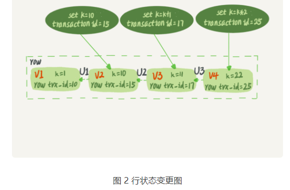

图中虚线框里是同一行数据的 4 个版本，当前最新版本是 V4，k 的值是 22，它是被 transaction id 为 25 的事务更新的，因此它的 row trx_id 也是 25。

你可能会问，前面的文章不是说，语句更新会生成 **undo log（回滚日志）**吗？那么，**undo log 在哪呢？**

实际上，**图 2 中的三个虚线箭头，就是 undo log**；而 V1、V2、V3 并不是物理上真实存在的，而是每次需要的时候根据当前版本和 undo log 计算出来的。比如，需要 V2 的时候，就是通过 V4 依次执行 U3、U2 算出来。

明白了多版本和 row trx_id 的概念后，我们再来想一下，InnoDB 是怎么定义那个“100G”的快照的。  

**按照可重复读的定义，一个事务启动的时候，能够看到所有已经提交的事务结果。但是之后，这个事务执行期间，其他事务的更新对它不可见**。

因此，**一个事务只需要在启动的时候声明说，“以我启动的时刻为准，如果一个数据版本是在我启动之前生成的，就认；如果是我启动以后才生成的，我就不认，我必须要找到它的上一个版本**”。

当然，**如果“上一个版本”也不可见，那就得继续往前找**。还有，**如果是这个事务自己更新的数据，它自己还是要认的**。

**在实现上， InnoDB 为每个事务构造了一个数组，用来保存这个事务启动瞬间，当前正在“活跃”的所有事务 ID**。“活跃”指的就是，启动了但还没提交。


数组里面**事务 ID 的最小值记为低水位**，**当前系统里面已经创建过的事务 ID 的最大值加 1记为高水位**。

这个**视图数组和高水位**，**就组成了当前事务的一致性视图（read-view）**。

而**数据版本的可见性规则**，**就是基于数据的 row trx_id 和这个一致性视图的对比结果得到的**。（决定可以看到什么样的数据版本）

这个**视图数组**把所有的 row trx_id 分成了几种不同的情况。 

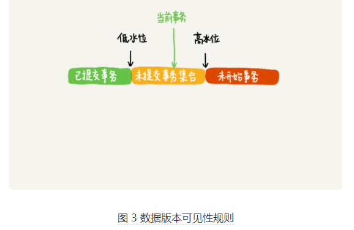

> **每行数据也是有多个版本的。每次事务更新的时候，都会生成一个新的数据版本**，并且把 transaction id 赋值给这个数据版本的事务 ID，记为 row trx_id。

这样，**对于当前事务的启动瞬间**来说，**一个数据版本的 row trx_id**，有以下几种可能：

1. 如果落在绿色部分，表示这个版本是已提交的事务或者是当前事务自己生成的，这个数据是可见的；

2. 如果落在红色部分，表示这个版本是由将来启动的事务生成的，是肯定不可见的；

3. 如果落在黄色部分，那就包括两种情况

   a. **若 row trx_id 在数组中，表示这个版本是由还没提交的事务生成的，不可见**；

   b. **若 row trx_id 不在数组中，表示这个版本是已经提交了的事务生成的，可见**。

   > 数组：用来保存事务启动瞬间，当前正在活跃的所有事务id，启动了但是没有提交的事务。可以启动但是未提交的事务

比如，对于图 2 中的数据来说，如果有一个事务，它的低水位是 18，那么当它访问这一行数据时，就会从 V4 通过 U3 计算出 V3，所以在它看来，这一行的值是 11。

> 18 是当前正在活跃的所有事务 id （[18,19,20]）中的最小的那一个，这一行数据当前的 row trx_id=25,18 这事务 id不是当前事务访问而增长的，要往前一个版本。

你看，有了这个声明后，系统里面随后发生的更新，是不是就跟这个事务看到的内容无关了呢？因为之后的更新，生成的版本一定属于上面的 2 或者 3(a) 的情况，而对它来说，这些新的数据版本是不存在的，所以这个事务的快照，就是“静态”的了。  

所以你现在知道了，**InnoDB 利用了“所有数据都有多个版本”的这个特性，实现了“秒级创建快照”的能力。**

接下来，我们继续看一下图 1 中的三个事务，分析下事务 A 的语句返回的结果，为什么是 k=1。

这里，我们不妨做如下假设：

1. 事务 A 开始前，系统里面只有一个活跃事务 ID 是 99；
2. 事务 A、B、C 的版本号分别是 100、101、102，且当前系统里只有这四个事务；
3. 三个事务开始前，(1,1）这一行数据的 row trx_id 是 90。

这样，事务 A 的视图数组就是[99,100], 事务 B 的视图数组是[99,100,101], 事务 C 的视图数组是[99,100,101,102]。

> 1、A、B、C的事务id分别是100、101、102，并且当前系统中只有一个活跃事务99，可知当前系统中最大事务是99，则A启动时的视图数组是[99,99+1]=[99,100] 2、B事务在启动的时候，A事物已经启动，是系统中最大的事务，所以B事务的视图数组是[99,100,100+1]=[99,100,101] 3、C事务在启动的时候，A、B事务都已经启动了，B是系统中最大的事务，所以B事务的视图数组是[99,100,101,101+1]=[99,100,101,102] ----- 极友笔记

为了简化分析，我先把其他干扰语句去掉，只画出跟事务 A 查询逻辑有关的操作：

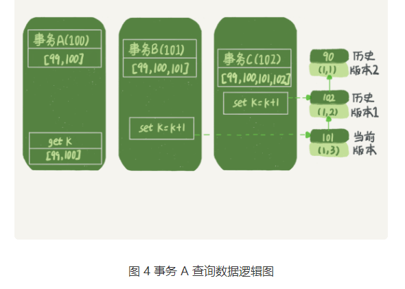

从图中可以看到，第一个有效更新是事务 C，把数据从 (1,1) 改成了 (1,2)。这时候，这个数据的最新版本的 row trx_id 是 102，而 90 这个版本已经成为了历史版本。

第二个有效更新是事务 B，把数据从 (1,2) 改成了 (1,3)。这时候，这个数据的最新版本（即 row trx_id）是 101，而 102 又成为了历史版本。

你可能注意到了，**在事务 A 查询的时候，其实事务 B 还没有提交**，（事务 C 已经提交了），但是它生成的 (1,3) 这个版本已经变成当前版本了。但这个版本对事务 A 必须是不可见的，否则就变成脏读了。  

好，现在事务 A 要来读数据了，它的视图数组是[99,100]。当然了，读数据都是从当前版本读起的。所以，事务 A 查询语句的读数据流程是这样的：  

1. 找到 (1,3) 的时候，判断出 row trx_id=101，比高水位大，处于红色区域，不可见；
2. 接着，找到上一个历史版本，一看 row trx_id=102，比高水位大，处于红色区域，不可见；
3. 再往前找，终于找到了（1,1)，它的 row trx_id=90，比低水位小，处于绿色区域，可见。

这样执行下来，**虽然期间这一行数据被修改过，但是事务 A 不论在什么时候查询，看到这行数据的结果都是一致的，所以我们称之为一致性读**。  

这个判断规则是从代码逻辑直接转译过来的，但是正如你所见，用于人肉分析可见性很麻烦。

所以，我来给你翻译一下。**一个数据版本，对于一个事务视图来说，除了自己的更新总是可见以外**，有三种情况： 

1. **版本未提交，不可见**；
2. **版本已提交，但是是在视图创建之后提交的，不可见**；
3. **版本已提交，而且是在视图创建前提交的，可见**。  

现在，我们用这个规则来判断图 4 中的查询结果，事务 A 的查询语句的视图数组是在事务 A 启动的时候生成的，这时候：  

- (1,3) 还没提交，属于情况 1，不可见；
- (1,2) 虽然提交了，但是是在视图数组创建之后提交的，属于情况 2，不可见；
- (1,1) 是在视图数组创建之前提交的，可见。

你看，去掉数字对比后，只用时间先后顺序来判断，分析起来是不是轻松多了。所以，后面我们就都用这个规则来分析。  

#### 更新逻辑  

细心的同学可能有疑问了：**事务 B 的 update 语句，如果按照一致性读，好像结果不对哦？**  

你看图 5 中，事务 B 的视图数组是先生成的，之后事务 C 才提交，不是应该看不见 (1,2) 吗，怎么能算出 (1,3) 来？  

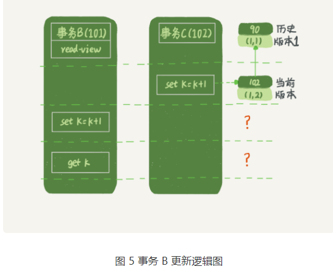

是的，如果事务 B 在**更新之前查询一次数据**，这个**查询返回的 k 的值确实是 1**。  

但是，**当它要去更新数据的时候，就不能再在历史版本上更新了，否则事务 C 的更新就丢失了**。因此，**事务 B 此时的 set k=k+1 是在（1,2）的基础上进行的操作**。

更新数据要在当前版本更新数据，否则会丢失数据。

##### 当前读

所以，这里就用到了这样一条规则：**更新数据都是先读后写的，而这个读，只能读当前的值，称为“当前读”（current read）**。  

因此，在更新的时候，当前读拿到的数据是 (1,2)，更新后生成了新版本的数据 (1,3)，这个新版本的 row trx_id 是 101。

所以，在执行事务 B 查询语句的时候，一看自己的版本号是 101，最新数据的版本号也是 101，是自己的更新，可以直接使用，所以查询得到的 k 的值是 3。  

这里我们提到了一个概念，叫作**当前读**。**其实，除了 update 语句外，select 语句如果加锁，也是当前读**。

所以，如果把事务 A 的查询语句 select * from t where id=1 修改一下，加上 `lock in share mode` 或 `for update`，也都可以读到版本号是 101 的数据，返回的 k 的值是 3。下面这两个 select 语句，就是分别加了**读锁（S 锁，共享锁）和写锁（X 锁，排他锁）**。

```mysql
mysql> select k from t where id=1 lock in share mode;
mysql> select k from t where id=1 for update;
```

再往前一步，假设事务 C 不是马上提交的，而是变成了下面的事务 C’，会怎么样呢？  

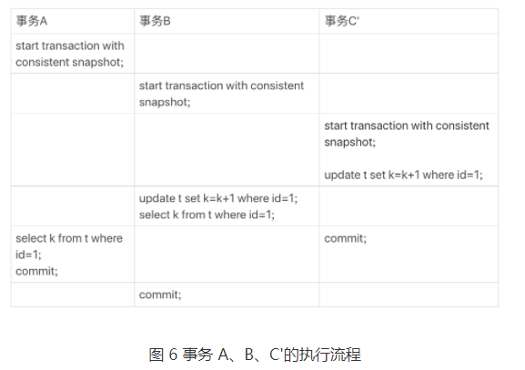

事务 C’的不同是，更新后并没有马上提交，在它提交前，事务 B 的更新语句先发起了。前面说过了，虽然事务 C’还没提交，但是 (1,2) 这个版本也已经生成了，并且是当前的最新版本。那么，事务 B 的更新语句会怎么处理呢？  

这时候，我们在上一篇文章中提到的“两阶段锁协议”就要上场了。事务 C’没提交，也就是说 (1,2) 这个版本上的写锁还没释放。而事务 B 是当前读，必须要读最新版本，而且必须加锁，因此就被锁住了，必须等到事务 C’释放这个锁，才能继续它的当前读。   

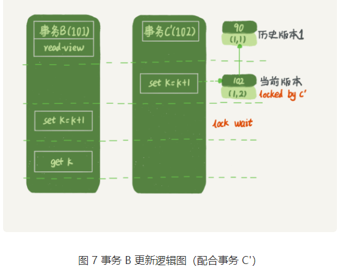

到这里，我们把**一致性读、当前读和行锁**就串起来了。  

现在，我们再回到文章开头的问题：**事务的可重复读的能力是怎么实现的？**   

**可重复读的核心就是一致性读（consistent read）**；**而事务更新数据的时候，只能用当前读**。**如果当前的记录的行锁被其他事务占用的话，就需要进入锁等待**。

而读提交的逻辑和可重复读的逻辑类似，它们最主要的区别是：

- 在可重复读隔离级别下，只需要在事务开始的时候创建一致性视图，之后事务里的其他查询都共用这个一致性视图；
- 在读提交隔离级别下，每一个语句执行前都会重新算出一个新的视图。

那么，我们再看一下，在读提交隔离级别下，事务 A 和事务 B 的查询语句查到的 k，分别应该是多少呢？

这里需要说明一下，“start transaction with consistent snapshot; ”的意思是从这个语句开始，创建一个持续整个事务的一致性快照。所以，在读提交隔离级别下，这个用法就没意义了，等效于普通的 start transaction。  

下面是读提交时的状态图，可以看到这两个查询语句的创建视图数组的时机发生了变化，就是图中的 read view 框。（注意：这里，我们用的还是事务 C 的逻辑直接提交，而不是事务 C’）  

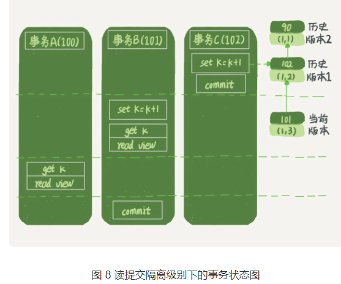

这时，事务 A 的查询语句的视图数组是在执行这个语句的时候创建的，时序上 (1,2)、(1,3) 的生成时间都在创建这个视图数组的时刻之前。但是，在这个时刻：  

- (1,3) 还没提交，属于情况 1，不可见；

- (1,2) 提交了，属于情况 3，可见。

所以，这时候事务 A 查询语句返回的是 k=2。显然地，事务 B 查询结果 k=3。

#### 小结  

**InnoDB 的行数据有多个版本，每个数据版本有自己的 row trx_id，每个事务或者语句有自己的一致性视图。普通查询语句是一致性读，一致性读会根据 row trx_id 和一致性视图确定数据版本的可见性**。  

- **对于可重复读，查询只承认在事务启动前就已经提交完成的数据**；
- **对于读提交，查询只承认在语句启动前就已经提交完成的数据**；

而**当前读，总是读取已经提交完成的最新版本**。

你也可以想一下，**为什么表结构不支持“可重复读”**？**这是因为表结构没有对应的行数据，也没有 row trx_id**，因此只能遵循当前读的逻辑。  

当然，MySQL 8.0 已经可以把表结构放在 InnoDB 字典里了，也许以后会支持表结构的可重复读。  

#### 思考时间  

又到思考题时间了。我用下面的表结构和初始化语句作为试验环境，事务隔离级别是可重复读。现在，我要把所有“字段 c 和 id 值相等的行”的 c 值清零，但是却发现了一个“诡异”的、改不掉的情况。请你构造出这种情况，并说明其原理。（我没构造出来）  

```mysql
mysql> CREATE TABLE `t3` (
  `id` int(11) NOT NULL,
  `c` int(11) DEFAULT NULL,
  PRIMARY KEY (`id`)
) ENGINE=InnoDB;
insert into t3(id, c) values(1,1),(2,2),(3,3),(4,4);
```

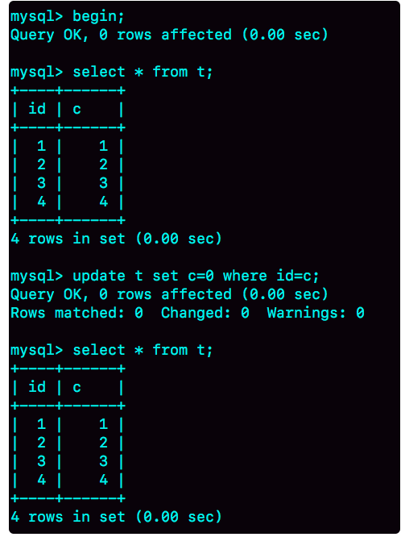

参考评论重现出来了，如果A 此时结束事务的话，再进行查询就能看到数据被B更新了

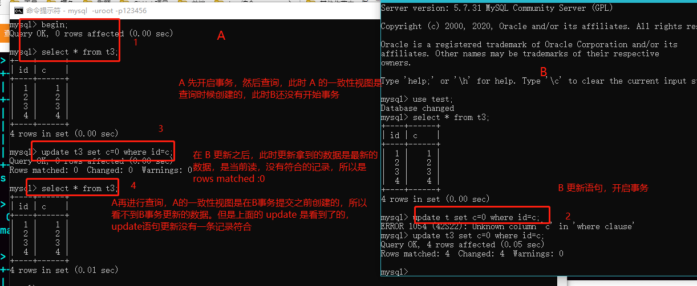

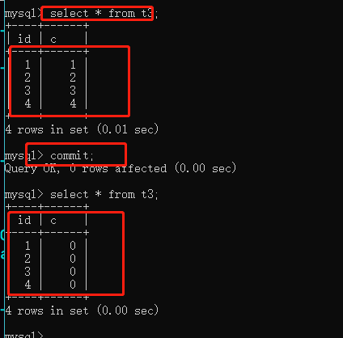

其实，还有另外一种场景，同学们在留言区都还没有提到。 

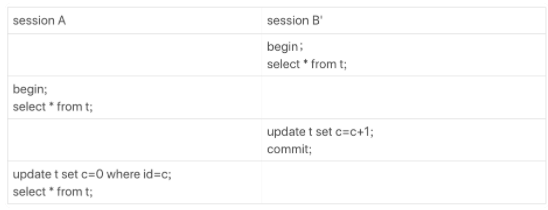

这个操作序列跑出来，session  A 看的内容也是能够复现我截图的效果的。这个 session B’启动的事务比 A 要早，其实是上期我们描述事务版本的可见性规则时留的彩蛋，因为规则里还有一个“活跃事务的判断”，我是准备留到这里再补充的。

用新的方式来分析 session B’的更新为什么对 session A 不可见就是：**在 session A 视图数组创建的瞬间，session B’是活跃的，属于“版本未提交，不可见”这种情况**。