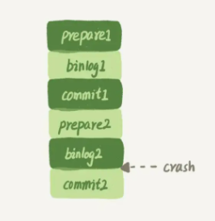

# 15 | 答疑文章（一）：日志和索引相关问题

#### 日志相关问题  

我在第 2 篇文章[《日志系统：一条 SQL 更新语句是如何执行的？》](./02一条sql更新语句是如何执行的.md)中，和你讲到 **binlog（归档日志）和 redo log（重做日志）**配合崩溃恢复的时候，用的是反证法，说明了如果没有两阶段提交，会导致 MySQL 出现主备数据不一致等问题。

在两阶段提交的不同瞬间，MySQL 如果发生异常重启，是怎么保证数据完整性的？

如下图是，两阶段提交的图。


​															图 1 两阶段提交示意图

这个图不是一个 update 语句的执行流程吗，怎么还会调用 commit 语句？

产生这个疑问的原因，是把两个 “commit“ 的概念混淆了： 

1.  **commit 语句**，指的是 MySQL 语句中，用于提交一个事务的命令。一般跟 begin/start transaction 使用。
2. 而我们图中的用到的这个 **”commit“ 步骤**，指的是事务提交过程中的一个小步骤，也是最后一步。当这个步骤执行完成后，这个事务就提交完成了。
3. “commit 语句”执行的时候，会包含“commit 步骤”。

而我们这个例子里面，没有显式地开启事务，因此这个 update 语句自己就是一个事务，在执行完成后提交事务时，就会用到这个“commit 步骤“。 

接下来，我们就一起分析一下**在两阶段提交的不同时刻，MySQL 异常重启会出现什么现象**。

如果在图中**时刻 A** 的地方，也就是写入 redo log 处于 prepare 阶段之后、写 binlog 之前，发生了崩溃（crash），**由于此时 binlog 还没写，redo log 也还没提交**，**所以崩溃恢复的时候，这个事务会回滚**。这时候，binlog 还没写，所以也不会传到备库。到这里，大家都可以理解。 

大家出现问题的地方，主要集中在**时刻 B**，也就是 binlog 写完，**redo log 还没 commit 前发生 crash**，那崩溃恢复的时候 MySQL 会怎么处理？

我们先来看一下崩溃恢复时的判断规则。

1. 如果 redo log 里面的事务是完整的，也就是已经有了 commit 标识，则直接提交； 

2. 如果 redo log 里面的事务只有完整的 prepare，则判断对应的事务 binlog 是否存在并完整：

   a：如果是，则提交事务。

   b：否则，回滚事务。

这里，**时刻 B 发生 crash 对应的就是 2(a) 的情况，崩溃恢复过程中事务会被提交**。 

现在，我们继续延展一下这个问题。

##### **追问1：MySQL 怎么知道 binlog 是完整的？**  

回答：一个事务的 binlog 是有完整格式的： 

- statement 格式的 binlog，最后会有 COMMIT；
- row 格式的 binlog，最后会有一个 XID event。

另外，在 MySQL 5.6.2 版本以后，还引入了 binlog-checksum 参数，用来验证 binlog 内容的正确性。对于 binlog 日志由于磁盘原因，可能会在日志中间出错的情况，MySQL 可以通过校验 checksum 的结果来发现。所以，MySQL 还是有办法验证事务 binlog 的完整性的。

##### 追问 2：redo log 和 binlog 是怎么关联起来的?  

回答：它们有一个共同的数据字段，叫 XID。崩溃恢复的时候，会按顺序扫描 redo log：

- 如果碰到既有 prepare、又有 commit 的 redo log，就直接提交；
- 如果碰到只有 parepare、而没有 commit 的 redo log，就拿着 XID 去 binlog 找对应的事务。

##### 追问 3：处于 prepare 阶段的 redo log 加上完整 binlog，重启就能恢复，MySQL 为什么要这么设计?  

回答：其实，这个问题还是跟我们在反证法中说到的数据与备份的一致性有关。在时刻 B，也就是 binlog 写完以后 MySQL 发生崩溃，这时候 binlog 已经写入了，之后就会被从库（或者用这个 binlog 恢复出来的库）使用。 

所以，在主库上也要提交这个事务。**采用这个策略，主库和备库的数据就保证了一致性**。

##### 追问 4：如果这样的话，为什么还要两阶段提交呢？干脆先 redo log 写完，再写 binlog。崩溃恢复的时候，必须得两个日志都完整才可以。是不是一样的逻辑？ 

回答：其实，两阶段提交是经典的分布式系统问题，并不是 MySQL 独有的。  

如果必须要举一个场景，来说明这么做的必要性的话，那就是**事务的持久性问题**。  

对于 InnoDB 引擎来说，如果 redo log 提交完成了，事务就不能回滚（如果这还允许回滚，就可能覆盖掉别的事务的更新）。而如果 redo log 直接提交，然后 binlog 写入的时候失败，InnoDB 又回滚不了，数据和 binlog 日志又不一致了。  

两阶段提交就是为了给所有人一个机会，当每个人都说“我 ok”的时候，再一起提交。

##### 追问 5：不引入两个日志，也就没有两阶段提交的必要了。只用 binlog 来支持崩溃恢复，又能支持归档，不就可以了？  

回答：这位同学的意思是，只保留 binlog，然后可以把提交流程改成这样：… -> “数据更新到内存” -> “写 binlog” -> “提交事务”，是不是也可以提供崩溃恢复的能力？ 

答案是不可以。  

如果说**历史原因**的话，那就是 InnoDB 并不是 MySQL 的原生存储引擎。MySQL 的原生引擎是 MyISAM，设计之初就有没有支持崩溃恢复。  

InnoDB 在作为 MySQL 的插件加入 MySQL 引擎家族之前，就已经是一个提供了崩溃恢复和事务支持的引擎了。

InnoDB 接入了 MySQL 后，发现既然 binlog 没有崩溃恢复的能力，那就用 InnoDB 原有的 redo log 好了。

而如果说**实现上的原因**的话，就有很多了。就按照问题中说的，只用 binlog 来实现崩溃恢复的流程，我画了一张示意图，这里就没有 redo log 了。



​																			图2 只用binlog支持崩溃恢复

这样的流程下，binlog 还是不能支持崩溃恢复的。我说一个不支持的点吧：**binlog 没有能力恢复“数据页”**。

如果在图中标的位置，也就是 binlog2 写完了，但是整个事务还没有 commit 的时候，MySQL 发生了 crash。重启后，引擎内部事务 2 会回滚，然后应用 binlog2 可以补回来；但是对于事务 1 来说，系统已经认为提交完成了，不会再应用一次 binlog1。但是，InnoDB 引擎使用的是 WAL 技术，执行事务的时候，写完内存和日志，事务就算完成了。如果之后崩溃，要依赖于日志来恢复数据页。也就是说在图中这个位置发生崩溃的话，事务 1 也是可能丢失了的，而且是数据页级的丢失。此时，binlog 里面并没有记录数据页的更新细节，是补不回来的。 

你如果要说，那我优化一下 binlog 的内容，让它来记录数据页的更改可以吗？但，这其实就是又做了一个 redo log 出来。所以，至少现在的 binlog 能力，还不能支持崩溃恢复。

##### 追问6：那能不能反过来，只用 redo log，不要 binlog？ 

回答：如果只从崩溃恢复的角度来讲是可以的。你可以把 binlog 关掉，这样就没有两阶段提交了，但系统依然是 crash-safe 的。  

但是，如果你了解一下业界各个公司的使用场景的话，就会发现在正式的生产库上，binlog 都是开着的。**因为 binlog 有着 redo log 无法替代的功能**。  

**一个是归档。redo log 是循环写，写到末尾是要回到开头继续写的。这样历史日志没法保留，redo log 也就起不到归档的作用**。  

**一个就是 MySQL 系统依赖于 binlog。binlog 作为 MySQL 一开始就有的功能，被用在了很多地方**。其中，**MySQL 系统高可用的基础，就是 binlog 复制**。   

还有很多公司有异构系统（比如一些数据分析系统），这些系统就靠消费 MySQL 的 binlog 来更新自己的数据。关掉 binlog 的话，这些下游系统就没法输入了。  

总之，由于现在包括 MySQL 高可用在内的很多系统机制都依赖于 binlog，所以“鸠占鹊巢”redo log 还做不到。你看，发展生态是多么重要。

##### 追问 7：redo log 一般设置多大？  

回答：redo log 太小的话，会导致很快就被写满，然后不得不强行刷 redo log，这样 WAL 机制的能力就发挥不出来了。所以，如果是现在常见的几个 TB 的磁盘的话，就不要太小气了，直接将 redo log 设置为 4 个文件、每个文件 1GB 吧。  

##### 追问 8：正常运行中的实例，数据写入后的最终落盘，是从 redo log 更新过来的还是从 buffer pool 更新过来的呢？  

回答：这个问题其实问得非常好。这里涉及到了，“redo log 里面到底是什么”的问题。  

实际上，redo log 并没有记录数据页的完整数据，所以它并没有能力自己去更新磁盘数据页，也就不存在“数据最终落盘，是由 redo log 更新过去”的情况。  

1. 如果是正常运行的实例的话，数据页被修改以后，跟磁盘的数据页不一致，称为脏页。最终数据落盘，就是把内存中的数据页写盘。这个过程，甚至与 redo log 毫无关系。
2. 在崩溃恢复场景中，InnoDB 如果判断到一个数据页可能在崩溃恢复的时候丢失了更新，就会将它读到内存，然后让 redo log 更新内存内容。更新完成后，内存页变成脏页，就回到了第一种情况的状态。

##### 追问 9：redo log buffer 是什么？是先修改内存，还是先写 redo log 文件？  

回答：这两个问题可以一起回答。  

在一个事务的更新过程中，日志是要写多次的。比如下面这个事务：

```mysql 
begin;
insert into t1 ...
insert into t2 ...
commit;
```

这个事务要往两个表中插入记录，插入数据的过程中，生成的日志都得先保存起来，但又不能在还没 commit 的时候就直接写到 redo log 文件里。 

所以，**redo log buffer 就是一块内存，用来先存 redo 日志的**。也就是说，**在执行第一个 insert 的时候，数据的内存被修改了，redo log buffer 也写入了日志**。  

但是，**真正把日志写到 redo log 文件（文件名是 ib_logfile+ 数字），是在执行 commit 语句的时候做的**。

单独执行一个更新语句的时候，InnoDB 会自己启动一个事务，在语句执行完成的时候提交。过程跟上面是一样的，只不过是“压缩”到了一个语句里面完成。 

#### 业务设计问题   

