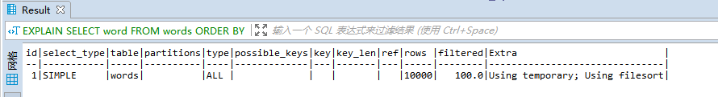

# 17 | 如何正确地显示随机消息？

我在上一篇文章，为你讲解完 order by 语句的几种执行模式后，就想到了之前一个做英语学习 App 的朋友碰到过的一个性能问题。今天这篇文章，我就从这个性能问题说起，和你说说 MySQL 中的另外一种排序需求，希望能够加深你对 MySQL 排序逻辑的理解。  

**问题：**

这个英语学习 App 首页有一个随机显示单词的功能，也就是根据每个用户的级别有一个单词表，然后这个用户每次访问首页的时候，都会随机滚动显示三个单词。他们发现随着单词表变大，选单词这个逻辑变得越来越慢，甚至影响到了首页的打开速度。  

现在，如果让你来设计这个 SQL 语句，你会怎么写呢？  

为了便于理解，我对这个例子进行了简化：去掉每个级别的用户都有一个对应的单词表这个逻辑，直接就是从一个单词表中随机选出三个单词。这个表的建表语句和初始数据的命令如下：  

```mysql
mysql> CREATE TABLE `words` (
  `id` int(11) NOT NULL AUTO_INCREMENT,
  `word` varchar(64) DEFAULT NULL,
  PRIMARY KEY (`id`)
) ENGINE=InnoDB;

delimiter ;;
create procedure idata()
begin
  declare i int;
  set i=0;
  while i<10000 do
    insert into words(word) values(concat(char(97+(i div 1000)), char(97+(i % 1000 div 100)), char(97+(i % 100 div 10)), char(97+(i % 10))));
    set i=i+1;
  end while;
end;;
delimiter ;

call idata();
```

为了便于量化说明，我在这个表里面插入了 10000 行记录。接下来，我们就一起看看要随机选择 3 个单词，有什么方法实现，存在什么问题以及如何改进。  

#### 内存临时表  

首先，你会想到用 order by rand() 来实现这个逻辑

```mysql
select word from words order by rand() limt 3;
```

这个语句的意思很直白，随机排序取前 3 个。**虽然这个 SQL 语句写法很简单，但执行流程却有点复杂的**。

我们先用 explain 命令来看看这个语句的执行情况

```mysql
EXPLAIN SELECT word FROM words ORDER BY rand() LIMIT 3; 
```



​									图 1 使用 explain 命令查看语句的执行情况

Extra 字段显示 Using temporary，表示的是需要使用临时表；Using filesort，表示的是需要执行排序操作。

> https://dev.mysql.com/doc/refman/5.7/en/explain-output.html#explain_extra 
>
> `Using temporary` (JSON property: `using_temporary_table`)
>
> To resolve the query, MySQL needs to create a temporary table to hold the result. This typically happens if the query contains `GROUP BY` and `ORDER BY` clauses that list columns differently.

因此这个 Extra 的意思就是，需要临时表，并且需要在临时表上排序。  

这里，你可以先回顾一下[上一篇文章](./16order by是怎么工作的.md)中全字段排序和 rowid 排序的内容。我把上一篇文章的两个流程图贴过来，方便你复习。


