# 18 | 为什么这些SQL语句逻辑相同，性能却差异巨大？

在 MySQL 中，有很多看上去逻辑相同，但性能却差异巨大的 SQL 语句。对这些语句使用不当的话，就会不经意间导致整个数据库的压力变大。  

我今天挑选了三个这样的案例和你分享。希望再遇到相似的问题时，你可以做到举一反三、快速解决问题。  

#### 案例一：条件字段函数操作  

**如果对索引字段做了函数计算，就用不上索引了，这是 MySQL 的规定。**

假设你现在维护了一个交易系统，其中交易记录表 tradelog 包含交易流水号（tradeid）、交易员 id（operator）、交易时间（t_modified）等字段。为了便于描述，我们先忽略其他字段。这个表的建表语句如下：  

```mysql
mysql> CREATE TABLE `tradelog` (
  `id` int(11) NOT NULL,
  `tradeid` varchar(32) DEFAULT NULL,
  `operator` int(11) DEFAULT NULL,
  `t_modified` datetime DEFAULT NULL,
  PRIMARY KEY (`id`),
  KEY `tradeid` (`tradeid`),
  KEY `t_modified` (`t_modified`)
) ENGINE=InnoDB DEFAULT CHARSET=utf8mb4;
```

假设，现在已经记录了从 2016 年初到 2018 年底的所有数据，运营部门有一个需求是，要统计发生在所有年份中 7 月份的交易记录总数。这个逻辑看上去并不复杂，你的 SQL 语句可能会这么写：  

```mysql
select count(*) from tradelog where month(t_modified) = 7;
```

由于 **t_modified 字段上有索引**，于是你就很放心地在生产库中执行了这条语句，但却发现执行了特别久，才返回了结果。

如果你问 DBA 同事为什么会出现这样的情况，他大概会告诉你：**如果对字段做了函数计算，就用不上索引了，这是 MySQL 的规定。**

现在你已经学过了 InnoDB 的索引结构了，可以再追问一句为什么？为什么条件是 where t_modified='2018-7-1’的时候可以用上索引，而改成 where month(t_modified)=7 的时候就不行了？  

下面是这个 t_modified 索引的示意图。方框上面的数字就是 month() 函数对应的值。  

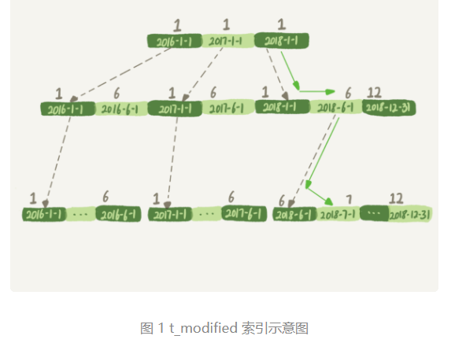

如果你的 SQL 语句条件用的是 where t_modified='2018-7-1’的话，引擎就会按照上面绿色箭头的路线，快速定位到 t_modified='2018-7-1’需要的结果。  **实际上， B+ 树提供的这个快速定位能力，来源于同一层兄弟节点的有序性**。   

但是，如果计算 month() 函数的话，你会看到传入 7 的时候，在树的第一层就不知道该怎么办了。

也就是说，**对索引字段做函数操作，可能会破坏索引值的有序性，因此优化器就决定放弃走树搜索功能**。需要注意的是，**优化器并不是要放弃使用这个索引**。  

在这个例子里，**放弃了树搜索功能，优化器可以选择遍历主键索引，也可以选择遍历索引 t_modified，优化器对比索引大小后发现，索引 t_modified 更小，遍历这个索引比遍历主键索引来得更快。因此最终还是会选择索引 t_modified**。  

接下来，我们使用 explain 命令，查看一下这条 SQL 语句的执行结果:  

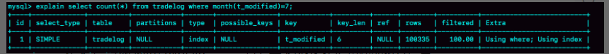

​												图 2 explain 执行结果

**key="t_modified"表示的是，使用了 t_modified 这个索引**；我在测试表数据中插入了 10 万行数据，**rows=100335，说明这条语句扫描了整个索引的所有值；Extra 字段的 Using index，表示的是使用了覆盖索引**。在这里还是扫描了整个记录

> Using index:  
>
> The column information is retrieved from the table using only information in the index tree without having to do an additional seek to read the actual row. This strategy can be used when the query uses only columns that are part of a single index.
>
> For `InnoDB` tables that have a user-defined clustered index, that index can be used even when `Using index` is absent from the `Extra` column. This is the case if `type` is [`index`](https://dev.mysql.com/doc/refman/5.7/en/explain-output.html#jointype_index) and `key` is `PRIMARY`.

**也就是说，由于在 t_modified 字段加了 month() 函数操作，导致了全索引扫描**。为了能够用上索引的快速定位能力，我们就要把 SQL 语句改成基于字段本身的范围查询。按照下面这个写法，优化器就能按照我们预期的，用上 t_modified 索引的快速定位能力了。

```mysql
mysql> select count(*) from tradelog where
    -> (t_modified >= '2016-7-1' and t_modified<'2016-8-1') or
    -> (t_modified >= '2017-7-1' and t_modified<'2017-8-1') or 
    -> (t_modified >= '2018-7-1' and t_modified<'2018-8-1');
```

当然，如果你的系统上线时间更早，或者后面又插入了之后年份的数据的话，你就需要再把其他年份补齐。

到这里我给你说明了，**由于加了 month() 函数操作，MySQL 无法再使用索引快速定位功能，而只能使用全索引扫描**。 

**不能对条件字段使用函数**  

不过优化器在个问题上确实有“偷懒”行为，即使是对于不改变有序性的函数，也不会考虑使用索引。比如，对于 select * from tradelog where id + 1 = 10000 这个 SQL 语句，这个加 1 操作并不会改变有序性，但是 MySQL 优化器还是不能用 id 索引快速定位到 9999 这一行。所以，需要你在写 SQL 语句的时候，手动改写成 where id = 10000 -1 才可以。

##### 自己环境案例：

sales_order 表有 81482 条记录，执行语句 `EXPLAIN SELECT * FROM sales_order so WHERE MONTH(so.order_date) = 3;`  查看结果：order_date 字段上面没有索引，这里扫描了 78377 条记录。

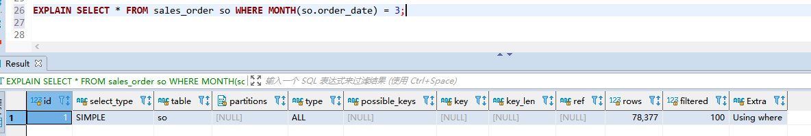

> `Using where` (JSON property: `attached_condition`)
>
> A `WHERE` clause is used to restrict which rows to match against the next table or send to the client. Unless you specifically intend to fetch or examine all rows from the table, you may have something wrong in your query if the `Extra` value is not `Using where` and the table join type is [`ALL`](https://dev.mysql.com/doc/refman/5.7/en/explain-output.html#jointype_all) or [`index`](https://dev.mysql.com/doc/refman/5.7/en/explain-output.html#jointype_index).
>
> 您特别打算从表中获取或检查所有行，否则如果 Extra 值不是 Using where 并且表连接类型是 ALL 或索引，则您的查询可能会出错。

#### 案例二：隐式类型转换   

接下来我再跟你说一说，另一个经常让程序员掉坑里的例子。我们一起看一下这条 SQL 语句：  

```mysql
select * from tradelog where tradeid = 110717
```

交易编号 tradeid 这个字段上，本来就有索引，但是 explain 的结果却显示，这条语句需要走全表扫描。你可能也发现了，**tradeid 的字段类型是 varchar(32)，而输入的参数却是整型，所以需要做类型转换**。

那么，现在这里就有两个问题：

1. 数据类型转换的规则是什么？
2. 为什么有数据类型转换，就需要走全索引扫描？

这里有一个简单的方法，看 select “10” > 9 的结果：

1. 如果规则是“**将字符串转成数字**”，**那么就是做数字比较，结果应该是 1**；
2. 如果规则是“**将数字转成字符串**”，**那么就是做字符串比较，结果应该是 0**。

执行结果：

```mysql
select "10" > 9;
-- 1 , 这里是转成数字比较了
```

##### 所以你就能确认 MySQL 里的转换规则了：**在 MySQL 中，字符串和数字做比较的话，是将字符串转换成数字**。  

这时，你再看整个全表扫描语句：

```mysql
mysql> select * from tradelog where tradeid=110717;
```

就知道对于优化器来说，这个语句相当于：

```mysql
mysql> select * from tradelog where  CAST(tradid AS signed int) = 110717;
```

也就是说，这条语句触发了我们上面说到的规则：**对索引字段做函数操作，优化器会放弃走树搜索功能**。

现在，我留给你一个小问题，id 的类型是 int，如果执行下面这个语句，是否会导致全表扫描呢？ 

```mysql
select * from tradelog where id="83126"; 
```

> 不会，id 是 int，右边是字符串，比较的时候，会把右边转换成数字 83126，然后再走索引。所以隐式转换不会应用到字段上面，会应用到入参上面。


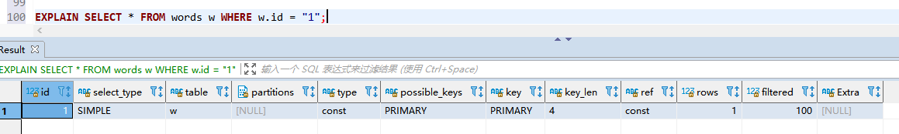

这里是上一个取随机值得words表得查询情况：

```mysql
CREATE TABLE `words` (
  `id` int(11) NOT NULL AUTO_INCREMENT,
  `word` varchar(64) DEFAULT NULL,
  PRIMARY KEY (`id`)
) ENGINE=InnoDB AUTO_INCREMENT=10001 DEFAULT CHARSET=utf8
```


##### 自己案例：

sales_order 的字段 order_id 是有主键索引的，总记录数是 79416。order_id 是字符串类型`order_id varchar(50) COLLATE utf8mb4_bin NOT NULL, PRIMARY KEY (order_id)`

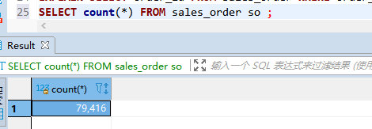

```mysql
EXPLAIN SELECT * FROM sales_order so WHERE order_id = 0808000001;
```

如果是上面查询所有字段则是：

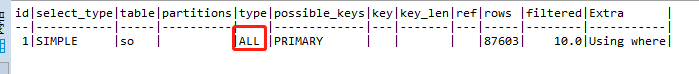

如果是只查询order_id字段的话，会使用索引覆盖进行查询，还是使用了优化的。

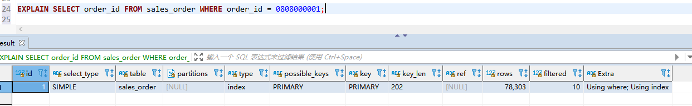

#### 案例三：隐式字符编码转换   

假设系统里还有另外一个表 trade_detail，用于记录交易的操作细节。为了便于量化分析和复现，我往交易日志表 tradelog 和交易详情表 trade_detail 这两个表里插入一些数据。  

```mysql
mysql> CREATE TABLE `trade_detail` (
  `id` int(11) NOT NULL,
  `tradeid` varchar(32) DEFAULT NULL,
  `trade_step` int(11) DEFAULT NULL, /*操作步骤*/
  `step_info` varchar(32) DEFAULT NULL, /*步骤信息*/
  PRIMARY KEY (`id`),
  KEY `tradeid` (`tradeid`)
) ENGINE=InnoDB DEFAULT CHARSET=utf8;

insert into tradelog values(1, 'aaaaaaaa', 1000, now());
insert into tradelog values(2, 'aaaaaaab', 1000, now());
insert into tradelog values(3, 'aaaaaaac', 1000, now());

insert into trade_detail values(1, 'aaaaaaaa', 1, 'add');
insert into trade_detail values(2, 'aaaaaaaa', 2, 'update');
insert into trade_detail values(3, 'aaaaaaaa', 3, 'commit');
insert into trade_detail values(4, 'aaaaaaab', 1, 'add');
insert into trade_detail values(5, 'aaaaaaab', 2, 'update');
insert into trade_detail values(6, 'aaaaaaab', 3, 'update again');
insert into trade_detail values(7, 'aaaaaaab', 4, 'commit');
insert into trade_detail values(8, 'aaaaaaac', 1, 'add');
insert into trade_detail values(9, 'aaaaaaac', 2, 'update');
insert into trade_detail values(10, 'aaaaaaac', 3, 'update again');
insert into trade_detail values(11, 'aaaaaaac', 4, 'commit');
```

这时候，如果要查询 id=2 得交易的所有操作步骤，SQL语句可以这么写：

```mysql
mysql> select d.* from tradelog l, trade_detail d where d.tradeid=l.tradeid and l.id=2; /*语句Q1*/
```

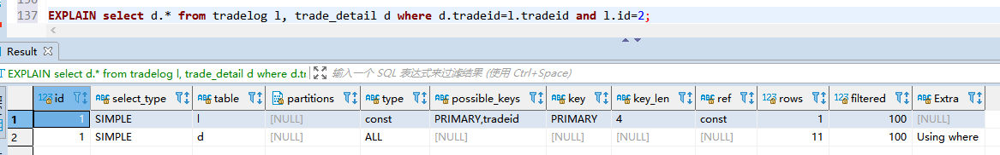

explain 的执行结果

1. 第一行显示优化器会先在交易记录表 tradelog 上查到 id=2 的行，这个步骤用上了主键索引，rows=1 表示只扫描一行；
2. 第二行 key=NULL，表示没有用上交易详情表 trade_detail 上的 tradeid 索引，进行了全表扫描。

在这个执行计划里，**是从 tradelog 表中取 tradeid 字段，再去 trade_detail 表里查询匹配字段**。因此，我们把 **tradelog 称为驱动表，把 trade_detail 称为被驱动表，把 tradeid 称为关联字段**。

接下来我们看下这个 explain 的执行流程：  

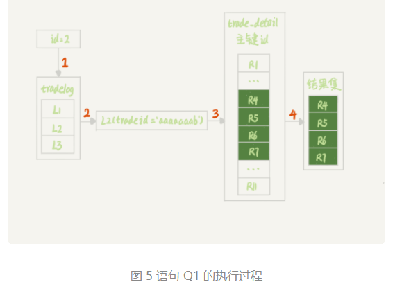

图中：

1. 第 1 步，是根据 id 在 tradelog 表里找到 L2 这一行；
2. 第 2 步，是从 L2 中取出 tradeid 字段的值；
3. 第 3 步，是根据 tradeid 值到 trade_detail 表中查找条件匹配的行。explain 的结果里面第二行的 **key=NULL 表示的就是，这个过程是通过遍历主键索引的方式**，一个一个地判断 tradeid 的值是否匹配。

进行到这里，你会发现第 3 步不符合我们的预期。因为表 trade_detail 里 tradeid 字段上是有索引的，我们本来是希望通过使用 tradeid 索引能够快速定位到等值的行。但，这里并没有。  

如果你去问 DBA 同学，他们可能会告诉你，**因为这两个表的字符集不同，一个是 utf8（trade_detail 表），一个是 utf8mb4（tradelog 表），所以做表连接查询的时候用不上关联字段的索引**。这个回答，也是通常你搜索这个问题时会得到的答案。

但是你应该再追问一下，为什么字符集不同就用不上索引呢？  

我们说问题是出在执行步骤的第 3 步，如果单独把这一步改成 SQL 语句的话，那就是：

```mysql
mysql> select * from trade_detail where tradeid=$L2.tradeid.value; 
```

其中，$L2.tradeid.value 的字符集是 utf8mb4。tradeid 的字符集是 utf8。  

参照前面的两个例子，你肯定就想到了，**字符集 utf8mb4 是 utf8 的超集，所以当这两个类型的字符串在做比较的时候，MySQL 内部的操作是，先把 utf8 字符串转成 utf8mb4 字符集，再做比较**。  

> 这个设定很好理解，utf8mb4 是 utf8 的超集。类似地，在程序设计语言里面，做自动类型转换的时候，为了避免数据在转换过程中由于截断导致数据错误，也都是“按数据长度增加的方向”进行转换的。 类似 long (utf8mb4)  和 int (utf)

因此， 在执行上面这个语句的时候，需要将被驱动数据表里的字段一个个地转换成 utf8mb4，再跟 L2 做比较。  

也就是说，实际上这个语句等同于下面这个写法：

```mysql
select * from trade_detail  where CONVERT(traideid USING utf8mb4)=$L2.tradeid.value; 
convert() -- 用法，在这里的意思是把输入的字符串转成 utf8mb4 字符集。
```

这就再次触发了我们上面说到的原则：**对索引字段做函数操作，优化器会放弃走树搜索功能**。

到这里，你终于明确了，字符集不同只是条件之一，**连接过程中要求在被驱动表的索引字段上加函数操作，是直接导致对被驱动表做全表扫描的原因**。  

作为对比验证，我给你提另外一个需求，“查找 trade_detail 表里 id=4 的操作，对应的操作者是谁”，再来看下这个语句和它的执行计划。  

```mysql
mysql>select l.operator from tradelog l , trade_detail d where d.tradeid=l.tradeid and d.id=4;
```

explain 执行结果

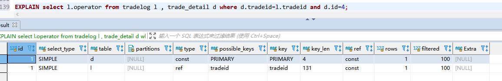

这个语句里 **trade_detail(utf8 编码)** 表成了驱动表，但是 explain 结果的第二行显示，这次的查询操作用上了**被驱动表 tradelog(utf8mb4 编码)** 里的索引 (tradeid)，扫描行数是 1。 （不需要进行编码转换）  

这也是两个 tradeid 字段的 join 操作，为什么这次能用上被驱动表的 tradeid 索引呢？我们来分析一下。

假设驱动表 trade_detail 里 id=4 的行记为 R4，那么在连接的时候（图 5 的第 3 步），被驱动表 tradelog 上执行的就是类似这样的 SQL 语句：  

```mysql
select operator from tradelog where traideid =$R4.tradeid.value;
```

这时候 **$R4.tradeid.value 的字符集是 utf8,** 按照字符集转换规则，**要转成 utf8mb4**，所以这个过程就被改写成：

```mysql
select operator from tradelog  where traideid =CONVERT($R4.tradeid.value USING utf8mb4); 
```

你看，这里的 CONVERT 函数是加在输入参数上的，这样就可以用上被驱动表的 traideid 索引。理解了原理以后，就可以用来指导操作了。如果要优化语句  

```mysql
select d.* from tradelog l, trade_detail d where d.tradeid=l.tradeid and l.id=2;
```

的执行过程，有两种做法：

1. 比较常见的优化方法是，把 trade_detail 表上的 tradeid 字段的字符集也改成 utf8mb4，这样就没有字符集转换的问题了。(修改字符集为相同的)

   ```mysql
   alter table trade_detail modify tradeid varchar(32) CHARACTER SET utf8mb4 default null;
   ```

2. 如果能够修改字段的字符集的话，是最好不过了。但如果数据量比较大， 或者业务上暂时不能做这个 DDL 的话，那就只能采用修改 SQL 语句的方法了。

   ```mysql
   mysql> select d.* from tradelog l , trade_detail d where d.tradeid=CONVERT(l.tradeid USING utf8) and l.id=2; 
   ```

   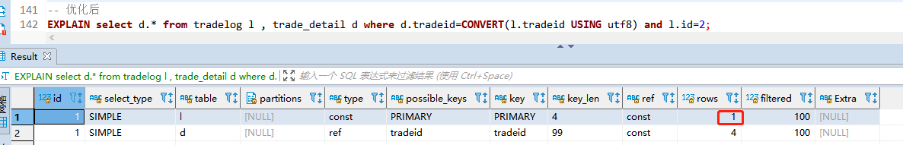

   ​						explain 执行结果

这里，我主动把 l.tradeid 转成 utf8，就避免了被驱动表上的字符编码转换，从 explain 结果可以看到，这次索引走对了。

#### 小结  

今天我给你举了三个例子，其实是在说同一件事儿，即：**对索引字段做函数操作，可能会破坏索引值的有序性，因此优化器就决定放弃走树搜索功能**。

第二个例子是隐式类型转换，第三个例子是隐式字符编码转换，它们都跟第一个例子一样，因为要求在索引字段上做函数操作而导致了全索引扫描。  

MySQL 的优化器确实有“偷懒”的嫌疑，即使简单地把 where id+1=1000 改写成 where id=1000-1 就能够用上索引快速查找，也不会主动做这个语句重写。  

因此，每次你的业务代码升级时，把可能出现的、新的 SQL 语句 explain 一下，是一个很好的习惯。

#### 一些评论  

1. 索引字段不能进行函数操作，但是索引字段的参数可以玩函数，一言以蔽之。

	> 解释：就是表中索引字段不能加函数，可能会导致索引丢失有序性，但是入参可以随便操作，因为不影响索引有序性，可以入参可以是索引字段。

2. select 'a' = 0 ; 的结果是1，说明无法转换成数字的字符串都被转换成0来处理了。 同理select "13m456"=13;结果为1，说明为截断式的转换，遇到一个不能转换的停止转换，并且返回前面已经转换成功的数字作为结果

#### 问题时间：    

```mysql
mysql> CREATE TABLE `table_a` (
  `id` int(11) NOT NULL,
  `b` varchar(10) DEFAULT NULL,
  PRIMARY KEY (`id`),
  KEY `b` (`b`)
) ENGINE=InnoDB;
```

假设现在表里面，有 100 万行数据，其中有 10 万行数据的 b 的值是’1234567890’， 假设现在执行语句是这么写的:

> mysql> select * from table_a where b='1234567890abcd';

这时候，MySQL 会怎么执行呢？  

最理想的情况是，MySQL 看到字段 b 定义的是 varchar(10)，那肯定返回空呀。可惜，MySQL 并没有这么做。  

那要不，就是把’1234567890abcd’拿到索引里面去做匹配，肯定也没能够快速判断出索引树 b 上并没有这个值，也很快就能返回空结果。但实际上，MySQL 也不是这么做的。  

这条 SQL 语句的执行很慢，流程是这样的： 

1. 在传给引擎执行的时候，做了字符截断。因为引擎里面这个行只定义了长度是 10，所以只截了前 10 个字节，就是’1234567890’进去做匹配；
2. 这样满足条件的数据有 10 万行；
3. 因为是 select *， 所以要做 10 万次回表；
4. 但是每次回表以后查出整行，到 server 层一判断，b 的值都不是’1234567890abcd’;
5. 返回结果是空。

这个例子，是我们文章内容的一个很好的补充。虽然执行过程中可能经过函数操作，但是**最终在拿到结果后，server 层还是要做一轮判断的**。  

