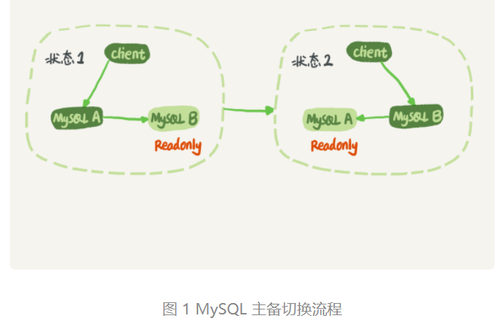
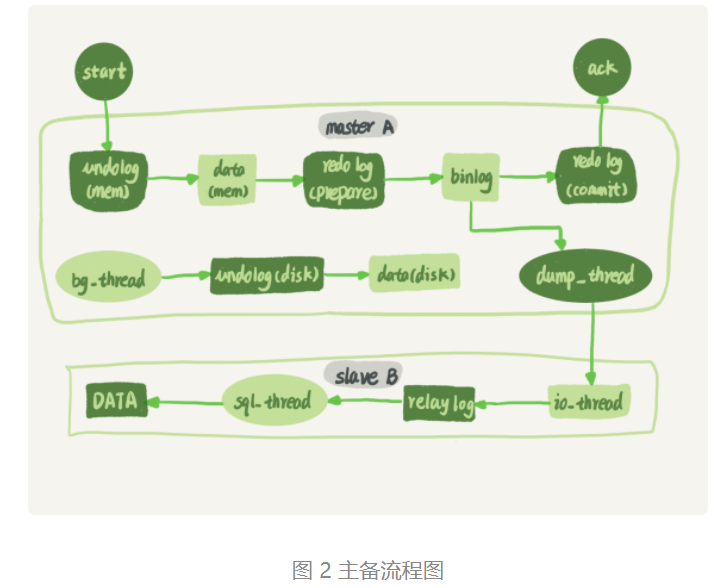
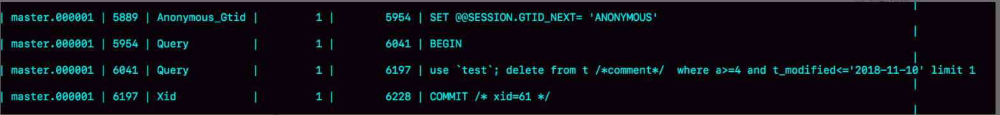
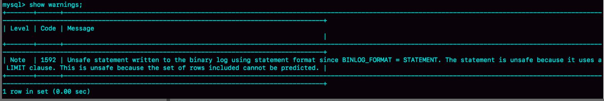

# 24 | MySQL是怎么保证主备一致的？

在前面的文章中，我不止一次地和你提到了 binlog，大家知道 binlog 可以用来归档，也可以用来做主备同步，但它的内容是什么样的呢？**为什么备库执行了 binlog 就可以跟主库保持一致了呢？**今天我就正式地和你介绍一下它

#### 学习目标 

主备的基本原理，主备一致之 binlog

----

毫不夸张地说，MySQL 能够成为现下最流行的开源数据库，binlog 功不可没。

在最开始，MySQL 是以容易学习和方便的高可用架构，被开发人员青睐的。而它的几乎所有的高可用架构，都直接依赖于 binlog。虽然这些高可用架构已经呈现出越来越复杂的趋势，但都是从最基本的一主一备演化过来的。

今天这篇文章我主要为你介绍主备的基本原理。理解了背后的设计原理，你也可以从业务开发的角度，来借鉴这些设计思想。  

#### MySQL主备的基本原理   



在状态 1 中，客户端的读写都直接访问节点 A，而节点 B 是 A 的备库，只是将 A 的更新都同步过来，到本地执行。这样可以保持节点 B 和 A 的数据是相同的。

当需要切换的时候，就切成状态 2。这时候客户端读写访问的都是节点 B，而节点 A 是 B 的备库。  

**把备库设置为只读模式**

在状态 1 中，虽然节点 B 没有被直接访问，但是我依然建议你把节点 B（也就是备库）设置成只读（readonly）模式。这样做，有以下几个考虑：

1. **有时候一些运营类的查询语句会被放到备库上去**查，设置为只读可以防止误操作；
2. 防止切换逻辑有 bug，比如切换过程中出现**双写**，造成主备不一致；（写 A 库和 B 库）
3. 可以用 readonly 状态，**来判断节点的角色**。

你可能会问，我把备库设置成只读了，还怎么跟主库保持同步更新呢？

这个问题，你不用担心。**因为 readonly 设置对超级 (super) 权限用户是无效的，而用于同步更新的线程，就拥有超级权限**。

接下来，我们再看看**节点 A 到 B 这条线的内部流程是什么样的**。图 2 中画出的就是一个 **update** 语句在节点 A 执行（可以查看 [02一条更新语句是如何执行](./02一条sql更新语句是如何执行的.md) 的内容中有这些步骤，二阶段提交），然后同步到节点 B 的完整流程图。    



> 途中 undolog 是回滚日志，update 语句会自动开启事务。

图 2 中，包含了我在上一篇文章中讲到的 binlog 和 redo log 的写入机制相关的内容，可以看到：**主库接收到客户端的更新请求后，执行内部事务的更新逻辑，同时写 binlog**。（主库的语句正常操作步骤）  

**备库 B 跟主库 A 之间维持了一个长连接**。**主库 A 内部有一个线程，专门用于服务备库 B 的这个长连接**。一个事务日志同步的完整过程是这样的：

1. 在备库 B 上通过 change master 命令，设置**主库 A 的 IP、端口、用户名、密码，以及要从哪个位置开始请求 binlog**，**这个位置包含文件名和日志偏移量**。  
2. 在备库 B 上执行 start slave 命令，这时候备库会启动两个线程，就是图中的 **io_thread** 和 **sql_thread**。其中 **io_thread** 负责与主库建立连接。
3. 主库 A 校验完用户名、密码后，开始**按照备库 B 传过来的位置，从本地读取 binlog**，发给 B。

4. 备库 B 拿到 binlog 后，**写到本地文件，称为中转日志（relay log）**。
5. **sql_thread 读取中转日志，解析出日志里的命令，并执行**。

这里需要说明，后来由于多线程复制方案的引入，sql_thread 演化成为了多个线程，跟我们今天要介绍的原理没有直接关系，暂且不展开。

分析完了这个长连接的逻辑，我们再来看一个问题：**binlog 里面到底是什么内容，为什么备库拿过去可以直接执行**。

#### binlog 的三种格式对比   

我在第 15 篇答疑文章中，和你提到过 binlog 有两种格式，一种是 statement，一种是 row。可能你在其他资料上还会看到有第三种格式，叫作 mixed，其实它就是前两种格式的混合。  

```mysql

mysql> CREATE TABLE `t` (
  `id` int(11) NOT NULL,
  `a` int(11) DEFAULT NULL,
  `t_modified` timestamp NOT NULL DEFAULT CURRENT_TIMESTAMP,
  PRIMARY KEY (`id`),
  KEY `a` (`a`),
  KEY `t_modified`(`t_modified`)
) ENGINE=InnoDB;

insert into t values(1,1,'2018-11-13');
insert into t values(2,2,'2018-11-12');
insert into t values(3,3,'2018-11-11');
insert into t values(4,4,'2018-11-10');
insert into t values(5,5,'2018-11-09');
```

如果要在表中删除一行数据的话，我们来看看这个 delete 语句的 binlog 是怎么记录的。

注意，下面这个语句包含注释，如果你用 MySQL 客户端来做这个实验的话，要记得加 -c 参数，否则客户端会自动去掉注释。 

```mysql
mysql> delete from t /*comment*/  where a>=4 and t_modified<='2018-11-10' limit 1;
```

当 binlog_format=statement 时，binlog 里面记录的就是 SQL 语句的原文。你可以用

`mysql> show binlog events in 'master.000001';` 查看 binlog 中的内容。

> show variables like '%binlog_format%';// 查看binlog的格式
>
> set global binlog_format='STATEMENT';// 设置binlog模式 设置之后需要退出mysql重新连接就能看到已修改



图 3 statement 格式 binlog 示例  

现在，我们来看一下图 3 的输出结果。

1. 第一行 SET @@SESSION.GTID_NEXT='ANONYMOUS’你可以先忽略，后面文章我们会在介绍主备切换的时候再提到；

2. 第二行是一个 BEGIN，跟第四行的 commit 对应，表示中间是一个事务；

3. 第三行就是真实执行的语句了。可以看到，在真实执行的 delete 命令之前，还有一个“use ‘test’”命令。这条命令不是我们主动执行的，而是 MySQL 根据当前要操作的表所在的数据库，自行添加的。这样做可以保证日志传到备库去执行的时候，不论当前的工作线程在哪个库里，都能够正确地更新到 test 库的表 t。

   use 'test’命令之后的 delete 语句，就是我们输入的 SQL 原文了。可以看到，binlog“忠实”地记录了 SQL 命令，甚至连注释也一并记录了。

4. 最后一行是一个 COMMIT。你可以看到里面写着 xid=61。你还记得这个 XID 是做什么用的吗？如果记忆模糊了，可以再回顾一下第 15 篇文章中的相关内容。

为了说明 statement 和 row 格式的区别，我们来看一下这条 delete 命令的执行效果图：



图 4 delete 执行 warnings  

可以看到，运行这条 delete 命令产生了一个 warning，原因是当前 binlog 设置的是 statement 格式，并且语句中有 limit，所以这个命令可能是 unsafe 的。

为什么这么说呢？**这是因为 delete 带 limit，很可能会出现主备数据不一致的情况**。比如上面这个例子：

1. 如果 delete 语句使用的是索引 a，那么会根据索引 a 找到第一个满足条件的行，也就是说删除的是 a=4 这一行；
2. 但如果使用的是索引 t_modified，那么删除的就是 t_modified='2018-11-09’也就是 a=5 这一行。

由于 statement 格式下，记录到 binlog 里的是语句原文，因此可能会出现这样一种情况：在主库执行这条 SQL 语句的时候，用的是索引 a；而在备库执行这条 SQL 语句的时候，却使用了索引 t_modified。因此，MySQL 认为这样写是有风险的。  

