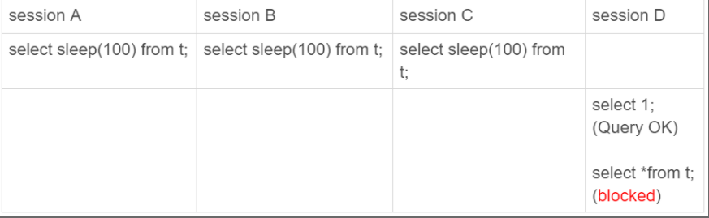

# 如何判断一个数据库是不是出问题了？

主备切换有两种场景，一种是主动切换，一种是被动切换。而其中被动切换，往往是因为主库出问题了，由 HA 系统发起的。

怎么判断一个主库出问题了？

#### select 1 判断

实际上，select 1 成功返回，只能说明这个库的进程还在，并不能说明主库没问题。现在，我们来看一下这个场景。  

```mysql
set global innodb_thread_concurrency=3;

CREATE TABLE `t` (
  `id` int(11) NOT NULL,
  `c` int(11) DEFAULT NULL,
  PRIMARY KEY (`id`)
) ENGINE=InnoDB;
insert into t values(1,1)
```



​										图 1 查询 blocked  

我们设置 innodb_thread_concurrency 参数的目的是，控制 InnoDB 的并发线程上限。也就是说，一旦并发线程数达到这个值，InnoDB 在接收到新请求的时候，就会进入等待状态，直到有线程退出.  

这个时候是不能通过select 1 来检测是否正常。 

在 InnoDB 中，innodb_thread_concurrency 这个参数的默认值是 0，表示不限制并发线程数量。但是，不限制并发线程数肯定是不行的。因为，一个机器的 CPU 核数有限，线程全冲进来，上下文切换的成本就会太高。  

