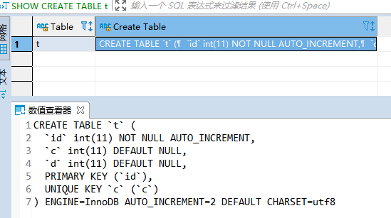

# 39 | 自增主键为什么不是连续的？

在[第 4 篇文章](./04深入浅出索引上.md)中，我们提到过自增主键，由于自增主键可以让主键索引尽量地保持递增顺序插入，避免了页分裂，因此索引更紧凑。

**之前我见过有的业务设计依赖于自增主键的连续性**，也就是说，这个设计假设自增主键是连续的。但实际上，这样的假设是错的，因为**自增主键不能保证连续递增**。

今天这篇文章，我们就来说说这个问题，**看看什么情况下自增主键会出现 “空洞”？**

为了便于说明，我们创建一个表 t，其中 id 是自增主键字段、c 是唯一索引。

```mysql
CREATE TABLE `t` (
  `id` int(11) NOT NULL AUTO_INCREMENT,
  `c` int(11) DEFAULT NULL,
  `d` int(11) DEFAULT NULL,
  PRIMARY KEY (`id`),
  UNIQUE KEY `c` (`c`)
) ENGINE=InnoDB;
```

#### 自增值保存在哪儿？ 

在这个空表 t 里面执行 insert into t values(null, 1, 1); 插入一行数据，再执行 show create table 命令，就可以看到如下图所示的结果



​													图 1 自动生成的 AUTO_INCREMENT 值

查询语句 `SELECT * FROM t;`结果是：

> | id   | c    | d    |
> | ---- | ---- | ---- |
> | 1    | 1    | 1    |

可以看到，表定义里面出现了一个 **AUTO_INCREMENT=2**，表示下一次插入数据时，如果需要自动生成自增值，会生成 id=2。可以通过 `show create tbale t`查看子增值是多少。

其实，这个输出结果容易引起这样的**误解**：**自增值是保存在表结构定义里的**。**实际上，表的结构定义存放在后缀名为.frm 的文件中，但是并不会保存自增值**。

不同的引擎对于自增值的保存策略不同。

- MyISAM 引擎的自增值保存在数据文件中。

- InnoDB 引擎的自增值，其实是保存在了内存里，并且到了 MySQL 8.0 版本后，才有了“自增值持久化”的能力，也就是才实现了“如果发生重启，表的自增值可以恢复为 MySQL 重启前的值”，具体情况是：

  - **在 MySQL 5.7 及之前的版本，自增值保存在内存里，并没有持久化**。**每次重启后，第一次打开表的时候，都会去找自增值的最大值 max(id)，然后将 max(id)+1 作为这个表当前的自增值**。

    举例来说，如果一个表当前数据行里最大的 id 是 10，AUTO_INCREMENT=11。这时候，我们删除 id=10 的行，AUTO_INCREMENT 还是 11。但如果马上重启实例，重启后这个表的 AUTO_INCREMENT 就会变成 10。

  - 在 MySQL 8.0 版本，将自增值的变更记录在了 redo log 中，重启的时候依靠 redo log 恢复重启之前的值。

理解了 MySQL 对自增值的保存策略以后，我们再看看自增值修改机制。

#### 自增值修改机制 

在 MySQL 里面，如果字段 id 被定义为 AUTO_INCREMENT，在插入一行数据的时候，自增值的行为如下：

1. 如果插入数据时 id 字段指定为 0、null 或未指定值，那么就把这个表当前的 AUTO_INCREMENT 值填到自增字段；
2. 如果插入数据时 id 字段指定了具体的值，就直接使用语句里指定的值。

根据要插入的值和当前自增值的大小关系，自增值的变更结果也会有所不同。假设，某次要插入的值是 X，当前的自增值是 Y。

1. 如果 X<Y，那么这个表的自增值不变；
2. 如果 X≥Y，就需要把当前自增值修改为新的自增值。

**新的自增值的生成算法**是：

**从 auto_increment_offset 开始，以 auto_increment_increment 为步长，持续叠加，直到找到第一个大于 X 的值，作为新的自增值**。

其中，auto_increment_offset 和 auto_increment_increment 是两个系统参数，分别用来表示自增的初始值和步长，默认值都是 1。

> 备注：在一些场景下，使用的就不全是默认值。比如，双 M 的主备结构里要求双写的时候，我们就可能会设置成 auto_increment_increment=2，让一个库的自增 id 都是奇数，另一个库的自增 id 都是偶数，避免两个库生成的主键发生冲突。

当 auto_increment_offset 和 auto_increment_increment 都是 1 的时候，新的自增值生成逻辑很简单，就是：

1. 如果准备插入的值 >= 当前自增值，新的自增值就是 ”准备插入的值+1“；
2. 否则，自增值不变。

这就引入了我们文章开头提到的问题，在这两个参数都设置为 1 的时候，自增主键 id 却不能保证是连续的，这是什么原因呢？

#### 自增值的修改时机

##### 1 唯一键导致自增主键不连续

要回答这个问题，我们就要看一下自增值的修改时机。

假设，表 t 里面已经有了 (1,1,1) 这条记录，这时我再执行一条插入数据命令：

```mysql 
insert into t values(null, 1, 1); // 执行了，报错了，但是 AUTO_INCREMENT=3 变了
```

这个语句的执行流程就是：

1. 执行器调用 InnoDB 引擎接口写入一行，传入的这一行的值是 (0,1,1);
2. InnoDB 发现用户没有指定自增 id 的值，获取表 t 当前的自增值 2；
3. 将传入的行的值改成 (2,1,1);
4. 将表的自增值改成 3；
5. 继续执行插入数据操作，由于已经存在 c=1 的记录，所以报 Duplicate key error，语句返回。

对应的执行流程图如下：


​																			图 2 insert(null, 1,1) 唯一键冲突

可以看到，**这个表的自增值改成 3，是在真正执行插入数据的操作之前**。这个语句真正执行的时候，因为碰到唯一键 c 冲突，所以 id=2 这一行并没有插入成功，但也没有将自增值再改回去。

**所以，在这之后，再插入新的数据行时，拿到的自增 id 就是 3**。**也就是说，出现了自增主键不连续的情况**。


​																			图 3 一个自增主键 id 不连续的复现步骤

这里是4因为，我插入了三次 (null, 1, 1)。

可以看到，这个操作序列复现了一个自增主键 id 不连续的现场 (没有 id=2 的行）。可见，**唯一键冲突是导致自增主键 id 不连续的第一种原因**。

##### 2 事务回滚导致自增主键不连续

同样地，**事务回滚也会产生类似的现象**，这就是第二种原因。

下面这个语句序列就可以构造不连续的自增 id，你可以自己验证一下。

```mysql 
insert into t values(null,1,1);
begin;
insert into t values(null,2,2);
rollback;
insert into t values(null,2,2);
//插入的行是(3,2,2)
```

你可能会问，为什么在出现唯一键冲突或者回滚的时候，MySQL 没有把表 t 的自增值改回去呢？如果把表 t 的当前自增值从 3 改回 2，再插入新数据的时候，不就可以生成 id=2 的一行数据了吗？

其实，**MySQL 这么设计是为了提升性能**。接下来，我就跟你分析一下这个设计思路，**看看自增值为什么不能回退**。

假设有两个并行执行的事务，在申请自增值的时候，为了避免两个事务申请到相同的自增 id，肯定要加锁，然后顺序申请。

1. 假设事务 A 申请到了 id=2， 事务 B 申请到 id=3，那么这时候表 t 的自增值是 4，之后继续执行。
2. 事务 B 正确提交了，但事务 A 出现了唯一键冲突。
3. 如果允许事务 A 把自增 id 回退，也就是把表 t 的当前自增值改回 2，那么就会出现这样的情况：表里面已经有 id=3 的行，而当前的自增 id 值是 2。
4. 接下来，继续执行的其他事务就会申请到 id=2，然后再申请到 id=3。这时，就会出现插入语句报错“主键冲突”。

而为了解决这个主键冲突，有两种方法：

1. 每次申请 id 之前，先判断表里面是否已经存在这个 id。如果存在，就跳过这个 id。但是，这个方法的成本很高。因为，本来申请 id 是一个很快的操作，现在还要再去主键索引树上判断 id 是否存在。
2. 把自增 id 的锁范围扩大，必须等到一个事务执行完成并提交，下一个事务才能再申请自增 id。这个方法的问题，就是锁的粒度太大，系统并发能力大大下降。

可见，这两个方法都会导致性能问题。造成这些麻烦的罪魁祸首，**就是我们假设的这个“允许自增 id 回退”的前提导致的**。

因此，InnoDB 放弃了这个设计，语句执行失败也不回退自增 id。也正是因为这样，**所以才只保证了自增 id 是递增的，但不保证是连续的**。

#### 自增锁的优化 

可以看到，自增 id 锁并不是一个事务锁，而是每次申请完就马上释放，以便允许别的事务再申请。其实，在 MySQL 5.1 版本之前，并不是这样的。

