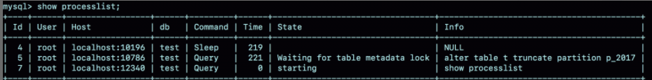

# 43 | 要不要使用分区表？

我经常被问到这样一个问题：**分区表有什么问题，为什么公司规范不让使用分区表呢**？今天，我们就来聊聊分区表的使用行为，然后再一起回答这个问题。

#### 分区表是什么？

##### InnoDB 分区表

为了说明分区表的组织形式，我先创建一个表 t：

```mysql 
CREATE TABLE `t` (
  `ftime` datetime NOT NULL,
  `c` int(11) DEFAULT NULL,
  KEY (`ftime`)
) ENGINE=InnoDB DEFAULT CHARSET=latin1
PARTITION BY RANGE (YEAR(ftime))
(PARTITION p_2017 VALUES LESS THAN (2017) ENGINE = InnoDB,
 PARTITION p_2018 VALUES LESS THAN (2018) ENGINE = InnoDB,
 PARTITION p_2019 VALUES LESS THAN (2019) ENGINE = InnoDB,
PARTITION p_others VALUES LESS THAN MAXVALUE ENGINE = InnoDB);
insert into t values('2017-4-1',1),('2018-4-1',1);
```


​															**图 1 表 t 的磁盘文件**

可以看到，这个表包含了一个.frm 文件和 4 个.ibd 文件，每个分区对应一个.ibd 文件。也就是说：

- **对于引擎层来说，这是 4 个表**；
- **对于 server 层来说，这是1个表**。

你可能会觉得这两句都是废话。其实不然，这两句话非常重要，可以帮我们理解分区表的执行逻辑。

#### 分区表的引擎行为 

我先给你举个在分区表加间隙锁的例子，目的是说明对于 InnoDB 来说，这是 4 个表。


​													**图 2 分区表间隙锁示例**

复习一下，在 [第21篇文章](./21为什么我只改一行的语句，锁这么多.md) 介绍的间隙锁的加锁规则。

我们初始化表 t 的时候，只插入了两行数据， ftime 的值分别是，'2017-4-1' 和'2018-4-1' 。session A 的 select 语句对索引 ftime 上这两个记录之间的间隙加了锁。如果是一个普通表的话，那么 T1 时刻，在表 t 的 ftime 索引上，间隙和加锁状态应该是图 3 这样的。


​																	**图 3 普通表的加锁范围**

也就是说，'2017-4-1' 和'2018-4-1' 这两个记录之间的间隙是会被锁住的。那么，sesion B 的两条插入语句应该都要进入锁等待状态。

但是，从上面的实验效果可以看出，sessionB 的第一个 insert 语句是可以执行成功的。这是因为，对于引擎来说，p_2018 和 p_2019 是两个不同的表，也就是说 2017-4-1 的下一个记录并不是 2018-4-1，而是 p_2018 分区的 supremum。所以 T1 时刻，在表 t 的 ftime 索引上，间隙锁和加锁的状态其实是图 4 这样的：


​														   图 4 分区表 t 的加锁范围

由于分区表的规则，session A 的 select 语句其实只操作了分区 p_2018，因此加锁范围就是图 4 中深绿色的部分。

所以，session B 要写入一行 ftime 是 2018-2-1 的时候是可以成功的，而要写入 2017-12-1 这个记录，就要等 session A 的间隙锁。

图 5 就是这时候的 show engine innodb status 的部分结果。


​															图 5 session B 被锁住信息

##### MyISAM 分区表

看完 InnoDB 引擎的例子，我们再来一个 MyISAM 分区表的例子。

我首先用 alter table t engine=myisam，把表 t 改成 MyISAM 表；然后，我再用下面这个例子说明，**对于 MyISAM 引擎来说，这是 4 个表**。


​												图 6 用 MyISAM 表锁验证

在 session A 里面，我用 sleep(100) 将这条语句的执行时间设置为 100 秒。由于 MyISAM 引擎只支持表锁，所以这条 update 语句会锁住整个表 t 上的读。

但我们看到的结果是，session B 的第一条查询语句是可以正常执行的，第二条语句才进入锁等待状态。

这正是因为 **MyISAM 的表锁是在引擎层实现的，session A 加的表锁，其实是锁在分区 p_2018 上。因此，只会堵住在这个分区上执行的查询，落到其他分区的查询是不受影响的**。锁的是表。

看到这里，你可能会说，分区表看来还不错嘛，为什么不让用呢？**我们使用分区表的一个重要原因就是单表过大**。那么，**如果不使用分区表的话，我们就是要使用手动分表的方式**。

接下来，我们一起看看**手动分表和分区表**有什么区别。

#### 手动分表和分区表的区别 

比如，按照年份来划分，我们就分别创建普通表 t_2017、t_2018、t_2019 等等。**手工分表的逻辑，也是找到需要更新的所有分表，然后依次执行更新**。在性能上，这和分区表并没有实质的差别。

**分区表和手工分表，一个是由 server 层来决定使用哪个分区，一个是由应用层代码来决定使用哪个分表**。因此，从引擎层看，这两种方式也是没有差别的。

其实这两个方案的区别，主要是在 server 层上。从 server 层看，我们就不得不提到分区表一个被广为诟病的问题：**打开表的行为**。

#### 分区策略 

**每当第一次访问一个分区表的时候，MySQL需要把所有的分区都访问一遍**。**一个典型的报错情况**是这样的：如果一个分区表的分区很多，比如超过了1000个，而 MySQL 启动的时候，open_files_limits 参数使用的默认值是 1024，那么就会在访问这个表的时候，由于需要打开所有的文件，导致打开表文件的个数超过了上限而报错。

下图就是我创建的一个包含了很多分区的表 t_myisam，执行一条插入语句后报错的情况


​													图 7 insert 语句报错

可以看到，这条 insert 语句，明显只需要访问一个分区，但语句却无法执行。

这时，你一定从表名猜到了，这个表我用的是 MyISAM 引擎。是的，**因为使用 InnoDB 引擎的话，并不会出现这个问题**。

**MyISAM 分区表使用的分区策略，我们称为通用分区策略（generic partitioning）**，每次访问分区都由 server 层控制。通用分区策略，是 MySQL 一开始支持分区表的时候就存在的代码，在文件管理、表管理的实现上很粗糙，因此有比较严重的性能问题。

**从 MySQL 5.7.9 开始，InnoDB 引擎引入了本地分区策略（native partitioning）**。这个策略是在 InnoDB 内部自己管理打开分区的行为。

MySQL 从 5.7.17 开始，将 MyISAM 分区表标记为即将弃用 (deprecated)，意思是“从这个版本开始不建议这么使用，请使用替代方案。在将来的版本中会废弃这个功能”。

从 MySQL 8.0 版本开始，就不允许创建 MyISAM 分区表了，只允许创建已经实现了本地分区策略的引擎。目前来看，只有 InnoDB 和 NDB 这两个引擎支持了本地分区策略。

接下来，我们再看一下分区表在 server 层的行为。

#### 分区表的 server 层行为 

**如果从 server 层看的话**，**一个分区表就只是一个表**。

这句话是什么意思呢？接下来，我就用下面这个例子来和你说明。如图 8 和图 9 所示，分别是这个例子的操作序列和执行结果图。


​														图 8 分区表的 MDL 锁 



​														图 9 show processlist 结果 

可以看到，虽然 session B 只需要操作 p_2017 这个分区，但是由于 session A 持有整个表 t 的 MDL 锁，就导致了 session B 的 alter 语句被堵住。

这也是 DBA 同学经常说的，分区表，在做 DDL 的时候，影响会更大。如果你使用的是普通分表，那么当你在 truncate 一个分表的时候，肯定不会跟另外一个分表上的查询语句，出现 MDL 锁冲突。

##### **小结一下**

1. MySQL 在第一次打开分区表的时候，需要访问所有的分区（在 MyISAM 引擎下，I你弄DB不会）；
2. 在 server 层，认为这是同一张表，因此所有分区共用一个 MDL 锁；
3. 在引擎层，认为这是不同的表，因此 MDL 锁之后的执行过程，会根据分区表规则，只访问必要的分区。

而**关于“必要的分区”的判断，就是根据 SQL 语句中的 where 条件，结合分区规则来实现的**。比如我们上面的例子中，where ftime='2018-4-1'，根据分区规则 year 函数算出来的值是 2018，那么就会落在 p_2019 这个分区。

但是，如果这个 where 条件改成 where ftime>='2018-4-1'，虽然查询结果相同，但是这时候根据 where 条件，就要访问 p_2019 和 p_others 这两个分区。

如果查询语句的 where 条件中没有分区 key，那就只能访问所有分区了。当然，这并不是分区表的问题。即使是使用业务分表的方式，where 条件中没有使用分表的 key，也必须访问所有的分表。

我们已经理解了分区表的概念，那么什么场景下适合使用分区表呢？

#### 分区表的应用场景 

**分区表的一个显而易见的优势是对业务透明**，相对于用户分表来说，**使用分区表的业务代码更简洁**。还有，**分区表可以很方便的清理历史数据**。

如果一项业务跑的时间足够长，往往就会有根据时间删除历史数据的需求。这时候，按照时间分区的分区表，就可以直接通过 alter table t drop partition ... 这个语法删掉分区，从而删掉过期的历史数据。

这个 alter table t drop partition ... 操作是直接删除分区文件，效果跟 drop 普通表类似。与使用 delete 语句删除数据相比，优势是速度快、对系统影响小。

#### 小结 

需要注意的是，我是以范围分区（range）为例和你介绍的。**实际上，MySQL 还支持 hash 分区、list 分区等分区方法**。你可以在需要用到的时候，再翻翻[手册](https://dev.mysql.com/doc/refman/8.0/en/partitioning-types.html)。

实际使用时，分区表跟用户分表比起来，有两个绕不开的问题：一个是第一次访问的时候需要访问所有分区，另一个是共用 MDL 锁。

因此，如果要使用分区表，就不要创建太多的分区。我见过一个用户做了按天分区策略，然后预先创建了 10 年的分区。这种情况下，访问分区表的性能自然是不好的。这里有两个问题需要注意：

1. 分区并不是越细越好。实际上，单表或者单分区的数据一千万行，只要没有特别大的索引，对于现在的硬件能力来说都已经是小表了。
2. 分区也不要提前预留太多，在使用之前预先创建即可。比如，如果是按月分区，每年年底时再把下一年度的 12 个新分区创建上即可。对于没有数据的历史分区，要及时的 drop 掉。

至于分区表的其他问题，比如查询需要跨多个分区取数据，查询性能就会比较慢，基本上就不是分区表本身的问题，而是数据量的问题或者说是使用方式的问题了。

当然，如果你的团队已经维护了成熟的分库分表中间件，用业务分表，对业务开发同学没有额外的复杂性，对 DBA 也更直观，自然是更好的。

#### 思考题 

我们举例的表中没有用到自增主键，假设现在要创建一个自增字段 id。MySQL 要求分区表中的主键必须包含分区字段。如果要在表 t 的基础上做修改，你会怎么定义这个表的主键呢？为什么这么定义呢？

极友评论：

此时主键包含自增列+分区键，原因为对innodb来说分区等于单独的表，自增字段每个分区可以插入相同的值，如果主键只有自增列无法完全保证唯一性。
测试表如下：
mysql> show create table t\G
       Table: t
Create Table: CREATE TABLE `t` (
  `id` int(11) NOT NULL AUTO_INCREMENT,
  `ftime` datetime NOT NULL,
  `c` int(11) DEFAULT NULL,
  PRIMARY KEY (`id`,`ftime`),
  KEY `ftime` (`ftime`)
) ENGINE=InnoDB DEFAULT CHARSET=utf8mb4
/*!50100 PARTITION BY RANGE (YEAR(ftime))
(PARTITION p_2017 VALUES LESS THAN (2017) ENGINE = InnoDB,
 PARTITION p_2018 VALUES LESS THAN (2018) ENGINE = InnoDB,
 PARTITION p_2019 VALUES LESS THAN (2019) ENGINE = InnoDB,
 PARTITION p_others VALUES LESS THAN MAXVALUE ENGINE = InnoDB) */
1 row in set (0.00 sec)
mysql> insert into t values(1,'2017-4-1',1),(1,'2018-4-1',1);
Query OK, 2 rows affected (0.02 sec)
mysql> select * from t;
+----+---------------------+------+
| id | ftime | c |
+----+---------------------+------+
| 1 | 2017-04-01 00:00:00 | 1 |
| 1 | 2018-04-01 00:00:00 | 1 |
+----+---------------------+------+
2 rows in set (0.00 sec)

mysql> insert into t values(null,'2017-5-1',1),(null,'2018-5-1',1);
Query OK, 2 rows affected (0.02 sec)

mysql> select * from t;
+----+---------------------+------+
| id | ftime | c |
+----+---------------------+------+
| 1 | 2017-04-01 00:00:00 | 1 |
| 2 | 2017-05-01 00:00:00 | 1 |
| 1 | 2018-04-01 00:00:00 | 1 |
| 3 | 2018-05-01 00:00:00 | 1 |
+----+---------------------+------+
4 rows in set (0.00 sec) 

**老师回答**

这时候就有两种可选：一种是 (ftime, id)，另一种是 (id, ftime)。如果从利用率上来看，应该使用 (ftime, id) 这种模式。因为用 ftime 做分区 key，说明大多数语句都是包含 ftime 的，使用这种模式，可以利用前缀索引的规则，减少一个索引。

这时的建表语句是：

```mysql

CREATE TABLE `t` (
  `id` int(11) NOT NULL AUTO_INCREMENT,
  `ftime` datetime NOT NULL,
  `c` int(11) DEFAULT NULL,
  PRIMARY KEY (`ftime`,`id`)
) ENGINE=MyISAM DEFAULT CHARSET=latin1
PARTITION BY RANGE (YEAR(ftime))
(PARTITION p_2017 VALUES LESS THAN (2017) ENGINE = MyISAM,
 PARTITION p_2018 VALUES LESS THAN (2018) ENGINE = MyISAM,
 PARTITION p_2019 VALUES LESS THAN (2019) ENGINE = MyISAM,
 PARTITION p_others VALUES LESS THAN MAXVALUE ENGINE = MyISAM);
```

当然，我的建议是你要尽量使用 InnoDB 引擎。InnoDB 表要求至少有一个索引，以自增字段作为第一个字段，所以需要加一个 id 的单独索引。

```mysql

CREATE TABLE `t` (
  `id` int(11) NOT NULL AUTO_INCREMENT,
  `ftime` datetime NOT NULL,
  `c` int(11) DEFAULT NULL,
  PRIMARY KEY (`ftime`,`id`),
  KEY `id` (`id`)
) ENGINE=InnoDB DEFAULT CHARSET=latin1
PARTITION BY RANGE (YEAR(ftime))
(PARTITION p_2017 VALUES LESS THAN (2017) ENGINE = InnoDB,
 PARTITION p_2018 VALUES LESS THAN (2018) ENGINE = InnoDB,
 PARTITION p_2019 VALUES LESS THAN (2019) ENGINE = InnoDB,
 PARTITION p_others VALUES LESS THAN MAXVALUE ENGINE = InnoDB);
```

当然把字段反过来，创建成：

```mysql
PRIMARY KEY (`id`,`ftime`),
KEY `id` (`ftime`)
```

也是可以的。


