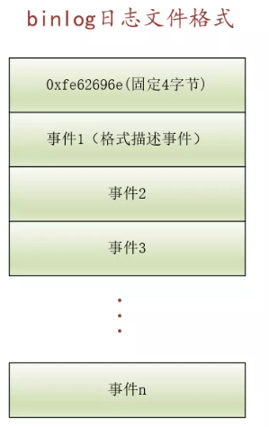

## MySQL 日志


### Binlog 归档日志

链接： https://mp.weixin.qq.com/s/fmF0Ucc4NFUzDneMVu22FA

---

#### binlog的作用

`binlog` 是 binary log 的缩写，即**二进制日志**。binlog 中 **记载了数据库发生的变化**，比方说**新建了一个数据库**或者**表、表结构发生改变**、**表中的数据结构发生变化**都会记录相应的binlog日志。

binlog 主要用在下面两个方面：

##### 用途一：用于复制

现在人们张口闭口就是**亿级并发**，虽然是夸张，但**单台物理机器所能同时处理的请求是有限的**却是一个事实。为了提高并发处理请求的能力，一般将MySQL服务部署在多台物理机器中，这些服务器中维护相同的数据副本。

其中一个典型的部署方案就是`一主多从`，**即一台主服务器（Master）和多台从服务器（Slave）**。对于改变数据库状态的请求（DDL、DML等），就将它们发送给主服务器，对于单纯的查询（如SELECT语句）请求，就将它们发送给从服务器。为了让各个从服务器中存储的数据和主服务器中存储的数据一致，每当我们改变了主服务器中的数据后，就需要将改变的信息**同步**给各个从服务器。`binlog`**日志中正好记录了数据库发生的各种改变的信息**，**从服务器读取主服务器产生的`binlog`日志**，**然后执行这些`binlog`日志中所记录的数据库变化语句，从而达到主从服务器数据一致的效果**。

##### 用途二：用于恢复 

工作中我们可能有意无意的就将数据库里的数据给“毁”了，比方说写DELETE语句不加WHERE子句，那一整个表的数据都就没了！为了数据的安全性，**我们需要定时备份数据库（mysqldump命令）**，不过这种全量备份我们不可能每秒都做一遍，而是**每天或者每个月做一次全量备份**。那如果在两次全量备份中间手贱写了不加WHERE条件的DELETE语句该怎么办呢？只能将数据库恢复到前一次全量备份时的样子吗？还好我们有`binlog`日志，我们可以**从上一次全量备份开始，执行自改次备份后产生的`binlog`日志，直到我们写DELETE语句之前的binlog日志为止**。这样就可以完成数据库恢复的功能。

#### 怎么配置 binlog

MySQL 并没有默认开启 binlog 日志，需要我们进行配置。MySQL 服务器并不会一定生成 binlog 日志，我们可以通过查看 log_bin 系统变量来判断当前MySQL服务器是否生成 binlog 日志：

```mysq
SHOW variables LIKE 'log_bin%';
```


我这边是配置开启了的。log_bin 系统变量的值为 ON，表明当前服务器生成 binlog，若为 OFF 则表明当前服务器不生成 binlog。

如果当前服务器不生成`binlog`，我们想开启`binlog`，那么就需要重启服务器，设置`log-bin`启动选项：

```tex
--log-bin[=base_name]
```

`binlog`日志并不是仅写到一个文件中，而是写入一组文件中，这组文件的命名是这样的：

```tex
basename.000001
basename.000002
basename.000003
basename.000004
```

如我本地现在的是这种：


是因为配置的是：

```tex
# 设置binlog
log_bin=D:\mysql\mysql-5.7.31-winx64\logs\mysql-bin
# 设置 binlog 格式
binlog_format = ROW
```

也就是这组日志文件名称都包含一个basename，然后以一个数字结尾。

启动选项`log-bin[=base_name]`中的`base_name`就是这组binlog日志文件名称都包含的部分。如果我们不指定`base_name`（即单纯的使用--log-bin），那MySQL服务器会默认将`主机名-bin`作为binlog日志文件的basename。

#### binlog 在系统文件中的内容 

我们刚强调，binlog日志不是单个文件，而是一组包含共同basename的文件。比方说现在我的机器上有以下4个binlog文件：


这些binlog文件并不能直接被当作文本打开，毕竟人家的名字是binlog，存储的是二进制数据。

除了真正存储binlog日志的文件外，MySQL服务器还会在相同的路径下生成一个关于binlog的索引文件，在我的系统上它的名称就是：`mysql-bin.index`

这个索引文件是一个文本文件，我们可以直接打开：

```tex
D:\mysql\mysql-5.7.31-winx64\logs\mysql-bin.000001
D:\mysql\mysql-5.7.31-winx64\logs\mysql-bin.000002
D:\mysql\mysql-5.7.31-winx64\logs\mysql-bin.000003
D:\mysql\mysql-5.7.31-winx64\logs\mysql-bin.000004
```

可以看到，这个索引文件知识简单的讲各个binlog文件的路径存储起来了而已。

#### 查看binlog的语句 

binlog中记录数据库发生更改的各种事件（events），这些事件的种类非常多，完整的事件类型如下所示：

```mysql

enum Log_event_type
{
  /**
    Every time you update this enum (when you add a type), you have to
    fix Format_description_event::Format_description_event().
  */
  UNKNOWN_EVENT= 0,
  START_EVENT_V3= 1,
  QUERY_EVENT= 2,
  STOP_EVENT= 3,
  ROTATE_EVENT= 4,
  INTVAR_EVENT= 5,
  LOAD_EVENT= 6,
  SLAVE_EVENT= 7,
  CREATE_FILE_EVENT= 8,
  APPEND_BLOCK_EVENT= 9,
  EXEC_LOAD_EVENT= 10,
  DELETE_FILE_EVENT= 11,
  /**
    NEW_LOAD_EVENT is like LOAD_EVENT except that it has a longer
    sql_ex, allowing multibyte TERMINATED BY etc; both types share the
    same class (Load_event)
  */
  NEW_LOAD_EVENT= 12,
  RAND_EVENT= 13,
  USER_VAR_EVENT= 14,
  FORMAT_DESCRIPTION_EVENT= 15,
  XID_EVENT= 16,
  BEGIN_LOAD_QUERY_EVENT= 17,
  EXECUTE_LOAD_QUERY_EVENT= 18,

  TABLE_MAP_EVENT = 19,

  /**
    The PRE_GA event numbers were used for 5.1.0 to 5.1.15 and are
    therefore obsolete.
   */
  PRE_GA_WRITE_ROWS_EVENT = 20,
  PRE_GA_UPDATE_ROWS_EVENT = 21,
  PRE_GA_DELETE_ROWS_EVENT = 22,

  /**
    The V1 event numbers are used from 5.1.16 until mysql-trunk-xx
  */
  WRITE_ROWS_EVENT_V1 = 23,
  UPDATE_ROWS_EVENT_V1 = 24,
  DELETE_ROWS_EVENT_V1 = 25,

  /**
    Something out of the ordinary happened on the master
   */
  INCIDENT_EVENT= 26,

  /**
    Heartbeat event to be send by master at its idle time
    to ensure master's online status to slave
  */
  HEARTBEAT_LOG_EVENT= 27,

  /**
    In some situations, it is necessary to send over ignorable
    data to the slave: data that a slave can handle in case there
    is code for handling it, but which can be ignored if it is not
    recognized.
  */
  IGNORABLE_LOG_EVENT= 28,
  ROWS_QUERY_LOG_EVENT= 29,

  /** Version 2 of the Row events */
  WRITE_ROWS_EVENT = 30,
  UPDATE_ROWS_EVENT = 31,
  DELETE_ROWS_EVENT = 32,

  GTID_LOG_EVENT= 33,
  ANONYMOUS_GTID_LOG_EVENT= 34,

  PREVIOUS_GTIDS_LOG_EVENT= 35,

  TRANSACTION_CONTEXT_EVENT= 36,

  VIEW_CHANGE_EVENT= 37,

  /* Prepared XA transaction terminal event similar to Xid */
  XA_PREPARE_LOG_EVENT= 38,
  /**
    Add new events here - right above this comment!
    Existing events (except ENUM_END_EVENT) should never change their numbers
  */
  ENUM_END_EVENT /* end marker */
};
```

其中的一些我们熟悉的事件：

- WRITE_ROWS_EVENT：插入记录。

- UPDATE_ROWS_EVENT：更新记录。

- DELETE_ROWS_EVENT：删除记录。

像创建、修改数据库或者表结构这些语句也都可以找到对应类型的`事件`，我们这里就不一一展开了。

为了查看我们的binlog中包含了哪些`事件`，可以使用下边这个语句（带中括号`[]`的表示可以省略的语句）：

```mysql
SHOW BINLOG EVENTS
   [IN 'log_name']
   [FROM pos]
   [LIMIT [offset,] row_count]
```

其中：

- [IN 'log_name'] : log_name 表示我们要查看那个 binlog 日志文件的内容。
- `[FROM pos]`：`pos`表示我们要查看binlog文件的起始偏移量（通过指定这个值可以直接去查看某个偏移量处的事件）。
- `LIMIT [offset,] row_count`：这个LIMIT子句的含义和我们写SQL语句中LIMIT子句的含义是一样的，`offset`表示我们要从哪个事件开始查看，`row_count`表示我们要查看多少个事件。

测试：

如果我们直接执行 SHOW BINLOG EVENTS,表示查看第1个binlog日志文件的内容：`SHOW binlog events;` 图是我自己本地的。


| Log_name | Pos  | Event_type | Server_id | End_log_pos | Info |
| -------- | ---- | ---------- | --------- | ----------- | ---- |
| xiaohaizi-bin.000001 |   4 | Format_desc    |         3 |         123 | Server ver: 5.7.21-log, Binlog ver: 4 |
| xiaohaizi-bin.000001 | 123 | Previous_gtids |         3 |         154 |                                       |
| xiaohaizi-bin.000001 | 154 | Anonymous_Gtid |         3 |         219 | SET @@SESSION.GTID_NEXT= 'ANONYMOUS'  |
| xiaohaizi-bin.000001 | 219 | Query          |         3 |         296 | BEGIN                                 |
| xiaohaizi-bin.000001 | 296 | Table_map      |         3 |         367 | table_id: 138 (xiaohaizi.s1)          |
| xiaohaizi-bin.000001 | 367 | Update_rows    |         3 |         634 | table_id: 138 flags: STMT_END_F       |
| xiaohaizi-bin.000001 | 634 | Xid            |         3 |         665 | COMMIT /* xid=65 */                   |
| xiaohaizi-bin.000001 | 665 | Stop           |         3 |         688 |                                       |


其中

- `Log_name`：表示binlog日志的文件名。
- `Pos`：表示该事件在binlog日志文件中的起始偏移量。
- `Event_type`：表示这个事件的类型。
- `Server_id`：表示产生该事件的server_id（server_id是一个系统变量，我们可以通过配置让不通的MySQL服务器拥有不通的server_id，我有配置为 1）。
- `End_log_pos`：表示下一个事件的在binlog日志文件中的起始偏移量。
- `Info`：关于本事件的一些说明。

上边可能能看懂两个事件：

- 起始偏移量为219（Pos=219）的事件是一个表明开始事务（BEGIN）的事件。
- 起始偏移量为367（Pos=367）的事件是一个更新记录的事件（UPDATE）

好了现在先不细究各种类型的事件都代表什么，我们目前只需要知道binlog日志是由若干个事件组成的就好了。

如果我们想看其他binlog日志的详细情况，那就需要用到IN子句了：

> SHOW BINLOG EVENTS IN 'xiaohaizi-bin.000004';

| Log_name | Pos  | Event_type | Server_id | End_log_pos | Info |
| -------- | ---- | ---------- | --------- | ----------- | ---- |
| xiaohaizi-bin.000004 |   4 | Format_desc    |         3 |         123 | Server ver: 5.7.21-log, Binlog ver: 4     |
| xiaohaizi-bin.000004 | 123 | Previous_gtids |         3 |         154 |                                           |
| xiaohaizi-bin.000004 | 154 | Anonymous_Gtid |         3 |         219 | SET @@SESSION.GTID_NEXT= 'ANONYMOUS'      |
| xiaohaizi-bin.000004 | 219 | Query          |         3 |         327 | use `xiaohaizi`; create table tt1 (c int) |
| xiaohaizi-bin.000004 | 327 | Anonymous_Gtid |         3 |         392 | SET @@SESSION.GTID_NEXT= 'ANONYMOUS'      |
| xiaohaizi-bin.000004 | 392 | Query          |         3 |         469 | BEGIN                                     |
| xiaohaizi-bin.000004 | 469 | Table_map      |         3 |         520 | table_id: 167 (xiaohaizi.tt1)             |
| xiaohaizi-bin.000004 | 520 | Write_rows     |         3 |         560 | table_id: 167 flags: STMT_END_F           |
| xiaohaizi-bin.000004 | 560 | Xid            |         3 |         591 | COMMIT /* xid=71 */                       |
| xiaohaizi-bin.000004 | 591 | Anonymous_Gtid |         3 |         656 | SET @@SESSION.GTID_NEXT= 'ANONYMOUS'      |
| xiaohaizi-bin.000004 | 656 | Query          |         3 |         733 | BEGIN                                     |
| xiaohaizi-bin.000004 | 733 | Table_map      |         3 |         784 | table_id: 167 (xiaohaizi.tt1)             |
| xiaohaizi-bin.000004 | 784 | Update_rows    |         3 |         830 | table_id: 167 flags: STMT_END_F           |
| xiaohaizi-bin.000004 | 830 | Xid            |         3 |         861 | COMMIT /* xid=73 */                       |

这样我们就看到了`xiaohaizi-bin.000004`这个binlog日志文件中存储了哪些事件了。

大家可以自行测试一下FROM子句和LIMIT子句的用法，这里就不展示了。

#### mysqlbinlog 工具的使用 

由于binlog是二进制格式的，我们不能直接以文本的形式查看。使用`SHOW BINLOG EVENTS`又只能看到粗略的信息，如果我们想查看binlog日志文件的详细信息的话，就需要使用MySQL给我们提供的实用工具——mysqlbinlog。

像`mysqld`、`mysql`这些可执行文件一样，`mysqlbinlog`也被放在了MySQL安装目录下的bin目录下。

我们可以将想查看的binlog日志文件路径作为`mysqlbinlog`的参数，就能查看文本形式的事件详细信息了。比方说我们看一下`xiaohaizi-bin.000001`：

>  shell> mysqlbinlog ./xiaohaizi-bin.000001


其中以`# at xx`开头的表示这是一个事件的开始，诸如：

- `# at 4`：表示在偏移量为4的地方有一个事件，下边是该事件的详细信息。

- `# at 123`表示在偏移量为123的地方有一个事件，下边是该事件的详细信息

#### binlog 的文件格式 

##### 基本格式 



从上图可以看出：

- 每个binlog日志文件的前 4 个字节是固定的，即：`0xfe626963`；

  > 0xfe626963中的0x626963的ascii码是'bin'，0xfe626963也被称作魔数（magic number），如果一个文件不以0xfe626963开头，那这个文件肯定不算是一个binlog日志。很多软件都会在磁盘文件的某个地方添加一个类似的魔数来表明该文件是本软件处理的文件格式，比方说Intel处理器的BIOS会将磁盘上的第一个扇区加载到内存中，这个扇区的最后两个字节必须为魔数0x55aa，Java的class文件字节码的开头四个字节为魔数0xCAFEBABE。

- 每个binlog日志文件都是由若干事件构成的。
- 每个binlog日志文件所存储的第1个事件都是一个称作`格式描述事件`（format description event）的特殊事件，我们稍后详细唠叨一下这个特殊事件。
- 其中，每个事件都可以被分成`event header`和`event data`两个部分，我们以上图的`事件2`为例展示一下：


其中：

- event header部分描述了该事件是什么类型、什么时候生成的、由哪个服务器生成的等信息。
- event data部分描述了该事件所特有的一些信息，比方说在插入一条记录时，需要将这条记录的内容记录在event data中。

##### event header结构

每个事件都会包括一个通用的event header，我们看一下这个event header的结构：


event header中包含了如下几部分内容：

- timestamp（4字节）：产生该事件时的时间戳。
- typecode（1字节）：该事件的类型，事件的类型在枚举结构`Log_event_type`中列举出来（上一篇文章或者本文后续部分都有提到这个结构）。比方说`格式描述事件`的typecode就是15。
- server_id（4字节）：产生该事件的主机的server_id。
- event_length（4字节）：该事件总大小（包括event header + event data）。
- next_position（4字节）：下一个事件的位置。
- flags（2字节）：该事件的一些附加属性（称作flags）。
- extra_headers（不确定大小）：目前这个字段尚未使用（也就是占用的大小为0），可能在将来的版本中使用，大家目前忽略这个字段就好了。

##### event data

event data由2部分组成，分别是

- 固定大小部分
- 可变大小部分


不过并不是所有事件都有这两个部分，**有的事件可以仅有其中的一个部分或者两个部分都没有**。

MySQL中支持几十种binlog事件，不同事件具有不同的event data部分。

##### 格式描述事件 

每个binlog日志文件都以`格式描述事件`作为第一个事件，它对应的Log_event_type就是FORMAT_DESCRIPTION_EVENT。我们看一下这种事件的结构：


从图中我们可以知道，`格式描述事件`共占用119字节，是由event header和event data两部分构成的，其中event header是各个事件都有的部分，我们上边详细唠叨过event header中各个字段的含义，这里就不赘述了。另外，在event data部分，`格式描述事件`的event data中只有`固定长度部分`，没有`可变长度部分`，其中的各个字段含义如下：

- `binlog_version`：使用的binlog版本
- `server_version`：产生此事件的MySQL服务器的版本。
- `create_timestamp`：产生此事件时的时间戳，该字段的值和event header中timestamp中的值一样
- `header_length`：此事件的event header占用的存储空间大小。
- `post-header length`：使用1个字节来表示每个事件的event data部分占用的存储空间大小（不包括校验和相关字段），当前我使用的MySQL版本为5.7.22，共包含38种不同的事件，`post-header length`字段就占用了38个字节。
- `checksum_alg`：表示计算事件校验和的算法（该字段为1时表示采用CRC32算法）。•`checksum`：表示本事件的校验和。

唠叨了很多，大家真正打开一个binlog日志文件来看一下：

```tex
魔数：      FE62696E 

timestamp:     8AB5A861  
typecode:     0F          
server_id:     03000000 
event_length:     77000000 
next_postion:     7B000000 
flags:      0000     
binlog_version:    0400   
server_version:    352E37 2E32312D 6C6F6700 00000000 00000000 00000000 00000000 00000000 00000000 00000000 00000000 00000000 000000  
create_timestamp:    8AB5A861 
header_length:     13       
post-header length(共38种): 380D0008 00120004 04040412 00005F00 041A0800 00000808 08020000 000A0A0A 2A2A0012 3400
checksum_alg：    01 
checksum：      5B7108A3
```

> 其他事件的event data部分大家可以参考一下MySQL internal文档。另外，也可以使用mysqlbinlog，配合--hexdump启动选项来直接分析binlog的二进制格式


#### 基于语句（Statement）的binlog

同一条SQL语句，随着启动选项 binlog-format 的不同，可能生成不同的 binlog 事件。

启动选项 --binlog-format=STATEMENT 启动MySQL服务器时，生成的binlog称作 **基于语句的日志**。此时**只会将一条SQL语句完整的记录到 binlog中，而不管该语句影响了多少记录**。

假如服务器启动时添加了`--binlog-format=STATEMENT`启动选项，我们执行如下语句：

> UPDATE s1 SET common_field = 'xx' WHERE id > 9990;

然后使用mysqlbinlog实用工具查看一下相应的binlog内容：

>  mysqlbinlog --verbose xiaohaizi-bin.000007
> ...这里省略了很多内容
>
> #at 308
>
> #211207 21:00:27 server id 3  end_log_pos 440 CRC32 0x713f80ae  Query thread_id=2 exec_time=0 error_code=0
> use `xiaohaizi`/*!*/;
> SET TIMESTAMP=1638882027/*!*/;
> update s1 set common_field= 'xx' where id > 9990
> /*!*/;
> ...这里省略了很多内容

可见，`基于语句的binlog`只将更新语句是什么记录下来了。

##### 这种模式的问题 

在有主从复制的场景中，使用`基于语句的日志`可能会造成主服务器和从服务器维护的数据不一致的情况。

比如我们有一个表t：

```mysql
CREATE TABLE t (
    id INT UNSIGNED NOT NULL AUTO_INCREMENT,
    c VARCHAR(100),
    PRIMARY KEY(ID)
)
```

如果我们执行如下语句：

```mysql
INSERT INTO t(c) SELECT c FROM other_table;
```

这个语句是想将`other_table`表中列`c`的值都插入到表t的列c中，而表t的id列是自增列，可以自动生成。

如果主库和从库的服务器执行`SELECT c FROM other_table`返回记录的顺序不同的话（不同服务器版本、不同的系统变量配置都可能导致同一条语句返回结果的顺序不同），那么针对表t相同id值的记录来说，列c就可能具有不同的值，这就会造成主从之间数据的不一致。

而如果将binlog的格式改为`基于行的日志`的话，由于主库在执行完语句后将该语句插入的每条完整的记录都写入binlog日志，就不会造成主从之间不一致了。


#### 基于行（ROW）的binlog

当以启动选项`--binlog-format=ROW`启动MySQL服务器时，生成的binlog称作**`基于行的日志`**。此时**会将该语句所改动的记录的全部信息都记录上**。

假如服务器启动时添加了`--binlog-format=ROW`启动选项，我们执行如下语句：

>UPDATE s1 SET common_field = 'xx' WHERE id > 9990;

然后使用mysqlbinlog实用工具查看一下相应的binlog内容：

```tex
mysqlbinlog --verbose xiaohaizi-bin.000008
...这里省略了很多内容
### UPDATE `xiaohaizi`.`s1`
### WHERE
###   @1=9991
###   @2='7cgwfh14w6nql61pvult6ok0ccwe'
###   @3='799105223'
###   @4='c'
###   @5='gjjiwstjysv1lgx'
###   @6='zg1hsvqrtyw2pgxgg'
###   @7='y244x02'
###   @8='xx'
### SET
###   @1=9991
###   @2='7cgwfh14w6nql61pvult6ok0ccwe'
###   @3='799105223'
###   @4='c'
###   @5='gjjiwstjysv1lgx'
###   @6='zg1hsvqrtyw2pgxgg'
###   @7='y244x02'
###   @8='xxx'
### UPDATE `xiaohaizi`.`s1`
### WHERE
###   @1=9992
###   @2='2sfq3oftc'
###   @3='815047282'
###   @4='ub'
###   @5='73hw14kbaaoa'
###   @6='fxnqzef3rrpc7qzxcjsvt14nypep4rqi'
###   @7='10vapb6'
###   @8='xx'
### SET
###   @1=9992
###   @2='2sfq3oftc'
###   @3='815047282'
###   @4='ub'
###   @5='73hw14kbaaoa'
###   @6='fxnqzef3rrpc7qzxcjsvt14nypep4rqi'
###   @7='10vapb6'
###   @8='xxx'
...这里省略了很多内容
```

可见，`基于行的binlog`将更新语句执行过程中每一条记录更新前后的值都记录下来了。

#### 基于行（MIXEDE）的binlog

当以启动选项`--binlog-format=MIXED`启动MySQL服务器时，生成的binlog称作`基于行的日志`。此时在通常情况下采用`基于语句的日志`，在某些特殊情况下会自动转为`基于行的日志`（这些具体情况请参考：https://dev.mysql.com/doc/refman/8.0/en/binary-log-mixed.html）。MySQL 会自动判断采用 statement 还是 row 格式。

### redo log 重做日志