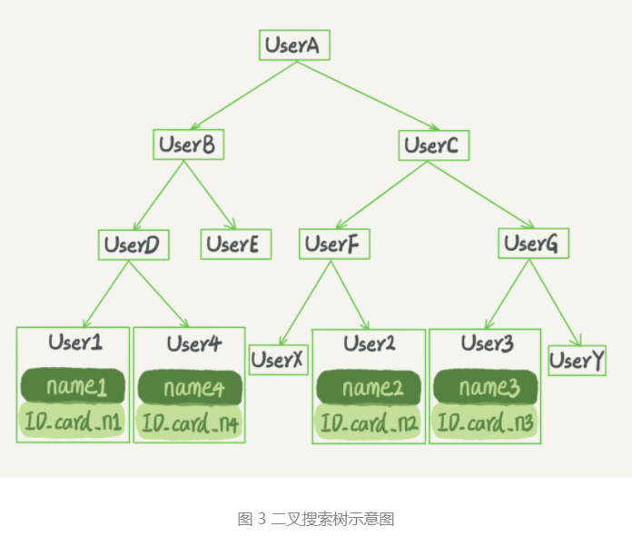

> 学习参考：极客时间---《MySQL实战45讲》

### 深入浅出索引（上）  

---

提到数据库索引，我们并不陌生，在日常工作中会经常接触到。比如某一个 SQL 查询比较慢，分析完原因之后，你可能就会说“给某个字段加个索引吧”之类的解决方案。但到底什么是索引，索引又是如何工作的呢？  

一句话简单来说，**索引的出现其实就是为了提高数据查询的效率，就像书的目录一样**。  一本500页的书，如果你想快速找到其中的某一个知识点，再不借助目录的情况下，那我估计你得找一会。同样对于数据库的表而言，**索引其实就是它的“目录”**。  

#### 索引的常见模型   

 索引的出现是为了提高查询效率，但是实现索引的方式却有很多种，所以这里也就引入了*索引模型*的概念。可以用于提高读写效率的数据结构很多，常见的比较简单的三种，它们分别是哈希表、有序数组、搜索树。  

哈希表是一种以键 - 值（key-value）存储数据的结构，我们只要输入待查找的值即 key，就可以找到其对应的值即 Value。哈希的思路很简单，把值放在数组里，用一个哈希函数把 key 换算成一个确定的位置，然后把 value 放在数组的这个位置。

不可避免地，多个 key 值经过哈希函数的换算，会出现同一个值的情况。处理这种情况的一种方法是，拉出一个链表。

假设，你现在维护着一个身份证信息和姓名的表，需要根据身份证号查找对应的名字，这时对应的哈希索引的示意图如下所示：


​													哈希表示意图

图中，User2 和 User4 根据身份证号算出来的值都是 N，但没关系，后面还跟了一个链表。假设，这时候你要查 ID_card_n2 对应的名字是什么，处理步骤就是：首先，将 ID_card_n2 通过哈希函数算出 N；然后，按顺序遍历，找到 User2。

**需要注意的是，图中四个 ID_card_n 的值并不是递增的，这样做的好处是增加新的 User 时速度会很快，只需要往后追加。但缺点是，因为不是有序的，所以哈希索引做区间查询的速度是很慢的**。

你可以设想下，如果你现在要找身份证号在 [ID_card_X, ID_card_Y] 这个区间的所有用户，就必须全部扫描一遍了。

所以，**哈希表这种结构适用于只有等值查询的场景**，比如 Memcached 及其他一些 NoSQL 引擎。

---

而**有序数组在等值查询和范围查询场景中的性能都非常优秀**。 还是上面的例子：使用有序数组来实现的话，示意图如下所示。  


​																	有序数组书意图

这里假设身份证号没有重复的，这个数组就是按照身份证号递增的顺序保存的。如果要查询 ID_card_n2对应的名字，用**二分法**就可以快速得到，这个时间复杂度是 O(log(N)) 。

同时很显然，这个索引结构支持范围查询。你要查身份证号在 [ID_card_X, ID_card_Y] 区间的 User，可以先用二分法找到 ID_card_X（如果不存在 ID_card_X，就找到大于 ID_card_X 的第一个 User），然后向右遍历，直到查到第一个大于 ID_card_Y 的身份证号，退出循环。  

**如果仅仅看查询效率，有序数组就是最好的数据结构了。但是，在需要更新数据的时候就麻烦了，你往中间插入一个记录就必须得挪动后面所有的记录，成本太高**。

所以，**有序数组索引只适用于静态存储引擎**，比如你要保存的是 2017 年某个城市的所有人口信息，这类不会再修改的数据。  

---

二叉搜索树，还是上面的例子，如果是用这个数据结构来实现的话则是下面这种： 



二叉搜索树的特点是：**每个节点的左儿子小于父节点，父节点又小于右儿子**。这样如果你要查 ID_card_n2 的话，按照图中的搜索顺序就是按照 UserA -> UserC -> UserF -> User2 这个路径得到。这个时间复杂度是 O(log(N))。 此时这里的时间复杂度计算树的高度：h 。O(h) ，假设节点为N, 

```java
N = 2^h - 1;
2^h = n + 1;
h = log2 (n+1)  // 2 为底n+1的对数
```

