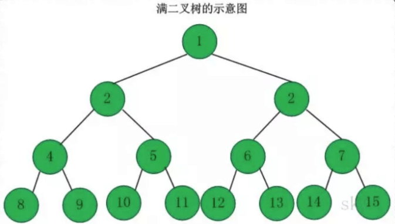
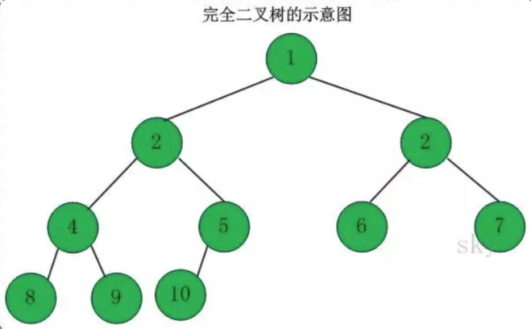
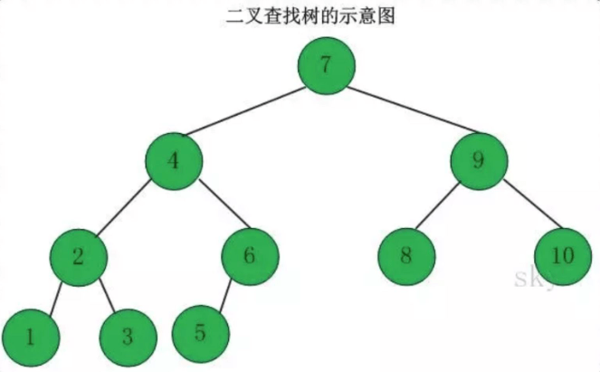
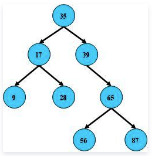
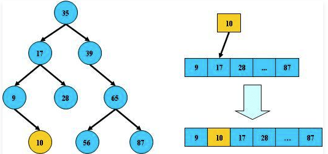
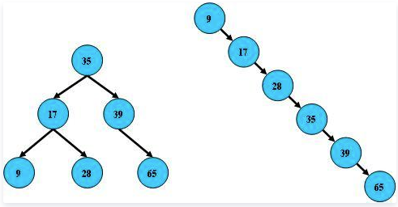
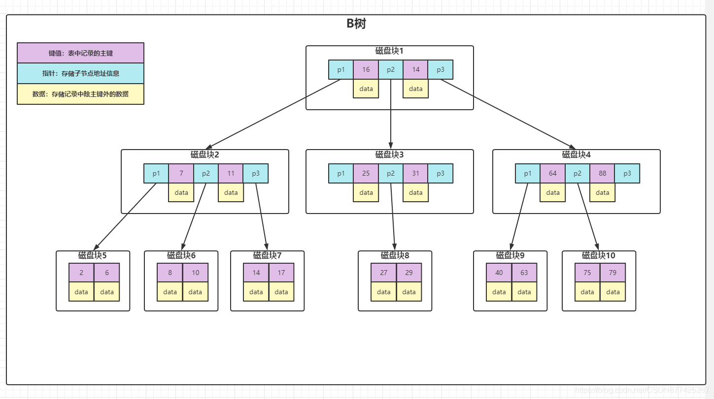
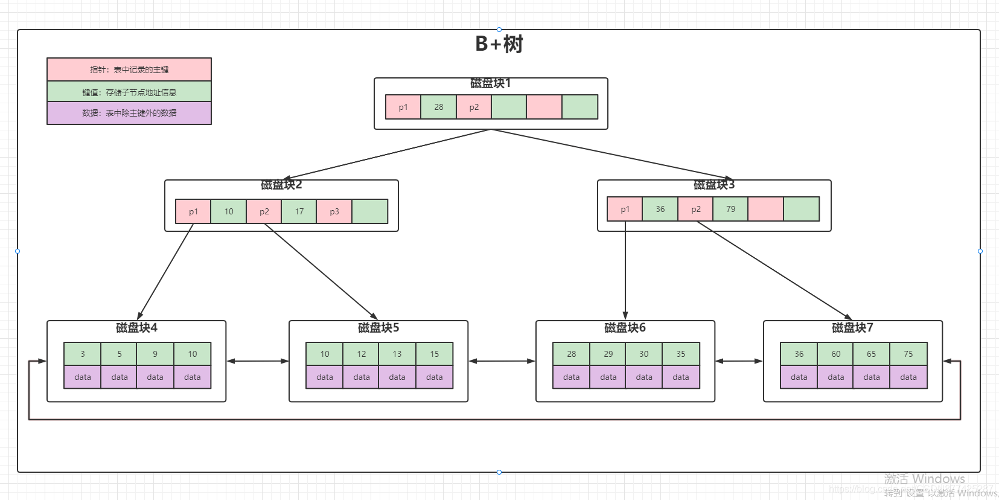
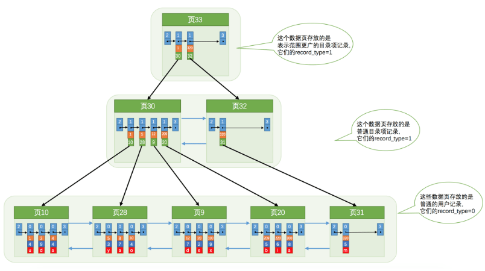

#### 满二叉树

**定义**：高度为h，并且由 2^h –1个结点的二叉树，被称为满二叉树，其实不难看出，满二叉树的结点的度要么为0（叶子结点），要么为2（非叶子结点）

**完全二叉树**

**定义**：对于一个有n个节点的二叉树，按层级顺序编号，则所有节点的编号为从1到n。如果这个树所有节点和同样深度的满二叉树的编号从1到n的节点位置相同，则这个二叉树是完全二叉树。

**特点**：**叶子结点只能出现在最下层和次下层，且最下层的叶子结点集中在树的左部**。显然，一棵满二叉树必定是一棵完全二叉树，而完全二叉树未必是满二叉树。

#### B树（二叉查找树，B-树(缩写)）

B树即 二叉搜索树，[二叉查找树](https://baike.baidu.com/item/二叉查找树/7077965)（Binary Search Tree），（又：二叉搜索树，二叉排序树）它或者是一棵空树，或者是具有下列性质的[二叉树](https://baike.baidu.com/item/二叉树/1602879)： **若它的左子树不空，则左子树上所有结点的值均小于它的[根结点](https://baike.baidu.com/item/根结点/9795570)的值**； **若它的右子树不空，则右子树上所有结点的值均大于它的根结点的值； 它的左、右子树也分别为[二叉排序树](https://baike.baidu.com/item/二叉排序树/10905079)**。

#### 平衡二叉搜索树（AVL树）

平衡二叉搜索树，它能保持二叉树的高度平衡，尽量降低二叉树的高度，减少树的平均查找长度。[平衡二叉搜索树（AVL）详解_芮小谭的博客-CSDN博客_二叉平衡搜索树](https://blog.csdn.net/tanrui519521/article/details/80935348) 

- **左子树与右子树高度之差的绝对值不超过1**
- **树的每个左子树和右子树都是AVL树**
- 每一个节点都有一个平衡因子（balance factor），任一节点的平衡因子是-1、0、1（每一个节点的平衡因子 = 右子树高度 - 左子树高度）

**如果B树的所有非叶子结点的左右子树的结点数目均保持差不多（平衡），那么B树的搜索性能逼近二分查找**；但它比连续内存空间的二分查找的优点是，改变B树结构（插入与删除结点）不需要移动大段的内存数据，甚至通常是常数开销；

正常时候的一棵树

插入数据也是正常的时候

但B树在经过多次插入与删除后，有可能导致不同的结构：有可能退化成为一个链表的形式，所以需要一个平衡。

##### 数据库中的 B树形式（[参考](https://blog.csdn.net/CSDN877425287/article/details/119843058)）

这个其实是一个多叉的二叉搜索树。

实例图说明：
**每个磁盘块，可以理解为存储固定大小的的值，每个节点占用一个磁盘块，一个节点上有两个升序排列的关键字**，和**三个指向子树根节点的指针**，**指针存储的是子节点所在磁盘块的地址，两个关键词划分成三个范围域对应三个指向子树的数据的范围**，以根节点为例，关键字为16和34，p1指针指向子树的数据范围小于16，p2指针指向子树的数据范围为16-34，p3指针指向的子树的数据范围为大于34。

##### 查询过程

1. 根据根节点查找到磁盘块1，读入内存(磁盘IO操作1次)
2. 比较关键字28在区间(14-34)找到磁盘块1的指针p2
3. 根据p2指针找到磁盘块3，读入内存(磁盘IO操作2次)
4. 比较关键字28在区间(27-29)找打磁盘块3的指针p2
5. 根据p2指针找到磁盘块8，读入内存(磁盘IO操作3次)
6. 在磁盘块8中的关键字列表中再到关键字28

##### **B-树的特点**

1. 所有的键值分布在整棵树中
2. 搜索有可能在非叶子节点结束，在关键字全集内做一次查找性能逼近二分查找
3. 每个节点最多拥有m个子树
4. 根节点至少两个子树
5. 分支节点至少拥有m/2棵树(除根节点和叶子节点外都是分支节点)
6. 所有叶子节点都在同一层，每个节点最多可以有m-1个key并且以升序排列

##### **缺点**

1. **每个节点都有key，同时也包含data，而每个页面存储空间是有限的，如果data比较大的话，会导致每个节点存储的key数量边小**。
2. **当存储的数据量很大的时候会导致树的深度较大，增大车讯磁盘IO次数，进而影响查询性能**。

#### B+树

**B+ 树是对 B 树的进一步优化**

1. **B+树每个节点可以相比B树包含更多的节点**，这个作用原因有两个，第一个原因为了降低树的高度，第二个原因是`将数据范围变为多个区间，区间越多，数据检索越快`。
2. **非叶子节点存储key，叶子节点存储key和数据**，**之所以这么做是因为在数据库中页的大小是固定的，InnoDB 中页的默认大小是 16KB。如果不存储数据，那么就会存储更多的键值，相应的树的阶数（节点的子节点树）就会更大，树就会更矮更胖，如此一来我们查找数据进行磁盘的 IO 次数又会再次减少，数据查询的效率也会更快**。另外，**B+ 树的阶数是等于键值的数量的，如果我们的 B+ 树一个节点可以存储 1000 个键值，那么 3 层 B+ 树可以存储 1000×1000×1000=10 亿个数据**。**一般根节点是常驻内存的，所以一般我们查找 10 亿数据，只需要 2 次磁盘 IO**。
3. 叶子节点两两指针相互连接(符合磁盘的预读特性)，数据是按照顺序排列的。顺序查询性能更高

[一文彻底搞懂MySQL基础：B树和B+树的区别](https://blog.csdn.net/a519640026/article/details/106940115)  

#### InnoDB 的 B+ 树

MyISAM 中的 B+ 树索引实现与 InnoDB 中的略有不同。**在 MyISAM 中，B+ 树索引的叶子节点并不存储数据，而是存储数据的文件地址**。

也可以参考一下： https://www.cnblogs.com/tiancai/p/9024351.html 

#### MySQL中B+树被描述为了BTREE

| Table        | Non_unique | Key_name     | Seq_in_index | Column_name | Collation | Cardinality | Sub_part | Packed | Null | Index_type | Comment | Index_comment |      |
| ------------ | ---------- | ------------ | ------------ | ----------- | --------- | ----------- | -------- | ------ | ---- | ---------- | ------- | ------------- | ---- |
| single_table | 0          | PRIMARY      | 1            | id          | A         | 9937        |          |        |      | BTREE      |         |               |      |
| single_table | 0          | idx_key2     | 1            | key2        | A         | 9890        |          |        | YES  | BTREE      |         |               |      |
| single_table | 1          | idx_key1     | 1            | key1        | A         | 9890        |          |        | YES  | BTREE      |         |               |      |
| single_table | 1          | idx_key3     | 1            | key3        | A         | 9890        |          |        | YES  | BTREE      |         |               |      |
| single_table | 1          | idx_key_part | 1            | key_part1   | A         | 9890        |          |        | YES  | BTREE      |         |               |      |
| single_table | 1          | idx_key_part | 2            | key_part2   | A         | 9890        |          |        | YES  | BTREE      |         |               |      |
| single_table | 1          | idx_key_part | 3            | key_part3   | A         | 9890        |          |        | YES  | BTREE      |         |               |      |

具体为什么则是：https://blog.csdn.net/cumt_TTR/article/details/103213302 

> B+TREE would be a very bad keyword, because it contains +, which is usually an operator.
>
> That syntax is older than InnoDB. It is probably as old as the ISAM storage engine, which exists no more. It is very possible that B-TREE was used at that time.

https://dba.stackexchange.com/questions/204561/does-mysql-use-b-tree-btree-or-both 