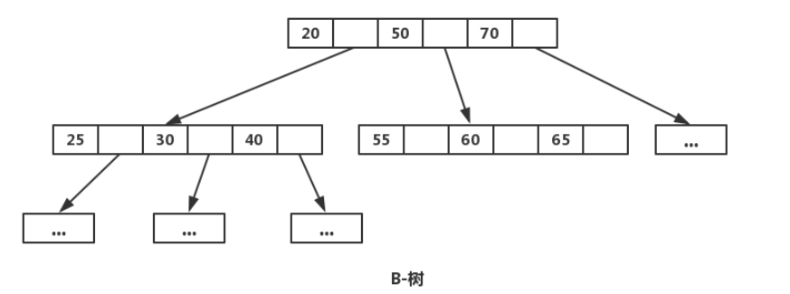
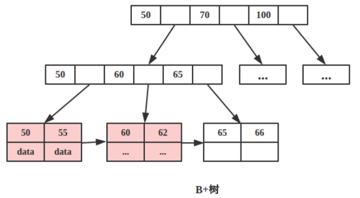

[MySQL 索引底层数据结构是什么](https://mp.weixin.qq.com/s/jEa5mw3Qcmx3S4Ye_j6yuQ)

#### 满二叉树

**定义**：高度为h，并且由 2^h –1个结点的二叉树，被称为满二叉树，其实不难看出，满二叉树的结点的度要么为0（叶子结点），要么为2（非叶子结点）

#### **完全二叉树**

**定义**：对于一个有n个节点的二叉树，按层级顺序编号，则所有节点的编号为从1到n。如果这个树所有节点和同样深度的满二叉树的编号从1到n的节点位置相同，则这个二叉树是完全二叉树。

**特点**：**叶子结点只能出现在最下层和次下层，且最下层的叶子结点集中在树的左部**。显然，一棵满二叉树必定是一棵完全二叉树，而完全二叉树未必是满二叉树。

#### 二叉查找树

[二叉查找树](https://baike.baidu.com/item/二叉查找树/7077965)（Binary Search Tree），（又：二叉搜索树，二叉排序树）它或者是一棵空树，或者是具有下列性质的[二叉树](https://baike.baidu.com/item/二叉树/1602879)： **若它的左子树不空，则左子树上所有结点的值均小于它的[根结点](https://baike.baidu.com/item/根结点/9795570)的值**； **若它的右子树不空，则右子树上所有结点的值均大于它的根结点的值； 它的左、右子树也分别为[二叉排序树](https://baike.baidu.com/item/二叉排序树/10905079)**。

**如果二叉查找树的所有非叶子结点的左右子树的结点数目均保持差不多（平衡），那么二叉查找树的搜索性能逼近二分查找**；但它比连续内存空间的二分查找的优点是，改变B树结构（插入与删除结点）不需要移动大段的内存数据，甚至通常是常数开销；

正常时候的一棵树

插入数据也是正常的时候

但B树在经过多次插入与删除后，有可能导致不同的结构：有可能退化成为一个链表的形式，所以需要一个平衡。

#### 平衡二叉搜索树（AVL树）

平衡二叉搜索树，它能保持二叉树的高度平衡，尽量降低二叉树的高度，减少树的平均查找长度。[平衡二叉搜索树（AVL）详解_芮小谭的博客-CSDN博客_二叉平衡搜索树](https://blog.csdn.net/tanrui519521/article/details/80935348) 

特点：

- **左子树与右子树高度之差的绝对值不超过1**
- **树的每个左子树和右子树都是AVL树**
- 每一个节点都有一个平衡因子（balance factor），任一节点的平衡因子是-1、0、1（每一个节点的平衡因子 = 右子树高度 - 左子树高度）

#### [一文彻底搞懂MySQL基础：B树和B+树的区别](https://blog.csdn.net/a519640026/article/details/106940115)  

#### B树

百度百科：

> **B树**（英语：B-tree）是一种自平衡的[树](https://baike.baidu.com/item/树)，能够保持数据有序。这种数据结构能够让查找数据、顺序访问、插入数据及删除的动作，都在对数时间内完成。**B树，概括来说是一个一般化的[二叉查找树](https://baike.baidu.com/item/二叉查找树)（binary search tree），可以拥有多于2个子节点**。与自平衡二叉查找树不同，B树为系统大块数据的读写操作做了优化。B树减少定位记录时所经历的中间过程，从而加快[存取速度](https://baike.baidu.com/item/存取速度/12720755)。B树这种数据结构可以用来描述外部存储。这种数据结构常被应用在[数据库](https://baike.baidu.com/item/数据库)和[文件系统](https://baike.baidu.com/item/文件系统)的实现上。

**B-树允许每个节点有更多的子节点即可（多叉树）**。子节点数量一般在上千，具体数量依赖外部存储器的特性。

##### **特点**

1. 所有的键值分布在整棵树中（索引值和具体的data在每个节点里面）。
2. 搜索有可能在非叶子节点结束，在关键字全集内做一次查找性能逼近二分查找。
3. **每个节点最多拥有m个子树**。
4. **根节点至少两个子树**。
5. 分支节点至少拥有m/2棵树(除根节点和叶子节点外都是分支节点)。
6. 所有叶子节点都在同一层，每个节点最多可以有m-1个key并且以升序排列。

##### **缺点**

1. **每个节点都有key，同时也包含data，而每个页面存储空间是有限的，如果data比较大的话，会导致每个节点存储的key数量边小**。
2. **当存储的数据量很大的时候会导致树的深度较大，增大查询磁盘IO次数，进而影响查询性能**。

##### “迎合”磁盘的角度看B-树的设计。

**索引的效率依赖与磁盘 IO 的次数，快速索引需要有效的减少磁盘 IO 次数**，如何快速索引呢？索引的原理其实是不断的缩小查找范围，就如我们平时用字典查单词一样，先找首字母缩小范围，再第二个字母等等。**平衡二叉树是每次将范围分割为两个区间**。为了更快，**B-树每次将范围分割为多个区间，区间越多，定位数据越快越精确**。**那么如果节点为区间范围，每个节点就较大了**。所以新建节点时，直接申请页大小的空间（磁盘存储单位是按 block 分的，一般为 512 Byte。**磁盘 IO 一次读取若干个 block，我们称为一页，具体大小和操作系统有关，一般为 4 k，8 k或 16 k**），**计算机内存分配是按页对齐的，这样就实现了一个节点只需要一次 IO**。

上图是一棵简化的B-树，**多叉的好处非常明显，有效的降低了B-树的高度，为底数很大的 log n，底数大小与节点的子节点数目有关，一般一棵B-树的高度在 3 层左右**。层数低，每个节点区确定的范围更精确，范围缩小的速度越快（比二叉树深层次的搜索肯定快很多）。上面说了一个节点需要进行一次 IO，那么总 IO 的次数就缩减为了 log n 次。B-树的每个节点是 n 个有序的序列(a1,a2,a3…an)，并将该节点的子节点分割成 n+1 个区间来进行索引(X1< a1, a2 < X2 < a3, … , an+1 < Xn < anXn+1 > an)。

> B树的每个节点，都是存多个值的，不像二叉树那样，一个节点就一个值，B树把每个节点都给了一点的范围区间，区间更多的情况下，搜索也就更快了，比如：有1-100个数，二叉树一次只能分两个范围，0-50和51-100，而B树，分成4个范围 1-25， 25-50，51-75，76-100一次就能筛选走四分之三的数据。所以作为多叉树的B树是更快的

##### B-树的查找

假设每个节点有 n 个 key值，被分割为 n+1 个区间，注意，每个 key 值紧跟着 data 域，这说明B-树的 key 和 data 是聚合在一起的。一般而言，根节点都在内存中，B-树以每个节点为一次磁盘 IO，比如上图中，若搜索 key 为 25 节点的 data，首先在根节点进行二分查找（因为 keys 有序，二分最快），判断 key 25 小于 key 50，所以定位到最左侧的节点，此时进行一次磁盘 IO，将该节点从磁盘读入内存，接着继续进行上述过程，直到找到该 key 为止。

##### 数据库中的 B树形式（[参考](https://blog.csdn.net/CSDN877425287/article/details/119843058)）

这个其实是**一个多叉的二叉搜索树**。

实例图说明：
**每个磁盘块，可以理解为存储固定大小的的值，每个节点占用一个磁盘块，一个节点上有两个升序排列的关键字**，和**三个指向子树根节点的指针**，**指针存储的是子节点所在磁盘块的地址，两个关键词划分成三个范围域对应三个指向子树的数据的范围**，以根节点为例，关键字为16和34，p1指针指向子树的数据范围小于16，p2指针指向子树的数据范围为16-34，p3指针指向的子树的数据范围为大于34。

##### 查询过程

1. 根据根节点查找到磁盘块1，读入内存(磁盘IO操作1次)
2. 比较关键字28在区间(14-34)找到磁盘块1的指针p2
3. 根据p2指针找到磁盘块3，读入内存(磁盘IO操作2次)
4. 比较关键字28在区间(27-29)找打磁盘块3的指针p2
5. 根据p2指针找到磁盘块8，读入内存(磁盘IO操作3次)
6. 在磁盘块8中的关键字列表中再到关键字28

#### B+树

**B+ 树是对 B 树的进一步优化**

1. **B+树每个节点可以相比B树包含更多的节点**，这个作用原因有两个，第一个原因为了降低树的高度，第二个原因是`将数据范围变为多个区间，区间越多，数据检索越快`。
2. **非叶子节点存储key，叶子节点存储key和数据**，**之所以这么做是因为在数据库中页的大小是固定的，InnoDB 中页的默认大小是 16KB。如果不存储数据，那么就会存储更多的键值，相应的树的阶数（节点的子节点树）就会更大，树就会更矮更胖，如此一来我们查找数据进行磁盘的 IO 次数又会再次减少，数据查询的效率也会更快**。另外，**B+ 树的阶数是等于键值的数量的，如果我们的 B+ 树一个节点可以存储 1000 个键值，那么 3 层 B+ 树可以存储 1000×1000×1000=10 亿个数据**。**一般根节点是常驻内存的，所以一般我们查找 10 亿数据，只需要 2 次磁盘 IO**。
3. **叶子节点两两指针相互连接(符合磁盘的预读特性)，数据是按照顺序排列的**。顺序查询性能更高。

#### B-树和B+树的区别

（1）**B+树内节点不存储数据，所有 data 存储在叶节点导致查询时间复杂度固定为 log n。而B-树查询时间复杂度不固定，与 key 在树中的位置有关，最好为O(1)**。

（2）**B+树叶节点两两相连可大大增加区间访问性，可使用在范围查询等，而B-树每个节点 key 和 data 在一起，则无法区间查找**。

根据空间局部性原理：如果一个存储器的某个位置被访问，那么将它附近的位置也会被访问。

B+树可以很好的利用局部性原理，若我们访问节点 key为 50，则 key 为 55、60、62 的节点将来也可能被访问，我们可以利用磁盘预读原理提前将这些数据读入内存，减少了磁盘 IO 的次数。
当然B+树也能够很好的完成范围查询。比如查询 key 值在 50-70 之间的节点。

> 由于B+树的叶子节点的数据都是使用链表连接起来的，而且他们在磁盘里是顺序存储的，所以当读到某个值的时候，磁盘预读原理就会提前把这些数据都读进内存，使得范围查询和排序都很快

（3）**B+树更适合外部存储。由于内节点无 data 域，每个节点能索引的范围更大更精确**.

#### InnoDB 的 B+ 树

MyISAM 中的 B+ 树索引实现与 InnoDB 中的略有不同。**在 MyISAM 中，B+ 树索引的叶子节点并不存储数据，而是存储数据的文件地址**。

也可以参考一下： https://www.cnblogs.com/tiancai/p/9024351.html 

#### MySQL中B+树被描述为了BTREE

| Table        | Non_unique | Key_name     | Seq_in_index | Column_name | Collation | Cardinality | Sub_part | Packed | Null | Index_type | Comment | Index_comment |      |
| ------------ | ---------- | ------------ | ------------ | ----------- | --------- | ----------- | -------- | ------ | ---- | ---------- | ------- | ------------- | ---- |
| single_table | 0          | PRIMARY      | 1            | id          | A         | 9937        |          |        |      | BTREE      |         |               |      |
| single_table | 0          | idx_key2     | 1            | key2        | A         | 9890        |          |        | YES  | BTREE      |         |               |      |
| single_table | 1          | idx_key1     | 1            | key1        | A         | 9890        |          |        | YES  | BTREE      |         |               |      |
| single_table | 1          | idx_key3     | 1            | key3        | A         | 9890        |          |        | YES  | BTREE      |         |               |      |
| single_table | 1          | idx_key_part | 1            | key_part1   | A         | 9890        |          |        | YES  | BTREE      |         |               |      |
| single_table | 1          | idx_key_part | 2            | key_part2   | A         | 9890        |          |        | YES  | BTREE      |         |               |      |
| single_table | 1          | idx_key_part | 3            | key_part3   | A         | 9890        |          |        | YES  | BTREE      |         |               |      |

具体为什么则是：https://blog.csdn.net/cumt_TTR/article/details/103213302 

> B+TREE would be a very bad keyword, because it contains +, which is usually an operator.
>
> That syntax is older than InnoDB. It is probably as old as the ISAM storage engine, which exists no more. It is very possible that B-TREE was used at that time.

https://dba.stackexchange.com/questions/204561/does-mysql-use-b-tree-btree-or-both 