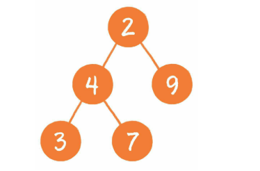
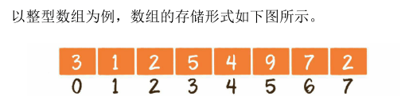
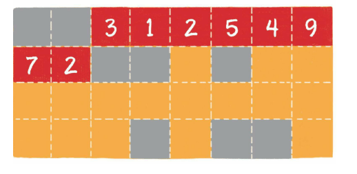
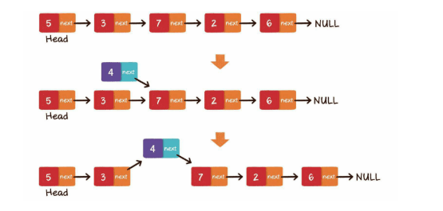
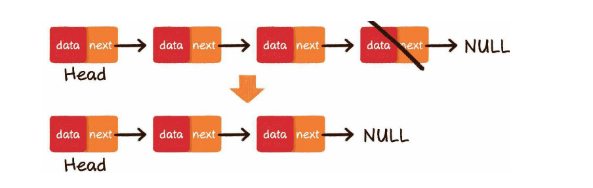
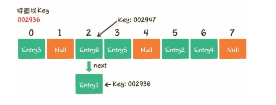
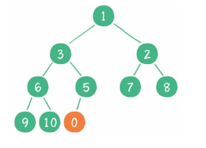
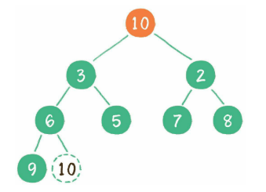
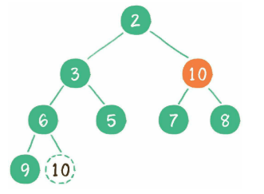
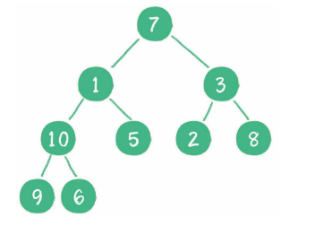

### 算法与数据结构

学习《漫画算法：小灰的算法之旅》

---

### 1 算法概述

#### 算法与数据结构  

##### 什么是算法？  

算法，对应的英文单词是algorithm，来自于数学领域。算法有简单的，也有复杂的；有高效的，也有拙劣的。  

**衡量算法好坏的重要标准有两个**。   

- **时间复杂度**
- **空间复杂度**

算法应用在多个领域。

1. 运算

   例如求出两个数的最大公约数，要做到效率的极致，的确需要动一番脑筋。再如计算两个超大整数的和，按照正常方式来计算肯定会导致变量溢出。这又该如何求解呢？  

2. 查找

   在数据中执行某一条SQL语句时，有思考过数据和信息时如何被查出来的呢？  

3. 排序

   排序算法是实现许多复杂程序的基石。  

4. 最优决策

   找到迷宫的最佳路线。  

---

##### 什么是数据结构？  

数据结构是算法的基石。对应的英文单词是 data structure，是数据的组织、管理和存储格式，其使用目的是为了高效地访问和修改数据。  

数据结构的组成方式。  

- **线性结构**  

线性结构是最简单的数据结构，包括数组、链表，以及由它们衍生出来的栈、队列、哈希表等。  


- **树**  

树是相对复杂的数据结构，其中比较有代表性的是二叉树，由它又衍生除了**二叉堆**之类的数据结构。  



- **图**

图是更为复杂的数据结构，因为在途中会呈现出多对多的关联关系。  


- **其他数据结构**  

除上述所列的几种基本数据结构以外，还有一些其他的千奇百怪的数据结构。它们由基本数据结构变形而来，用于解决某些特定问题，如 跳表、哈希链表、位图等。  

---

#### 时间复杂度  

一个例子

> 小灰和大黄同时加入了同一家公司，分别布置一个需求，用代码实现。在小灰和大黄各自交付了各自的代码，两人的代码实现功能差不多。  
>
> 大黄的代码运行一次要花100ms，占用内存5MB。 
>
> 小灰的代码运行一次要花100s，占用内存500MB。
>
> 于是……
>
> 小灰被让收拾东西走人...

虽然两人都实现了功能，但是小灰的代码存在两个很严重的问题。

1. **运行时间长**  
2. **占用空间大**  

由此可见，运行时间的长短和占用内存空间的大小，是衡量程序好坏的重要因素。  

**代码的绝对执行时间是无法预估的。但是我们却可以预估代码的基本执行次数**。  如以下场景：   

**场景1**：给小灰1个长度为10cm的面包，小灰每3分钟吃掉1cm，那么 吃掉整个面包需要多久？  

**答案**：3*10=30分钟  

如果面包的长度是n cm呢？此时吃掉整个面包，需要 3*n=3n 分钟。如果用一个函数来表达吃掉整个面包所需的时间，可以记作`T(n)=3n`，n为面包的长度。    

**场景2**：给小灰1个长度为16cm的面包，小灰每5分钟吃掉面包剩余长度的一半，即第5分钟吃掉8cm，第10分钟吃掉4cm，第15分钟吃掉 2cm……那么小灰把面包吃得只剩1cm，需要多久呢？   

**答案**：这个问题用数学方式表达就是，数字16不断地除以2，那么除几次以后的结果等于1？这里涉及数学中的对数，即以2为底16的对数 `log2 16`。（注：本书下文中对数函数的底数全部省略。）

因此，把面包吃得只剩下`1cm`，需要`5*log16=20`分钟。

如果面包的长度是n cm呢？此时需要 `5*log n`分钟，记作`T(n)=5logn`。 

**场景3**：给小灰1个长度为10cm的面包和1个鸡腿，小灰每2分钟吃 掉1个鸡腿。那么小灰吃掉整个鸡腿需要多久呢？

**答案**：2分钟。因为这里只要求吃掉鸡腿，和10cm的面包没有关系。无论面包多长，吃掉鸡腿的时间都是2分钟，记作`T(n)=2`。  

**场景4**：给小灰1个长度为10cm的面包，小灰吃掉第1个1cm需要1分钟时间，吃掉第2个1cm需要2分钟时间，吃掉第3个1cm需要3分钟时 间……每吃1cm所花的时间就比吃上一个1cm多用1分钟。那么小灰吃掉 整个面包需要多久呢？
**答案**：是从1累加到10的总和，也就是55分钟。 如果面包的长度是n cm呢？ 

根据高斯算法，此时吃掉整个面包需要` 1+2+3+…+(n-1)+ n `即 `(1+n)×n/2`分钟，也就是`0.5n^2 + 0.5n`分钟，记作`T(n) = 0.5n^2 + 0.5n`。

**设T(n)为程序基本操作执行次数的函数（也可以认为是程序的相对执行时间函数），n为输入规模**，刚才的4个场景分别对应了程序中最常见的4种执行方式。

场景1：`T(n)=3n`

```java
void eat1(int n) {
    System.out.println("等待1分钟");
    System.out.println("等待1分钟");
    System.out.println("吃1cm 面包");
}
```

场景2：`T(n)=5logn`

```java
void eat2(int n) {
    for(int i = n; i > 1; i = i/2){
    System.out.println("等待1分钟");
    System.out.println("等待1分钟");
    System.out.println("等待1分钟");
    System.out.println("等待1分钟");
    System.out.println("吃一半面包");
   }
}
```

场景3：`T(n)=2`

```java
void eat2(int n) {
    System.out.println("等待1分钟");
    System.out.println("吃一个鸡腿");
}
```

场景4：`T(n) = 0.5n^2 + 0.5n`

```java
void eat2(int n) {
    for(int i = 0; i < n; i++){
        for(int j = 0; j < i; i = j++){
             System.out.println("等待1分钟");
        }
        System.out.println("吃1cm面包");
    }
}
```

##### 渐进时间复杂度  

有了**基本操作执行次数的函数  T(n)**，是否就可以分析和比较代码的运行时间了呢？还是有一定困难的。

为了解决时间分析的难题，有了**渐进时间复杂度**（asymptotic time complexity）的概念，官方定义如下：

**若存在函数f(n)，使得当n趋近于无穷大时，T(n)/f(n)的极限值为不等于零的常数，则称f(n)是T(n)的同数量级函数。记作 T(n)=O(f(n))，称为O(f(n))，O为算法的渐进时间复杂度，简称为时间复杂度。**也称作大O表示法。  

直白地讲，时间复杂度就是把程序的相对执行时间函数 T(n) 简化为一个数量级，整个数量级可以是n、n^2、n^3等。  

**如何推导出时间复杂度呢**？有如下几个原则。

- **如果运行时间是常数量级，则用常数1表示** 

- **只保留时间函数中的最高阶项** 

- **如果最高阶项存在，则省去最高阶项前面的系数**

再看上面四个场景。 

场景1：`T(n)=3n`，最高阶项为3n，省去系数3，则转化的时间复杂度为：`T(n)=O(n)`;

场景2：`T(n) = 5logn`，最高阶项为5logn，省去系数5，则转化的时间复杂度为：`T(n) =O(logn)`。

场景3：`T(n) = 2`，只有常数量级，则转化的是按复杂度为：`T(n) =O(1)`。  

场景4：`T(n) = 0.5n2+ 0.5n`，最高阶项为0.5n2，省去系数0.5，则转化的时间复杂度为：`T(n)
=O(n2)`。

当n的取值足够大时，有以下结论。

> O(1)<O(log n)<O(n)<O(n^2)


##### 时间复杂度的巨大差异  

有如下例子：

算法A的执行次数是T(n)= 100n，时间复杂度是O(n)。   

算法B的执行次数是T(n)= 5n^2，时间复杂度是O(n^2)。  

算法A运行在小灰家里的老旧电脑上，算法B运行在某台超级计算机上，超级计算机的运行速度是老旧电脑的100倍。随着输入规模的增长，两种算法谁运行速度更快呢？  


从上面的表格可以看出，当n的值很小时，算法A的运行用时要远大于算法B；当n的值在1000左右时，算法A和算法B的运行时间已经比 较接近；随着n的值越来越大，甚至达到十万、百万时，算法A的优势 开始显现出来，算法B的运行速度则越来越慢，差距越来越明显。   

---

#### 空间复杂度   

**简单来说，时间复杂度时执行算法时间的时间成本，空间复杂度时执行算法的空间成本**。在运行一段程序时，我们不仅要执行各种运算指令，同时也会根据需要，存储一些临时的中间数据，以便后续的指令可以更方便地执行。  

  如以下例子：

```java
3 1 2 5 4 9 7 2
```

**找出这些数字中两个重复的整数**。  最朴素的方法就是双重循环。遍历整个数列，每遍历到一个新的整数就开始回顾之前遍历过的所有整数，再看看这些整数里有没有与之数值相同的。  

第1步，遍历整数3，前面没有数字，所以无须回顾比较。 

第2步，遍历整数1，回顾前面的数字3，没有发现重复数字。 

第3步，遍历整数2，回顾前面的数字3、1，没有发现重复数字。

....  

后续步骤类似，一直遍历到最后的整数2，发现和前面的整数2重复.   

基本的执行次数为 T(n) = n * n ，O(f(n)) = n^2，这个算法的时间复杂度为：O(n^2)。  

如何提高这个算法的效率呢？当遍历整个数列的时候，每遍历一个整数，就把该整数存储起来，就像放到字典中一样。当遍历下一个整数时，不必再慢慢向前回溯比较，而直接去“字典”中查找，看看有没有对应的整数即可。  


由于读写“字典”本身的时间复杂度是O(1)，所以整个算法的时间复杂度是O(n)，和最初的双重循环相比，运行效率大大提高了。**而这个所谓的“字典”，是一种特殊的数据结构，叫作散列表**。这个数据结构需要开辟一定的内存空间来存储有用的数据信息。

空间复杂度是对一个算法在运行过程中临时占用存储空间大小的量度，它同样使用大O表示法。计算公式记作`S(n)=O(f(n))`,其中n为问题的规模，f(n)为算法所占存储空间的函数.

**空间复杂度计算**   

1. **常量空间**

   当算法的存储空间大小固定，和输入规模没有直接的关系时，空间复杂度记作O(1),例如：

   ```java
   void fun1(int n) {
       int a = 3;
       ....
   }
   ```

2. **线性空间**  

   当算法分配的空间是一个线性的集合（如数组），并且集合大小和输入规模n成正比时，空间复杂度记作O(n)。

   ```java
   void fun2(int n) {
       int[] array = new int[n];
   }
   ```

3. **二维空间**  

   当算法分配的空间是一个二维数组集合，并且集合的长度和宽度都 与输入规模n成正比时，空间复杂度记作O(n2)。

   ```java
   void fun3(int n) {
       int[][] matrix = new int[n][n];
   }
   ```

4. **递归空间**

   **执行递归操作所需要的内存空间和递归的深度成正比**。纯粹的递归操作的空间复杂度也是线性的，如果递归的深度是n，那么空间复杂度就是O(n)。  

   ```java
   void fun4(int n) {
       if(n < 1) {
           return;
       }
       fun4(n-1);
   }
   ```

#### 时间与空间的取舍 

在寻找重复整数的例子中，双重循环的时间复杂度是O(n^2)，空间复杂度是O(1)，这属于牺牲时间来换取空间的情况。 

相反，字典法的空间复杂度是O(n)，时间复杂度是O(n)，这属于牺牲空间来换取时间的情况。

### 2 数据结构基础  

#### 数组（顺序存储）  

数组对应的英文是array，是有限个相同类型的变量所组成的有序集合，数组中的每一个变量被称为元素。数组是最为简单、最为常用的数据结构。



- 数组的下标从0开始，一直到数组长度-1 
- 数组在内存中顺序存储，因此可以很好地实现逻辑上的顺序表

**内存是由一个个连续的内存单元组成的，每一个内存单元都有自己的地址。在这些内存单元中，有些被其他数据占用了，有些是空闲的**。  

数组中的每一个元素，都存储在小小的内存单元中，并且元素之间紧密排列，既不能打乱元素的存储顺序，也不能跳过某个存储单元进行存储。



橙色格子代表空闲的存储单元，灰色的格子代表已占用的存储单元，而红色的连续的则是数组在内存中的位置。  

##### 数组基本操作 

**读取元素和更新元素的时间复杂度都是O(1).**

插入元素：

- 尾部插入
- 中间插入
- 超范围插入

中间插入数据的时候，要将插入位置及后面的元素向后移动，腾出地方，再把要插入的元素放到对应的数组位置上。 


##### 扩容

插入的时候要注意是不是超过了数组的大小，超过大小的话，则要进行扩容处理，将数组扩容为原来的2倍。

```java
int arrayNew = new int[array.length * 2];
/*
*    * @param      src      the source array.
     * @param      srcPos   starting position in the source array.
     * @param      dest     the destination array.
     * @param      destPos  starting position in the destination data.
     * @param      length   the number of array elements to be copied.
     public static native void arraycopy(Object src,  int  srcPos,
                                        Object dest, int destPos,
                                        int length);
*/
// 从旧数组复制到新数组
System.arraycopy(array, 0, arrayNew, 0, array.length);
array = arrayNew;
```

删除元素：删除元素和插入操作的过程相反，如果删除的元素位于数组的中间，其后的元素都需要向前挪动1位。

数组扩容的时间复杂度是O(n)，插入并移动元素的时间复杂度也是O(n)，综合起来操作的时间复杂度是O(n)。删除操作，只涉及到元素的移动，时间复杂度也是O(n)。

**删除的小技巧：**

小技巧的前提是：数组元素没有顺序的要求。  


##### 数组的优势和劣势  

优势：

- 高效的随机访问能力

劣势：

- 插入和删除元素，会导致大量元素被迫移动，影响效率。

总的来说，数组适合的是**读操作多、写操作少**的场景。  

#### 链表  

链表（Linked List）是一种在物理上非连续、非顺序的数据结构，由若干个（node）所组成。  

##### 单向链表  

单向链表的结构


单向链表的每一个节点又包含两个部分，一部分是存放数据的变量 data，另一部分是指向下一个节点的指针 next。  

```java
private static class Node {
	int data;
    Node next;
}
```

**链表的第1个节点被称为头节点，最后一个节点被称为尾节点，尾节点的next指针指向空。**  

与数组按照下标来随机寻找元素不同，对于链表的其中一个节点A，我们只能根据节点A的next指针来找到该节点的下一个节点B，再根据节点B的next指针找到下一个节点C。。。层层递进。  

如何找到前一个节点呢？这个时候使用“双向链表”。  

##### 双向链表   

双向链表的结构


双向链表的每一个节点还拥有前置节点的prev指针。

```java
private static class Node {
	int data;
    Node next;
}
```

##### 链表的存储方式 (随机存储) 

而链表则采用了见缝插针的方式，链表的每一个节点 分布在内存的不同位置，依靠next指针关联起来。这样可以灵活有效地 利用零散的碎片空间。如图：


##### 链表的基本操作  

- **查找节点**

链表只能从头节点开始向后一个一个节点逐一查找。例如，给出一个链表，需要查找从头节点开始的第3个节点。

1. 将查找的指针定位到头节点
2. 根据指针的头节点的next指针，定位到第2个节点
3. 根据第2个节点的next指针，定位到第3个节点，查找完毕

**查找链表节点的时间复杂度为：O(n)**； 

- **更新节点**

直接把旧数据替换成新数据即可。

- **插入节点**
  - 尾部插入
  - 头部插入
  - 中间插入

**尾部插入**：是最简单的情况，把最后一个节点的next指针指向新插入的节点即可，新插入的节点的next指针为空。  


**头部插入**：（1）把新节点的next指针指向原先的头节点。（2）把新节点变为链表的头节点。  


**中间插入**：（1）新节点的next指针，指向插入位置的节点。（2）插入位置前置节点的next指针，指向新节点。  



- 删除元素

**尾部删除**：最简单的情况，把倒数第2个节点的next指针指向空即可。  



**头部删除**：也很简单，把链表的头节点设为原先节点的next指针。  


**中间删除**：把要删除的节点的前置节点的next指针，指向要删除元素的下一个节点即可。   


插入和删除操作的时间复杂度都是O(1)，不考虑查找节点的操作的前提下。

```java
/**
 * @program: dataStructure->MyLinkedList
 * @description: 链表的操作
 * @author: lanwenquan
 * @date: 2021-05-31 21:41
 */
public class MyLinkedList {

    /**
     * 头节点
     */
    private Node head;
    private Node last;
    private int size;

    /**
     * 插入节点
     */
    public void insertNode(int data, int index) {
        if (index < 0 || index > size) {
            throw new IndexOutOfBoundsException("超出链表节点范围！！！");
        }
        Node insertNode = new Node(data);
        if (size == 0) {
            // 空链表
            head = insertNode;
            last = insertNode;
        } else if (index == 0) {
            // 头插法
            insertNode.next = head;
            head = insertNode;
        } else if (index == size) {
            // 尾插法
            last.next = insertNode;
            last = insertNode;
        } else {
            // 中间插入
            Node prevNode = getNode(index);
            insertNode.next = prevNode.next;
            prevNode.next = insertNode;
        }
        size++;
    }

    /**
     * 查找节点
     */
    public Node getNode(int index) {
        if (index < 0 || index >= size) {
            throw new IndexOutOfBoundsException("超出链表节点范围！！！");
        }
        Node temp = head;
        for (int i = 0; i < index; i++) {
            temp = temp.next;
        }
        return temp;
    }

    /**
     * 删除节点
     */
    public Node remove(int index) {
        if (index < 0 || index >= size) {
            throw new IndexOutOfBoundsException("超出链表节点范围！！！");
        }
        Node removeNode = null;
        if (index == 0) {
            // 删除头节点
            head = head.next;
            removeNode = head;
        } else if (index == size - 1) {
            // 删除尾节点
            Node prevNode = getNode(index - 1);
            removeNode = prevNode.next;
            prevNode.next = null;
            last = prevNode;
        } else {
            // 删除中间节点
            Node prevNode = getNode(index - 1);
            Node nextNode = prevNode.next;
            removeNode = prevNode.next;
            prevNode.next = nextNode.next;
        }
        size--;
        return removeNode;
    }

    public void output() {
        Node temp = head;
        while (temp != null) {
            System.out.println(temp.data);
            temp = temp.next;
        }
    }

    /**
     * 节点
     */
    public static class Node {
        // 下一个节点
        private Node next;
        // 数据
        int data;

        public Node(int data) {
            this.data = data;
        }
    }

    public static void main(String[] args) {
        MyLinkedList myLinkedList = new MyLinkedList();
        myLinkedList.insertNode(3, 0);
        myLinkedList.insertNode(7, 1);
        myLinkedList.insertNode(9, 2);
        myLinkedList.insertNode(5, 3);
        myLinkedList.insertNode(6, 4);
        myLinkedList.insertNode(8, 5);
        myLinkedList.remove(2);
        myLinkedList.output();
    }
}
```

**数组和链表的性能对比**：


#### 栈和队列  

#### 散列表  

散列表也叫做哈希表（hash table），这种数据结构提供了键（key）和值（value）的映射关系。只要给出一个key，就可以高效查找到它锁匹配的value，时间复杂度接近于O(1)。  


那么key是如何找到对应的value值的呢？这就要介绍散列表的基本原理了。  

##### 哈希函数    

散列表在本质上也是一个数组。可是数组只能根据下表，像a[0]、a[1]、a[2]等这样进行访问，而散列表的key则是以字符串类型为主的。要实现存储字符串等类型，我们需要一个“中转站”，**通过某种方式，把key和数组下表进行转换**。 这个中转站就叫做哈希函数。（转换成类似于数组的下标）   


如上图，存入“key3”通过哈希函数的转换，存入的位置是 2 这个位置，value则不用转换。然后获取 key3的时候再通过哈希函数转换去获取位置2的value值。  

但是这个哈希函数是怎么实现的呢？不同的语言中，哈希函数的实现方式是不一样的。Java中的实现如下：  

  Java中，每一个对象都有属于自己的hashcode值，这个hashcode是区分不同对象的重要标识。无论对象自身的类型是什么，他们的hashcode都是一个整型变量。既然是整型变量，想要转换成数组的下标便不是很难实现了。最简单的转化方式是什么呢？**是按照数组长度进行取模运算（转换成下标）**。  

> index = HashCode(Key) % Array.length

但是Java中的哈希函数并没有采用取模的运算，而是利用了位运算的方式来优化性能。  

通过哈希函数，我们可以把字符串或其他类型的Key，转化成数组的下标 index，然后进行操作。例如，当数组的长度为8时：

```java
当key ="001121"时
 index = HashCode("001121") % Array.length = 1420036703 % 8 = 7；
而当key = "this" 时
 index = HashCode("this") % Array.length = 3559070 % 8 = 6；
```

---

##### 散列表的读写操作   

- **写操作**

put(key, value) 插入新的键值对。如hashMap.put("002931", "王五")，操作步骤如下：

1，根据哈希函数，计算出002931对应的下标。2，如果数组下标的位置没有元素，就把这个entry填充到下标为5的位置。  

但是，数组的长度是有限的，当插入的 Entry 越来越多时，不同的 key 通过哈希函数计算出的下标值有可能是相同的。例如“002936”这个key对应的下标是2，“002947”这个key对应的下标也是2，这种情况就叫做哈希冲突。  


哈希冲突是无法避免的。解决哈希冲突的方法主要有两种，一种是**链表法**，另一种是**开放寻址法**。

- 开放寻址法 

当一个key通过哈希函数获得对应的数组下标已经被占用时，寻找下一个空档位置。  

例如：当上面的entry6通过哈希函数获得下标为2，但是下标2已经被占用了，那么向后移动一位，发现下标3也被占用了，再向后移动1位，下标4没有被占用，就可以放到这个位置了。（这是简单的举例，通过向后移动一位来找空的地址）。  ThreadLocal使用的就是开放寻址法。  

- 链表法 

当 entry6已经有，但是新的key计算出的下标也是2时，hashmap数组的每一个元素不仅是一个Entry对象，还是一个链表的头结点。冲突时，将冲突的 Entry 插入到entry6的链表中。（**实际上是一个节点数组 `Node<k,v>[] table`**）  


- **读操作**  

get(key)。  例如hashMap.get("002936")，意思是查找Key为002936的Entry在散列表中所对应的值，链表法的步骤如下：  

1，通过哈希函数，将key转换成数组下标2。2，找到数组下标2对应的元素，如果这个key是“002936”，那么就找到了；如果这个key不是“002936”，由于数组的每个元素都与一个链表对应，可以顺着链表慢慢往下找，看看能否找到与key相匹配的节点。  



在上图中，首先查到的节点Entry6的Key是002947，和待查找的Key002936不符。接着定位到链表下一个节点Entry1，发现Entry1的Key 002936正是我们要寻找的，所以返回Entry1的Value即可。

### 3 树和二叉树    

定义：树（Tree）是n（n>=）个节点的有限集。当n=0时，称为空树。在任意一个非空树，有如下特点。  

**1：有且仅有一个特定的称为跟的节点。**

**2：当n>1时，其余节点可分为m（m>0）个互不相交的有限集，每一个集合本身又是一个树，并称为跟的子树。**  

如下图，一个标准的树结构。根节点，叶子节点（没有孩子）。  


节点4的上一级节点2，是节点4的父节点；从节点4衍生出来的节点，是节点4的孩子结点；和节点4同级，由同一个父节点衍生出来的节点，是节点4的兄弟节点。树的最大层数，被称为树的高度或深度。上面这个树的高度是4。  

#### 什么是二叉树？   

二叉树（binary tree）是树的一种特殊形式。二叉树，这种树的每个节点最多有2个孩子节点。注意，这里是最多有2个，也有可能只有一个 ，或者没有孩子节点。  

结构如下图所示：  


二叉树有两种特殊的形式，一个叫做**满二叉树**，另一个叫做**完全二叉树**。  

**满二叉树：一个二叉树的所有非叶子节点都存在左右孩子，并且所有叶子节点都在同一层级上，那么这个树就是满二叉树。**  如下图所示，就是一个**满二叉树**。   


**完全二叉树：对于一个有n个节点的二叉树，按层级顺序编号，则所有节点的编号为从1到n。如果这个树所有节点和同样深度的满二叉树的编号从1到n的节点位置相同，则这个二叉树是完全二叉树。**  


在上图中，二叉树编号从1到12的12个节点，和前面满二叉树编号从1到12的节点位置完全对应。因此这个树是完全二叉树。  

##### 二叉树的存储结构  

**1：链式存储结构**

**2：数组**

链式存储结构如下图： 


二叉树的每一个节点包含三个部分

- 存储数据的data变量
- 指向左孩子的left指针
- 指向右孩子的right指针

数组存储方式如下图： 


使用数组存储时，会按照层级顺序把二叉树的节点放到数组中对应的位置上。如果某一个节点的左孩子或者右孩子空缺，则数组的相应位置也空出来。因为这样设计可以方便地在数组中定位二叉树的孩子节点和父节点。  

假设一个父节点的下标是parent，那么它的左孩子节点下标就是 2xparent + 1；右孩子节点下标就是 2xparent + 2。反过来，假设一个左孩子节点的下标是leftChild，那么它的父节点下标就是（leftChild-1）/ 2。  

##### 二叉树的应用  

###### 1、查找  

一种特殊的二叉树：二叉查找树（binary search tree）。这种树的主要作用就是进行查找操作。二叉查找树在二叉树的基础上又增加了一下几个条件。  

- 如果左子树不为空，则左子树上所有节点的值均小于根节点的值 

- 如果右子树不为空，则右子树上所有节点的值均大于根节点的值 

- 左、右子树也都是二叉查找树

下图是一个标准的二叉查找树：

 

例如我们要查找节点4,步骤如下：

（1）访问根节点，发现4<6，那么4在树的左侧。

（2）继续访问左侧的树，访问6的左孩子节点3，发现4>3。那么判断4在3的右侧。  

（3）访问3的右孩子节点4，发现4=4，查找结束。  

对于一个节点分布相对均衡的二叉查找树来说，如果节点总数是n，那么搜索节点的时间复杂度就是 O(log n)，和树的深度是一样的。  （2为底）  

###### 2、维持相对秩序  

二叉查找树要求左子树小于父节点，右子树大于父节点，正是这样保证了二叉树的有序性。因此二叉查找树还有另一个名字------二叉排序树（binary sort tree）。  

新插入的节点，同样要遵循二叉排序树的原则。例如插入新元素5，由于5<6，5>3，5>4，所以5最终会插入到节点4的右孩子位置。  


再如插入新元素10，由于10>6，10>8，10>9，所以10最终会插入到 节点9的右孩子位置。


这一次看起来很顺利，然而却隐藏着一个致命的问题。如果在二叉查找树中一次插入9、8、7、6、5、4，看看会出现什么结果。  


查询节点的时间复杂度也退化成了O(n)。怎么解决这个问题呢？这就涉及二叉树的自平衡了。二叉树自平衡的方式有很种。如红黑树、AVL树、树堆等。除了二叉查找树以外，二叉堆也维持着相对的顺序。不过二叉堆的条件要宽松些，只要求父节点比它的左右孩子都大。  

##### 二叉树的遍历   

在计算机程序中，便利本身是一个线性操作。所以遍历同样具有线性结构的数组或链表，是一件轻而易举的事情。  


而二叉树，是典型的非线性数据结构，遍历时需要把非线性关联的节点转化成一个线性的序列，以不同的方式来遍历，遍历出的序列顺序也不同。  

从节点之间位置关系的角度来看，二叉树的遍历分为4种：  

**1、前序遍历**

**2、中序遍历**

**3、后序遍历**

**4、层序遍历**

从更宏观的角度来看，二叉树的遍历归结为两大类。  

**1、深度优先遍历（前序遍历、中序遍历、后序遍历）**

**2、广度优先遍历（层序遍历）**

##### 深度优先遍历  

所谓深度优先，顾名思义，就是偏向于纵深，“一头扎到底”的访问方式。  

**1、前序遍历**  

**二叉树的前序遍历，输出顺序是根节点、左子树、右子树。**


上图就是输入一个二叉树的前序遍历，每个节点左侧的序号代表节点的输出顺序。步骤：

（1）首先输出根节点1

（2）由于根节点**存在左孩子**，输出左孩子节点2

（3）由于节点2**也存在左孩子**，输出左孩子节点4

（4）节点4既没有左孩子，也没有右孩子，那么回到节点2，输出节点2的右孩子节点5.

（5）节点5既没有左孩子，也没有右孩子，那么回到节点1，输出节点1的右孩子节点3.  

（6）节点3没有左孩子，但是有右孩子，因此输出节点3的右孩子节点6.

到此为止，所有节点遍历输出完毕。  

**2、中序遍历**  

**二叉树的中序遍历，输出顺序是左子树、根节点、右子树。**


上图就是输入一个二叉树的中序遍历，每个节点左侧的序号代表节点的输出顺序。步骤：

（1）首先访问根节点的左孩子，如果这个左孩子还拥有左孩子，则继续深入访问下去，一直找到不再有左孩子的节点，并输出该节点。显 然，第一个没有左孩子的节点是节点4。

（2）依照中序遍历的次序，接下来输出节点4的父节点2。  

（3）再输出节点2的右孩子节点5。

（4）以节点2为根的左子树已经输出完毕，这时再输出整个二叉树的 根节点1。

（5）由于节点3没有左孩子，所以直接输出根节点1的右孩子节点3。

（6）最后输出节点3的右孩子节点6。

**3、后序遍历**

**二叉树的后序遍历，输出顺序是左子树、右子树、根节点。**


上图就是输入一个二叉树的中序遍历，每个节点左侧的序号代表节点的输出顺序。  

代码如下：

```java
package com.lanwq.data_structure_demo.demo;


import java.util.LinkedList;

import static java.util.Arrays.asList;

/**
 * @program: dataStructure->BinaryTreeTraversal
 * @description: 二叉树遍历
 * @author: lanwenquan
 * @date: 2021-06-14 16:21
 */
public class BinaryTreeTraversal {

    public static TreeNode createBinaryTree(LinkedList<Integer> inputList) {
        TreeNode node = null;
        if (inputList == null || inputList.isEmpty()) {
            return null;
        }
        Integer data = inputList.removeFirst();
        if (data != null) {
            node = new TreeNode(data);
            node.leftChild = createBinaryTree(inputList);
            node.rightChild = createBinaryTree(inputList);
        }
        return node;
    }

    /**
     * 二叉树前序遍历, 根节点，左子树，右子树
     */
    public static void preOrderTraversal(TreeNode node) {
        if (node == null) {
            return ;
        }
        // 根节点
        System.out.println(node.data);
        // 遍历左节点
        preOrderTraversal(node.leftChild);
        preOrderTraversal(node.rightChild);
    }

    /**
     * 二叉树中序遍历，左子树，根节点，右子树
     */
    public static void inOrderTraversal(TreeNode node) {
        if (node == null) {
            return ;
        }
        // 遍历左节点
        inOrderTraversal(node.leftChild);
        // 根节点
        System.out.println(node.data);
        inOrderTraversal(node.rightChild);
    }

    /**
     * 二叉树后序遍历，左子树，右子树，根节点
     */
    public static void postOrderTraversal(TreeNode node) {
        if (node == null) {
            return ;
        }
        // 遍历左节点
        postOrderTraversal(node.leftChild);
        // 遍历右节点
        postOrderTraversal(node.rightChild);
        // 根节点
        System.out.println(node.data);
    }

    private static class TreeNode {
        Integer data;
        TreeNode leftChild;
        TreeNode rightChild;

        TreeNode (Integer data) {
            this.data = data;
        }
    }

    public static void main(String[] args) {
        LinkedList<Integer> inputList = new LinkedList<>(asList(3, 2, 9, null, null, 10, null, null, 8, null, 4));
        TreeNode treeNode = createBinaryTree(inputList);
        System.out.println("前序遍历:");
        preOrderTraversal(treeNode);
        System.out.println("中序遍历：");
        inOrderTraversal(treeNode);
        System.out.println("后序遍历：");
        postOrderTraversal(treeNode);
    }
}

```

这是上面构建出来的二叉树


#####   广度优先遍历  

**层序遍历**

层序遍历，顾名思义，就是二叉树按照从根节点到叶子节点的层次关系，一层一层横向遍历各个节点。  


上图就是一个二叉树的层序遍历，每个节点左侧的序号代表该节点的输出顺序。可是，二叉树同一层次的节点之间是没有直接关联的，如何实现这种层序遍历呢？这里要借助一个数据结构来辅助工作，这个数据结构就是队列。详细步骤如下：  

（1）根节点1进入队列。


（2）**节点1出队，输出节点1，并得到节点1的左孩子节点2、右孩子节点3**。让节点2和节点3入队。  


（3）**节点2出队，输出节点2，并得到节点2的左孩子节点4、右孩子节点5**。让节点4和节点5入队。  


（4）**节点3出队，输出节点3，并得到节点3的右孩子节点6**，让节点6入队。  


（5）节点4出队，输出节点4，由于节点4没有孩子节点，所以没有新节点入队。  


（6）节点5出队，输出节点5，由于节点5同样没有孩子节点，所以没有新节点入队。  


（7）节点6出队，输出节点6，节点6没有孩子节点，没有新节点入队。  


到此为止，所有的节点都遍历输出完毕。**节点出队的同时，查看这个节点是否存在孩子节点，存在的话，左孩子节点、右孩子节点都入队。** 

```java
/**
 * 二叉树层序遍历
 * @param root 根节点
 */
public static void levelOrderTraversal(TreeNode root) {
        LinkedList<TreeNode> queue = new LinkedList<>();
        queue.offer(root);
        while(!queue.isEmpty()) {
            TreeNode node = queue.poll();
            System.out.println(node.val);
            if(node.left != null) {
                queue.offer(node.left);
            }
            if(node.right != null) {
                queue.offer(node.right);
            }
        }
    }

    public static class TreeNode {
        int val;
        TreeNode left;
        TreeNode right;

        TreeNode() {
        }

        TreeNode(int val) {
            this.val = val;
        }

        TreeNode(int val, TreeNode left, TreeNode right) {
            this.val = val;
            this.left = left;
            this.right = right;
        }
    }
```

#### 二叉堆  

##### 什么是二叉堆 ？

可以通过自身调整，让最大或最小的元素移动到顶点。二叉堆本质上是一种完全二叉树，它分为两个类型。

**1、最大堆**

最大堆的任何一个父节点的值，都大于或等于它左、右孩子节点的值。  


**2、最小堆**

最小堆的任何一个父节点的值，都小于或等于它的左、右孩子节点的值。  


二叉堆的根节点叫做堆顶。最大堆和最小堆的特点决定了：**最大堆的堆顶是整个堆中的最大元 素**；**最小堆的堆顶是整个堆中的最小元素** 。  

##### 二叉堆的自我调整  

对于二叉堆有如下几种操作：

- 插入节点
- 删除节点
- 构建二叉堆

这几种操作都是基于堆的自我调整。所谓堆的自我调整，就是把一个不符合堆性质的完全二叉树，调整成一个堆。以最小堆为例看下如何自我调整的。  

###### 1、插入节点   

**当二叉堆插入节点时，插入位置是完全二叉树的最后一个位置**。例如插入一个新节点，值是0。



这时，新节点的父节点5比0大，显然不符合最小堆的性质。于是让新节点“上浮”，和父节点交换位置。  


继续用节点0和父节点3作比较，因为0小于3，则让新节点继续“上浮”。  


继续比较，最终新节点0“上浮”到了堆顶位置。  


###### 2、删除节点  

二叉堆删除节点的过程和插入节点的过程正好相反，所删除的是处于堆顶的节点。例如删除最小堆的堆顶节点1。  


这时，为了继续维持完全二叉树的结构，我们把堆的最后一个节点10临时不到原本堆顶的位置。  



接下来，让暂处于堆顶位置的节点10和它的左、右孩子进行比较，如果左、右孩子节点中最小的一个（显示是节点2）比节点10小，那么让节点10“下沉”。 



继续让节点10和它的左右孩子作比较，左、右孩子中最小的节点是7，由于10大于7，让节点10继续“下沉”。


这样依赖，二叉堆重新得到了调整。  

###### 3、构建二叉堆  

构建二叉堆，也就是把一个无序的完全二叉树调整为二叉堆，**本质就是让所有非叶子节点依次“下沉“**。  

以无序的完全二叉树为例：  



首先，从最后一个非叶子节点开始，也就是从节点10开始。如果节 点10大于它左、右孩子节点中最小的一个，则节点10“下沉”。


接下来轮到节点3，如果节点3大于它左、右孩子节点中最小的一 个，则节点3“下沉”。


然后轮到节点1，如果节点1大于它左、右孩子节点中最小的一个，则节点1“下沉”。事实上节点1小于它的左、右孩子，所以不用改变。

接下来轮到节点7，如果节点7大于它左、右孩子节点中最小的一个，则节点7“下沉”。


 节点7继续比较，继续“下沉”。


经过上述几轮比较和“下沉”操作，最终每一节点都小于它的左、右 孩子节点，一个无序的完全二叉树就被构建成了一个最小堆。

堆的插入操作是单一节点的“上浮”，堆的删除操作是单一节点的“下沉”，这两个操作的平均交换次数都是 堆高度的一半，所以时间复杂度是O(logn)，构建堆的时间复杂度是O(n)。（不会计算好烦）

##### 二叉堆的代码实现  

二叉堆虽然是一个完全二叉树，但它的存储方式并不是链式存储，而是顺序存储。换句话说，二叉堆的所有节点都存储在数组中。  


```java
package temptest.tree;

import java.util.Arrays;

/**
 * @author Vin lan
 * @className BinaryHeap
 * @description 二叉最小堆
 * @createTime 2021-06-16  15:38
 **/
public class BinaryHeap {
    public static void main(String[] args) {
        int[] array = new int[]{1, 3, 2, 6, 5, 7, 8, 9, 10, 0};
        upAdjust(array);
        System.out.println(Arrays.toString(array));

        array = new int[]{7, 1, 3, 10, 5, 2, 8, 9, 6};
        buildHeap(array);
        System.out.println(Arrays.toString(array));
    }

    /**
     * 上浮调整， 父节点小于左孩子和右孩子节点（新增一个节点）
     *
     * @param array 待调整的堆
     */
    public static void upAdjust(int[] array) {
        int childIndex = array.length - 1;
        int parentIndex = (childIndex - 1) / 2;
        // temp 保存插入的叶子节点值，用于最后的赋值
        int temp = array[childIndex];
        while (childIndex > 0 && temp < array[parentIndex]) {  // 小于父节点的值，一直都是用的temp去做比较
            // 不需要真正的交换，单向赋值即可
            array[childIndex] = array[parentIndex];
            childIndex = parentIndex;
            parentIndex = (parentIndex - 1) / 2;
        }
        array[childIndex] = temp;
    }

    /**
     * 下沉 调整
     *
     * @param array       待调整的堆
     * @param parentIndex 要下沉的父节点
     * @param length      堆的有效大小
     */
    public static void downAdjust(int[] array, int parentIndex, int length) {
        // temp 保持父节点值，用于最后赋值
        int temp = array[parentIndex];
        int childIndex = 2 * parentIndex + 1;
        while (childIndex < length) {
            // 如果有右孩子，且右孩子小于左孩子的值，定位到右孩子
            if (childIndex + 1 < length && array[childIndex + 1] < array[childIndex]) {
                childIndex++;
            }
            // 如果父节点小于任何一个孩子的值，则直接跳出
            if (temp <= array[childIndex]) {
                break;
            }
            // 不需要真正的交换，单向赋值即可
            array[parentIndex] = array[childIndex];
            parentIndex = childIndex;
            childIndex = childIndex * 2 + 1;
        }
        array[parentIndex] = temp;
    }

    public static void buildHeap(int[] array) {
        // 从最后一个非叶子节点开始，依次做下沉调整
        for (int i = (array.length - 2) / 2; i >= 0; i--) {
            downAdjust(array, i, array.length);
        }
    }
}

```

代码中有一个优化的点，就是在父节点和孩子节点做连续交换时，并不一定要真的交换，只需要先把交换一方的值存入temp变量，做单向 覆盖，循环结束后，再把temp的值存入交换后的最终位置即可。  

**二叉堆是实现堆排序和优先队列的基础**

##### 什么是优先队列？ 

普通队列的特点

队列的特点是**先进先出**，入队时，将新元素置于队尾；出队时，对头元素最先被移出。

优先队列不再遵循先入先出的原则，而是分为2种情况。  

- **最大优先队列，无论入队顺序如何，都是当前最大的元素优先出队。**
- **最小优先队列，如论入队顺序如何，都是当前最小的元素优先出队。**  

例如，有一个最大的优先队列，其中最大的元素是8，那么虽然8不是对头元素，但出队时仍然让元素8首先出队。  


要实现以上需求，利用线性数据结构并非不能实现，但是时间复杂度较高。

##### 优先队列的实现  

二叉堆的特性，（1）最大堆的堆顶是整个堆中的最大元素。（2）最小堆的堆顶是整个堆中的最小元素。  

因此，可以用最大堆来实现最大优先队列，这样每一次入队操作就是堆的插入操作，每一次出队操作就是删除堆顶节点，入队步骤如下：

（1）插入新节点5


（2）新节点5，上浮到合适位置


出队操作具体步骤如下：

（1）让原本的节点10出队。 


（2）把最后一个节点替换到堆顶位置


（3）节点1下沉，节点9成为新堆顶


时间复杂度为O(log n)。

代码实现：

```java
package temptest.tree;

import java.util.Arrays;

/**
 * @author Vin lan
 * @className PriorityQueueByTree
 * @description 使用二叉堆实现优先队列
 * @createTime 2021-06-16  16:44
 **/
public class PriorityQueueByTree {
    private int[] array;
    private int size;

    public PriorityQueueByTree() {
        this.array = new int[32];
    }

    public void enQueue(int key) {
        // 队列的长度超出范围，扩容
        if (this.size >= this.array.length) {
            resize();
        }
        this.array[this.size++] = key;
        upAdjust();
    }

    private void resize() {
        // 队列容量翻倍
        int newSize = this.size * 2;
        this.array = Arrays.copyOf(this.array, newSize);
    }

    /**
     * 上浮调整
     */
    private void upAdjust() {
        int childIndex = this.size - 1;
        int parentIndex = (childIndex - 1) / 2;
        // temp 保存插入的叶子节点值，用于最后的赋值
        int temp = this.array[childIndex];
        while (childIndex > 0 && temp > this.array[parentIndex]) {  // 大于父节点的值，一直都是用的temp去做比较
            // 不需要真正的交换，单向赋值即可
            this.array[childIndex] = this.array[parentIndex];
            childIndex = parentIndex;
            parentIndex = (parentIndex - 1) / 2;
        }
        this.array[childIndex] = temp;
    }

    public int deQueue() throws Exception {
        if (this.size <= 0) {
            throw new Exception("the queue is empty");
        }
        // 获取堆顶元素
        int head = this.array[0];
        // 让最后一个元素移动到堆顶
        this.array[0] = this.array[--this.size];
        downAdjust();
        return head;
    }

    /**
     * 下沉 调整
     */
    public void downAdjust() {
        // temp 保持父节点值，用于最后赋值
        int parentIndex = 0;
        int temp = this.array[parentIndex];
        int childIndex = 1;
        while (childIndex < this.size) {
            // 如果有右孩子，且右孩子小于左孩子的值，定位到右孩子
            if (childIndex + 1 < this.size && array[childIndex + 1] > array[childIndex]) {
                childIndex++;
            }
            // 如果父节点大于任何一个孩子的值，则直接跳出
            if (temp >= array[childIndex]) {
                break;
            }
            // 不需要真正的交换，单向赋值即可
            array[parentIndex] = array[childIndex];
            parentIndex = childIndex;
            childIndex = childIndex * 2 + 1;
        }
        array[parentIndex] = temp;
    }

    public static void main(String[] args) throws Exception {
        PriorityQueueByTree priorityQueueByTree = new PriorityQueueByTree();
        priorityQueueByTree.enQueue(3);
        priorityQueueByTree.enQueue(5);
        priorityQueueByTree.enQueue(10);
        priorityQueueByTree.enQueue(2);
        priorityQueueByTree.enQueue(7);
        System.out.println("出队的元素： " + priorityQueueByTree.deQueue());
        System.out.println("出队的元素： " + priorityQueueByTree.deQueue());
    }

}
// 出队的元素： 10
// 出队的元素： 7
```

#### 4 排序算法   

| 时间复杂度O(n^2)的算法                     | 时间复杂度O(nlogn)的排序算法 |
| ------------------------------------------ | ---------------------------- |
| 冒泡排序                                   | 快速排序                     |
| 选择排序                                   | 归并排序                     |
| 插入排序                                   | 堆排序                       |
| 希尔排序（性能略优于O(n^2)但比不上O(nlogn) |                              |

###### 时间复杂度为线性的排序算法  

- 计数排序
- 桶排序
- 基数排序

###### 稳定排序和不稳定排序  

如果值相同的元素在排序后仍然保持着排序前的顺序，则这样的排序算法是稳定排序。  

如果值相同的元素在排序后打乱了排序前的顺序，则这样的排序算法是不稳定排序。  

##### 冒泡排序

思想：**把相邻的元素两两比较，当一个元素大于右侧响铃元素时，交换它们的位置；当一个元素小于或等于右侧相邻元素时，位置不变**。如： 


交换完一轮之后，9最大的元素到了最右侧。5 6 3 8 2 1 7 **9**，**有序区域目前只有一个元素，9**。  

第二轮之后是：5 3 6 2 1 7 **8 9**


到此为止，所有元素都是有序的了。  

值相等的元素并不会打乱原本的顺序，所以是一种稳定排序。由于该排序算法的每一轮都要遍历所有的元素，总共遍历（元素数量-1）轮，所以平均时间复杂度是O(n^2) 

```java
public static void sort(int[] array) {
    // 控制所有的回合
    for(int i = 0; i < array.length - 1; i++) { 
        // 实现每一轮的冒泡处理，先进行元素比较，再进行元素交换
        for(int j = 0; j < array.length - 1;j++) { 
            int temp = 0;
            if (array[j] > array[j+1]) {
                temp = array[j];
                array[j] = array[j+1];
                array[j+1] = temp;
            }
        }
    }
}

public static void main(String[] args) {
    int[] array = new int[]{5,8,6,3,9,2,1,7};
    sort(array);
    System.out.println(Arrays.toString(array));
}
```

###### 冒泡排序的优化  


很明显可以看出，经过第6轮排序后，整个数列已然是有序的了。 可是排序算法仍然兢兢业业地继续执行了第7轮排序。在这种情况下，如果能判断出数列已经是有序的，并作出标记，那么剩下的几轮排序就不必要执行了。  

```java
public static void sort(int[] array) {
    // 控制所有的回合
    for(int i = 0; i < array.length - 1; i++) { 
        // 有序标记，每一轮的初始值都是true
        boolean isSorted = true;
        // 实现每一轮的冒泡处理，先进行元素比较，再进行元素交换
        for(int j = 0; j < array.length - 1;j++) { 
            int temp = 0;
            if (array[j] > array[j+1]) {
                temp = array[j];
                array[j] = array[j+1];
                array[j+1] = temp;
                // 因为有元素进行交换，所以不是有序的，标记变为 false
                isSorted = false;
            }
        }
        if(isSorted) {
            break;
        }
    }
}

public static void main(String[] args) {
    int[] array = new int[]{5,8,6,3,9,2,1,7};
    sort(array);
    System.out.println(Arrays.toString(array));
}
```

###### 冒泡排序的再优化  

  以数列：3 4 2 1 5 6 7 8为例，这个数列的特点是前半部分的元素（3、4、2、1）无序，后半部分的元素（5、6、7、8）按升序排列，并且后半部分元素中的最小值也大 于前半部分元素的最大值。

（1）排序第一轮  


（2）排序第二轮


右边已经是有序的元素了，可是每一轮还是进行了比较。解决这个问题的关键在于对数列有序区的界定。  

按照现有的逻辑，有序区的长度和排序的轮数是相等的。例如第1轮排序过后的有序区长度是1，第2轮排序过后的有序区长度是2。。。实际上，数列真正的有序去可能会大于这个长度，如上述例子中在第2轮排序时，后面的5个元素实际上都已经属于有序区了。因此后面的多次比价是没有意义的。

那么，该如何避免这种情况呢？我们可以在每一轮排序后，记录下来最后一次元素交换的位置，该位置即为无序数列的边界，再往后就是 有序区了。  

```java
public static void sort(int[] array) {
    // 记录最后一次交换的位置
    int lastExchangeIndex = 0;
    // 无序数列的边界，每次比较只需要比到这里为止
    int sortBorder = array.length - 1;
    // 控制所有的回合
    for(int i = 0; i < array.length - 1; i++) { 
        // 有序标记，每一轮的初始值都是true
        boolean isSorted = true;
        // 实现每一轮的冒泡处理，先进行元素比较，再进行元素交换
        for(int j = 0; j < sortBorder;j++) { 
            int temp = 0;
            if (array[j] > array[j+1]) {
                temp = array[j];
                array[j] = array[j+1];
                array[j+1] = temp;
                // 因为有元素进行交换，所以不是有序的，标记变为 false
                isSorted = false;
                // 更新为最后一次交换元素的位置
                lastExchangeIndex = j;
            }
        }
        sortBorder = lastExchangeIndex;
        if(isSorted) {
            break;
        }
    }
}

public static void main(String[] args) {
    int[] array = new int[]{3,4,2,1,5,6,7,8};
    sort(array);
    System.out.println(Arrays.toString(array));
}
```


