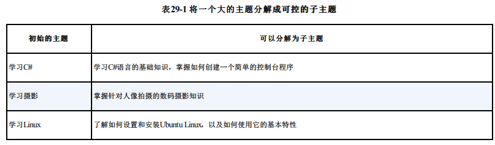
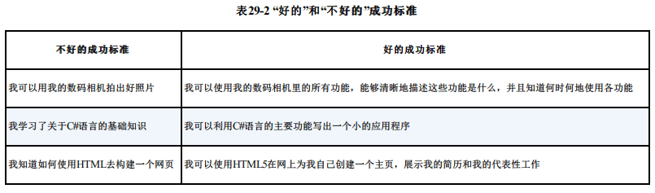

《软技能：代码之外的生存指南》

### 学习怎样学习：如何自我教育

#### 剖析学习过程

你是否思考过自己是如何学习的？学习的真正含义是什么？我们几乎都是下意识地倾向于学习自己感兴趣的东西。当别人给我讲一个精彩纷呈的故事时，我们通常不会做笔记，也不会记住确切情节；然而我们中大多数人在听到故事后，不费吹灰之力就能将它复述出来。

这也同样适用于我们做的事情。如果我告诉你该怎么做，你可能会忘掉，但如果你自己动手做一次，你可能就记住了。如果你能将自己所学的东西教给别人，你不仅能记住，还能理解得更深刻。尽管每个人的学习风格千差万别（更多信息参见http://simpleprogrammer.com/ss-learning-myth），但是通过动手实践和教会他人，我们能学得更好。与其他学习方式相比，**主动学习是效率更高的方式**。

> 教育的首要目标，并不在于 教 **“知”**而在于 而 **“行”**。——赫伯特·斯宾塞

许多软件开发人员拿起一本关于编程语言或框架的技术书，从头到尾地读上一遍，就想奢望他们能够吸收其中的所有信息吗？最好的情况可能是借助这种方法，你能快速积累该主题的全部信息，但你仍然没有真正学会它。

#### 自我教育

**如果你想学习一些东西，你应该做什么**？好了，刚才我们讲过了，**最好的方法就是付诸于实践，如果你也能承担将自己所学的内容教给别人的任务，那么你会理解得更深刻**。所以，你在自我教育方面的努力，应该聚焦在如何让自己切实参与，并且尽早付诸实践。

我觉得学习知识的最好方式就是立即将其用于实践，即使你还不知道自己在做什么。如果关于某个主题你能够获得足够的知识能够操作，你就可以发挥自己心灵深处强大的创造力和好奇心。**当我们能够在一件事情上尽情发挥的时候，我们的内心就更倾向于吸收更多的信息，思考更有意义的问题**。

这似乎有些奇怪，但事实的确如此。玩耍是一项强大的学习机制，这一点我们在整个动物王国都看得到。动物的幼崽总是贪玩，通过玩耍，它们学会了许多赖以生存的重要技能。你看过小猫学捉老鼠的过程吗？人类也是通过玩耍、主动操作来学习的，即使在对我们所做的一无所知的时候。

再举一个例子。在我小的时候，我经常玩一种名叫“万智牌”的集换式卡牌对战。我被它深深吸引，乐此不疲。在游戏中，为了击败对手，你需要综合自己的智慧、运气和创造力，这让我非常着迷。

就凭这一点，我记住了游戏中出现的成千上万张卡牌。你随便抽一张牌，我都可以告诉你这张牌有什么属性、派什么用场。（就算到现在，我依然可以说出大多数牌的信息。）你以为我是在那里正襟危坐，努力背下这成千上万张牌吗？不，我不需要那么做。**我只是玩，并且乐在其中**。**这种自然的探索和好奇心帮助我轻而易举地记住了那么多的信息**。

通过发挥这样的能力，玩成为一个你可以大加利用的强大武器。它不仅能激励你，还能大大加快你的学习步伐。**在你阅读某个主题的书之前，大致浏览后就开始实践**。不用担心自己是否知道自己在做什么。乐在其中，你就会发现随着自己的实验和探索，自己在哪些方面发现了问题。

**一旦你已经实践过，并积累了各式各样的问题，立刻回到书本当中。当你回去重读这些参考资料的时候，你有强烈的冲动去消化吸收其中的内容**。因为你已经积攒了很多想要找到答案的问题，你对哪些内容更重要早已了然于胸。

然后，**你可以把自己学到的新知识重新应用于实践**。看看你学到的新方法是否能解决你已有的问题。你可以继续探索新领域，发现需要解决的新问题。以解决实践过程中发现的问题为目标，在向着知识前进的道路上重复这个循环，周而复始。通过这种方式获得的信息对你才是有意义的——“纸上得来终觉浅”啊。

最后，你可以将自己所学的打包教给别人。这一点是画龙点睛之笔，你应该随时准备与有兴趣倾听的人分享你新学到的知识，你会为自己的发现激动不已——玩儿的力量就是这么巨大。教导他人也很容易，它可以简单到你与配偶之间就自己学到的新东西进行的一次对话，也可以是写一篇博客文章。**关键在于，你要用自己的语言将这些信息组织起来，把你的思想表述给别人**。

这就是我发明的“十步学习法”背后的逻辑。不过本方法的关键指导原则是通过玩儿、探索以及将自己所学教给他人来学习。

##### 自我反问

> - 你最近一次自学了什么？你的学习过程是怎样的？
> - 你上一次对兴趣爱好感到激动是在什么时候？你对此兴趣爱好了解多少？你是经过刻苦学习才培养此兴趣的，还是通过玩耍自然而然地就学会了？

### 十步学习法

#### 体系背后的逻辑

在我职业生涯的早年间，我学习知识的主要途径就是“从封面到封底”仔细阅读专著。只有通读全书后我才会将自己学到的知识应用于实践。使用这个方法，我发现，我确实能学到东西，但是效率很低，我还得经常回顾书的内容，来弥补自己在该学科方面存在的知识短板。

当我拥有足够的时间，且没有一个真实具体的目标的时候，这种学习方法很好。我最终学会了我想要学习的东西，而且从头到尾地读书学东西也并不难，只是要花时间。随着我开始有更紧迫的理由需要快速学习，我发现自己原来的方法就无法奏效了。**通常，我并没有时间通读全书，而且我也发现书本里的很多内容更适合作为参考资料，而不适合实际学习**。

**有些时候，我只有一周甚至更少的时间去吸收足够的信息以教给别人**。我发现在这种情况下，我**很自然地会先明确需要掌握哪些内容，再去寻找我能获得这些信息的最佳资源，同时也会忽略那些并非达成目标所必需的其他信息**。

##### 主要三个关键点

我发现，为了能够掌握一门技术，我需要了解以下三个要点。

1. **如何开始**——要想开始使用自己所学的，我需要掌握哪些基本知识？
2. **学科范围**——我现在学的东西有多宏大？我应该怎么做？在开始阶段，我不需要了解每个细节，但是如果我能对该学科的轮廓有大致的了解，那么将来我就能发现更多细节。
3. **基础知识**——不止在开始阶段，要想使用一项特定的技术，我需要了解基本的用户案例和最常见的问题，也需要知道自己学的哪20%就能满足80%的日常应用。

我发现，如果我了解三项主题——如何开始，我能做什么，以及相关基础知识，那么我就能随着学习深入学会所需的其他知识。**如果我想提前掌握所有知识，那只是在浪费时间，因为真正重要的内容会湮没在那些细枝末节中**。这种新方法能让我关注重点。当我确实需要了解更多细节时，我可以利用参考资料来弥补这些不足。

有多少次你从头到尾仔细阅读一本技术书籍，却发现自己实际用到的也只是书里介绍的技术的一小部分？

> 使用这种方法，我在很短的时间内学会了Go语言——仅仅几个星期而已。我专注于学习如何尽快用Go语言写代码。很快我就对这门编程语言以及它有哪些可用的库有了一个大致的了解。我希望对这门语言能做什么能有一个整体的了解。最后，我完成并掌握了基础知识。当我需要深入了解时，我只需要在这些基础知识的基础上进行扩展。

#### 十步学习法体系

**“十步学习法”的基本思想就是：要对自己要学的内容有个基本的了解——了解自己不知道什么就足矣**。然后，利用这些信息勾勒出学习的范围，即需要学哪些内容，以及学成之后又会获得什么。依靠这些知识，你可以找出各种资源（不局限于书）来帮助自己学习。最后，你可以创建自己的学习计划，列出要去学习哪些相关课程，筛选学习材料，只保留能帮助自己达成目标的优质内容。

一旦完成这些工作，你对自己要学什么和怎样学都了然于胸，你就可以把控自己的学习计划中的每个关键点，通过“学习—实践—掌握—教授”（Learning, Doing, Learning and Teaching，LDLT）的过程，获得对该学科的深刻理解，同时你也向着自己的目标前进。

这是快速学习的唯一途径吗？这是一种魔法系统吗？不，不是的。**它只是通过“聚焦学习范围，让你关注重点内容”来学习的一种快速学习方法，它迫使你通过“自我探索”和“主动教学”的方式将真正重要的内容印刻在自己的大脑中**。

#### 第1步到第6步：只需要做一次

##### 1：了解全局

学习始终是一项棘手的任务，因为在开始学习某些东西的时候，你对自己到底要学什么理解得并不透彻。

大多数开发人员在打开一本新书开始阅读的时候，他们对自己所不知的一无所知。他们将“未知之未知”留到后面去发现。这一方法的问题在于，你要么学非所需，要么力所不及。**在深入探究某个主题之前至少要对其有所了解，这一点非常重要**。这样你才能弄清自己到底要学什么，找出最好的学习方式。

在这一步，你要做的就是了解自己将要学习的主题的全局。这个主题宏观上什么样？你能从中学到足够丰富的知识以了解自己所不知道的吗？以及自己所不知道的有多少？

**假设你想学习数码摄影**。你可能会先在网上搜索与这个主题相关的内容，浏览与数码摄影有关的博客和文章。短短几小时之内你就能对这个主题的全局及现有的子课题有一个清晰的认识。

要完成这一步，你需要对自己想要学的课题做一些基础性研究。通常你可以使用网络搜索来完成大部分研究。如果你碰巧有一本关于该主题的书，那么你就可以只读一下其中的介绍性章节，粗略浏览一下内容，但是不要在这一步上花费太多时间。

记住，我们在这一步的目的不是要掌握该主题，只是对这一主题的相关内容有一个全局性的了解。

##### 2：确定范围

现在，你至少对自己的学习主题及其全局有了一个大致的了解。下一步就是**集中精力去明确自己到底要学什么**。在任何项目中，明确项目的范围都是至关重要的，唯有这样才能了解项目的全局，做好相应的准备工作。与此相比，学习并没有什么不同。

让我们继续你要学**数码摄影**这一例子。此时，你想要理解的是“这一主题到底有多大”，以及“如何将其分解为更小的范围”。在一定的时间内，你不可能掌握关于数码摄影的一切知识，所以你需要决定学习的重点和学习的范围。**如果你想了解如何拍摄人像照片，那这就是你的学习范围**。

**在学习过程中，大家很容易犯的一个错误就是试图解决太大的问题而把自己搞得不堪重负**。例如，试图全面掌握物理学是不切实际的，因为这一主题太过庞大，也不够聚焦。你不可能在有限的时间里学会与物理学有关的一切——穷尽一生也不可能。因此，你要明确自己的学习范围。为此，你需要运用自己在上一步中获得的信息，让自己的关注点落脚到更小也更可控的范围。

让我们看看表29-1，看如何将庞大的主题分解为小而聚焦的主题。

请注意，在上面的例子中，是如何将类似“学习C#”这样的宏大主题缩小并聚焦到一个特定范围内的。我们从一个几乎无边界的主题中明确了一个清晰且聚焦的范围。你还会注意到，在这一步中，我们还为学习添加了一个理由，从而将其限定在一个范围明确的主题内。例如，你想学摄影，特别是学数码摄影，目的是能够拍摄人像。**阐述学习的理由能够帮你明确学习范围，因为人们通常是为一些特殊的理由才去学一些东西的**。

在这一步中，你可以**充分利用自己在第1步中收集到的信息，找出自己的学习范围**。同时也可以借助自己的学习理由来决定学习的范围。

在此过程中，**你可能会受到诱惑，为了学习该主题下的不同子主题**，你可能会扩张你的学习范围而不够聚焦，但是请务必抵制住这个诱惑，尽可能地保持专注。**你一次只能学一样东西**。你可以稍后再回头学习别的分支领域，但就目前而言，选择一个专注而聚焦的范围，潜心学习吧。

最后，在这一步中一定要注意：**明确学习范围的时候要考虑时间因素**。如果你只有一周时间，你需要本着实事求是的态度确定自己能在这段时间内学到什么。如果你有几个月的时间，你也许能攻克一个更大的主题。你的学习范围务必大小适当，既能符合你的学习理由，又能符合你的时间限制。

##### 3：定义目标

**在全力以赴启动之前，明确“成功”的含义极为重要**。如果不知道成功是什么样子，很难找准目标，也很难知道自己什么时候已经真正达到目标。**在尝试学习任何东西之前，你都应该在自己脑海中清晰地描绘出成功的样子**。当你知道自己的目标是什么的时候，你就可以更轻松地使用倒推的方式，明确实现目标所需的步骤。

现在，我们依然使用刚才那个学习数码摄影的例子。你可能已经明确成功的标准包括掌握数码相机的所有功能，能够清晰地描述这些功能是什么，并且了解何时以及为什么使用每一项功能。

这一步的目标是形成一份简明清晰的陈述，勾勒出你勤奋学习后的成功图景。根据不同的学习内容，这份陈述也各不相同。但是要确保其中包含具体的成功标准，从而能让你用来充分评估自己是否已经达成学习目标。

好的成功标准应该是具体的、无二义性的。不要对自己想要完成的任务进行含糊不清的描述。相反，要列出某一特定的结果，或者一旦实现自己所能达到的目标你应该能够做到的事情。表29-2展示了一些示例。

你想从自己的学习经历中获得什么决定了你的成功标准是什么。请确保你能借此在学习结束后评估自己是否达成了目标。好的成功标准也能让你向着既定目标不断前进。

##### 4：寻找资源

还记得学生时代会针对某个特定主题写报告吗？如果你写好了报告却只有一条参考文献，譬如你所有的信息都来自一本书，结果会怎样？你可能会拿到一个大大的“鸭蛋”。为什么现在很多人学东西的时候却与那时如出一辙？关于一个主题我们只读一本书，或者所有的研究只使用一个资源。

继续以数码摄影为例。你可能会从阅读相机的用户手册开始，但是不会就此止步。你可能还会查找各种专业的数码摄影的网站，甚至是自己所用的相机的网站。你也可能会在亚马逊网站上搜索数码摄影的相关图书，最后可能找到能寻求建议的专家。

要尝试收集到多种多样的资源以帮助你学习，而不是只读一本关于这一主题的书。资源可以是多种多样的，不局限于书籍。事实上，如今，随着互联网的广泛应用，各种类型的内容随处可见，你几乎可以针对自己感兴趣的任何主题，找到大量的资源。

在这一步中，你会想找到尽可能多的与自己所选主题相关的资源。此时你无需考虑这些资源的质量。这一步与头脑风暴类似。稍后你会对你找到的这些资源进行过滤，去伪存真，但是目前还是想先获得尽可能多的不同类型的资源。

要做到这一点，最好的方法就是迅速打开电脑，开始搜索与自己的主题相关的信息。我通常会从亚马逊开始，看看能从中找到多少相关图书；然后我会用Google搜索，看看能不能找到视频、博客文章、播客和其他有用的内容。你甚至可以像“老派人”那样去拜访图书馆。重点就是你要找到各种不同的资源。你不想因为单一来源的信息而产生偏见，更愿意尽可能获取各种各样的信息。

##### 5：创建学习计划

你有没有注意过，大多数书籍都被分解成若干章，各章在内容上又层层推进？**好的技术书都遵循这样的规律：打好基础，做好铺垫，然后逐个展开每一章的论述**。

现在你已经掌握了一些资源，你可以借助这些资源对自己要学什么、以什么顺序进行有了想法。现在你应该对数码摄影到底要学什么有了很好的认识。你需要通览已有的数码摄影的相关资料，找到一种方法将这个主题分解成更小的部分。

对于大多数学科而言，学习是一个自然的过程。从A开始，前进到B，最后到达Z。这个顺序对你掌握随机的碎片化知识价值不大。你需要找出在最短的时间内从A到Z的正确路径，并且到达沿途的重要地标。

**在这一步，你需要创建自己的学习路径。把它看作自己写书时候的大纲。事实上，当你大功告成的时候，你会发现自己的学习路径可能与一本书的目录非常相似**。你基本上就是完成一系列的模块，直到最后达成目标。

打造自己的学习计划，**一个好方法就是观察别人是如何教你感兴趣的主题的**。**就我自己而言，在这一步我通常会翻看自己在第4步中找来的图书的目录**。**如果五位不同的作者都把内容都分解为相同的模块和顺序，那我就会遵循这样的方法制订自己的学习计划**。

这并不意味着你只要复制一本书的目录就可以称其为自己的学习计划了。有的书的内容超出你的需求，有的书的结构很差劲儿。通览你收集到的全部资源，你就对自己需要哪些内容以及如何组合这些内容有更清晰的认识。

##### 6：筛选资源

现在，你知道自己要学什么以及以什么顺序学，那么是时候决定要使用哪些资源来完成自己的学习任务了。回到第4步，你收集了与研究主题相关的所有资源。在第5步中你使用这些资源制订了自己的个人学习计划。现在是时候对这些资源进行筛选，挑选最有价值的几项来帮你实现自己的目标。

这时的你已经有了大把关于数码摄影的书籍、博客文章和其他资源等，不一而足。但是，问题是你该如何利用这些资源。很多数据都是冗余，并非所有资源都适合你的学习计划。

为了研究一个主题要读10本书、50篇博客文章，并不现实，并且即使你真的这么做了，其中也有很大一部分是重复的。因此很有必要对现有资源进行筛选，从中选出最能帮助你实现自己的目标的资源。

在这一步中，把你在第4步中收集的全部资源浏览一遍，找出哪些内容能够覆盖你的学习计划。你还应当看看评论，试着

找出品质最高的资源。我在购书时，通常会浏览亚马逊上的评论，找出我认为最物超所值的一两本书。

一旦完成了这一步，你就可以准备前进到学习计划中的第一个模块。在你实现自己的目标之前，你还需要为每个模块重复第7步到第10步。

---

> 挑选你想要了解的一项课题，实际经演练一下上述这六个步骤。你可以从一些规模较小的课题开始，以便让自己习惯于这一过程。但是注意，一定要实际运用。如果你只是把这些步骤当作是阅读内容，那么它们对你不会有太大用处。

#### 第7步到第10步：循环往复

##### 7：开始学习，浅尝辄止

大多数人，包括我自己，在学习过程中通常会犯两类错误：第一类错误是在知之不多的情况下就盲目开始，即行动太快；第二类错误是在行动之前准备过多，即行动太晚。要想在这二者之间取得平衡，你掌握的知识要恰到好处，足以能让你开始学习，但又不会多到让你无力探索，这样你的学习效果最佳。

**在这一步中，你的目标是获得足够多的与所学主题相关的信息，从而能让你开始学习，并在下一步中动手操作**。对于编程语言或框架这样的技术，这一步还包括掌握如何创建一个基本的“Hello, world!”程序，或者设置自己的开发环境。对于摄影这个例子来说，这一步包括自己在不同的光线条件下调试光圈及其效果。

这一步的关键在于过犹不及。你会很容易就失去自控力，开始消化计划学习中列出的所有资源。但是，你会发现，如果你能经受住这样的诱惑，你会取得更大的成就。你要专注于掌握自己所需的、能在下一步动手操作的最小量的知识。你可以浏览参考材料，或者每章的摘要，或者各种简介，这些信息足以让你对自己要做什么有基本的认识。

你买过新视频游戏吗？你是不是在把光盘塞进游戏机开始玩之前先快速浏览一下用户手册？这正是你在第7步中要做的事情。你玩一会儿之后，会重新回来完整地阅读用户手册。现在，你只需要知道基本用法，能够正确地玩游戏就够了。

##### 8：动手操作，边玩边学

这一步真是既有趣又可怕。说它有趣是因为你真的是在玩耍，说它可怕是因为这一步完全没有边际。这一步没有任何规则，你可以做任何你想做的事情。如何更好地实施这一步，完全由你决定。

起初，你会觉得这步似乎并不重要，不过还是让我们先来考量一下其他的方式——大多数人学习的方式。**大多数人会试图通过读书或观看视频来掌握某个主题**。他们会提前吸收很多信息，然后再付诸实践。**这一方法的问题在于，在他们读书或看视频的时候，他们并不知道哪些内容是重点。他们只是因循他人设计好的学习路径**。

让我们继续学习数码摄影的例子。假定你要学习光线对数码摄影的影响，所以在这一步中，你会一直练习在不同的光照条件下拍照。你可能只是走到室外调节光圈，也可能在不同的环境下拍照；其间，你并没有意识到自己在做什么。你在探索中学习，也发现了许多问题。

现在，考虑一下我在这里建议的方法。**你无需提前了解全部内容，你要做的首要的一件事情就是亲自操作和亲身体验**。采用这种方法，你通过探索和实践进行学习。

**在操作的过程中，你的大脑自然地产生各种问题：它是如何工作的？如果我这么做，会发生什么？我该如何解决这个问题？这些问题引导着你走向真正重要的方向**。当回过头寻找问题的答案的时，不只是这些问题迎刃而解，而且你记得的东西比你学习的东西要多得多，因为你所学到的都是对你很重要的东西。

##### 9：全面掌握，学以致用

好奇心是学习特别是自学的重要组成部分。当我们还是孩子的时候，我们就处于主要由好奇心驱动的快速学习期。我们想知道世界是如何运转的，所以我们提出问题，四处寻求答案，借此来了解我们所处的这个世界。但是，随着我们日渐长大，大部分好奇心也随之消失，我们把世界上的一切看作理所当然。结果，我们的学习放缓，我们觉得教育非常枯燥，并不令人着迷。

**这一步的目标就是让你找回好奇心驱动的学习。在这一步中，你要利用先前收集到的所有资料，进行深入学习**。

让我们再回到数码摄影的例子。假设你已经在调试光圈的过程中积累了一些问题，这时你可以通过阅读相关主题的资料来回答这些问题。你可以通览已有的资料，仔细查找与光线和其他通过操作发现的问题有关的内容。

为了有效利用自己选择的资料，为上一步产生的问题寻求答案，阅读文字、观看视频、与他人交流都是必要手段。这能让你沉浸在学习材料中，尽可能地汲取知识。

不要害怕回头再去操作，付出更多，因为这不仅能让你找到问题的答案，也能让你学到新东西。给自己足够多的时间去深入理解自己的主题，你可以阅读，可以实验，可以观察，也可以操作。

不过请记住，你依然没有必要把收集到的所有资料全部仔细看一遍。你只需要阅读或观看与当前所学相关的部分。**我们很少能有足够的时间把一本书从头读到尾**。**这些资料只是帮你自学**，基本上你可以以解决在动手操作中发现的问题为主要目的。

##### 10：乐为人师，融会贯通

你告诉我的，我都忘了。你教会我的，我都记得。让我乐在其中，我就一定能学会。--本杰明·富兰克林

大多数人都不敢为人师。我曾经也是。当你在思考自己知道的东西（或者你认为自己知道的东西）是否值得教给别人的时候，很容易陷入自我怀疑之中。但是，如果你想深入地掌握一门学问，想对这门学问做到融会贯通，那么你必须要做到“好为人师”。除此之外别无他法。

在现实中，你只需要超前别人一步，就可以成为他们的老师。有时候，比学生超前太多的“专家”反而不能得心应手地“教”，因为他们无法与学生产生共鸣。他们忘了初学者是什么样子，很容易专注于他们认为简单的细节。

如果你想教别人自己学到的关于光线如何影响数码摄影的知识，你可以创建一个简单的YouTube视频，展示不同的光源及它们对拍摄的影响。你甚至还可以再简单一些，向朋友或同事解释光线是如何影响数码摄影效果的，我敢肯定许多人会对这个谈话很感兴趣。

**在这一步中，我会要求你走出自己的舒适区，将自己学到的知识教给别人**。**要想确定你确实掌握了某些知识，这是唯一的办法；同时，在你将自己所学介绍给他人时，这也是查缺补漏的好办法**。在这一过程中，你要切实剖析并理解自己所学的知识，将其内化到自己的思想；同时，你也要用能够让他人理解的方式精心组织这些信息。以我个人的经验来说，在我开始“乐为人师”之后，我不仅在职业发展和专业成长上有了巨大飞跃，我的理解能力也更上一层楼。

你可以用多种方式将自己所学教给他人。你可以写博客，也可以制作YouTube视频。你也可以跟自己的爱人探讨，将自己所学解释给他/她。重点在于，你要花时间将自己学到的东西从大脑中提取出来，以别人能够理解的方式组织起来。在经历了整个这个过程之后你会发现，有很多你以为自己明白了的知识点，其实并没有摸透。于是你会将那些以前自己没太明白的东西联系起来，并且简化自己大脑中已有的信息，将它们浓缩并经常复习。

前景非常诱人。所以，不管做什么，千万不要跳过这一步。这一步对于保持信息以及深入理解知识而不仅仅只是流于表面至关重要。

###### 教授知识的途径

- 撰写博客文章
- 创建YouTube视频教程
- 发表演讲
- 与朋友或爱人进行对话探讨
- 在在线论坛上回答问题