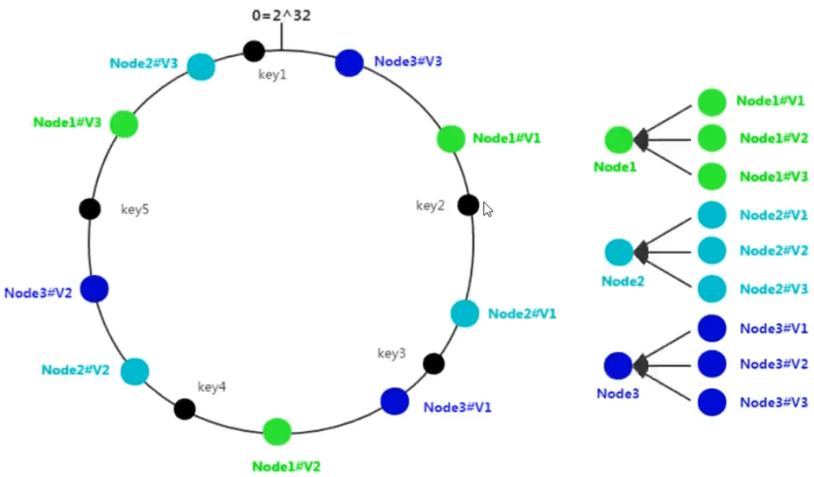
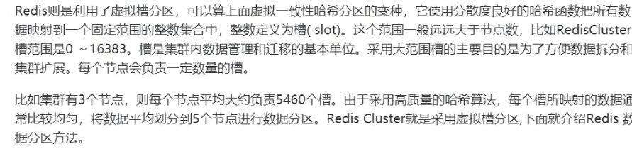
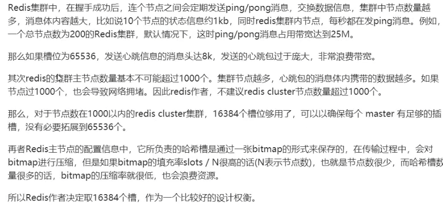

#### Redis 6.0 之前为什么一直不使用多线程？

#### Redis 6.0之后为什么又用上了多线程？

#### redis哪些高级功能

保存时间序列数据、作为队列使用、geo

#### redis 如何解决key冲突？

#### 提高缓存命中率

第二点，例如，缓存可以用20g，mysql100g，则可以提前加载20%的数据。

#### Redis 集群方案什么情况下会导致整个集群不可用

A、B、C节点集群，B节点失败（主故障，没有替代方案）整个集群不可用。

#### redis 的哈希槽的概念

##### 数据分布理论

分布式数据库首先要解决把整个数据集按照分区规则映射到多个节点的问题，即把数据集划分到多个节点上，每个节点负责整体数据的一个子集。

需要关注的重点是数据分区的规则。常见的分区规则有哈希分区和顺序分区两种，哈希分区离散度好、数据分布业务无关、无法顺序访问；顺序分区离散度倾斜、数据分布业务相关、可顺序访问。

##### 节点取余分区

##### 一致性哈希分区

当集群中增加节点时，比如在node2和node3之间增加一个节点node4，此时在访问节点key4时，不能在node4中命中，更一般的，介于node2和node4之间的key均失效，这样的失效方式太过于“集中”和“暴力”，更好的方式因该是“平滑”和“分散”地失效。

##### 虚拟一致性hash分区

##### 虚拟槽分区

#### redi槽16384个原因

#### Redis集群会有写操作丢失吗？

会，不会保持强一致性。**因为主从之间是通过异步的方式去同步数据的**，对用户来说时已经返回了结果，但是如果在异步同步数据的时候，主节点宕机了，从节点不会接收到数据。

#### Redis常见性能问题和解决方案有哪些？

##### 常见性能问题

#### 热点数据和冷数据是什么

数据更新之前至少读取了2次才能放缓存。

##### 热数据

点赞数量、收藏数、分享数，这类数据是不断地变化的，可以同步到redis中。

访问频率很高的数据，考虑使用缓存。

##### 冷数据

