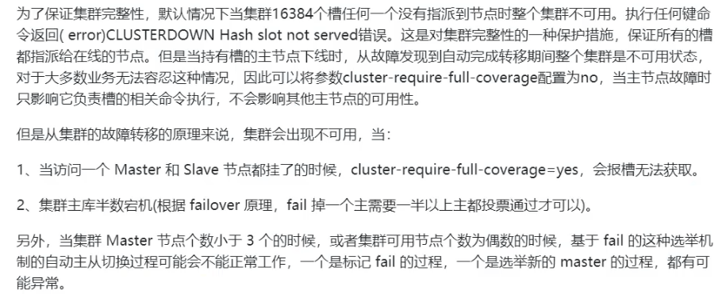
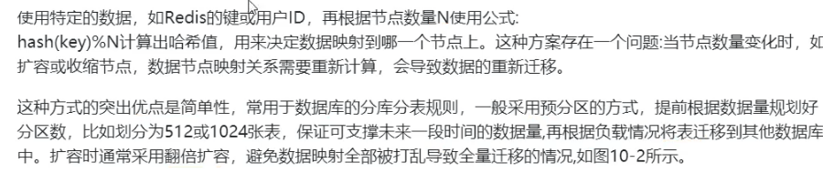
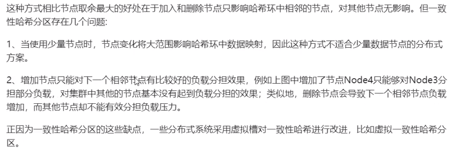
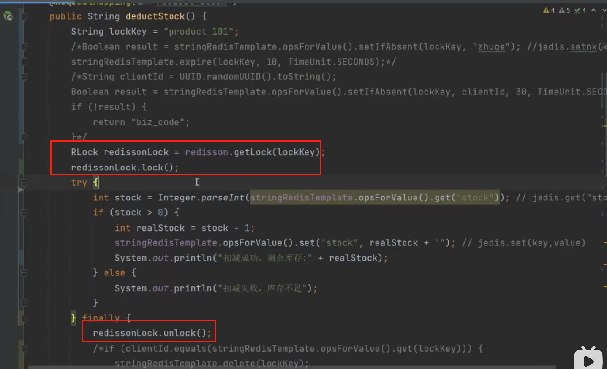
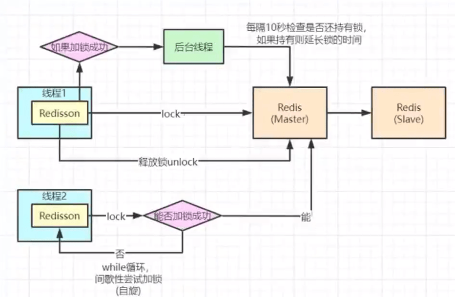
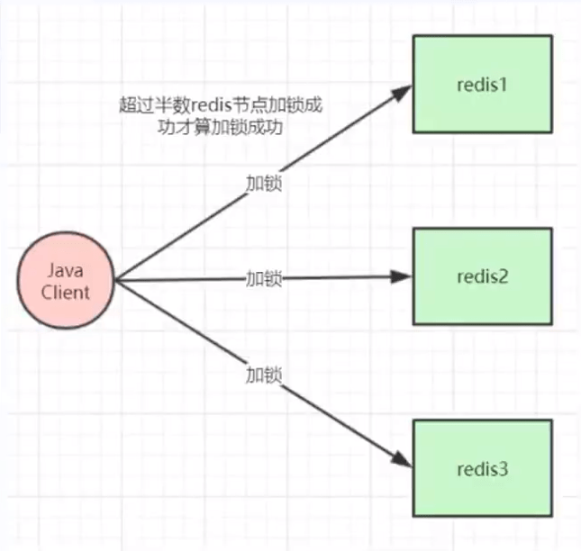

#### Redis 6.0 之前为什么一直不使用多线程？

#### Redis 6.0之后为什么又用上了多线程？

#### redis哪些高级功能

保存时间序列数据、作为队列使用、geo

#### redis 如何解决key冲突？

#### 提高缓存命中率

第二点，例如，缓存可以用20g，mysql100g，则可以提前加载20%的数据。

#### Redis 集群方案什么情况下会导致整个集群不可用

A、B、C节点集群，B节点失败（主故障，没有替代方案）整个集群不可用。

#### redis 的哈希槽的概念

##### 数据分布理论

分布式数据库首先要解决把整个数据集按照分区规则映射到多个节点的问题，即把数据集划分到多个节点上，每个节点负责整体数据的一个子集。

需要关注的重点是数据分区的规则。常见的分区规则有哈希分区和顺序分区两种，哈希分区离散度好、数据分布业务无关、无法顺序访问；顺序分区离散度倾斜、数据分布业务相关、可顺序访问。

##### 节点取余分区

##### 一致性哈希分区

当集群中增加节点时，比如在node2和node3之间增加一个节点node4，此时在访问节点key4时，不能在node4中命中，更一般的，介于node2和node4之间的key均失效，这样的失效方式太过于“集中”和“暴力”，更好的方式因该是“平滑”和“分散”地失效。

##### 虚拟一致性hash分区

##### 虚拟槽分区

#### redi槽16384个原因

#### Redis集群会有写操作丢失吗？

会，不会保持强一致性。**因为主从之间是通过异步的方式去同步数据的**，对用户来说时已经返回了结果，但是如果在异步同步数据的时候，主节点宕机了，从节点不会接收到数据。

#### Redis常见性能问题和解决方案有哪些？

##### 常见性能问题

#### 热点数据和冷数据是什么

数据更新之前至少读取了2次才能放缓存。

##### 热数据

点赞数量、收藏数、分享数，这类数据是不断地变化的，可以同步到redis中。

访问频率很高的数据，考虑使用缓存。

##### 冷数据

#### 秒杀抢购超卖bug

##### Jedis

解决方案1代码，使用了 setnx 进行获取：

此时对一个商品进行秒杀和减库存操作，但是当有高并发请求的时候，会有很多请求获取锁，只有一个请求可以获取到锁，其他都返回业务代码。

情况1：此时如果一个请求A获取到了商品，然后执行到了finally，此时，锁已经过期了，也就是说上面的try语句执行时间超过了锁的过期时间，锁自动过期了，然后B请求过来了，B请求此时就可以获取到锁，执行业务代码。但是A请求还没执行完代码，随后执行finally中代码，此时如果不添加client_id进行判断的话则会直接将这个lockkey删除，造成误删，导致B请求添加的锁失效。

解决方案，每个请求都添加一个独一无二的clientId来分辨，使用一个if进行判断。但是还是上面的情况下，如果执行到了if语句，判断为true之后，此时卡顿了一下，redis添加的过期时间到了，此时也会过期，导致会删除B请求添加的锁。`stringRedisTemplate.opsForValue().get(lockKey)`返回的是添加的clientId。而删除和获取的是同一个lockkey也就是 ’product_101‘。所以A会删除B添加的锁。此时如何处理呢？

此时可以对A请求的锁进行一个**延时**处理，也就是Redisson的加锁。使用一个**锁续命**。在开启业务逻辑的时候，同时启动一个后台线程，定时任务每过10s，检查锁是否还在，还在则继续加锁，添加10s。当主线程结束之后，锁删除了，然后结束子线程。也就是可以使用 Redisson 提供的加锁进行操作。

##### Redisson 加锁

**上面代码加锁优化**

- 缩小锁的粒度。将没有并发问题的业务代码放到加锁代码的外面。
- 分段锁。比如一个产品有200库存，优化为10个库存key，每段20个库存，第一段product_1，product_2...，使用轮询查询哪个段。

**加锁原理**

##### 主从节点，加锁后，主节点宕机该如何

加锁之后，可能主节点宕机了，但是没有同步到从节点，从节点已经选举成了主节点，此时没有加锁的信息的，会导致key的丢失。

使用 zookeeper、RedLock；

使用redLock加锁，不能做多余的操作，在搭建一个从节点，也会有主从数据同步不及时问题。同时，可以使用redis的AOF的always持久化策略，保证redis命令的正确持久化，防止加锁成功后，但是写aof日志失败的情况，随后重启redis导致key丢失的情况。

