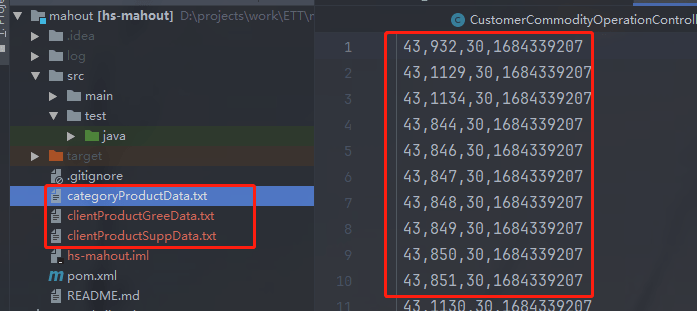

health smart 购物网站

### 你可能会喜欢

分为两类

#### 1 客户产品亲和度----用户协同推荐

基于客户的购买、收藏、近期浏览记录来推荐。

1. 购买过的产品：分数，50分，计算方式：

   > 起始30分，三个月内买过满分50，超过三个月分数递减，例如：
   >
   > 买过月份和当前时间相差月以n表示，公式=30+(n > 3 ? 3/n*20 : 20)

2. 已收藏：分数，30分，计算方式：

   > 起始20分，一个月内满分30，收藏超过一个月后分数递减，例如：
   >
   > 已收藏月份和当前时间相差月以n表示，公式=20+(n > 1 ? 1/n*10 : 10)
   
3. 近期浏览过：分数，20分，计算方式

   > 起始0分，一周（7天）内满分20，浏览超过一周后分数递减，例如：
   >
   > 最近浏览和当前时间相差天数以n表示，公式=0+(n > 7 ? 7/n*20 : 20)

4. 购物车：存在购物车中，100分

最终上面4类的分数总分最高是200分，亲和度为4类之和，四舍五入取整，如果用户没有发生过上述操作那么分数为0。

最终会形如下面这样：

|          | 购买过 | 已收藏 | 近期浏览过 | 购物车中 |
| -------- | ------ | ------ | ---------- | -------- |
| 基础分比 | 30     | 20     | 0          | 0        |
| 最高分   | 50     | 30     | 20         | 100      |

注：买过产品，如产品中有如下情况，不计入亲和度原数据：

1. product有但web_product未创建，即该产品暂不支持商城交易。

2. 产品id以DIS开头，如DISWN-XXXX，即该产品虽存在客户历史订单，但该产品是赠品，赠品不计入亲和度。

3. 产品已下架 或者 2号仓库已售罄，即该产品当前无法在商城购买。

##### 相似度算法

pearson correlation similarity


#### 2 产品类别亲和度----产品协同推荐

基于产品的类别来推荐。

创建category和产品的亲和度，当产品属于某category时，将会得到属于应该category的亲和度，逻辑如下：

当前系统category有level：1，2，3，其中1表示最广意的目录，3表示最细至的目录。亲和度计分规则如下：

category的level=1，计分30

category的level=2，计分40

category的level=3，计分50

权重占比如下(越精确的分类权重越高)：
category1 : category2 : category3

  3   :   4   :    5

##### 产品相似度算法：Tanimoto coefficient


#### 具体数据实例分析


先介绍一下产品的类别，可以访问网站：[乐本健购物网](https://www.healthsmart.com.hk/hs-home/#!/link/home) 浏览产品。大类别分为了三种，下面是小类别。


关于推荐系统基础数据的文件生成逻辑，erp每日凌晨根据如下sql生成(覆盖)3个txt文件到机器，推荐系统再根据配置读取这三个文件用来推荐数据：

##### 客户产品相关数据

这里的value是根据上面的规则得到的。client_num 是 客户的自增id，product_num 产品的自增id，因为 mahout 需要 整型的数据。

```mysql
CREATE VIEW `client_product_favorite_rating_view` AS 

SELECT client_id,client_num,product_id,product_num,ROUND(sum(value)) as value FROM (

-- 收藏商品
SELECT t1.client_id,t2.client_num,t1.product_id,t3.product_num,
(case WHEN TIMESTAMPDIFF(MONTH,t1.created_date,now()) > 1 THEN 20+1/TIMESTAMPDIFF(MONTH,t1.created_date,now())*10 else 30 end) as value 
FROM client_product t1 
LEFT JOIN client t2 on t1.client_id = t2.client_id 
LEFT JOIN product t3 on t1.product_id = t3.product_id 
WHERE t2.client_id is not null and t3.product_id is not null  

UNION ALL 

-- 浏览过商品
SELECT t3.client_id as client_id,t4.client_num,t1.item_id as product_id, t5.product_num,
max(case WHEN to_days(now()) - to_days(t1.time) > 7 THEN 7/(to_days(now()) - to_days(t1.time))*20 else 20 end) as value
FROM user_home_log t1 
LEFT JOIN user_uuid_map t2 on t1.web_uuid = t2.web_uuid 
LEFT JOIN user_client_map t3 on t2.user_id = t3.user_id 
LEFT JOIN client t4 on t3.client_id = t4.client_id 
LEFT JOIN product t5 on t1.item_id = t5.product_id 
WHERE t1.page = 'productDetail' and t2.user_id is not null and t3.client_id is not null and t5.product_id is not null  
GROUP BY t3.client_id,t1.item_id

UNION All 

-- 购买过产品
SELECT t4.client_id as client_id,t6.client_num,t5.product_id as product_id, t7.product_num,
(case WHEN TIMESTAMPDIFF(MONTH,max(t4.lastupdated_date),now()) > 3 THEN 30+3/TIMESTAMPDIFF(MONTH,max(t4.lastupdated_date),now())*20 else 50 end) as value  
FROM sales_order t4 
LEFT JOIN client t6 on t4.client_id = t6.client_id 
LEFT JOIN order_item t5 on t4.order_id = t5.order_id 
LEFT JOIN product t7 on t5.product_id = t7.product_id 
LEFT JOIN web_product t8 on t7.product_id = t8.product_id 
where t7.product_id is not null and t6.client_id is not null and t7.product_id not like 'DIS%' and t8.web_product_id is not null 
GROUP BY t4.client_id,t5.product_id 

UNION ALL 

-- 存在于购物车
SELECT t1.client_id,t2.client_num,t1.product_id,t3.product_num,100 as value FROM shopping_cart t1 
LEFT JOIN client t2 on t1.client_id = t2.client_id 
LEFT JOIN product t3 on t1.product_id = t3.product_id 
WHERE t2.client_id is not null and t3.product_id is not null and t1.product_type in ('S','K') 

) as allItemValue GROUP BY client_id,product_id;
```

查询出来的示例数据：


```mysql
-- 用户协同查询生成文件原数据（营养补充品）
SELECT client_num,product_num,value,UNIX_TIMESTAMP(now()) as createTime FROM client_product_favorite_rating_view t1 WHERE product_id in (SELECT DISTINCT product_id FROM web_category_product_map WHERE category_type_1 = 'supplement');
```

示例数据


```mysql
-- 用户协同查询生成文件原数据（GreenDos）
SELECT client_num,product_num,value,UNIX_TIMESTAMP(now()) as createTime FROM client_product_favorite_rating_view t1 WHERE product_id in (SELECT DISTINCT product_id FROM web_category_product_map WHERE category_type_1 = 'greendos');
```

示例数据和上面的类似只是类别不同而已。

##### 产品类别相关数据

```mysql
CREATE VIEW `category_product_favorite_rating_view` AS 
-- category1
SELECT t2.cat_type,t2.category_num,t3.product_id,t3.product_num,30 as value FROM web_category_product_map t1 LEFT JOIN category_type t2 on t1.category_type_1 = t2.cat_type and cat_level = 1 and cat_group = 'P' LEFT JOIN product t3 on t1.product_id = t3.product_id LEFT JOIN web_product t4 on t3.product_id = t4.product_id WHERE t4.web_product_id is not null and t2.cat_type is not null and t1.category_type_1 is not null and t1.category_type_1 != "" 

UNION ALL 
-- category2
SELECT t2.cat_type,t2.category_num,t3.product_id,t3.product_num,40 as value FROM web_category_product_map t1 LEFT JOIN category_type t2 on t1.category_type_2 = t2.cat_type and cat_level = 2 and cat_group = 'P' LEFT JOIN product t3 on t1.product_id = t3.product_id LEFT JOIN web_product t4 on t3.product_id = t4.product_id WHERE t4.web_product_id is not null and t2.cat_type is not null and t1.category_type_2 is not null and t1.category_type_2 != "" 

UNION ALL 
-- category3
SELECT t2.cat_type,t2.category_num,t3.product_id,t3.product_num,50 as value FROM web_category_product_map t1 LEFT JOIN category_type t2 on t1.category_type_3 = t2.cat_type and cat_level = 3 and cat_group = 'P' LEFT JOIN product t3 on t1.product_id = t3.product_id LEFT JOIN web_product t4 on t3.product_id = t4.product_id WHERE t4.web_product_id is not null and t2.cat_type is not null and t1.category_type_3 is not null and t1.category_type_3 != "" ;
```

查询数据：category_num是产品类的自增id，唯一性。

```mysql
-- 产品协同查询生成文件原数据
SELECT category_num,product_num,value,UNIX_TIMESTAMP(now()) as createTime FROM category_product_favorite_rating_view t1 ;
```


#### 开源算法 Mahout

根据上面的几个查询会生成对应的几个txt文件，传递到另外的一个推荐系统，根据这些数据获取到相关数据并返回。具体的过程和原理见下面分析：

文件如下：文件中的数据和查询到的sql数据中的每列是一一对应的。



具体的接口：

```java
@ApiOperation("根据用户喜好推送")
@CrossOrigin(originPatterns = "*",allowCredentials = "true")
@GetMapping("/recommendations/{customerId}/{webUUID}")
public ClientItemResponse recommend(@PathVariable String customerId, @PathVariable String webUUID) throws IOException, TasteException {
    return service.recommend(customerId, webUUID);
}
```