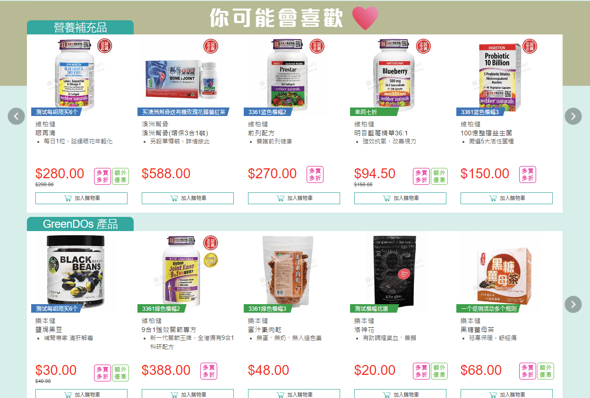

health smart 购物网站

### 你可能会喜欢

#### 数据准备

先介绍一下产品的类别，可以访问网站：[乐本健购物网](https://www.healthsmart.com.hk/hs-home/#!/link/home) 浏览产品。大类别分为了三种，下面是小类别。


关于推荐系统基础数据的文件生成逻辑，erp每日凌晨根据如下sql生成(覆盖)3个txt文件到机器，推荐系统再根据配置读取这三个文件用来推荐数据：

##### 原表改造-表添加字段和所涉及到的表

各自添加一个自增字段，代表唯一

```sql
alter table client add client_num int not null auto_increment,add key(client_num);
alter table product add product_num int not null auto_increment,add key(product_num);
alter table category_type add category_num int not null auto_increment,add key(category_num);
-- 后面新增了一个要求，web_category_product_map 表加了一个类别等级的概念，高的需要优先推荐
ALTER TABLE web_category_product_map ADD web_catpd_num int NOT NULL AUTO_INCREMENT,ADD KEY `web_catpd_num`(web_catpd_num);
```

product 表最后一列为 product_num，不需要关注这么多字段。

```mysql
CREATE TABLE `product` (
  `product_id` varchar(50) COLLATE utf8mb4_bin NOT NULL,
  `orig_product_id` varchar(50) COLLATE utf8mb4_bin NOT NULL,
  `brand_id` varchar(50) COLLATE utf8mb4_bin DEFAULT NULL,
  `brand` varchar(200) COLLATE utf8mb4_bin DEFAULT NULL,
  `product_type` varchar(3) COLLATE utf8mb4_bin DEFAULT NULL COMMENT 'S-Single Item, K-Product Kit',
  `name_en` varchar(200) COLLATE utf8mb4_bin NOT NULL,
  `name_t_ch` varchar(240) COLLATE utf8mb4_bin DEFAULT NULL,
  `name_s_ch` varchar(240) COLLATE utf8mb4_bin DEFAULT NULL,
  `desc_short` text COLLATE utf8mb4_bin,
  `desc_short_t_ch` text COLLATE utf8mb4_bin,
  `desc_short_s_ch` text COLLATE utf8mb4_bin,
  `desc_long` text COLLATE utf8mb4_bin,
  `desc_long_t_ch` text COLLATE utf8mb4_bin,
  `desc_long_s_ch` text COLLATE utf8mb4_bin,
  `img_url_l` varchar(200) COLLATE utf8mb4_bin DEFAULT NULL,
  `img_url_m` varchar(200) COLLATE utf8mb4_bin DEFAULT NULL,
  `img_url_s` varchar(200) COLLATE utf8mb4_bin DEFAULT NULL,
  `video_url` varchar(200) COLLATE utf8mb4_bin DEFAULT NULL,
  `from_date` date DEFAULT NULL,
  `to_date` date DEFAULT NULL,
  `vol_desc` varchar(200) COLLATE utf8mb4_bin DEFAULT NULL,
  `vol_desc_t_ch` varchar(240) COLLATE utf8mb4_bin DEFAULT NULL,
  `vol_desc_s_ch` varchar(240) COLLATE utf8mb4_bin DEFAULT NULL,
  `origin` varchar(200) COLLATE utf8mb4_bin DEFAULT NULL,
  `origin_t_ch` varchar(240) COLLATE utf8mb4_bin DEFAULT NULL,
  `origin_s_ch` varchar(240) COLLATE utf8mb4_bin DEFAULT NULL,
  `product_height` varchar(20) COLLATE utf8mb4_bin DEFAULT NULL,
  `product_width` varchar(20) COLLATE utf8mb4_bin DEFAULT NULL,
  `product_depth` varchar(20) COLLATE utf8mb4_bin DEFAULT NULL,
  `product_weight` varchar(20) COLLATE utf8mb4_bin DEFAULT NULL,
  `product_height_uom` varchar(20) COLLATE utf8mb4_bin DEFAULT NULL,
  `product_weight_uom` varchar(20) COLLATE utf8mb4_bin DEFAULT NULL,
  `ship_height` varchar(20) COLLATE utf8mb4_bin DEFAULT NULL,
  `ship_width` varchar(20) COLLATE utf8mb4_bin DEFAULT NULL,
  `ship_depth` varchar(20) COLLATE utf8mb4_bin DEFAULT NULL,
  `ship_weight` varchar(20) COLLATE utf8mb4_bin DEFAULT NULL,
  `ship_height_uom` varchar(20) COLLATE utf8mb4_bin DEFAULT NULL,
  `ship_weight_uom` varchar(20) COLLATE utf8mb4_bin DEFAULT NULL,
  `size_desc` varchar(50) COLLATE utf8mb4_bin DEFAULT NULL,
  `barcode` varchar(50) COLLATE utf8mb4_bin DEFAULT NULL,
  `discount_item` tinyint(1) NOT NULL DEFAULT '0',
  `status` varchar(5) COLLATE utf8mb4_bin NOT NULL COMMENT 'A - Active, S - Suspended, D - Deleted',
  `created_by` varchar(50) COLLATE utf8mb4_bin DEFAULT NULL,
  `created_date` datetime DEFAULT NULL,
  `lastupdated_by` varchar(50) COLLATE utf8mb4_bin DEFAULT NULL,
  `lastupdated_date` datetime DEFAULT NULL,
  `product_num` int(11) NOT NULL AUTO_INCREMENT,
  PRIMARY KEY (`product_id`),
  KEY `product_num` (`product_num`)
) ENGINE=InnoDB AUTO_INCREMENT=1702 DEFAULT CHARSET=utf8mb4 COLLATE=utf8mb4_bin
```

数据

| product_id | orig_product_id | brand_id | brand | product_type | name_en                             | name_t_ch                           | name_s_ch                           | desc_short                          | desc_short_t_ch | desc_short_s_ch | desc_long | desc_long_t_ch | desc_long_s_ch | img_url_l | img_url_m | img_url_s | video_url | from_date  | to_date | vol_desc | vol_desc_t_ch | vol_desc_s_ch | origin | origin_t_ch | origin_s_ch | product_height | product_width | product_depth | product_weight | product_height_uom | product_weight_uom | ship_height | ship_width | ship_depth | ship_weight | ship_height_uom | ship_weight_uom | size_desc | barcode          | discount_item | status | created_by | created_date | lastupdated_by | lastupdated_date | product_num |
| ---------- | --------------- | -------- | ----- | ------------ | ----------------------------------- | ----------------------------------- | ----------------------------------- | ----------------------------------- | --------------- | --------------- | --------- | -------------- | -------------- | --------- | --------- | --------- | --------- | ---------- | ------- | -------- | ------------- | ------------- | ------ | ----------- | ----------- | -------------- | ------------- | ------------- | -------------- | ------------------ | ------------------ | ----------- | ---------- | ---------- | ----------- | --------------- | --------------- | --------- | ---------------- | ------------- | ------ | ---------- | ------------ | -------------- | ---------------- | ----------- |
| CC-0800001 | CC-0800001      |          |       | S            | 母親節禮物包親臨樂本健人館$50現金券 | 母親節禮物包親臨樂本健人館$50現金券 | 母親節禮物包親臨樂本健人館$50現金券 | 母親節禮物包親臨樂本健人館$50現金券 |                 |                 |           |                |                |           |           |           |           | 2008-04-25 |         |          |               |               |        |             |             | 0              | 0             | 0             | 0              | CM                 | KGS                |             |            |            |             |                 |                 |           | HKET080424080510 | 0             | A      |            |              |                |                  | 1           |
| CC-0800002 | CC-0800002      |          |       | S            | 國內顧客親臨樂本健人館$100現金券    | 國內顧客親臨樂本健人館$100現金券    | 國內顧客親臨樂本健人館$100現金券    | 國內顧客親臨樂本健人館$100現金券    |                 |                 |           |                |                |           |           |           |           | 2008-04-25 |         |          |               |               |        |             |             | 0              | 0             | 0             | 0              | CM                 | KGS                |             |            |            |             |                 |                 |           | DM080428080510   | 0             | A      |            |              |                |                  | 2           |
| CC-0800003 | CC-0800003      |          |       | S            | $50現金券                           | $50現金券                           | $50現金券                           | $50現金券                           |                 |                 |           |                |                |           |           |           |           | 2008-04-30 |         |          |               |               |        |             |             | 0              | 0             | 0             | 0              | CM                 | KGS                |             |            |            |             |                 |                 |           |                  | 0             | A      |            |              |                |                  | 3           |
| CC-0800004 | CC-0800004      |          |       | S            | Coupon Balance $1                   | Coupon Balance $1                   | Coupon Balance $1                   | Coupon Balance $1                   |                 |                 |           |                |                |           |           |           |           | 2011-04-26 |         |          |               |               |        |             |             | 0              | 0             | 0             | 0              | CM                 | KGS                |             |            |            |             |                 |                 |           |                  | 0             | A      |            |              |                |                  | 4           |

还有一个 web_product 表是对应到购物网站上显示的

```mysql
CREATE TABLE `web_product` (
  `product_id` varchar(50) COLLATE utf8mb4_bin NOT NULL,
  `web_product_id` varchar(50) COLLATE utf8mb4_bin NOT NULL,
  `brand_id` varchar(50) COLLATE utf8mb4_bin DEFAULT NULL,
  `brand_name` varchar(255) COLLATE utf8mb4_bin DEFAULT NULL,
  `name_en` varchar(200) COLLATE utf8mb4_bin NOT NULL,
  `name_t_ch` varchar(240) COLLATE utf8mb4_bin DEFAULT NULL,
  `name_s_ch` varchar(240) COLLATE utf8mb4_bin DEFAULT NULL,
  `intro` text COLLATE utf8mb4_bin COMMENT 'APPLYS',
  `keywords` text COLLATE utf8mb4_bin COMMENT 'KEYWORDS',
  `score` int(11) DEFAULT NULL COMMENT 'AMARK',
  `apply_scope` text COLLATE utf8mb4_bin COMMENT 'APPLY',
  `dosage` text COLLATE utf8mb4_bin COMMENT 'DOSAGE',
  `components` text COLLATE utf8mb4_bin COMMENT 'COMPONENTS',
  `ingredients` text COLLATE utf8mb4_bin COMMENT 'EINGREDIENTS',
  `tips` text COLLATE utf8mb4_bin COMMENT 'TIPS',
  `notice` text COLLATE utf8mb4_bin COMMENT 'NOTICE',
  `disclaimer` text COLLATE utf8mb4_bin COMMENT 'DISCLAIM',
  `sole` tinyint(1) NOT NULL DEFAULT '0' COMMENT 'SOLE',
  `vegetarian` tinyint(1) NOT NULL DEFAULT '0' COMMENT 'VEGETARIAN',
  `img_url_1` varchar(200) COLLATE utf8mb4_bin DEFAULT NULL,
  `img_url_2` varchar(200) COLLATE utf8mb4_bin DEFAULT NULL,
  `img_url_3` varchar(200) COLLATE utf8mb4_bin DEFAULT NULL,
  `img_url_4` varchar(200) COLLATE utf8mb4_bin DEFAULT NULL,
  `img_url_5` varchar(200) COLLATE utf8mb4_bin DEFAULT NULL,
  `created_by` varchar(50) COLLATE utf8mb4_bin DEFAULT NULL,
  `created_date` datetime DEFAULT NULL,
  `lastupdated_by` varchar(50) COLLATE utf8mb4_bin DEFAULT NULL,
  `lastupdated_date` datetime DEFAULT NULL,
  PRIMARY KEY (`product_id`)
) ENGINE=InnoDB DEFAULT CHARSET=utf8mb4 COLLATE=utf8mb4_bin
```

数据，记录的是网页上显示的一些产品信息

```json
{
"web_product": [
	{
		"product_id" : "HS-BC00062", // 实际上是这个
		"web_product_id" : "ZHSBC00064", // 网页是这id，查询时候需要映射
		"brand_id" : "0004",
		"brand_name" : "EVERYDAY SHEA ",
		"name_en" : "Shea Shampoo-Unscented",
		"name_t_ch" : "天然乳木果洗髮露(無香味)",
		"name_s_ch" : "天然乳木果洗髮露(無香味)",
		"intro" : "<li>暢銷美國，手工製品<\/li><li>無化學加工，保留最佳營養<\/li><li>含乳木果油及椰子油，超強抗氧化兼保濕<\/li><li>平衡頭髮酸鹼值，回復髮絲彈性<\/li><li>公平貿易認證，保障貧窮地區收入<\/li><li>不含人工香精、色素、起泡劑、防腐劑及麩質<\/li>\n\n\n<li>只限本地送貨<\/li>",
		"keywords" : "天然乳木果洗髮露  SHEA Shampoo 受損髮質 洗頭水 髮尾開叉 去頭油 頭皮 頭髮毛躁 頭髮易斷 Everyday Shea　乳木果　洗髮　洗頭　洗髮水　手工　handmade　放鬆 頭皮 美髮",
		"score" : 5,
		"apply_scope" : " <p>乳木果油被譽為世上最頂級的天然護膚品之一，原產地於非洲，營養價值極高，早於幾千年前，非洲人已用乳木果油作日常皮膚護理，因其蘊含豐富的不飽和脂肪酸、維他命A、C及E等營養，能滲進肌膚底層，促進細胞再生，保持肌膚滋潤彈性，免受老化、太陽紫外線及烈風所帶來的傷害，同時更具抗菌消炎功效，能舒緩皮膚敏感問題。<\/p>\n<br>\n<br>\n <p>暢銷美國的手工製護膚品牌EVERYDAY SHEA[天然乳木果洗髮露(無香味)]以滋潤保濕的乳木果油為基礎，直接提取自西非和中非的乳木果樹中的果實，100%純凈天然，絕無化學加工，不經化學提煉，保留最高的生物活性；配合強效抗氧化的椰子油，能保護頭皮層和髮絲免受外界侵害，發揮高效修護、滋潤保濕及抗老化三大功效，有助回復頭髮的酸鹼值，保持髮質健康。本品乃天然草本配方，性質溫和，不含人工香精、色素、麩質及Paraben防腐劑，不會刺激皮膚及引致敏感，同時亦不含SLS起泡劑，純以天然方法營造起泡效果，有效分解油脂和袪頭皮，減少秀髮出現開叉、打結、易斷、乾旱等問題，使頭髮更易打理，輕盈可塑。\n <\/p>\n<br>\n\n<h12>EVERYDAY SHEA公平貿易．改善民生<\/h12>\n<p>\nEVERYDAY SHEA是美國Alaffia公司旗下的一個品牌，由非洲多哥人Olowo-n’djo Tchala所創辦。Alaffia象徵和平、健康和幸福，Olowo-n’djo Tchala延續此理念，深信非洲人能以可持續發展的方法利用當地天然資源，維持穩定的收入來源，從而改善西非國家的民生及貧困問題。\n<\/p>\n<p>\n因此，EVERYDAY SHEA全線產品採用公平貿易原材料，榮獲公平貿易認證 (Fair for Life – Social & Fair Trade Certification)，透過合理的價錢向農民採購，保障他們的生活；同時更將部分收益用於非洲慈善用途，成立多個社會及生態基金項目，例如孕婦健康計劃，降低西非孕婦的高死亡率。EVERYDAY SHEA全線產品絕不進行動物測試，堅守無傷害(Cruelty Free)的原則。\n<\/p>\n\n<div class='PD2ColumnTable'>\n\n<div class='PD2ColumnTableLeft'>\n<\/div>\n\n<div class='PD2ColumnTableRight'>\n<p>公平貿易認證(Fair for Life – Social & Fair Trade Certification)是以關懷社會及公平貿易為核心的認證，規定品牌須符合公平工作條款、保護生態環境及社區關係等社會責任標準；同時亦須用合理的價格與供應商作交易，以確保公平的貿易關係。<\/p><\/div><\/div>",
		"dosage" : "<p>以按摩方式塗抹於濕潤的頭髮上，再以?水沖洗乾淨即可。<br>配合[天然乳木果護髮素(無香味)]一同使用，深層滋潤效果更佳。<\/p>",
		"components" : "",
		"ingredients" : "乳木果葉提取物*Butyrospermum parkii (Shea) Leaf Aqueous Extract, 液態乳木果油香皂(水(和)乳木果油*(和)椰子油*)Liquid Shea Butter Soap (Water (and) Saponi?ed Butyrospermum parkii (Shea) Butter* (and) Saponi?ed Cocos nucifera (Coconut) Oil*), 椰油?胺丙基甜菜鹼Cocamidopropyl Betaine, 癸基葡萄糖Decyl Glucoside, 氯化鈉Sodium Chloride\n*榮獲IMO機構所頒發之Fair for Life - Social and Fair Trade公平貿易認證\n",
		"tips" : "<p><span class='bold'>Q:什麼是SLS起泡劑？<\/span>\n<br><br>\nA：SLS起泡劑 (Sodium Lauryl Sulphate十二烷基硫酸鈉) 常見於化學個人護理產品包括潔面產品、牙膏、洗髮水、沐浴露及洗手液等等，對頭髮、皮膚及口腔具有一定的侵害。<br>\n對頭髮的影響：損害毛囊，阻礙頭髮生長<br> \n對皮膚的影響：破壞肌膚的天然皮脂膜，令肌膚變得脆弱，容易引致皮膚過敏、濕疹、粉刺、皮膚炎、皮膚癬等<br>\n對口腔的影響：刺激黏膜，容易引致口腔潰傷<br>\n<\/p>",
		"notice" : "<ul><li>如對以上成分過敏或任何疑問，請先諮詢醫生或專業人士意見。<li>切勿觸及眼、鼻、嘴等部位；若不慎觸及，應立即用大量清水沖洗。<li>本品只供外用；請置於兒童無法取得之處。<\/li><\/ul>",
		"disclaimer" : "<ul><li><p class='smalltext'>本資料只供參考，並不作診斷或治療之用。<\/p><\/li><\/ul>",
		"sole" : 0,
		"vegetarian" : 0,
		"img_url_1" : "ZHSBC00064_A1.jpg",
		"img_url_2" : null,
		"img_url_3" : null,
		"img_url_4" : null,
		"img_url_5" : null,
		"created_by" : null,
		"created_date" : "2022-02-08 00:00:00",
		"lastupdated_by" : null,
		"lastupdated_date" : null
	}
]}
```


client表的数据，最后一列为 client_num

建表语句，可以不需要关注这么多字段，只是为了方便都复制了。

```mysql
CREATE TABLE `client` (
  `client_id` varchar(50) COLLATE utf8mb4_bin NOT NULL,
  `status` varchar(2) COLLATE utf8mb4_bin DEFAULT 'A' COMMENT 'A - Active, S - Suspended, D - Deleted, PA - Pending Active, PS - Pending Suspended, PD - Pending Deleted',
  `client_type` varchar(1) COLLATE utf8mb4_bin NOT NULL COMMENT 'I - Individual, C - Corporate, S - Staff, A - HKET Affiliate, G - Group, M - Misc',
  `join_channel` varchar(1) COLLATE utf8mb4_bin DEFAULT NULL COMMENT 'W - Web, P - Hot Line, I - In Person, C - Corp, M - Misc, E - Exhibition, L - Lecture',
  `join_id` varchar(50) COLLATE utf8mb4_bin DEFAULT NULL,
  `join_date` date DEFAULT NULL,
  `quit_date` date DEFAULT NULL,
  `name_en` varchar(200) COLLATE utf8mb4_bin NOT NULL,
  `name_zh_tw` varchar(200) COLLATE utf8mb4_bin DEFAULT NULL,
  `name_zh_cn` varchar(200) COLLATE utf8mb4_bin DEFAULT NULL,
  `name_first` varchar(200) COLLATE utf8mb4_bin DEFAULT NULL,
  `name_last` varchar(200) COLLATE utf8mb4_bin DEFAULT NULL,
  `name_other` varchar(200) COLLATE utf8mb4_bin DEFAULT NULL,
  `hkid` varchar(200) COLLATE utf8mb4_bin DEFAULT NULL,
  `otherid` varchar(200) COLLATE utf8mb4_bin DEFAULT NULL,
  `passportno` varchar(200) COLLATE utf8mb4_bin DEFAULT NULL,
  `birthday` date DEFAULT NULL,
  `birthday_year` varchar(4) COLLATE utf8mb4_bin DEFAULT NULL,
  `birthday_month` varchar(2) COLLATE utf8mb4_bin DEFAULT NULL,
  `gender` varchar(1) COLLATE utf8mb4_bin DEFAULT NULL COMMENT 'M, F, Space = Null',
  `address` text COLLATE utf8mb4_bin,
  `area` varchar(50) COLLATE utf8mb4_bin DEFAULT NULL,
  `country` varchar(50) COLLATE utf8mb4_bin DEFAULT NULL,
  `postal_code` varchar(50) COLLATE utf8mb4_bin DEFAULT NULL,
  `email` varchar(50) COLLATE utf8mb4_bin DEFAULT NULL,
  `email2` varchar(50) COLLATE utf8mb4_bin DEFAULT NULL,
  `mobile` varchar(20) COLLATE utf8mb4_bin DEFAULT NULL,
  `fax` varchar(20) COLLATE utf8mb4_bin DEFAULT NULL,
  `home_tel` varchar(20) COLLATE utf8mb4_bin DEFAULT NULL,
  `office_tel` varchar(20) COLLATE utf8mb4_bin DEFAULT NULL,
  `ship_contact` varchar(200) COLLATE utf8mb4_bin DEFAULT NULL,
  `ship_phone` varchar(200) COLLATE utf8mb4_bin DEFAULT NULL,
  `ship_address` text COLLATE utf8mb4_bin,
  `ship_area` varchar(50) COLLATE utf8mb4_bin DEFAULT NULL,
  `ship_country` varchar(50) COLLATE utf8mb4_bin DEFAULT NULL,
  `ship_postal_code` varchar(50) COLLATE utf8mb4_bin DEFAULT NULL,
  `derivatives_knowledge` tinyint(1) DEFAULT '0',
  `derivatives_knowledge_date` date DEFAULT NULL,
  `contact_person` varchar(200) COLLATE utf8mb4_bin DEFAULT NULL COMMENT 'For corporate client only',
  `client_group` varchar(50) COLLATE utf8mb4_bin DEFAULT 'NORMAL',
  `pro_investor` tinyint(1) DEFAULT '0',
  `boc_sub_acc` varchar(50) COLLATE utf8mb4_bin DEFAULT NULL,
  `welcome_letter` tinyint(1) DEFAULT '0',
  `welcome_letter_sent_time` datetime DEFAULT NULL,
  `default_ae` varchar(50) COLLATE utf8mb4_bin DEFAULT NULL,
  `default_branch` varchar(50) COLLATE utf8mb4_bin DEFAULT NULL,
  `approval_status` varchar(2) COLLATE utf8mb4_bin DEFAULT NULL COMMENT 'RE-Reject, AP-Approved',
  `optout_email` tinyint(1) DEFAULT '0',
  `optout_phone` tinyint(1) DEFAULT '0',
  `optout_mail` tinyint(1) DEFAULT '0',
  `optout_sms` tinyint(1) DEFAULT '0',
  `optout_promotion` tinyint(1) DEFAULT '0',
  `optout_email_date` date DEFAULT NULL,
  `optout_phone_date` date DEFAULT NULL,
  `optout_mail_date` date DEFAULT NULL,
  `optout_sms_date` date DEFAULT NULL,
  `optout_promotion_date` date DEFAULT NULL,
  `vulnerable` tinyint(1) DEFAULT '0',
  `remark` text COLLATE utf8mb4_bin,
  `created_by` varchar(50) COLLATE utf8mb4_bin NOT NULL,
  `created_date` datetime NOT NULL,
  `lastupdated_by` varchar(50) COLLATE utf8mb4_bin NOT NULL,
  `lastupdated_date` datetime NOT NULL,
  `client_level` varchar(50) COLLATE utf8mb4_bin DEFAULT NULL COMMENT 'BA-Ordinary customers, SVIP-Silver VIP,GVIP-Gold VIP',
  `level_expiry_date` date DEFAULT NULL,
  `client_num` int(11) NOT NULL AUTO_INCREMENT,
  PRIMARY KEY (`client_id`),
  UNIQUE KEY `boc_sub_acc` (`boc_sub_acc`),
  KEY `client_num` (`client_num`)
) ENGINE=InnoDB AUTO_INCREMENT=44839 DEFAULT CHARSET=utf8mb4 COLLATE=utf8mb4_bin
```

数据

| client_id | status | client_type | join_channel | join_id | join_date  | quit_date  | name_en  | name_zh_tw | name_zh_cn | name_first | name_last | name_other | hkid | otherid | passportno | birthday | birthday_year | birthday_month | gender | address                                                     | area | country | postal_code | email | email2 | mobile | fax  | home_tel | office_tel     | ship_contact | ship_phone | ship_address | ship_area | ship_country | ship_postal_code | derivatives_knowledge | derivatives_knowledge_date | contact_person | client_group | pro_investor | boc_sub_acc | welcome_letter | welcome_letter_sent_time | default_ae | default_branch | approval_status | optout_email | optout_phone | optout_mail | optout_sms | optout_promotion | optout_email_date | optout_phone_date | optout_mail_date | optout_sms_date | optout_promotion_date | vulnerable | remark | created_by | created_date        | lastupdated_by | lastupdated_date    | client_level | level_expiry_date | client_num |
| --------- | ------ | ----------- | ------------ | ------- | ---------- | ---------- | -------- | ---------- | ---------- | ---------- | --------- | ---------- | ---- | ------- | ---------- | -------- | ------------- | -------------- | ------ | ----------------------------------------------------------- | ---- | ------- | ----------- | ----- | ------ | ------ | ---- | -------- | -------------- | ------------ | ---------- | ------------ | --------- | ------------ | ---------------- | --------------------- | -------------------------- | -------------- | ------------ | ------------ | ----------- | -------------- | ------------------------ | ---------- | -------------- | --------------- | ------------ | ------------ | ----------- | ---------- | ---------------- | ----------------- | ----------------- | ---------------- | --------------- | --------------------- | ---------- | ------ | ---------- | ------------------- | -------------- | ------------------- | ------------ | ----------------- | ---------- |
| 000001    | A      | S           | M            |         | 2008-03-12 | 9999-01-01 | 姓 名    | 姓 名      | 姓 名      | 名         | 姓        |            |      |         |            |          |               |                |        |                                                             | 香港 |         | II          |       |        |        |      |          | 28802882       | Joan Wong    |            |              |           |              |                  | 0                     |                            |                | CORP         | 0            |             | 1              |                          |            |                |                 | 0            | 0            | 0           | 0          | 0                |                   |                   |                  |                 |                       | 0          |        | system     | 2021-12-31 12:02:57 | CM001          | 2022-11-22 16:34:20 | VIP          | 2023-12-19        | 1          |
| 000002    | A      | S           | M            |         | 2008-03-13 | 2015-05-13 | HKET     | HKET       | HKET       |            |           |            |      |         |            |          |               |                |        |                                                             | 香港 |         | 2           |       |        |        |      |          | (852)2880 4707 | Michelle Ho  |            |              |           |              |                  | 0                     |                            |                | CORP         | 0            |             | 1              | 2023-08-03 12:28:43      |            |                |                 | 1            | 1            | 1           | 1          | 1                | 2015-05-13        | 2015-05-13        | 2015-05-13       | 2015-05-13      | 2015-05-13            | 0          |        | system     | 2021-12-31 12:02:57 | CM001          | 2023-08-03 13:54:38 | VIP          | 2024-01-19        | 2          |
| 000003    | A      | S           | M            |         | 2008-02-01 | 9999-01-01 | ET Trade | ET Trade   | ET Trade   | Trade      | ET        |            |      |         |            |          |               |                |        | FL 15 II BLDG Kodak House  321 Java Road  North Point  香港 | 香港 |         | II          |       |        |        |      |          | (852)2880 2882 | Joan Wong    |            |              |           |              |                  | 0                     |                            |                | CORP         | 0            |             | 1              | 2023-08-03 14:12:46      |            |                |                 | 0            | 0            | 0           | 0          | 0                |                   |                   |                  |                 |                       | 0          |        | system     | 2021-12-31 12:02:57 | CM001          | 2023-08-03 14:12:46 | VIP          | 2024-11-29        | 3          |

category_type表最后列字段为 category_num，这个表代表的是类别的定义，可以进行添加产品类别的映射，添加之后则是到了web_category_product_map表中了，他们是联合使用的。


建表语句

```mysql
CREATE TABLE `category_type` (
  `cat_group` varchar(5) COLLATE utf8mb4_bin NOT NULL COMMENT 'A - ARTICLE, P - PRODUCT',
  `cat_level` varchar(5) COLLATE utf8mb4_bin NOT NULL COMMENT 'L1 - Level 1, L2 - Level 2, L3 - Level 3',
  `cat_type` varchar(40) COLLATE utf8mb4_bin NOT NULL,
  `cat_name_en` varchar(200) COLLATE utf8mb4_bin DEFAULT NULL,
  `cat_name_t_ch` varchar(240) COLLATE utf8mb4_bin DEFAULT NULL,
  `cat_name_s_ch` varchar(240) COLLATE utf8mb4_bin DEFAULT NULL,
  `category_num` int(11) NOT NULL AUTO_INCREMENT,
  PRIMARY KEY (`cat_group`,`cat_level`,`cat_type`),
  KEY `category_num` (`category_num`)
) ENGINE=InnoDB AUTO_INCREMENT=303 DEFAULT CHARSET=utf8mb4 COLLATE=utf8mb4_bin
```

数据

| cat_group | cat_level | cat_type | cat_name_en | cat_name_t_ch | cat_name_s_ch | category_num |
| --------- | --------- | -------- | ----------- | ------------- | ------------- | ------------ |
| P         | 3         |          |             |               |               | 607          |
| P         | 3         | 1        | 1的nameEn   |               |               | 608          |
| P         | 3         | 10       |             |               |               | 609          |

表web_category_product_map，最后一列web_catpd_num，后面又增加了一个类别等级的概念，category_type_2_level ，这个表代表的是产品和类别的映射

建表语句

```mysql
CREATE TABLE `web_category_product_map` (
  `category_type_1` varchar(50) COLLATE utf8mb4_bin NOT NULL,
  `category_type_2` varchar(50) COLLATE utf8mb4_bin NOT NULL,
  `category_type_3` varchar(50) COLLATE utf8mb4_bin NOT NULL,
  `product_id` varchar(50) COLLATE utf8mb4_bin NOT NULL,
  `category_type_2_level` int(11) DEFAULT NULL,
  `web_catpd_num` int(11) NOT NULL AUTO_INCREMENT,
  PRIMARY KEY (`category_type_1`,`category_type_2`,`category_type_3`,`product_id`),
  KEY `web_catpd_num` (`web_catpd_num`)
) ENGINE=InnoDB AUTO_INCREMENT=3906 DEFAULT CHARSET=utf8mb4 COLLATE=utf8mb4_bin
```

数据

| category_type_1  | category_type_2 | category_type_3 | product_id | category_type_2_level | web_catpd_num |
| ---------------- | --------------- | --------------- | ---------- | --------------------- | ------------- |
| by_health_status | cancer          |                 | HS-FD00075 | 1                     | 366           |
| by_health_status | cancer          |                 | HS-FD00089 | 2                     | 367           |
| by_health_status | cancer          |                 | HS-FD00090 | 3                     | 368           |

表client_product，代表的是客户收藏的产品

```mysql
CREATE TABLE `client_product` (
  `client_id` varchar(50) COLLATE utf8mb4_bin NOT NULL,
  `product_id` varchar(50) COLLATE utf8mb4_bin NOT NULL,
  `created_date` datetime DEFAULT NULL,
  PRIMARY KEY (`client_id`,`product_id`)
) ENGINE=InnoDB DEFAULT CHARSET=utf8mb4 COLLATE=utf8mb4_bin
```

数据

| client_id | product_id  | created_date        |
| --------- | ----------- | ------------------- |
| vin002    | HS-KIT00045 | 2023-07-07 10:31:00 |
| vin002    | WN-3366     | 2023-06-30 11:13:04 |
| vin003    | HS-FD00125  | 2022-03-07 11:04:08 |
| vin004    | MR-0800001  | 2023-10-16 15:19:11 |
| vin004    | WN-3241     | 2023-10-16 15:14:33 |

表user_home_log，用来记录用户的浏览页面。

```mysql
CREATE TABLE `user_home_log` (
  `time` datetime NOT NULL,
  `page` varchar(50) COLLATE utf8mb4_bin DEFAULT NULL,
  `category1` varchar(50) COLLATE utf8mb4_bin DEFAULT NULL,
  `category2` varchar(50) COLLATE utf8mb4_bin DEFAULT NULL,
  `item_id` varchar(50) COLLATE utf8mb4_bin DEFAULT NULL,
  `row_id` int(11) NOT NULL AUTO_INCREMENT,
  `prom_ref_id` int(11) DEFAULT NULL,
  `web_uuid` varchar(200) COLLATE utf8mb4_bin DEFAULT NULL,
  PRIMARY KEY (`row_id`)
) ENGINE=InnoDB AUTO_INCREMENT=58527 DEFAULT CHARSET=utf8mb4 COLLATE=utf8mb4_bin
```

其中item_id用来记录浏览哪些产品，page则是页面，web_uuid 则是登录的信息，category1 是类别1，category2是类别2 。下面会用到这里面的记录。


user_uuid_map表

```mysql
CREATE TABLE `user_uuid_map` (
  `user_id` varchar(50) COLLATE utf8mb4_bin NOT NULL,
  `web_uuid` varchar(200) COLLATE utf8mb4_bin NOT NULL,
  PRIMARY KEY (`user_id`,`web_uuid`)
) ENGINE=InnoDB DEFAULT CHARSET=utf8mb4 COLLATE=utf8mb4_bin
```

用来记录用户和uuid的映射


user_client_map

```mysql
CREATE TABLE `user_client_map` (
  `user_id` varchar(50) COLLATE utf8mb4_bin NOT NULL,
  `client_id` varchar(50) COLLATE utf8mb4_bin NOT NULL,
  `account_id` varchar(50) COLLATE utf8mb4_bin NOT NULL,
  `created_by` varchar(50) COLLATE utf8mb4_bin NOT NULL,
  `created_date` datetime NOT NULL,
  `lastupdated_by` varchar(50) COLLATE utf8mb4_bin NOT NULL,
  `lastupdated_date` datetime NOT NULL,
  PRIMARY KEY (`user_id`,`client_id`,`account_id`),
  CONSTRAINT `user_client_map_ibfk_1` FOREIGN KEY (`user_id`) REFERENCES `login_user` (`user_id`)
) ENGINE=InnoDB DEFAULT CHARSET=utf8mb4 COLLATE=utf8mb4_bin
```

数据


sales_order 和 order_item 记录了购买记录

```mysql
-- 查询用户购买的订单
SELECT uum.*, oi.* FROM sales_order uum INNER JOIN order_item oi ON uum .order_id = oi.order_id WHERE client_id = 'vin004';

CREATE TABLE `sales_order` (
  `order_id` varchar(50) COLLATE utf8mb4_bin NOT NULL,
  `order_seq` int(11) DEFAULT NULL,
  `parent_id` varchar(50) COLLATE utf8mb4_bin DEFAULT NULL,
  `client_id` varchar(50) COLLATE utf8mb4_bin DEFAULT NULL,
  `manufacturer_id` varchar(50) COLLATE utf8mb4_bin DEFAULT NULL,
  `account_id` varchar(50) COLLATE utf8mb4_bin DEFAULT NULL,
  `store_id` varchar(50) COLLATE utf8mb4_bin DEFAULT NULL,
  `warehouse_id` varchar(50) COLLATE utf8mb4_bin DEFAULT NULL,
  `order_side` varchar(5) COLLATE utf8mb4_bin DEFAULT NULL,
  `order_date` date NOT NULL,
  `ship_id` varchar(50) COLLATE utf8mb4_bin DEFAULT NULL,
  `payment_id` varchar(50) COLLATE utf8mb4_bin DEFAULT NULL,
  `ship_date` date DEFAULT NULL,
  `target_ship_date` date DEFAULT NULL,
  `target_ship_period` varchar(50) COLLATE utf8mb4_bin DEFAULT NULL,
  `pay_date` date DEFAULT NULL,
  `start_pay_time` datetime DEFAULT NULL,
  `ship_method` varchar(10) COLLATE utf8mb4_bin DEFAULT NULL,
  `ship_contact` varchar(80) COLLATE utf8mb4_bin DEFAULT NULL,
  `ship_phone` varchar(50) COLLATE utf8mb4_bin DEFAULT NULL,
  `ship_address` text COLLATE utf8mb4_bin,
  `ship_area` varchar(50) COLLATE utf8mb4_bin DEFAULT NULL,
  `ship_postal_code` varchar(50) COLLATE utf8mb4_bin DEFAULT NULL,
  `ship_country` varchar(50) COLLATE utf8mb4_bin DEFAULT NULL,
  `ship_remarks` varchar(200) COLLATE utf8mb4_bin DEFAULT NULL,
  `remarks` varchar(200) COLLATE utf8mb4_bin DEFAULT NULL,
  `status` varchar(5) COLLATE utf8mb4_bin NOT NULL DEFAULT 'A' COMMENT 'A-Active, D-Deleted, S-Suspended',
  `channel` varchar(5) COLLATE utf8mb4_bin DEFAULT NULL,
  `referral_by` varchar(200) COLLATE utf8mb4_bin DEFAULT NULL COMMENT 'Recommend AE',
  `pay_method` varchar(20) COLLATE utf8mb4_bin NOT NULL,
  `sub_total` decimal(38,10) DEFAULT NULL,
  `adjustment` decimal(38,10) DEFAULT NULL,
  `grand_total` decimal(38,10) DEFAULT NULL,
  `bonus_used` decimal(38,10) DEFAULT NULL,
  `ship_charges` decimal(38,10) DEFAULT NULL,
  `pay_amount` decimal(38,10) DEFAULT NULL,
  `paid_amount` decimal(38,10) DEFAULT NULL,
  `total_cost` decimal(38,10) DEFAULT NULL,
  `total_weight` decimal(38,10) DEFAULT NULL,
  `total_cbm` decimal(38,10) DEFAULT NULL,
  `ccy` varchar(3) COLLATE utf8mb4_bin DEFAULT NULL,
  `ex_rate` decimal(38,10) DEFAULT NULL,
  `bonus_earned` decimal(38,10) DEFAULT NULL,
  `total_return_amt` decimal(38,10) DEFAULT NULL,
  `bonus_returned` decimal(38,10) DEFAULT NULL,
  `skip_bonus` tinyint(1) DEFAULT '0',
  `skip_promotion` tinyint(1) DEFAULT '0',
  `checked_use_bonus` varchar(1) COLLATE utf8mb4_bin DEFAULT 'N' COMMENT 'Y-Checked Bonus Used;N-Unchecked Bonus Used',
  `bonus_estimated` varchar(50) COLLATE utf8mb4_bin DEFAULT NULL,
  `created_by` varchar(50) COLLATE utf8mb4_bin DEFAULT NULL,
  `created_date` datetime DEFAULT NULL,
  `lastupdated_by` varchar(50) COLLATE utf8mb4_bin DEFAULT NULL,
  `lastupdated_date` datetime DEFAULT NULL,
  `assigned_client_type` varchar(1) COLLATE utf8mb4_bin DEFAULT NULL,
  `is_bonus_settled` varchar(5) COLLATE utf8mb4_bin DEFAULT NULL,
  `bonus_used_returned` decimal(38,10) DEFAULT NULL,
  `pay_fail` bit(1) DEFAULT NULL,
  `received_date` date DEFAULT NULL,
  `close_date` date DEFAULT NULL,
  `bonus_holded` varchar(50) COLLATE utf8mb4_bin DEFAULT NULL COMMENT '客户下单后持有的本年和下年的乐本钱',
  PRIMARY KEY (`order_id`),
  KEY `index_order` (`parent_id`)
) ENGINE=InnoDB DEFAULT CHARSET=utf8mb4 COLLATE=utf8mb4_bin

CREATE TABLE `order_item` (
  `order_id` varchar(50) COLLATE utf8mb4_bin NOT NULL,
  `item_seq` int(11) NOT NULL,
  `product_id` varchar(50) COLLATE utf8mb4_bin NOT NULL, -- 所购买的产品
  `kit_id` varchar(50) COLLATE utf8mb4_bin DEFAULT NULL,
  `item_type` varchar(5) COLLATE utf8mb4_bin DEFAULT NULL,
  `inventory_id` varchar(50) COLLATE utf8mb4_bin DEFAULT NULL,
  `qty` decimal(38,10) DEFAULT NULL,
  `ship_qty` decimal(38,10) DEFAULT NULL,
  `return_qty` decimal(38,10) DEFAULT NULL,
  `return_price` decimal(38,10) DEFAULT NULL,
  `cost_base_ccy` decimal(38,10) DEFAULT NULL,
  `price` decimal(38,10) DEFAULT NULL,
  `amt` decimal(38,10) DEFAULT NULL,
  `total_weight` decimal(38,10) DEFAULT NULL,
  `discount_pct` decimal(38,10) DEFAULT NULL,
  `discount_amt` decimal(38,10) DEFAULT NULL,
  `discount_amt_no_samt` decimal(38,10) DEFAULT NULL,
  `ccy` varchar(3) COLLATE utf8mb4_bin NOT NULL,
  `size` varchar(50) COLLATE utf8mb4_bin DEFAULT NULL,
  `unit` varchar(50) COLLATE utf8mb4_bin DEFAULT NULL,
  PRIMARY KEY (`order_id`,`item_seq`)
) ENGINE=InnoDB DEFAULT CHARSET=utf8mb4 COLLATE=utf8mb4_bin
```

shopping_cart 表，加入到购物车的产品


建表

```mysql
CREATE TABLE `shopping_cart` (
  `client_id` varchar(50) COLLATE utf8mb4_bin NOT NULL,
  `product_id` varchar(50) COLLATE utf8mb4_bin NOT NULL,
  `item_seq` int(11) NOT NULL,
  `qty` decimal(38,10) DEFAULT NULL,
  `product_type` varchar(3) COLLATE utf8mb4_bin DEFAULT NULL,
  `kit_id` varchar(50) COLLATE utf8mb4_bin DEFAULT NULL,
  PRIMARY KEY (`client_id`,`product_id`,`item_seq`)
) ENGINE=InnoDB DEFAULT CHARSET=utf8mb4 COLLATE=utf8mb4_bin
```

#### 具体算法

分为两类

#### 1 客户产品亲和度----用户协同推荐

**基于客户的购买、收藏、近期浏览记录来推荐**。需要将浏览、购买、收藏喜爱的数据保存下来了之后，然后再根据不同的情况计算出客户对于产品的偏好值。

1. 购买过的产品：分数，50分，计算方式：

   > 起始30分，三个月内买过满分50，超过三个月分数递减，例如：
   >
   > 买过月份和当前时间相差月以n表示，公式=30+(n > 3 ? 3/n*20 : 20)

2. 已收藏：分数，30分，计算方式：

   > 起始20分，一个月内满分30，收藏超过一个月后分数递减，例如：
   >
   > 已收藏月份和当前时间相差月以n表示，公式=20+(n > 1 ? 1/n*10 : 10)

3. 近期浏览过：分数，20分，计算方式

   > 起始0分，一周（7天）内满分20，浏览超过一周后分数递减，例如：
   >
   > 最近浏览和当前时间相差天数以n表示，公式=0+(n > 7 ? 7/n*20 : 20)

4. 购物车：存在购物车中，100分

最终上面4类的分数总分最高是200分，亲和度为4类之和，四舍五入取整，如果用户没有发生过上述操作那么分数为0。

最终会形如下面这样：

|          | 购买过 | 已收藏 | 近期浏览过 | 购物车中 |
| -------- | ------ | ------ | ---------- | -------- |
| 基础分比 | 30     | 20     | 0          | 0        |
| 最高分   | 50     | 30     | 20         | 100      |

注：买过产品，如产品中有如下情况，不计入亲和度原数据：

1. product有但web_product未创建，即该产品暂不支持商城交易。

2. 产品id以DIS开头，如DISWN-XXXX，即该产品虽存在客户历史订单，但该产品是赠品，赠品不计入亲和度。

3. 产品已下架 或者 2号仓库已售罄，即该产品当前无法在商城购买。

##### 相似度算法（皮尔逊相关系数）

pearson correlation similarity


#### 2 产品类别亲和度----产品协同推荐

基于产品的类别来推荐。

创建category和产品的亲和度，当产品属于某category时，将会得到属于应该category的亲和度，逻辑如下：

当前系统category有level：1，2，3，其中1表示最广意的目录，3表示最细至的目录。亲和度计分规则如下：

category的level=1，计分30

category的level=2，计分40

category的level=3，计分50

权重占比如下(越精确的分类权重越高)：
category1 : category2 : category3

  3   :   4   :    5

##### 产品相似度算法：Tanimoto coefficient（谷本系数）


这算法，**它们不管一个用户对一个物品的偏好值是高还是低，只关心用户是否表达过偏好**。

#### 客户对产品偏好值的数据查询sql

这里的value是根据上面的规则得到的。client_num 是 客户的自增id，product_num 产品的自增id，因为 mahout 需要整型的数据，而且能够唯一标识这个客户或者产品的id。

```mysql
CREATE VIEW `client_product_favorite_rating_view` AS 

SELECT client_id,client_num,product_id,product_num,ROUND(sum(value)) as value FROM (

-- 收藏商品
SELECT t1.client_id,t2.client_num,t1.product_id,t3.product_num,
(case WHEN TIMESTAMPDIFF(MONTH,t1.created_date,now()) > 1 THEN 20+1/TIMESTAMPDIFF(MONTH,t1.created_date,now())*10 else 30 end) as value 
FROM client_product t1 
LEFT JOIN client t2 on t1.client_id = t2.client_id 
LEFT JOIN product t3 on t1.product_id = t3.product_id 
WHERE t2.client_id is not null and t3.product_id is not null  

UNION ALL 

-- 浏览过商品
SELECT t3.client_id as client_id,t4.client_num,t1.item_id as product_id, t5.product_num,
max(case WHEN to_days(now()) - to_days(t1.time) > 7 THEN 7/(to_days(now()) - to_days(t1.time))*20 else 20 end) as value
FROM user_home_log t1 
LEFT JOIN user_uuid_map t2 on t1.web_uuid = t2.web_uuid 
LEFT JOIN user_client_map t3 on t2.user_id = t3.user_id 
LEFT JOIN client t4 on t3.client_id = t4.client_id 
LEFT JOIN product t5 on t1.item_id = t5.product_id 
WHERE t1.page = 'productDetail' and t2.user_id is not null and t3.client_id is not null and t5.product_id is not null  
GROUP BY t3.client_id,t1.item_id

UNION All 

-- 购买过产品
SELECT t4.client_id as client_id,t6.client_num,t5.product_id as product_id, t7.product_num,
(case WHEN TIMESTAMPDIFF(MONTH,max(t4.lastupdated_date),now()) > 3 THEN 30+3/TIMESTAMPDIFF(MONTH,max(t4.lastupdated_date),now())*20 else 50 end) as value  
FROM sales_order t4 
LEFT JOIN client t6 on t4.client_id = t6.client_id 
LEFT JOIN order_item t5 on t4.order_id = t5.order_id 
LEFT JOIN product t7 on t5.product_id = t7.product_id 
LEFT JOIN web_product t8 on t7.product_id = t8.product_id 
where t7.product_id is not null and t6.client_id is not null and t7.product_id not like 'DIS%' and t8.web_product_id is not null 
GROUP BY t4.client_id,t5.product_id 

UNION ALL 

-- 存在于购物车
SELECT t1.client_id,t2.client_num,t1.product_id,t3.product_num,100 as value FROM shopping_cart t1 
LEFT JOIN client t2 on t1.client_id = t2.client_id 
LEFT JOIN product t3 on t1.product_id = t3.product_id 
WHERE t2.client_id is not null and t3.product_id is not null and t1.product_type in ('S','K') 

) as allItemValue GROUP BY client_id,product_id;
```

查询出来的示例数据：拿第一行来说，客户 000007 对产品 WN-07447 的偏好值是34，客户的id为7，产品的num为1489，代表具体哪个客户和哪个产品。


##### 查询用户对营养补充品的偏好值

过滤上面的查询结果中的productID在类别supplement中的数据。将数据写入到一个文件中

```mysql
-- 用户协同查询生成文件原数据（营养补充品）
SELECT client_num,product_num,value,UNIX_TIMESTAMP(now()) as createTime FROM client_product_favorite_rating_view t1 WHERE product_id in (SELECT DISTINCT product_id FROM web_category_product_map WHERE category_type_1 = 'supplement');
```

示例数据


写入代码：downPathForCliProSupp = clientProductSuppData.txt

```java
// 查询
StringBuilder hql2 = new StringBuilder("SELECT client_num,product_num,value,UNIX_TIMESTAMP(now()) as createTime FROM client_product_favorite_rating_view  t1 ");
            hql2.append(" WHERE product_id in (SELECT DISTINCT product_id FROM web_category_product_map WHERE category_type_1 = 'supplement') ");

try (PrintWriter writer = new PrintWriter(new File(downPathForCliProSupp))) {
    for (Object[] obj : rLists2) {
        Integer clientNum = (Integer) obj[0];
        Integer productNum = (Integer) obj[1];
        BigDecimal value = (BigDecimal) obj[2];
        BigInteger createTime = (BigInteger) obj[3];
        writer.println(clientNum + "," + productNum + "," + value+ "," + createTime);
        //                        logger.info("client_product_favorite_rating_view: [supple] clientNum-{},productNUm-{},value-{},createTime-{}", clientNum,productNum,value,createTime);
    }
} catch (FileNotFoundException e) {
    logger.error("PrintWriter error client_product_favorite_rating_view: [supple]: {}" , e);
}
```

##### 查询用户对Greendos产品的偏好值

类似上面查询

```mysql
-- 用户协同查询生成文件原数据（GreenDos）
SELECT client_num,product_num,value,UNIX_TIMESTAMP(now()) as createTime FROM client_product_favorite_rating_view t1 WHERE product_id in (SELECT DISTINCT product_id FROM web_category_product_map WHERE category_type_1 = 'greendos');
```

示例数据和上面的类似只是类别不同而已。更多的我们可以查询更多的类比，如果需要推荐不同类别的数据的时候。

写入文件：downPathForClProGree = clientProductGreeData.txt

```java
StringBuilder hql1 = new StringBuilder("SELECT client_num,product_num,value,UNIX_TIMESTAMP(now()) as createTime FROM client_product_favorite_rating_view  t1 ");
            hql1.append(" WHERE product_id in (SELECT DISTINCT product_id FROM web_category_product_map WHERE category_type_1 = 'greendos') ");

try (PrintWriter writer = new PrintWriter(new File(downPathForClProGree))) {
    for (Object[] obj : rLists1) {
        Integer clientNum = (Integer) obj[0];
        Integer productNum = (Integer) obj[1];
        BigDecimal value = (BigDecimal) obj[2];
        BigInteger createTime = (BigInteger) obj[3];
        writer.println(clientNum + "," + productNum + "," + value+ "," + createTime);
        //                        logger.info("client_product_favorite_rating_view: [greendos] clientNum-{},productNUm-{},value-{},createTime-{}", clientNum,productNum,value,createTime);
    }
} catch (FileNotFoundException e) {
    logger.error("PrintWriter error client_product_favorite_rating_view: [greendos]: {}" , e);
}
```

##### 所有的客户对产品偏好值的数据

```mysql
SELECT client_num,product_num,value,UNIX_TIMESTAMP(now()) as createTime FROM client_product_favorite_rating_view t1;
```

示例数据：


写入 clientProductData.txt

```java
StringBuilder hql4 = new StringBuilder("SELECT client_num,product_num,value,UNIX_TIMESTAMP(now()) as createTime FROM client_product_favorite_rating_view t1");
try (PrintWriter writer = new PrintWriter(new File(downPathForCliPro))) {
    for (Object[] obj : rLists4) {
        Integer clientNum = (Integer) obj[0];
        Integer productNum = (Integer) obj[1];
        BigDecimal value = (BigDecimal) obj[2];
        BigInteger createTime = (BigInteger) obj[3];
        writer.println(clientNum + "," + productNum + "," + value+ "," + createTime);
    }
} catch (FileNotFoundException e) {
    logger.error("PrintWriter error client_product_favorite_rating_view: [all type]: {}" , e);
}
```


#### 产品类别相似度数据查询sql（不需要偏好值）

这里的意思也就是产品之间是否相似，也就是在一个产品详情页面下，推荐同一个category下相似的产品。查看产品之间是否存在相似的类别。

```mysql
CREATE VIEW `category_product_favorite_rating_view` AS 
-- category1
SELECT t2.cat_type,t2.category_num,t3.product_id,t3.product_num,30 as value,t1.web_catpd_num
FROM web_category_product_map t1 LEFT JOIN category_type t2 on t1.category_type_1 = t2.cat_type and cat_level = 1 and cat_group = 'P' LEFT JOIN product t3 on t1.product_id = t3.product_id LEFT JOIN web_product t4 on t3.product_id = t4.product_id WHERE t4.web_product_id is not null and t2.cat_type is not null and t1.category_type_1 is not null and t1.category_type_1 != ""

UNION ALL 
-- category2
SELECT t2.cat_type,t2.category_num,t3.product_id,t3.product_num,
    (CASE
         WHEN t1.category_type_2_level = 1 THEN 60
         WHEN t1.category_type_2_level = 2 THEN 50
         WHEN t1.category_type_2_level = 3 THEN 40
         ELSE 40
    END) AS value,t1.web_catpd_num
FROM web_category_product_map t1 LEFT JOIN category_type t2 on t1.category_type_2 = t2.cat_type and cat_level = 2 and cat_group = 'P' LEFT JOIN product t3 on t1.product_id = t3.product_id LEFT JOIN web_product t4 on t3.product_id = t4.product_id WHERE t4.web_product_id is not null and t2.cat_type is not null and t1.category_type_2 is not null and t1.category_type_2 != ""

UNION ALL 
-- category3
SELECT t2.cat_type,t2.category_num,t3.product_id,t3.product_num,50 as value,t1.web_catpd_num
FROM web_category_product_map t1 LEFT JOIN category_type t2 on t1.category_type_3 = t2.cat_type and cat_level = 3 and cat_group = 'P' LEFT JOIN product t3 on t1.product_id = t3.product_id LEFT JOIN web_product t4 on t3.product_id = t4.product_id WHERE t4.web_product_id is not null and t2.cat_type is not null and t1.category_type_3 is not null and t1.category_type_3 != "" ;
```

查询数据：category_num是产品类的自增id，唯一性。

```mysql
-- 产品协同查询生成文件原数据
SELECT category_num,product_num,value,UNIX_TIMESTAMP(now()) as createTime FROM category_product_favorite_rating_view t1 ;
```


写入文件 downPathForCatPro = categoryProductData.txt

```java
StringBuilder hql3 = new StringBuilder("SELECT CONCAT(CONCAT(category_num, '', web_catpd_num), '', category_num + web_catpd_num) as category_num,product_num,value,UNIX_TIMESTAMP(now()) as createTime FROM category_product_favorite_rating_view t1 ");


try (PrintWriter writer = new PrintWriter(new File(downPathForCatPro))) {
    for (Object[] obj : rLists3) {
        String categoryNum = (String) obj[0];
        Integer productNum = (Integer) obj[1];
        BigInteger value = (BigInteger) obj[2];
        BigInteger createTime = (BigInteger) obj[3];
        writer.println(categoryNum + "," + productNum + "," + value+ "," + createTime);
        //                        logger.info("category_product_favorite_rating_view: categoryNum-{},productNUm-{},value-{},createTime-{}", categoryNum,productNum,value,createTime);
    }
} catch (FileNotFoundException e) {
    logger.error("PrintWriter error category_product_favorite_rating_view:  " , e);
}
```

### 开源算法 Mahout

#### 查询结果写入到文件

根据上面的几个查询会生成对应的几个txt文件，传递到另外的一个推荐系统，根据这些数据获取到相关数据并返回。具体的过程和原理见下面分析：

文件如下：文件中的数据和查询到的sql数据中的每列是一一对应的。


系统会将这几个文件的位置设置到系统中：


具体的一些推荐接口


登录则会根据用户的一些信息，未登录则是推荐15个最好的产品。

#### 具体的每个文件的使用位置

##### 根据用户喜好推荐

此功能用在购物网站首页，首页会有一个模块【你可能喜欢】，这些产品就是根据这个推荐的。



上面是未登录状态的。具体的一些请求可能是这样的


此时是访问的是：查询用户对营养补充品的偏好值 和 查询用户对Greendos产品的偏好值，所生成的文件。

具体的接口：

```java
@ApiOperation("根据用户喜好推送")
@CrossOrigin(originPatterns = "*",allowCredentials = "true")
@GetMapping("/recommendations/{customerId}/{webUUID}")
public ClientItemResponse recommend(@PathVariable String customerId, @PathVariable String webUUID) throws IOException, TasteException {
    String decodedCustomerId = URLDecoder.decode(customerId, "UTF-8");
    return service.recommend(decodedCustomerId, webUUID);
}
```

最终代码会走到推荐逻辑

```java
FileDataModel suppDataModel = new FileDataModel(new File(suppCliPdFilepath));
FileDataModel greeDataModel = new FileDataModel(new File(greeCliPdFilepath));
for (int i = 0; i < 2; i++) {
    //2.创建similar相似度
    UserSimilarity similarity = new PearsonCorrelationSimilarity(i > 0 ? greeDataModel : suppDataModel);
    //3.获取用户userNeighborhood
    //近邻对象 第一个参数是 相似性阈值（越大代表只有很相似时才会推荐，小代表稍有相似就推荐）
    Random r = new Random();
    int thr = (r.nextInt(5) + 1) * 2;
    double threshold = (double) thr / 10;
    ThresholdUserNeighborhood neighborhood = new ThresholdUserNeighborhood(threshold, similarity, i > 0 ? greeDataModel : suppDataModel);
    //clientId的近邻对象都有谁
	//4.构建推荐器recommend，并指定要排除的product id
    Set productIdsToExclude = getProduct(productsToExclude);

    //排除买完再买模块的产品id
    addExclude(buyAgainProductsToExclude,productIdsToExclude);

    //没有webProduct存在的产品id

    //排除子产品不够的的组合产品id
    addExclude(noEnoughProductKitToExclude,productIdsToExclude);
	// 排除一些产品id
    IDRescorer rescorer = new ProductIDRescorer(productIdsToExclude);
    Recommender recommender = new GenericUserBasedRecommender(i > 0 ? greeDataModel : suppDataModel, neighborhood, similarity);
    //排除指定产品后，展示类似的15个商品，curItem.getClientNum() 这个则是当前登录客户的id的client_num
    List<RecommendedItem> recommendedItems=recommender.recommend(curItem.getClientNum(), 15, rescorer);
}
```